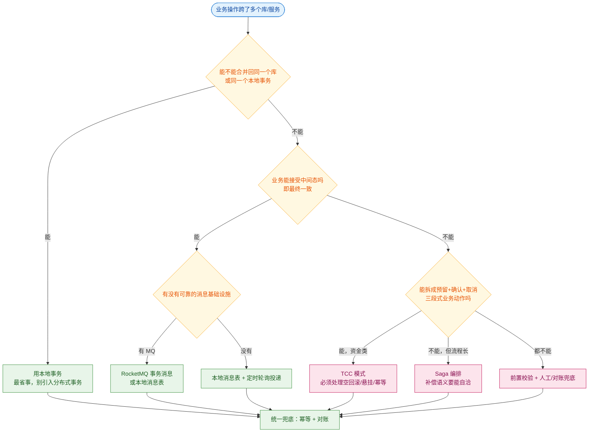
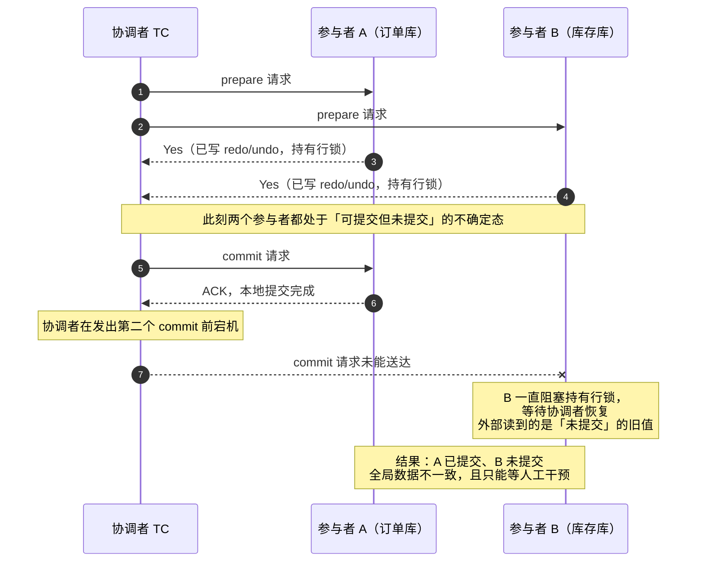
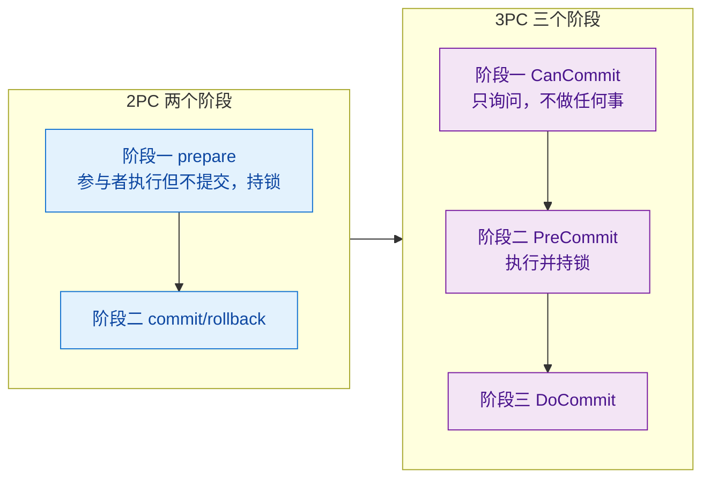
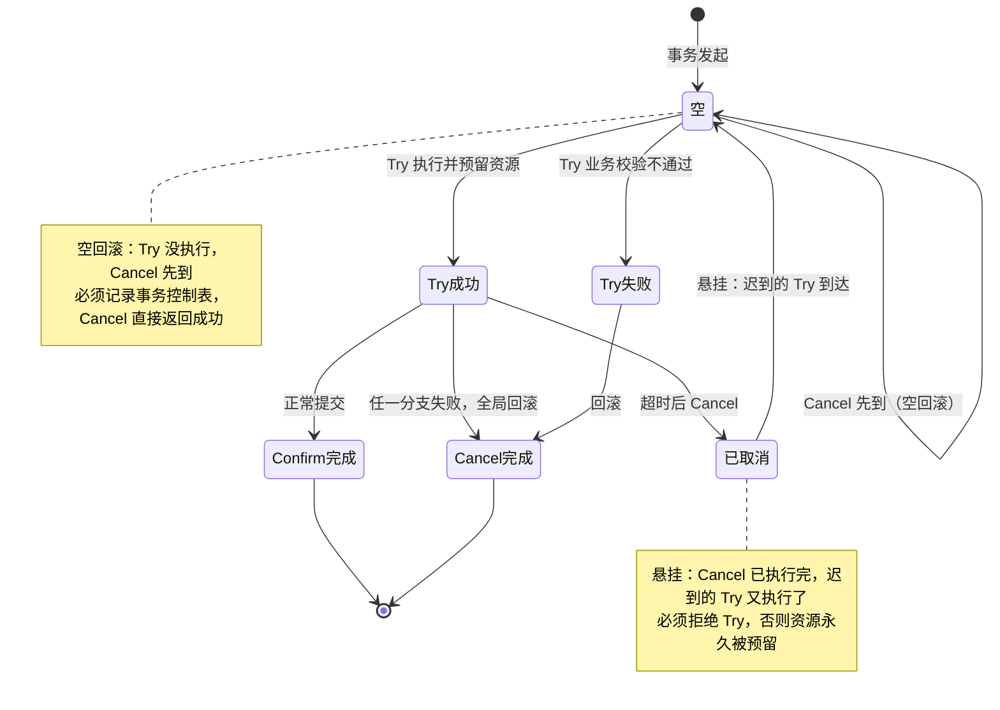
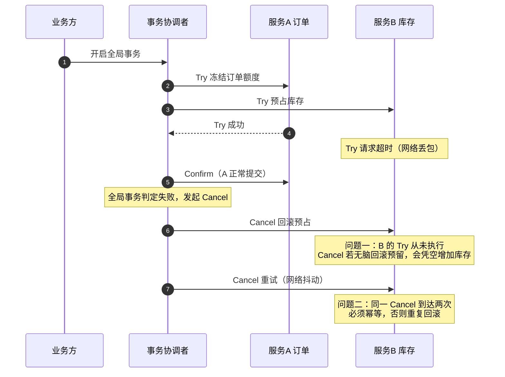
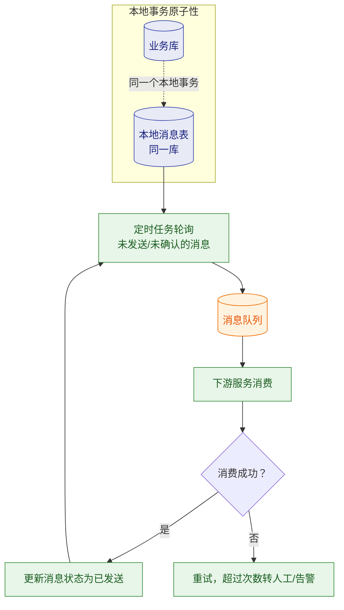
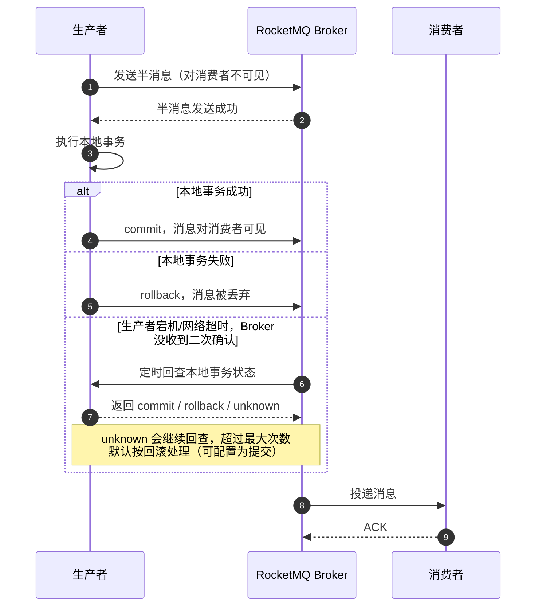
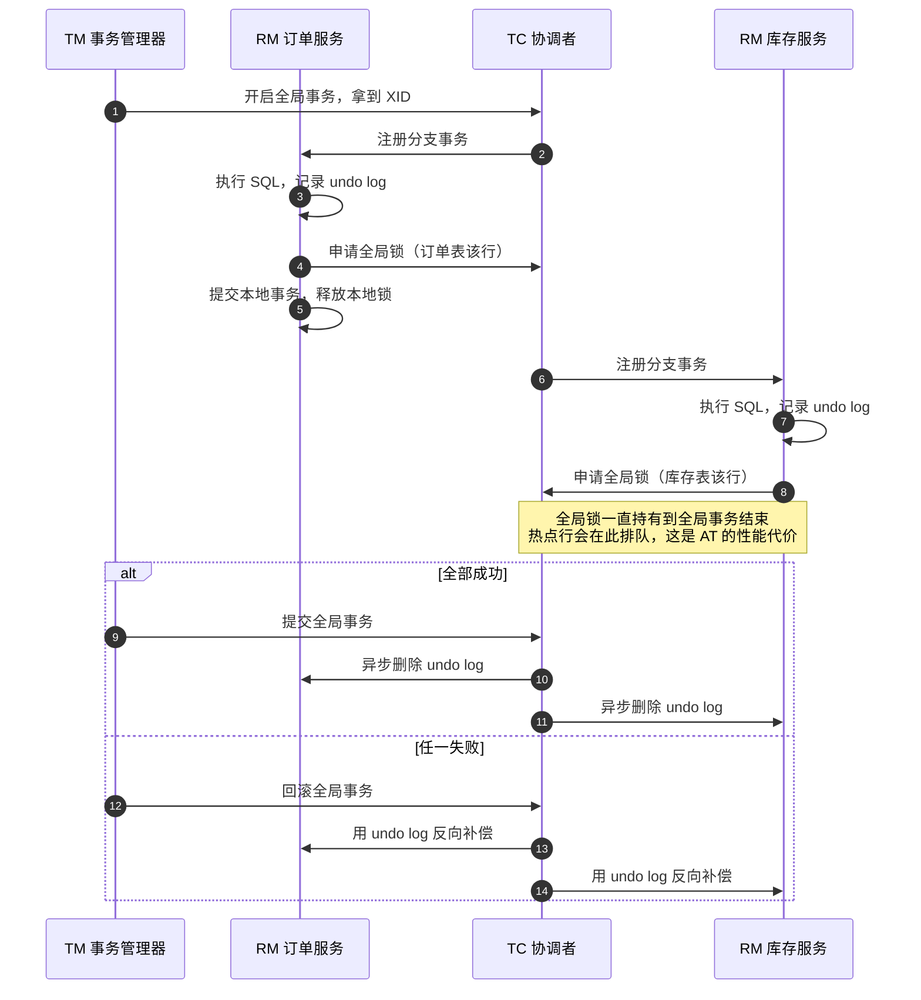
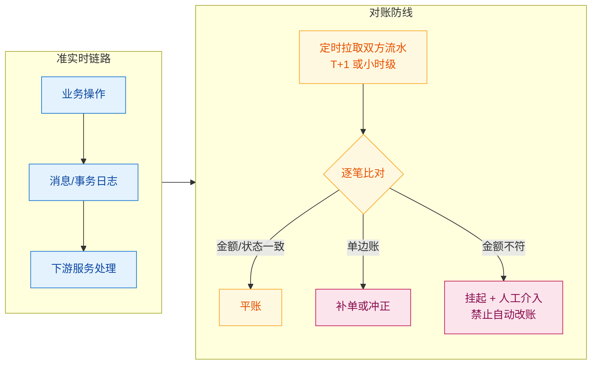

# 🔗 二、分布式事务

> 本篇回答的是：分布式事务到底在解决什么问题，**为什么"本地 ACID 的 C"和"分布式一致性的 C"根本不是一回事**；在动手选框架之前应该先做的决策是什么；2PC 阻塞和不一致的根因在哪一个具体时刻；TCC 的空回滚 / 悬挂 / 幂等三坑各自的成因与修法；消息型方案为什么能"可靠"；Seata 四种模式在生产里到底怎么选；以及最终一致性的最后一道防线——对账——该怎么落地。
> **与已有思维导图的分工**：[[分布式事务.excalidraw]] 已经把 ACID、强一致 vs 最终一致、XA/2PC/3PC、AT（undo log）、TCC、Saga、本地消息、Seata、RocketMQ 事务消息的概念骨架和名词解释铺完了，**本篇不重复"是什么"**，只做三件事：把导图里一笔带过的**失败场景**画出来、把每个方案的**代价量化成工程判断**、把**选型与踩坑**整理成可直接用于面试和落地的清单。
> 关联：[[幂等.excalidraw]]（幂等与防重，是所有补偿方案的隐含前提）、[[面试准备/技术面试题库/09-分布式与微服务]]（通用题库骨架）、[[面试准备/冠顿/04-事务一致性]]（面向岗位的事务一致性深挖）。
> 同系列：[[0-分布式总览]] · [[1-分布式理论基础]] · [[3-分布式锁]] · [[4-分布式ID与雪花算法]] · [[5-一致性哈希与负载均衡]] · [[6-缓存一致性与高可用]] · [[7-限流熔断降级]] · [[8-微服务架构与注册配置中心]] · [[9-分布式面试高频题]]

---

## 一、为什么要分布式事务：先分清两种"一致性"

### 1.1 单体时代的边界在哪里

单体应用里，"一个业务操作"和"一个本地事务"基本可以画等号，因为：

- 所有数据在**同一个数据库连接**上，`BEGIN ... COMMIT` 是一个原子动作；
- 数据库的 redo log 保证**持久性（D）**，undo log 保证**原子性（A）**，锁 + MVCC 保证**隔离性（I）**；
- 只要业务代码把这几条 SQL 放进一个事务，**数据库用一套机制同时兜住了 A/I/D**。

真正的分水岭不是"服务拆开了"，而是**事务的原子提交边界被切断了**。一旦一个业务动作写入了两个独立的存储（两个库、一个库 + 一个缓存、一个库 + 一次外部 RPC），就再也没有一个"本地事务"能把它包起来——因为 `COMMIT` 这个动作本身变成了两次，而两次 COMMIT 之间必然存在一个"只完成了一半"的时间窗口。

> [!important] 分布式事务要解决的核心问题只有一句话
> **在"两个存储的提交动作无法合并成一个原子动作"的前提下，如何让业务最终看起来像是一次成功或一次失败。**
> 注意"看起来像"三个字——绝大多数生产方案追求的是**最终看起来像**，而不是物理上真的原子。

### 1.2 ACID 的 C 和分布式一致性的 C 不是一回事

这是面试里最容易露怯、也最能体现深度的一问。两者都叫 Consistency（一致性），但**定义域、判定者、时间维度全都不同**。

| 维度 | 本地事务 ACID 中的 C | 分布式一致性（CAP / 一致性模型）中的 C |
| --- | --- | --- |
| **定义** | 事务把数据库从**一个合法状态**带到**另一个合法状态**，不违反任何完整性约束（主键、外键、唯一索引、CHECK） | 所有节点对同一份数据**在同一时刻**看到相同的值（线性一致性 / 强一致） |
| **约束来自哪** | **应用定义的业务规则 + 数据库 schema**，是"状态合法性" | **分布式系统的读写语义**，是"副本可见性" |
| **谁负责保证** | 应用写入逻辑 + 数据库约束；**AB 中只要 C 被破坏，往往是应用写错了** | 共识协议（Raft/Paxos）、复制策略、Quorum 读写 |
| **时间维度** | 事务提交那一刻成立即可（提交后数据合法） | 是**跨节点、跨时刻**的可见性要求，需要讨论线性化点 |
| **能否被"最终一致"替换** | **不能**。约束被违反就是数据错了，等一会儿也不会自己变对 | **能**。最终一致正是对 C 的一种弱化实现 |
| **典型反例** | 转账只扣了 A 没加 B，账户总额不再守恒 → 违反 C | 库存服务已经扣了、订单服务还在读旧值 → 但**读到的旧值本身是合法的** |

一句话总结：

> [!tip] 面试可以直接这么说
> **ACID 的 C 是"数据必须是合法的"，分布式一致性的 C 是"大家必须看到同一个值"。**
> 前者是**应用语义层面的正确性**，后者是**副本可见性层面的实时性**。
> 所以"用最终一致性换可用性"这件事，牺牲的是**副本可见性的实时性**，而**绝不能牺牲业务约束的合法性**——这就是为什么资金业务可以异步，但一定要有对账。

这个区分为什么重要？因为它直接推出下面这条设计原则：

**分布式事务方案（2PC/TCC/Saga/消息）解决的是"多个存储的提交能不能一起生效"，它不解决"业务规则对不对"。** 一个写错的 Saga 补偿逻辑，或者一个漏掉校验的 TCC Cancel，照样会破坏 ACID 的 C——而且因为流程更长、状态更多，破坏得更隐蔽。

### 1.3 拆分会带来哪些"本地事务白送"的东西

| 本地事务白送的保证 | 拆成微服务后 | 后果 |
| --- | --- | --- |
| **原子性**：要么全成要么全败 | 需要 2PC/TCC/Saga/消息来补 | 中间态可能被外部读到 |
| **隔离性**：并发事务互不干扰 | **几乎全部方案都放弃了全局隔离** | 脏读、不可重复读、写偏移（write skew）在业务层面暴露 |
| **即时一致性**：COMMIT 后立刻可见 | 变成最终一致，有一个不一致窗口 | 用户可能"付了钱但订单还没生成" |
| **回滚的确定性** | 变成"补偿"，补偿是**业务语义**不是物理回滚 | 补偿不保证能成功，可能只补偿了个寂寞 |

> [!warning] "隔离性缺失"是最被低估的一条
> 2PC 至少还持有行锁直到提交；**TCC / Saga / 消息型方案在整个流程期间几乎不持有任何数据库锁**。这意味着：
> - A 服务 Try 预留了 100 元额度，B 服务在中间态看到的是"额度已冻结"还是"已扣除"？取决于你 Try 的实现；
> - Saga 的中间态数据**对所有人可见**，其他并发事务可能基于这个中间态做出错误决策（典型的 write skew）；
> - 这类问题**框架帮不了你**，只能靠业务上的状态机 + 前置校验 + 幂等来兜。这也是为什么 §2 的"先做决策"比"选框架"重要得多。

---

## 二、先做决策：你到底需不需要分布式事务

### 2.1 负责人视角的四连问

大部分人上来就问"用 Seata 还是 RocketMQ 事务消息"，这是**技术选型倒推**。正确的顺序是逐层过滤，每一层都在问"这件事能不能不做"。

1. **这些操作真的必须在不同的库/服务吗？** —— 相当比例的"分布式事务"是**拆分不当**造成的。订单和库存如果本来就在同一个库、同一个业务域，硬拆成两个服务再引入分布式事务，是纯负收益。
2. **业务能接受中间态吗？** —— 能，就降级成**最终一致**，成本往往低一个数量级（本地消息表 vs TCC 的工程量差距是数量级的）。
3. **失败之后能不能补偿？** —— 能补偿，就考虑 Saga；不能回滚（比如已经给第三方发了货），就必须**前置**成"预扣 / 冻结 + 异步确认"，把不可逆动作推到流程最后。
4. **最坏情况兜得住吗？** —— 无论选哪个方案，**对账 + 人工介入通道**必须有。没有兜底方案的最终一致性不是架构，是赌博。

### 2.2 决策流程图



### 2.3 几个典型场景的正确做法

| 场景 | 拆错的做法 | 正确做法 | 理由 |
| --- | --- | --- | --- |
| 下单扣库存（未拆分，同库） | 引入 Seata AT | **本地事务** | 无收益，纯增加全局锁开销 |
| 下单扣库存（已拆服务） | 2PC / XA | **本地消息表或事务消息** | 允许最终一致；库存短暂超卖可用"预占 + 超时释放"处理 |
| 账户转账（同库两个账户） | TCC | **本地事务 + 行锁** | 同一库内 `UPDATE ... WHERE balance >= x` 就够，别上 TCC |
| 跨行转账（两个独立核心系统） | 最终一致 | 前置校验 + TCC 或 银行间清算 | 资金不可异步差错，且有监管对账 |
| 支付成功后发券 + 加积分 | TCC | **事务消息** | 发券/积分失败可以重试，天然幂等，无需预留资源 |
| 调用第三方（已发货、已开票） | 任何自动回滚方案 | **预扣 + 异步确认 + 对账 + 人工** | 第三方动作不可逆，物理回滚不存在 |

> [!tip] 判断口诀
> **"能不能把不可逆动作推到流程最后一步"** —— 能推到最后，绝大概率只需要最终一致；推不到最后（必须在中间就发出去），才需要 TCC 这种预留式方案。

---

## 三、理论基石：2PC 与 XA

### 3.1 2PC 的两个阶段与"阻塞"的本质

2PC（Two-Phase Commit）的两个阶段导图里已经有了，这里只讲**阻塞的本质到底是什么**：

- **阶段一（prepare / 投票）**：协调者让所有参与者执行事务但**不提交**。参与者此时完成的是"写 redo/undo、把事务置为 prepared 状态"，**并持有该事务涉及的所有行锁**。
- **阶段二（commit / rollback）**：协调者根据投票结果下发最终指令。参与者收到指令后才真正提交并释放锁。

所以阻塞的根因不是"网络慢"，而是：

> [!important] 2PC 的阻塞本质是「锁的生命周期被跨网络拉长了」
> 本地事务里，锁从"第一条写 SQL"持有到"COMMIT"，这个时间由**本地 CPU/IO**决定，是微秒到毫秒级。
> 2PC 里，锁从 prepare 一直持有到**收到协调者第二阶段指令**才释放，这个时间由**网络 RTT + 协调者调度 + 最慢的参与者 + 协调者是否活着**共同决定。
> 也就是说：**2PC 把"锁的持有时间"从"我能控制的本地时间"变成了"我无法控制的分布式时间"。** 热点行上，这直接把吞吐打下来，而且参与者之间会互相放大（A 慢 → 协调者等 A → B 的锁也一直不释放）。

### 3.2 协调者宕机在提交阶段：经典不一致故障

这是"部分提交（partial commit）"的教科书场景，也是 2PC 无法自愈的核心缺陷。



这个故障链上有三个独立的坏消息：

1. **协调者单点**：协调者本身是单点，它一挂，**所有**处于 prepared 状态的参与者全部被挂起。这不是"可用性下降"，是"参与者集体不可用"。
2. **不确定窗口**：参与者已经投了 Yes，它**不能**单方面决定提交或回滚（单方面回滚会和已经收到 commit 的参与者冲突）。它唯一能做的是**阻塞等待**。这就是所谓的"in-doubt transaction（未决事务）"。
3. **数据不一致且不可自动收敛**：一旦协商链条断在中间，A 提交了、B 没提交，系统进入一个**坏状态**。这个状态不会自己变好，只能靠协调者恢复后补发指令，或者 DBA 手工干预（很多数据库都有 `XA RECOVER` 之类的工具来处理未决事务）。

> [!danger] 这就是"强一致"方案的真实代价
> 2PC 提供的是**原子性**，但它把可用性完全绑在了协调者身上。CAP 意义上，2PC 在分区期间是"牺牲 A 保 C"的典型：**协调者不可达时，参与者宁可阻塞也不违反一致性。** 互联网业务通常无法接受这种阻塞，这是 XA 在互联网场景边缘化的根本原因。

### 3.3 3PC 缓解了什么，又为什么没人用

3PC 相对 2PC 只多做了一件事：**在 prepare 之前插入一个 CanCommit 阶段**，而且它做了一个关键的超时假设。



3PC 的改进逻辑：

- **CanCommit 阶段不执行任何写操作**，纯粹是"你们能不能做"。这排除了"参与者本地无法完成"这一类失败，让参与者进入 prepared 之前就先失败掉，减少无谓的持锁。
- **引入参与者超时自主决定**：这是 3PC 最核心的变化。如果参与者处于 PreCommit 之后、DoCommit 之前，**长时间收不到协调者的 DoCommit**，它可以选择**自行提交**（因为在这个状态里，所有参与者都已经投了 Yes，集体提交是安全的社会共识）。
- **PreCommit 阶段的作用**：把"能不能做"和"做但别提交"分开，使得超时判断有了依据。

**为什么实际几乎不用 3PC：**

| 原因 | 说明 |
| --- | --- |
| **仍然不是非阻塞的** | 3PC 只在"协调者宕机"且"参与者已过 PreCommit"这一种情况下避免了阻塞。如果失败发生在更早的阶段，或者发生网络**分区**（而不是节点宕机），参与者可能分裂成两组各自超时决策 → **直接脑裂，一致性反而更差** |
| **多一轮网络往返** | 延迟比 2PC 更高。在本来就因为阻塞而没人用的前提下，再加延迟毫无吸引力 |
| **解决不了数据不一致的根** | 它缓解的是"阻塞"，不是"部分提交"。参与者自主提交恰恰可能制造新的不一致 |
| **工程上没有广泛实现** | 主流数据库和中间件（MySQL XA、Oracle XA）实现的是 2PC，3PC 基本只存在于教材和面试题里 |

> [!question] 面试官爱问：3PC 能解决 2PC 的什么问题？
> 标准答法是：**3PC 通过"多一个 CanCommit 询问阶段 + 参与者超时机制"，把 2PC 中"协调者宕机导致参与者无限阻塞"这一种情况，改进为"参与者可基于自身超时状态做出决定"**，从而降低阻塞概率。
> **但只要补一句就能拉开层次**：它并没解决网络分区下的脑裂，也仍然是同步阻塞模型，多了一轮 RTT，工程上几乎无人使用——所以它更多是一个**理论上的改进尝试**，而不是一个可用方案。

### 3.4 XA 协议与数据库实现

XA 是 **X/Open 组织定义的分布式事务规范**，它把 2PC 抽象成一组标准接口，让数据库（作为 RM，资源管理器）和事务管理器（TM）能协作。MySQL 的 InnoDB 是支持 XA 的。

**XA 的完整命令序列：**

```
XA START 'xid';           -- 开启一个 XA 事务分支
  ... DML ...             -- 业务 SQL
XA END 'xid';             -- 结束这个分支的事务部分，此时还没 prepare
XA PREPARE 'xid';         -- 阶段一：prepared 状态，锁不释放
XA COMMIT 'xid';          -- 阶段二（成功路径）
XA ROLLBACK 'xid';        -- 阶段二（失败路径）
XA RECOVER;               -- 查看处于 prepared 状态的未决事务
```

注意 `XA END` 和 `XA PREPARE` 是**两个**命令，这一点很多人答不上来：`XA END` 只是标记"我不再往这个分支里加 SQL 了"，`XA PREPARE` 才真正做阶段一的提交准备。

**XA 的性能问题与实际使用边界：**

| 问题 | 具体表现 |
| --- | --- |
| **同步阻塞持锁** | 锁从 `XA PREPARE` 持有到 `XA COMMIT`，中间隔着协调者的网络往返，热点行吞吐断崖式下降 |
| **连接占用** | 一个 XA 分支会长时间占住数据库连接，连接池被拖垮（在连接池 `maxActive` 有限时尤其致命） |
| **未决事务堆积** | 协调者故障会导致 `XA RECOVER` 里堆积大量 prepared 事务，需要人工或补救程序定期清理，否则锁一直不释放 |
| **MySQL XA 的实现局限** | 历史上 MySQL XA 存在一些限制和 bug（比如崩溃恢复场景的处理、binlog 与 XA 的交互），各版本行为可能有差异；**跨界点（跨库/跨实例）使用时必须实际压测验证**，不能只信文档 |
| **与本地事务的心智负担** | 应用要处理 XID 的传递、重试、未决事务恢复，复杂度并不低 |

> [!warning] XA 的实际使用边界（工程判断）
> - **能用**：同一数据库实例内跨多个 schema、短事务、低并发、内部管理系统、批量任务。
> - **慎用**：高并发核心链路、事务内有外部 RPC、事务时长不可控的场景。
> - **别用**：互联网 C 端高频交易链路。这里的选择一定是"最终一致 + 幂等 + 对账"。
> - 一个容易被忽略的点：**XA 只覆盖支持 XA 的资源**。如果你的流程里还有一个 Redis 或一次 HTTP 调用，XA 对它们是无效的——**XA 的"事务边界"和"业务边界"往往对不齐**，这是它难以在微服务里落地的重要原因。

---

## 四、补偿型方案：TCC 与 Saga

### 4.1 TCC 的本质：把"锁"从数据库搬到业务层

TCC（Try-Confirm-Cancel）的核心思想是：**既然数据库的物理锁不能跨服务持有，那就用业务字段模拟一把"业务锁"**。

- **Try**：做业务检查 + **预留**资源（不是直接扣减）。比如"冻结 100 元"而不是"扣 100 元"，"预占库存"而不是"扣减库存"。
- **Confirm**：确认使用预留的资源。此时**不再做业务校验**（校验在 Try 已经做过），只做状态流转和实物落地。
- **Cancel**：释放预留的资源。

关键性质：

| 性质 | 说明 |
| --- | --- |
| 侵入性 | **最高**。每个参与者要写三个接口，且要考虑互相之间的状态流转 |
| 一致性 | 业务层面强一致（预留期间资源不会被别人用掉） |
| 隔离性 | **靠业务自己实现**。框架不提供，你只能通过"预留态数据对其他业务不可见"这类设计来近似 |
| 性能 | 比 2PC 好（不持有 DB 锁），但比消息型方案差（多一次 Try 的网络往返 + 资源占用） |
| 适用 | **资金、库存等资源必须被真正"锁住"的场景** |

### 4.2 TCC 的三个必须处理的坑

这三个坑不是"注意事项"，是**只要上线就一定会遇到**的故障。必须三者一起解决，缺一个都会出资金事故。

#### 坑一：空回滚（Empty Rollback）

**成因**：Try 请求因为网络原因**根本没到达**参与者（或者参与者处理超时后回滚了），但协调者认为全局事务失败，于是发出 Cancel。参与者收到 Cancel 时，**从来没有执行过 Try**。

如果 Cancel 的实现是"把冻结的 100 元加回余额"，那么在空回滚场景下，它会**凭空给账户加 100 元**——这是最典型的资金多发事故。

**修法**：参与者必须维护一张**事务控制表**（记录全局事务 ID / 分支事务 ID 的状态）。Cancel 执行前先查：**这个分支的 Try 到底执行过没有？**

- 没执行过 → 什么都不做，**直接返回成功**（对协调者来说 Cancel 成功即可）；
- 执行过 → 正常回滚。

#### 坑二：悬挂（Hanging / Suspended）

**成因**：Try 请求因为网络拥塞**延迟到达**。在它到达之前，协调者已经超时并完成了 Cancel。此时这个迟到的 Try 才被执行，**预留了资源但再也不会有人来 Confirm 或 Cancel 它**——资源被永久占用。

注意这里的时间顺序是反的：**Cancel 先执行完，Try 后到**。所以控制表必须能识别"这个事务已经被取消了"。

**修法**：Try 执行前先查控制表：

- 如果记录显示该分支**已经 Cancel 过** → **拒绝执行 Try**，直接返回失败；
- 否则正常执行并插入记录。

> [!important] 空回滚和悬挂是「一对镜像问题」
> - **空回滚**：Cancel 先到、Try 没来 → Cancel 要能"无中生有地成功"。
> - **悬挂**：Cancel 先到、Try 后到 → Try 要能"认出自己已经死了"。
> 两者的修法是**同一张事务控制表**的两个方向。所以标准实现里，**Try 和 Cancel 都必须先读写这张表**，`executeTry` 和 `executeCancel` 都要做状态判断。

#### 坑三：幂等（Idempotency）

**成因**：协调者的重试机制、网络抖动导致的重发、TC 故障恢复后的补偿调度，都会让 **Confirm 或 Cancel 被重复调用**。

- Confirm 不幂等 → 重复确认，重复扣款 / 重复发货；
- Cancel 不幂等 → 重复回滚，重复加钱 / 重复加库存。

**修法**：

- 用控制表的**唯一索引**（`xid + branch_id`）挡住重复插入；
- 用**状态机**做前置判断：只有状态是"已 Try"才能 Confirm，Confirm 后再来直接返回成功；只有状态是"已 Try"才能 Cancel，Cancel 后再来直接返回成功；
- 结合 `[[幂等.excalidraw]]` 里的方案（唯一键、状态机、防重 Token），不要自己发明新轮子。

#### 三坑的统一状态机



#### 三坑的时序对照



> [!example] 生产检查清单：TCC 上线前必须逐条确认
> 1. 是否有**事务控制表**，且 `(xid, branch_id)` 上有唯一索引？
> 2. `Try` 是否在执行前检查"是否已被 Cancel"（防悬挂）？
> 3. `Cancel` 是否在"没有 Try 记录"时**静默返回成功**（防空回滚）？
> 4. `Confirm` / `Cancel` 是否都是**幂等**的（状态机 + 唯一键）？
> 5. `Cancel` 是否**不会失败**？如果 Cancel 里调用了第三方接口，它失败了怎么办？——必须有重试 + 告警 + 人工通道。
> 6. **防悬挂的超时时间**与业务的最大执行时间是否匹配？Try 的迟到上限有没有评估过？
> 7. Try 预留的资源有没有**超时自动释放**的兜底（防止 Try 成功但协调者彻底失联）？
> 8. 是否有 `Try` 成功但**既不 Confirm 也不 Cancel** 的悬挂资源监控？

### 4.3 Saga：长流程的补偿，以及"补偿不等于回滚"

Saga 把一个长事务拆成 `T1, T2, ..., Tn` 一串**本地事务**，每个 Ti 都有一个对应的补偿动作 `Ci`。正常路径顺序执行；一旦 Tk 失败，就**反向**执行 `C(k-1), ..., C1`。

**两种编排风格：**

| 风格 | 机制 | 优点 | 缺点 |
| --- | --- | --- | --- |
| **协同式（Choreography）** | 各服务订阅事件、自发响应，没有中央指挥 | 简单、去中心化、无单点 | 流程分散在多个服务里，**难以看出全局流程**；参与方多了会形成"事件地狱"；循环依赖风险 |
| **编排式（Orchestration）** | 有一个中心协调者（Orchestrator）显式调用每一步 | 流程集中可见、易监控、易改流程 | 协调者是复杂度和潜在单点；协调者本身要保证高可用 |

**Saga 的关键认知（面试深水区）：**

> [!warning] 补偿（Compensation）不是回滚（Rollback）
> - **回滚**是物理的、精确的：undo log 一执行，数据回到事务开始前的**原值**。
> - **补偿**是**业务语义上的抵消**：它执行的是一个**新的正向业务动作**（比如给用户退 100 元、给库存加回 1 件），而不是把数据库恢复到过去。
>
> 由此推出三个必须接受的后果：
> 1. **补偿不可逆、不可再补偿**：退款这个动作本身如果失败了，你不能再"撤销退款"——只能重试或人工。
> 2. **补偿不保证成功**：补偿依赖外部系统（退款通道、库存服务），它可能失败。所以 Saga 一定要有**补偿重试 + 失败告警 + 人工工单**。
> 3. **补偿的语义未必能真正"抵消"**：给用户发了一张优惠券，他可能已经用掉了。这时候的补偿不是"收回券"（做不到），只能是"给他补一张等值的"或者"记一笔账下次抵扣"。**设计 Saga 时最难的工作就是问清楚：这个动作到底能不能被业务语义抵消？**

**Saga 的隔离性缺失（同样必须讲清）：**

- Saga 全程**不持有数据库锁**，中间态数据对所有并发事务可见；
- 典型问题：用户看到"已下单但库存未扣"的中间态并基于它下单 → 超卖；
- 缓解手段（都是业务层的）：语义锁（状态字段标记"处理中"）、版本号 / 条件更新、把中间态数据在查询侧过滤掉、业务流程上避免对中间态做决策。

### 4.4 TCC vs Saga：一张表分清

| 维度 | TCC | Saga |
| --- | --- | --- |
| 资源是否被"锁住" | **是**（Try 预留），别人用不了 | **否**，中间态完全暴露 |
| 一致性 | 业务层面接近强一致 | 最终一致 |
| 是否需要预留设计 | **必须**，每个参与方都要能"冻结" | 不需要 |
| 补偿的性质 | Cancel 释放预留（通常是安全的、幂等的） | 反向业务动作（可能失败、可能语义上抵不掉） |
| 侵入性 | 最高（三个接口 + 控制表） | 中（正向接口 + 补偿接口） |
| 适用 | 资金、库存等**稀缺资源** | 长流程、多步骤编排、资源不稀缺的流程 |
| 失败恢复 | Cancel 基本一定成功 | 补偿可能失败，需要重试与人工 |

> [!tip] 一句话选型
> **"这个资源在流程中间被别人抢走会不会出事？"** 会 → TCC；不会 → Saga 或消息型方案。

---

## 五、消息型方案：本地消息表、事务消息、最大努力通知

### 5.1 本地消息表：为什么它"可靠"

核心思想：**把"发消息"和"改业务数据"放进同一个本地事务**，这样两者要么都成、要么都不成。消息发不出去由**轮询补偿**解决，而不是靠 MQ 的可靠性。



**"为什么可靠"要能讲出这条推理链：**

1. **业务写入和消息写入在同一个本地事务里** → 不存在"业务成功但消息丢了"或"消息发了但业务回滚了"。这一步把分布式问题**降维成了本地事务问题**。
2. **消息表里存的是"意图"，不是"已发送"** → 即使投递失败、即使服务在投递中途崩溃，消息还在表里，下次轮询会重发。
3. **重发是允许的，因为下游幂等** → 所以这个方案的隐含前提是**下游必须幂等**（所以一定要链接 [[幂等.excalidraw]]）。
4. **投递语义是 at-least-once，不是 exactly-once** → 不要吹嘘"消息不重不丢"，准确说法是"**消息不丢，可能重复，靠幂等收敛**"。

**工程细节与代价：**

| 细节 | 说明 |
| --- | --- |
| 轮询间隔 | 越短延迟越低、DB 压力越大。通常秒级；可以用"**先投递后确认 + 定时扫表兜底**"降低延迟 |
| 消息堆积 | 表会越来越大，必须有归档/清理策略（已确认 N 天的消息归档到历史表） |
| 扫表性能 | 未发送索引要设计好（`status + next_retry_time`），否则全表扫会拖垮库 |
| 重复投递 | 必然发生，靠下游幂等；上游也可加"投递去重"（同一 message_id 只投一次） |
| 分库分表后 | 消息表跟着业务库走，扫表任务要覆盖所有分片——这是真实运维痛点 |
| 多机并发扫表 | 多实例同时扫会有并发重复投递，需要**分布式锁或分片扫描**，注意这里又要用到 [[3-分布式锁]] |

### 5.2 RocketMQ 事务消息：半消息 + 回查

它把"本地消息表"的思想**下沉到了 MQ 内部**，让应用不必自己建表、自己轮询。



**必须讲清的执行顺序（很多人答反了）：**

1. 生产者**先发半消息**（half message，存在 Broker 但消费者看不到）；
2. 半消息发送成功后，**才执行本地事务**；
3. 根据本地事务结果，向 Broker 发送 commit 或 rollback；
4. 如果 Broker **长时间没收到二次确认**，会**定时回查**生产者：向生产者询问"那笔本地事务到底成没成"。

对比本地消息表：**顺序是反的**（本地消息表是"先写库再发消息"）。这个顺序差异决定了各自的偏好场景。

**回查次数与超时的处理（面试追问点）：**

| 问题 | 处理方式 |
| --- | --- |
| 回查的总次数与间隔 | 由 Broker 配置（如事务消息回查的最大次数与检查间隔），达到上限仍未收到明确结果时，Broker 会按**默认策略**处理（通常倾向于回滚/丢弃，也可配置倾向提交）——**这个默认策略必须确认清楚，它决定了极端情况下是丢消息还是多消息** |
| 回查接口返回 unknown | 表示"我还没查出来"，Broker 会继续按间隔回查；所以要保证回查逻辑**一定能给出确定答案**（查本地事务状态表） |
| 生产者重启后回查 | 回查是通过 topic 回发给**生产者组**的，任意一个实例都可以响应；所以**回查逻辑必须是无状态可查的**（去 DB 查那笔事务的落地记录），不能依赖 JVM 内存里的状态 |
| 事务消息数量上限 | Broker 对未决的半消息有容量限制，堆积过多会导致新半消息发送失败。生产上必须监控未决事务数量 |
| 消费侧的幂等 | 与本地消息表一样，仍然是 at-least-once，下游必须幂等 |

> [!warning] 事务消息不能替代"业务校验"
> 一个常见的错误理解是"用了事务消息就不会不一致"。事实上它只保证**"本地事务成功 → 消息最终一定可见"**（或反过来按你的配置），它**不保证**下游能处理成功。下游处理失败仍然要靠重试 + 对账。所以它只是把"消息一定会发出去"这件事做实了，把不一致的窗口从"消息可能丢"缩小到"下游可能处理失败"。

### 5.3 最大努力通知

**思路**：不追求可靠投递，而是"我尽力通知你，通知不到你就来查"。典型实现：

- 发送方在本地事务提交后，异步调用接收方的通知接口；
- 按 **N 次、递增间隔**重试（如 1min/5min/10min/30min…）；
- 重试耗尽后**停止通知，记录日志，等接收方主动来对账查询**；
- 接收方必须提供**查询接口**（对账接口），且查询接口本身是幂等的查询。

**适用**：对一致性要求最低的场景，通常是**跨企业/跨公司**的交互（支付结果通知给商户、SaaS 回调给第三方）。

| 方案 | 一致性强度 | 复杂度 | 适用 |
| --- | --- | --- | --- |
| 本地消息表 | 最终一致（较强） | 中（要建表、写轮询） | 自己体系内的服务间 |
| RocketMQ 事务消息 | 最终一致（较强） | 低（MQ 已实现） | 有 MQ 基础设施，且愿意绑定 RocketMQ |
| 最大努力通知 | 最终一致（最弱） | 低 | 跨组织、允许"查证"的场景 |

---

## 六、Seata 四种模式对比与 AT 的机制细节

### 6.1 四种模式的对比表

| 维度 | **AT** | **TCC** | **Saga** | **XA** |
| --- | --- | --- | --- | --- |
| **一致性** | 最终一致（但本地事务提交后，靠 undo log 反向补偿） | 业务层面接近强一致 | 最终一致 | **强一致** |
| **隔离性** | **全局锁**提供写隔离；读隔离默认不保证（需 `SELECT FOR UPDATE`） | 业务自己实现 | 无（业务自己实现） | 数据库级别（本地锁） |
| **侵入性** | **最低**，只需 `@GlobalTransactional`，SQL 无需改写 | **最高**，三个接口 + 控制表 | **中**，正向 + 补偿接口 | 低（仅需数据源代理） |
| **性能** | 较好，但**全局锁是热点行的瓶颈** | 较好（无 DB 长锁，但要多一次网络往返 + 资源预留） | 好 | **最差**（同步阻塞 + 连接占用） |
| **适用场景** | 一般业务、快速接入、非热点数据 | 资金、库存等强约束资源 | 长流程、多服务编排 | 数据库间短事务、内部系统 |
| **回滚方式** | **自动**，框架用 undo log 生成反向 SQL | 手写 Cancel | 手写补偿 | 数据库 XA ROLLBACK |
| **主要风险** | 全局锁阻塞、undo log 膨胀、脏写防护依赖全局锁 | 空回滚/悬挂/幂等 | 补偿失败、语义无法抵消 | 阻塞、未决事务堆积 |

> [!important] AT 的定位要说准
> AT 常常被描述成"无侵入的强一致方案"，这是**不准确的**。准确说法是：
> **AT 用"本地事务先提交 + undo log 事后反向补偿"实现了最终一致；它用"全局锁"来防止阶段之间的脏写，从而在写写冲突上给出接近强一致的隔离，但代价是把并发压力集中到全局锁上。**
> 它是"**低侵入 + 足够好的一致性 + 热点行性能代价**"这个组合，不是免费的强一致。

### 6.2 AT 的执行流程与全局锁



**AT 的三个阶段（理解顺序很重要）：**

1. **一阶段**：RM 拦截业务 SQL，解析出"改前镜像（before image）"和"改后镜像（after image）"写入 undo log 表，**然后直接提交本地事务**。注意——**本地事务是先提交的**，这一点和 2PC 的 prepare 完全不同。
2. **申请全局锁**：在本地事务提交**之前**，RM 需要向 TC 申请该数据行的全局锁。拿到全局锁才能提交本地事务。
3. **二阶段**：全局提交时，异步删除 undo log（很快）；全局回滚时，用 undo log 的 before image 生成反向 SQL 并执行，然后删除 undo log。

**全局锁对并发的实际影响：**

| 影响 | 说明 |
| --- | --- |
| **持锁时间被拉长到全局** | 本地锁提交后就释放了，但全局锁要持有到**整个全局事务结束**。所以跨服务的全局事务越长，全局锁持有越久 |
| **热点行排队** | 同一行数据的并发全局事务会在 TC 上排队（申请不到全局锁时会重试等待），**吞吐随热点集中度急剧下降** |
| **全局锁 ≠ 数据库锁** | 它只在 Seata 体系内生效。**绕过 Seata 的直接 SQL（比如 DBA 手工改、其他不走 Seata 的应用）不受全局锁约束**，会破坏写隔离——这是 AT 隔离性的一个真实漏洞 |
| **锁冲突的表现** | 客户端会看到 `Global lock wait timeout` 类的异常，本质是拿不到全局锁导致的超时。生产上要监控这类异常的比例 |
| **与本地锁的关系** | 顺序是"先本地锁 → 再全局锁"，两者可能形成等待链，**理论上存在死锁可能**，所以全局锁等待必须有超时 |

**AT 的其他生产注意点：**

- **undo log 表会膨胀**：每笔全局事务的每个分支都写一条记录，高并发下这张表增长极快，必须有清理任务（Seata 自带清理，但要配置保留时长和清理频率）。
- **脏写（dirty write）防护靠全局锁**：如果业务绕过 Seata 直接改数据，回滚时的反向 SQL 可能覆盖别人的正确修改——这就是"回滚覆盖"事故。
- **不支持所有 SQL**：复杂 SQL（某些多表关联更新、`INSERT ... SELECT`、DDL）可能无法正确解析和生成反向 SQL，**上线前必须覆盖验证你的 SQL 形态**。
- **不适合长事务**：全局锁持有时长 = 全局事务时长。任何在全局事务内部做 RPC、发 MQ、等外部回调的写法都会造成灾难性的锁占用。**全局事务内的事务边界要尽可能短**。

### 6.3 Seata 各模式的选型判断

| 你的情况 | 推荐 |
| --- | --- |
| 想快速接入、SQL 形态简单、非热点数据 | **AT** |
| 资金/库存，资源必须被锁定 | **TCC** |
| 长流程、步骤多、有天然补偿语义 | **Saga** |
| 只在数据库层做、能接受阻塞、内部系统 | **XA** |
| 只是想解耦、能接受最终一致、有 MQ | **其实不需要 Seata**，用事务消息 |

> [!tip] 负责人视角：AT 是"降低接入成本"的工程妥协，不是"最优方案"
> 如果团队没有精力为每个参与者写 TCC 三接口，AT 是极好的起点；但一旦出现**热点行**，AT 的全局锁会成为最明显的瓶颈，这时候要么拆分热点（分片/异步串行化），要么把这条链路改成消息型最终一致。**能识别"什么时候该从 AT 撤出来"，比会配 AT 更重要。**

---

## 七、最终一致性的三道兜底

任何"最终一致"的方案，其实都在赌"消息一定会到、补偿一定会成功"。这个赌注必须用三道防线兜住。

### 7.1 第一道：幂等（前提，不是可选项）

所有补偿/消息型方案的投递语义都是 **at-least-once**，重复是**必然**而不是"可能的"。所以：

- 每个下游接口都必须是幂等的；
- 幂等的实现方式（唯一主键、乐观锁版本号、防重 Token、唯一序列号）**不在这里展开**，见 [[幂等.excalidraw]]；
- 一个容易忽略的点：**幂等键的选择决定了幂等的正确性**。用"请求 ID"幂等只能防重复提交；用"业务唯一键"（订单号 + 操作类型）才能防住 MQ 重投和补偿重放。**两者不能互相替代。**

### 7.2 第二道：重试与补偿的可观测性

| 要素 | 要求 |
| --- | --- |
| 重试策略 | 指数退避 + 最大次数上限，**不能无限重试**（会拖垮下游） |
| 死信处理 | 超过上限的消息进死信队列，**必须有人看**，不能只落库 |
| 告警 | 补偿失败、悬挂资源、未决事务数量，都要有指标和告警阈值 |
| 人工通道 | 必须有运营/客服能操作的**冲正、补单**入口，而不是让研发去改数据库 |
| 补偿的幂等 | 补偿本身也会重试，所以补偿同样要幂等 |

> [!danger] "补偿失败无人跟进"是最常见的生产事故形态
> 一个 TCC 的 Cancel 失败了，日志里打了一行 error，没有告警、没有重试队列、没有工单。三个月后对账时发现差异——**这时候已经查不清是哪一笔了**。
> 判断一个团队有没有真正把分布式事务做扎实，看的一个关键指标就是：**补偿失败的告警有没有人认领，有没有 SLA。**

### 7.3 第三道：对账（最后防线）



**为什么对账是"最后防线"而不是"可选项"：**

- 前两道防线（幂等、重试）都是**乐观假设**：假设消息最终会到、假设重试最终会成功。但存在"重试耗尽""人工误操作""外部系统不一致""代码 bug"这些**永远不会自愈**的差异；
- 对账是唯一的**双向、独立**校验：它不依赖消息链路，而是**直接对比双方的事实数据**，能发现前面所有环节的漏洞；
- 对账也是**唯一能发现"多做了"的手段**：幂等只能防重复，防不了"不该做的做了"。

**对账怎么落地：**

| 环节 | 做法 |
| --- | --- |
| **对账基准** | 谁是对账主体？通常是"以资金方/权威方为准"（比如以支付渠道的账单为基准） |
| **数据获取** | 双方各自导出**流水文件**（不是查库快照，要能精确到每一笔），通过对账文件交互 |
| **对账粒度** | 逐笔比对，不是比总额。总额相等但逐笔不同（A 少 B 多）是最危险的，**总额对账会漏掉** |
| **核对维度** | 单边账（我有你没有 / 你有我没有）、金额不符、状态不符（我成功你失败） |
| **差异处理** | 单边账 → 自动补单/冲正（要幂等）；金额不符 → **挂起 + 人工**，绝不自动改账 |
| **执行频率** | 关键业务 T+1 全量 + 小时级增量；高频场景可以做到准实时对账 |
| **可重入** | 对账任务本身要能重跑，且重跑必须幂等（同一天的对账结果不能重复入账） |
| **留痕** | 差异记录、处理人、处理结果全留档，满足审计要求 |

> [!example] 一个对账出差异的排查顺序
> 1. 先看**是否单边**：只有一方有记录 → 查消息是否发出、是否消费、消费是否失败；
> 2. 再看**状态是否一致**：双方都有记录但状态不同（我成功你失败）→ 查下游处理是否回滚、补偿是否执行；
> 3. 再看**金额**：金额不符 → 查是否有重复处理（累加型操作没幂等）、是否有并发覆盖（回滚覆盖）；
> 4. 最后查**时间**：跨日边界、事务提交时间 vs 业务时间不一致，是"看似的差异"——**对账口径的时间窗口必须先对齐**，否则每天都在报假差异。

---

## 八、生产选型决策表与踩坑清单

### 8.1 选型决策表

| 业务特征 | 一致性要求 | 资源是否稀缺 | 流程长度 | 推荐方案 | 关键代价 |
| --- | --- | --- | --- | --- | --- |
| 未拆分（同库多表） | 强 | — | 短 | **本地事务** | 无 |
| 已拆分、可异步、有 MQ | 最终 | 否 | 短 | **事务消息 / 本地消息表** | 下游必须幂等 |
| 已拆分、资金类 | 业务强一致 | **是** | 短 | **TCC** | 三接口 + 三坑处理 |
| 多渠道退款、跨多个步骤 | 最终 | 否 | **长** | **Saga** | 补偿语义 + 隔离性缺失 |
| 内部系统、数据库间 | 强 | 否 | 短 | **XA** | 阻塞、连接占用 |
| 跨组织（第三方） | 弱最终 | — | — | **最大努力通知 + 对账** | 一致性最弱，必须人工兜底 |
| 海量热点行、强隔离 | — | 是 | 短 | **不分库不分事务**：把热点行收敛到单库单表单线程 | 架构层面的取舍 |

### 8.2 踩坑清单（真实事故形态）

| 坑 | 表象 | 根因 | 修法 |
| --- | --- | --- | --- |
| **TCC 空回滚未处理** | 对账发现**资金多发** | Cancel 在没有 Try 的情况下执行了"加钱" | 事务控制表 + Cancel 幂等静默成功 |
| **TCC 悬挂未处理** | 资源被**永久占用**，无人 Confirm/Cancel | 迟到的 Try 执行后被遗忘 | Try 前检查是否已 Cancel，拒绝执行 |
| **Confirm/Cancel 不幂等** | 重复扣款 / 重复回滚 | 协调者重试 + 无状态判断 | 唯一索引 + 状态机 |
| **AT 全局锁导致热点行阻塞** | 高峰期大量 `lock wait timeout`，TP99 飙升 | 全局事务过长 / 热点行集中 | 缩短全局事务、拆分热点、改异步最终一致 |
| **AT 被非 Seata 客户端改数据** | 回滚时**覆盖了别人的更新** | 全局锁对绕过 Seata 的 SQL 无效 | 强制统一入口；或该链路不用 AT |
| **消息乱序** | 最终状态错误（后发的"取消"先到） | 多分区 / 多线程消费，顺序被打乱 | 按业务 key 分区有序、版本号/状态机拒绝旧消息 |
| **补偿失败无人跟进** | 差异**数月后**才发现 | 没有告警、没有工单、没有 SLA | 死信队列 + 告警 + 人工处理通道 |
| **未决事务堆积** | 数据库锁不释放，业务大面积超时 | 协调者故障 / 网络分区 | 监控未决数量，自动化清理程序 |
| **把分布式事务当事务用** | 全局事务里发 MQ、调 RPC、等回调 | 事务边界设计错误 | **全局事务内只做数据写**，其余操作移出 |
| **忽略对账口径** | 每天报大量"假差异" | 时间窗口/状态口径没对齐 | 先定义对账口径，再写代码 |
| **只做幂等不做防重** | 同一请求被处理两次 | 幂等键选错（用请求 ID 而非业务键） | 业务唯一键幂等，见 [[幂等.excalidraw]] |
| **依赖 MQ 不丢消息** | 数据缺失 | 误以为 MQ 是可靠投递 | MQ 是 at-least-once，必须幂等 + 对账 |

### 8.3 一张图串起全部

```
业务操作
  │
  ├─ 能本地事务？ ──是──▶ 本地事务（结束）
  │
  └─ 不能
       ├─ 能最终一致？
       │    ├─ 有 MQ ──▶ 事务消息 / 本地消息表 ──▶ 下游幂等消费
       │    └─ 无 MQ ──▶ 本地消息表 + 轮询投递
       │
       └─ 要业务强一致？
            ├─ 资源需锁定 ──▶ TCC（Try/Confirm/Cancel + 控制表）
            └─ 长流程可补偿 ──▶ Saga（正向 + 补偿）
  │
  └─▶ 无论哪条路径，都必须：幂等 + 重试告警 + 对账 + 人工通道
```

---

## 九、面试必答

> [!question] 分布式事务有哪些方案？
> 分四类回答，**先说分类再说方案**，比直接背方案名字有层次：
> 1. **强一致类**：2PC/XA（数据库层）、3PC（理论）——同步阻塞，互联网基本不用；
> 2. **补偿类**：TCC（预留式，业务强一致）、Saga（长流程补偿，最终一致）；
> 3. **消息类**：本地消息表、RocketMQ 事务消息、最大努力通知——最终一致的主流选择；
> 4. **框架**：Seata 的 AT（无侵入 + 全局锁 + undo log）、TCC、Saga、XA 四种模式。
>
> 然后补一句定调的话：**"所有非强一致方案都建立在幂等之上，且必须以对账作为最后防线。"**

> [!question] 怎么选？
> 三句话：
> 1. **能不拆就不拆**：能合并到同一个本地事务的，绝不引入分布式事务；
> 2. **能最终一致就不强一致**：默认选消息型方案（成本最低），只有资金/稀缺资源才上 TCC；
> 3. **长流程 + 可补偿语义选 Saga**，且必须确认"补偿在业务上真的能抵消"。
> 最后补**兜底**：无论选哪个，幂等 + 对账 + 补偿告警都是必配。

> [!question] TCC 的三个坑是什么？
> **空回滚、悬挂、幂等**，三个坑必须一起讲，并且要说清成因和修法是同一张事务控制表的两个方向：
> - **空回滚**：Try 未到达，Cancel 先到 → 若无脑回滚会**凭空加钱**。修法：Cancel 先查控制表，无 Try 记录则**静默返回成功**。
> - **悬挂**：Cancel 先执行完，迟到的 Try 后到 → 预留资源**永久无人回收**。修法：Try 前查控制表，已 Cancel 则**拒绝执行**。
> - **幂等**：Confirm/Cancel 会被协调者重试重复调用 → 重复扣款/重复回滚。修法：`(xid, branch_id)` 唯一索引 + 状态机前置判断。
> 收尾一句拉开层次：**"这三个坑不是理论风险，是 TCC 上线后必然遇到的故障，所以控制表不是优化，是必需品。"**

> [!question] 追问：2PC 和 3PC 的区别，为什么不用 3PC？
> 3PC 在 2PC 前加了 **CanCommit 询问阶段**，并引入**参与者超时自主决策**（PreCommit 后长时间收不到 DoCommit 可自行提交），把"协调者宕机导致无限阻塞"这一情况做了缓解。
> 但：① 网络**分区**下参与者可能各自超时决策 → **脑裂，一致性更差**；② 多一轮 RTT，更慢；③ 主流数据库只实现 2PC。**所以 3PC 是理论改进，工程上几乎不用。**

> [!question] 追问：Seata AT 的全局锁是什么，有什么影响？
> AT 一阶段会解析 SQL、记录 undo log、**先提交本地事务**，但在提交前必须向 TC 申请**该数据行的全局锁**，并一直持有到**全局事务结束**。
> 影响：① 热点行并发全局事务会在 TC 排队，**吞吐随热点集中度急剧下降**；② 全局事务越长、锁持有越久，所以**全局事务内绝不能做 RPC/MQ 等长耗时操作**；③ 全局锁**只在 Seata 体系内有效**，绕过 Seata 的直连 SQL 不受约束，会导致回滚覆盖（脏写）；④ 必须有全局锁等待超时，否则会吊死。

> [!question] 追问：RocketMQ 事务消息的回查是怎么回事？
> 生产者先发**半消息**（消费者不可见），半消息发送成功后才执行本地事务，再根据结果 commit/rollback。如果 Broker **长时间没收到二次确认**（生产者宕机或网络问题），会**定时回查**生产者：通过事务回查接口询问本地事务状态。回查会按配置的**间隔和最大次数**进行，达到上限仍未明确则按默认策略处理（**倾向回滚还是提交必须确认清楚**，它决定极端情况下丢消息还是多消息）。回查是由生产者**组**响应的，所以回查逻辑必须能**从 DB 查出确定答案**，不能依赖 JVM 内存状态。

---

## 十、关联笔记

| 笔记 | 关系 |
| --- | --- |
| [[分布式事务.excalidraw]] | 本主题的思维导图（概念骨架、名词定义） |
| [[幂等.excalidraw]] | **所有补偿/消息方案的隐含前提**，幂等的实现方式看这里 |
| [[3-分布式锁]] | 本地消息表多机扫表、防重复投递需要分布式锁 |
| [[分布式锁.excalidraw]] | 分布式锁导图 |
| [[1-分布式理论基础]] | CAP/BASE/一致性模型的理论底座 |
| [[0-分布式总览]] | 本系列索引 |
| [[面试准备/技术面试题库/09-分布式与微服务]] | 通用面试骨架（CAP/BASE/分布式事务/ID/限流） |
| [[面试准备/冠顿/04-事务一致性]] | 面向岗位的事务一致性深挖 |
| [[9-分布式面试高频题]] | 本系列面试汇总 |
