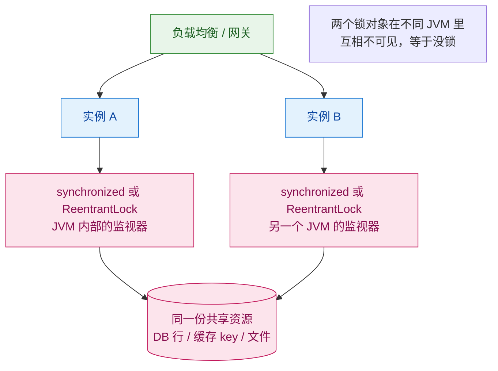
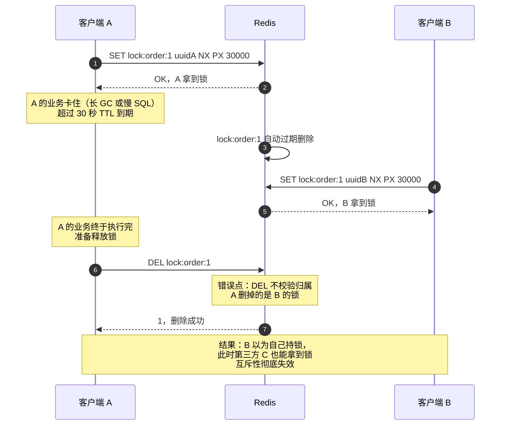
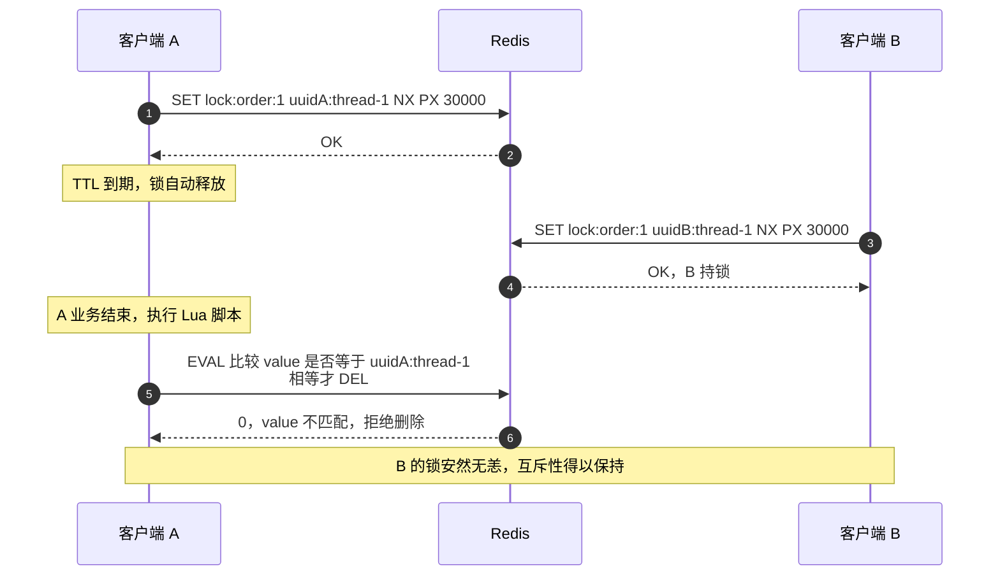
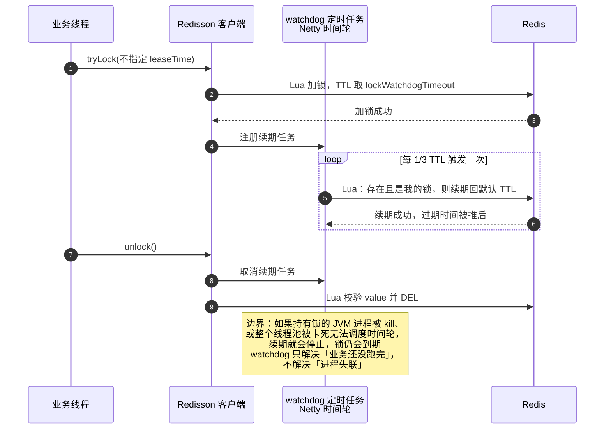
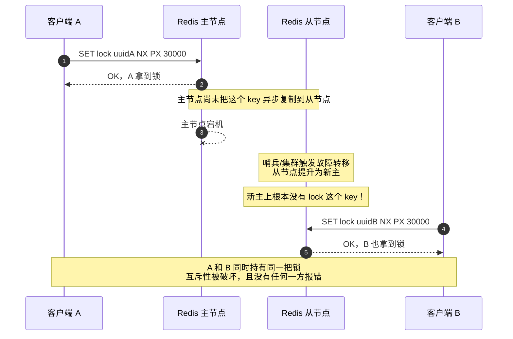
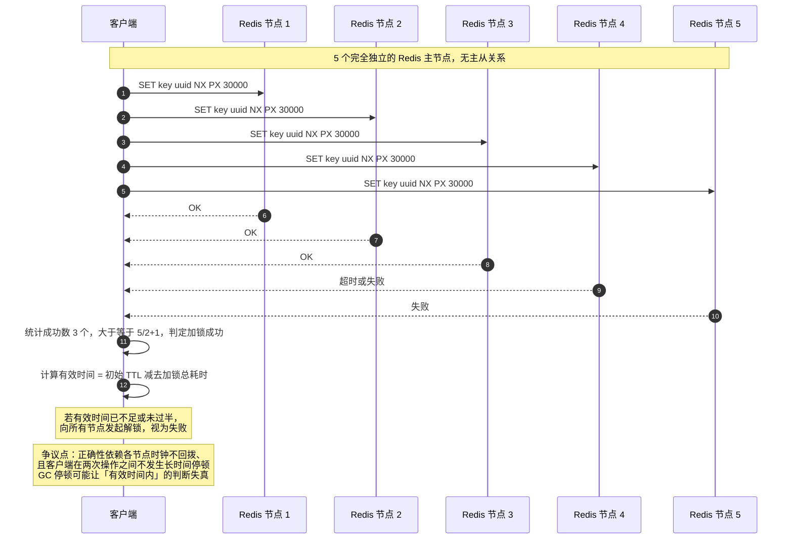
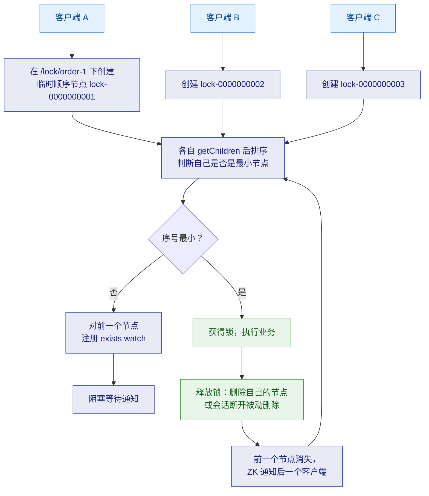
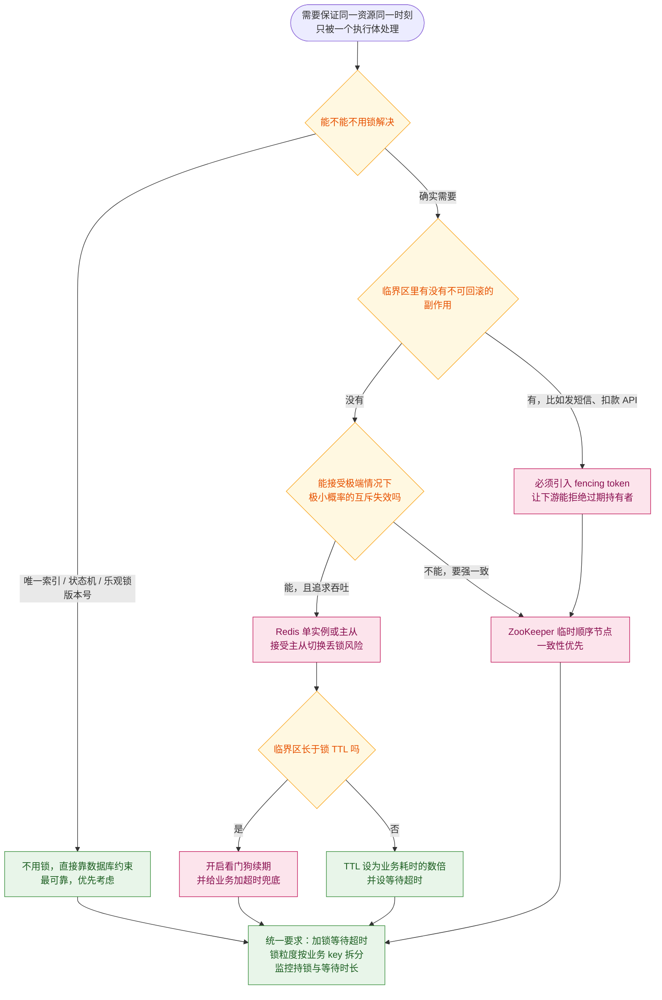
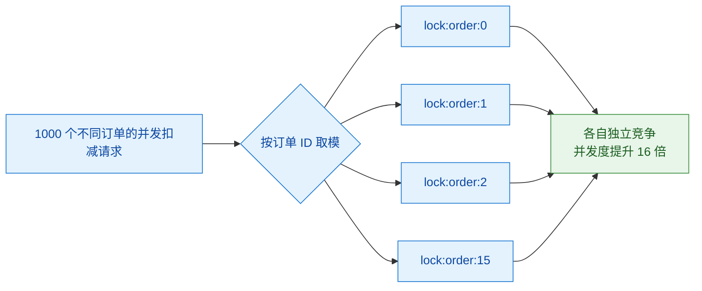

# 🔒 三、分布式锁

> 本篇回答的是：`synchronized` 和 `ReentrantLock` 为什么在微服务下**彻底失效**（以及失效的机制是什么）；一把合格的分布式锁必须同时满足哪几个条件，其中哪一条最容易被漏掉；Redis 锁从 `SET NX PX` 到 Lua 校验删除、再到 Redisson 可重入与看门狗，**每一步如果不那么写会出什么事故**；Redlock 的算法与 Martin Kleppmann 的批评到底在争什么；**主从切换丢锁**为什么是 Redis 锁绕不过去的本质风险；ZooKeeper 的临时顺序节点为什么天然免疫"锁过期"；以及什么时候**根本不该用锁**。
> **与已有思维导图的分工**：[[分布式锁.excalidraw]] 目前只有一段 Redis 加锁的 Java 代码草稿（`set(key, uuid, NX, PX, expire)` 加轮询重试），**没有形成体系**。本篇因此从零构建完整知识结构，并把那段草稿代码里**已经埋着的一个坑**点出来（见 §3.3，它只做了"存 uuid"，但没做"释放时校验 uuid"）。
> 关联：[[幂等.excalidraw]]（能用幂等/唯一索引解决的就不要用锁，见 §6.2）、[[面试准备/技术面试题库/09-分布式与微服务]]（通用题库骨架）、[[面试准备/冠顿/04-事务一致性]]（事务与锁的边界）。
> 同系列：[[0-分布式总览]] · [[1-分布式理论基础]] · [[2-分布式事务]] · [[4-分布式ID与雪花算法]] · [[5-一致性哈希与负载均衡]] · [[6-缓存一致性与高可用]] · [[7-限流熔断降级]] · [[8-微服务架构与注册配置中心]] · [[9-分布式面试高频题]]

---

## 一、为什么需要分布式锁

### 1.1 单机锁的适用边界

`java.util.concurrent` 和 `synchronized` 能生效，**唯一的原因是"所有竞争者在同一个 JVM 里"**。具体机制是：

| 锁 | 底层依赖 |
| --- | --- |
| `synchronized` | 对象头 Mark Word + Monitor（管程），JVM 内部的**对象监视器**；偏向锁/轻量级锁/重量级锁的升级都由**本 JVM** 管理 |
| `ReentrantLock` | `AbstractQueuedSynchronizer`（AQS）的 `state` 变量 + CLH 等待队列，**全部是 JVM 堆内存里的对象** |
| `StampedLock` / `ReadWriteLock` | 同样基于 AQS / 内存状态 |

它们共同的本质：**锁的状态存在 JVM 的堆里（或对象头里）**。这意味着：

- 另一个 JVM 的堆里有一份**完全独立**的锁状态；
- 两份状态之间**没有任何同步机制**；
- 所以"实例 A 加锁了"这件事，实例 B **根本不可能知道**。

> [!important] 一句话理解
> **单机锁保护的是"线程"，分布式锁保护的是"实例"。**
> 单机锁的作用域是 JVM；一旦部署了 2 个及以上实例，作用域就从"整个系统"缩水成了"其中一个实例"，锁也就形同虚设。

### 1.2 失效场景：两个实例 + 单机锁 + 同一资源



具体的事故形态（这些才是面试里能加分的细节）：

| 场景 | 单机锁为什么挡不住 |
| --- | --- |
| **库存扣减** | A 实例扣完库存 1，B 实例同时读到旧值再扣一次 → **超卖**。两个实例各自"合法"地通过了 `if (stock > 0)` 检查 |
| **定时任务重复执行** | 部署了 3 个实例，每个实例的 `@Scheduled` 都会触发 → 同一批数据被处理 3 次（这是最常见的分布式锁使用场景） |
| **缓存击穿重建** | 多个实例同时发现缓存失效，各自去查库回填 → 数据库瞬时被打爆 |
| **幂等/防重失效** | 单机 `ConcurrentHashMap` 做防重表，实例 B 看不到 A 的记录 → 重复请求被处理两次 |
| **发号器重复发号** | 单机内存自增，多实例同时发同一个号 |
| **状态机跃迁** | A 实例把订单从"待支付"改成"已支付"，B 实例同时改成"已取消" → 状态互相覆盖 |

> [!warning] 一个非常容易忽略的变体：**同类锁在不同层面的混淆**
> 有些团队以为加了 `@Transactional` 或者 `synchronized` 加在 Service 方法上就够了。实际上：
> - `@Transactional` **不是锁**，它基于 MVCC + 行锁，只保证单行/单事务内的隔离，**不阻止两个事务都读到旧值再各自更新**（除非显式 `FOR UPDATE` 或用乐观锁）；
> - `synchronized` 加在 `@Transactional` 方法外层还是内层，**语义完全不同**（见 §7 踩坑清单里的"锁在事务外层"）。

---

## 二、分布式锁的四个必要条件

这是面试的标准骨架，但**能讲出"为什么"才算过关**。我把它拆成五条（第四条常被拆成两条）。

### 2.1 互斥（Mutual Exclusion）

**任意时刻，只有一个客户端能持有锁。**

这是锁的定义，看似废话，但要注意一个关键限定：**悲观互斥**。分布式锁是悲观策略——先抢锁再干活。它的替代品是乐观策略（CAS/版本号/唯一索引），二者不是互斥的，后面 §6.2 会讲什么时候该用哪个。

### 2.2 防死锁（Deadlock Free）——必须有自动释放机制

**为什么必须有？** 因为持锁的客户端可能**在释放锁之前就消失了**：

- 进程被 `kill -9`；
- 机器宕机 / 容器被驱逐；
- 网络分区，客户端还在跑但连不上锁服务；
- 更隐蔽的：**死循环、无限重试、被 `Thread.stop`**。

如果没有自动释放，这把锁就**永久**留在锁服务上，所有后来的请求全部阻塞到超时——这个副作用比不加锁严重得多。

**解决的两种范式（这是 Redis 锁与 ZK 锁最本质的分野）：**

| 机制 | 代表 | 释放触发条件 | 本质 |
| --- | --- | --- | --- |
| **租约 / TTL（Lease）** | Redis `SET NX PX` | **时间到了，锁自动消失** | 用**时间**近似"客户端还活着" |
| **会话（Session）** | ZooKeeper 临时节点 | **会话断了，节点自动删除** | 用**连接存活**近似"客户端还活着" |

> [!important] 这两种机制推导出了两种锁各自的致命缺陷
> - **TTL 范式**：靠"时间"判断客户端是否还活着。所以**客户端没死但时间到了** → 锁被提前释放 → 别人拿到锁 → 互斥被破坏（锁过期问题，§3.4）。
> - **会话范式**：靠"连接"判断。所以**客户端没死但网络断了**（比如长 GC 导致 ZK 心跳超时）→ ZK 认为会话结束，**主动删掉锁** → 别人拿到锁 → 同样互斥被破坏（只是发生概率不同）。
>
> **结论：没有任何分布式锁能绝对保证"持有者还活着"。** 这是分布式系统的物理限制（FLP / 时钟不可靠），不是实现问题。正确的应对不是"找一个绝对安全的锁"，而是**让下游能识别过期持有者**（fencing token，§3.6）。

### 2.3 可重入（Reentrancy）

**同一个客户端（严格说是同一个线程）再次请求自己已持有的锁时，应当成功，而不是自己把自己锁死。**

**为什么常考？** 因为它是一个从"单机直觉"迁移过来的真实需求：

```java
public void methodA() {
    lock.lock();
    try {
        methodB();   // methodB 内部也 lock.lock()
    } finally {
        lock.unlock();
    }
}

public void methodB() {
    lock.lock();     // 如果不是可重入锁，这里直接死锁
    try { ... } finally { lock.unlock(); }
}
```

`ReentrantLock` 是可重入的（AQS 用一个 `state` 计数），所以单机时代这种嵌套调用没问题。**如果换成一个不可重入的分布式锁，这个调用链会直接自死锁**——这就是"可重入缺失导致自死锁"这个坑的来源。

**实现上需要额外的信息**：既要记录"锁是谁的"，还要记录"被同一个人加了几次"，解锁时要**减到 0 才真正删除**。这就是 Redisson 用 Hash 结构的原因（§3.5）。

> [!note] 可重入是"可选但常考"
> 严格说它**不是**锁的必要条件（很多封装好的分布式锁就是不可重入的，靠约定"不要嵌套加锁"来规避）。但面试问到时，**要说清楚它的实现代价**（需要额外存重入计数）和**不实现的后果**（嵌套调用自死锁），以及 Redisson 是怎么做的。

### 2.4 高可用（High Availability）

**锁服务本身不能是单点。**

这一条经常被答漏，但它恰恰是 Redis 锁最大的软肋：

- 如果锁服务**单点**，它挂了整个系统就锁不住（或者全部阻塞）；
- 如果锁服务**有主从**，那就有**主从切换期间锁丢失**的问题（§3.6，Redis 锁最本质的风险）；
- 想要真正的高可用 + 强一致，就得用共识协议（ZK/etcd 的 Raft/ZAB），代价是性能。

| 部署形态 | 可用性 | 一致性 | 丢锁风险 |
| --- | --- | --- | --- |
| Redis 单实例 | **低**（挂了就没了） | 高（单点即真理） | 无（但服务本身不可用） |
| Redis 主从 + 哨兵 | 中高 | **低**（异步复制） | **有**（主从切换时） |
| Redis Cluster | 高 | **低**（异步复制） | **有**（分片主切换时） |
| Redlock（多独立主节点） | 高 | 中（多数派） | 有争议（依赖时钟） |
| ZooKeeper / etcd | 中高 | **高**（多数派写入） | 天然缓解（会话机制） |

### 2.5 锁的归属必须可验证（Ownership Verification）

**这是最容易被忽略、也最容易出人命事故的一条。**

"能加锁、能解锁"是不够的。**释放锁的时候，必须验证"这把锁现在还是我的"**。原因是：

1. 客户端 A 拿到锁，设置 TTL = 30s；
2. A 的业务卡住了（长 GC、慢 SQL、被 swap），超过 30s；
3. 锁自动过期，客户端 B 拿到同名锁；
4. A 的业务终于跑完，执行"解锁"；
5. **如果解锁只是 `DEL key`，A 删掉的是 B 的锁！**
6. 此时客户端 C 也能拿到锁 → **B 和 C 同时持锁，互斥彻底失效**。

所以第 5 步绝不能是裸 `DEL`，必须是"**校验 value 是我，才删除**"，而且校验和删除必须是**原子的**（Lua 脚本或 `WATCH`+事务）。见 §3.3。

> [!tip] 五条的面试表述（按重要性排序）
> **互斥**（基本定义）→ **防死锁**（必须有自动释放）→ **归属可验证**（释放时必须校验，否则误删他人锁）→ **高可用**（锁服务不能单点）→ **可重入**（可选，但嵌套调用需要）。
> 把"归属可验证"单独拎出来讲，是区分"背过 Redis 锁"和"真出过事故"的分水岭。

---

## 三、基于 Redis 的实现（重点）

### 3.1 加锁：为什么必须一条命令原子完成

**正确写法：**

```
SET lock:order:123 <unique-value> NX PX 30000
```

- `NX`：key 不存在才设置，保证互斥；
- `PX 30000`：30 秒后自动过期，防死锁；
- `<unique-value>`：唯一标识（如 `UUID + 线程ID`），用于释放时校验归属。

**错误写法（经典事故）：**

```
SETNX lock:order:123 <value>     -- 第一步：加锁
EXPIRE lock:order:123 30         -- 第二步：设置过期
```

**为什么错？** 这两条命令之间有一个**时间窗口**：

1. 客户端执行完 `SETNX` 成功，**还没来得及执行 `EXPIRE`**；
2. 此时进程崩溃 / 网络断开 / 电源掉电；
3. **这个 key 就永远没有过期时间**，成为一把"永不释放"的锁；
4. 后续所有请求全部阻塞，**整个业务链路被这一把锁锁死**，只能人工上 Redis 删 key。

> [!danger] 这个坑在生产上非常经典
> 它危险在于**窗口极短（微秒级），但后果是永久性的**。它不可能在测试环境复现，只会在高并发 + 恰好崩溃时出现一次，然后**整个系统挂死**，排查时所有人都觉得"代码没问题"。
> **结论：加锁必须是一条命令。** Redis 2.6.12 起 `SET` 支持 `NX`/`PX` 参数就是为了解决这个问题。**任何"先 setnx 再 expire"的写法，无论加多少重试和判断，都是错的。**

类似的错误变体：

| 写法 | 问题 |
| --- | --- |
| `SETNX` + `EXPIRE` 两条命令 | key 可能永不过期（上面） |
| `SET` + `EXPIRE` 两条命令 | 同上，而且 `SET` 还会覆盖别人已持有的锁 |
| `SETNX` + `EXPIRE` 放进 `MULTI` 事务 | Redis 事务**不支持回滚**，且 `SETNX` 的结果在 `EXPIRE` 执行前无法判断，逻辑仍然脆弱 |
| 用 `GETSET` 手动实现 | 逻辑复杂、极易写错，且不能原子地设置 TTL |
| 先 `GET` 判断，再 `SET` | **竞态**：两次操作之间别人可能已经加锁 |

### 3.2 value 为什么要存唯一标识

如果 value 是固定值（比如 `"1"` 或 `"locked"`），**解锁时无法区分"这是我的锁"还是"别人的锁"**，就退化成裸 `DEL`。

唯一标识的常见构造：

| 构造方式 | 说明 | 是否推荐 |
| --- | --- | --- |
| `UUID` | 每个客户端实例一个，够用但**无法区分同实例内的不同线程** | 一般 |
| `UUID + 线程ID` | 可以定位到具体线程，方便排查 + 支持可重入计数 | **推荐** |
| `requestId`（业务请求 ID） | 业务可追溯性好，但同一个客户端处理不同请求时 value 会变，**不利于可重入** | 视场景 |
| `实例IP + 线程ID` | 可读性好，但容器环境下 IP 可能重复 | 谨慎 |

> [!warning] 一个反直觉点
> 很多人以为"value 随便存什么，反正只是占位"。实际上 **value 是这整个方案里唯一能证明"锁归谁"的凭据**。它承担了两件事：
> 1. **释放时的归属校验**（防止误删他人锁）；
> 2. **可重入的计数载体**（Redisson 用 Hash 存 `{uuid:threadId: count}`）。
> 所以 value 的**唯一性粒度必须和你的"锁粒度语义"对齐**：如果你希望"同实例内不同线程不能同时持锁"，那 value 必须精确到**线程**。

### 3.3 释放锁：必须用 Lua 原子校验并删除

**为什么不能分两步（先 GET 比较，再 DEL）？**

因为 `GET` 和 `DEL` 之间存在窗口：

1. A 执行 `GET key`，返回自己的标识 → 判断"是我的锁"；
2. **在这个瞬间，A 的锁恰好 TTL 到期，锁被 Redis 删除**；
3. B 拿到这把锁；
4. A 执行 `DEL key` → **删掉了 B 的锁**。

即便加了比较，竞态窗口依然存在。所以**"比较"和"删除"必须是一次原子操作**。

**标准 Lua 脚本（释放锁）：**

```lua
-- KEYS[1] = 锁的 key
-- ARGV[1] = 加锁时写入的唯一标识
if redis.call('GET', KEYS[1]) == ARGV[1] then
    return redis.call('DEL', KEYS[1])
else
    return 0
end
```

**关键点解析：**

| 点 | 说明 |
| --- | --- |
| **为什么用 Lua** | Redis **单线程执行 Lua 脚本**，脚本内的所有命令不会被其他客户端命令插入，因此天然是原子的 |
| `GET` 比较的是**字符串完全相等** | 所以 value 的构造必须稳定（同一个锁持有者前后必须生成相同的字符串），不能每次都生成新 UUID |
| 返回值语义 | 返回 `1` 表示删除成功（确实是我的锁）；返回 `0` 表示**不是我的锁，没有删除**。业务上要能区分这两种情况，因为 `0` 往往意味着"我的锁已经过期了，我可能已经失去了互斥保护"——这是**需要告警的信号** |
| 不要用 `redis.call('EXISTS')` 代替 | `EXISTS` 不比对 value，等于没校验 |

**解锁时的归属校验为什么必须返回并检查结果：**

一个高级实践是：**如果解锁脚本返回 0，说明锁在我持有期间就已经过期了**。这意味着在锁过期到我解锁之间的这段时间里，可能有其他客户端也进入了临界区——**这段业务逻辑可能被并发执行了**。生产上应该：

- 打**错误日志**并携带业务上下文；
- 上报**监控指标**（"锁提前失效"次数）；
- 必要时**触发人工核查**（比如这笔资金操作需要复核）。

> [!example] 对照导图里的草稿代码
> [[分布式锁.excalidraw]] 里的实现是：
> ```
> private boolean setRedis(String key, long expire) {
>     String uuid = SnowIDUtil.uniqueStr();
>     lockFlag.set(uuid);              // 把 uuid 存到 ThreadLocal
>     return commands.set(key, uuid, NX, PX, expire);   // 一条命令，这个是对的
> }
> ```
> 它做对了两件事：**用一条 `SET ... NX PX` 原子加锁**、**存了唯一 value 到 ThreadLocal**。
> 但**解锁部分没有出现**——如果解锁写成了 `redisTemplate.delete(key)`，那就正好踩中下面这个事故。这是草稿代码最需要补上的地方。
> 另外它用一个 `lockFlag` ThreadLocal 存 value，**在 `ThreadLocal` 泄漏和线程池复用**（线程被复用但 ThreadLocal 没清理）的场景下会有问题，Redisson 用 Hash 结构 + 线程 ID 的方式更稳。

**误删他人锁的完整事故时序：**



**正确姿势的时序对照：**



### 3.4 锁过期但业务没执行完：三种应对

这是 Redis 锁最根本的矛盾：**TTL 太短会提前释放锁，太长则死锁后恢复慢**。而业务执行时间**天然是不可预测的**（取决于 GC、下游延迟、数据量）。

三种应对方式，**按推荐度排序**：

#### 方式一：看门狗自动续期（Redisson 的做法）—— 首选

思路：加锁时**不指定** `leaseTime`，Redisson 会用默认的 `lockWatchdogTimeout` 作为 TTL，并启动一个后台定时任务，**在锁过期前自动续期**，直到业务显式解锁。



**必须讲清的续期边界（这是区分深度的关键）：**

| 边界 | 后果 |
| --- | --- |
| **进程被 `kill -9`** | 续期任务直接消失，锁在 TTL 后过期 → **这是期望行为**（进程都死了，锁本就该释放） |
| **长 STW GC / 线程池被占满** | 续期任务**无法被调度**（Redisson 的续期跑在 Netty 时间轮上，如果整个 JVM 卡死，它一样跑不了）→ 锁可能过期，而业务线程在 GC 结束后**继续执行临界区代码** → **互斥被破坏**。这正是 Kleppmann 批评的核心场景 |
| **Redis 主从切换** | 续期请求可能发到了新主，而新主上这把锁根本不存在 → 续期失败 → 锁提前释放（或续期脚本判断"不是我的锁"而返回失败） |
| **续期本身失败（网络抖动）** | Redisson 会重试；但如果连续失败到 TTL 耗尽，锁照样过期 |
| **业务真的死循环** | 看门狗会**不断续期**，锁永远不释放 → **等于没有 TTL**。这是看门狗的一个反直觉风险：**它把"防死锁"这件事重新交还给了业务**。所以业务侧必须有自己的超时/熔断 |

> [!danger] 看门狗最容易被误解的一点
> 很多人以为"开了看门狗就万无一失"。恰恰相反：**看门狗把锁的持有时间从"有上界"变成了"无上界"（只要续期任务还活着）**。
> 所以正确的组合是：**看门狗续期 + 业务侧超时兜底**。业务必须有超时（比如用 `Future.get(timeout)` 或给下游设超时），保证临界区不会无限执行。否则一个死循环就能让这把锁永远不释放，比"锁提前过期"还糟。

#### 方式二：把 TTL 设足够长 —— 有风险，但简单

- **优点**：实现简单，不需要额外组件；
- **风险**：① TTL 设多长都是**猜**（业务 P99 是 2s，设 30s 看似安全，但一次 Full GC + 下游雪崩就可能到 60s）；② 一旦真死锁，**恢复时间 = TTL**，设成 10 分钟就要等 10 分钟；③ 无法应对"业务耗时随数据量增长"（批处理任务数据量翻倍、耗时翻倍）。
- **适用**：临界区**耗时稳定且可预估**的短操作（一段固定的 Redis 更新、一次固定大小的本地计算）。

#### 方式三：业务侧兜底 —— 无论选哪种都必须有

这一条常被当成"补充"，实际上它是**必需品**：

| 兜底手段 | 作用 |
| --- | --- |
| **锁过期检测**（解锁脚本返回 0 时告警） | 能发现"锁提前失效"，这是事后追溯的唯一线索 |
| **下游幂等**（见 [[幂等.excalidraw]]） | 即使两个客户端同时进入临界区，下游也能收敛，**这是最后一道防线** |
| **fencing token**（§3.6） | 让下游能**主动拒绝**过期持有者，而不是被动接受重复写入 |
| **业务状态机 / 版本号** | 比如 `UPDATE ... WHERE status = '待处理'`，第二个执行者会更新 0 行而失败 |

> [!tip] 面试答"锁过期怎么办"的标准结构
> 分三层：① **预防** → 看门狗自动续期（Redisson 默认机制，续期间隔约为 TTL 的 1/3），前提是**不显式指定 leaseTime**；② **承认边界** → 看门狗解决不了进程被 kill、长 GC 导致续期任务不执行、主从切换丢锁，它只是降低概率而非消除；③ **兜底** → 业务侧超时 + 下游幂等 + 关键场景 fencing token 或强一致存储。
> 结论句：**"真正的答案是「TTL + 续期 + 幂等 + fencing」的组合，没有单一手段能解决。"**

### 3.5 Redisson 可重入锁的实现

Redisson 是 Redis 分布式锁事实上的工业标准实现。它的可重入锁用 **Hash 结构**而不是 String，这是理解其设计的关键。

#### 数据结构

```
lock:order:123  ──▶  Hash
                      ├── "3f8a...-1"  (uuid:threadId)  →  2      ← 重入计数
                      └── ...（理论上可以有不同的持有者，实际只有一个）
```

- **key**：锁的名字；
- **Hash field**：`客户端唯一标识:线程ID`，标识"谁持有"；
- **Hash value**：重入计数，`1` 表示第一次加锁，`2` 表示同线程第二次加锁。

#### 为什么用 Hash 而不是 String

| 方案 | 能否表达"谁持有" | 能否表达"重入几次" | 结论 |
| --- | --- | --- | --- |
| String（`SET key uuid`） | 能 | **不能**（只能覆盖或失败） | 用不了可重入 |
| String 存 `uuid:count` 拼接 | 能（要解析字符串） | 勉强能，但**校验和更新变复杂**，Lua 里要做字符串解析 | 脆弱 |
| **Hash（`HSET key uuid:threadId count`）** | 能（field 就是持有者） | **能（value 就是计数）** | **正确** |

用 Hash 的三个直接好处：

1. **可重入**：同线程再次加锁只需 `HINCRBY` 计数 +1，不需要新建 key；
2. **原子性容易保证**：Lua 脚本里 `HEXISTS` 判断持有者、`HINCRBY` 递增、`PEXPIRE` 续期，全部在一条脚本内完成；
3. **归属校验精确到线程**：解锁时比对 field 是否等于"我的 uuid:threadId"。

#### 加锁的 Lua 逻辑（结构示意）

```lua
-- KEYS[1] = 锁名
-- ARGV[1] = 锁的 TTL（毫秒）
-- ARGV[2] = 客户端标识:线程ID
if redis.call('EXISTS', KEYS[1]) == 0 then
    -- 锁不存在：直接创建，计数置 1，并设置过期
    redis.call('HSET', KEYS[1], ARGV[2], 1)
    redis.call('PEXPIRE', KEYS[1], ARGV[1])
    return nil            -- 加锁成功
end
if redis.call('HEXISTS', KEYS[1], ARGV[2]) == 1 then
    -- 锁存在且就是我自己：重入，计数 +1，并续期
    redis.call('HINCRBY', KEYS[1], ARGV[2], 1)
    redis.call('PEXPIRE', KEYS[1], ARGV[1])
    return nil            -- 重入成功
end
-- 锁存在且是别人的：返回剩余 TTL，客户端据此决定等待多久
return redis.call('PTTL', KEYS[1])
```

**注意几个设计细节：**

- 返回 `nil` 表示成功，返回**剩余 TTL** 表示失败——客户端拿到 TTL 后可以**订阅（pub/sub）锁释放消息**或按 TTL 睡眠重试，避免无脑轮询打爆 Redis；
- 重入时不仅计数 +1，**还要 `PEXPIRE` 续期**，否则重入多次但 TTL 不刷新，会在业务没结束时过期；
- `EXISTS` + `HEXISTS` 两个分支覆盖了"新建"和"重入"，这是可重入的核心逻辑。

#### 解锁的 Lua 逻辑（结构示意）

```lua
-- KEYS[1] = 锁名；KEYS[2] = 释放锁的 pub/sub 频道
-- ARGV[1] = 客户端标识:线程ID
-- ARGV[2] = 每次释放的计数步长（通常为 1）
if redis.call('HEXISTS', KEYS[1], ARGV[1]) == 0 then
    return nil            -- 锁不是我的（可能已过期），直接返回
end
local counter = redis.call('HINCRBY', KEYS[1], ARGV[1], -ARGV[2])
if counter > 0 then
    -- 还有剩余重入次数：只减计数，不删 key，但需要刷新过期时间
    redis.call('PEXPIRE', KEYS[1], ARGV[3])
    return 0
end
-- 计数归零：真正释放锁，删除 key 并广播通知等待者
redis.call('DEL', KEYS[1])
redis.call('PUBLISH', KEYS[2], ARGV[4])
return 1
```

**要点：**

- **减到 0 才删 key**——这就是可重入的实现；
- **不是我的锁就什么都不做**（返回 `nil`），这是防误删；
- **删除后 `PUBLISH`** 通知等待中的客户端，让它们立刻重试而不是等超时——这是 Redisson 避免"无效轮询"的关键优化。

#### 公平锁与非公平锁

Redisson 还提供 `RedissonFairLock`：在 Redis 里维护一个**等待队列**，按请求顺序发放锁，实现类似 `ReentrantLock(true)` 的公平语义。

| | 非公平锁（`getLock`） | 公平锁（`getFairLock`） |
| --- | --- | --- |
| 抢锁方式 | 所有等待者一起抢，谁快谁得 | 按排队顺序，先到先得 |
| 吞吐 | **高**（无排队开销） | 低（维护队列的额外命令） |
| 饥饿风险 | 理论上存在（某个客户端一直抢不到） | 无 |
| 适用 | **绝大多数场景** | 对等待公平性有要求的场景 |

> [!note] 生产建议
> **默认用非公平锁。** 公平锁要维护额外等待队列，每条加锁路径涉及更多命令和更大的一致性风险（队列可能因客户端崩溃而残留），而收益（避免饥饿）在绝大多数业务里并不重要。

### 3.6 主从切换导致锁丢失（Redis 锁最本质的风险）

这是 Redis 分布式锁**绕不过去的根本问题**，也是面试官最喜欢深挖的点。

**问题的完整链条：**

Redis 的主从复制是**异步**的。写主节点成功，**不代表**数据已经同步到从节点。



**为什么这是"最本质"的风险，而不只是"一种偶发故障"：**

1. **它无法被客户端感知**：A 完全不知道锁已经丢了，它依然认为自己持锁，继续执行临界区。B 也认为自己持锁。双方都"正确"地执行了代码，但结果互相覆盖。
2. **它发生的时刻恰恰是最危险的时刻**：主从切换通常伴随主节点故障（机器宕机、网络分区、OOM），这本身就是系统压力最大的时候。
3. **加重它的因素**：主从延迟越大（写入量大、从节点繁忙、跨机房部署导致 RTT 高），窗口越宽。
4. **它不违反任何 Redis 的承诺**：Redis 主从复制本身就是异步的，"写主成功但没同步"是**设计如此**，不是 bug。所以指望"Redis 会保证"是错的。

**缓解手段（必须客观列出代价，不能只说"用 Redlock 就行"）：**

| 手段 | 原理 | 代价 / 局限 |
| --- | --- | --- |
| **Redlock（多数派）** | 向 N 个**独立** Redis 主节点加锁，过半成功才算成功 | 见 §3.7 的争议；需要 5 个独立节点，运维成本高；仍依赖时钟假设 |
| **Redlock + 单节点持久化** | 结合 `WAIT` 命令等增强 | 复杂、性能下降 |
| **fencing token** | 让下游拒绝过期持有者，从**业务层**根治 | 需要下游配合（存储层要能比较 token），并非所有场景都可行——**但这是唯一真正有效的手段** |
| **改用强一致存储**（ZK/etcd） | 写入需要多数派确认，主节点失效不会丢已确认的写 | 性能更低、依赖另一个组件 |
| **`min-replicas-to-write` 等配置** | 要求至少有 N 个从节点确认才允许写 | 会影响整个 Redis 实例的所有写入，不只是锁；降低可用性 |
| **业务上用幂等兜底** | 即使互斥失效，重复执行也不产生错误结果 | 只能覆盖"可幂等"的场景；对"扣款/发券"这类不可幂等的操作无效 |

> [!danger] 关键判断：不是所有"用 Redis 锁"的场景都需要担心这个
> 需要区分**两种临界区**：
> - **副作用可幂等**（比如重建缓存、刷新配置、跑一个幂等的数据同步）：主从切换丢锁的后果是"做了一遍重复的无害操作"，**可以接受**。这类场景用 Redis 单实例/主从锁完全够。
> - **副作用不可幂等**（比如扣款、发券、发短信、调第三方下单）：丢锁的后果是**真实的资损或重复副作用**。这类场景**要么用 ZK/etcd，要么必须有 fencing token 或下游唯一约束兜底**，不能只靠 Redis 锁。
>
> **先判断你的临界区是哪一类，再决定要不要为了一致性付更高的代价。** 这才是负责人视角，而不是无脑上 Redlock。

### 3.7 Redlock 与它的争议

#### Redlock 算法本身

Redis 作者 antirez 提出的 Redlock 是为了应对"单点/主从丢锁"问题：**用 N 个完全独立的 Redis 主节点（无主从关系、无集群关系），通过多数派投票来加锁。**



**算法要点：**

1. 客户端记录开始时间 T1；
2. **依次**（或并发）向 N 个节点用相同的 key、value、TTL 请求加锁；
3. 只有当**成功数 ≥ N/2 + 1**（多数派），**且总耗时小于 TTL** 时，才认为加锁成功；
4. 计算**有效时间 = TTL − 加锁总耗时**；
5. 如果加锁失败（未过半或超时），**必须向所有节点发起解锁**（包括那些加锁成功的节点）；
6. 业务必须在**有效时间**内完成，否则锁随时可能失效。

#### Martin Kleppmann 的批评（核心论点）

Kleppmann 在《How to do distributed locking》中提出了几条批评，**必须能复述**：

| 批评 | 论证 |
| --- | --- |
| **依赖时钟假设，不可靠** | Redlock 用"有效时间 = TTL − 耗时"判断锁是否仍然有效，这**隐含假设各节点时钟速率一致、不会跳变**。但 NTP 校时、闰秒、虚拟机时钟漂移都会让某个节点的 key 提前或延后过期——"节点时钟向前跳 → key 提前过期 → 另一个客户端拿到锁" |
| **GC / 进程停顿会让锁失效** | 客户端拿到锁后进入长时间 **STW GC**（或虚拟机挂起、网络延迟），停顿期间锁已过期，另一个客户端拿到锁并完成操作；停顿结束后第一个客户端**继续执行**，互斥已被破坏。**这是最致命的一条——与时钟无关，纯客户端侧就会发生** |
| **Redlock 不能提供 fencing token** | 真正的安全性来自**让下游能识别并拒绝过期持有者**：每次加锁生成**单调递增的 token**，下游存储检查"收到的 token 是否比上次处理的大"，不是就拒绝。Redlock 的 API **不提供**这样的 token，所以解决不了上面两个问题 |
| **性能与效率的错配** | 需要 5 个独立节点，网络往返成倍增加，获取延迟升高；换来的"安全性"在 Kleppmann 看来**还不如一个带 fencing 的单实例 Redis 锁** |

#### antirez 的回应（也要能讲，才叫客观）

| 回应 | 论证 |
| --- | --- |
| **时钟跳变需要人为干预** | 大幅向前跳变通常需要**运维手动改时间**，正常 NTP 校时是渐进调整（slew）而非阶跃（step）；管理员应禁止 step 式调整 |
| **GC 停顿问题同样影响 ZK/etcd 锁** | 只要客户端持锁时长时间停顿，"锁可能已过期"对**任何**有 TTL 语义的系统都成立；ZK 的会话超时同样会因 GC 而失效。所以**这不是 Redlock 独有问题，而是所有带自动释放的锁的共同问题** |
| **fencing token 并非万能** | 要求下游存储支持"拒绝旧 token"意味着下游要能原子地比较并更新 token，**很多存储做不到**；且客户端停顿后"继续执行"仍需业务侧处理 |

> [!important] 客观结论（面试这样答最稳）
> **不要站队，要讲清"争议的本质是什么"。**
> 争议的本质是：**"分布式锁"这个词被用在了两种不同的需求上。**
> - 需求 A：**效率**——防止多个实例重复做同一件事，重复执行无害（缓存重建、定时任务、数据同步）。这种场景**单实例 Redis 锁就够了**，Redlock 是过度设计。
> - 需求 B：**正确性**——重复执行会导致资损或数据错误（扣款、发券）。这种场景**任何依赖 TTL/租约的锁都不够**，包括 Redlock 和 ZK 锁（GC 停顿同样会让 ZK 会话失效）。**必须靠 fencing token + 能校验 token 的下游，或者干脆把互斥下沉到存储层（唯一约束、条件更新）。**
>
> 所以我的实践判断是：**先判断临界区属于 A 还是 B。A 用 Redis 单实例/主从锁；B 不要指望锁，要把"防重复"做到存储层（唯一索引 + 条件更新），锁只作为一个性能优化而存在。**

> [!question] 什么是 fencing token？（必须能画出来）
> 思路：**锁服务在发放锁时，同时发放一个单调递增的序号（token）**。客户端带着 token 去操作下游存储，下游存储**记录自己见过的最大 token**，只接受更大的 token。
> 这样，即使 A 的锁过期、B 拿到新锁（token 更大）先写了数据，A 停顿结束后再拿着**旧的、更小的 token** 来写时，存储就会**拒绝**它。
> **要点：fencing token 需要"锁服务发放"和"下游校验"两端配合**。如果下游只是一个普通 MySQL 表，可以通过"版本号列 + 条件更新"实现类似效果（`UPDATE ... SET v = v + 1 WHERE v = <我读到的 v>`——这就是乐观锁）。所以**乐观锁可以看作 fencing token 思想在存储层的一种实现**。
> **它的价值在于：把"互斥的正确性"从不可靠的客户端时钟/GC 假设，转移到了可靠的存储层原子操作上。** 这是 Kleppmann 那篇文章最有价值的洞察。

---

## 四、基于 ZooKeeper 的实现

### 4.1 临时顺序节点 + Watch 前一个节点

ZK 的分布式锁是**完全不同的范式**：不用 TTL，用**会话 + 临时节点**；不用轮询，用 **Watch 通知**。



**流程逐步拆解：**

1. 每个客户端在锁的父节点（如 `/lock/order-1`）下创建**临时顺序节点**（`CreateMode.EPHEMERAL_SEQUENTIAL`），ZK 保证序号全局单调递增；
2. 调用 `getChildren` 获取所有子节点并**排序**；
3. 自己就是**序号最小**的节点 → **获得锁**；
4. 否则**只对"比自己小的那个节点"**注册 `exists` Watch（不是对父节点注册，见 §4.3 惊群）；
5. 收到通知（前一个节点被删除）后**重新执行第 2 步**——必须重新 `getChildren` 判断，不能直接认为拿到锁，因为通知到来时状态可能已变；
6. 释放锁时**删除自己的节点**。

### 4.2 为什么天然解决"锁过期"问题

这是 ZK 锁相对 Redis 锁**最本质的优势**：

| 机制 | 说明 |
| --- | --- |
| **临时节点（Ephemeral）** | 节点与**会话（session）**绑定。会话结束 → 节点**自动被 ZK 删除**，不需要任何超时设置 |
| **会话靠心跳维持** | 客户端与 ZK 之间有心跳；心跳超时（`sessionTimeout`）后 ZK 认为会话失效，清理所有临时节点 |
| **没有"业务未完成但锁被删"的窗口** | Redis 靠"时间到"删锁，与业务是否完成无关；ZK 靠"会话断"删锁，**只要客户端还活着、网络还通，锁就不会被删**。所以**"业务执行时间超过 TTL"这类问题在 ZK 锁上不存在** |
| **释放是确定性的** | 主动 release 或进程崩溃（TCP 断开 → 会话失效），两条路径都能保证节点被清理 |

**但必须补上 ZK 锁的对应缺陷（等价于 Redis 的"锁过期"问题）：**

> [!warning] ZK 锁的等价风险：会话超时
> ZK 的会话靠**心跳超时**判定，所以存在"**客户端还活着，但 ZK 认为它死了**"的情况：
> - 客户端发生**长时间 STW GC**（超过 `sessionTimeout`），心跳发不出去 → ZK 删除临时节点 → 别人拿到锁 → GC 结束后原客户端**继续执行临界区** → **互斥被破坏**；
> - 网络分区/抖动导致心跳丢失 → 同上。
>
> **调大 `sessionTimeout` 可降低概率，但会拉长"客户端真挂了"之后的锁释放延迟——这是同一个权衡的另一面。**
> **本质结论：任何基于租约/会话的分布式锁，都无法在客户端停顿场景下保证互斥；真正的解法是 fencing token 或存储层的原子条件更新。**

### 4.3 惊群效应（Herd Effect）以及顺序节点如何规避

**什么是惊群？** 如果所有等待者都**对父节点注册 Watch**，锁释放时 ZK 会给**所有**等待者推送通知，所有客户端同时醒来、同时抢锁、同时发请求 → **ZK 瞬间承受大量请求，而最终只有一个能成功，其余全部白跑一趟**。

| 做法 | 后果 |
| --- | --- |
| 监听**父节点**的子节点变化 | **惊群**：锁释放 → 所有等待者被唤醒 → N-1 个白跑 → 高并发下 ZK 压力陡增 |
| **监听前一个节点（顺序节点方案）** | 锁释放 → **只有排在第二位的那个客户端**收到通知 → 它拿到锁，其余继续睡 → **零惊群** |

这就是"临时顺序节点 + watch 前一个节点"**必须成对出现**的原因：

- 只用**临时节点**（不带顺序）：所有客户端抢同一个节点名，只有一个能成功，其余要轮询重试 → **无公平性，且要轮询**；
- 只用**顺序节点**（监听父节点）：有公平性，但**惊群**；
- **临时顺序节点 + watch 前一个**：既有公平性（先到先得），又无惊群（只唤醒下一个）。

**其他工程要点：**

| 要点 | 说明 |
| --- | --- |
| **Watch 是一次性的** | 触发后即失效，所以收到通知后必须**重新 getChildren 并重新注册**，这也是流程是循环的原因 |
| **收到通知不等于拿到锁** | 通知只表示"你关注的那个节点没了"，必须重新排序确认自己最小。直接抢锁会因"更小的节点还在"而失败 |
| **`sessionTimeout` 的权衡** | 太大 → 客户端真挂了，锁要等很久才释放；太小 → GC/网络抖动易误判会话失效，造成锁提前丢失。需按 GC 表现和网络质量实测调整 |
| **ZK 集群写性能** | 所有写（创建/删除节点）都要**多数派确认**，这是 ZK 一致性的来源，也是它比 Redis 慢的原因。**锁的 QPS 上限受 ZK 集群写能力限制** |
| **不要用 ZK 存大 value** | 临时节点只存必要信息（如客户端标识），大对象会拖慢 ZK |
| **用 Curator 的 `InterProcessMutex`** | 生产上不要手写，Curator 已正确处理顺序节点、watch 前一个、重试、会话过期重建 |

### 4.4 Redis 锁 vs ZK 锁：对比表

| 维度 | **Redis 锁** | **ZooKeeper 锁** |
| --- | --- | --- |
| **一致性模型** | 主从**异步复制**，`SET NX` 在主上成功即返回 | **ZAB 协议多数派**，写成功意味着多数节点已确认 |
| **主节点故障时的锁安全性** | **可能丢锁**（新主没有这个 key）→ 两个客户端同时持锁 | **不会丢锁**：写已多数派确认，选举出的新 leader 一定包含该写；若写未确认则客户端**根本不知道加锁成功** |
| **自动释放机制** | TTL / 租约（时间驱动） | 会话 + 临时节点（连接驱动） |
| **"业务超时"问题** | **存在**：业务执行超过 TTL 会导致锁提前释放（需要看门狗续期） | **基本不存在**：只要会话活着，锁不会被删 |
| **"客户端停顿"问题** | 存在（长 GC 导致续期失败） | **同样存在**（长 GC 导致会话超时） |
| **性能（吞吐/延迟）** | **高**：单次 `SET` 就是一次内存操作，无多数派确认 | **较低**：写需要多数派确认，且会写事务日志/快照 |
| **实现复杂度** | 低（一条命令 + 一段 Lua） | 中高（顺序节点、watch、会话管理、重试） |
| **公平性** | 默认**非公平**（Redisson 另有公平锁实现，但成本高） | **天然公平**（顺序节点先到先得） |
| **惊群** | 不涉及，但需要处理"抢不到时的重试策略"（轮询或 pub/sub） | 顺序节点方案**天然规避** |
| **额外依赖** | Redis（大多数系统本来就有） | 需要**额外维护 ZK 集群** |
| **故障恢复延迟** | 锁释放延迟 = TTL（秒级可控） | 锁释放延迟 = `sessionTimeout`（通常也是秒级，但调小有风险） |
| **典型适用** | 绝大多数场景：性能敏感、临界区副作用可幂等、已有 Redis | 强一致要求、需要公平性、临界区副作用不可幂等且无法做 fencing、已有 ZK |

> [!tip] 选型的实践结论
> **默认选 Redis（Redisson）。** 理由是性能、实现复杂度、和已有基础设施的复用度。绝大多数"用分布式锁"的场景其实是"防止重复做无用功"，Redis 完全够。
> **在以下任一条件成立时改用 ZK**：① 临界区的副作用**不可幂等**（资金、发券），且下游无法做 fencing/唯一约束；② 需要**严格公平**的排队语义；③ 团队本来就有 ZK 且对一致性要求高于性能。
> **最重要的提醒**：如果属于条件 ①，**先问"能不能把防重复做到存储层"**（唯一索引 + 条件更新），那比换锁组件更可靠——因为存储层的原子性是**本地**的，不依赖任何分布式假设。

---

## 五、基于数据库的实现

数据库锁在"没有 Redis/ZK 但需要跨实例互斥"时是一个务实选择，**它的可靠性来自数据库本身的原子性**，不依赖网络时钟假设。

### 5.1 唯一索引（最简单、最可靠）

**思路**：建一张锁表，`lock_name` 上有**唯一索引**。加锁 = `INSERT`，解锁 = `DELETE`。

```sql
CREATE TABLE distributed_lock (
    lock_name   VARCHAR(128) NOT NULL,
    owner       VARCHAR(128) NOT NULL,
    expire_time DATETIME     NOT NULL,
    PRIMARY KEY (lock_name)
);

-- 加锁：插入成功即拿到锁；主键冲突则失败
INSERT INTO distributed_lock (lock_name, owner, expire_time)
VALUES ('order:123', 'instance-A:thread-1', DATE_ADD(NOW(), INTERVAL 30 SECOND));

-- 解锁：校验 owner 再删除（防止误删他人锁，和 Redis 的 Lua 同理）
DELETE FROM distributed_lock
WHERE lock_name = 'order:123' AND owner = 'instance-A:thread-1';
```

| 优点 | 缺点 |
| --- | --- |
| 实现极简，**依赖数据库唯一约束，可靠性高** | 性能差（每次加锁一次写操作 + 事务开销） |
| 不依赖时钟同步（过期靠 `expire_time` 字段 + 清理任务） | 需要**额外的清理任务**处理"客户端崩溃留下的过期记录"（相当于手动实现 TTL） |
| 天然防误删（`DELETE ... AND owner = ?`） | 数据库是**共享瓶颈**，高并发下锁表成为热点 |
| 事务内可以做原子操作 | 主库故障时锁服务**不可用**（除非用多主/中间件） |

> [!note] 关键设计点
> 1. **`DELETE` 必须带 `owner` 条件**——否则就是"误删他人锁"；
> 2. **必须有 `expire_time` + 清理任务**——数据库没有自动过期，不清理就是永久死锁；
> 3. **清理任务本身要考虑**：不能误删"还没过期但客户端正在用"的锁（判断 `expire_time < NOW()`），也要防止把刚插入的记录删掉（时间精度问题）；
> 4. **唯一约束 vs 主键**：用主键或唯一索引都可以，效果相同（冲突检测都是原子的）。

### 5.2 `SELECT ... FOR UPDATE`（悲观行锁）

**思路**：用数据库的行锁来互斥——锁表里先塞一行，加锁就是 `SELECT ... FOR UPDATE`。

```sql
BEGIN;
SELECT * FROM distributed_lock WHERE lock_name = 'order:123' FOR UPDATE;
-- ... 业务逻辑 ...
COMMIT;   -- 提交后释放行锁
```

| 优点 | 缺点 |
| --- | --- |
| **强一致**：行锁由数据库保证，不会"过期丢失" | **长事务**：锁的持有时间 = 事务时长，**必死**于长事务（undo log 膨胀、锁等待超时、连接池耗尽） |
| 不需要过期清理（事务结束自动释放） | 数据库连接被长时间占用 → **连接池极易被打满** |
| 实现简单 | 应用崩溃在事务中时，要等数据库事务超时/回滚，恢复慢；性能最差，**不适合高并发** |

**适用边界**：**低频、后台管理类**操作（运维开关的互斥切换）。**绝不要用在 C 端高频链路。**

### 5.3 乐观锁 / 版本号

**思路**：不加锁，用"读取版本号 → 更新时校验版本号"实现互斥。

```sql
-- 读
SELECT id, stock, version FROM product WHERE id = 123;

-- 更新：只有 version 还是我读到的那个值才更新成功
UPDATE product
SET stock = stock - 1, version = version + 1
WHERE id = 123 AND version = 5;
-- 影响行数为 0 → 说明被别人改过，业务重试或失败
```

| 优点 | 缺点 |
| --- | --- |
| **无锁等待**，不占用数据库锁资源，并发性能好 | **失败要重试**：高冲突场景下大量请求失败重试，反而可能更慢 |
| 天然是 **fencing token 思想**在存储层的一种实现（版本号单调递增，可拒绝过期写入） | 需业务层处理重试逻辑和重试上限 |
| 冲突率低时性能极佳 | **冲突率高时性能急剧下降**（活锁、重试风暴） |

**乐观锁 vs 悲观锁的判断依据**：

| | 乐观锁（版本号/CAS） | 悲观锁（`FOR UPDATE`/分布式锁） |
| --- | --- | --- |
| 冲突率 | **低**（不同请求很少改同一行） | **高**（热点行） |
| 临界区耗时 | 短 | 短（长了乐观锁重试代价太高） |
| 失败后能否重试 | 可以重试 → 乐观锁 | 不能失败 → 悲观锁 |
| 典型场景 | 商品信息更新、配置修改、状态机流转 | 库存扣减、账户扣款 |

> [!important] 数据库方案真正的价值
> **不在于"性能"，而在于"它的正确性不依赖任何分布式假设"。**
> 唯一索引的冲突检测、行锁的互斥、版本号的条件更新，全都发生在**单个数据库的本地事务**里——没有时钟、没有异步复制、没有网络分区推理。
> 所以当临界区属于"正确性优先"那一类时，**优先考虑把互斥下沉到数据库**（唯一约束 / 条件更新），而不是引入一个分布式锁组件。这正好呼应 §3.7 的结论。

### 5.4 三种数据库方案对比

| 方案 | 一致性 | 性能 | 实现复杂度 | 死锁/过期风险 | 适用 |
| --- | --- | --- | --- | --- | --- |
| **唯一索引** | 高 | 低 | 低 | 需自己清理过期记录 | 低频、跨服务互斥 |
| **`SELECT ... FOR UPDATE`** | 高 | 最低 | 低 | 长事务风险、连接占用 | 低频后台操作 |
| **乐观锁（版本号）** | 高 | **高（低冲突时）** | 低 | 无（失败重试） | 低冲突率的更新互斥 |

---

## 六、选型与工程实践

### 6.1 决策流程



### 6.2 什么时候**不需要**分布式锁

**这是最能体现工程判断力的一节。** 很多"需要分布式锁"的需求，其实有更好的解法。

| 需求 | 不用锁的解法 | 为什么更好 |
| --- | --- | --- |
| 防重复下单 / 防重复提交 | **唯一索引**（订单号唯一键）或防重 Token | 数据库的原子约束，**不依赖时钟**，不引入新组件。见 [[幂等.excalidraw]] |
| 库存扣减不超卖 | `UPDATE stock SET num = num - 1 WHERE id = ? AND num >= 1` | 一条 SQL 的条件更新就是**原子的 CAS**，影响行数为 0 即失败。**完全不需要锁** |
| 状态机流转（待支付 → 已支付） | `UPDATE ... WHERE status = '待支付'` | 条件更新天然防并发覆盖；第二个执行者更新 0 行 |
| 定时任务只在单实例执行 | **选主**（借助 ZK/etcd 选主）或数据库 `INSERT` 唯一键 | 选主比"每轮抢锁"更省资源，且能避免"任务执行一半被抢锁"的诡异状态 |
| 缓存重建防击穿 | **逻辑过期 + 异步重建**、或 `SETNX` 短 TTL 的"重建标记" | 这本质是"防重复做无用功"，用一个极短 TTL 的标记就够，不需要完整锁语义 |
| 防止并发更新覆盖 | **乐观锁版本号** | 无锁等待，且天然是 fencing token |
| 顺序消费 | **MQ 按业务 key 分区有序** | 用消息队列的有序性替代锁，架构上更干净 |

> [!important] 核心判断标准
> **问自己："如果两个执行者同时进入临界区，会有什么后果？"**
> - **后果是"做了重复但无害的事"**（重建缓存、跑同步任务）→ 用 Redis 的 `SETNX` 短 TTL 标记就够，甚至可以不处理；
> - **后果是"数据写错、可以靠条件判断拦住"**（库存、状态机、防重）→ **用数据库的条件更新/唯一约束**，这是最可靠的方案；
> - **后果是"不可回滚的副作用"**（发券、扣款、调第三方）→ **这才是真正需要分布式锁的场景**，而且必须配 fencing token 或下游幂等。
>
> **大部分"需要分布式锁"的论调，其实停在第二类，而第二类根本不需要锁。**

### 6.3 锁粒度：按业务 key，不要全局锁

**反例**：`lock:order`（全局一把锁）——所有订单操作串行化，吞吐直接掉到 1。

**正例**：`lock:order:{orderId}`——不同订单互不影响，吞吐随 orderId 的分散度线性提升。

| 粒度 | 并发度 | 适用 |
| --- | --- | --- |
| 全局（`lock:all`） | 1 | 几乎不用；除非真的是全局资源（比如全局限流计数器） |
| 按业务实体（`lock:order:{id}`） | 高 | **推荐默认** |
| 按用户（`lock:user:{uid}`） | 中高 | 用户维度的操作串行（比如账户余额） |
| 按分段（`lock:order:{id % 16}`） | 受控 | 见 §6.4 |

> [!warning] 锁粒度的一个常见错误：粒度太粗 vs 太细
> - **太粗**：所有请求竞争同一把锁，**分布式锁变成了串行化的瓶颈**，甚至比不加锁更慢（因为多了网络往返 + 排队）；
> - **太细**：如果 key 的生成逻辑有误（比如误用了请求 ID 而不是业务 ID），**锁就完全不起作用了**——每个请求拿到不同的 key，全都加锁成功。
> **判断标准**：锁的 key 必须**恰好对应"需要互斥的那个资源"**。资源是"订单 123 的库存"，key 就必须且只能是 `order:123`。

### 6.4 分段锁

当**单个热点 key** 无法再细分（比如"全局计数器"或"秒杀库存"）时，可以把一把锁拆成 N 把：



**分段锁的前提条件（非常重要）：**

- **只有当"业务能在段内独立完成"时才能分段**。比如库存扣减，如果库存总量是一个共享数字，分成 16 段就意味着"每段有自己的子库存"（把 1000 件库存分成 16 份，每份 62 件），这在业务上**通常是不可接受的**（会导致"总库存还有但某段已空"）；
- 所以分段锁真正的适用场景是**请求可以按 key 天然分流**的情况（不同订单、不同用户、不同分片），而**不是**"把一个共享资源人为切片"；
- 人为切片的替代方案：**串行化到单点**（用一个队列 + 单线程消费），这在秒杀场景里比分段锁更可控，且天然有序。

> [!note] 一个更常见的真实做法
> 高并发扣减通常是**"Redis 预扣 + 异步落库 + 最终一致"**，而不是"加大锁粒度"。锁在这里往往不是瓶颈的正确解法——**先想清楚瓶颈在哪，再决定要不要用锁去解。** 参见 [[2-分布式事务]] 中"把热点行收敛"的思路。

### 6.5 锁超时设置

有两个**不同的**超时，必须都设置，且经常被混淆：

| 超时 | 含义 | 设置原则 | 不设置的后果 |
| --- | --- | --- | --- |
| **锁的 TTL（leaseTime）** | 锁**最多**被持有多久，到期自动释放 | 略大于业务 P99 耗时；或用看门狗自动续期 | 客户端崩溃 → 锁**永不释放** → 全部阻塞（死锁） |
| **加锁等待超时（waitTime）** | 客户端**愿意等多久**去抢锁 | 远小于请求的总超时预算；通常几百毫秒到几秒 | 大量线程堆积在等锁上 → **线程池/连接池耗尽** → 整个服务雪崩 |

**推荐的调用姿势：**

```
// 语义：最多等 3 秒，拿到锁后 TTL 由看门狗维护
lock.tryLock(3, TimeUnit.SECONDS)
```

```
// 语义：最多等 3 秒，拿到锁后 10 秒必释放（不续期）
lock.tryLock(3, 10, TimeUnit.SECONDS)
```

> [!danger] 不设等待超时 = 雪崩
> 这是分布式锁最容易被忽视的生产事故。如果业务代码是 `lock.lock()`（无限等待），那么在锁被卡住的时候，**所有请求线程都会阻塞在等锁上**：
> - Web 容器线程池被占满 → 新请求无法处理 → **整个服务不可用**；
> - 数据库连接池被占满 → 其他不相关的业务也失败；
> - 更糟的是这可能形成**级联故障**：A 服务等锁 → A 挂起 → 调用 A 的服务超时 → 继续向上传播。
>
> **规则：分布式锁的等待时间必须远小于请求链路的超时预算。抢不到锁应该快速失败并返回"系统繁忙"，而不是无限等待。** 这和在 [[7-限流熔断降级]] 里讲的"快速失败"是同一个原则。

### 6.6 监控：锁必须可观测

分布式锁是**隐蔽的故障源**——它出问题时表现为"偶发的数据错误"或"偶发的超时"，没有监控就完全查不出来。必须采集以下指标：

| 指标 | 含义 | 告警思路 |
| --- | --- | --- |
| **持锁时长（P50/P99/Max）** | 从加锁成功到释放的耗时 | P99 接近 TTL → 说明快要有锁过期问题了，**这是最有价值的预警指标** |
| **等待时长（P50/P99/Max）** | 从开始抢锁到抢到锁的耗时 | P99 逼近 waitTime → 锁竞争已经很严重，需要看锁粒度是否过粗 |
| **加锁失败率 / 超时率** | 抢不到锁的比例 | 突增说明有热点或死锁 |
| **锁提前失效次数** | 解锁脚本返回"不是我的锁"的次数 | **任何非零都是告警级别**——意味着互斥可能已经被破坏，要排查具体业务 |
| **当前持锁数量 / 按 key 维度** | 每把锁的持有者、持有时间 | 用于发现"某把锁被长期持有"（死循环、卡死） |
| **锁服务健康度** | Redis/ZK 的连接数、延迟、主从状态 | 锁服务的抖动会放大成全站问题 |

> [!tip] 一个很实用的排查手段
> 把"锁的持有者"信息（`instance:thread`）作为 value/field 存进去，并配合 **TraceID**。这样当出现"锁提前失效"告警时，能直接从 Redis 里查出"当时是谁持有"，结合链路追踪就能定位到那次长 GC 或慢 SQL。**没有这层信息，这类问题基本无法事后定位。**

---

## 七、生产踩坑清单

| 坑 | 表象 | 根因 | 修法 |
| --- | --- | --- | --- |
| **先 setnx 再 expire** | 某把锁**永不释放**，整个业务挂死 | 两条命令之间进程崩溃，key 没设过期 | 必须用**一条** `SET key val NX PX ttl` |
| **释放锁不校验归属（裸 DEL）** | 偶发数据错乱、**互斥莫名失效** | A 的锁过期后 B 拿到锁，A 的 `DEL` 删掉了 B 的锁 | Lua 脚本**原子地比较 value 再删除** |
| **GET 比较 + DEL 两步释放** | 同上，但更难复现 | `GET` 与 `DEL` 之间锁恰好过期，仍有竞态 | 同上，必须用 **Lua 原子**完成 |
| **锁过期但业务未完成** | 两个执行者同时进临界区 | TTL 小于业务耗时（长 GC / 慢 SQL） | 看门狗续期 + 业务侧超时 + 下游幂等；监控"锁提前失效" |
| **看门狗续期导致锁永不释放** | 某把锁被持有**数小时** | 业务死循环，续期任务一直跑 | 业务必须有**自身超时**；看门狗不能当作"永不死锁"的保证 |
| **主从切换丢锁** | 极小概率下两个客户端同时持锁 | 主从**异步复制**，主挂时锁未同步 | 判断临界区类型：可幂等 → 接受；不可幂等 → fencing token / ZK / 存储层条件更新 |
| **锁服务单点** | Redis 挂 → 全站锁失效或全部阻塞 | 单实例部署 | 至少主从 + 哨兵；关键路径评估 Redlock |
| **未设加锁等待超时** | 高峰期服务**整体不可用** | 线程无限等待锁，线程池耗尽 | `tryLock(waitTime, ...)`，快速失败返回"系统繁忙" |
| **可重入缺失导致自死锁** | 某个接口稳定卡死不返回 | 业务嵌套加锁，锁不可重入 | 用可重入实现（Redisson Hash），或约定禁止嵌套加锁 |
| **把锁当事务用** | 加锁后数据仍然不一致 | 误解：**锁只保证互斥，不保证原子性和回滚**。加锁期间的多次写入如果中途失败，前面的写入**不会自动回滚** | 锁 + 本地事务配合使用；需要原子性的部分放进**同一个本地事务** |
| **锁在事务外层** | 并发下仍有超卖/覆盖 | `@Transactional` 提交发生在方法返回后才完成，锁已经释放，别的线程读到了未提交前的旧值 | **锁的范围必须完整包住事务**：先加锁，事务提交，再解锁。见下面 callout |
| **锁粒度太粗** | 吞吐极低，比不加锁还慢 | 用了全局锁（`lock:order`） | 按业务 key 加锁（`lock:order:{id}`） |
| **锁 key 生成错误** | 锁**完全不起作用** | 用了请求 ID 等每次都变的 key | key 必须精确对应被保护的资源 |
| **依赖锁做幂等** | 重复请求仍被处理 | 锁是"瞬时互斥"，不防"重复提交"（两次请求可能一前一后都成功） | 幂等要用**唯一约束/防重 Token**，见 [[幂等.excalidraw]] |
| **没有监控** | 出问题查不出来 | 无持锁时长/失败率指标 | 见 §6.6 |
| **业务异常时忘记解锁** | 锁泄漏 | 未用 `try/finally` | **`try { 业务 } finally { unlock() }`**，或直接用 `RLock` 的 `lock()`/`unlock()` 配对 |

> [!danger] "锁在事务外层/内层"是最高频的隐性 bug，值得单独讲
> **错误写法一：锁在事务外**
> ```
> lock.lock();
> try {
>     service.doBusiness();   // 这个方法上有 @Transactional
> } finally {
>     lock.unlock();          // ← 此时事务可能还没提交！
> }
> ```
> `@Transactional` 的提交发生在**代理方法返回之后**。所以 `unlock()` 执行时，数据可能还在事务里没提交。此时另一个线程拿到锁，读到的仍是**旧数据** → 依然超卖。
> **正确做法**：把加锁放在**事务边界内部**（比如在 `@Transactional` 方法里加锁），或者用一个更大的外层方法同时控制事务和锁，确保**解锁发生在事务提交之后**。
>
> **错误写法二：锁在事务内但只包了一部分**
> ```
> @Transactional
> public void doBusiness() {
>     // 前面一堆查询
>     lock.lock();
>     try { updateStock(); } finally { lock.unlock(); }
>     // 后面还有别的写
> }
> ```
> 这样锁只保护了一小段，而事务的其他写不受保护，隔离性达不到预期。
>
> **判断口诀**：画一条时间轴，标出"锁的持有区间"和"事务的提交点"。**如果提交点在持锁区间之外，锁就是无效的。**

---

## 八、面试必答

> [!question] Redis 分布式锁怎么实现才安全？
> 按四步答，每步都要说"为什么"：
> 1. **加锁**：`SET key <唯一标识> NX PX <ttl>`，**必须一条命令原子完成**。原因是 `SETNX` + `EXPIRE` 两条命令之间进程崩溃 → **key 永不过期 → 死锁**。
> 2. **value 存唯一标识**（如 `UUID:线程ID`）。原因是释放时要能证明"锁是我的"。
> 3. **解锁用 Lua 脚本原子校验并删除**。原因是 `GET` 比较 + `DEL` 两步之间有竞态窗口（比较时锁还是我的，DEL 前过期被别人拿到），必须让"比较 + 删除"在 Redis 单线程里原子执行。
> 4. **TTL 与业务耗时匹配**：业务可能超时 → 用**看门狗自动续期**（Redisson 默认机制，续期约为 TTL 的 1/3）；同时业务侧必须有超时兜底。
> 收尾加一句拉开层次的：**"以上只解决了单实例问题。Redis 主从是异步复制，主节点宕机切换后锁可能丢失，两个客户端会同时持锁——这时唯一的根治手段是 fencing token 或把防重复下沉到存储层。"**

> [!question] 锁过期了但业务还没执行完，怎么办？
> 分三层（详见 §3.4）：
> 1. **预防**：Redisson 看门狗——不指定 `leaseTime` 时，后台任务按 TTL 的约 1/3 周期自动续期。
> 2. **承认边界**（这句是关键）：看门狗**不能**解决 ① 进程被 `kill -9`（续期任务消失，但**这是期望行为**）；② **长 STW GC / JVM 卡死导致续期任务无法调度** → 锁过期而业务线程在 GC 后继续执行 → **互斥被破坏**；③ 主从切换导致续期失败。
> 3. **兜底**：业务必须有自身超时（防止死循环导致锁被永久续期）、下游接口必须**幂等**、关键链路引入 **fencing token** 让下游拒绝过期持有者。
> 结论句：**"所以答案是「TTL + 续期 + 业务超时 + 幂等/fencing」的组合，单靠续期不够。"**

> [!question] Redis 锁和 ZooKeeper 锁怎么选？
> **先讲本质差异**：Redis 靠 **TTL/租约**（时间驱动）自动释放，ZK 靠 **会话 + 临时节点**（连接驱动）自动释放。对比表见 §4.4，要点是：
> - **一致性**：Redis 主从**异步复制**，主节点故障切换时**可能丢锁**（新主没有这个 key）→ 两个客户端同时持锁；ZK 基于 **ZAB 多数派**，写成功即多数节点确认，**不会丢锁**。
> - **"业务超时"问题**：Redis 存在（需看门狗）；ZK **基本不存在**，但有自己的等价问题——**长 GC 导致会话超时**，效果一样。
> - **性能**：Redis 明显更高；**公平性**：ZK 顺序节点天然公平且无惊群，Redis 默认非公平；**依赖**：ZK 需额外维护集群。
> **实践结论**：默认选 Redis（Redisson）。只有当**临界区副作用不可幂等且下游无法做 fencing**、或需要**严格公平排队**、或团队已有 ZK 且一致性优先时，才选 ZK。
> **加分句**：**"但我更倾向于先问「这个需求是不是根本不该用锁」——能用唯一索引或条件更新解决的话，比选哪个锁组件都可靠，因为数据库的原子性是本地的，不依赖任何分布式假设。"**

> [!question] 追问：什么时候真的需要分布式锁？
> 判断标准是**临界区的副作用是否可逆/可幂等**（详见 §6.2）：
> - **可幂等**（重建缓存、跑同步任务）→ 短 TTL 的 `SETNX` 标记就够，甚至不需要严格锁语义；
> - **可用条件判断拦住**（库存、状态机、防重）→ 用**数据库条件更新/唯一索引**，根本不需要锁；
> - **不可回滚的副作用**（发券、扣款、调第三方下单）→ **这才是真正需要锁的场景**，且必须配 fencing token 或下游幂等。
> 大部分"我们用了分布式锁"的需求其实落在前两类。

> [!question] 追问：fencing token 是什么，为什么它能解决问题？
> **它是"锁服务发放、下游校验"的单调递增序号。** 客户端加锁时同时拿到递增 token（如 33），操作下游存储时带上；存储**记录见过的最大 token**，只接受更大的。于是当 A 的锁过期、B 拿到更大的 token（34）先写入后，A 停顿结束再拿 **33** 来写时会被**拒绝**。
> **为什么有效**：它把"互斥的正确性"从**客户端的时钟和 GC 假设**（不可靠）转移到了**存储层的原子比较更新**（可靠）。这是 Kleppmann 那篇文章最有价值的结论。
> **工程落地**：MySQL 的乐观锁（`UPDATE ... WHERE version = ?`）本质上就是 fencing token 思想在存储层的一种实现——所以"用乐观锁替代分布式锁"在很多场景下更优。

> [!question] 追问：Redlock 你了解吗，怎么看它的争议？
> **算法**：向 N 个**相互独立**的 Redis 主节点加锁，**多数派成功**且**总耗时小于 TTL** 才算成功，有效时间 = TTL − 加锁耗时；失败要向所有节点解锁。
> **批评**（Kleppmann）：① **依赖时钟**——有效时间的判断假设各节点时钟不跳变，NTP 校时会破坏它；② **GC 停顿**——停顿期间锁可能已过期，停顿结束后继续执行，互斥被破坏，且这**与时钟无关**；③ **不提供 fencing token**——无法让下游拒绝过期持有者；④ 需要 5 个独立节点，**网络往返成倍增加**。
> **回应**（antirez）：① 时钟阶跃跳变通常需人为干预，正常 NTP 是渐进调整；② **GC 停顿问题对 ZK/etcd 同样存在**（会话超时机制）；③ fencing token 需要下游支持"拒绝旧 token"，很多存储做不到。
> **结论（不站队）**：争议的本质是**"分布式锁"被用于两种需求**——**效率**（重复执行无害）和**正确性**（重复执行导致资损）。效率场景**单实例 Redis 就够，Redlock 是过度设计**；正确性场景**任何依赖 TTL/租约的锁都不够（包括 Redlock 和 ZK）**，必须靠 fencing token 或存储层原子条件更新。

> [!question] 追问：Redisson 的可重入锁为什么用 Hash 结构？
> 因为可重入要同时记录**两件事**：**"锁是谁的"** 和 **"被同一持有者加了几次"**。
> - **String** 只能存一个值。要表达两个信息就得拼接（如 `uuid:count`），校验和更新都要在 Lua 里做字符串解析，脆弱易错；
> - **Hash** 天然是"一个 key 多个 field"：**field 存持有者（`uuid:线程ID`）**，**value 存重入计数**。
> 所以加锁逻辑是：`EXISTS` 为 0 → `HSET + PEXPIRE`（首次加锁）；`HEXISTS` 命中 → `HINCRBY +1 + PEXPIRE`（重入续期）；否则返回剩余 TTL。解锁逻辑：`HINCRBY -1`，**减到 0 才 `DEL`**，删除后 `PUBLISH` 通知等待者避免无效轮询（详见 §3.5）。
> 边界：**field 用 `uuid:线程ID` 而不是只用 uuid，是为了让锁的粒度精确到线程**——否则同实例内两个线程会被误认为同一持有者，可重入语义就错了。

---

## 九、关联笔记

| 笔记 | 关系 |
| --- | --- |
| [[分布式锁.excalidraw]] | 本主题的思维导图（目前只有 Redis 加锁代码草稿，§3.3 指出了它待补的部分） |
| [[幂等.excalidraw]] | **能用幂等/唯一索引解决的就不要用锁**，见 §6.2；也是锁失效时的最后兜底 |
| [[2-分布式事务]] | 本地消息表多机扫表、防重复投递需要分布式锁；两者的兜底手段（幂等 + 对账）是共通的 |
| [[1-分布式理论基础]] | CAP / 一致性模型：为什么 Redis 锁是 AP、ZK 锁是 CP |
| [[4-分布式ID与雪花算法]] | 乐观锁版本号、唯一序列号作为幂等键 |
| [[6-缓存一致性与高可用]] | 缓存重建防击穿的场景，§6.2 提到 |
| [[7-限流熔断降级]] | "快速失败"原则与锁的等待超时是同一个思路 |
| [[0-分布式总览]] | 本系列索引 |
| [[面试准备/技术面试题库/09-分布式与微服务]] | 通用面试骨架 |
| [[面试准备/冠顿/04-事务一致性]] | 事务与锁的边界 |
| [[9-分布式面试高频题]] | 本系列面试汇总 |
