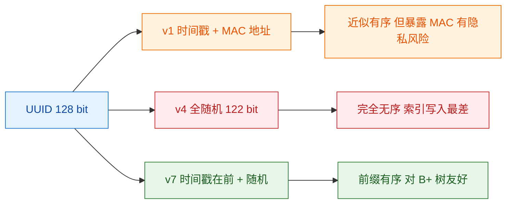
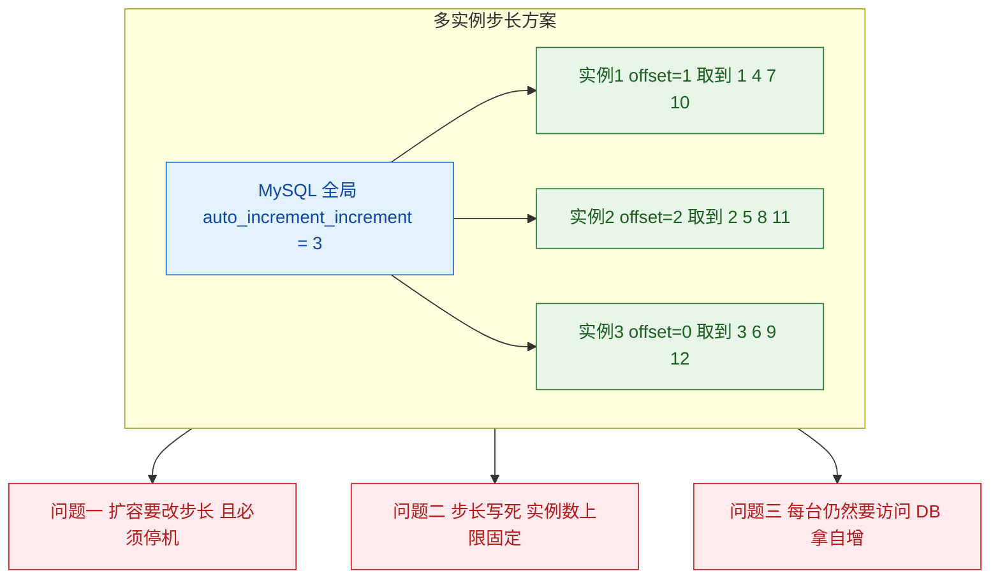
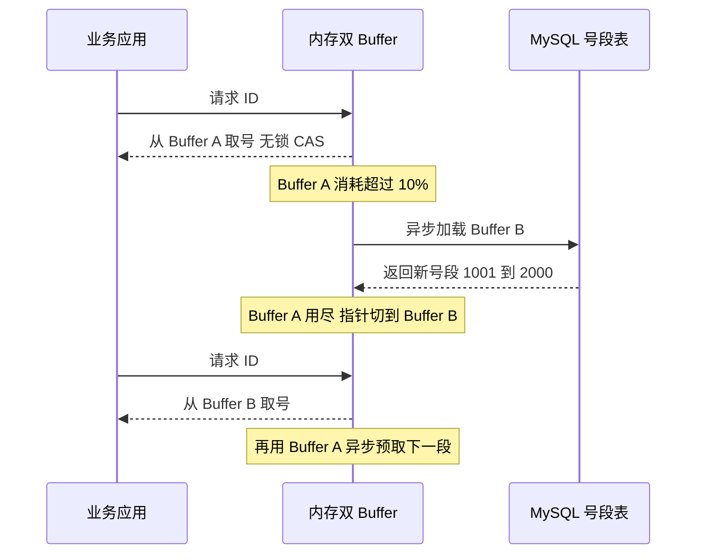
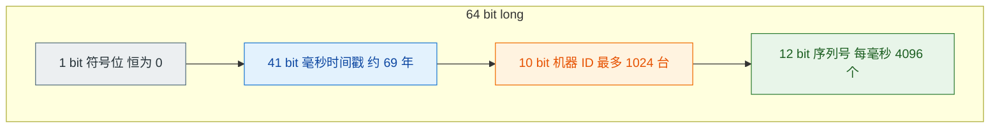
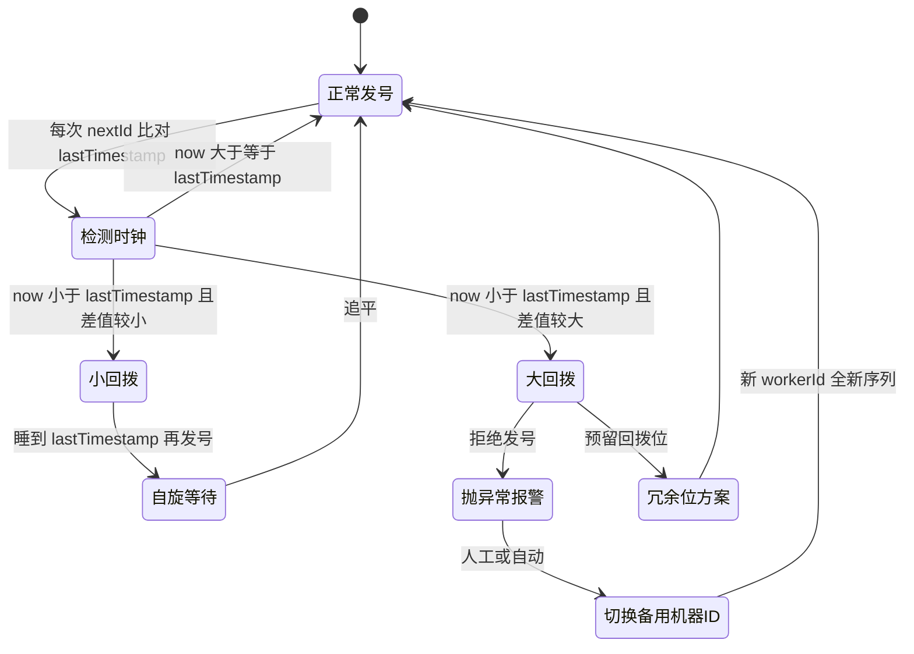
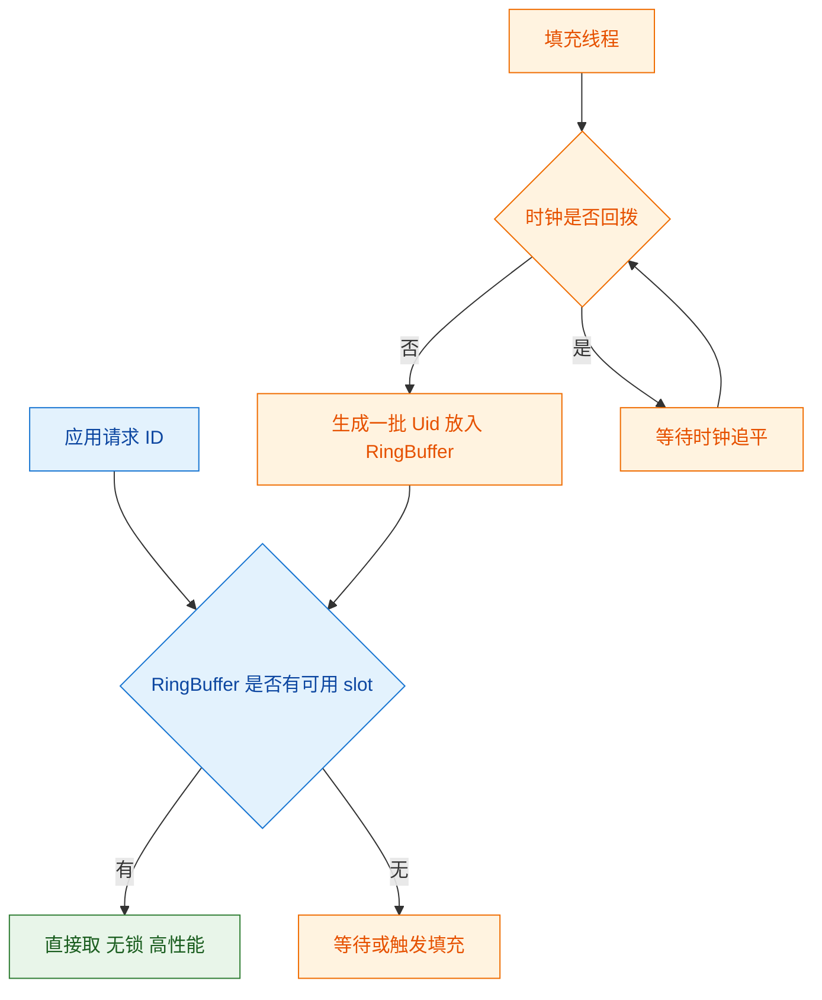
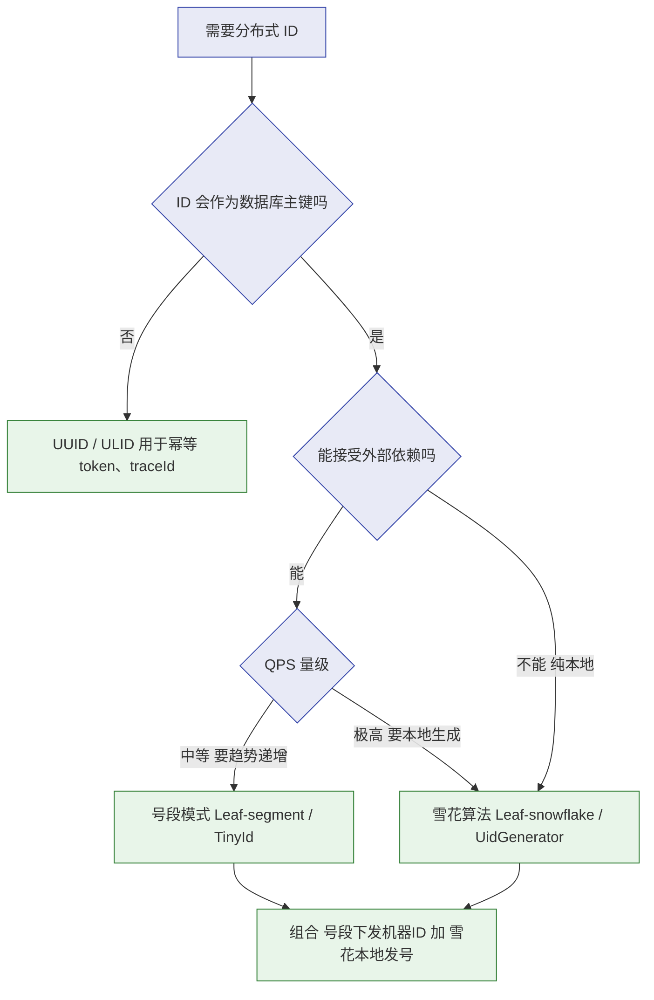

# 🆔 四、分布式 ID 与雪花算法

> 本篇回答：为什么分库分表之后数据库自增主键就废了？「趋势递增」这四个字到底值多少钱——它凭什么能决定一个系统的插入吞吐？UUID 为什么不能做主键，而数据库自增又为什么撑不住？号段模式（Leaf-segment）的双 Buffer 预取是怎么做到「几乎不阻塞」的？雪花算法那 64 个 bit 每一位是怎么切的，41 位时间戳为什么是 69 年而不是 70 年，12 位序列号在什么情况下会不够用？最要命的时钟回拨，四种处理方案各自适用什么场景，生产上拿什么监控？
> 本篇比 [[面试准备/技术面试题库/09-分布式与微服务]] 的 ID 小节更深，重点在**位运算级的原理**、**失败场景**与**选型判断**。分布式锁与幂等的关系见 [[3-分布式锁]] 与 [[幂等.excalidraw]]；ID 生成器本身作为一个高可用服务，注册发现与容灾参见 [[8-微服务架构与注册配置中心]]。总览见 [[0-分布式总览]]，理论基础见 [[1-分布式理论基础]]。

---

## 一、为什么需要分布式 ID

### 1.1 单体时代的自增主键为什么失效

单库单表的时候，`AUTO_INCREMENT` 是完美的：数据库自己保证唯一、天然递增、写入时按顺序追加到 B+ 树最右侧、不需要任何网络交互。但一旦做了**分库分表**，这个前提就崩了：

| 场景 | 自增主键的失效原因 |
| --- | --- |
| **水平分库**（user_0 / user_1） | 两库各自从 1 开始自增，必然产生重复 ID，全局不唯一 |
| **水平分表** | 同上，每个分表独立维护计数器 |
| **分库分表 + 路由** | 如果按 ID 取模路由，那么「先有 ID 还是先有路由」成了死循环 |
| **多主复制** | MySQL 双主虽然可以用 offset/increment 错开，但扩容要停机改配置 |
| **需要预生成 ID** | 有些业务（如订单号提前展示、批量导入）要先拿到 ID 再落库，自增做不到 |

> [!important] 核心矛盾：ID 的生成者从「一个」变成了「多个」
> 自增主键的本质是**用一个集中式的计数器换取唯一性**。分布式化的第一性原理就是：**要么重新引入一个集中点（数据库号段、Redis），要么把唯一性编码进 ID 本身（雪花的时间戳+机器ID），要么放弃有序性（UUID）。**
> 所有分布式 ID 方案，都可以归到这三条路上。

### 1.2 一个合格的分布式 ID 要满足什么

| 要求 | 含义 | 不满足的后果 |
| --- | --- | --- |
| **全局唯一** | 无论如何都不能重复 | 数据覆盖、主键冲突、业务错乱——**一票否决项** |
| **趋势递增** | 整体上随时间增大，允许局部乱序 | **页分裂、写放大、索引膨胀**（见 §1.3） |
| **高性能** | 单机每秒能生成几十万甚至上百万 | ID 生成成为全链路瓶颈 |
| **高可用** | 生成器挂了不能拖垮整个业务 | 依赖外部服务时尤其致命 |
| **信息安全** | 不能从 ID 反推业务量、不能轻易遍历 | 竞对通过订单号算出你一天的订单量 |
| （加分）单调递增 | 严格递增，无局部乱序 | 分页排序、游标查询更友好 |
| （加分）可读性/含语义 | 如含日期、业务类型前缀 | 排查问题时肉眼可识别 |

> [!warning] 「信息安全」这条最容易被忽略
> 用数据库自增 ID 做订单号，竞对下两单就能算出你一天的单量：今天下单拿到 100001，明天同一时间下单拿到 108000，日订单量直接暴露。
> 更糟的是**可遍历**：`GET /order/100001`、`/order/100002`……如果权限校验有漏洞，就是一次典型的**越权遍历**。
> 这也是为什么很多公司用「雪花 ID 打散 + 号段 + 加盐混淆」来生成对外的订单号。

### 1.3 为什么「趋势递增」这么重要（本节要讲透）

这一节是所有八股文里最常被跳过、但面试官最爱追问的地方。

MySQL InnoDB 的表是**聚簇索引（clustered index）**组织表：**主键即数据行本身**，数据按主键顺序存放在 B+ 树的叶子节点上。叶子节点是**页（page）**，默认 16KB。插入新行时：

1. 从根节点一路比较，找到主键应该落在哪个叶子页；
2. 如果那个页还有空闲空间，插进去，必要时做页内记录移动（维护有序链表）；
3. **如果页满了，就要做页分裂（page split）**：申请一个新页，把原页约一半的数据挪过去，再在父节点插入一个新的索引项；
4. 父节点也可能因此满，于是**分裂向上传播**，最坏情况一直传到根节点。


随机 ID 带来的具体代价，逐条说清楚：

| 代价 | 机理 | 现象 |
| --- | --- | --- |
| **页分裂** | 随机位置插入，命中已满页的概率高 | 分裂本身要拷贝数据、写新页，是纯开销 |
| **页填充率下降** | 分裂后两个页各约 50% 满 | 同样的数据占用更多页，**索引体积膨胀** |
| **写放大** | 一次插入触发多次页写入 + redo/undo 增加 | 磁盘 IO 成倍增长，SSD 寿命受影响 |
| **缓冲池命中率下降** | 工作集页数变多，且随机访问导致热点页被换出 | 随机读增多，查询变慢 |
| **范围查询变差** | 相邻主键不再物理相邻 | 分页 / 区间扫描要跳更多页 |
| **间隙锁范围扩大** | 插入点分散，锁住更多间隙 | 并发插入更容易冲突 |

> [!important] 一个反直觉的点：主键最好「单调递增」，但雪花 ID 只是「趋势递增」
> 雪花的局部乱序来自**多机器并发**：机器 A 在 t 时刻发号 `t<<22 | A<<12 | 0`，机器 B 在同一毫秒发号 `t<<22 | B<<12 | 0`。二者高位时间戳相同，但中间机器 ID 不同，所以**同一毫秒内跨机器的 ID 大小关系不确定**。
> 由于机器 ID 位在序列号左边，同一毫秒内 **workerId 小的机器生成的 ID 一定更小**——乱序的幅度被限制在「同一毫秒内、不同机器之间」，最多 1024 台机器的跨度。
> 这个乱序对 B+ 树**几乎无害**：因为时间戳在高位，全局上 ID 仍然随时间往右走，插入点始终在 B+ 树右端的一个很窄的窗口里。

**一个具体例子**：`8f3a1b2c-...` 的哈希落在 100 万行数据的中间位置，插入时该页已满 → 分裂 → 新页插入父节点。如果每秒 1 万次插入，就是每秒 1 万次随机分裂。而趋势递增 ID 的插入点始终在最右页，只有当最右页满了才分裂一次（约每 200 行一次，取决于行长）。

> [!tip] 面试可以直接这么答
> 「主键选用什么，本质是在选**插入点的分布**。InnoDB 是聚簇索引，数据按主键物理有序。随机主键把插入点打散到整棵 B+ 树，导致页分裂、页填充率掉到 50%、写放大。趋势递增 ID 把插入点收敛到最右端，是**顺序写**，这也是为什么几乎所有的分布式 ID 方案都在追求『趋势递增』而不是简单的『唯一』。」

---

## 二、方案一：UUID

### 2.1 版本差异

UUID 是 128 位（16 字节）的标识符，通常表示成 36 个字符（32 个十六进制字符 + 4 个连字符，如 `550e8400-e29b-41d4-a716-446655440000`）。



| 版本 | 构成 | 有序性 | 问题 |
| --- | --- | --- | --- |
| **v1** | 时间戳（100ns 精度）+ 时钟序列 + **MAC 地址** | 近似有序（时间戳在前） | 暴露 MAC 地址 → **隐私/安全风险**；同一台机器高并发可能重复 |
| **v3/v5** | 基于命名空间 + 名字做 MD5/SHA1 | 无序 | 确定性（同输入同输出），常用于生成稳定 ID |
| **v4** | **122 位随机数**（6 位固定版本/变体位） | **完全无序** | 索引写入性能最差；碰撞概率极低但不是零 |
| **v7**（新 RFC 9562） | **48 位 Unix 毫秒时间戳在前** + 版本位 + 随机 | **前缀有序** | 相对较新，各语言/DB 支持度不一，需自行确认 |

### 2.2 为什么 v4 无序

v4 的 128 位里，除了 6 位固定位（版本 4 位 + 变体 2 位），其余 **122 位全部来自随机数**。也就是说：

- 相邻两次生成的 UUID，**每一个 bit 都可能不同**，没有任何位置是「单调」的；
- 把它作为主键，插入位置在 B+ 树上是**均匀散布**的——这正是 §1.3 里最坏的情况。

### 2.3 存储与索引代价

| 维度 | UUID（字符串 36 字符） | UUID（BINARY(16)） | BIGINT |
| --- | --- | --- | --- |
| 存储 | 36 字节 | 16 字节 | 8 字节 |
| 二级索引开销 | **每个二级索引都存主键**，放大约 4.5 倍 | 放大约 2 倍 | 基准 |
| 比较成本 | 字符串逐字节比较，慢 | 二进制比较 | 整数比较，最快 |
| 可读性 | 好 | 差 | 差 |

> [!warning] 「UUID 做主键」的真实代价是**乘数级**的
> InnoDB 的**每一个二级索引**的叶子节点里都存了主键值。主键从 8 字节变成 36 字节，一个包含 3 个二级索引的表，索引总大小可能翻好几倍。
> 再叠加 §1.3 的页分裂与 50% 填充率，最终表现是：**插入吞吐骤降、磁盘占用暴涨、缓存命中率下降**。这就是「UUID 做主键性能骤降」的完整因果链。

### 2.4 那 UUID 该用在哪

**结论：UUID 不适合做主键，但非常适合做「不参与索引有序性」的唯一标识。**

| 场景 | 说明 |
| --- | --- |
| **幂等 token / 去重键** | 请求进来先生成一个 UUID 做幂等键写入 Redis（SETNX），与 [[幂等.excalidraw]] 的思路一致 |
| **链路追踪 traceId** | 生成后透传，本身不落库、不需要有序 |
| **文件名 / 上传对象名** | 避免冲突，无需排序 |
| **分布式锁的持有者标识** | 标识「谁持锁」，UUID 保证不同线程不撞 |
| **临时会话 / 一次性凭证** | 无需有序 |

> [!tip] 如果一定要在 MySQL 里用 UUID
> 用 `BINARY(16)` 而不是 `CHAR(36)` 存储，能省一半以上空间；或者改用 **UUID v7 / ULID**（时间戳在高位，前缀有序），它在保留「本地生成、无网络开销」优点的同时解决了有序性问题。
> 更彻底的做法：**用趋势递增 ID 做主键，把 UUID 放在一个普通唯一索引列上**——两全其美。

---

## 三、方案二：数据库自增（含多实例步长）

### 3.1 单表自增 / 独立 ID 表

最朴素的分布式 ID 方案：建一张 `id_generator` 表，每次 `REPLACE INTO ... VALUES(...)` 或 `UPDATE ... SET max_id = max_id + 1`，再 `SELECT LAST_INSERT_ID()`。

| 优点 | 缺点 |
| --- | --- |
| 实现极简，绝对递增 | **单点瓶颈**：所有服务都打这一张表 |
| 天然有序 | **DB 一挂全挂**，可用性等同于单库 |
| 不额外引入组件 | **暴露业务量**，且可被遍历 |
| | 每次取号一次网络往返，**QPS 上限受限于 DB** |

### 3.2 多实例步长方案

用 MySQL 的 `auto_increment_increment`（步长）和 `auto_increment_offset`（起始偏移）让多个实例各自错开：



**关键缺点（面试爱问）：**

| 缺点 | 详细说明 |
| --- | --- |
| **扩容困难** | 从 3 台扩到 4 台，步长要从 3 改成 4，还得给新实例分配没被用过的 offset；改配置期间不能发号 → **必须停机或走双写过渡** |
| **步长写死** | 实例数上限被步长锁死，且每台实例只能拿到 1/N 的号 |
| **仍有 DB 依赖** | 只是把「每次插入一次 DB」变成「每个实例每次自增一次 DB」，QPS 上限约等于 DB 能力 |
| **ID 不连续** | 单看某一台实例，ID 是跳跃的 1、4、7、10，对有些业务不友好 |

> [!note] 步长方案的两个变体
> - **号段思想的前身**：既然每台实例一次只能拿 1 个，那就让它一次拿 1000 个——这就是 §4 的号段模式。
> - **Redis INCR 替代 MySQL**：把计数器放到 Redis，`INCRBY` 天然原子且性能远高于 MySQL。代价是引入了 Redis 的可用性问题（RDB/AOF 丢数据可能回退号段）。

---

## 四、方案三：号段模式（生产推荐）

### 4.1 核心思想

**不要每次取一个号，一次取一批（一个号段）缓存在内存里，用完再取下一批。** DB 里只存一个「当前最大已分配值」`max_id`。

```sql
-- 号段表：每行代表一个业务（biz_type），一行管一段
CREATE TABLE leaf_alloc (
  biz_tag     VARCHAR(128) NOT NULL,
  max_id      BIGINT       NOT NULL DEFAULT 1,
  step        INT          NOT NULL,
  description VARCHAR(256),
  update_time TIMESTAMP    NOT NULL DEFAULT CURRENT_TIMESTAMP ON UPDATE CURRENT_TIMESTAMP,
  PRIMARY KEY (biz_tag)
);

-- 取号段：一条原子 UPDATE，把 max_id 往后推 step
UPDATE leaf_alloc SET max_id = max_id + step WHERE biz_tag = 'order';
SELECT max_id, step FROM leaf_alloc WHERE biz_tag = 'order';
```

拿到 `(newMax, step)` 后，内存里就有 `[newMax - step + 1, newMax]` 这一段的发号权，**后续所有发号都是纯内存的 CAS 自增，零网络开销**。

> [!important] 为什么这一步是原子的
> 单条 `UPDATE ... SET max_id = max_id + step` 在 InnoDB 里持有行锁，天然串行化。两个实例并发到达时，一个先拿到 `[1,1000]`，另一个拿到 `[1001,2000]`，**绝对不会重叠**。
> 这也解释了为什么号段模式能安全地水平扩展：**并发的正确性由 DB 行锁保证，而 DB 只需要承受「号段数」次请求，不是「ID 数」次请求**。QPS 从 DB 上限（几千）被放大到 DB 上限 × step（百万级）。

### 4.2 双 Buffer 预取（Leaf-segment 的关键设计）

只有单个号段会有个问题：**号段用完的那一刻，业务线程要同步等待 DB 返回新号段**，形成周期性尖刺（每秒或每几秒卡一下）。

解法是**双 Buffer**：内存里同时持有两个号段，当前号段消耗到一定比例时，**异步**去加载下一个号段。



**Leaf-segment 的设计要点：**

| 要点 | 说明 |
| --- | --- |
| **触发时机** | 当前号段消耗超过阈值（如 10%）就触发异步预取，给 DB 往返留足缓冲 |
| **切换时必须等预取完成** | 如果预取还没回来就用完了，仍然要阻塞——所以阈值不能设得太高 |
| **多业务隔离** | 每个 `biz_tag` 一行，不同业务互不影响，某个业务号段被消耗快不影响别人 |
| **动态调整步长** | Leaf 支持按 QPS 动态调 `step`：流量大就调大减少 DB 压力，流量小就调小避免号段浪费 |
| **弱依赖 DB** | 取号阶段完全不碰 DB，DB 短暂不可用时**用内存里的余量继续服务** |

### 4.3 号段模式的优缺点与容灾

| 维度 | 评价 |
| --- | --- |
| **优点** | 性能极高（内存 CAS）；趋势递增（每段内严格递增，段之间也递增）；DB 压力被 step 稀释；不依赖时钟 |
| **优点** | 号段内**严格单调**，比雪花更友好，没有跨机器乱序 |
| **缺点** | **号段浪费**：重启时没用完的号段直接丢弃（一个 instance 拿到 [1,1000] 用到 300 就重启，301~1000 全废） |
| **缺点** | **DB 是弱单点**：虽然只在取号段时依赖，但如果 DB 长时间挂掉，号段总会耗尽 |
| **缺点** | 号段之间的**不连续**在 ID 上留下跳跃，但对 B+ 树无影响 |
| **缺点** | step 设置是权衡：太大则浪费严重，太小则 DB 压力大、预取频繁 |

**容灾设计：**

| 故障 | 应对 |
| --- | --- |
| **DB 短暂抖动** | 双 Buffer + 内存余量扛住，表现为「无感知」 |
| **DB 长时间不可用** | ① 降级到本地生成（如退化为本地雪花）；② 多 DB 主备 + 号段表分片；③ 提前把 step 调大，拉长可服务时间 |
| **号段浪费严重** | 记录「最后分配到的值」做**回收**（复杂且要防重复）；或用 DB 记录 `max_id` 时**只推进不回收**，接受浪费 |
| **多个 ID 服务实例** | 天然安全（靠 DB 行锁），不需要选主 |

> [!danger] 号段浪费的真实影响
> 假设 step = 1000，服务每分钟重启一次（滚动发布常见），每次浪费约 500 个号 —— 每天浪费 72 万个。对 BIGINT 来说完全无感。
> 但如果 step 设成 100 万、又频繁重启，一天就能浪费数十亿。**结论：step 要跟 QPS 匹配（一般让一个号段够用几分钟），不要盲目调大。**

> [!tip] 为什么号段模式是「最推荐」的默认方案
> 如果面试官问「你们线上用什么」，最稳的答案是：**「号段模式为主，对性能和有序性要求都高、且能接受时钟风险的场景用雪花」**。
> 号段的优势在于**不依赖时钟、不依赖机器 ID、实例可随意上下线重启、天然单调**。它的代价（一次 DB 往返、号段浪费）在绝大多数业务里都可以接受。

---

## 五、方案四：雪花算法（Snowflake）

### 5.1 64 位位分配

雪花算法的核心是：**把一个 64 位 long 切开，高位放时间，中间放机器，低位放序列号**。



| 部分 | 位数 | 含义 | 容量推导 |
| --- | --- | --- | --- |
| **符号位** | 1 | 恒为 0 | 保证生成的 ID **永远是正数**（Java 的 long 有符号，不用符号位就浪费了） |
| **时间戳** | 41 | **当前毫秒 − 起始纪元**（不是绝对毫秒） | 2^41 = 2,199,023,255,552 毫秒 ≈ **69.7 年** |
| **机器 ID** | 10 | 数据中心 ID + 工作机器 ID | 2^10 = **1024** 台机器 |
| **序列号** | 12 | 同一毫秒内的自增序号 | 2^12 = **4096** 个/毫秒 → 单机 **409.6 万/秒** |

**为什么是 41 位 69 年？**

```
2^41 毫秒 = 2199023255552 毫秒
          = 2199023255552 / 1000 / 60 / 60 / 24 / 365
          ≈ 69.7 年
```

所以「41 位能撑 69 年」的前提是：**从你设定的起始纪元（epoch）开始算**。比如把起始纪元设为 2020-01-01，那么到 2089 年左右这个位数就用完了。这就是为什么雪花算法的实现里一定有一个 `twepoch` 常量——**它是一个「系统寿命」的硬编码决定，选错了（比如设成 0）会白白浪费几十年。**

> [!important] 41 + 10 + 12 = 63 位，这 63 位决定了雪花的全部能力边界
> - **时间位数决定了系统能活多久**。想要更久，就得从机器 ID 或序列号里借位。
> - **机器 ID 位数决定了集群规模上限**。1024 台是默认值，但如果业务只有几十台机器，完全可以把机器 ID 缩到 8 位、把时间戳扩到 43 位（约 278 年）或者序列号扩到 14 位（16384/ms）。
> - **序列号位数决定了单机单毫秒的并发上限**。12 位 = 4096，如果单机 QPS 超过 409.6 万，同一毫秒内会耗尽序列号 → **必须等到下一毫秒**，此时 `nextId()` 会自旋。

### 5.2 为什么雪花是趋势递增

因为**时间戳占据高位**。两个不同毫秒生成的 ID，时间戳大的那个 ID 一定大。而 ID 作为 long 比较时，高位决定大小：

```
ID = (timestamp - twepoch) << 22  |  (workerId << 12)  |  sequence
     └──── 高位，随时间单调增大 ────┘  └─ 中位 ─┘  └ 低位 ┘
```

| 场景 | 大小关系 |
| --- | --- |
| **不同毫秒**（t1 < t2） | ID1 < ID2，**严格递增** |
| **同一毫秒，同一机器** | 序列号递增 → ID 递增，**严格递增** |
| **同一毫秒，不同机器** | workerId 大的机器 ID 更大，**顺序不确定**（但差距被限制在同一毫秒内） |

这正是「趋势递增」而非「严格递增」的准确含义，也正好满足 §1.3 对 B+ 树的要求。

### 5.3 时间戳的位运算推导（要能手写）

```java
// 关键常量：位数决定位移量
private final long twepoch = 1704038400000L; // 起始纪元，如 2024-01-01
private final long workerIdBits = 10L;
private final long sequenceBits = 12L;

// 位移量：序列号占最低 12 位，workerId 左移 12 位，时间戳左移 22 位
private final long workerIdShift   = sequenceBits;                                  // 12
private final long timestampShift  = sequenceBits + workerIdBits;                    // 22

// 掩码：把超出位数的部分截掉，防止参数越界污染其它位
private final long maxWorkerId  = ~(-1L << workerIdBits);   // 1023
private final long sequenceMask = ~(-1L << sequenceBits);   // 4095

// 组装
long id = ((timestamp - twepoch) << timestampShift)
        | (workerId << workerIdShift)
        | sequence;
```

> [!warning] 掩码不是可选项
> `~(-1L << 10)` = 1023 这个技巧的意思是「低 10 位全 1」。如果传入的 workerId 是 1024（越界），不做 `& maxWorkerId` 校验就会**污染时间戳位**，生成出完全错误的 ID，且这种错误毫无规律、极难排查。
> **标准做法：构造函数里直接 `if (workerId > maxWorkerId || workerId < 0) throw new IllegalArgumentException(...)`，让错误在启动时就暴露。**

### 5.4 时钟回拨问题

**时钟回拨（clock rollback / clock drift backwards）指的是：系统当前时间比上一次发号时记录的时间还要小。**

这直接破坏了雪花的核心假设「时间只会往前走」。后果很严重：



**回拨导致重复的机理：**

假设 t=1000ms 时机器发了 `(1000, wid=1, seq=5)`。随后 NTP 把时钟拨回到 t=980ms。如果代码不做校验，`nextId()` 会认为「现在是 980ms」，于是重新从 seq=0 开始发号 —— 但 980ms 这个时间戳**之前已经发过号了**，于是 `(980, wid=1, seq=0)`、`(980, wid=1, seq=1)`… 全部与历史 ID **重复**。

**四种处理方案的对比：**

| 方案 | 做法 | 优点 | 缺点 | 适用场景 |
| --- | --- | --- | --- | --- |
| **① 等待追平** | 发现回拨后，`Thread.sleep(lastTimestamp - now)` 自旋等到时钟追上 | 实现简单，**不丢号、不重复** | 回拨 10 分钟就要睡 10 分钟 → **服务直接不可用** | 回拨幅度很小（几毫秒，NTP 微调） |
| **② 备用机器 ID** | 检测到回拨就切换到一个从未用过的 workerId | 几乎无停机 | 需要**预留一批备用 workerId**；切换有上限，用光了就没辙；要持久化「已用过的 workerId」 | 回拨中等、机器 ID 有余量 |
| **③ 抛异常报警** | 直接抛异常，让上层感知并告警 | 绝不产生错误数据，**fail-fast** | 直接拒绝服务，**业务受损** | 回拨幅度大、且业务宁可不服务也不能重复 |
| **④ 冗余位 / 逻辑时钟** | 预留几位做「回拨计数」，或回拨时使序列号从上次的值继续（而非归零） | 不阻塞、不重复，可自动恢复 | 需要改位分配，**牺牲容量**；复杂度高 | 对可用性要求极高 |
| **⑤ NTP 校准 + 检测** | 用 `ntpd` 平滑校时（slew）而非跳变（step）；同时代码里做回拨检测 | 从**根源**减少回拨 | 不能 100% 杜绝（VM 迁移、手动改时间） | **必须作为基础配置** |

> [!danger] 方案 ② 的隐藏坑：备用机器 ID 必须是「从未用过」的
> 如果切换到的 workerId **以前用过**（哪怕是几小时前），而那次用的时候时间戳走得更远，那么切换后生成的时间戳反而更小 → **仍然重复**。
> 所以正确做法是：**持久化记录每个 workerId 已推进到的最大时间戳**，切换时选择「最大时间戳 <= 当前时间」的 workerId。这也是美团 Leaf-snowflake 的做法。

### 5.5 机器 ID 的分配

10 位机器 ID 不能靠人肉配置（配置错了就是灾难性的重复）。常见方案：

| 方案 | 原理 | 优缺点 |
| --- | --- | --- |
| **配置文件写死** | 每台机器一个配置 | 最简单；**最容易出错**，容器化后完全不可用 |
| **ZooKeeper 顺序节点** | 启动时在 `/snowflake/workers` 下创建**临时顺序节点**，节点序号即 workerId | 可靠、自动回收（会话断开节点消失）；引入 ZK 依赖 |
| **Redis INCR** | `INCR snowflake:worker_id` 拿一个自增值 | 简单；**Redis 数据丢失/回滚会导致重复分配** |
| **配置中心 + 心跳** | Nacos/Apollo 里维护 workerId 分配表，服务注册时抢占并续约 | 复用现有基础设施，**推荐**（与 [[8-微服务架构与注册配置中心]] 一致） |
| **IP / 机器名取模** | `hash(ip) % 1024` | 零依赖；**哈希冲突无法察觉**，且容器 IP 复用会导致重复 |
| **K8s StatefulSet 序号** | Pod 名里的序号（`app-0`、`app-1`）作 workerId | 天然唯一稳定；只适用于 StatefulSet |

> [!important] workerId 分配的本质要求：**在任何时刻，两个存活的实例不能持有同一个 workerId**
> 而且必须比这个要求更强：**新分配的 workerId 不能分配给「上次使用时时间戳已经走在前面」的实例**。
> 所以最稳妥的做法（Leaf-snowflake 的思路）是：**启动时不直接用配置的 workerId，而是用它去 ZK 校验——如果本机记录的 lastTimestamp 比当前时间大，说明时钟回拨，拒绝启动。**

### 5.6 Java 实现要点

```java
public synchronized long nextId() {
    long timestamp = timeGen();

    // 1. 时钟回拨检测：必须放在最前面
    if (timestamp < lastTimestamp) {
        long offset = lastTimestamp - timestamp;
        if (offset <= MAX_BACKWARD_MS) {          // 小幅回拨：等待
            try { wait(offset << 1); } catch (InterruptedException e) {
                Thread.currentThread().interrupt();
            }
            timestamp = timeGen();
            if (timestamp < lastTimestamp) {       // 等待后仍未追平 → 升级处理
                throw new IllegalStateException("时钟回拨，拒绝生成 ID");
            }
        } else {                                   // 大幅回拨：报警 + 拒绝
            throw new IllegalStateException("时钟回拨 " + offset + "ms，拒绝生成 ID");
        }
    }

    if (timestamp == lastTimestamp) {
        // 2. 同一毫秒：序列号自增
        sequence = (sequence + 1) & sequenceMask;
        if (sequence == 0) {                       // 4096 用完 → 阻塞到下一毫秒
            timestamp = tilNextMillis(lastTimestamp);
        }
    } else {
        // 3. 新毫秒：序列号归零
        sequence = 0L;
    }

    lastTimestamp = timestamp;

    // 4. 组装
    return ((timestamp - twepoch) << timestampShift)
         | (workerId << workerIdShift)
         | sequence;
}

private long tilNextMillis(long lastTimestamp) {
    long timestamp = timeGen();
    while (timestamp <= lastTimestamp) { timestamp = timeGen(); }
    return timestamp;
}
```

**注意事项清单：**

| 注意点 | 原因 |
| --- | --- |
| **方法要 `synchronized` 或用 CAS/longAdder 做无锁化** | `sequence` 和 `lastTimestamp` 是共享可变状态，并发下必须串行；高并发场景 `synchronized` 是热点，可用 `AtomicLong` 做 CAS 重试，或**每个线程一个 Snowflake 实例** |
| **`timestamp == lastTimestamp` 必须先判断 `sequence == 0` 再阻塞** | 否则同一毫秒会发出第 4097 个号，序列号溢出污染 workerId 位 |
| **`tilNextMillis` 必须是 `<=` 而非 `<`** | 用 `<` 会在时间戳刚好相等时提前退出，导致重号 |
| **`twepoch` 一旦上线不能改** | 改了会导致新旧 ID 大小关系错乱，甚至和已有 ID 冲突 |
| **启动时校验 `timestamp - twepoch` 未溢出 41 位** | 否则时间戳位溢出，ID 变成负数或与历史冲突 |
| **NTP 配置用 slew 而非 step** | `step` 是直接跳变，最容易造成回拨；`slew` 是缓慢调整 |

> [!tip] 面试加分点：为什么 `synchronized` 可能是瓶颈
> 单机 409.6 万/秒是理论上限，但 `synchronized` 的争用会让实际值远低于此。百度 UidGenerator 的解法就是**彻底避开锁**——见 §6.1。

---

## 六、其他方案

### 6.1 百度 UidGenerator（RingBuffer）

**思路：把「生成 ID」和「取 ID」解耦。** 用一个环形数组（RingBuffer）预先生成一批 ID，应用取号时只是移动指针，**无锁**。



| 特性 | 说明 |
| --- | --- |
| **两种实现** | **DefaultUidGenerator**（`synchronized`，简单）与 **CachedUidGenerator**（RingBuffer，高性能） |
| **位分配可自定义** | 通过 `bits` 配置，支持「秒级」时间戳（`timeBits=30` 可用 34 年）+ 更大序列号 |
| **时钟回拨处理** | 内置：记录上次时间戳，回拨时**等待**到追平（可配阈值）；RingBuffer 版还支持「用备用位」 |
| **代价** | RingBuffer 会**提前消耗序列号**，导致 ID 有空洞；内存占用随 buffer 大小上升 |

> [!note] RingBuffer 与号段模式的异同
> 两者都是「**批量预生成 + 内存取用**」的思路，区别在于：
> - **号段模式**从 DB 取一段**号码区间**，段内自己递增 → 需要 DB 依赖，但 ID 连续。
> - **RingBuffer** 在**本地**预生成一批完整 ID，不依赖任何外部存储 → 无 DB 依赖，但 ID 不连续（每个 slot 的序列号是跳着用的）。
> 可以理解为：**RingBuffer 是把雪花算法「批量化」，把锁的开销摊薄到填充线程上。**

### 6.2 美团 Leaf-snowflake

**思路：雪花 + ZooKeeper 机器 ID 管理 + 时钟回拨校验。**

| 特性 | 说明 |
| --- | --- |
| **workerId 管理** | 启动时在 ZK 上创建顺序节点拿到 workerId，**并持久化到本地文件**；重启时先读本地文件校验 |
| **时钟回拨校验** | 启动时用 ZK 上记录的「本机上次上报时间」对比当前时间，回拨则**拒绝启动** |
| **运行时回拨** | 小幅回拨等待，大幅回拨抛异常 + 报警 |
| **弱依赖 ZK** | ZK 只在启动时用，运行时不依赖 → ZK 挂了不影响发号 |
| **对 NTP 的强依赖** | 明确要求运维配置 NTP，且不能手动改时间 |

### 6.3 滴滴 TinyId

**本质是「号段模式 + 多 DB 容灾」的工程化实现。**

| 特性 | 说明 |
| --- | --- |
| **两种模式** | `segment`（号段，DB 存 max_id）与 `segment_redis`（Redis 存 max_id） |
| **纯 HTTP 客户端** | 客户端通过 HTTP 从 TinyId 服务取号段，不直连 DB |
| **多 DB 支持** | 可配置多个 DB，一个主用、其余备用，主挂了自动切换 |
| **客户端本地缓存** | 取到的号段缓存在客户端内存，减少服务端压力 |
| **容灾** | DB 全挂时，客户端还有本地号段余量可用 |

> [!important] TinyId 的设计取舍值得记住
> 它把「号段模式」拆成了 **「TinyId 服务端（管号段）」+「业务客户端（存号段）」** 两层缓存，这样：
> - 服务端只需要承受「号段请求」，压力极小，可以做得很稳定；
> - 客户端即使和服务端断开，也能靠本地余量继续发号数分钟。
> 这是**用两级缓存换可用性**的典型架构，和 §4.3 的容灾思路一脉相承。

### 6.4 组合思路：号段 + 雪花

这是很多大厂实际的做法，也是**最推荐的架构**：



**组合方案的核心价值：用号段模式解决「机器 ID 分配」这个雪花的头号难题。**

| 问题 | 纯雪花的痛点 | 组合方案 |
| --- | --- | --- |
| **workerId 从哪来** | 要 ZK / Redis / 配置中心，还可能重复 | **从 DB 号段里取**：一次取回一个 `[workerId 区间]`，每个实例独占一个 |
| **时钟回拨怎么办** | 无解或阻塞 | **实例重启 = 换新 workerId**（因为重新取号段会拿到新 ID），时间戳天然「清零」 |
| **机器数超 1024** | 位不够 | workerId 由号段动态分配，**同一时刻只要求 1024 个存活**，总量不限 |

> [!tip] 一句话总结组合方案
> **「用号段的强一致来分配机器 ID，用雪花的本地发号来保证性能。」**
> 号段只被用来做**低频的 workerId 分配**（实例启动/重启时一次），所以 DB 压力极小；而高频的 ID 生成本地完成，完全没有网络开销。这同时拿到了**号段的安全**和**雪花的性能**。

---

## 七、时钟回拨深挖

### 7.1 为什么会回拨

| 原因 | 机理 | 回拨幅度 |
| --- | --- | --- |
| **NTP 校时（step 模式）** | 时钟偏差超过阈值时，ntpd **直接跳变**到正确时间 | 可达秒级甚至分钟级 |
| **NTP 校时（slew 模式）** | 缓慢调整，每秒最多调整 0.5ms | 极小，但仍可能瞬时倒退 |
| **虚拟机迁移（live migration）** | VM 从一台宿主机迁到另一台，时钟可能被宿主机时间覆盖 | 可达秒~分钟 |
| **虚拟机暂停 / 快照恢复** | VM 挂起后恢复，时钟停在挂起时刻 | 取决于挂起时长 |
| **容器 / 物理机重启** | 硬件时钟（RTC）不准，启动后先读 RTC 再被 NTP 纠正 | 秒级 |
| **闰秒（leap second）** | 某些实现会「回拨 1 秒」处理闰秒 | 1 秒 |
| **人工误操作** | 运维手动 `date -s` 改时间 | 任意 |
| **容器与宿主机时钟不一致** | 容器共享宿主机时钟，宿主机的变动直接传导 | 任意 |

> [!warning] 容器化环境比物理机更容易踩坑
> 在 K8s 里，Pod 的时钟来自宿主机。宿主机被 NTP 调整、或者 Pod 被调度到另一台时钟不同的宿主机上，都会直接造成回拨。
> 而且**容器重启极其频繁**（滚动发布、OOM、驱逐），如果每次重启都重新初始化 `lastTimestamp`，那么「重启后立刻发号」就可能和重启前的 ID 撞上——**这其实是比时钟回拨更常见的重复原因**。

### 7.2 回拨导致 ID 重复的后果

| 后果 | 说明 |
| --- | --- |
| **主键冲突** | 插入直接报 `Duplicate entry`，业务报错 |
| **数据覆盖（最可怕）** | 如果是 `INSERT ... ON DUPLICATE KEY UPDATE` 或 `REPLACE INTO`，**新记录会覆盖旧记录**，数据静默损坏 |
| **ID 变小破坏有序性** | 后续 ID 比之前的小，如果业务依赖「ID 越大越新」（如增量拉取 `WHERE id > lastId`），**会漏数据** |
| **缓存/幂等键冲突** | 幂等键用 ID 的场景，重复 ID 会被误判为重复请求而被拒绝 |
| **分库分表路由错乱** | 如果按 ID 取模路由，重复 ID 意味着写入到同一分片，冲突必然发生 |

> [!danger] 「静默数据损坏」比「报错」危险得多
> 主键冲突会立刻报错、立刻被发现、立刻回滚。但如果业务用了 upsert 语义，或者 ID 只作为业务字段而非主键，**重复会静默发生**——直到某天对账发现数据不对。
> 所以**任何依赖雪花的系统，都必须有 ID 唯一性的监控**，而不是依赖数据库报错来发现问题。

### 7.3 生产上如何监控与告警

| 监控项 | 实现方式 | 告警阈值建议 |
| --- | --- | --- |
| **时钟偏移量** | 定时执行 `ntpq -p` / 读 `/proc/timer_list`，或调用 `clock_gettime` 与 NTP 源对比，上报到监控 | 偏移超过几十 ms 就告警 |
| **回拨事件** | 代码里每次检测到 `now < lastTimestamp` 都**打点上报**（不是只打日志） | 任何一次回拨都告警 |
| **回拨幅度与持续时长** | 记录每次回拨的 offset，统计分布 | 幅度 > 阈值（如 5ms）告警 |
| **发号速率** | 上报 QPS、`sequence` 耗尽次数 | 序列号频繁耗尽说明位分配不合理 |
| **ID 单调性** | 抽样校验：记录本机生成的 ID，检查是否单调 | 出现非单调立即告警 |
| **workerId 使用情况** | 上报当前 workerId 与备用池余量 | 备用池低于阈值告警 |
| **ID 唯一性（兜底）** | 抽样把生成的 ID 写入 Redis 做去重校验，或对账时校验 | 出现重复立即紧急告警 |

> [!tip] 一个低成本的兜底校验
> 在发号服务里维护一个「**本机最近 N 个 ID 的布隆过滤器**」或者直接和 DB 做异步抽样比对。虽然不能覆盖全部，但能在回拨造成重复的**早期**发现，而不是等到数据错乱之后。
> 更实用的做法：**关键业务表上的唯一索引不能省**——它是最后一道防线。

---

## 八、选型决策表

### 8.1 全方案横向对比

| 方案 | 唯一性 | 有序性 | 性能 | 可用性 | 依赖 | 复杂度 | 推荐度 |
| --- | --- | --- | --- | --- | --- | --- | --- |
| **UUID v4** | 高（概率） | ❌ 完全无序 | 极高（本地） | 极高（无依赖） | 无 | 极低 | ⭐⭐ 仅限非主键场景 |
| **UUID v7 / ULID** | 高 | ✅ 前缀有序 | 极高 | 极高 | 无 | 低 | ⭐⭐⭐⭐ 轻量场景可用 |
| **DB 自增单表** | ✅ | ✅ | 低 | 低（单点） | MySQL | 极低 | ⭐ 仅测试用 |
| **DB 多实例步长** | ✅ | ✅ | 低 | 中 | MySQL | 低 | ⭐⭐ 扩容痛苦 |
| **号段模式** | ✅ | ✅ 段内严格递增 | 极高 | 中高（弱依赖 DB） | MySQL/Redis | 中 | ⭐⭐⭐⭐⭐ **默认推荐** |
| **雪花算法** | ✅（依赖时钟+workerId 正确） | ✅ 趋势递增 | 极高（本地） | 高（无运行时依赖） | 仅启动时 | 中 | ⭐⭐⭐⭐⭐ 高 QPS 场景 |
| **UidGenerator** | ✅ | ✅ 趋势递增 | 极高（RingBuffer） | 高 | 无（运行时） | 中高 | ⭐⭐⭐⭐ 追极致性能 |
| **Leaf-snowflake** | ✅ | ✅ 趋势递增 | 极高 | 高 | ZK（仅启动） | 中高 | ⭐⭐⭐⭐ 需要 ZK 的场景 |
| **TinyId** | ✅ | ✅ 段内递增 | 极高 | 高（多 DB + 本地缓存） | DB/Redis | 中 | ⭐⭐⭐⭐ 多业务号段 |
| **Redis INCR** | ✅ | ✅ | 高 | 中（依赖 Redis） | Redis | 极低 | ⭐⭐⭐ 中小规模 |

### 8.2 怎么选（决策路径）

| 判断条件 | 推荐方案 | 理由 |
| --- | --- | --- |
| ID **不做主键**（幂等键、traceId、文件名） | **UUID v4** | 本地生成、零依赖、零成本，有序性无所谓 |
| 只要唯一、要**轻量**、能接受前缀有序 | **UUID v7 / ULID** | 兼顾本地生成与索引友好 |
| ID **做主键**，QPS 中等（几万以内），要**严格递增** | **号段模式** | 无时钟风险，段内严格单调，实现简单 |
| ID 做主键，**QPS 极高**（十万以上），能接受趋势递增 | **雪花算法** 或 **组合方案** | 本地生成无网络开销，性能上限最高 |
| 集群规模**超过 1024 台**，或频繁扩缩容 | **号段 + 雪花组合** | 号段动态分配 workerId，突破位数限制 |
| 已有 **ZK** 基础设施 | **Leaf-snowflake** | 复用 ZK 做 workerId 管理 |
| 已有 **Nacos/Apollo** | **雪花 + 配置中心分配 workerId** | 复用配置中心，最省事 |
| 有**多业务线**需要隔离的 ID | **TinyId / Leaf-segment**（多 biz_tag） | 每个业务独立号段，互不影响 |
| **绝对不允许重复**（如金融流水号） | **号段模式** + DB 唯一索引兜底 | 不依赖时钟，风险最低 |

> [!important] 选型的第一性判断
> 问自己三个问题：
> 1. **这个 ID 会不会做主键？** 会 → 必须有趋势递增；不会 → UUID 就够。
> 2. **能不能接受一个外部依赖（DB/Redis）？** 能 → 号段模式最稳；不能 → 必须本地生成 → 雪花。
> 3. **单机 QPS 有没有到百万级？** 没到 → 号段的性能绰绰有余，别引入雪花的时钟风险。

---

## 九、生产踩坑清单

| # | 踩坑 | 根因 | 现象 | 规避 |
| --- | --- | --- | --- | --- |
| 1 | **UUID 做主键导致插入性能骤降** | 随机插入点 → 页分裂 + 50% 填充率 + 二级索引放大 | 插入 QPS 断崖式下跌，磁盘暴涨 | 主键用 BIGINT + 趋势递增；UUID 放到普通唯一索引列 |
| 2 | **号段取完没预取导致周期性尖刺** | 单 Buffer，用完才同步取号段 | 每隔几秒 P99 延迟出现一个尖峰 | 双 Buffer 预取（消耗到 10% 就异步加载） |
| 3 | **机器 ID 重复导致 ID 冲突** | 两台机器配置了同一个 workerId | 偶发主键冲突，无规律，极难排查 | 用 ZK/配置中心动态分配；启动时校验唯一性 |
| 4 | **时钟回拨没处理** | NTP step 校时 / VM 迁移 / 容器重启 | ID 重复、数据被覆盖 | 检测 + 等待/抛异常 + 报警；NTP 用 slew |
| 5 | **容器重启后 ID 重复** | 重启后 `lastTimestamp` 归零，且时间戳区间重叠 | 每次滚动发布后出现少量重复 | 持久化 `lastTimestamp`；或重启后换 workerId；或启动后短暂延迟 |
| 6 | **`twepoch` 被改动** | 有人「优化」了起始纪元 | 新旧 ID 大小关系错乱，可能出现重复 | 把 `twepoch` 写进注释和文档，注明**永久不可变** |
| 7 | **序列号溢出污染 workerId 位** | 同一毫秒发出第 4097 个号时没阻塞 | 生成出的 ID 的 workerId 位被污染 | 严格实现 `sequence == 0` 时阻塞到下一毫秒 |
| 8 | **掩码缺失导致越界污染** | 传入超范围的 workerId 没做校验 | ID 规律性错误 | 构造函数校验 + `& maxWorkerId` |
| 9 | **号段浪费严重** | step 设得过大 + 频繁重启 | ID 出现巨大空洞 | step 与 QPS 匹配，一个号段够用几分钟即可 |
| 10 | **DB 挂掉后无法发号** | 号段模式强依赖 DB | 号段耗尽后全面不可用 | 双 Buffer 拉长缓冲；多 DB 主备；降级方案 |
| 11 | **`synchronized` 成为瓶颈** | 高并发下所有线程争一把锁 | CPU 飙高但发号 QPS 上不去 | 用 RingBuffer / 无锁 CAS / 每线程一个实例 |
| 12 | **ID 直接对外暴露** | 用自增 ID 或裸雪花 ID 做订单号 | 竞对推算业务量，被遍历 | 加盐混淆 / 打散；或对外用独立的不透明编码 |
| 13 | **分库分表路由依赖 ID 生成顺序** | 先路由再生成 ID，或反之 | 数据分布不均 | 用 ID 中的基因位（如取时间戳低位做分片基因）保证均匀 |

> [!example] 坑 #1 的真实排查过程（可以直接当面试案例讲）
> **现象**：订单表做了分库分表后，DBA 把主键从 BIGINT 改成了 CHAR(36) 存 UUID，上线后写入 TPS 从 8000 掉到 1200，磁盘占用翻了三倍。
> **排查**：`SHOW ENGINE INNODB STATUS` 看到大量 `page splits`；`information_schema` 里表的数据页数量远超预期（填充率低）。
> **结论**：UUID 随机插入导致 B+ 树频繁分裂，页填充率降到约 50%，且每个二级索引都存了 36 字节的主键。
> **修复**：主键改回 BIGINT 雪花 ID，UUID 移到独立的 `biz_no` 唯一索引列。TPS 恢复到 7500+。

> [!example] 坑 #4 的真实排查过程
> **现象**：每天凌晨 3 点左右，订单表偶发几条 `Duplicate entry`，白天完全正常。
> **排查**：凌晨 3 点是运维定时任务做 NTP 强制校时的时间点；应用日志里能看到 `时钟回拨` 的 WARN，但代码只是 `log.warn` 后继续发号。
> **结论**：NTP step 模式跳变造成约 200ms 回拨，代码没有正确处理，导致该毫秒区间重新发号。
> **修复**：① NTP 改为 slew 模式；② 回拨检测改为「等待 + 超阈值抛异常」；③ 回拨事件接入监控告警。

---

## 十、必答面试题

> [!question] Q1：讲一下雪花算法的原理
> **答题骨架：**
> 1. **是什么**：一个 64 位 long，用「时间戳 + 机器 ID + 序列号」编码唯一性，**本地生成、不依赖任何外部组件**。
> 2. **位分配**：1 位符号位恒 0（保证正数）+ **41 位毫秒时间戳**（相对起始纪元，约 69 年）+ **10 位机器 ID**（最多 1024 台）+ **12 位序列号**（每毫秒 4096 个，单机约 409 万 QPS）。
> 3. **为什么唯一**：不同机器靠 workerId 区分，同一机器靠「毫秒 + 序列号」区分。
> 4. **为什么趋势递增**：时间戳在高位，ID 作为 long 比较时高位决定大小 → 时间越晚 ID 越大，插入 B+ 树最右端，顺序写。
> 5. **关键约束**：**依赖系统时钟**（时钟回拨会产生重复）+ **依赖 workerId 不重复**。这两点就是它的全部风险来源。
> 6. **收尾**：所以生产上用雪花，一半的工作量在「时钟同步」和「workerId 分配」上。

> [!question] Q2：时钟回拨怎么解决？
> **答题骨架（按严重程度分层）：**
> 1. **预防**：NTP 用 **slew 模式**（缓慢调整）而不是 step（跳变）；禁止人工改时间；容器环境下确保宿主机时钟同步。
> 2. **小回拨（几毫秒）**：**等待追平** —— `sleep(lastTimestamp - now)` 后重新检查。代价是这几毫秒内发号阻塞，但不会重复。
> 3. **中等回拨**：**切换到备用 workerId**。关键点：备用 ID 必须是「从未使用过」（或上次使用的时间戳不大于当前时间），需要持久化 workerId 的使用记录。Leaf-snowflake 就是这么做的。
> 4. **大回拨**：**抛异常 + 报警**，fail-fast。宁可不发号，也不能产生重复 ID。让上层做降级（如短暂使用号段模式的备用生成器）。
> 5. **兜底**：数据库**唯一索引**不能省；同时做好 ID 唯一性的监控告警——不要依赖数据库报错来发现问题。
> 6. **加分**：可以提「预留回拨位 / 逻辑时钟」的思路（牺牲位数换容错），但要指出它增加了复杂度、减少了可用年限。

> [!question] Q3：为什么不用 UUID 做主键？
> **答题骨架：**
> 1. **直接原因：无序。** v4 是 122 位随机数，插入点在 B+ 树上均匀散布。
> 2. **后果一：页分裂。** InnoDB 聚簇索引，随机插入命中已满页的概率高，触发页分裂 + 父节点分裂，写放大严重。
> 3. **后果二：页填充率腰斩。** 分裂后两个页各约 50% 满，同样的数据占更多页，索引体积膨胀。
> 4. **后果三：存储放大。** CHAR(36) vs BIGINT(8)，**且每个二级索引都存主键**，多索引表放大数倍。
> 5. **后果四：缓存命中率下降。** 工作集页数变多，缓冲池命中率下降，随机 IO 增加。
> 6. **结论 + 替代方案**：主键用**趋势递增的 BIGINT**（号段或雪花）；如果非要 UUID，用 `BINARY(16)` 存储，或改用 **UUID v7 / ULID**（时间戳在高位）；UUID 的最佳位置是**幂等 token、traceId、文件名**这类不参与索引有序性的标识。

> [!question] Q4（追问）：号段模式和雪花怎么选？
> **答题骨架：**
> 1. **号段模式**：从 DB 批量取号段缓存在内存，双 Buffer 预取。**不依赖时钟、不依赖 workerId、段内严格单调**，是最稳的方案。
> 2. **雪花的优势**：运行时**零外部依赖**，完全本地生成，性能上限更高（不受 DB 往返影响），且 ID 里自带时间信息。
> 3. **雪花的代价**：时钟回拨风险 + workerId 分配问题 + 需要运维配合做 NTP。
> 4. **选择依据**：QPS 没到很高、又希望风险最低 → **号段**；QPS 极高、能接受运维约束 → **雪花**。
> 5. **最佳实践**：**组合方案**——用号段（DB）动态分配 workerId，用雪花在本地发号。用号段的强一致解决雪花的机器 ID 难题，用雪花的本地生成拿到性能，两个方案的缺点互相抵消。

> [!question] Q5（追问）：号段模式的号段浪费怎么办？
> **答题骨架：**
> 1. **先算量级**：step=1000、每分钟重启一次，每天浪费约 72 万个 ID —— 对 BIGINT（上限约 9.2×10^18）来说完全无感。
> 2. **所以结论是：接受浪费，不要过度设计回收逻辑。** 回收「没用完的号段」需要额外的持久化和防重复校验，复杂度和风险都远大于收益。
> 3. **真正要控制的是 step 的大小**：让一个号段够用几分钟，既不会因为频繁取号段压垮 DB，也不会因为 step 太大造成明显空洞。
> 4. **如果业务真的在意空洞**（如需要连续流水号）：那说明 ID 生成器不该用号段——**连续号段是另一个问题**，应该用「集中式发号 + 严格串行」或专门的流水号服务。

---

## 十一、小结

| 要点 | 结论 |
| --- | --- |
| 为什么需要分布式 ID | 分库分表后自增主键不再全局唯一；且 ID 生成者从「一个」变成「多个」 |
| 趋势递增为什么重要 | InnoDB 聚簇索引 → 随机插入导致页分裂、填充率腰斩、写放大、缓存命中率下降 |
| UUID | 无序、占空间、索引代价大 → **不做主键**；适合幂等 token / traceId。要用就用 v7/ULID |
| 数据库自增 | 单点瓶颈、暴露业务量；多实例步长扩容要停机 |
| **号段模式** | **默认推荐**。批量取号 + 双 Buffer 预取；不依赖时钟，段内严格递增；接受号段浪费 |
| **雪花算法** | 1+41+10+12 = 64 位；趋势递增；**风险全部来自时钟回拨和 workerId 重复** |
| 时钟回拨 | 等待追平 / 备用 workerId / 抛异常 / 冗余位；**预防靠 NTP slew + 监控告警 + DB 唯一索引兜底** |
| workerId 分配 | ZK 顺序节点 / Redis INCR / **配置中心**；核心要求是「任何时刻两个存活实例不持有同一 ID」 |
| 组合方案 | **号段分配 workerId + 雪花本地发号**，同时拿到安全性和性能 |
| 生产铁律 | **DB 唯一索引是最后一道防线**；回拨事件必须打点告警，不能只打日志 |

> [!tip] 串联阅读
> - ID 生成器本身是**高可用服务**，注册发现、健康检查、容灾参见 [[8-微服务架构与注册配置中心]]。
> - 用 ID 做**幂等键**的场景见 [[幂等.excalidraw]] 与 [[3-分布式锁]]。
> - 分库分表后除了 ID，还要面对**分布式事务**问题，见 [[2-分布式事务]]。
> - 缓存/DB 双写与 ID 的关系（如按 ID 分片导致的热点）见 [[6-缓存一致性与高可用]]。
> - 完整高频题合集见 [[9-分布式面试高频题]]。
