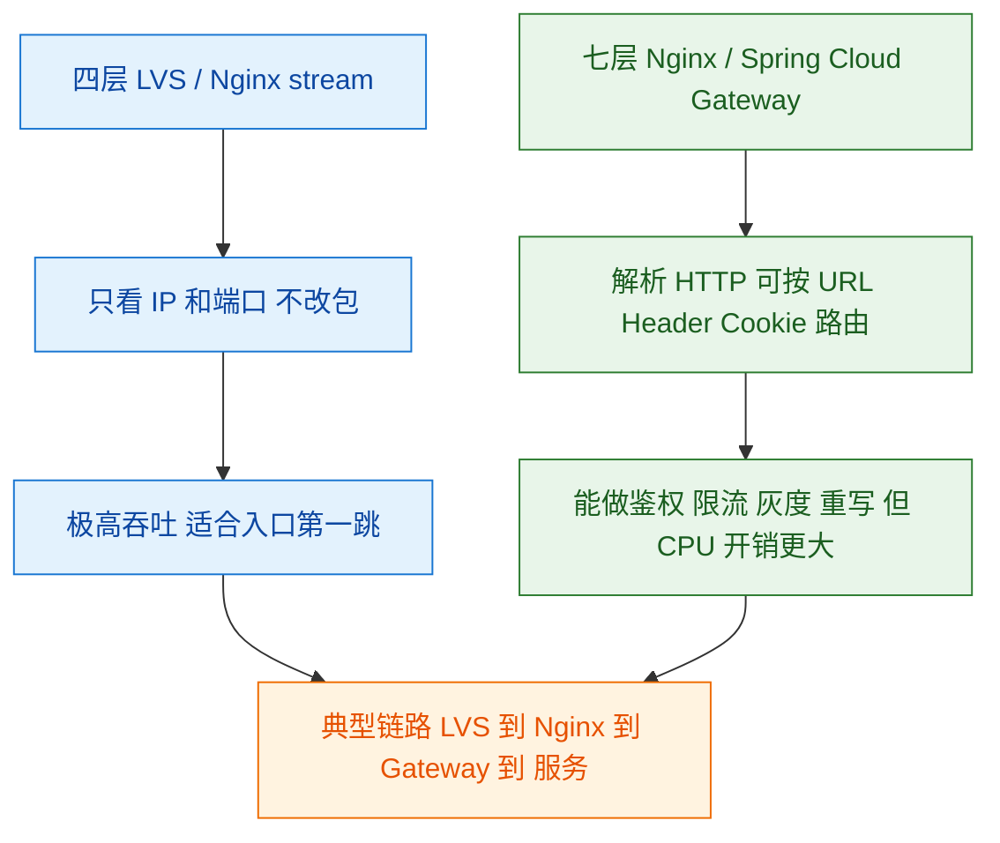
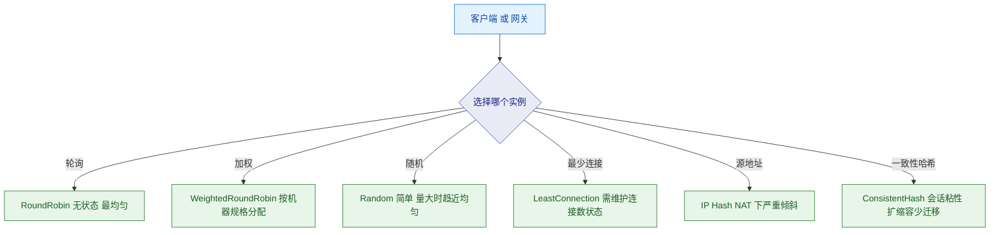
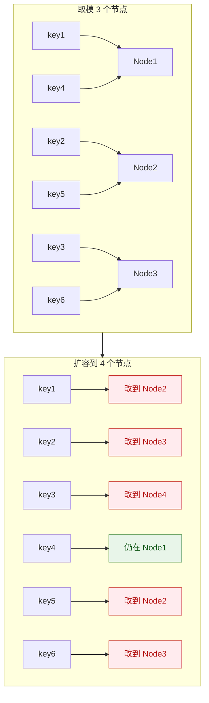
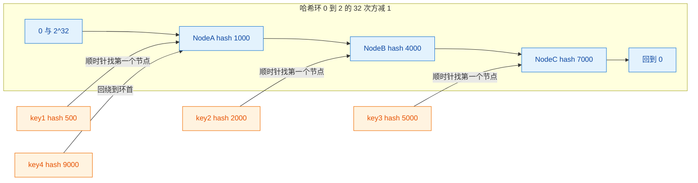
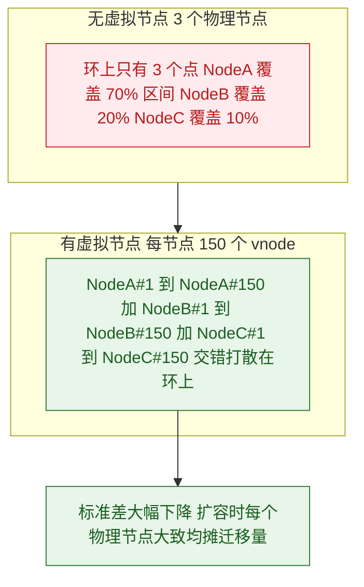
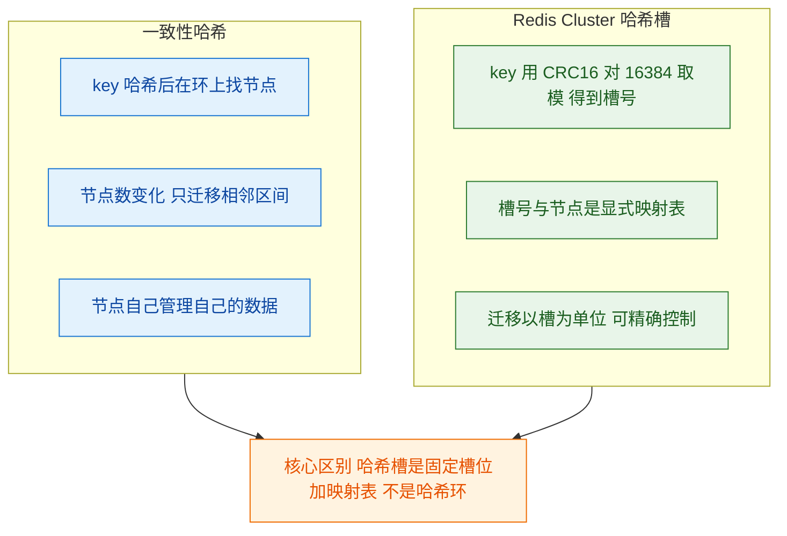
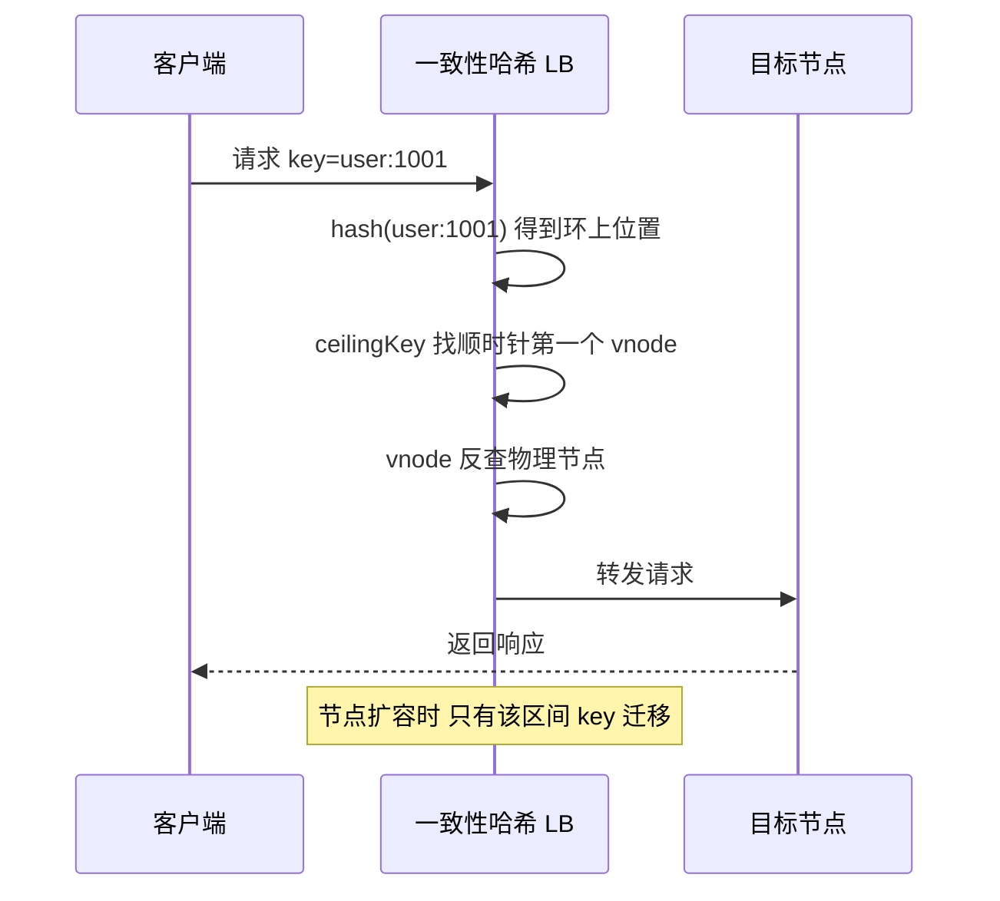
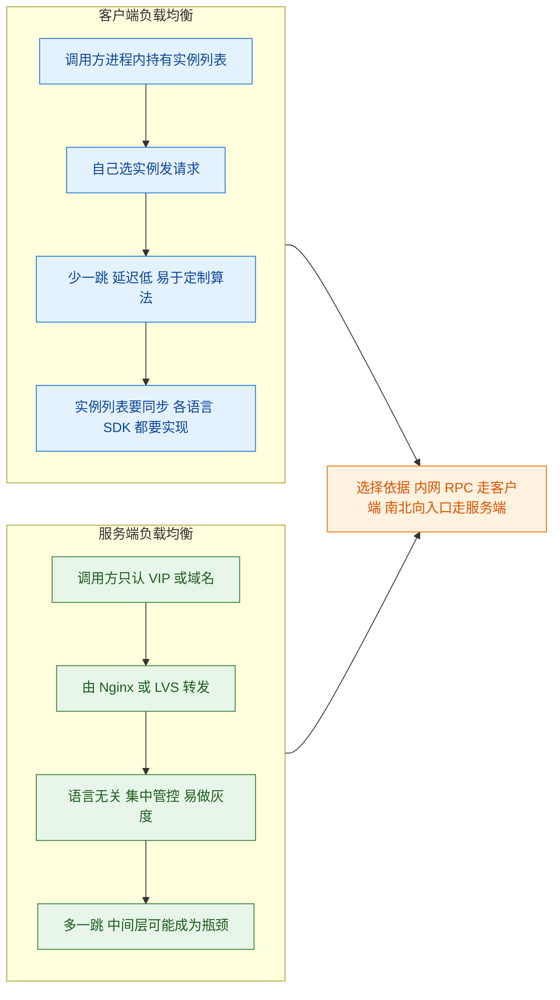
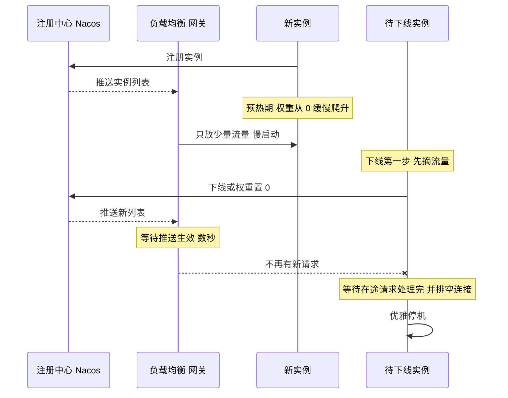

# ⚖️ 五、一致性哈希与负载均衡

> 本篇回答：`hash(key) % N` 到底错在哪，为什么「加一台机器」能让缓存几乎全部失效，而这又怎么演变成缓存雪崩？一致性哈希的哈希环凭什么能把迁移量从「几乎全部」降到「1/N」？节点少的时候数据为什么会严重倾斜，虚拟节点是怎么把标准差压下去的，虚拟节点数是不是越多越好？**Redis Cluster 的 16384 个哈希槽到底是不是一致性哈希**——如果不是，区别在哪？手写一致性哈希时 `TreeMap` 的 `ceilingKey` 为什么必须处理「取不到」的回绕？服务实例上下线时的流量抖动该怎么用「优雅上下线 + 预热慢启动」消掉？
> 与 [[6-缓存一致性与高可用]] 中的缓存雪崩/击穿部分是同一个问题的两面；限流与熔断见 [[7-限流熔断降级]]；ID 生成见 [[4-分布式ID与雪花算法]]。总览见 [[0-分布式总览]]。

---

## 一、负载均衡基础

### 1.1 四层 vs 七层

| 维度 | 四层（L4） | 七层（L7） |
| --- | --- | --- |
| **工作层次** | 传输层（TCP/UDP），只看 IP + 端口 | 应用层（HTTP/HTTPS/gRPC），解析报文内容 |
| **典型实现** | LVS、F5、Nginx `stream` 模块、云 SLB | Nginx `http`、HAProxy、Spring Cloud Gateway、Envoy |
| **转发方式** | 通常只改包（DNAT/IP 隧道），**不建立完整连接** | **代理模式**，客户端连接终止在 LB，再向后端建新连接 |
| **性能** | 极高（内核态，几十万~百万并发） | 相对低（用户态解析，CPU 开销大） |
| **能力** | 只看五元组，无法做内容路由 | 可按 URL/Header/Cookie 路由，能做鉴权、限流、灰度、重写、响应改写 |
| **典型位置** | 机房入口第一跳 | 服务入口、微服务网关 |



> [!important] L4 与 L7 的核心区别是「**连接的终点在哪**」
> - **L4**：客户端的一条 TCP 连接，经过 DNAT 后**直接和后端服务器建立**。LB 只是个「改写包头的路由器」，不参与 TCP 状态机 → 所以吞吐极高，但**它看不到 HTTP 内容**。
> - **L7**：客户端连的是 LB，LB 和后端**再建一条新连接**。LB 完整参与了两条连接 → 所以它能读懂请求、能做内容路由和改写，但代价是**每条连接占两倍资源**，且要处理 TLS 卸载。
> 这也解释了为什么 L7 网关的**连接数**是重要监控指标，而 L4 更关心**带宽和 PPS**。

### 1.2 常见负载均衡算法



| 算法 | 原理 | 适合场景 | 主要问题 |
| --- | --- | --- | --- |
| **轮询 RoundRobin** | 依次分配 | 后端**同构**、请求耗时相近 | 机器规格不同会导致慢机过载；**长请求**会堆积 |
| **加权轮询 WRB** | 按权重分配，权重按规格设 | 机器规格不一致 | 权重需要人工维护；权重与实际负载脱节 |
| **随机 Random** | 随机选一个 | 后端同构、请求量大 | 小样本下可能不均；同样不考虑实际负载 |
| **加权随机** | 按权重随机 | 规格不一致 | 同加权轮询 |
| **最少连接 LeastConn** | 选当前连接数最少的 | **请求耗时差异大**（长连接、慢查询） | **需要维护连接数状态**（LB 要跟踪每条连接）；只反映连接数，不反映真实负载 |
| **最少响应时间** | 选平均响应时间最短的 | 对延迟敏感 | 需要采集并滑动统计，实现复杂；慢节点恢复期会被打入冷宫（需要慢启动爬回） |
| **IP Hash** | `hash(clientIP) % N` | 需要**会话粘性** | **NAT 下严重不均**；节点增减导致大部分映射变化 |
| **URL Hash** | `hash(uri) % N` | 缓存友好（同类请求打到同机） | 热点 URL 会打爆单机 |
| **一致性哈希** | 哈希环 + 顺时针查找 | 缓存节点、有状态服务 | 需要虚拟节点解决倾斜；实现比取模复杂 |

> [!warning] IP Hash 在 NAT 下的不均匀是「致命级」的
> 中国移动等运营商的出口 NAT，会让**整个省的用户共用几个出口 IP**。结果是：
> - 某几个出口 IP 的哈希值恰好落在一台后端上 → **那台机器被打满**，其他机器闲置；
> - 这不是「轻微不均」，而是可能 **10:1 甚至 100:1 的倾斜**。
> 更糟的是这个倾斜**无法通过加机器缓解**——因为哈希值只由客户端 IP 决定，加机器只会让区间重新划分，热点 IP 还是集中在某一台。
> **结论：IP Hash 只适合「客户端 IP 分散」的内网场景（如内部服务间的会话粘性），绝不能用在公网入口。**

> [!warning] 最少连接的两个隐藏问题
> 1. **需要状态**：LB 必须为每条连接维护计数。L4 上这很难做（因为 L4 通常不跟踪连接生命周期），所以最少连接**主要是 L7 的能力**；LVS 的 `lc` 调度器是特例，它维护的是内部连接表。
> 2. **连接数不等于负载**：一个长连接的 WebSocket 和一个短查询都是「1 个连接」，但 CPU 消耗差几个数量级。所以最少连接常和「最少响应时间」结合使用。

---

## 二、普通哈希取模的问题（重点）

### 2.1 问题的本质

缓存分片最常见的做法：

```
nodeIndex = hash(key) % N        // N 是节点数
```

这个公式有一个致命缺陷：**N 变了，几乎所有 key 的映射结果都会变。**

原因很简单：`hash(key)` 是不变的，但除数从 N 变成了 N+1。对于任意一个 `h`，`h % 3` 和 `h % 4` 相等的概率只有约 **1/4**（更一般地，从 N 变到 N+1，保持不变的概率约为 `1/(N+1)`）。

所以：

| 操作 | 需要重新映射的 key 比例 | 3 节点扩到 4 节点 |
| --- | --- | --- |
| **取模** | 约 **N/(N+1)** | 约 **75%** |
| **一致性哈希** | 约 **1/(N+1)** | 约 **25%**（且只影响一台） |



### 2.2 为什么这会导致缓存雪崩

关键点：**取模方案下，扩容不是「增加容量」，而是「让 75% 的缓存同时失效」。**

| 阶段 | 发生了什么 |
| --- | --- |
| **扩容瞬间** | 75% 的 key 映射到了新节点，但**新节点是空的**；旧节点上那部分数据成了「永远不会被访问的垃圾」 |
| **请求涌入** | 75% 的请求 cache miss，**全部穿透到数据库** |
| **数据库** | 瞬时 QPS 放大约 4 倍（假设原来命中率 100%）→ 数据库被打满 |
| **级联** | DB 慢 → 应用线程池被占满 → 整个服务不可用 |
| **进一步恶化** | 如果应用有重试，实际打到 DB 的 QPS 还会再翻倍 |

> [!danger] 「缓存雪崩」这个词有三种成因，别混为一谈
> | 成因 | 机理 | 解法 |
> | --- | --- | --- |
> | **大量 key 同时过期** | TTL 设成相同值，同一时刻集体失效 | TTL 加随机抖动 |
> | **缓存节点整体宕机** | 单个 Redis 挂掉，其上所有 key 同时不可用 | 主从/哨兵/集群；本地缓存兜底；限流降级 |
> | **分片方案导致的大规模失效**（本章重点） | 取模扩缩容导致绝大多数 key 重新映射 | **一致性哈希 / 哈希槽**；或**成倍扩容 + 预热** |
> 三者现象相似（DB 被打爆），但根因和解法完全不同。**面试时能区分这三者，是「真懂」和「背八股」的分水岭。** 详见 [[6-缓存一致性与高可用]]。

### 2.3 取模方案还能用吗——什么时候可以

取模并非一无是处。它**简单、均匀、客户端无状态**，在以下条件下完全可用：

| 条件 | 说明 |
| --- | --- |
| **节点数长期不变** | 比如固定 8 个 Redis 分片，容量够用几年 |
| **扩容用「成倍扩容」** | 从 N 扩到 2N 时，每个旧节点的数据**要么留在原地、要么整体搬到一个新节点**（因为 `h % N` 和 `h % 2N` 的关系是确定的），迁移逻辑清晰 |
| **可以接受预热期** | 扩容后有一段「缓存冷启动」期，靠限流或提前预热扛过去 |
| **有降级能力** | DB 能扛住短时穿透，或有布隆过滤器/空值缓存兜底 |

> [!tip] 「成倍扩容」是一个很实用的工程技巧
> `h % N` 扩到 `h % 2N` 时，每个 key 的新位置只可能有两个：**原位置**，或者**原位置 + N**。这意味着迁移是「一个旧节点整体分一半出去」，可预测、可控。
> 但注意：**这只对「正好翻倍」成立**。从 3 扩到 6 可以，从 3 扩到 4 依然要重新洗牌。
> 所以如果坚持用取模，容量规划就要按 2 的幂来做。

---

## 三、一致性哈希原理

### 3.1 哈希环

一致性哈希的核心构造：**把哈希空间首尾相接构成一个环**，节点和数据都映射到环上。

1. 取哈希函数的输出空间，通常为 `[0, 2^32 - 1]`（32 位无符号整数）；
2. 把这个区间想象成一个**首尾相接的环**（`2^32 - 1` 的下一个是 `0`）；
3. 每个**节点**用它的标识（IP + 端口，或节点名）做哈希，落到环上某个位置；
4. 每个 **key** 同样做哈希，落到环上某个位置；
5. **从 key 的位置顺时针（沿哈希值增大的方向）出发，遇到的第一个节点就是它的归属节点。**



### 3.2 只有相邻区间的数据需要迁移

这是一致性哈希的全部价值所在。关键在于：**每个节点负责的是「它自己到前一个节点之间的那段弧」**。

| 操作 | 取模方案 | 一致性哈希 |
| --- | --- | --- |
| **增加节点 D** | 约 75%（N=3→4）需重新映射 | **只有 D 到前一个节点之间的那段弧**上的 key 迁移过来，其余 key **完全不动** |
| **删除节点 C** | 约 75% 需重新映射 | **只有原本属于 C 的那段弧**上的 key 迁移到 C 的下一个节点，其余不动 |
| **迁移量占比** | `N/(N+1)` | 约 `1/(N+1)` |

**为什么只有相邻区间？** 用一个具体的例子说清楚：

假设环上依次是 `NodeA(1000) → NodeB(4000) → NodeC(7000) → 回到 NodeA`。

- 原本负责区间 `(1000, 4000]` 的是 NodeB，负责 `(4000, 7000]` 的是 NodeC，负责 `(7000, 2^32] ∪ [0, 1000]` 的是 NodeA。
- 现在加入 `NodeD(5000)`。它落在 `(4000, 7000]` 里。
- 于是这段弧被**一分为二**：`(4000, 5000]` 归 NodeD，`(5000, 7000]` 仍归 NodeC。
- **只有原本落在 `(4000, 5000]` 的 key（原本归 NodeC）需要搬到 NodeD。** NodeA、NodeB 的区间没变，它们的 key 一个都不用动。

> [!important] 这就是「一致性哈希」名字的由来
> **「一致性（consistent）」在这里不是指 CAP 里的一致性，而是指「映射关系的稳定性」**——节点变化时，key 到节点的映射尽可能保持一致。
> 这个术语的歧义是面试常考的点：**一致性哈希和 CAP 中的 C（线性一致性）没有任何关系**，它解决的是「扩缩容时的数据迁移量」问题。

### 3.3 一致性哈希的代价

| 代价 | 说明 |
| --- | --- |
| **实现更复杂** | 需要维护环、排序、二分查找；取模只要一次取余 |
| **需要虚拟节点** | 否则数据倾斜严重（见 §4） |
| **内存开销** | 虚拟节点要存在内存里（如每节点 150 个 → 1000 个节点就是 15 万个条目） |
| **仍然不是「均匀」的** | 它保证的是「迁移量小」，不是「分布均匀」；均匀性要靠虚拟节点逼近 |
| **热点无法解决** | 如果某个 key 本身是热点（如热门商品），一致性哈希只能保证它总落在同一节点 → **该节点持续被打爆**。热点要靠本地缓存、key 打散、读写分离解决 |

> [!note] 一致性哈希保证「同一个 key 总是路由到同一个节点」——这是优点也是缺点
> 对缓存分片来说这是必需的（否则缓存永远 miss）；但如果这个 key 是热点，就变成了**持续的单点压力**。
> 所以**一致性哈希解决的是「分布/迁移」问题，不是「热点」问题**。这两类问题要在不同层面解决。

---

## 四、数据倾斜与虚拟节点

### 4.1 节点少时的倾斜有多严重

一致性哈希的均匀性完全是**运气**：节点哈希值在环上的分布是随机的，如果只有 3 个节点，它们很可能挤在一起。



假设 3 个节点的哈希值落成：`A=100`、`B=200`、`C=300`（在 `[0, 2^32)` 的尺度上，这三个点几乎挤在最开头）。那么：

| 区间 | 归属 | 覆盖比例 |
| --- | --- | --- |
| `(300, 2^32] ∪ [0, 100]` | NodeA | **约 99.99%** |
| `(100, 200]` | NodeB | 约 0.0000023% |
| `(200, 300]` | NodeC | 约 0.0000023% |

**这就是「数据倾斜」：NodeA 扛了几乎全部流量，NodeB 和 NodeC 闲置。**

> [!danger] 倾斜的恶性循环
> 倾斜不只是「负载不均」，它会自我放大：
> 1. 热点节点内存先满 → 触发 **LRU 淘汰**；
> 2. 被淘汰的 key 立刻 miss → 回源 DB → 重新写入 → **再次被淘汰**；
> 3. 该节点的**命中率持续走低**，实际上退化成了一个「透明的代理」，所有请求都穿透到 DB；
> 4. 同时该节点 CPU/网络被打满，**慢查询堆积**，甚至触发超时。
> 结果就是：**你加了 3 台机器，但有效容量只有 1 台多，而且那 1 台还在持续失效。**

### 4.2 虚拟节点如何解决

**虚拟节点（virtual node / vnode）** 的思路：**不要让一个物理节点在环上只占一个点，而是让它占很多个点。**

做法：

1. 每个物理节点生成 N 个虚拟节点，标识形如 `"192.168.1.1:6379#0"`、`"192.168.1.1:6379#1"` … `"#N-1"`；
2. 对每个虚拟节点标识做哈希，全部放到环上；
3. 每个虚拟节点**都指向它的物理节点**；
4. 查找时：找到 key 顺时针的第一个**虚拟节点**，再通过映射表拿到对应的**物理节点**。

**为什么有效？** 因为虽然单个节点的位置是随机的，但**大量的随机点会让「每个节点的总区间和」趋近于平均值**。这是大数定律的直接应用：vnode 数越多，每个物理节点覆盖的总弧长越接近 `1/N`。

| vnode 数/节点 | 分布效果 | 内存开销（1000 节点） |
| --- | --- | --- |
| 1（无 vnode） | 极差，可能 100:1 | — |
| 10 | 明显改善，但仍有可见偏差 | 1 万条 |
| **100 ~ 200** | **通常已足够均匀（工程常用值）** | 10 万 ~ 20 万条 |
| 1000 | 非常均匀，但收益递减 | 100 万条 |

> [!tip] 虚拟节点数怎么选
> 经验法则：**每个物理节点 100~200 个虚拟节点**，这是精度与内存的平衡点。
> - 从 1 加到 100，均匀性提升是**质变**；
> - 从 100 加到 1000，提升是**量变**（标准差按 `1/sqrt(vnode数)` 收敛），但内存涨 10 倍。
> - **不要盲目调到几千**：环的条目数 = 节点数 × vnode 数，如果节点有几千个，内存和构建环的时间都会成为问题。
> - 更好的做法是**让 vnode 数可以动态调整**：集群小的时候给多点 vnode，集群大了再调小。

**虚拟节点的额外好处：**

| 好处 | 说明 |
| --- | --- |
| **支持异构机器** | 性能强的机器给更多虚拟节点 → 自然实现「加权」 |
| **扩容迁移更均匀** | 新节点加入时，它从**所有**已有节点各「切」走一小块，而不是只从相邻那一个节点切走一大块 → **迁移压力被均摊到全集群** |
| **下线更平滑** | 一个节点下线，它负责的区间被均摊给其它所有节点，而不是全压给下一个节点 |

> [!important] 「迁移均匀」这一点比「分布均匀」更重要
> 没有虚拟节点时，加一个节点只影响**一个**已有节点（它俩相邻），那台机器要**独自承担全部迁移流量**，很可能被压垮。
> 有虚拟节点后，新节点的每个 vnode 都从不同的旧节点那里切走一小块 → **迁移流量被分散到 N 台机器上**。这才是虚拟节点在大规模集群里不可或缺的真正原因。

---

## 五、一致性哈希的实际应用

### 5.1 Redis Cluster 的哈希槽（16384 slots）

**这是面试最爱考的「陷阱题」：Redis Cluster 用的不是一致性哈希。**

| 维度 | 一致性哈希 | **Redis Cluster 哈希槽** |
| --- | --- | --- |
| **核心结构** | **哈希环**（首尾相接的连续空间） | **固定数量的槽位（16384 个）** + 槽到节点的**映射表** |
| **key 定位** | `hash(key)` 在环上顺时针找第一个节点 | `CRC16(key) % 16384` 得到**槽号**，再查表得到节点 |
| **数据归属** | **由哈希值所在的区间隐式决定** | **由显式的槽位分配决定**，可人为指定 |
| **迁移单位** | 区间的重新划分（隐式） | **槽（slot）**，可精确控制迁移哪个槽 |
| **加减节点** | 影响相邻区间 | 把若干**槽**从一个节点搬到另一个节点 |
| **均匀性** | 依赖虚拟节点 | 槽位数量固定，**只要平均分配槽即可均匀** |
| **实现复杂度** | 需要维护环 + vnode | 一张 16384 项的表，**非常简单** |



**为什么 Redis 选哈希槽而不是一致性哈希？**

| 原因 | 说明 |
| --- | --- |
| **迁移可控** | 槽是最小的迁移单位，集群可以**精确控制「正在迁移哪个槽」**，迁移过程中的 key 状态（MIGRATING/IMPORTING）清晰可追踪。一致性哈希的区间划分是隐式的，很难做到这种精确控制 |
| **均匀性确定** | 16384 个槽平均分给 N 个节点，**只要平均分就是均匀的**，不依赖哈希运气、不需要虚拟节点 |
| **元数据小** | 16384 位 = 2KB 的 bitmap 就能表示整个集群的槽归属，**节点间通过 gossip 协议交换的成本极低** |
| **为什么是 16384** | 这是 Redis 作者给出的经验值：心跳包要携带槽位 bitmap，16384 位 = **2KB**，在心跳包大小和集群规模之间取得了平衡；同时 16384 也远大于一般集群的节点数，够分 |
| **支持 `{}` hash tag** | 可以用 `{user1001}:name` 和 `{user1001}:age` 强制落到同一个槽，从而支持**多 key 操作** |

> [!important] 面试标准答法
> 「**Redis Cluster 不是一致性哈希，而是哈希槽。** 它把整个 key 空间预先划分为固定的 16384 个槽，用 `CRC16(key) % 16384` 定位槽，再用一张显式的映射表决定槽属于哪个节点。
> 和一致性哈希的区别在于：**一致性哈希靠哈希环隐式决定归属、迁移单位是区间；哈希槽靠固定槽数 + 显式映射决定归属、迁移单位是槽。**
> Redis 选哈希槽的原因是**迁移可控**（可以精确指定迁移哪个槽、追踪迁移状态）、**均匀性确定**（平均分槽即可，不需要虚拟节点）、**元数据极小**（2KB bitmap 就能表示，适合 gossip 传播）。」

> [!warning] 常见错误说法（听到就要纠正）
> - ❌「Redis Cluster 用一致性哈希分片」——用的是哈希槽。
> - ❌「Redis Cluster 有 16384 个虚拟节点」——16384 是**槽**，不是虚拟节点，两者概念完全不同。
> - ❌「加了 hash tag 就不会有热点」——hash tag 只是把多个 key 绑到同一个槽，如果这个槽是热点，反而**加剧**了热点。

### 5.2 其他中间件的分片策略对比

| 中间件 | 分片方式 | 是否一致性哈希 | 特点 |
| --- | --- | --- | --- |
| **Redis Cluster** | `CRC16(key) % 16384` → 槽 → 节点 | ❌ | 哈希槽，迁移单位是槽 |
| **Memcached（客户端分片）** | 早期用 `hash % N`；后多用**一致性哈希** | ✅（客户端库实现） | 分片逻辑在客户端（如 spymemcached、xmemcached），服务端无感知；节点变化时需要客户端感知 |
| **Nginx `hash`** | `hash($key) % N`（**取模**） | ❌ | 简单的取模哈希，节点变化时大量重新映射 |
| **Nginx `consistent_hash`** | 哈希环 + 虚拟节点 | ✅ | 需要第三方模块（如 `ngx_http_consistent_hash`），非官方内置 |
| **Nginx `ip_hash`** | `hash(clientIP) % N` | ❌ | 取模，NAT 下倾斜；且下游节点数变化需要 reload |
| **Kafka** | 分区（partition），`hash(key) % partitionCount` | ❌ | 分区数**通常不可减**（增减分区会破坏 key 到分区的映射）；需要有序就指定 key，不需要有序可轮询 |
| **RocketMQ** | 队列（queue），默认轮询，可指定 key 哈希 | ❌ | 队列数可动态增加；发送时按 key 选队列，消费端靠**顺序消费**保证同队列有序 |
| **Elasticsearch** | 文档 `_routing` 默认 `_id` 哈希 → 分片 | ❌ | 分片数**建索引时固定**，不能改（除非 reindex / split） |
| **Cassandra / DynamoDB** | 一致性哈希 + 虚拟节点 | ✅ | 分布式数据库的经典一致性哈希应用，节点加入时自动 rebalance |

> [!tip] Kafka/RocketMQ 分区的关键洞察
> 它们**都不使用一致性哈希**，因为：
> 1. **分区数变化本身就会破坏 key 有序性**——同一个 key 如果换了分区，消费顺序就乱了。所以 Kafka 的分区数原则上**建 topic 时就定好，之后不改**（改也只能增，且增了之后 key 映射会变）。
> 2. **它们要的是「可预测的均匀」而不是「最小迁移」**——因为 MQ 的数据本身就是要被消费掉的，不是需要长期保留的缓存数据，「迁移」根本不是主要矛盾。
> **这就是选型的本质：一致性哈希解决的是「状态数据的迁移成本」，如果你的数据不是需要长期保持一致映射的状态，就不需要它。**

### 5.3 Nginx 的两种哈希

| 指令 | 类型 | 行为 |
| --- | --- | --- |
| `hash $request_uri consistent;` | **一致性哈希**（Nginx 1.7.2+ 内置 `consistent` 参数） | 官方 `ngx_http_upstream_hash_module` 支持 `consistent` 关键字，开启后使用带虚拟节点的一致性哈希 |
| `hash $request_uri;` | **取模哈希** | 不带 `consistent` 时是简单取模 |
| `ip_hash;` | 取模哈希（按客户端 IP） | 老牌会话保持方案，NAT 下不均；**不能和 `weight` 一起用** |

```nginx
upstream backend {
    # 一致性哈希：节点变化时只迁移约 1/N 的数据
    hash $request_uri consistent;
    server 10.0.0.1:8080;
    server 10.0.0.2:8080;
    server 10.0.0.3:8080;
}
```

> [!note] Nginx 一致性哈希的 `consistent` 参数
> `hash ... consistent` 使用 **Ketama 一致性哈希算法**，默认给每个 server 分配 **160 个虚拟节点**（可通过 `hash ... consistent` 配合权重调整比例）。
> 这正是 §4.2 里「100~200 个 vnode」经验值的来源之一——**业界主流实现（Ketama、Nginx、Twemproxy）都收敛到了这个量级**。

---

## 六、手写一致性哈希

### 6.1 为什么用 TreeMap

核心操作是「**在环上找第一个大于等于 `hash(key)` 的节点**」。这需要：

1. **有序**：能按哈希值大小排序；
2. **高效的「找第一个 >= x 的元素」**：即**后继查找**。

Java 的 `TreeMap` 基于**红黑树**，提供 `ceilingKey(K key)`：

| 方法 | 语义 | 对环的用途 |
| --- | --- | --- |
| `ceilingKey(x)` | 返回 `>= x` 的最小 key | **核心：找顺时针第一个节点** |
| `floorKey(x)` | 返回 `<= x` 的最大 key | 找逆时针第一个节点（定位「前一个节点」的区间边界） |
| `firstKey()` | 最小 key | **回绕：超过最大哈希时要回到环首** |
| `lastKey()` | 最大 key | 判断是否越过了环的末端 |
| `tailMap(x)` | `>= x` 的子 Map | 批量处理从 x 开始的区间 |

**为什么不用数组 / 链表？**
- 数组：需要自己排序 + 二分查找，插入删除是 O(N)；
- 链表：查找是 O(N)；
- `TreeMap`：查找/插入/删除都是 **O(log N)**，且 API 直接提供了「后继查找」这个语义。**这是它被一致选用的原因。**

### 6.2 完整实现（带虚拟节点）

```java
import java.util.Collection;
import java.util.SortedMap;
import java.util.TreeMap;

/**
 * 带虚拟节点的一致性哈希实现
 * 关键点：
 *  1. 用 TreeMap 存「哈希值 -> 物理节点」，支持 O(log N) 的后继查找
 *  2. 每个物理节点生成 VIRTUAL_NODE_COUNT 个虚拟节点打散到环上
 *  3. ceilingKey 找不到时必须回绕到 firstKey()（哈希环是首尾相接的）
 */
public class ConsistentHash<T> {

    /** 每个物理节点对应的虚拟节点数，经验值 100~200 */
    private static final int VIRTUAL_NODE_COUNT = 160;

    /** 哈希环：key 是虚拟节点的哈希值，value 是物理节点 */
    private final TreeMap<Long, T> ring = new TreeMap<>();

    /** 物理节点 -> 它注册的所有虚拟节点哈希值，用于删除 */
    private final Map<T, List<Long>> nodeToHashes = new HashMap<>();

    /** 哈希函数，保证输出为 32 位无符号范围（用 long 承载避免负数问题） */
    private long hash(String key) {
        // 生产环境建议用 FNV1_32_HASH / MurmurHash / Ketama 自带的 MD5 取前 4 字节
        // 这里用 JDK 自带的实现仅为演示，注意要消除符号位影响
        long h = 0;
        for (int i = 0; i < key.length(); i++) {
            h = (h * 31 + key.charAt(i)) & 0xffffffffL;
        }
        return h & 0xffffffffL;
    }

    /** 添加一个物理节点 */
    public synchronized void addNode(T node) {
        List<Long> hashes = new ArrayList<>(VIRTUAL_NODE_COUNT);
        for (int i = 0; i < VIRTUAL_NODE_COUNT; i++) {
            // 虚拟节点标识：node + "#" + i，必须稳定且互不相同
            long h = hash(node.toString() + "#" + i);
            ring.put(h, node);
            hashes.add(h);
        }
        nodeToHashes.put(node, hashes);
    }

    /** 移除一个物理节点，同时清理它的所有虚拟节点 */
    public synchronized void removeNode(T node) {
        List<Long> hashes = nodeToHashes.remove(node);
        if (hashes == null) {
            return;
        }
        for (Long h : hashes) {
            ring.remove(h);
        }
    }

    /** 路由：找到 key 对应的物理节点 */
    public T getNode(String key) {
        if (ring.isEmpty()) {
            return null;
        }
        long h = hash(key);

        // 核心：找环上顺时针第一个虚拟节点
        SortedMap<Long, T> tail = ring.tailMap(h);
        Long target;
        if (tail.isEmpty()) {
            // 关键：h 比环上所有节点都大 -> 说明绕过了环的末端，回绕到第一个节点
            target = ring.firstKey();
        } else {
            target = tail.firstKey();
        }
        return ring.get(target);
    }
}
```

> [!danger] 三个最容易写错的地方
> **① 忘记回绕。** 如果只写 `ring.ceilingKey(h)`，当 `h` 大于环上所有节点的哈希值时，`ceilingKey` 返回 **`null`** → NPE 或路由失败。
> 因为哈希环是**首尾相接**的，`h` 落在最大节点之后，实际应该归给「环上的第一个节点」。**这是手写一致性哈希的头号 bug。**
> **② `removeNode` 没有清理虚拟节点。** 只从环上删一个物理节点是不够的——它在环上有 160 个点。如果不清理，节点下线后流量仍会被路由到它。所以必须维护 `node → hashes` 的反向索引。
> **③ 哈希值为负数。** Java 的 `String.hashCode()` 和 `byte` 都是有符号的。如果哈希结果可能为负，`TreeMap` 的排序会变成 `[-2^31, 2^31)` 的顺序，而「环」的语义要求 `[0, 2^32)`。**必须用 `& 0xffffffffL` 转成无符号 long**，否则回绕逻辑会错乱。
> 生产实现（Ketama）通常取 **MD5 的前 4 个字节**并转成无符号数，就是为了保证分布均匀且非负。

> [!tip] 无锁化的思路
> 上面的实现用了 `synchronized`，在超高并发下 `getNode` 会成为热点（读多写极少）。
> 优化方向：**读时无锁、写时复制**。维护一个 `volatile` 的不可变环引用，`addNode/removeNode` 时构造新环再整体替换（copy-on-write）。这样 `getNode` 完全无锁，且因为节点变更极少，写代价可以忽略。
> 或者用 `ConcurrentSkipListMap` 替代 `TreeMap`（也是有序的、支持 `ceilingKey`，且并发安全）。

### 6.3 路由时序



---

## 七、服务发现的负载均衡

### 7.1 客户端 vs 服务端负载均衡



| 维度 | 客户端负载均衡 | 服务端负载均衡 |
| --- | --- | --- |
| **代表** | Spring Cloud LoadBalancer（Ribbon 的继任者）、Dubbo 内置 LB、gRPC 的 client-side LB | Nginx、LVS、HAProxy、云 SLB、Spring Cloud Gateway |
| **实例列表来源** | 从注册中心（Nacos/Eureka）拉取 + **本地缓存** | LB 自己从注册中心拉取 |
| **网络跳数** | **少一跳**（直连后端） | 多一跳（经过 LB） |
| **延迟** | 更低 | 略高 |
| **语言绑定** | 每个语言都要实现一套 LB SDK | 语言无关 |
| **算法可定制** | 高（可自己写 `ReactorServiceInstanceLoadBalancer`） | 受限于 LB 的能力 |
| **运维/灰度** | 升级 SDK 才能改算法 | 改配置即可，**集中管控** |
| **故障域** | 无中心节点，但每个客户端都要正确同步列表 | 中间层是潜在瓶颈和单点（需要 LB 自身高可用） |

> [!important] 选择依据：看流量方向
> - **南北向（外部 → 系统入口）**：走**服务端**负载均衡（LVS → Nginx → Gateway）。因为要统一做 TLS、WAF、鉴权、限流，且客户端不可控。
> - **东西向（服务 → 服务）**：走**客户端**负载均衡（Nacos 拉列表 + LoadBalancer 选实例）。因为内网 RPC 追求低延迟，且多一跳的 LB 会成为瓶颈和单点。
> 这也是主流微服务架构的做法：**入口用 Gateway，内部用客户端 LB**。详见 [[8-微服务架构与注册配置中心]]。

### 7.2 实例上下线时的流量抖动

**故障场景：实例下线时流量打到已关闭的进程。**

| 时间线 | 发生的事 | 后果 |
| --- | --- | --- |
| T0 | 实例开始停机（`kill` 或滚动发布） | 进程停止接收新请求 |
| T0 + 0ms | **但注册中心还没感知到** | 调用方本地缓存里**仍有这个实例** |
| T0 ~ T0+Δ | 调用方继续把请求路由过来 | **Connection refused / 503** |
| T0 + Δ | 注册中心推送新列表 | 调用方更新缓存，恢复正常 |

**Δ 的大小决定了故障窗口：**

| 环节 | 典型耗时 | 说明 |
| --- | --- | --- |
| 心跳超时检测 | 数秒~30 秒 | 注册中心靠心跳判断存活，间隔越大检测越慢 |
| 推送延迟 | 毫秒~秒级 | 取决于推送机制（长连接推送 vs 客户端定时拉取） |
| **客户端缓存刷新** | 取决于拉取间隔 | 如果客户端是定时拉取（如每 30 秒），窗口可能长达 30 秒 |
| **连接池中的陈旧连接** | 一直存在 | 连接池里的连接指向已下线的实例，直到被剔除 |

> [!danger] 这个窗口的严重性取决于「下线是主动还是被动」
> - **主动下线（发布、缩容）**：可以优雅处理 → **先摘流量，再停服**。
> - **被动宕机（OOM、宿主机故障、kill -9）**：**没有办法优雅**，只能靠调用方的**重试 + 熔断 + 快速失败**。所以「优雅下线」只能解决一半问题，另一半必须靠客户端容错兜底（见 [[7-限流熔断降级]]）。

### 7.3 优雅上下线



**优雅下线的正确顺序（顺序错了就白做）：**

| 步骤 | 动作 | 为什么是这个顺序 |
| --- | --- | --- |
| **1** | **先从注册中心摘除**（或把权重置 0） | 必须**先**摘流量，否则后面的等待毫无意义 |
| **2** | **等待推送传播**（sleep 几秒，> 注册中心推送 + 客户端缓存刷新的最坏耗时） | 这是**最容易被漏掉的一步**。摘除是「异步生效」的，不等就等于没摘 |
| **3** | **停止接收新请求**（关闭监听端口 / 让健康检查失败） | 双保险，防止仍有漏网的调用方 |
| **4** | **等待在途请求处理完**（线程池优雅关闭，`awaitTermination`） | 避免正在处理的请求被中断，产生脏数据 |
| **5** | **释放资源**（关闭连接池、注销、flush 缓冲、提交 offset） | 顺序在最后，保证前面步骤用的资源还在 |
| **6** | **进程退出** | — |

> [!important] 第 2 步的等待时间怎么定
> 它必须 **大于**「注册中心推送延迟 + 客户端本地缓存刷新间隔」的最大值。
> - 如果客户端是**长连接推送**（Nacos 的 gRPC 推送），通常秒级；
> - 如果客户端是**定时拉取**，就要等一个完整的拉取周期。
> **保守做法：等 5~10 秒。** 这点停机时间对滚动发布几乎无感，但能消掉绝大部分 502/503。
> 在 K8s 里对应的是 **`preStop` 钩子**（先摘流量 + sleep）配合 **`terminationGracePeriodSeconds`**（给在途请求留时间）。

**优雅上线（预热 / 慢启动）：**

| 问题 | 后果 | 解法 |
| --- | --- | --- |
| 新实例刚启动，**JIT 未编译、连接池未建立、本地缓存为空** | 处理能力只有稳态的几分之一 | **慢启动**：权重从低到高（如 30 秒内从 10% 爬到 100%） |
| 新实例被瞬时打满 | 请求超时 → 调用方重试 → **雪崩** | 同上；也可在网关层做 |
| 新实例还没准备好就接流量 | 启动期 500 | **健康检查就绪探针（readiness）**，就绪后才注册 |

| 框架 | 慢启动支持 |
| --- | --- |
| **Spring Cloud LoadBalancer** | 有 `weight` 相关的 `ServiceInstanceListSupplier`，可自定义 |
| **Nacos** | 实例支持 `weight`，可通过权重调节流量 |
| **Envoy / Istio** | 内置 `slow start` 模式（`slowStartConfig`） |
| **Nginx** | `server ... slow_start=30s`（**仅商业版支持**） |
| **K8s** | 通过 `readinessProbe` + `preStop` 组合模拟 |

> [!tip] 「先摘流量再停服」是发布流程的硬性要求
> 很多团队发布时出现零星 502，排查半天发现是**先 `kill` 进程，注册中心才慢慢感知**。修复只需要在停服脚本最前面加一步「调用注册中心的下线接口 + sleep 5」。
> 这个改动成本极低、收益极高，是**微服务发布规范里性价比最高的一条**。

---

## 八、L4 / L7 与常见网关定位对比


| 组件 | 层次 | 定位 | 核心竞争力 | 短板 |
| --- | --- | --- | --- | --- |
| **LVS** | L4 | 机房入口四层转发 | 内核态、**吞吐最高**、支持 DR/TUN/NAT 多种模式 | 无内容感知；配置需专业运维；健康检查弱 |
| **HAProxy** | L4 + L7 | 通用高性能 LB | L4/L7 都强、**健康检查极其丰富**、会话保持好 | 配置语法自成一派；动态配置需要 reload 或用 Runtime API |
| **Nginx** | L7（也有 `stream` 做 L4） | 反向代理 + Web 服务器 | 生态成熟、静态资源、`upstream` 负载均衡、缓存 | 动态上下线需 reload（商业版有 API）；配置管理在容器时代略笨重 |
| **Spring Cloud Gateway** | L7 | **微服务网关** | 与 Spring 生态无缝、**Java 代码写过滤器**、集成注册中心与 Sentinel | 基于 Netty，吞吐不如 Nginx；JVM 内存开销；自身也需要多实例 |
| **Envoy** | L4 + L7 | 云原生数据面 | 动态配置（xDS）、可观测性极好、Istio 的数据面 | 学习和运维成本高；生态偏 K8s |
| **云 SLB / ALB** | L4 / L7 | 托管 LB | 免运维、弹性、自带 DDoS 防护 | 成本；有厂商绑定；超大规模时成本显著 |

**典型分层链路与各层职责：**

| 层 | 组件 | 做什么 |
| --- | --- | --- |
| **第一跳** | LVS / 云 SLB (L4) | 扛住全部入口流量，四层转发到 Nginx；用 VIP + Keepalived 做高可用 |
| **第二跳** | Nginx (L7) | TLS 卸载、静态资源、按域名/路径分流、基础限流、WAF |
| **第三跳** | Spring Cloud Gateway | 业务级鉴权、路由到微服务、灰度、请求改写、集成 Sentinel 限流 |
| **服务间** | 客户端 LB（LoadBalancer + Nacos） | 内网 RPC 直连，按算法选实例 |

> [!important] 为什么不能只用一层
> - **只用 Nginx**：Nginx 前面没有 L4，Nginx 自身就是单点，且它要处理全部 TLS 握手，CPU 压力大。
> - **只用 Gateway**：JVM 的吞吐和内存开销决定了它不适合做流量入口，且 TLS 卸载在 Java 里效率低。
> - **分层的好处**：每层只做自己最擅长的事——L4 拼吞吐，Nginx 拼并发连接和 TLS，Gateway 拼业务逻辑。**这也是「让专业的组件做专业的事」的体现。**

> [!note] 网关选型的一个实用判断
> - 团队是 **Java 为主**、需要和 Spring 生态深度集成（鉴权、灰度、与 Sentinel/注册中心打通）→ **Spring Cloud Gateway**。
> - 需要**极高性能**、语言无关、已有 Nginx 运维能力 → **Nginx + Lua（OpenResty）**。
> - 已经在 **K8s + Service Mesh** → **Envoy / Istio Ingress Gateway**。
> 这三种没有绝对优劣，**关键是看团队的运维能力和技术栈**——引入一个团队驾驭不了的组件，比用一个「性能差一点」的组件危险得多。

---

## 九、必答面试题

> [!question] Q1：一致性哈希为什么能减少数据迁移？
> **答题骨架：**
> 1. **先讲取模的问题**：`hash(key) % N`，N 一变，几乎所有 key 的映射结果都变。从 3 台扩到 4 台，约 **75%** 的 key 需要重新映射 → 缓存大面积失效 → 全部穿透到 DB → 雪崩。
> 2. **一致性哈希的构造**：把哈希空间 `[0, 2^32)` 首尾相接成环，节点和数据都落到环上；**key 顺时针找到的第一个节点就是它的归属**。
> 3. **关键性质**：每个节点负责的是「**它自己到前一个节点之间的那段弧**」。加入新节点 D 时，D 只从**它的前一个节点**那里切走一段弧，**其它节点的区间完全不变**。
> 4. **量化**：迁移量从 `N/(N+1)` 降到 `1/(N+1)`。3 台扩到 4 台，从 75% 降到 25%，而且**只有一台旧节点受影响**。
> 5. **补充**：删除节点同理——只有该节点负责的那段弧需要迁移到它的后继节点。
> 6. **收尾**：所以一致性哈希解决的是「**扩缩容时状态数据的迁移成本**」，注意它和 CAP 里的一致性没有关系。

> [!question] Q2：虚拟节点解决什么问题？
> **答题骨架：**
> 1. **问题一：数据倾斜。** 节点少时，哈希值在环上的分布是随机的，可能 3 个节点全挤在一起，导致一个节点覆盖 99% 的区间、其余节点闲置。
> 2. **倾斜的恶性循环**：热点节点内存先满 → LRU 频繁淘汰 → 命中率持续走低 → 请求全部穿透 DB → 该节点 CPU/网络被打满。**结果是加了三台机器，有效容量只有一台多。**
> 3. **解法**：给每个物理节点生成多个**虚拟节点**（标识如 `ip:port#0`、`#1`…），全部哈希到环上，每个 vnode 都指向同一个物理节点。查找时先找到 vnode，再映射回物理节点。
> 4. **为什么有效**：大量随机点的**总区间和**按大数定律趋近平均值，分布趋于均匀。
> 5. **更深的价值（加分点）**：虚拟节点还让**扩容时的迁移压力被均摊**——没有 vnode 时，新节点只从相邻的一个旧节点切走一大块，那台机器要独自承担全部迁移流量；有 vnode 时，新节点的每个 vnode 从不同旧节点各切一小块，**迁移被分散到全集群**。这一点比「分布均匀」更重要。
> 6. **数量怎么选**：经验值**每节点 100~200 个**（Ketama、Nginx 都落在 160 附近）。再往上收益递减（标准差按 `1/sqrt(vnode数)` 收敛），但内存线性增长。

> [!question] Q3：Redis Cluster 用的是一致性哈希吗？
> **答题骨架：**
> 1. **直接回答：不是。** Redis Cluster 用的是**哈希槽（hash slot）**。
> 2. **机制**：整个 key 空间被预先划分成固定的 **16384 个槽**；用 `CRC16(key) % 16384` 算出槽号；再用一张**显式的映射表**决定这个槽属于哪个节点。
> 3. **和一致性哈希的区别**：
>    - 一致性哈希靠**哈希环**，归属由哈希值所在的**区间隐式决定**，迁移单位是**区间**；
>    - 哈希槽靠**固定槽数 + 显式映射表**，归属由**分配决定**，迁移单位是**槽**，可以精确控制迁移哪个槽。
> 4. **为什么 Redis 这么选**：
>    - **迁移可控**：槽是最小迁移单位，迁移中 key 的状态（MIGRATING/IMPORTING）可精确追踪；
>    - **均匀性确定**：16384 个槽平均分给 N 个节点，**平均分就是均匀的**，不需要虚拟节点；
>    - **元数据极小**：16384 位 = **2KB**，可以用 bitmap 表示并通过 gossip 协议在节点间传播，16384 这个数字本身就是在「心跳包大小」和「集群规模」之间取的平衡。
> 5. **补充**：还支持 `{}` hash tag（如 `{user1}:name`、`{user1}:age`）强制落到同一槽，以支持多 key 操作。但要注意 hash tag 会**加剧热点**。

> [!question] Q4（追问）：一致性哈希有什么缺点？
> **答题骨架：**
> 1. **倾斜**：不加虚拟节点时会严重倾斜，**加虚拟节点是必需的，不是优化**。
> 2. **元数据开销**：每个物理节点 160 个 vnode，1000 个节点就是 16 万个条目，内存和构建时间都不可忽略。
> 3. **热点无法解决**：一致性哈希保证同一 key 总落在同一节点——对缓存是优点，但如果这个 key 是热点，就会造成**持续的单点压力**。热点要靠本地缓存、key 打散、读写分离解决，不是一致性哈希能解决的。
> 4. **实现复杂**：环的维护、回绕处理、哈希函数选择都有坑（比如**忘记处理 `ceilingKey` 返回 null 的情况**）。
> 5. **它不保证严格均匀**：只保证「迁移量小」。均匀性是靠虚拟节点逼近的，不是数学保证。
> 6. **收尾**：所以选型时要问自己——**我的数据是「需要长期保持一致映射的状态数据」吗？** 是（缓存分片、有状态存储）→ 一致性哈希合适；不是（MQ 分区、无状态请求路由）→ 取模或轮询更简单。

> [!question] Q5（追问）：服务实例下线时怎么避免流量打到已停的进程？
> **答题骨架：**
> 1. **根本原因**：注册中心感知下线是**异步**的，而调用方本地还缓存着实例列表 → 存在一个「**已停服但仍被路由**」的时间窗口。
> 2. **窗口有多长**：取决于「心跳超时检测 + 推送延迟 + 客户端缓存刷新间隔」，**可能长达几十秒**。
> 3. **解法：优雅下线，顺序是关键**：
>    ① **先从注册中心摘除**（或权重置 0）→ ② **等待推送传播**（sleep 5~10 秒，覆盖最坏推送+刷新耗时）→ ③ 停止接收新请求 → ④ 等待在途请求处理完（线程池 `awaitTermination`）→ ⑤ 释放资源 → ⑥ 退出。
>    **第 ② 步最容易被漏掉**——摘除是异步生效的，不等待等于没摘。
> 4. **K8s 对应**：`preStop` 钩子做「摘流量 + sleep」，`terminationGracePeriodSeconds` 给在途请求留时间。
> 5. **优雅上线**：对称地，新实例要**预热/慢启动**（权重从 0 爬升），避免 JIT 未编译、连接池未建立时被瞬时打满。
> 6. **兜底**：优雅下线只能覆盖**主动下线**；**被动宕机（OOM、kill -9）无法优雅**，必须靠调用方的**重试 + 熔断 + 快速失败**兜底（见 [[7-限流熔断降级]]）。

---

## 十、小结

| 要点 | 结论 |
| --- | --- |
| **L4 vs L7** | L4 只看五元组、不建完整连接、吞吐极高；L7 解析内容、能路由改写、开销大。典型链路：LVS → Nginx → Gateway → 服务 |
| **算法选择** | 轮询/加权适合同构；最少连接适合请求耗时差异大但需要状态；**IP Hash 在 NAT 下会致命倾斜，不能用于公网入口** |
| **取模的问题** | `hash % N` 在 N 变化时约 `N/(N+1)` 的 key 重新映射 → 3 扩 4 有 **75%** 失效 → 缓存雪崩 |
| **一致性哈希** | 哈希环 + 顺时针查找；每个节点负责「自己到前一个节点」的弧；**只迁移相邻区间**，迁移量降到 `1/(N+1)` |
| **虚拟节点** | 解决**倾斜**（大数定律让区间和趋近平均）+ **让扩容迁移压力均摊到全集群**；经验值 **100~200 个/节点** |
| **Redis Cluster** | **不是一致性哈希**，是 **16384 个哈希槽**（`CRC16(key) % 16384` + 显式映射表）。选它是因为迁移可控、均匀确定、2KB bitmap 元数据极小 |
| **手写实现** | 用 `TreeMap` 做 O(log N) 后继查找；**`ceilingKey` 返回 null 时必须回绕到 `firstKey()`**；哈希值要转无符号；`removeNode` 要清理全部 vnode |
| **客户端 vs 服务端 LB** | 南北向入口用服务端（Nginx/Gateway），东西向内网用客户端（Nacos + LoadBalancer） |
| **优雅上下线** | 下线：**先摘流量 → 等推送传播 → 再停服**（顺序不能错）；上线：**预热/慢启动**。被动宕机只能靠熔断重试兜底 |
| **选型的本质** | 一致性哈希解决的是「**状态数据在节点变化时的迁移成本**」。数据不需要保持映射 → 取模/轮询更简单 |

> [!tip] 串联阅读
> - 缓存雪崩的另外两种成因（同时过期、节点宕机）与完整的缓存高可用设计见 [[6-缓存一致性与高可用]]。
> - 熔断、降级、重试是「优雅上下线」覆盖不到的被动故障的兜底，见 [[7-限流熔断降级]]。
> - 注册中心如何推送实例列表、Nacos 的健康检查机制见 [[8-微服务架构与注册配置中心]]。
> - ID 生成器的分片与路由见 [[4-分布式ID与雪花算法]]；分布式锁在 Redis 集群下的问题见 [[3-分布式锁]]。
> - 完整高频题合集见 [[9-分布式面试高频题]]，总览见 [[0-分布式总览]]。
