# 🗄️ 六、缓存一致性与高可用

> 这一篇回答四个问题：**缓存该用哪种模式**、**缓存和数据库怎么才能"看起来一致"**、**缓存穿透/击穿/雪崩在生产上到底怎么解**、**Redis 从主从到 Cluster 的高可用架构该怎么选**。
> 面试里「缓存一致性」几乎是必问，但大多数人只会背"先删缓存再更新 DB"——这一篇要把**为什么这个顺序是错的**、**延迟双删为什么治标不治本**、**读写并发下那个经典竞态**讲透。
> 前置阅读：[[1-分布式理论基础]]（CAP/BASE，缓存一致性的天花板由它决定）、[[3-分布式锁]]（互斥重建热点 key）、[[2-分布式事务]]（异步删缓存的可靠投递）。相关内容：[[面试准备/技术面试题库/07-Redis与缓存]]、[[面试准备/技术面试题库/09-分布式与微服务]]。
> 下游延伸：[[7-限流熔断降级]]（雪崩与熔断降级强耦合）、[[8-微服务架构与注册配置中心]]（配置中心广播失效本地缓存）。

---

## 一、缓存到底解决了什么问题

### 1.1 缓存的价值与代价

| 价值 | 说明 |
|---|---|
| **降低响应延迟** | 内存访问 vs 磁盘 + 网络往返，差 2~3 个数量级 |
| **保护后端存储** | 把读流量挡在 DB 之前，DB 压力下降比例 ≈ 缓存命中率 |
| **抗突发流量** | DB 扩容是分钟级，缓存扩容是秒级 |

| 误解 | 真相 |
|---|---|
| 缓存是为了存数据 | 缓存是为了**用冗余换延迟**；一致性代价是引入冗余的固有成本 |
| 缓存和 DB 能做到强一致 | 做不到；目标是**最终一致 + 收敛时间可控 + TTL 兜底 + 对账修复** |

### 1.2 一致性的两个层次

- **强一致**：任意时刻，任何读都能读到最新写入。要求缓存与 DB 在同一个事务里提交——**做不到**（除非用分布式锁把读写串行化，或用同一份存储）。
- **最终一致**：停止写入后，经过一个有界时间 T，缓存与 DB 收敛。**T 就是我们要控制的指标**。

> [!tip] 面试第一句话就定调
> 「缓存和 DB 无法做到强一致，因为它们是两个独立存储、无法参与同一个本地事务。工程目标是**最终一致 + 收敛时间可控**，再叠加**过期时间兜底**和**对账修复**。」
> 这句话说出来，面试官就知道你懂边界，而不是背答案。

---

## 二、缓存模式全景

### 2.1 四种模式

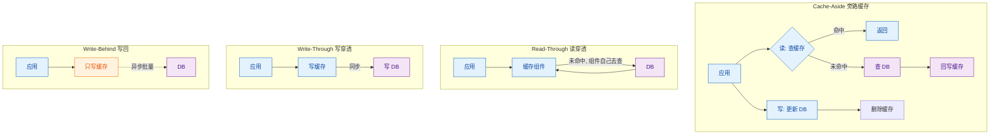

### 2.2 一致性语义与适用场景对比

| 模式 | 一致性语义 | 写延迟 | 实现复杂度 | 与 DB 耦合度 | 适用场景 |
|---|---|---|---|---|---|
| **Cache-Aside**（旁路） | 弱一致，靠 TTL 兜底；删除失败会长期脏 | 低（只操作 DB） | **最低** | 无耦合，缓存挂了业务还能跑 | **99% 的互联网业务**；读多写少 |
| **Read-Through** | 与 Cache-Aside 等价，但回源逻辑下沉到缓存层 | 低 | 中（需缓存组件支持或自研包装） | 中，应用不感知 DB | 希望统一收口回源逻辑；Caffeine `LoadingCache` |
| **Write-Through** | 较强（同步写两份），但**非原子**，第二步失败仍不一致 | **高**（写要等两次落盘） | 中 | 高 | 写少读多、对写后立即读一致敏感（如配置） |
| **Write-Behind**（写回） | 最弱，DB 落后缓存一段时间，**宕机丢数据** | **最低** | 高（批量、合并、重试、崩溃恢复） | 高 | 计数器、点赞数、时序埋点等**可容忍丢少量**的写密集场景 |

### 2.3 为什么 Cache-Aside 最流行

1. **符合懒加载思想**：缓存里只放「真正被访问过的数据」，不会被冷数据挤爆内存。Write-Through 会把从没被读过的数据也塞进缓存。
2. **对缓存故障容忍度最高**：缓存挂了，读回源、写只打 DB，业务整体可用（只是变慢）。Write-Behind 缓存一挂就丢数据。
3. **与业务代码解耦最轻**：一个「查缓存 → miss → 回源 → 回写」的模板就能封装，不需要缓存中间件支持特殊协议。
4. **写路径最短**：写操作只有一次 DB 往返，不引入额外的缓存写失败点。
5. **生态默认**：Spring Cache 的 `@Cacheable` / `@CacheEvict` 本质就是 Cache-Aside 的注解化。

> [!warning] 常见误区
> Spring Cache 的 `@CachePut` 是**更新**缓存，属于 Write-Through 思路，**并不推荐**在并发写场景用。原因见 3.2 节。

---

## 三、数据库与缓存的一致性（核心）

### 3.1 四种操作顺序，只有一种可用

| # | 顺序 | 并发下是否产生脏数据 | 结论 |
|---|---|---|---|
| 1 | 先更新 DB，再**更新**缓存 | **会**：两个并发写可能让旧值最后落进缓存 | ❌ |
| 2 | 先更新缓存，再更新 DB | **会**，且缓存回滚困难 | ❌ |
| 3 | **先删缓存，再更新 DB** | **会**：读请求可在删除后、更新前把旧值回写 | ❌ |
| 4 | **先更新 DB，再删缓存** | **理论上会，但概率极低** | ✅ **较优解** |

面试的落点是第 4 种：**Cache-Aside + 删除缓存 + 先 DB 后缓存**。

### 3.2 为什么是「删除」而不是「更新」

两个理由，第二个才是关键：

1. **懒加载**：删除后不写缓存，等下次读的时候按需重建。避免了"更新了一个其实没人读的 key"，也避免缓存里堆积冷数据。
2. **并发更新会导致旧值覆盖新值**（这才是关键）：

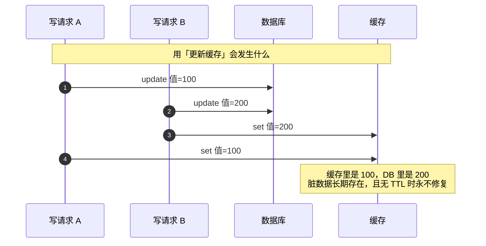

如果换成**删除**：W1 删、W2 删，最终缓存为空，下次读回源拿到 DB 的 200。**删除是幂等的，更新不是**——这是最本质的理由。

### 3.3 两种顺序的并发脏数据（必须会画）

#### 3.3.1 「先删缓存，再更新 DB」的脏数据

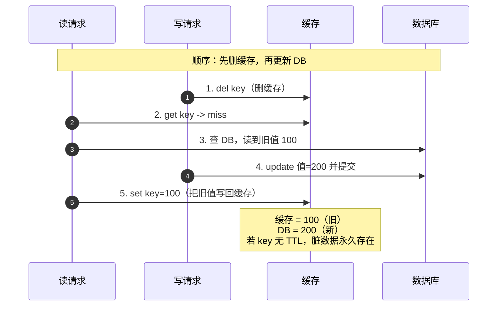

**根因**：删除动作发生在写入之前，留下了一个「缓存为空 + DB 还是旧值」的窗口，读请求正好在这个窗口回源。**这个脏数据是稳定可复现的。**

#### 3.3.2 「先更新 DB，再删缓存」的脏数据

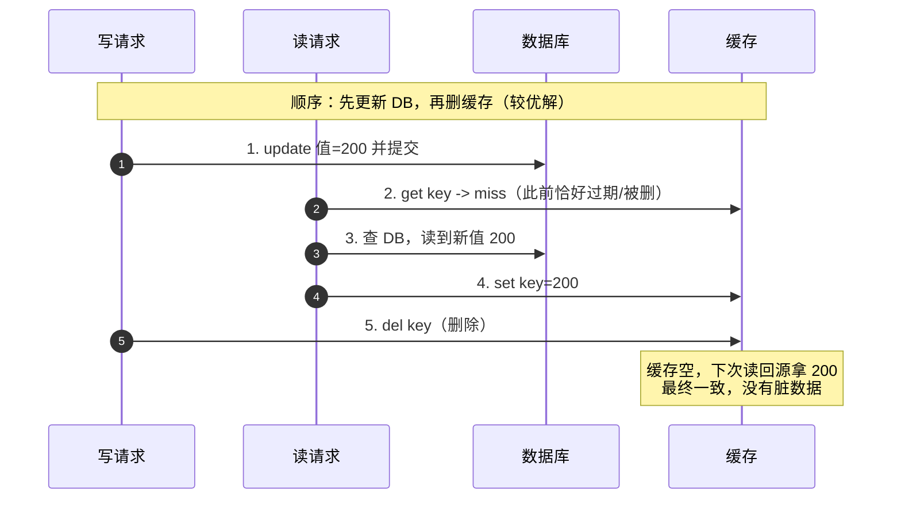

**那它什么时候还是会脏？** 只有一种时序能造出脏数据：**读请求在缓存 miss 后读到旧值，且它的「回写缓存」晚于写请求的「删除缓存」**——即「迟到的回写」（详见 3.6 节）。要凑成这个时序，需要**三个苛刻条件同时成立**：

| 条件 | 现实概率 | 为什么 |
|---|---|---|
| 读请求在缓存 miss 后、回源 DB 前，写请求完成「更新 + 删除」 | 低 | 写请求必须在一个读请求的 DB 查询往返时间内完成两步 |
| 读请求的回写**晚于**写请求的删除 | 低 | 依赖线程调度、GC 停顿、网络抖动 |
| 该 key 之后**再无写操作**，且**没有 TTL** | 极低 | 任何一次后续写都会删掉它；有 TTL 则自动收敛 |

> [!important] 这就是结论
> 「先更新 DB 再删缓存」不是绝对不脏，而是**脏数据的必要条件极其苛刻，且天然被 TTL 和后续写操作修复**。相比之下「先删缓存再更新 DB」的脏数据是**稳定可复现**的。
> 面试时能说出「第 4 种也有窗口，但需要读回写晚于写删除，概率极低」，比背「第 4 种就是对的」高一个档次。

### 3.4 删除缓存失败怎么办

`del key` 失败（网络抖动、Redis 主从切换、客户端超时）→ 缓存里长期是旧值。三种补偿方案：

#### 方案一：延迟双删

**做法**：更新 DB 前后各删一次，第二次延迟一段时间执行。

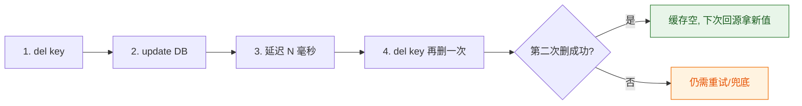

**延迟多久？** 应该覆盖「**一次读请求从缓存 miss 到回写缓存的最大耗时**」——包括 DB 查询 + 网络 + GC 停顿 + 线程调度。工程上通常取**几百毫秒量级**，并通过压测 P99.9 来确定，绝不能拍脑袋。

**为什么它不能完全解决问题**：

| 局限 | 说明 |
|---|---|
| 依赖延迟估计 | 延迟太短覆盖不住长尾请求；延迟太长，不一致窗口被拉长 |
| 第二次删除仍可能失败 | 只是把失败概率降低，没有消除 |
| 异步线程不可靠 | 用 `ScheduledExecutorService` / 线程池做延迟，**应用重启就丢任务** |
| 主从复制延迟 | 删除命令同步到从库有延迟，从库上仍能读到旧值 |
| 治标不治本 | 仍是"尽力而为"的补偿，没有可靠投递保证 |

> [!danger] 面试答案的层次感
> 说「延迟双删」只能算及格。**必须补一句**：「延迟双删是概率性补偿，延迟时间依赖对回源耗时的估计，且第二次删除仍可能失败、异步任务重启会丢。**更可靠的做法是走 binlog 订阅（Canal）异步删缓存**，因为它把删除动作与业务事务解耦、有位点可重放、可重试。」

#### 方案二：binlog 订阅（Canal），推荐

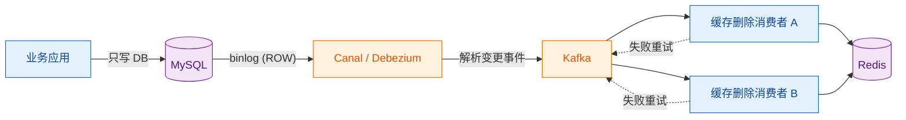

| 优势 | 说明 |
|---|---|
| **与业务解耦** | 业务代码只写 DB，删缓存逻辑完全不侵入，不会「漏删」 |
| **天然有序** | 按 binlog 位点顺序消费；即使乱序，删除操作幂等 |
| **可重放** | 位点持久化，消费者挂了重启后从位点继续，不丢事件 |
| **可重试** | 消费失败进重试队列 / 死信队列，人工兜底 |
| **覆盖所有写路径** | DBA 手工改数据、其他服务写同一张表，照样触发删除 |

**代价与注意点**：引入 Canal + MQ 两个组件，运维复杂度上升；删除是**异步**的，存在毫秒~秒级不一致窗口（比延迟双删更可控可观测）；需处理 DDL 变更、大事务，**binlog 格式必须为 ROW**；需**过滤表**，别把全库变更都灌进 MQ。

#### 方案三：消息队列补偿

在业务事务里写一张**本地消息表**（与业务更新同事务），再由投递器扫描投递「删缓存」消息，消费者执行删除，失败则重试直到成功。与 [[2-分布式事务]] 的「本地消息表」完全同构：比延迟双删可靠（有持久化、有重试），比 Canal 侵入（要写消息表），适合**只在少数关键 key 上做**。

### 3.5 三种补偿方案对比

| 维度 | 延迟双删 | 本地消息表 + MQ | binlog 订阅（Canal） |
|---|---|---|---|
| 可靠性 | 低（延迟估计 + 异步任务易丢） | **高** | **高** |
| 业务侵入 | 中（每个写方法都要加） | 高（要写消息表） | **无** |
| 不一致窗口 | 取决于延迟参数，不可控 | 秒级，可控 | 毫秒~秒级，**最短** |
| 实现复杂度 | 低 | 中 | 中高（要运维 Canal + MQ） |
| 覆盖 DBA 手工改数据 | ❌ | ❌ | ✅ |
| 推荐度 | 兜底/过渡 | 关键 key 场景 | **中大型系统的首选** |

### 3.6 读写并发下的临界场景（经典竞态）

3.3.2 那个时序就是面试官最爱追问的经典竞态：**读请求在「写请求删除缓存之前」读到旧值，并在「写请求删除缓存之后」才把旧值回写缓存** → 脏数据长期存在。触发条件是「读线程在回源后被挂起（调度/GC/网络抖动），而写线程在这段间隙完成了更新 + 删除」。

**工程上怎么压制它**：

| 手段 | 作用 | 局限 |
|---|---|---|
| **给所有缓存设 TTL** | 脏数据最多存活一个 TTL，**最便宜、最有效的兜底** | 只能缩短窗口，不能消除 |
| 缓存回写加版本号/时间戳 | 写入时比较版本，旧版本不回写 | 需要额外存储版本，复杂度上升 |
| 读路径串行化（分布式锁） | 彻底消除竞态 | 性能崩塌，仅适合极少数强一致 key |
| 双删 + Canal | 二次删除覆盖迟到的回写 | 异步窗口仍在 |
| 变更后短暂「读旧」降级 | 业务上容忍 | 治标 |

> [!important] 一句话结论
> **不能做到强一致。** 能做的是：先更新 DB 再删缓存 + TTL 兜底 + Canal 异步二次删除 + 对账任务修复极端情况，把收敛时间压到业务可接受的水平。

### 3.7 一致性方案选型决策

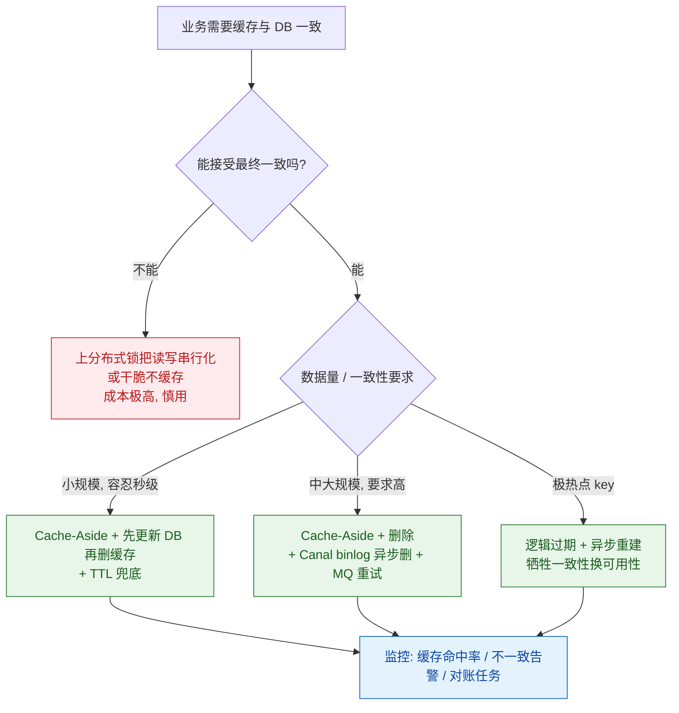

---

## 四、三大缓存问题

> 这三个问题必须**讲成因 + 讲量化 + 讲组合拳**，只背结论会被追问到崩。

### 4.1 缓存穿透（查不存在的数据）

**成因**：请求的 key 在缓存和 DB 里**都不存在**。缓存无法命中 → 每次都打到 DB → 缓存形同虚设。典型来源：**恶意攻击**（用不存在的 ID 遍历）、**业务参数错误**（如 `id=-1`）、**数据被删但请求仍在**。

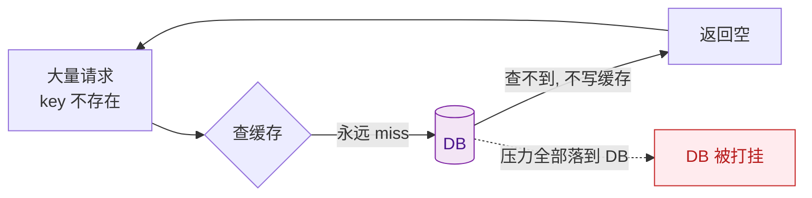

#### 解法一：布隆过滤器（Bloom Filter）

**原理**：一个位数组 + k 个哈希函数。插入元素时把 k 个哈希位置置 1；查询时若**任一位置为 0 则一定不存在**，若全为 1 则**可能存在**。

| 特性 | 说明 |
|---|---|
| 空间效率 | 极高，比特级存储，远小于存原始 key |
| 误判方向 | **只会误判「存在」（假阳性），不会误判「不存在」（假阴性）** |
| 误判率 | 由位数组长度 m、元素个数 n、哈希函数个数 k 共同决定；m/n 越大、k 取到合适值，误判率越低（可按公式预先估算，**不要凭感觉说一个数**） |
| **不支持删除** | 把某位置 0 会影响其他元素的判断 → 删数据后必须用**变体** |

**生产注意点**：

- **删除问题**：用 **Counting Bloom Filter**（位数组换成计数器）或 **Cuckoo Filter**（支持删除且空间效率更好）；
- **数据同步**：布隆过滤器是**全量数据的摘要**，新增数据要同步加入；通常启动时预热 DB 全量 key，之后由 **binlog 订阅**增量维护；
- **重建**：全量重建需要双 buffer 切换（新过滤器构建完成后原子替换），避免重建期间穿透；
- **放在哪**：放 Redis（`RedisBloom` 模块）可多实例共享；放本地内存（Guava `BloomFilter`）性能最好但要自己解决多实例同步。

#### 解法二：空值缓存

查 DB 为空 → 缓存一个特殊标记（如空对象），**TTL 设短**（几十秒到几分钟）。

| 优点 | 缺点 |
|---|---|
| 实现极简，无需额外组件 | 占用缓存空间（攻击者可用随机 key 撑爆内存） |
| 对「数据真的不存在」的重复查询效果最好 | **数据后来被创建时，必须主动删除这个空值**，否则读到假空 |
| | TTL 太短则防护效果弱，太长则不一致窗口大 |

> [!warning] 空值缓存 + 布隆过滤器的最佳组合
> 布隆过滤器挡住**大部分**不存在的 key，空值缓存兜住**穿过过滤器的那一小部分**，再叠加**参数合法性校验**（ID 格式、范围、必填），三层防护。**参数校验是第一道、也是最便宜的一道**，别跳过。

#### 解法三：接口层限流 + 黑名单

对高频查询不存在 key 的 IP / 用户做限流甚至封禁（见 [[7-限流熔断降级]]）。这属于「从源头减少攻击面」，与上面两个方案互补。

### 4.2 缓存击穿（热点 key 过期）

**成因**：**某个被极高并发访问的热点 key 恰好过期（或被删）**，瞬间所有请求同时 miss，全部涌向 DB 重建。注意与雪崩的区别：击穿是**单个 key**，雪崩是**大批 key**。

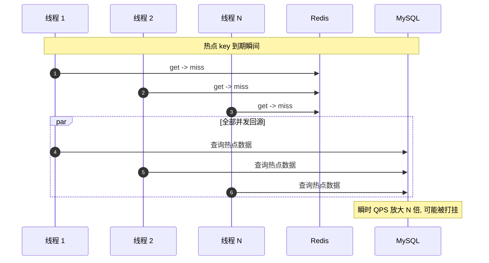

#### 方案一：互斥锁重建（只放一个线程回源）

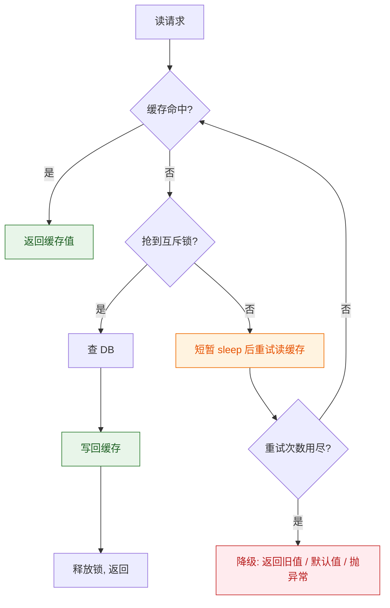

**关键参数与坑**：

| 项 | 生产建议 |
|---|---|
| 锁的类型 | 单机 `ReentrantLock` / `synchronized` 只锁本 JVM，多实例仍需 **Redis 分布式锁**（见 [[3-分布式锁]]） |
| 锁超时 | 必须设，防止持锁线程崩溃导致死锁 |
| 未抢到锁的线程 | **不能空转自旋**，要 sleep 一小段（如几十毫秒）再重试，并设最大重试次数 |
| 重试耗尽 | 必须有降级出口，否则等于把击穿变成超时 |
| 一致性 | **强一致**：所有请求拿到的都是重建后的新值 |

#### 方案二：逻辑过期（不设 TTL，异步重建）

在 value 里**额外存一个逻辑过期时间**，Redis 的物理 TTL 设为**永不过期**。读到逻辑过期时，直接**返回旧值**，同时**异步**触发重建——**任何请求都不阻塞等待 DB**。

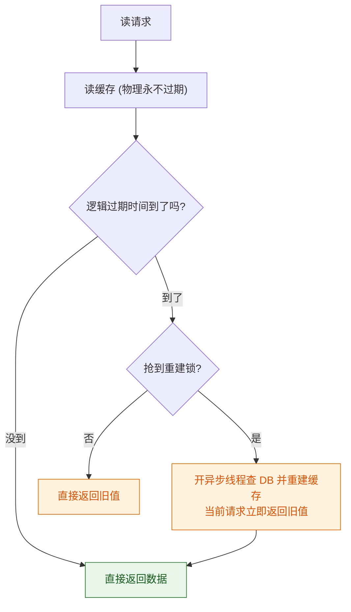

#### 方案对比（必答）

| 维度 | 互斥锁重建 | 逻辑过期 |
|---|---|---|
| 一致性 | **强**（拿到的一定是新值） | **弱**（重建期间返回旧值） |
| 可用性 | 较差（未抢到锁的请求要等待/重试） | **极好**（所有请求立即返回） |
| 响应延迟 | 抢到锁的线程要等 DB；其他线程要 sleep 重试 | **几乎无额外延迟** |
| 复杂度 | 低（一把锁） | 中高（value 结构改造 + 异步线程池 + 重建幂等） |
| 额外内存 | 无 | 需要存逻辑过期时间字段 |
| 重建失败 | 本次请求失败或走降级 | 继续返回旧值，**永不穿透** |
| 适用 | 数据准确性要求高、热点并发不极端 | **秒杀商品、榜单、首页聚合**等极致热点 |

> [!tip] 生产组合拳
> **互斥锁重建 + 逻辑过期 ≈ 逻辑过期做主 + 互斥锁做重建去重**。实际落地常常是：底层数据用互斥锁重建（保一致性），上层聚合展示用逻辑过期（保可用性）。

### 4.3 缓存雪崩

**成因有两类，必须分开说**：

| 类型 | 成因 | 表现 |
|---|---|---|
| **A. 大量 key 同时过期** | 批量导入时 TTL 设成同一个值；定时任务统一刷新 | 某一时刻缓存命中率骤降，DB QPS 陡增 |
| **B. 缓存服务整体宕机** | Redis 集群故障、机房断电、内存打满被 OOM kill | 请求**全部**回源，DB 秒挂，链路级联崩塌 |

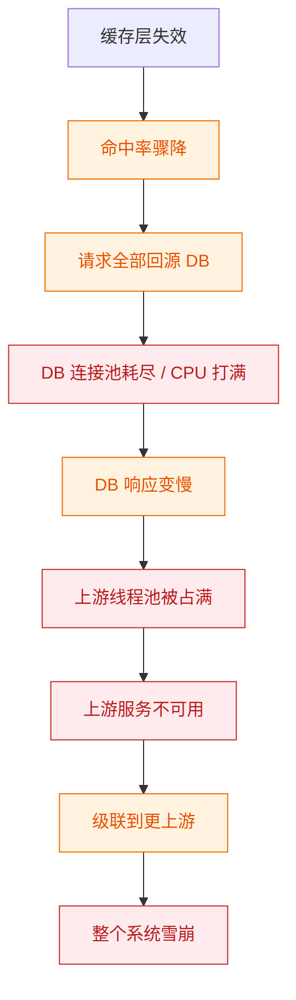

> [!important] 雪崩的本质是「级联失败」
> 注意这条链路和 [[7-限流熔断降级]] 讲的服务雪崩是**同一条链路**。所以缓存雪崩的治理不能只在缓存层做，**必须在 DB 前面加限流、熔断和降级**，否则 DB 一挂后面全挂。

#### 解法（按防御层次排列）

| 层次 | 手段 | 针对类型 | 说明 |
|---|---|---|---|
| **1. 过期时间打散** | TTL 加**随机值**（基础 TTL ± 随机偏移） | A | 最便宜、最有效，一行代码解决 |
| **2. 缓存预热** | 上线/大促前提前把热点数据加载进缓存 | A | 避免冷启动瞬间全量回源；要防「预热本身把 DB 打挂」，需限速 |
| **3. 多级缓存** | 本地缓存（Caffeine）+ Redis + DB | A/B | Redis 整体挂了，本地缓存仍能挡住一部分热点读 |
| **4. 熔断降级** | DB 侧限流；对下游熔断；返回默认值/旧值 | A/B | 见 [[7-限流熔断降级]]，**这是保命措施** |
| **5. 高可用架构** | 主从 + 哨兵 / Cluster、持久化、多机房 | B | 减少「整体宕机」的发生概率 |
| **6. 限流** | 在 DB 访问层做并发/连接数限制 | B | 宁可拒绝一部分请求，也不能让 DB 死 |
| **7. 互斥锁/逻辑过期** | 同击穿方案 | A | 控制回源并发 |

> [!danger] 一个常被忽略的点
> **缓存预热和批量导入时，如果把 TTL 统一设为同一个值，等于亲手埋了一颗雪崩定时炸弹。** 上线前 review 缓存写入代码时，这是必查项。

### 4.4 三大问题对比总表

| 维度 | 穿透 | 击穿 | 雪崩 |
|---|---|---|---|
| 数据是否存在 | **不存在** | 存在 | 存在 |
| 范围 | 大量不同的 key | **单个热点 key** | 大量 key / 整个缓存层 |
| 触发条件 | 恶意/错误查询 | 热点 key 过期瞬间 | 同时过期 / 服务宕机 |
| 直接后果 | 每次请求都打 DB | 瞬时并发全部回源同一份数据 | DB 瞬时全量回源 |
| 核心解法 | 布隆过滤器 + 空值缓存 + 参数校验 | 互斥锁重建 + 逻辑过期 | TTL 打散 + 多级缓存 + 熔断降级 + 高可用 |
| 是否引入一致性代价 | 空值缓存有（虚假空值） | 逻辑过期有（返回旧值） | 一般无 |
| 面试陷阱 | 布隆过滤器**不支持删除** | 与雪崩的区别要说清 | 要能画出级联链路 |

---

## 五、Redis 高可用架构

### 5.1 三种架构定位

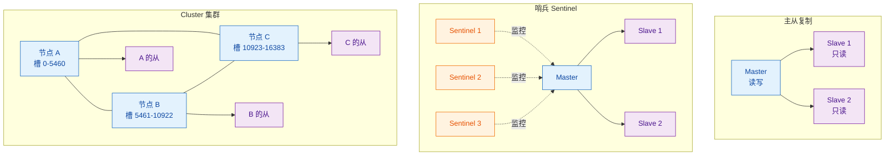

| 架构 | 解决的问题 | 没解决的问题 |
|---|---|---|
| **主从复制** | 读扩展、数据备份 | 无自动故障转移；异步复制有丢失窗口 |
| **哨兵 Sentinel** | 自动故障转移、配置发现 | 容量仍是单机上限；脑裂风险 |
| **Cluster** | 容量与写吞吐水平扩展 | 跨槽限制；热 key 无解；运维复杂 |

### 5.2 主从复制

**流程**：从节点连上主节点 → 全量同步（主节点 fork + RDB 快照传给从节点）→ 之后增量同步（主节点把写命令传播给从节点）。

**关键认知：复制是异步的。**

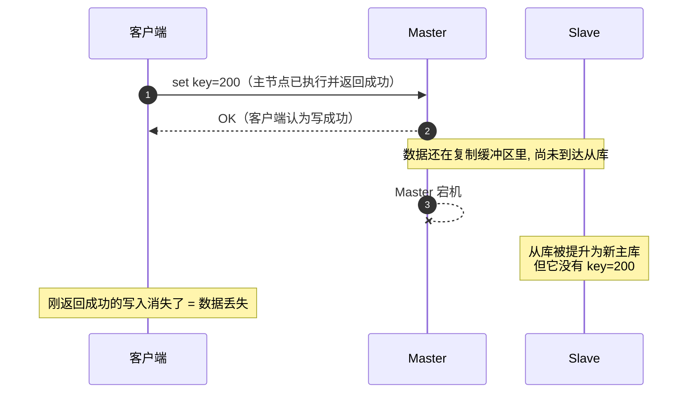

| 问题 | 说明 |
|---|---|
| **异步复制的丢失窗口** | 主节点返回成功时，数据可能还没同步到任何从节点。故障切换后这部分写入**永久丢失** |
| **复制延迟** | 从节点滞后主节点。**读到从节点可能读到旧数据**——这就是「缓存主从延迟导致读脏」的根源 |
| **全量同步开销** | fork 会 copy-on-write 占用内存；大实例 fork 可能造成明显停顿 |
| **主从切换需人工** | 纯主从模式没有自动故障转移，主挂了需要人工切换 |

> [!warning] 生产判断
> **不要把 Redis 主从当作"高可靠存储"**。它提供的是**可用性**（读扩展、故障备份），不是**持久性**保证。金融级数据必须落 DB，Redis 只做加速层。
> 如果业务对丢失敏感，可以开启 `WAIT` 命令或配置 `min-replicas-to-write`（见 5.3），但这会牺牲可用性。

### 5.3 哨兵 Sentinel

**职责**：监控、通知、**自动故障转移**、作为配置提供者（客户端向 Sentinel 询问当前 Master 地址）。

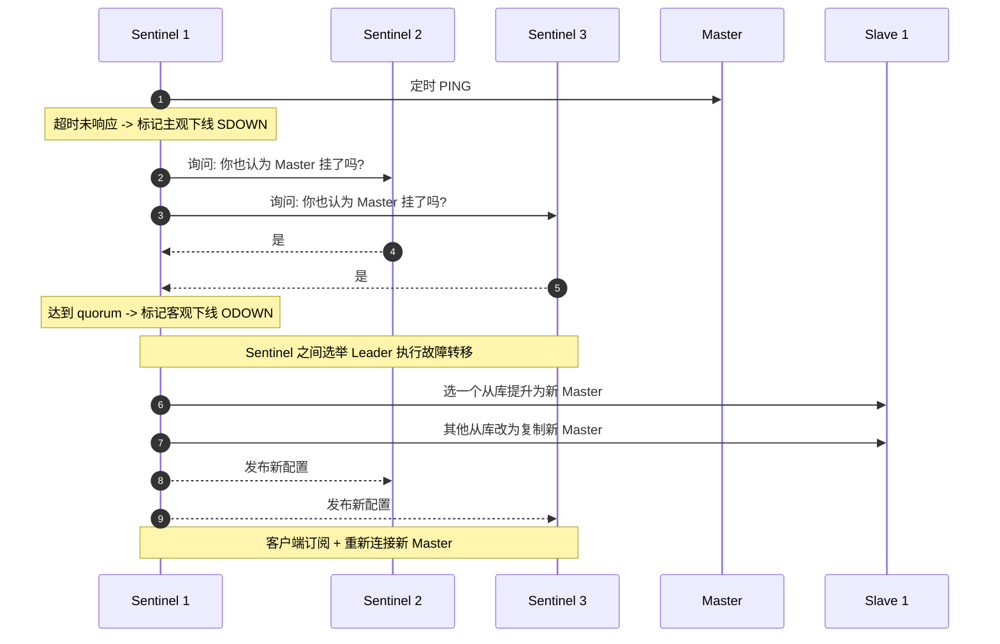

| 概念 | 说明 |
|---|---|
| **SDOWN（主观下线）** | 单个 Sentinel 认为节点不可达，可能只是自己网络抖动 |
| **ODOWN（客观下线）** | 达到 `quorum` 个 Sentinel 都认为不可达，才判定真的挂了 |
| **quorum vs majority** | quorum 是判定 ODOWN 的票数；**选举 Leader 需要多数派（majority）**，两者不是一回事 |
| **部署要求** | 至少 3 个 Sentinel、奇数个，分布在不同物理机/可用区 |

#### 脑裂与 `min-replicas-to-write`

**脑裂场景**：网络分区把 Master 和 Sentinel/从库隔开。Sentinel 侧判定 Master 挂了 → 提升新 Master。但**旧 Master 其实还活着**，仍在接受老客户端的写请求。分区恢复后，旧 Master 降级为从库、**全量同步覆盖自己的数据 → 分区期间的写入全部丢失**。

**防御**：`min-replicas-to-write` + `min-replicas-max-lag`——当「健康从库数量 < 前者」或「从库延迟 > 后者」时，**主节点直接拒绝写请求并返回错误**。

| 参数 | 作用 |
|---|---|
| `min-replicas-to-write N` | 至少要有 N 个从库保持连接，主节点才接受写 |
| `min-replicas-max-lag S` | 从库的复制延迟不能超过 S 秒，否则不算"健康从库" |

**代价**：这是拿**可用性换一致性**（正是 [[1-分布式理论基础]] 里的 CP 取向）。从库一挂或网络抖动，主节点就直接**拒绝写入**。所以只在数据敏感的业务上开，且 N 一般取 1。

> [!important] 面试话术
> 「脑裂的本质是：故障检测的**分区两侧各自都认为自己是正确的**。Redis 用 `min-replicas-to-write` 做写侧自我保护——**主节点发现自己联系不上足够多的从库，就主动拒绝写**，这样旧 Master 在分区期间根本写不进去，切换后也就没有数据需要丢。」

### 5.4 Cluster 集群

**核心机制**：

| 机制 | 说明 |
|---|---|
| **数据分片** | 整个键空间划分为 **16384 个哈希槽（slot）**，每个主节点负责一部分槽 |
| **槽计算** | 对 key 做 CRC16 再对 16384 取模，得到所属槽；即 **`CRC16(key) mod 16384`** |
| **集群总线** | 节点间通过二进制协议互相通信、交换槽位与节点状态 |
| **故障转移** | 需要**主节点多数派**同意才能标记某主节点为 fail 并提升其从节点 |
| **MOVED / ASK 重定向** | 访问的 key 不在当前节点 → 返回 `MOVED`（槽已永久迁移）或 `ASK`（槽正在迁移中，本次去目标节点问） |
| **Hash Tag** | 用 `{}` 包裹的 key 子串参与哈希，如 `user:{1001}:name` 和 `user:{1001}:age` 落同一槽 |

#### mget 跨槽问题（生产高频坑）

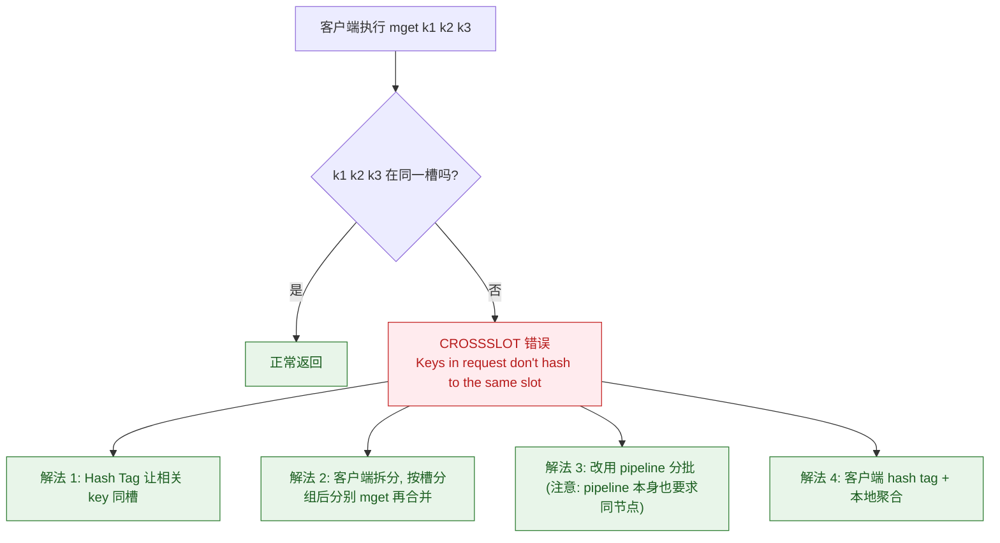

| 方案 | 优点 | 缺点 |
|---|---|---|
| **Hash Tag** | 一劳永逸，相关 key 永远同槽 | **数据倾斜风险**：所有同类 key 挤在一个节点，热点集中；需要重新设计 key 命名 |
| **客户端拆分 + 聚合** | 不改 key 设计，通用 | 客户端逻辑变复杂，产生 N 次网络往返，聚合阶段可能成为新的瓶颈 |
| **pipeline 分批** | 减少网络往返 | 仍需按节点分组，只是把多次 RTT 合成一次 |

> [!warning] 同理受影响的命令
> `mset`、`mget`、`del`（多 key）、`sinterstore`、Lua 脚本（脚本里访问的所有 key 必须同槽）都受跨槽限制。
> **最容易踩的坑是 Lua 脚本**——脚本里写了两个不同前缀的 key，单机版跑得好好的，上 Cluster 直接报错。

#### 集群模式下的一致性限制

| 限制 | 后果 |
|---|---|
| **不支持跨槽事务** | `MULTI/EXEC` 里的 key 必须同槽，否则报错 |
| **不支持多数据库** | Cluster 只有 `db 0`，`SELECT` 不可用 |
| **异步复制依然存在** | 每个分片内部仍是主从异步复制，**丢失窗口没有消失** |
| **故障转移需要时间** | 从节点被提升前，该槽的读写会失败（客户端需重试） |
| **槽迁移期间** | 迁移中的槽会返回 ASK，客户端库需正确实现重定向逻辑 |
| **客户端要求高** | 必须是 Cluster-aware 客户端（Lettuce / Jedis Cluster），否则路由全错 |

### 5.5 架构选型对比

| 维度 | 单机 | 主从 | 哨兵 Sentinel | Cluster |
|---|---|---|---|---|
| 数据容量 | 单机内存上限 | 单机内存上限（从库是全量副本） | 单机内存上限 | **可水平扩展**（近似线性） |
| 写吞吐 | 单机 | 单机（从库不能写） | 单机 | **多主，可扩展** |
| 读吞吐 | 单机 | **可扩展到从库** | 可扩展 | 可扩展 |
| 自动故障转移 | ❌ | ❌ | ✅ | ✅ |
| 运维复杂度 | 低 | 低 | 中 | **高** |
| 客户端复杂度 | 低 | 低 | 中（需感知 Sentinel） | **高**（Cluster-aware） |
| 跨槽操作 | 无限制 | 无限制 | 无限制 | **受限** |
| 适用容量 | 小 | 读多写少、容量小 | 容量小但要求高可用 | **大数据量 / 高吞吐** |

**选型建议**：

1. **能用单机 + 持久化 + 定期备份解决的，不要上 Cluster**——Cluster 的运维与客户端复杂度是实打实的成本。
2. **数据量在单机内存内、要求高可用** → 主从 + 哨兵（3 节点起步）。
3. **数据量超过单机内存、或写吞吐成为瓶颈** → Cluster，但先确认自己**没有跨槽依赖**。
4. **热点 key 严重时 Cluster 也救不了**——一个槽只能在一个节点上，要用 **key 打散**或**多级缓存**（见第六节）。

---

## 六、本地缓存与多级缓存

### 6.1 本地缓存组件对比

| 维度 | Caffeine | Guava Cache |
|---|---|---|
| 淘汰算法 | **W-TinyLFU** | LRU（分段 LRU） |
| 命中率 | 更高（对突发/扫描型访问模式更鲁棒） | 一般，扫描型访问会污染缓存 |
| 性能 | 更高 | 尚可 |
| 维护状态 | **活跃** | 维护模式 |
| 推荐度 | **首选** | 遗留系统 |

#### W-TinyLFU 为什么好（简版原理）

传统 LRU 的死穴：**一次全表扫描/批量任务会把整个缓存冲掉**（扫描污染），真正热的数据被挤出去，命中率断崖式下跌。

| 组件 | 作用 |
|---|---|
| **Window Cache**（小 LRU） | 新来的数据先进窗口，接收突发流量 |
| **Main Cache**（SLRU：probation + protected） | 长期热点数据 |
| **Frequency Sketch**（Count-Min Sketch） | 用极省空间的计数器**近似统计访问频率**，作为准入依据 |

**准入规则**：窗口淘汰的候选者要进主缓存时，和主缓存里的候选者**比频率**，频率高的留下。这样「只被扫过一次」的数据自然进不了主缓存，**抗扫描污染**，同时保留 LRU 对突发的快速响应。

> [!tip] 面试加分点
> 「Caffeine 关键不是『更快』，而是**在有限内存下命中率更高**，尤其是存在周期性批量扫描的 OLTP 场景。命中率每提升一个百分点，落到 Redis 和 DB 的流量就少一个百分点。」

### 6.2 多级缓存架构

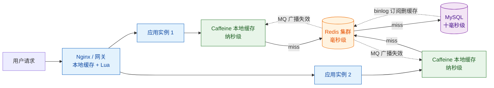

**分层收益与代价**：

| 层 | 延迟量级 | 容量 | 一致性难度 |
|---|---|---|---|
| 本地缓存 | 纳秒~微秒 | 小（受 JVM 堆限制） | **最难**（多实例各自一份） |
| Redis | 毫秒 | 大（可集群扩展） | 中 |
| DB | 十毫秒+ | 最大 | — |

### 6.3 本地缓存的失效难题（核心痛点）

**问题**：本地缓存是**每个 JVM 实例一份副本**。实例 A 更新了数据、清了自己的本地缓存，但**实例 B、C 的本地缓存还是旧值**，而且**永远不会自动过期**（除非设了 TTL）。这是多级缓存最棘手的地方。

| 方案 | 机制 | 优点 | 缺点 |
|---|---|---|---|
| **MQ 广播** | 数据变更后发广播消息（RocketMQ 广播模式 / Kafka 每消费者组独立消费），所有实例收到后清自己的本地缓存 | 实时、可靠（MQ 持久化） | 引入 MQ 依赖；消息乱序/重复需幂等；消费者掉线期间漏消息 |
| **配置中心 Watch** | 把「缓存版本号」放配置中心，变更时 `publish`，各实例 watch 到后清本地缓存 | 组件已存在（Nacos/Apollo），无需新增依赖 | 依赖长连接可靠性；通知风暴；见 [[8-微服务架构与注册配置中心]] |
| **短 TTL 兜底** | 本地缓存设很短 TTL（秒级），靠过期自然收敛 | 零额外组件，最简单 | 不一致窗口 = TTL；TTL 太短则本地缓存价值下降 |

> [!important] 生产判断
> **这三者不是三选一，而是叠加使用**：MQ/配置中心负责**主动失效**（把窗口压到毫秒~秒），短 TTL 负责**兜底**（通知丢了也能收敛）。
> 另外，**并非所有数据都适合放本地缓存**。只把**变化频率低、容忍秒级不一致**的数据放本地（如类目、字典、配置），**交易、库存、余额绝对不放**。

---

## 七、热 key 与大 key

### 7.1 热 key

**定义**：单位时间内访问量远超其他 key 的 key（秒杀商品、明星微博、突发热点）。

**危害**：Cluster 里一个 key 只能落在一个槽、一个节点上 → **整个集群的读压力全部压到一个节点**，该节点 CPU/带宽打满，进而影响该节点上的**所有其他 key**（连带故障）。这是「分片解决不了热 key」的根本原因。

| 发现手段 | 说明 | 特点 |
|---|---|---|
| `redis-cli --hotkeys` | 基于 LFU 统计 | 需 maxmemory-policy 为 LFU 类；有采样误差 |
| `MONITOR` | 打印所有命令 | **生产禁用**，性能损耗极大 |
| **客户端埋点统计** | 在缓存 SDK 里做本地滑动窗口计数，定期上报 | **推荐**，无侵入 Redis，可精确到业务维度 |
| 代理层统计 | 在 Redis 代理（自研 proxy / 云厂商代理）上统计 | 无需改业务 |
| 业务侧预警 | 大促名单、热搜榜提前预判 | 最有效，但要人工 |

**打散与缓解手段**：

1. **本地缓存**（最有效）：热点数据放 JVM 本地，Redis 完全不用扛。配合 6.3 的失效方案。
2. **key 加随机后缀做多副本**：`hotkey:{1..N}`，读时随机选一个副本。**代价是写入要写 N 份**，且这 N 份必须落在不同槽（可用不同 hash tag）。
3. **读写分离 + 多从库**：把热点 key 的读流量分散到多个从库（注意从库读的延迟问题）。
4. **限流 + 降级**：对热点接口限流，超出部分返回缓存旧值/默认值（见 [[7-限流熔断降级]]）。
5. **拆分**：把一个大 value 拆成多个小 key，让流量分散（本质是化整为零）。

### 7.2 大 key

**定义**：value 过大（经验上 String 超过几十 KB、集合类元素数量达到数千/万级就要警惕）。**具体阈值应结合实例内存、带宽和业务特点自行设定，不要照搬别人的数字。**

**四大危害**：

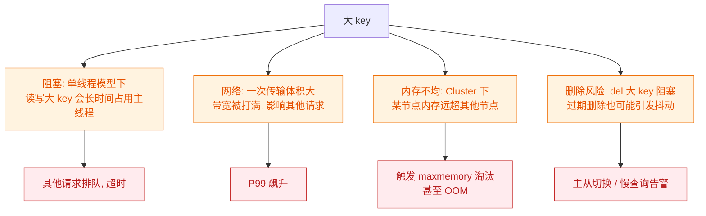

> [!danger] Redis 单线程模型放大了大 key 的危害
> Redis 的命令执行是单线程的（网络 IO 在新版本中多线程化，但**命令执行仍是单线程**）。一个大 key 的读写会**阻塞所有其他客户端的命令**。所以大 key 问题不是「慢一点」，而是「所有人一起慢」。

| 发现手段 | 说明 |
|---|---|
| `redis-cli --bigkeys` | 扫描各类型最大的 key，**有采样**，不会发现所有大 key |
| `MEMORY USAGE key` | 精确查看单个 key 的内存占用 |
| `SCAN` + 自研脚本 | 全量扫描并统计，注意分批、限速，别在业务高峰跑 |
| **客户端埋点** | 记录每次写入 value 的大小，超阈值告警 |
| 云厂商监控 | 多数云 Redis 提供大 key / 热 key 分析 |

| 类型 | 拆分思路 |
|---|---|
| **大 String**（如整个 JSON 对象） | 按字段拆成 Hash；或按业务维度拆成多个小 key，读取时用 pipeline/mget 组装 |
| **大 Hash** | 按业务维度分片（如 `hash:{shardId}`），用 hash tag 保证同业务同槽 |
| **大 List / ZSet** | 按时间/范围分片（如按天分 key），或用多个 key 分段 |
| **大 Set** | 按元素哈希取模分片 |
| **删除大 key** | **不要直接 `DEL`**！用 `UNLINK`（异步删除，后台线程回收内存）；或 `HSCAN` + `HDEL` 分批删 |
| **过期大 key** | 避免大量 key 同时过期；考虑主动分批重建 |

---

## 八、生产实践与踩坑清单

### 8.1 一个完整的缓存读写链路

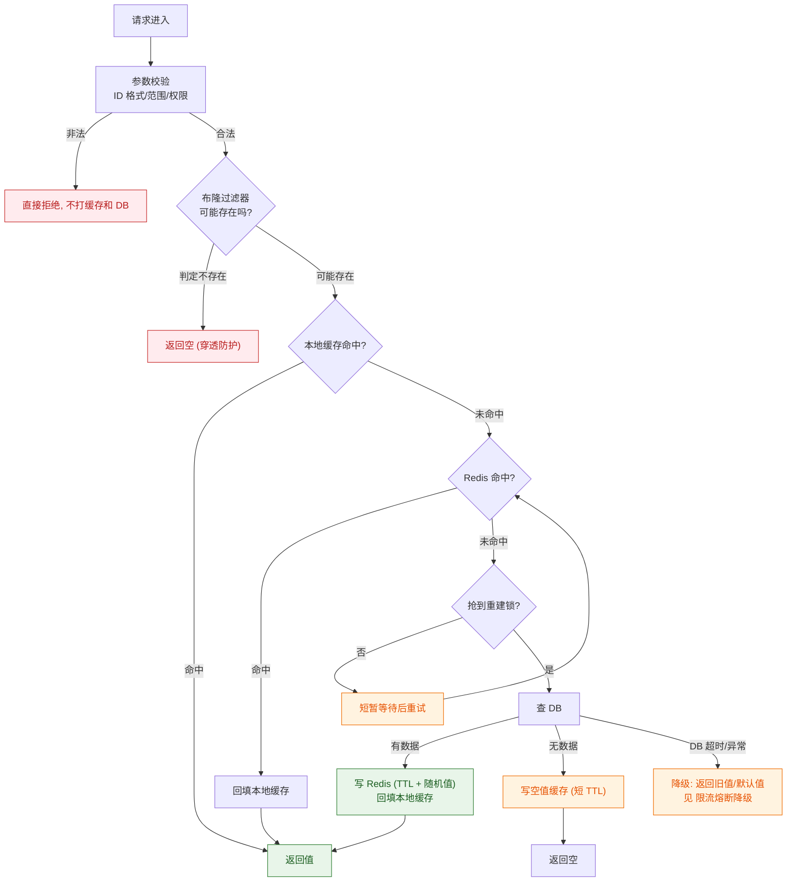

### 8.2 写链路

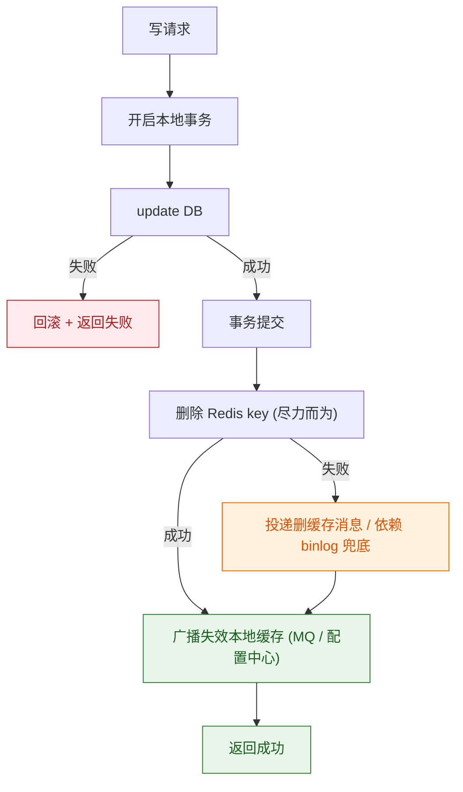

> [!important] 写链路的铁律
> **先提交 DB 事务，再删缓存。** 一定要在事务 `commit` **之后**删，而不是在事务内部删。否则事务还没提交，缓存已被删，其他请求读到旧值又写回缓存，脏数据就产生了。

### 8.3 缓存相关的幂等

删除缓存是**天然幂等**的（删两次和删一次结果一样），所以重试安全。但**回写缓存不是**——并发回写可能把旧值写回去（见 3.6）。所以缓存重建路径上要注意：**只有拿到重建锁的线程才允许回写**。相关讨论见 [[幂等.excalidraw]]。

### 8.4 生产踩坑清单

| # | 坑 | 后果 | 对策 |
|---|---|---|---|
| 1 | 在事务**内部**删缓存 | 脏数据 | 事务提交后再删 |
| 2 | 批量写入时 TTL 设成同一个值 | 定时雪崩 | TTL 加随机偏移 |
| 3 | 只设 `@Cacheable` 不设 TTL | 脏数据永久存在 | 所有缓存必须有 TTL |
| 4 | 用 `@CachePut` 更新缓存 | 并发下旧值覆盖新值 | 改成 `@CacheEvict` |
| 5 | 布隆过滤器数据不同步 | 新增数据被判定「不存在」 | binlog 增量维护 + 定期全量重建 |
| 6 | 空值缓存没在数据创建时删除 | 读到假空值 | 创建/更新时一并删空值 key |
| 7 | Cluster 下用多 key 命令 / Lua 跨槽 | `CROSSSLOT` 报错 | Hash Tag 或客户端拆分 |
| 8 | 本地缓存没有失效机制 | 多实例数据长期不一致 | MQ 广播 + 短 TTL 兜底 |
| 9 | 直接 `DEL` 大 key | 阻塞主线程、慢查询告警 | 用 `UNLINK` 或分批删 |
| 10 | 缓存预热不限速 | 预热把 DB 打挂 | 预热加并发限制、分批 |
| 11 | 缓存写失败没有降级 | 缓存故障导致业务全挂 | 缓存异常只记日志、走 DB 兜底 |
| 12 | 缓存 key 没有统一命名规范 | 冲突、无法批量治理、无法统计 | 统一前缀 + 版本号 + 业务标识 |
| 13 | 无脑给所有数据加缓存 | 内存浪费、一致性成本白付 | 只缓存**读多写少 + 容忍延迟**的数据 |
| 14 | 没有缓存监控 | 命中率骤降无人知道 | 监控命中率、慢查询、大 key、内存、连接数 |

### 8.5 监控指标

| 指标 | 为什么重要 | 告警思路 |
|---|---|---|
| **缓存命中率** | 直接决定 DB 压力 | 跌破基线（如环比下降明显）即告警 |
| **Redis 慢查询 / 延迟** | 大 key、热 key、阻塞的早期信号 | P99 超阈值告警 |
| **Redis 内存 & 淘汰数** | 淘汰暴涨说明容量不足或有大 key | 淘汰数持续 > 0 需关注 |
| **连接数** | 连接泄漏 / 客户端问题 | 接近上限告警 |
| **主从复制延迟** | 从库读到旧数据 / 切换丢数据 | 延迟超阈值告警 |
| **缓存与 DB 不一致对账** | 兜底发现长期脏数据 | 定时抽样对账，差异告警 |
| **回源 QPS** | 雪崩的最直接前兆 | 突增即告警 |

---

## 九、必答面试题

> [!question] Q1：如何保证缓存与数据库的一致性？
>
> 1. **先定边界**：「严格强一致做不到，缓存和 DB 是两个独立存储，无法参与同一个本地事务。目标是最终一致 + 收敛时间可控。」
> 2. **给方案**：「Cache-Aside，**写路径先更新 DB、事务提交后再删缓存**，而不是更新缓存。」
> 3. **为什么是删不是更新**：「并发写下，更新缓存会让旧值覆盖新值且**无法自愈**；删除是幂等的，顺序错乱也只是缓存变空，下次读回源拿到正确值。」
> 4. **主动暴露窗口**：「仍有一个极窄窗口——读请求 miss 后读到旧值、且回写晚于写的删除。但要求三个苛刻条件同时成立，且能被 TTL 修复。」
> 5. **补偿**：「删缓存失败用**延迟双删**过渡，生产更推荐 **binlog 订阅（Canal）异步删缓存**：与业务解耦、位点可重放、可重试，还能覆盖 DBA 手工改数据。」
> 6. **兜底**：「所有缓存必须有 TTL；再加定时对账任务发现极端脏数据。」

> [!question] Q2：三大缓存问题的解法？
>
> - **穿透**：「查不存在的数据，缓存永远 miss。三层防护：**参数校验**（最便宜）→ **布隆过滤器**（空间效率高、只有假阳性、**不支持删除**，要用 Counting Bloom 或 Cuckoo 变体）→ **空值缓存**（TTL 短，数据创建时必须主动删除）。再叠加接口限流防恶意攻击。」
> - **击穿**：「**单个热点 key 过期瞬间**并发全部回源。**互斥锁重建**只让一个线程回源，其他线程短暂等待重试，**强一致但可用性差**；**逻辑过期**物理永不 expires、value 里存逻辑过期时间，返回旧值并异步重建，**可用性极好但牺牲一致性**。按业务对准确性的要求选。」
> - **雪崩**：「分两类：**大量 key 同时过期** → **TTL 加随机值** + **缓存预热**；**缓存服务整体宕机** → **多级缓存** + **熔断降级限流** + **集群高可用**。核心认知：缓存雪崩的链路就是服务雪崩的链路，**必须在 DB 前面加限流熔断**。」

> [!question] Q3：延迟双删能解决问题吗？
>
> **不能完全解决，它是概率性补偿。** 理由：① **延迟时间靠估计**，估短了覆盖不住长尾请求，估长了不一致窗口被拉大；② **第二次删除仍可能失败**，只是降低概率；③ **异步任务不可靠**，用线程池/定时任务做延迟，**应用重启就丢任务**；④ **没考虑主从复制延迟**，从库上仍能读到旧值；⑤ 根本局限是「尽力而为」，**没有可靠投递保证**。
> 收尾：「所以我更推荐 **binlog 订阅（Canal）**——与业务事务解耦、持久化位点可重放、失败可重试、覆盖所有写路径。延迟双删更适合作为**过渡方案或最后一道兜底**。」

> [!question] Q4：Redis 主从、哨兵、Cluster 怎么选？
>
> 「先看**数据量**和**写吞吐**是否需要水平扩展：不需要 → 主从 + 哨兵（3 哨兵起步、奇数个、跨机器），拿到自动故障转移；需要 → Cluster。」
> 「三点提醒：**① Cluster 有跨槽限制**，`mget`、多 key `del`、跨 key 的 Lua 都会报 `CROSSSLOT`，用 **Hash Tag** 或客户端拆分；**② Cluster 解决不了热 key**，一个 key 只能落一个槽一个节点，要另用本地缓存或多副本打散；**③ 无论哪种架构复制都是异步的**，故障切换存在丢失窗口，`min-replicas-to-write` 能防脑裂但牺牲可用性。所以 **Redis 只能做加速层，不能当可靠存储**。」

> [!question] Q5：多级缓存里本地缓存怎么失效？
>
> 「本地缓存每个 JVM 一份，A 实例更新后 B 实例不会自动失效，这是多级缓存最难的题。三种解法**叠加使用**：① **MQ 广播**（RocketMQ 广播模式 / Kafka 独立消费组）——实时性好、持久化保证可靠；② **配置中心 Watch**（Nacos/Apollo）——复用已有组件，依赖长连接可靠性；③ **短 TTL 兜底**——通知丢了也能秒级收敛。
> 判断标准：**只有变化频率低、容忍秒级不一致的数据才放本地缓存**，交易、库存、余额绝对不放。」

> [!question] Q6：布隆过滤器为什么不能删除？
>
> 「**位是共享的**：多个 key 可能映射到同一个位，把某个 key 对应的位清 0，会让**其他 key 被误判为不存在**（产生假阴性），而布隆过滤器的正确性恰恰依赖『不存在假阴性』这个前提。」
> 「生产上用 **Counting Bloom Filter**（位换成计数器，删除即减 1）或 **Cuckoo Filter**（支持删除且空间效率更好）。另外需要预热 + binlog 增量维护，重建时用双 buffer 原子切换。」

> [!question] Q7：为什么缓存要用删除而不是更新？
>
> 「**第一层是懒加载**：删除后等下次读按需重建，避免把没人读的冷数据塞进缓存。」
> 「**第二层更关键**：并发写下两个线程的缓存写入顺序可能与 DB 提交顺序相反，导致**旧值覆盖新值**，而且**不会自愈**——后续没有新的写来纠正它，key 又没 TTL 的话脏数据永久存在。而**删除是幂等的**：无论谁先谁后，最终缓存被清空，下次读回源一定拿到 DB 最新值。」

---

## 十、检查清单

> [!tip] 上线前自检
> - [ ] 缓存 key 有统一命名规范（前缀 + 业务 + 版本号）
> - [ ] **所有缓存都有 TTL**，没有"永不过期"（除逻辑过期场景）
> - [ ] 批量写入的 TTL 加了随机偏移
> - [ ] 写路径是「**事务提交后删缓存**」，不是事务内删、也不是更新缓存
> - [ ] 关键 key 有删除失败补偿（延迟双删 / Canal / 本地消息表）
> - [ ] 热点接口有互斥锁重建或逻辑过期
> - [ ] 布隆过滤器有预热和增量维护机制
> - [ ] 空值缓存有短 TTL，且数据创建时会删除空值 key
> - [ ] Cluster 下的多 key 操作已确认同槽或已拆分
> - [ ] 本地缓存有 MQ/配置中心失效机制 + 短 TTL 兜底
> - [ ] DB 前面有限流和熔断（见 [[7-限流熔断降级]]）
> - [ ] 有大 key 检测和拆分方案，删除用 `UNLINK`
> - [ ] 有命中率、慢查询、内存、复制延迟、回源 QPS 监控告警
> - [ ] 有定时对账任务发现长期不一致

---

## 十一、关联笔记

- [[0-分布式总览]] — 本系列 MOC
- [[1-分布式理论基础]] — CAP/BASE，缓存一致性的理论天花板
- [[2-分布式事务]] — 本地消息表 / 事务消息，删缓存补偿的实现基础
- [[3-分布式锁]] — 互斥锁重建热点 key、强一致读写的串行化
- [[5-一致性哈希与负载均衡]] — 槽位分配与数据分布
- [[7-限流熔断降级]] — 缓存雪崩的治本手段：限流、熔断、降级
- [[8-微服务架构与注册配置中心]] — 配置中心 Watch 失效本地缓存
- [[9-分布式面试高频题]] — 本篇相关高频题汇总
- [[幂等.excalidraw]] — 缓存删除幂等、重建幂等
- [[面试准备/技术面试题库/07-Redis与缓存]]
- [[面试准备/技术面试题库/09-分布式与微服务]]
