# 🛡️ 七、限流、熔断与降级

> 这一篇回答四个问题：**限流四种算法怎么选**、**熔断器三态状态机怎么转**、**舱壁隔离为什么能防故障扩散**、**一个完整的「限流 → 熔断 → 降级 → 隔离 → 超时」防护链怎么搭**。
> 面试里「服务雪崩怎么防」是系统设计高频题，但大多数人只会罗列名词。这一篇要把**固定窗口的临界问题**、**半开状态放多少请求**、**重试风暴怎么放大流量**、**哪些业务绝对不许降级**讲透。
> 前置阅读：[[1-分布式理论基础]]（CAP/BASE，降级就是牺牲一致性换可用性）、[[6-缓存一致性与高可用]]（缓存雪崩与服务雪崩是同一条级联链路）。相关内容：[[面试准备/技术面试题库/09-分布式与微服务]]。
> 下游延伸：[[8-微服务架构与注册配置中心]]（规则动态下发）、[[9-分布式面试高频题]]。

---

## 一、为什么需要这些手段

### 1.1 雪崩效应：一条链路的死亡螺旋

**核心机制**：一个下游变慢 → 上游调用它的线程被**阻塞**（而不是快速失败）→ 上游线程池被占满 → 上游**其他不相关的接口也一起不可用** → 故障沿着调用链向上扩散。

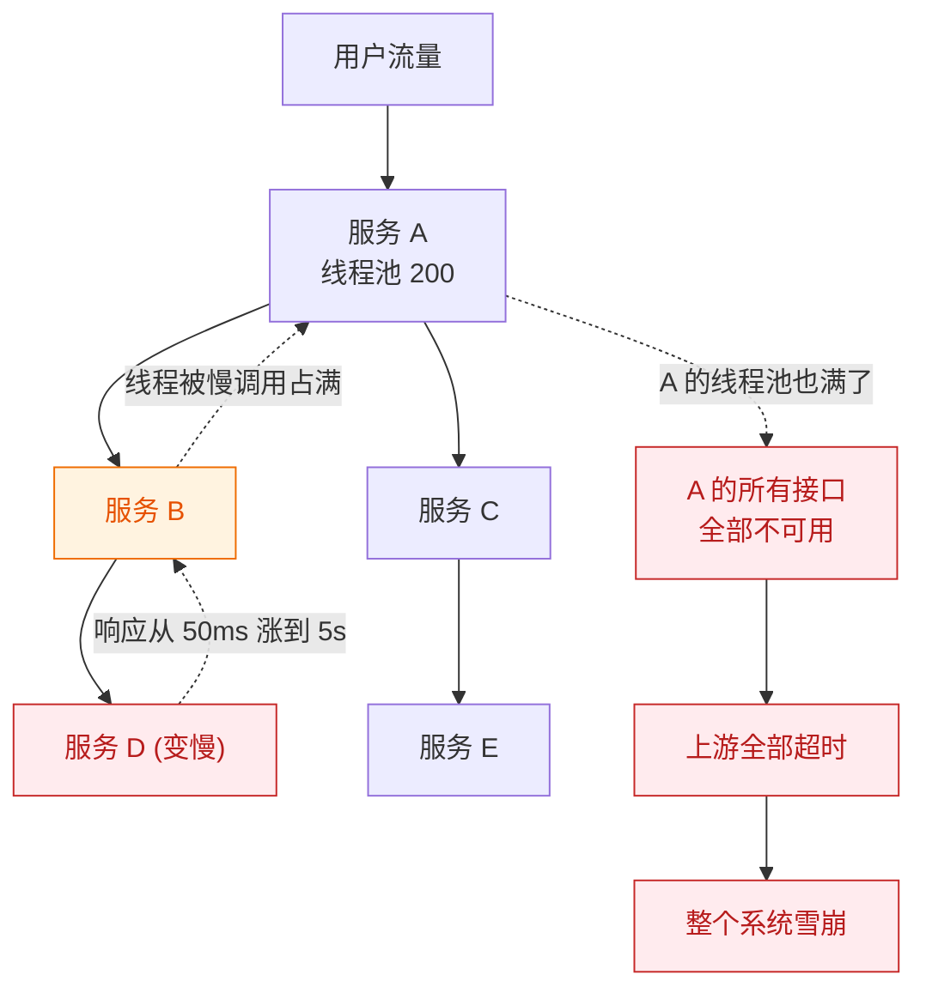

> [!danger] 关键认知：故障是「传染」的
> 服务 D 只是**变慢**，并没有宕机。但**慢 > 挂**——挂掉是快速失败，变慢是**占着资源不放手**。
> 所以防雪崩的核心不是"让下游变快"，而是**切断传染路径**：让上游在下游变慢时**快速失败**，把资源释放出来。

### 1.2 四者的分工（必背）

| 手段 | 作用对象 | 核心问题 | 触发时机 | 一句话比喻 |
|---|---|---|---|---|
| **限流** | **入口流量** | 我只处理这么多，多的不要 | 请求到达时 | 景区**限票**：今天只卖 1 万张 |
| **熔断** | **下游依赖** | 下游坏了，别再调它了 | 下游失败率/慢调用比例超阈值 | **保险丝**：短路了就别再通电 |
| **降级** | **自身功能** | 保不住全部，就保核心 | 熔断/限流/超时/异常率触发 | **弃车保帅**：关掉推荐位，保住下单 |
| **隔离** | **自身资源** | 别让一个依赖拖垮全部 | 常驻（资源划分） | **船舱隔板**：一个舱进水不沉船 |

> [!important] 它们是保命手段，不是优化手段
> 限流会**拒绝正常用户**，熔断会**让请求失败**，降级会**返回错误或不完整的数据**。
> 这三件事**都在损害用户体验**。所以它们的定位是：**系统过载时的最后一道防线**，用来避免「全军覆没」这种更坏的结果。
> **不要指望用限流去解决性能问题**——性能问题要靠扩容、优化、加缓存解决。限流只是让你**死得慢一点、死得体面一点**。

---

## 二、限流算法（核心）

### 2.1 固定窗口计数器

**原理**：把时间切成固定长度的窗口（如 1 秒），窗口内维护一个计数器，每来一个请求 +1，超过阈值就拒绝。窗口切换时计数器归零。

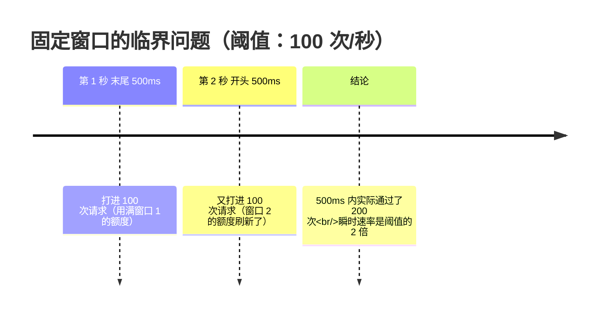

**临界问题讲清楚**：假设阈值是 100 次/秒。攻击者（或突发流量）在**第 1 秒的最后 500ms** 打 100 次，然后在**第 2 秒的最初 500ms** 再打 100 次。这两个窗口各自都没超限，但**在跨越边界的这 1 秒内实际通过了 200 次**——正好是阈值的 **2 倍**。

| 优点 | 缺点 |
|---|---|
| 实现最简单，一个计数器就够 | **有临界问题，瞬时流量可达阈值的 2 倍** |
| 内存占用极小 | 窗口粒度过粗，流量曲线是尖刺 |
| 性能最好 | 无法平滑流量 |

> [!warning] 生产判断
> 固定窗口**只适合对突发不敏感的场景**（如内部接口保护、统计类限流）。
> 面向 C 端的高并发入口**不要用固定窗口**——临界问题在秒杀、大促这种场景下会被放大到致命。

### 2.2 滑动窗口

**原理**：把一个大窗口切成 N 个小窗口（时间片），滑动地统计「最近一个窗口周期」内的请求总数。这样统计区间是**连续滑动**的，不存在窗口边界的突变。

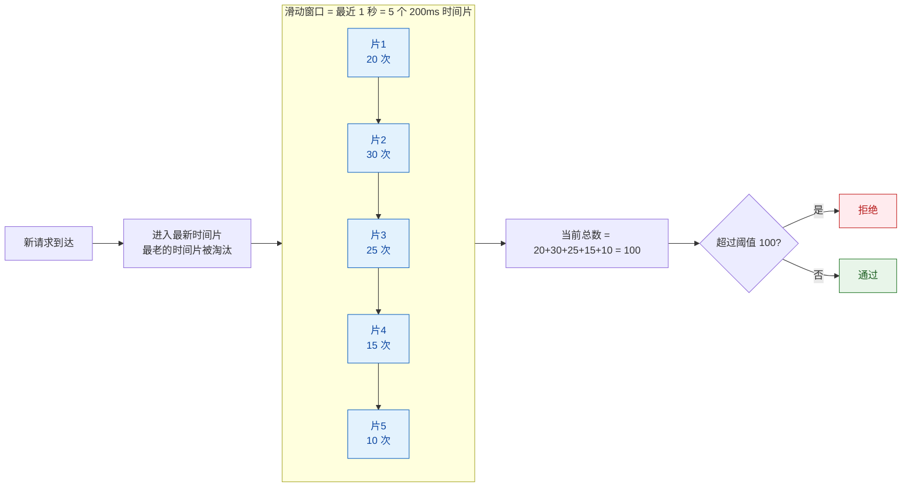

| 维度 | 说明 |
|---|---|
| 解决的问题 | **消除临界问题**：任意时刻统计的都是连续的一个窗口周期 |
| 代价 | **内存**：要保存 N 个时间片的计数；时间片越细越平滑，内存和计算开销越大 |
| 精度 | 时间片粒度决定平滑度。粒度越细越接近真实滑动，但开销上升 |
| 实现 | Sentinel 的滑动窗口用**环形数组**（`LeapArray`）实现，避免频繁分配 |

> [!tip] 时间片粒度怎么定
> 粒度越细，限流越精确平滑，但内存与计算开销越大。**工程上常见做法是取 1 秒窗口、切成 2~20 个时间片**，在平滑度和开销之间取平衡。不要盲目追求极细粒度——收益递减而成本线性上升。

### 2.3 漏桶（Leaky Bucket）

**原理**：请求先进入一个**固定容量的桶**，桶底以**恒定速率**漏水（放行请求）。桶满了，新请求就被丢弃。

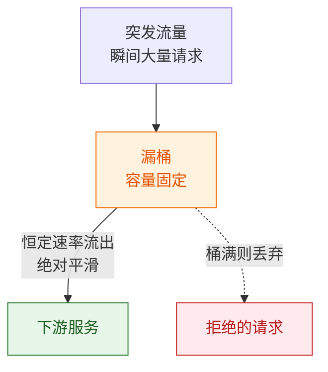

| 特性 | 说明 |
|---|---|
| 流出速率 | **恒定**，绝对平滑，不允许任何突发 |
| 削峰填谷 | **是**：突发流量被缓冲在桶里，以稳定速率放行 |
| 突发流量 | **不允许**：桶满了直接丢弃 |
| 适用 | 需要**严格保护下游**、下游处理能力恒定的场景（如调用第三方有严格 QPS 限制的接口） |

### 2.4 令牌桶（Token Bucket）—— 最常用

**原理**：以**恒定速率**往桶里放令牌，桶有**容量上限**（多余的令牌被丢弃）。请求到达时必须**拿到一个令牌**才能通过。

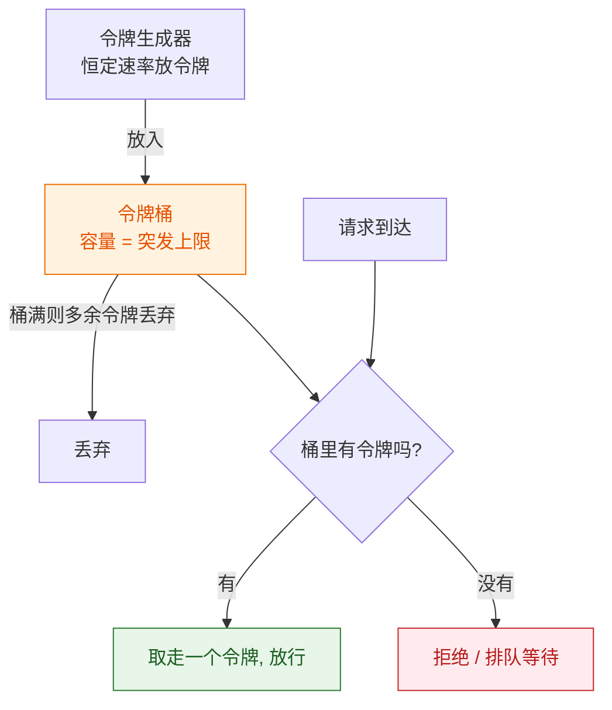

**关键理解：桶容量决定突发上限。**

- **长期平均速率** = 令牌生成速率（这是真正的限流阈值）；
- **瞬时突发能力** = 桶容量。桶里攒了多少令牌，就能一次性放行多少请求；
- 如果桶容量设为 1，令牌桶就**退化成漏桶**（完全不允许突发）；
- 如果令牌生成速率足够大、桶容量也大，则几乎没有限流效果。

| 特性 | 说明 |
|---|---|
| 平均速率 | 恒定，等于令牌生成速率 |
| 突发流量 | **允许**，上限由桶容量决定 |
| 实现 | Guava `RateLimiter`（单机）、Redis + Lua（分布式） |
| 适用 | **绝大多数互联网场景**：既能限制平均 QPS，又能容忍合理突发 |

> [!tip] 面试加分点
> 「令牌桶比漏桶更适合互联网业务，因为**真实流量天然是突发的**。用户请求不会是均匀分布的，如果强行用漏桶削平，要么桶开得很大（失去保护意义），要么大量正常请求被丢弃。令牌桶允许『攒额度』——平时流量低时攒下令牌，突发时一次性用掉，这符合业务的真实形态。」

### 2.5 四者对比（必答表）

| 维度 | 固定窗口 | 滑动窗口 | 漏桶 | 令牌桶 |
|---|---|---|---|---|
| **允许突发** | ❌ 有临界问题 | ❌（但精确） | ❌ 严格平滑 | ✅ **桶容量决定上限** |
| **平滑度** | 差（尖刺） | 好 | **最好（绝对恒定）** | 较好 |
| **实现复杂度** | 最低 | 中（环形数组） | 中 | 中 |
| **内存开销** | 最小 | 中（存 N 个时间片） | 小 | 小 |
| **限流精度** | 差（2 倍误差） | **高** | 高 | 高 |
| **典型实现** | 计数器 + 过期 | Sentinel `LeapArray` | — | **Guava `RateLimiter`、Sentinel** |
| **适用场景** | 内部接口保护 | C 端精确限流 | 严格保护恒定能力下游 | **通用首选** |

**选型结论**：

1. **默认选令牌桶**——兼顾平均速率限制与突发容忍，最贴合互联网流量形态。
2. **需要极精确、不允许任何超发** → 滑动窗口（Sentinel 默认）。
3. **下游能力恒定、绝不能超速**（如第三方 API 有硬性 QPS 限制）→ 漏桶。
4. **固定窗口只在要求极低时用**，务必知道它有 2 倍临界误差。

### 2.6 单机限流 vs 分布式限流

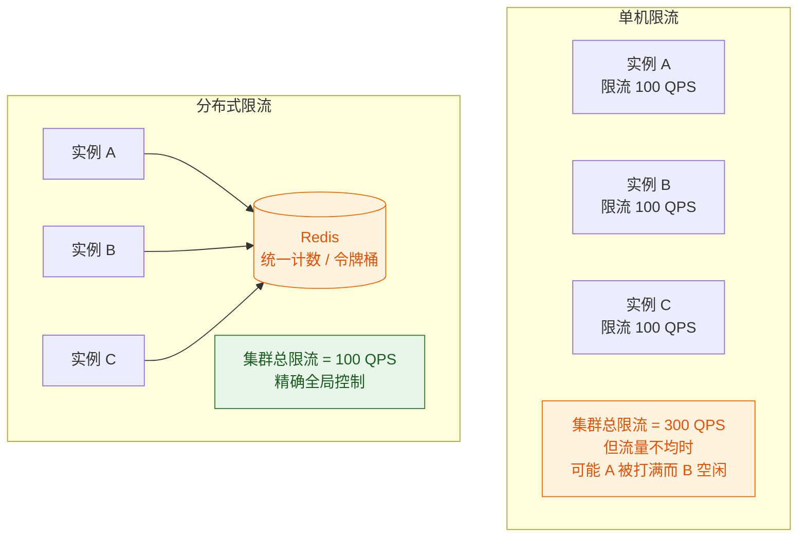

| 维度 | 单机限流 | 分布式限流 |
|---|---|---|
| 精度 | 集群总量 = 单机阈值 × 实例数，**不精确** | **全局精确** |
| 性能 | **极高**（无网络开销） | 有 Redis 网络往返，是瓶颈 |
| 依赖 | 无 | **强依赖 Redis**，Redis 挂了限流失效或全拒 |
| 弹性伸缩 | **扩容后总阈值变化**，需要重新计算 | 不受实例数影响 |
| 实现 | Guava `RateLimiter`、Sentinel 单机模式 | Redis + Lua、Sentinel 集群限流 |
| 适用 | 保护**本机资源**（CPU、线程池） | 保护**下游总容量**（如 DB、第三方 API 配额） |

**工程上的最佳实践是两者叠加**：

- **网关层做分布式限流**：控制进入系统的总流量，保护整个集群；
- **服务层做单机限流**：保护本实例的线程池和资源，防止单实例被打爆；
- **Redis + Lua 实现分布式令牌桶**：Lua 脚本保证「取令牌 + 扣减」的**原子性**，避免并发下超发。

> [!warning] Redis + Lua 令牌桶的坑
> ① **时钟问题**：令牌补充依赖时间戳计算，多实例时钟不同步会导致速率偏差，要用 Redis 服务端时间（`TIME` 命令）而不是客户端时间；
> ② **key 的热点**：全局一个限流 key 会成为热点，可考虑按 key 分片或本地预取令牌；
> ③ **Lua 脚本要幂等且快**：脚本内不要做复杂计算，避免阻塞 Redis 单线程。

---

## 三、熔断器（核心）

### 3.1 三态状态机（必会画）

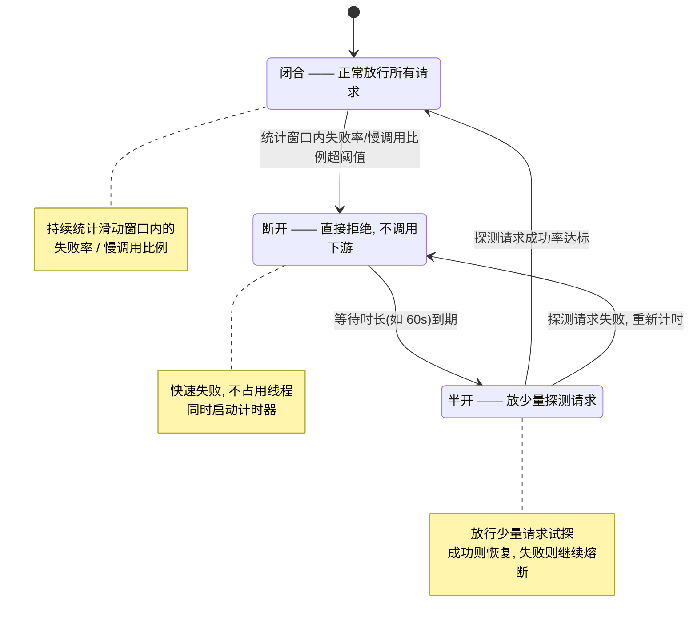

### 3.2 三个状态的行为对比

| 状态 | 是否调用下游 | 请求结果 | 资源占用 | 进入条件 |
|---|---|---|---|---|
| **Closed**（闭合） | ✅ 全部放行 | 正常返回 | 正常 | 初始状态；半开探测成功 |
| **Open**（断开） | ❌ **完全不调用** | 直接失败（或走降级） | **几乎为零** | 失败率/慢调用比例超阈值 |
| **Half-Open**（半开） | ⚠️ **只放少量探测** | 由探测结果决定 | 很小 | Open 等待时长到期 |

> [!important] 熔断器最核心的价值
> **Open 状态下不发起任何下游调用**，所以**不占用线程、不占用连接、不消耗超时等待时间**。这正是它切断故障传染的关键——把"等 5 秒超时"变成"1 毫秒快速失败"。
> 对比一下：如果只有超时没有熔断，每个请求仍要**等满超时时间**，线程依然被占着。**超时是止损，熔断是止血。**

### 3.3 统计窗口：滑动窗口统计失败率

熔断器必须基于**统计**做决策，而统计窗口的设计直接决定灵敏度。

| 窗口类型 | 说明 | 问题 |
|---|---|---|
| **固定窗口** | 每个周期重置计数 | 窗口边界处的突刺可能导致误判；重置瞬间统计归零，可能过早恢复 |
| **滑动窗口** | 环形数组，滑动统计最近 N 秒 | **推荐**；平滑、无边界问题，是 Sentinel / Resilience4j 的做法 |

**统计的关键指标**：

| 指标 | 作用 |
|---|---|
| 请求总数 | 作为**分母**，是判断"样本是否充足"的依据 |
| 失败数 / 失败率 | 最基础的熔断依据 |
| **慢调用数 / 慢调用比例** | **不只是统计异常，还统计超时** |
| 响应时间分布 | 用于判断慢调用阈值 |

### 3.4 慢调用比例熔断（最容易被忽略）

**为什么需要它**：下游服务**没有抛异常**，只是**变得很慢**。如果只统计异常率，失败率是 0，熔断器永远不触发——但线程池照样被打满，雪崩照样发生。

**机制**：把「响应时间超过某个阈值的调用」也视为一种失败，统计**慢调用比例**，超过阈值同样触发熔断。

| 熔断策略 | 触发条件 | 适用 |
|---|---|---|
| **异常比例** | 异常数/总数 > 阈值 | 下游会明确抛错（连接拒绝、抛异常） |
| **异常数** | 异常数 > 阈值（绝对值） | 流量小的接口，比例统计样本不足 |
| **慢调用比例** | 慢调用数/总数 > 阈值 | **下游变慢但不报错**——最常见的雪崩前兆 |

> [!danger] 只配异常比例 = 防不住雪崩
> 雪崩的起点几乎总是「**下游变慢**」而不是「下游抛异常」。所以**慢调用比例熔断是防雪崩的关键配置**，不能只配异常比例。
> 配置时要定义清楚「多慢算慢」——这个阈值通常取**业务可接受的 P99 响应时间**的若干倍，需要结合压测数据确定，不要拍脑袋。

### 3.5 半开状态放多少请求

这是生产上很容易配错的参数。

| 配置思路 | 说明 | 风险 |
|---|---|---|
| 放太少（如 1 个） | 恢复判定快 | **样本不足**：偶发的一个成功就恢复，结果马上又被熔断，**频繁抖动** |
| 放太多（如几百个） | 判断准确 | 下游还没恢复，**探测流量本身就把它再次打挂** |
| **合理做法** | 放**少量但有统计意义**的请求（如几个到几十个，结合流量规模定），并要求**成功率达标**才恢复 | 兼顾准确性与安全性 |

**恢复策略要点**：

1. **要求连续成功**，而不是单次成功，避免偶发抖动；
2. **半开失败要重新计时**，而不是立刻再试（否则等于持续压测下游）；
3. **Open 等待时长可以递增**（如 60s → 120s → 240s，设上限），避免下游长时间故障时被反复探测；
4. **恢复要渐进**：从半开恢复后可以配合限流逐步放量，而不是瞬间恢复全量。

### 3.6 熔断参数配置对比

| 参数 | 作用 | 配错的表现 |
|---|---|---|
| 统计窗口长度 | 统计多久的数据 | 窗口太长 → 反应迟钝；太短 → 抖动 |
| 最小请求数 | 样本不足时不熔断 | 设太小 → 低峰期误熔断 |
| 慢调用阈值 RT | 多慢算慢 | 设太小 → 正常抖动就熔断；太大 → 失去保护 |
| 失败率阈值 | 多高失败率触发 | 设太低 → 频繁抖动；太高 → 保护不及时 |
| Open 等待时长 | 熔断多久后试探 | 太短 → 反复冲击下游；太长 → 恢复慢 |
| 半开探测请求数 | 放多少试探 | 见 3.5 |

> [!warning] 最常见的配置错误：阈值过敏
> 把失败率阈值设得很低（如 5%）、最小请求数设得很小，会导致**正常业务的偶发波动就触发熔断**，表现为「服务时好时坏、频繁抖动」，排查时还找不到明确原因。
> **阈值必须基于真实流量基线来定**，先观察再收紧，不要照抄别人的数字。

---

## 四、舱壁隔离（Bulkhead）

### 4.1 为什么需要隔离

**问题**：如果所有下游调用**共用同一个线程池**，那么调用慢服务 D 的请求会把线程池占满，导致调用正常服务 C 的请求**也拿不到线程**。

**隔离思路**：给每个下游依赖分配**独立的资源池**（线程池或信号量），一个依赖出问题只影响它自己的池子。

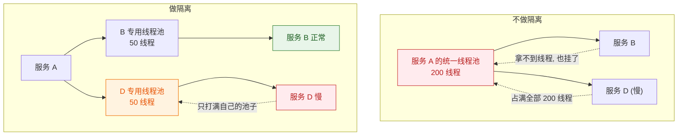

> [!important] 隔离的本质
> **把「共享资源」变成「专用资源」，从而把故障的影响范围限定在一个舱室里。**
> 代价是资源利用率下降——每个池子都要预留余量，不能像共享池那样弹性调配。这是**用效率换稳定性**。

### 4.2 线程池隔离 vs 信号量隔离

| 维度 | 线程池隔离 | 信号量隔离 |
|---|---|---|
| **机制** | 每个依赖一个独立线程池，调用在**新线程**上执行 | 用计数器控制**并发数**，调用仍在**当前线程**执行 |
| **是否支持超时** | ✅ **支持**（主线程可超时后直接返回） | ❌ **不支持真正的超时中断**（只能限制并发数） |
| **线程切换开销** | 有（上下文切换、队列排队） | **无**，性能更好 |
| **资源占用** | 高（每个依赖几十个线程） | 低（只是一个计数器） |
| **隔离强度** | **强**：线程被完全隔离 | 较弱：只是限制并发，调用仍占用调用方线程 |
| **能否异步** | ✅ 天然支持异步 | 需要业务自己实现 |
| **适用场景** | 调用**外部/不可靠**依赖、需要超时控制 | 调用**内部高性能**服务、追求低开销 |

> [!tip] 选型判断
> - **调用外部第三方 / 网络不可靠的依赖** → **线程池隔离**。因为你需要**超时**能力，而信号量隔离给不了。
> - **调用内部服务、追求极致性能** → **信号量隔离**。省掉线程切换开销，代价是失去超时能力（要靠下游自己的超时 + 熔断兜底）。
> - Hystrix 默认推荐线程池隔离；**Sentinel 默认走信号量模式**（更轻量，不额外创建线程池），需要线程池时要自己用 `@SentinelResource` 配合业务线程池。

### 4.3 线程池隔离为什么能防止故障扩散

三个机制共同作用：

1. **资源边界**：线程池有**队列容量上限 + 最大线程数**。队列满了新请求**快速失败**，不会无限堆积。这就是"舱壁"。
2. **超时能力**：调用在独立线程上执行，主线程可以**超时后立即返回**，不必等下游。超时的线程可以被丢弃（虽然会泄漏一个线程直到它自己完成，但比阻塞主线程好）。
3. **故障定位**：每个依赖的池子指标（队列长度、活跃线程数、拒绝数）**独立可观测**，一眼就能看出是哪个下游出了问题。

> [!warning] 线程池隔离的代价与坑
> ① **线程数不能瞎配**：每个依赖几十个线程，10 个依赖就是几百个线程，**内存和上下文切换开销可观**；线程数太少又会**误伤正常请求**。
> ② **线程池大小要与下游容量匹配**：池子越大，故障时打到下游的并发越高——**大池子会把下游打得更惨**。
> ③ **父子线程的上下文传递**：`ThreadLocal`（如用户上下文、TraceId）**不会自动传递到新线程**，必须手动包装或用 `TransmittableThreadLocal`，否则链路追踪断掉、鉴权信息丢失。这是生产上非常常见的坑。

---

## 五、降级

### 5.1 触发时机

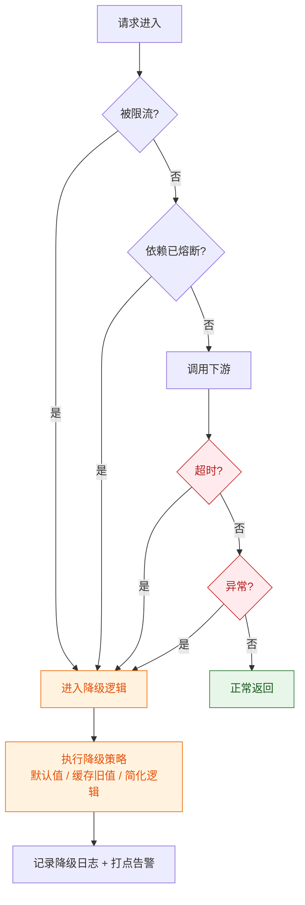

**四类触发源**：**限流**（流量超阈值）、**熔断**（依赖已断开）、**超时**（下游响应太慢）、**异常率超标**（下游报错）。

### 5.2 降级策略

| 策略 | 做法 | 适用 | 用户体验 |
|---|---|---|---|
| **返回默认值** | 返回一个安全的兜底值（空列表、默认配置） | 非核心展示数据 | 页面空着但不报错 |
| **返回缓存旧数据** | 用上一次成功的结果（可能已过期） | 商品详情、榜单 | **几乎无感**，最优雅 |
| **走简化逻辑** | 跳过复杂计算/个性化，返回通用结果 | 推荐、排序 | 推荐不精准但可用 |
| **排队 / 异步化** | 请求入队，稍后处理，返回"处理中" | 非实时任务 | 有延迟但最终完成 |
| **关闭非核心功能** | 直接隐藏入口（如关闭评论、关闭营销弹窗） | 边缘功能 | 功能缺失但不影响主流程 |

> [!tip] 「返回缓存旧数据」是最优降级
> 因为它**几乎不损失用户体验**——用户看到的是稍微旧一点的数据，而不是错误页或空白。
> 前提是业务能容忍数据陈旧。这也是为什么 [[6-缓存一致性与高可用]] 里要强调**缓存必须保留一份旧值**：**降级路径需要数据来源**。如果缓存里什么都没有，降级就只能返回空。

### 5.3 哪些能降级、哪些绝对不能

这是面试里最能体现**业务判断力**的一问。

| 可以降级 ✅ | 理由 |
|---|---|
| 商品推荐 / 个性化排序 | 不精准也能用，退化成默认排序即可 |
| 首页楼层 / 榜单 | 展示性内容，可缓存旧值 |
| 评论、晒单、问答 | 不显示不影响下单 |
| 营销弹窗、签到提醒 | 边缘功能，关掉反而更清爽 |
| 用户画像 / 标签 | 只影响精准度 |
| 搜索联想词 | 可退化成热门词 |

| **绝对不能降级** ❌ | 理由 |
|---|---|
| **支付 / 扣款** | 涉及资金，**必须明确成功或失败**，不能"大概成功" |
| **库存扣减** | 降级会导致**超卖**，是资损事故 |
| **订单创建 / 状态流转** | 降级会造成数据不一致，后续对账成本极高 |
| **登录鉴权** | 降级等于**放开权限**，是安全事故 |
| **风控判断** | 降级等于放行风险交易 |
| **优惠券核销 / 权益发放** | 涉及资产，不可含糊 |

> [!danger] 降级的铁律
> **涉及「钱、库存、权限、数据正确性」的链路绝对不允许降级。**
> 这些链路出问题时要**明确失败**（返回错误、让用户重试），而不是返回一个"看起来成功"的假结果。
> 判断标准很简单：**这个操作降级后，会不会产生无法自动修复的资损或数据错误？** 会 → 不能降级。

### 5.4 降级开关（生产必备）

**必须用配置中心做动态开关，支持热更新，不能写死在代码里或靠重启。**

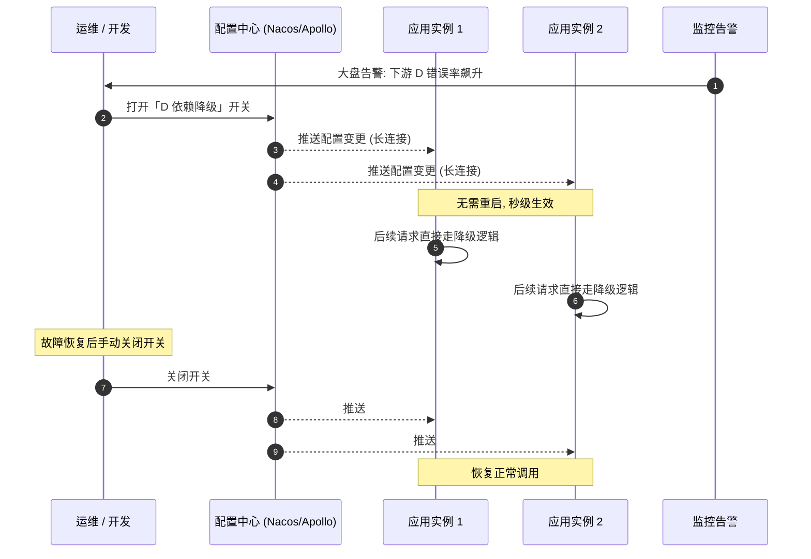

| 要点 | 说明 |
|---|---|
| **开关粒度** | 按**依赖**和**功能**双维度：既能"降级整个 D 依赖"，也能"只关闭推荐位" |
| **默认值** | 开关的默认值必须是**安全**的一侧（宁可多降级，不要漏降级） |
| **可观测** | 开关状态要**在监控大盘可见**，否则容易出现"忘了关开关导致长期降级" |
| **一键操作** | 大促前预演，确保开关能秒级生效、有操作审计 |
| **自动降级** | 高级玩法：监控指标触发自动降级（如错误率 > 50% 自动打开开关），但**必须保留手动覆盖** |

> [!warning] 「忘了关开关」是真实事故来源
> 降级开关打开后如果没及时关闭，服务会**长期以降级状态运行**——用户一直看到空数据或旧数据，但系统各项指标正常，**监控也不会告警**（因为降级路径本身是"成功"的）。
> 对策：① 降级逻辑**必须打点**并设置告警（如"降级持续时间 > 30 分钟"告警）；② 开关状态在大盘显眼位置展示；③ 降级返回的数据要有**可识别的标记**（如在响应里带 `degraded: true`），便于排查。

---

## 六、超时控制

### 6.1 超时是最基础的防雪崩手段

**为什么说它最基础**：熔断、降级、隔离都需要**配置和调优**，而超时只需要**设一个数**。但恰恰是最基础的这一环，最常被忽略——很多系统默认不设超时（或设成无限大）。

> [!danger] 没有超时 = 没有防雪崩能力
> 如果调用下游不设超时，下游挂起时调用方会**无限等待**，线程永远不释放。
> 此时**熔断器也没用**——因为熔断器统计的是"失败"和"慢调用"，而一个永不返回的调用连"慢"都统计不到，它只是静静地占着线程。
> **所以超时是所有防护手段的前提。**

**超时时间怎么定**：

| 原则 | 说明 |
|---|---|
| 基于 **P99.9** 而非平均值 | 平均值会掩盖长尾。超时应覆盖正常情况下的绝大部分请求 |
| 留出合理余量 | 通常取 P99.9 的若干倍，避免正常抖动被判超时 |
| **必须小于上游的超时** | 见 6.2 超时传递 |
| 分层设置 | 网关超时 > 服务超时 > 下游调用超时，形成**递减的梯度** |

### 6.2 超时传递问题

**问题**：A 调 B，B 调 C。如果 A 的超时是 1s，B 调 C 的超时是 5s，会发生什么？

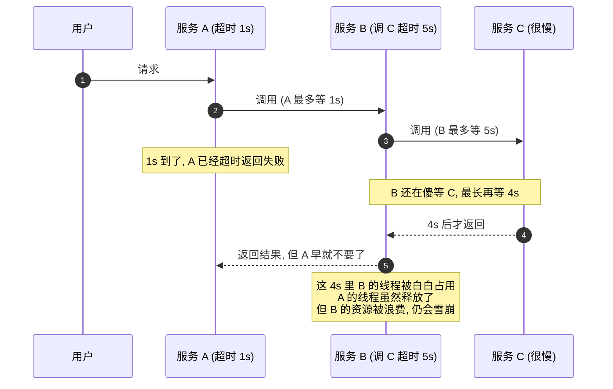

**核心结论**：**上游的超时必须大于下游的超时（留出余量），否则会出现"上游已放弃、下游还在跑"的资源浪费。**

| 层次 | 建议关系 |
|---|---|
| 网关 → 服务 A | 最大 |
| 服务 A → 服务 B | 小于上一级（要留出 A 自身处理时间） |
| 服务 B → 服务 C | 再小一级 |

**生产实践**：

1. **超时时间要有梯度**：每一层都比下一层留出调用方的处理余量；
2. **传递剩余超时预算（Deadline Propagation）**：把"还剩多少时间"沿着调用链传下去，下游据此决定是否还值得处理。gRPC 的 `deadline` 就是这个机制；
3. **不要简单用"减固定值"**：网络抖动、重试都会消耗预算，要留足余量。

> [!important] 一个反直觉的点
> 「上游超时必须大于下游」不是绝对的数学关系，而是**资源效率**的要求。严格说，理想方案是**传递 deadline**——下游知道上游只剩 200ms 了，就干脆不做了直接返回。这就是为什么现代 RPC 框架都强调**超时传递**而不是各层独立配置。

### 6.3 重试放大流量（重试风暴）

**这是最容易被忽视的雪崩放大器。**

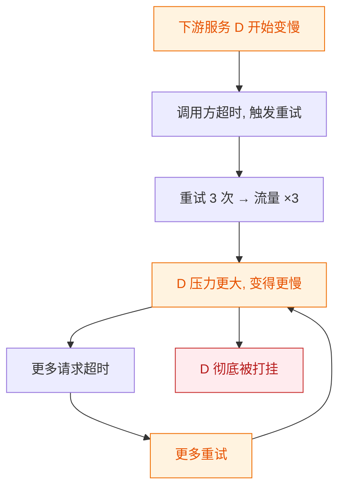

**放大倍数很可怕**：如果每一层都重试 3 次，3 层链路的重试放大是 **3 × 3 × 3 = 27 倍**。下游本来只是"有点慢"，直接被重试打成"彻底挂"。

**对策**：

| 对策 | 说明 |
|---|---|
| **只重试幂等操作** | 查询可重试，**写操作/支付绝对不能无脑重试**（会造成重复扣款）。见 [[幂等.excalidraw]] |
| **指数退避 + 抖动** | 重试间隔递增，并加随机抖动，避免大量请求**同时**重试形成脉冲 |
| **限制重试次数** | 通常 1~2 次足够。**重试次数越多，故障时的放大越严重** |
| **重试预算（Retry Budget）** | 限制重试流量占总流量的**比例**（如最多 10%）。重试量超预算就不再重试——这是**最优雅的方案** |
| **只在特定错误上重试** | 连接超时、5xx 可重试；**业务异常、4xx 不该重试**（重试也不会成功） |
| **熔断 + 重试配合** | 熔断打开后请求直接失败，**根本不产生重试**，天然抑制重试风暴 |
| **只在一层重试** | 明确"由谁负责重试"，避免每层都重试造成乘积放大 |

> [!danger] 重试的铁律
> **重试的前提是「这次失败是暂时的」**。如果下游是真的挂了或过载，重试只会**加速它的死亡**。
> 所以重试必须配合：**熔断（判断是否还值得试）+ 退避（错开时间）+ 预算（限制总量）+ 幂等（保证安全）**。缺一个都可能从"提高成功率"变成"制造事故"。

---

## 七、主流组件对比与选型

| 维度 | **Sentinel** | **Resilience4j** | **Hystrix** |
|---|---|---|---|
| 来源 | 阿里巴巴 | 社区（轻量库） | Netflix |
| **维护状态** | **活跃** | **活跃** | **已停止维护** |
| 限流 | ✅ 丰富（QPS/线程数/热点参数/集群限流） | ✅ 基础（`RateLimiter`） | ❌ 弱 |
| 熔断 | ✅ 异常比例/异常数/慢调用比例 | ✅ 失败率/慢调用比例 | ✅ 失败率 |
| 隔离 | 信号量模式（默认）；线程池需自行组合 | 信号量为主（`Bulkhead`），也支持线程池 | **线程池隔离**（主打） |
| 系统自适应保护 | ✅ **独有**（按 load/CPU/RT 自动限流） | ❌ | ❌ |
| 规则动态配置 | ✅ **强项**（控制台 + 配置中心，秒级生效） | ⚠️ 需要自己接配置中心 | ⚠️ 弱 |
| 实现方式 | 注解 + 拦截器（有侵入性） | **函数式 + 注解**（`@CircuitBreaker` 等） | 注解 + 命令模式 |
| 依赖 | 较重（Dashboard、规则推送） | **极轻**（纯库，无额外服务） | 重（需 Turbine 等） |
| Spring Cloud 集成 | Spring Cloud Alibaba | **Spring Cloud Circuit Breaker 官方推荐** | 已移除 |
| 学习/接入成本 | 中 | 低 | 中 |

**选型建议**：

1. **新项目、Spring Boot 3.x 技术栈** → **Resilience4j**。轻量、函数式、无额外服务依赖，是 Spring Cloud 官方当前推荐的实现。
2. **需要丰富的限流能力 + 动态规则 + 可视化控制台**（尤其国内团队、已有 Spring Cloud Alibaba） → **Sentinel**。它的**系统自适应保护**和**热点参数限流**是独有能力。
3. **Hystrix 绝对不要在新项目里用**——已停止维护，Spring Cloud 也已移除集成。面试时提一句"已停止维护，被 Resilience4j 取代"即可。

> [!tip] 面试话术
> 「选型看两点：**团队现状**和**能力需求**。如果团队已经有 Spring Cloud Alibaba 体系、需要控制台动态调规则和热点参数限流，选 Sentinel；如果是标准 Spring Cloud 体系、想要轻量无依赖，选 Resilience4j。
> 但更重要的是——**组件只是载体，真正要讲清楚的是限流算法、熔断三态、隔离方式和降级策略这些原理**。换个组件，原理不变。」

---

## 八、实战：完整的防护链路

### 8.1 五层防护串起来

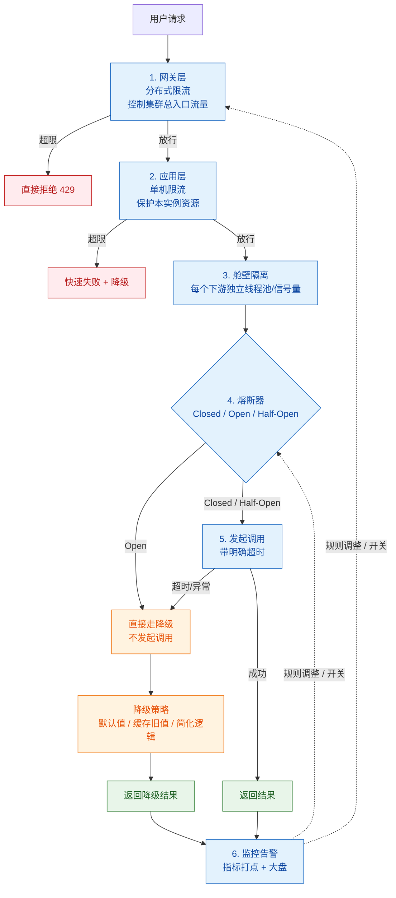

### 8.2 每一层的职责与配置要点

| 层 | 保护目标 | 关键配置 | 配错的后果 |
|---|---|---|---|
| **1. 网关分布式限流** | 整个集群入口 | 全局 QPS 阈值（基于容量压测） | 阈值拍脑袋 → 正常流量被拒 |
| **2. 应用单机限流** | 单实例资源 | 按实例数分摊的阈值 + 热点参数限流 | 扩容后阈值没同步调整 |
| **3. 舱壁隔离** | 故障不扩散 | 每个下游独立池，池大小匹配下游容量 | 池太大 → 打挂下游；太小 → 误伤正常请求 |
| **4. 熔断** | 停止调用坏依赖 | 慢调用比例 + 异常比例 + 合理窗口 | 阈值过敏 → 频繁抖动 |
| **5. 超时** | 释放被占资源 | 分层梯度 + deadline 传递 | 不设或过大 → 线程耗尽 |
| **6. 监控告警** | 及时发现 + 闭环 | 限流/熔断/降级全打点 | 出故障时无数据可查 |

### 8.3 监控指标与告警

| 指标 | 含义 | 告警思路 |
|---|---|---|
| **限流触发次数 / 比例** | 有多少请求被拒绝 | 突增说明容量不足或异常流量 |
| **熔断器状态** | 当前 Open / Half-Open 数量 | **任何熔断打开都应告警** |
| **熔断触发次数** | 熔断频率 | 频繁触发说明阈值过敏或下游真的不稳 |
| **降级调用次数 / 持续时间** | 降级规模与时长 | **持续降级超阈值必须告警**（防"忘关开关"） |
| **超时率 / 超时数** | 下游响应质量 | 超时率上升是雪崩的最早前兆 |
| **线程池活跃数 / 队列长度 / 拒绝数** | 隔离池健康度 | 队列持续增长 = 下游变慢 |
| **依赖 RT 的 P99 / P999** | 下游性能 | 长尾恶化先于平均值 |
| **重试次数 / 重试率** | 重试放大程度 | 重试率突增需警惕重试风暴 |

---

## 九、生产踩坑清单

| # | 坑 | 后果 | 对策 |
|---|---|---|---|
| 1 | **限流阈值拍脑袋** | 要么形同虚设，要么大量正常请求被拒 | 基于压测容量 + 真实流量基线设定，预留余量 |
| 2 | 只做单机限流，忽略集群总量 | 扩容后总流量翻倍打挂下游 | 网关分布式限流 + 服务单机限流叠加 |
| 3 | 用固定窗口做 C 端限流 | 临界处 2 倍流量穿透 | 改用滑动窗口或令牌桶 |
| 4 | **熔断阈值过敏感** | 正常抖动就熔断，服务时好时坏频繁抖动 | 基于真实基线，先观察再收紧；设置最小请求数 |
| 5 | **只配异常比例，不配慢调用比例** | 下游变慢不报错时熔断不触发，雪崩照样发生 | **必须配慢调用比例熔断** |
| 6 | 半开只放 1 个请求 | 偶发成功就恢复，马上又熔断 | 放有统计意义的数量 + 要求连续成功 |
| 7 | **降级逻辑本身报错** | 降级路径抛异常，故障被放大而非收敛 | 降级逻辑必须**最简单、最可靠**，加 try-catch 兜底；降级路径要单独测试 |
| 8 | 降级返回 null 导致 NPE | 上游空指针，故障扩散 | 降级必须返回**类型正确、语义安全**的默认值 |
| 9 | **重试放大流量** | 下游被重试打成彻底不可用 | 退避 + 抖动 + 重试预算 + 只重试幂等操作 |
| 10 | 写操作/支付接口无脑重试 | **重复扣款、超卖** | 写操作重试必须配合幂等（见 [[幂等.excalidraw]]） |
| 11 | **线程池隔离线程数配置不当** | 太大打挂下游，太小误伤正常请求 | 池大小匹配下游容量，压测验证 |
| 12 | 线程池隔离导致 ThreadLocal 丢失 | 链路追踪断裂、鉴权上下文丢失 | 用 `TransmittableThreadLocal` 或手动包装任务 |
| 13 | **只做限流不做超时** | 线程被无限等待占满，限流也救不了 | **超时是所有防护的前提**，必须优先配 |
| 14 | 超时配得比上游还大 | 上游已放弃，下游还在跑，资源浪费 | 分层梯度 + deadline 传递 |
| 15 | 降级开关写死在代码里 | 故障时无法快速止损 | 配置中心动态开关，热更新，秒级生效 |
| 16 | **降级开关忘记关闭** | 长期降级运行，用户看旧数据但监控无告警 | 降级打点告警 + 开关状态大盘展示 + 响应带标记 |
| 17 | 对不幂等接口做熔断后自动重试 | 重复处理 | 熔断恢复要渐进，重试要有幂等保护 |
| 18 | 限流/熔断/降级没有任何监控 | 出故障时完全瞎猜 | 全链路打点 + 大盘 + 告警闭环 |

---

## 十、必答面试题

> [!question] Q1：限流算法怎么选？
>
> 「四种算法的区别在**是否允许突发**和**平滑度**：
> **固定窗口**最简单，但有一个致命缺陷——**临界问题**：窗口边界处两个窗口各放行一批，瞬时流量可达阈值的 2 倍，所以 C 端入口不能用。
> **滑动窗口**把大窗口切成多个时间片做连续统计，解决了临界问题，代价是要存 N 个时间片的计数，是 Sentinel 的默认实现。
> **漏桶**以恒定速率流出，平滑度最好，但**完全不允许突发**，适合下游能力恒定、绝不能超速的场景（如第三方 API 配额）。
> **令牌桶**以恒定速率生成令牌、桶容量决定突发上限，**既限制平均速率又容忍合理突发**，是通用首选（Guava `RateLimiter`）。
> 我的选择是：**默认令牌桶**，需要极精确用滑动窗口，严格保护用漏桶，固定窗口只用于要求极低的内部接口。
> 另外要区分**单机限流和分布式限流**：单机保护本机资源、性能高但不精确；分布式用 Redis + Lua 做全局精确控制，但要接受网络开销和 Redis 依赖。生产上是**网关分布式限流 + 服务单机限流叠加**。」

> [!question] Q2：熔断器三态是怎么转的？
>
> 「**Closed**：正常状态，所有请求放行，同时**持续滑动统计**失败率和慢调用比例。
> 当统计窗口内的失败率（或慢调用比例）超过阈值、且样本数足够时，**转为 Open**。
> **Open**：**完全不调用下游，直接快速失败**——这是熔断最核心的价值，它不占用线程、不占连接、不消耗超时等待。同时启动一个计时器。
> 计时到期后**转为 Half-Open**。
> **Half-Open**：**放少量探测请求**到下游。如果成功率达标就**回到 Closed** 恢复正常；如果失败就**回到 Open 重新计时**。
> 要强调三点：① **统计要用滑动窗口**，固定窗口有边界误判；② **必须配慢调用比例熔断**，因为雪崩的起点几乎总是『下游变慢』而不是『下游抛异常』，只统计异常率会漏掉最危险的情况；③ **半开放多少请求是个关键参数**——放 1 个样本不足会频繁抖动，放几百个又会把没恢复的下游再次打挂，要取有统计意义的小量并要求连续成功。」

> [!question] Q3：服务雪崩怎么防？
>
> 「先讲机制：雪崩的本质是**故障传染**——下游只是**变慢**而不是挂掉，上游调它的线程被阻塞、线程池被占满，导致上游**其他不相关的接口也一起不可用**，故障沿调用链向上扩散。**慢比挂更可怕，因为挂是快速失败，慢是占着资源不放手。**
> 然后讲**五层防护**：
> ① **超时**——最基础的一层，没有超时其他手段都是空谈，因为无限等待的线程连"慢调用"都统计不到；
> ② **舱壁隔离**——把共享资源变成每个依赖的专用池，一个依赖出问题只影响它自己的舱室；外部不可靠依赖用线程池隔离（能超时），内部高性能服务用信号量隔离（无切换开销）；
> ③ **熔断**——基于滑动窗口统计失败率和慢调用比例，Open 时直接快速失败，**彻底停止对坏依赖的调用**；
> ④ **限流**——网关分布式限流 + 服务单机限流，控制入口和本机资源；
> ⑤ **降级**——熔断/限流/超时触发时返回默认值、缓存旧值或简化逻辑，保住核心链路。
> 最后补两个**容易被忽视的放大器**：**重试风暴**（三层各重试 3 次就是 27 倍放大，要用退避 + 抖动 + 重试预算 + 只重试幂等操作）和**超时传递**（上游超时必须大于下游，否则上游放弃了下游还在跑）。
> 一句话总结：**能在下游变慢时快速失败并释放资源，就不会雪崩。**」

> [!question] Q4：线程池隔离和信号量隔离怎么选？
>
> 「**线程池隔离**：每个依赖一个独立线程池，调用在新线程上执行。优点是**支持超时**——主线程可以超时后立即返回；隔离强度高；天然支持异步。代价是线程切换开销、每个依赖几十个线程的资源占用，还有 **ThreadLocal 不会自动传递**的坑（要靠 `TransmittableThreadLocal`）。
> **信号量隔离**：用一个计数器限制并发数，调用仍在**当前线程**执行。优点是**无切换开销、资源占用极小**；缺点是**不支持真正的超时中断**——只能限制并发，调用方线程还是会被占着。Sentinel 默认走这个模式。
> 所以我的选择是：**调用外部第三方或网络不可靠的依赖用线程池隔离**，因为我需要超时能力；**调用内部服务、追求低延迟用信号量隔离**，省掉切换开销，超时交给下游自己的超时和熔断兜底。
> 还有一点要注意：**线程池大小要和下游容量匹配**，池子开得越大，故障时打到下游的并发越高，反而会把下游打得更惨。」

> [!question] Q5：哪些业务可以降级，哪些绝对不行？
>
> 「判断标准是：**降级之后会不会产生无法自动修复的资损或数据错误。**
> **绝对不能降级的**：**支付/扣款**（资金必须明确成功或失败，不能"大概成功"）、**库存扣减**（降级会超卖，直接资损）、**订单创建和状态流转**（会造成数据不一致，对账成本极高）、**登录鉴权**（降级等于放开权限，是安全事故）、**风控判断**（等于放行风险交易）。这些链路出问题要**明确失败、让用户重试**，而不是返回一个看起来成功的假结果。
> **可以降级的**：商品推荐和个性化排序（退化成默认排序）、首页楼层和榜单（返回缓存旧值）、评论晒单、营销弹窗、用户画像——这些只影响精准度和丰富度，不影响主流程正确性。
> 补充一个最优雅的降级策略：**返回缓存旧数据**，用户几乎无感。但前提是缓存里**必须保留一份旧值**作为降级的数据来源，这也是缓存设计里要留意的点。」

> [!question] Q6：重试为什么危险？
>
> 「因为重试会**放大流量**，而且是**乘法放大**。三层链路每层重试 3 次，放大倍数就是 3×3×3=27 倍。下游本来只是『有点慢』，会被重试直接打成『彻底挂掉』——这就是**重试风暴**。
> 对策有六条：① **只重试幂等操作**，写操作和支付**绝对不能无脑重试**，否则重复扣款；② **指数退避 + 随机抖动**，避免大量请求同时重试形成脉冲；③ **限制重试次数**，1~2 次通常足够；④ **重试预算**——限制重试流量占总流量的比例（如最多 10%），超预算就不重试，这是最优雅的方案；⑤ **只在特定错误上重试**，连接超时和 5xx 可以，业务异常和 4xx 重试也不会成功；⑥ **和熔断配合**，熔断打开后请求直接失败，根本不产生重试。
> 核心判断：**重试的前提是『这次失败是暂时的』。** 如果下游是真的挂了或过载，重试只会加速它的死亡。」

---

## 十一、检查清单

> [!tip] 上线前自检
> - [ ] 所有**外部调用都配了超时**，没有无限等待
> - [ ] 超时时间**分层递减**，上游 > 下游
> - [ ] 限流阈值**基于压测容量**，不是拍脑袋
> - [ ] 网关分布式限流 + 服务单机限流**叠加**
> - [ ] C 端限流**没用固定窗口**（或用令牌桶补足突发能力）
> - [ ] 熔断器**配置了慢调用比例**，不只是异常比例
> - [ ] 熔断统计窗口是**滑动窗口**，且设置了最小请求数
> - [ ] 半开探测请求数**有统计意义**，并要求连续成功
> - [ ] 关键依赖做了**舱壁隔离**，池大小匹配下游容量
> - [ ] 线程池隔离的 `ThreadLocal` 传递已处理（TraceId、用户上下文）
> - [ ] **降级逻辑本身有 try-catch 兜底**，不会抛异常
> - [ ] 降级返回**类型正确、语义安全**的默认值，不会导致 NPE
> - [ ] 涉及**钱 / 库存 / 权限 / 数据正确性**的链路**没有降级**
> - [ ] 降级开关在**配置中心**，支持热更新秒级生效
> - [ ] 降级打点告警 + 开关状态在大盘可见
> - [ ] 重试有**指数退避 + 抖动 + 次数上限**，且只重试幂等操作
> - [ ] 有**重试预算**限制重试流量占比
> - [ ] 限流 / 熔断 / 降级 / 超时 / 线程池指标**全部打点并配告警**
> - [ ] 大促前做过**降级开关演练**

---

## 十二、关联笔记

- [[0-分布式总览]] — 本系列 MOC
- [[1-分布式理论基础]] — CAP/BASE；降级是牺牲一致性/完整性换可用性
- [[2-分布式事务]] — 重试与幂等的配合
- [[3-分布式锁]] — 分布式限流的 Redis 依赖与锁的可用性权衡
- [[6-缓存一致性与高可用]] — 缓存雪崩与服务雪崩是同一条级联链路
- [[8-微服务架构与注册配置中心]] — 配置中心动态下发限流/熔断/降级规则
- [[9-分布式面试高频题]] — 本篇相关高频题汇总
- [[幂等.excalidraw]] — 重试必须建立在幂等之上
- [[面试准备/技术面试题库/09-分布式与微服务]]
