# 🏗️ 八、微服务架构与注册配置中心

> 本篇回答四个负责人级别的问题：**服务实例的地址是谁告诉谁的**（注册与发现）、**配置改了怎么不重启就生效**（配置中心）、**流量从哪进从哪出**（网关）、**这套东西自己挂了怎么办**（兜底）。前半部分是微服务演进与治理全景，后半部分深挖注册中心（Nacos 双协议是重点）与配置中心的原理和失效场景。返回 [[0-分布式总览]]。

---

## 一、从单体到微服务：演进与代价

### 1.1 演进路径

| 阶段 | 形态 | 解决的问题 | 引入的新问题 |
|---|---|---|---|
| **单体（Monolith）** | 一个 war/jar 部署，模块间方法调用 | 开发简单、事务简单、部署简单 | 代码耦合、构建慢、**一处 OOM 全站挂**、扩容只能整体扩 |
| **垂直拆分（Vertical）** | 按业务线拆成多个独立单体（电商前台/后台/搜索） | 故障隔离、独立扩容、团队解耦 | 公共逻辑重复、跨库查询、数据冗余 |
| **SOA** | 抽出公共服务层，走 ESB/WebService | 服务复用 | **ESB 变成新的中心瓶颈**、协议重（SOAP/XML）、治理成本高 |
| **微服务（Microservice）** | 细粒度服务 + 轻量协议（HTTP/RPC）+ 注册发现 + 治理 | 独立部署/扩容/技术异构、故障隔离、组织敏捷 | **下面 1.2 那一整张表** |

> [!important] 负责人视角
> 微服务**不是**技术升级，是**组织架构的映射**（康威定律）。如果团队只有 5 个人、业务还在找 PMF，拆微服务是纯负债：你换来的独立性根本用不上，却要背上一整套分布式复杂度。
> 判断标准：**当"独立部署"带来的收益 > "分布式治理"带来的成本时，才拆**。

### 1.2 微服务带来的新问题（这一节是面试的"钩子"）

| 新问题 | 具体表现 | 对应解法 | 本系列位置 |
|---|---|---|---|
| **服务发现** | A 调 B，B 有 20 个实例、IP 天天变，硬编码写死必挂 | 注册中心 + 客户端负载均衡 | 本篇第二章 |
| **配置管理** | 20 个服务 × 3 环境 × 50 个配置项，改一个超时要发 60 次版 | 配置中心 + 动态刷新 | 本篇第三章 |
| **分布式事务** | 下单扣库存跨了两个库，本地 `@Transactional` 管不了 | TCC/Saga/消息最终一致 | [[2-分布式事务]] |
| **链路追踪** | 一个请求过了 8 个服务，报错日志散在 8 台机器 | TraceId 全链路透传 | 本篇第六章 |
| **服务容错** | 一个慢下游拖垮整条链路 | 限流/熔断/降级/隔离 | [[7-限流熔断降级]] |
| **分布式锁 / ID** | 多实例并发扣同一份库存、需要全局唯一单号 | Redis/ZK 锁、雪花算法 | [[3-分布式锁]]、[[4-分布式ID与雪花算法]] |
| **缓存一致性** | 多服务各自缓存同一份数据，更新顺序错乱 | Cache-Aside + 延迟双删 + binlog | [[6-缓存一致性与高可用]] |
| **运维复杂度** | 30 个服务的发布、回滚、扩缩容、日志收集 | K8s + CI/CD + 可观测性平台 | 本篇第一章 |
| **数据一致性边界** | 原来一个事务能保证的，现在跨服务了 | 最终一致 + 对账兜底 | [[2-分布式事务]] |

### 1.3 完整微服务技术栈全景

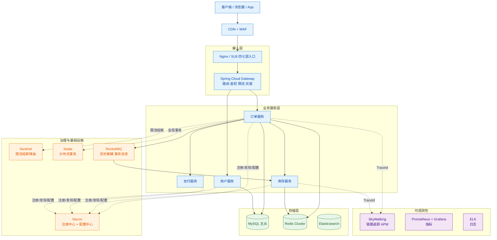

> [!tip] 这张图怎么用
> 面试时白板画这张图，然后按「**一横一纵**」讲：横是**请求路径**（Client → 网关 → 服务 → 存储），纵是**治理能力**（注册配置、容错、事务、MQ、可观测）。
> 讲完主动补一句：「这里面**注册中心和配置中心是地基**，它挂了整个集群的弹性伸缩和灰度能力就没了——所以它自己必须高可用。」这句话能直接把话题引到你准备好的深度内容上。

---

## 二、服务注册与发现（重点）

### 2.1 注册中心的核心职责

| 职责 | 说明 | 做不好会怎样 |
|---|---|---|
| **服务注册** | 实例启动后把自己的 `ip:port`、元数据（权重、版本、机房、灰度标签）写入注册中心 | 注册失败 → 流量永远进不来，实例成"僵尸" |
| **健康检查** | 判断实例是否还活着；不健康就摘除 | 摘除慢 → 请求打到挂掉的实例，用户看到 5xx |
| **服务发现** | 消费者能拉到某个服务的**健康实例列表** | 列表过期 → 打到已下线实例 |
| **变更推送** | 实例上下线时**主动/准实时**通知消费者更新本地缓存 | 只靠定时拉 → 扩容后新实例几分钟没流量 |

> [!important] 一句话本质
> 注册中心本质是一个**带健康检查的、高可用的、最终一致的分布式 KV 存储**，外加一个**变更通知机制**。
> 它的数据特点是：**读多写极少**（实例变更频率低）、**允许短暂不一致**（容忍几秒的旧列表比容忍不可用划算）、**数据量极小**（几千实例也就几百 KB）。
> 这个特点直接决定了：**AP 模型天然适合注册中心**，这也是 Eureka 和 Nacos 临时实例的立足点。

### 2.2 四大注册中心对比

| 维度 | **Nacos** | **Eureka** | **Consul** | **Zookeeper** |
|---|---|---|---|---|
| 出品方 | 阿里 | Netflix | HashiCorp | Apache |
| **CAP 取向** | **双模式**：临时实例 AP（Distro）/ 持久实例 CP（Raft） | **AP** | 默认 **CP**（Raft），也支持 AP 模式 | **CP**（ZAB） |
| 一致性协议 | Distro（自研去中心化）/ Raft（JRaft） | 无（各节点互相同步，纯 AP） | Raft | ZAB（类 Paxos） |
| **健康检查** | 心跳（临时实例）+ 服务端主动探测 TCP/HTTP/MySQL（持久实例） | **客户端心跳续约**，纯客户端上报 | **服务端主动探测**（TCP/HTTP/gRPC/脚本） | **Session + 临时节点**，靠会话超时 |
| **是否支持配置中心** | ✅ 原生（同一套 SDK、同一控制台） | ❌（需另配 Spring Cloud Config） | ✅ 有 KV，但生态弱 | ✅ 可当 KV 用，但无管理界面 |
| 变更推送 | **UDP 推送 + 长轮询兜底** | 客户端定时拉（默认 30s）+ 增量 | 长轮询 / blocking query | **Watch 事件（秒级，最实时）** |
| 服务端负载均衡 | 支持（Nacos 2.x 有 LB 能力） | ❌ 无 | 支持 | ❌ 无 |
| 控制台/易用性 | 好（中文、功能全） | 一般（已停止维护 2.x） | 一般 | 差（需自己封装） |
| 雪崩保护 | 有本地缓存 + 推空保护 | **自我保护机制** | 无 | 无 |
| 现状 | **主流首选** | Netflix 已宣布 2.x 停止开发 | 国外/云原生常用 | 多用于 Dubbo 老体系 |

> [!warning] 关于 Eureka 的现状
> Eureka 1.x 仍在大量存量系统里跑，面试问「Eureka 和 Nacos 区别」很正常。但**新项目不要再选 Eureka**——Netflix 已经宣布 Eureka 2.0 停止开发，1.x 也进入维护状态。这个判断要能说出来，是"技术选型有信息量"的表现。

**注册中心的 CAP 取向为什么这么选？**

| 取向 | 网络分区时的行为 | 业务影响 | 适用 |
|---|---|---|---|
| **AP（Eureka / Nacos 临时实例）** | 各节点继续提供**可能过期**的实例列表 | 可能把请求打到已下线的实例 → 客户端重试/熔断兜底即可；**核心服务不中断** | **绝大多数微服务场景** |
| **CP（Zookeeper / Consul）** | 少数派分区**拒绝服务**，选主期间整个注册中心不可写甚至不可读 | **新实例注册不进来、消费者拉不到列表 → 服务无法扩容、甚至新的调用建立不了** | 对一致性要求极高的元数据（如配置、选主） |

### 2.3 Zookeeper 做注册中心：网络分区时的真实风险

ZAB 协议要求**过半节点可用**才能工作。3 节点集群挂 2 个、5 节点集群挂 3 个，整个集群就进入**不可用状态**（无法选主、无法写）。

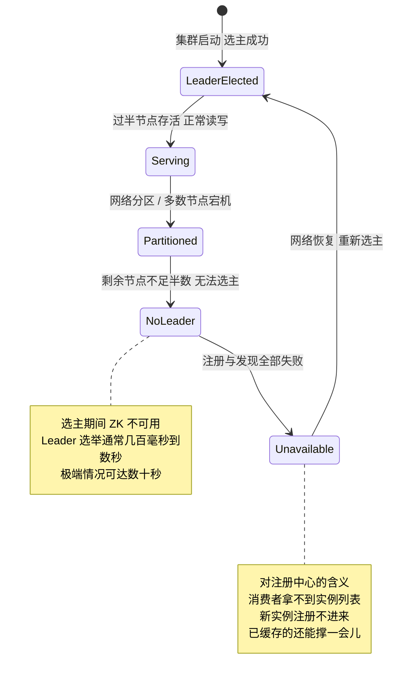

**关键细节（很多人答不对）**：ZK 不可用时，**已经拿到实例列表并缓存在本地的消费者不会立刻失败**——它缓存的列表还在用。真正被卡住的是：

1. **新实例注册不进来** → 扩容/发布时新 Pod 拿不到流量（这时候如果滚动发布，旧实例已停，就可能出现容量不足）；
2. **实例下线摘除不了** → 挂了实例仍在列表里，请求继续打到死实例上；
3. **消费者重启/新建连接** → 拉不到列表，直接启动失败；
4. **ZK 的 Session 超时误判**：网络抖动导致 Session 超时，临时节点被删除，实例被"误摘"，然后实例自己还不知道；重连后重建节点。抖动期间流量被摘走。

> [!danger] ZK 作为注册中心的经典事故
> 网络抖动 → 一批实例的 Session 同时超时 → 临时节点批量消失 → 注册中心里几乎没实例了 → 消费者拉到空列表。
> 如果客户端**没有"推空保护"**（收到空列表就清空本地缓存），整条链路瞬间全挂。
> 这就是 Nacos 为什么专门做**「推空保护」**：当收到某服务的实例列表为空时，**拒绝更新本地缓存，继续用旧列表**，并告警。

### 2.4 Nacos 的两套实现（重点，也是它的最大亮点）

Nacos 最妙的设计是**同时支持 AP 和 CP 两种实例类型**，由客户端在注册时指定。

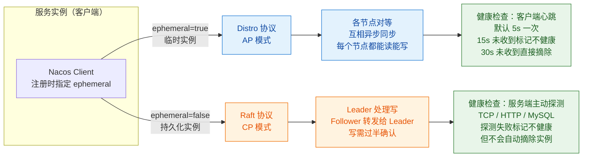

| 对比项 | **临时实例（ephemeral=true，默认）** | **持久化实例（ephemeral=false）** |
|---|---|---|
| 一致性协议 | **Distro（AP）** | **Raft / JRaft（CP）** |
| 数据存储 | **仅存内存**，不落盘 | **持久化到磁盘** |
| 健康检查 | 客户端**心跳续约**（5s / 15s / 30s） | 服务端**主动探测**（TCP/HTTP/MySQL） |
| 实例下线 | 心跳超时后**自动摘除** | **不会自动摘除**，只标记不健康，保留在列表中 |
| 实例主动注销 | 支持 | 支持 |
| 网络分区时 | 各节点继续服务，可能返回旧列表 | 少数派不可写 |
| 适用 | **普通无状态微服务**（99% 场景） | 数据库、MQ、DNS 类**需要保留实例元数据**的场景；或需要"只标记不摘除"做人工介入的 |

> [!tip] 怎么回答"Nacos 为什么比 Eureka 强"
> 不要说"功能多"，要说：
> 1. **Eureka 只有 AP 一条路**，而 Nacos 让**每个服务自己选** CP 还是 AP——需要绝对的可用性就用临时实例，需要元数据不丢就用持久化实例，**一种产品覆盖两种诉求**；
> 2. **Eureka 只有客户端心跳**，服务端对"进程活着但不干活"的假死毫无办法；Nacos 持久化实例支持**服务端主动探测**，可以做业务级健康检查；
> 3. **Eureka 只有注册发现**，配置中心要另配 Spring Cloud Config + Bus（还依赖 MQ 广播），Nacos 一体化，**少一套组件就少一个故障点**；
> 4. Eureka 已停止演进，Nacos 社区活跃。

### 2.5 服务发现的两种模式：客户端发现 vs 服务端发现

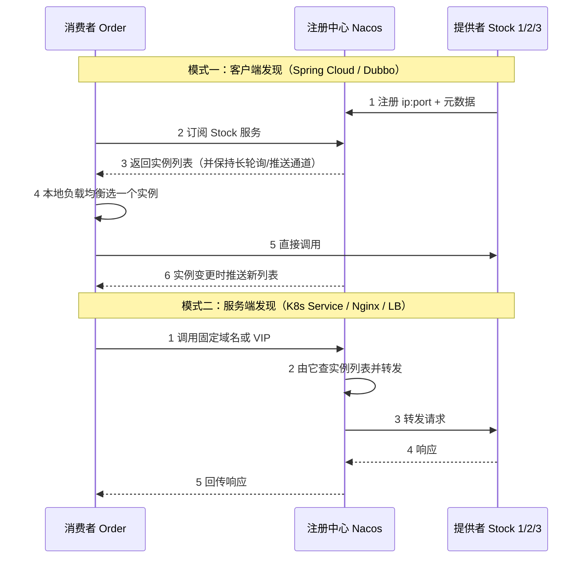

| 维度 | **客户端发现** | **服务端发现** |
|---|---|---|
| 代表 | Spring Cloud + Nacos、Dubbo | K8s Service + kube-proxy、Nginx、AWS ALB |
| 负载均衡位置 | **消费者进程内**（Ribbon / Spring Cloud LoadBalancer / Dubbo LB） | 独立组件（LB / Service） |
| 优点 | 少一跳、延迟低；**客户端可感知实例元数据**（机房、灰度标签），能做**同机房优先、灰度路由、一致性哈希** | 客户端极简，语言无关；治理逻辑集中，升级不用动所有服务 |
| 缺点 | **每种语言都要实现一套客户端**；SDK 升级要全量推动；消费者要知道注册中心 | **多一跳**，LB 可能成瓶颈；LB 自己也要高可用 |
| 选型 | Java 单一技术栈、要精细化路由 → 客户端发现 | 多语言（Go/Java/Python 混合）、要弱化客户端 → 服务端发现 |

> [!note] 为什么微服务里客户端发现更常见
> 因为**精细路由需要服务端信息**。比如：
> - **同机房优先**（避免跨机房 10ms+ 延迟）——只有客户端知道自己在哪个机房；
> - **灰度发布**（`version=v2` 的实例只给特定用户）——需要按实例元数据选；
> - **一致性哈希会话粘性**（见 [[5-一致性哈希与负载均衡]]）。
> 这些在服务端 LB 上做，要么做不了，要么配置爆炸。代价是**强绑定 SDK**。

### 2.6 推 vs 拉：变更怎么通知到消费者

这是高频追问，三种方案的本质是**实时性 vs 服务端压力**的权衡。

| 方案 | 原理 | 延迟 | 服务端压力 | 问题 |
|---|---|---|---|---|
| **纯轮询（Pull）** | 客户端每 N 秒拉一次全量 | **N 秒级**（默认 30s 很常见） | 小 | **扩容后新实例要等一个周期才有流量**，发布慢 |
| **纯推送（Push）** | 服务端变更时主动 TCP/UDP 推 | 毫秒级 | 大（要维护所有客户端连接） | 客户端网络抖动时**可能丢推送**，且服务端要知道谁在听什么 |
| **长轮询（Long Polling）** | 客户端请求挂住，服务端有变更或超时才返回 | 秒级（近实时） | 中（连接数 ≈ 客户端数） | 需要处理超时重连、连接数上限 |
| **UDP 推送 + 长轮询兜底（Nacos）** | 变更时 UDP 推一次（快，可能丢）；客户端同时挂着长轮询（慢，必达） | **毫秒级（UDP 成功）/ 秒级（兜底）** | 中 | 实现复杂，UDP 在容器网络里可能被禁 |

> [!important] 推送延迟的真实后果
> 假设注册中心变更要 **T 秒**才传播到所有消费者，而你的**发布是滚动重启**：
> 1. `t=0` 停掉实例 A（优雅下线，已摘流量）；
> 2. `t=1` 启动新实例 B 并注册；
> 3. **`t=1 ~ t=1+T`**：消费者本地缓存里**还没有 B**，但 A 已经在优雅下线流程里 —— **这段时间这个服务的可用实例数少了一个**。
> 4. 如果这时候是**全量发布**（一批一批停），可用实例数会持续低于预期 → **容量不足 → 超时 → 雪崩**。
>
> **这就是为什么"发布期间容量要留 buffer"**：发布时按 `期望QPS / (实例数 - 同时在重启的实例数)` 核算，而不是按稳态算。也是为什么**注册中心的推送延迟**是发布速度的实际控制参数。

### 2.7 健康检查：心跳 vs 主动探测，以及"实例假死"

| 方式 | 原理 | 能发现什么 | 发现不了什么 |
|---|---|---|---|
| **客户端心跳** | 实例定时上报"我还活着" | 进程崩溃、机器宕机、网络断开（心跳发不出） | **实例假死**：进程在、心跳能发，但业务线程池满了 / GC 卡死 / 依赖 DB 挂了 |
| **服务端主动探测 TCP** | 服务端定期连一下端口 | 端口不通（进程死了） | **端口通但业务不响应**（TCP 握手在内核完成，跟应用无关） |
| **服务端主动探测 HTTP** | 请求一个健康检查接口 | 应用层还能响应 | 如果探针接口只是 `return "ok"`，**探测不到核心依赖** |
| **业务探针** | 探针里检查**关键依赖**（DB 连接、Redis、线程池水位） | **真正的假死** | 探针本身可能成为故障放大器（见下） |

> [!danger] 实例假死的经典场景与治理
> **场景**：订单服务有个下游支付接口超时，Tomcat 线程池 200 个线程全被慢调用占满。此时：
> - 进程活着，心跳正常 → 注册中心认为它健康；
> - 端口能连，TCP 探测通过 → 服务端主动探测也认为它健康；
> - **但是所有业务请求都在排队，全部超时**。
>
> 表现：注册中心里这个实例是"健康"的，流量持续打进来，**错误率飙升但摘不掉**。
>
> **治理组合拳**：
> 1. **业务探针**：健康检查接口里加 `线程池活跃度 > 90% → 返回 503`，或者检查关键依赖连通性。这样假死实例会被摘掉；
> 2. **但探针要"浅"**：不要在探针里查 DB 全表、不要依赖会级联失败的强依赖。否则**下游一挂，所有实例同时不健康 → 全量摘除 → 服务彻底不可用**。这是探针最常见的自伤方式。**探针只检查"我这个进程能不能干活"，不检查"我的下游健不健康"**；
> 3. **超时 + 熔断**：给下游调用设短超时（如 200ms）和熔断器，避免线程被长时间占用（见 [[7-限流熔断降级]]）；
> 4. **线程池隔离**：给不同下游分配独立线程池，一个下游慢不拖垮全部；
> 5. **快速失败标记**：Sentinel/Resilience4j 熔断打开后，请求直接返回降级结果，不占线程。
>
> **本质**：健康检查要能反映「**我还能不能提供正常服务**」，而不是「**我这个进程还在不在**」。但探针的判定条件必须**只依赖自身状态**，不能依赖外部依赖的健康——否则会把下游故障放大成全站摘除。

### 2.8 优雅上下线（重点，生产事故高发区）

**为什么直接 kill 会导致请求失败？**

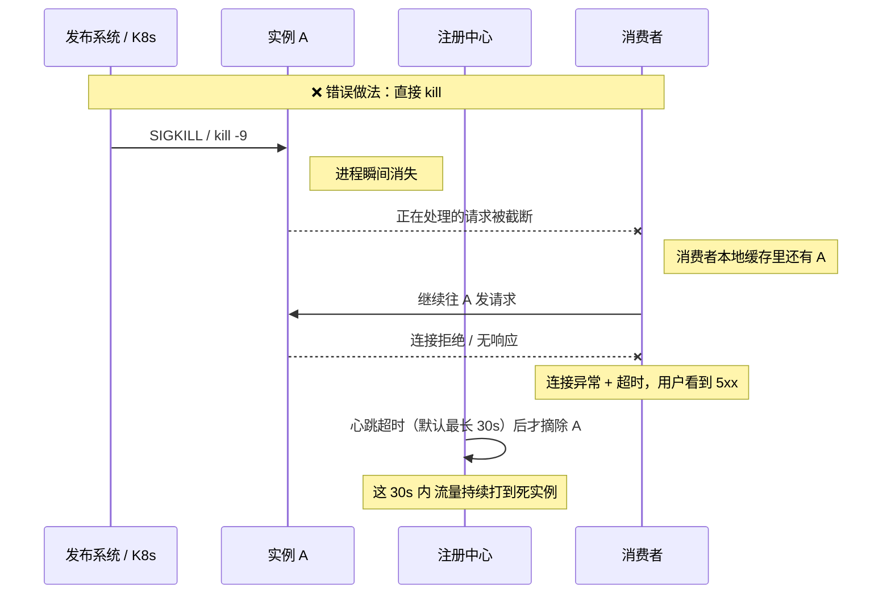

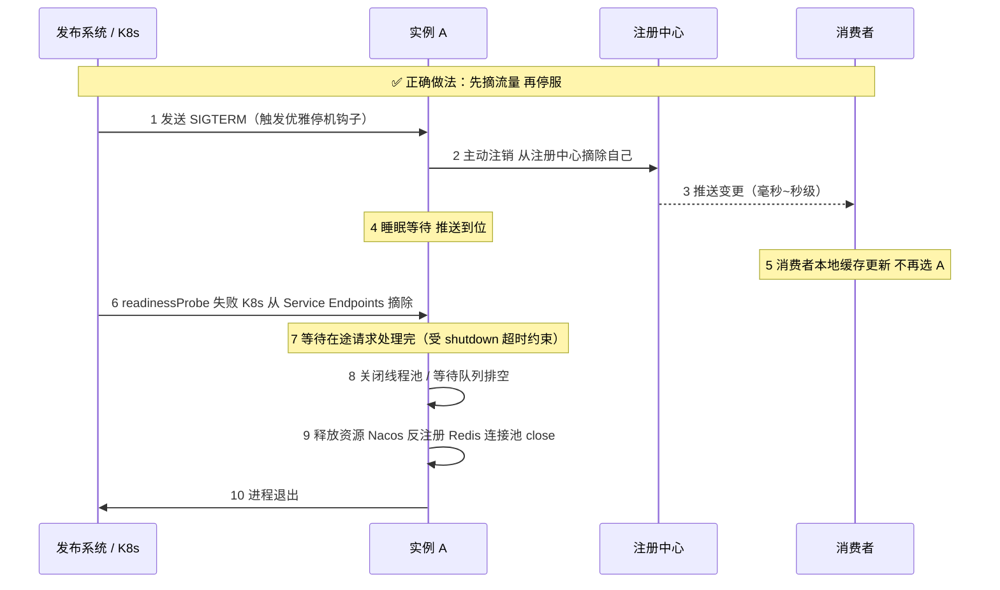

**落地三件套：**

| 措施 | 具体做法 | 解决什么 |
|---|---|---|
| **JVM 优雅停机** | `server.shutdown=graceful` + `spring.lifecycle.timeout-per-shutdown-phase=30s`（Spring Boot）；确保 shutdown hook 里先反注册 Nacos | 在途请求被截断 |
| **主动反注册 + 延迟等待** | 停机钩子里先 `nacosRegistration.deregister()`，然后 **sleep N 秒**（N ≥ 注册中心推送延迟 + 消费者缓存刷新时间，通常 5~10s）再继续停 | 消费者还没收到变更 → 继续打到本实例 |
| **K8s 双层配合** | `preStop: sleep 10` **配合** `readinessProbe`；readiness 失败后 K8s 会把 Pod 从 Service Endpoints 摘掉 | 摘 K8s Service 流量（不经注册中心的入口） |

> [!warning] 三个高频踩坑
> 1. **`preStop` 与应用的优雅停机是两回事。** `preStop` 是 K8s 在发 SIGTERM **之前**执行的；SIGTERM 之后才是 JVM 的 shutdown hook。顺序是：`PreStop Hook → SIGTERM → 应用优雅停机 → 超时后 SIGKILL`。很多人只配了 `preStop: sleep 10`，**但没配 `server.shutdown=graceful`**，结果在途请求照样被截断。
> 2. **`terminationGracePeriodSeconds` 要够长。** 默认 30s。如果你 `preStop` 睡 10s + 在途请求排空要 25s，就会在 30s 被 SIGKILL 打断。要算：`preStop 等待 + 在途排空时间 < terminationGracePeriodSeconds`。
> 3. **注册中心下线延迟造成的短暂 5xx 无法完全消除。** 因为是**最终一致**的（AP 模型必然有传播延迟），只能缩短窗口：主动反注册 + UDP 推送 + 足够长的等待窗口 + 客户端**连接层重试**（注意：只重试幂等请求，且要控制重试次数防重试风暴，见 [[7-限流熔断降级]]）。
> **负责人视角的正解是：承认窗口存在，用「足够的等待时间 + 客户端重试 + 灰度发布」把影响压到可接受，而不是幻想做到 0。**

### 2.9 优雅上下线的"上线"侧

上面讲的是下线，**上线**同样有坑：

| 坑 | 现象 | 解决 |
|---|---|---|
| **实例还没预热就接流量** | 新实例刚启动，JVM 代码未 JIT、连接池未建、本地缓存为空 → 前几个请求极慢 → 超时 | **延迟注册**：应用完全就绪后再注册；预热接口先跑一遍关键路径；`readinessProbe` 加 `initialDelaySeconds` |
| **缓存冷启动** | 新实例本地缓存为空，全部穿透到 DB → DB 被打挂 | **缓存预热**（启动时加载热点数据），见 [[6-缓存一致性与高可用]] |
| **一次性全量扩容** | 注册中心瞬间涌入大量注册 → 推送风暴 → 消费者反复刷新 | 分批扩容；注册中心推送做**合并（batch）** |
| **注册成功但依赖没就绪** | DB 连接池还没建立，注册后立刻接流量 → 全部报错 | 注册时机放在**所有依赖初始化完成之后**，或 `readinessProbe` 检查核心依赖 |
| **K8s 里同时有 readiness 和注册中心** | 两套流量发现机制不一致（Endpoints 已摘、Nacos 还没有 / 反之） | 明确**谁是权威**：容器外流量走网关查 Nacos；集群内直连走 K8s Service。两套都要处理摘除，且**在两个都摘完之前不要停服** |

> [!important] 必答 callout —— 注册中心怎么选 / 服务优雅下线怎么做
> **注册中心怎么选（30 秒版）**：
> 「新项目直接选 **Nacos**：它同时支持 AP（临时实例/Distro）和 CP（持久实例/Raft），一种产品覆盖两种诉求；原生带配置中心，少一个组件；支持服务端主动探测和推空保护。**Eureka** 是纯 AP，只有客户端心跳，且已停止演进，不适合新项目，但存量系统还在用。**Zookeeper** 是 CP，网络分区时可能整个集群不可用——新实例注册不进来、扩容/发布被卡死，而且 Session 抖动会误摘健康实例，作为注册中心天然不匹配『读多写极少、容忍短暂不一致』的负载特征，更适合做选主和元数据。**Consul** 服务端探测做得好、多语言友好，但国内 Java 生态和社区支持不如 Nacos。所以结论是 **Nacos，除非你有明确的多语言服务端发现诉求**。」
>
> **服务优雅下线怎么做（30 秒版）**：
> 「核心是**先摘流量，等在途请求处理完，再停服**，四步：
> ① **主动反注册**——收到 SIGTERM 后在 shutdown hook 里先调 Nacos 反注册，别等心跳超时（默认要 15~30s）；
> ② **睡眠等待**——反注册后 sleep 5~10s，等注册中心把变更推到所有消费者、消费者刷新本地缓存，这个窗口是最终一致模型下**省不掉**的；
> ③ **排空在途请求**——`server.shutdown=graceful` + 合理超时，把线程池队列跑完；
> ④ **K8s 侧配合**——`preStop: sleep 10` + `readinessProbe` 摘 Endpoints，且 `terminationGracePeriodSeconds` 要大于整个流程耗时，否则会被 SIGKILL 打断。
> 另外上线的反问题同样重要：**延迟注册**，等依赖和缓存预热完成再注册，避免新实例被第一批流量打挂。」

---

## 三、配置中心

### 3.1 为什么需要配置中心

| 痛点 | 具体表现 | 配置中心怎么解 |
|---|---|---|
| **配置散落** | 30 个服务 × 每个服务 3 个环境 × 每个环境一份 `application.yml`，共 90 份文件 | 集中管理，按 `namespace/group/dataId` 组织 |
| **改配置要重启** | 改个限流阈值要发版，走完 CI/CD 20 分钟 | **动态刷新**，秒级生效 |
| **多环境混乱** | 测试环境误连生产 DB（因为复制了配置文件忘了改） | 环境隔离由 namespace 保证，**配置与代码分离** |
| **配置无版本无审计** | "谁把线程池从 200 改成 20 的？"没人知道 | 历史版本 + 一键回滚 + 操作审计 |
| **敏感信息明文** | DB 密码写在 Git 里 | 加密存储 + 权限控制 |
| **配置漂移** | 手动改过某台机器的配置，与仓库不一致 | 配置只从中心下发，禁止本地改 |

> [!tip] "配置中心最容易被低估的价值"
> 不是"不用重启"，而是**「变更的可控性」**：灰度发布配置（先推 1 个实例观察）、一键回滚到上一版本、变更审计。生产事故里"改配置改挂"的比例非常高，配置中心的价值主要在这里。

### 3.2 动态刷新的原理

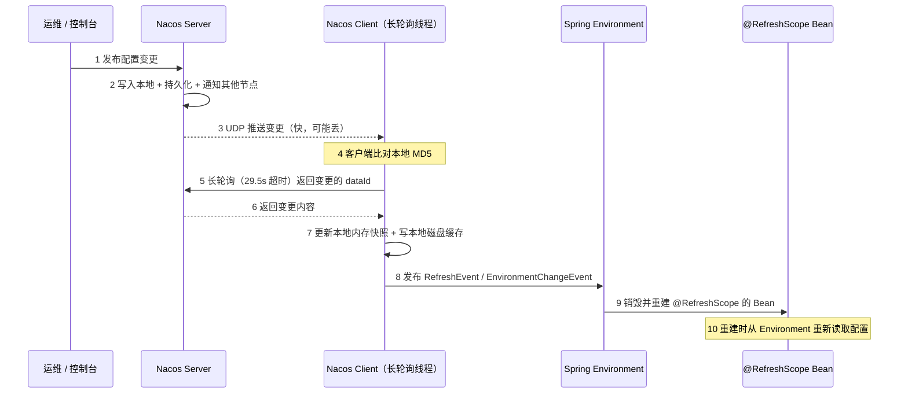

**关键机制拆解：**

| 机制 | 作用 | 细节 |
|---|---|---|
| **长轮询（Long Polling）** | 兼顾实时性与服务端压力 | 客户端请求挂住 29.5s，服务端有变更立即返回，否则超时返回空。**比纯推送省连接管理，比纯轮询快** |
| **MD5 比对** | 避免无谓的下发 | 客户端本地存配置 MD5，服务端说"变了"还要比对，一致就不下发 |
| **本地磁盘缓存** | 配置中心挂了也能启动（见 3.5） | 快照存在 `${user.home}/nacos/config/` 下 |
| **`@RefreshScope`** | 让 Bean 能重新创建 | 本质是 `@Scope("refresh")`，收到 `RefreshEvent` 后销毁单例、下次访问重建 |
| **`EnvironmentChangeEvent`** | 更新 `Environment` 里的属性 | 会触发 `ContextRefresher`，还会**重新绑定 `@ConfigurationProperties` 的 Bean** |

**为什么有些配置改了不生效？（高频追问）**

| 场景 | 为什么失效 | 正确做法 |
|---|---|---|
| **静态字段 / `static final`** | 静态字段在类加载时初始化一次，不参与 Spring 的重新绑定 | 改成实例字段 + `@Value`，或用 `@ConfigurationProperties` |
| **`final` 字段** | 无法重新赋值 | 去掉 `final` |
| **已在用的连接池参数** | 连接池在启动时按配置创建了连接，改 `maxPoolSize` 只是改了属性值，**池子不会自动重建** | 用支持动态调整的连接池（HikariCP 有 `setMaximumPoolSize`），或监听变更事件手动重建 |
| **线程池 corePoolSize** | `ThreadPoolExecutor` 的 `corePoolSize` 改了也不会缩容已有线程，且很多框架的线程池是启动时创建的 | 手动监听事件调用 `setCorePoolSize` / `setMaximumPoolSize` |
| **`@Value` 注入到普通（非 `@RefreshScope`）Bean 的字段** | Bean 不重建，字段不重新注入 | 给 Bean 加 `@RefreshScope`，或改用 `@ConfigurationProperties` |
| **`@ConfigurationProperties` 没加 `@RefreshScope` 或没开自动刷新** | 实际上 `@ConfigurationProperties` 在 `EnvironmentChangeEvent` 时会重新绑定，但**前提是这个 Bean 被 Spring 管理且绑定是通过 Binder 走的**；自己 `new` 出来的对象不受管理 | 确保是 Spring Bean |
| **Spring Cloud Gateway 的路由配置** | Gateway 的路由是启动时构建的 `RouteDefinitionLocator` | 用 `spring.cloud.gateway` 的配置 + **`@RefreshScope` 注解在 Gateway 配置类上**，或调用 `RefreshRoutesEvent` 手动刷新 |
| **日志级别** | Logback 配置刷新需要额外的 `LoggingSystem` 支持 | Spring Boot 支持通过 `logging.level.*` 动态调整，Nacos 里配 `logging.level.com.xxx=DEBUG` 可生效 |
| **`server.port` 等启动期配置** | 端口在启动时就绑定了，改了只能重启 | 这类配置设计上就不该动态化，文档里要标注"需重启" |

> [!warning] 负责人视角：动态刷新是"能力"也是"风险"
> 动态刷新让"改错配置"的爆炸半径变成**全量即时生效**。所以生产上要：
> 1. **敏感配置分级**：能动态刷新的和必须重启的分开管理，文档标注；
> 2. **配置变更走灰度**：Nacos 支持按 IP 灰度推送（beta 发布），先推 1 台观察；
> 3. **保留一键回滚**：历史版本必须留着，出问题 10 秒内回滚；
> 4. **变更审计 + 告警**：谁在什么时候改了什么，要有人看得见。

### 3.3 配置的模型：namespace / group / dataId

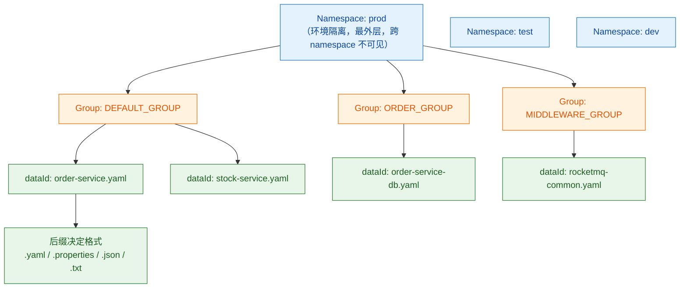

| 层级 | 作用 | 实践建议 |
|---|---|---|
| **Namespace** | **环境/租户隔离**，必须隔离 | `dev` / `test` / `uat` / `prod`，**跨 namespace 默认不可见**，这是防"测试连生产"最硬的屏障 |
| **Group** | 同一 namespace 内的分组 | 按业务域分（`ORDER_GROUP`）或按用途分（`COMMON_GROUP` / `MIDDLEWARE_GROUP`） |
| **dataId** | 一个配置文件 | 约定命名：`${spring.application.name}-${profile}.${file-extension}` |

**配置的优先级（从高到低，Spring Cloud Alibaba 典型）：**

> [!note] 一个反直觉的点
> **本地配置的优先级低于远程配置**。很多人以为"本地 `application.yml` 能覆盖 Nacos"，实际相反——Nacos 的配置会覆盖本地同名配置（因为在 `PropertySource` 顺序里 Nacos 排在前面）。
> 这带来一个经典事故：**本地调试时想临时改个参数，改了 `application.yml` 没生效**，因为 Nacos 上的值把它盖住了。排查这类问题要先确认「**这个 key 到底生效的是哪一层**」。

### 3.4 敏感配置加密

| 方案 | 原理 | 优缺点 |
|---|---|---|
| **明文放在 Nacos + 权限控制** | 靠 Nacos 的命名空间/账号权限隔离 | 最简单；但 DBA 密码对运维可见，不满足合规 |
| **Jasypt 加解密** | 配置里写 `ENC(密文)`，应用启动时用密钥解密 | 简单；但**密钥本身要放在启动参数/环境变量里**，等于把问题转移了 |
| **KMS / 密钥管理服务** | 应用启动时向 KMS 申请临时凭证，动态拉取密文 | 最安全；**引入新依赖，KMS 挂了应用起不来**，要做本地缓存兜底 |
| **配置中心自带的加密** | 部分配置中心支持加解密 API | 依赖厂商实现 |
| **K8s Secret + 环境变量注入** | 敏感信息根本不进配置中心 | 与配置中心职责分离，推荐组合 |

> [!important] 负责人视角
> 加密的本质问题是**「密钥放哪」**——最终的根密钥总得有个地方待着。所以：
> - **不要追求绝对安全，要追求"分层 + 可轮换 + 可审计"**；
> - 生产推荐 **配置中心存普通配置 + K8s Secret/KMS 存敏感凭证**，职责分离；
> - 无论哪种方案，**密钥轮换能力**比加密算法强度更重要（出事了能不能 10 分钟内换掉）。

### 3.5 配置中心的可用性：它挂了服务还能启动吗？

**这是最高频的追问，也是最能看出实战经验的地方。**

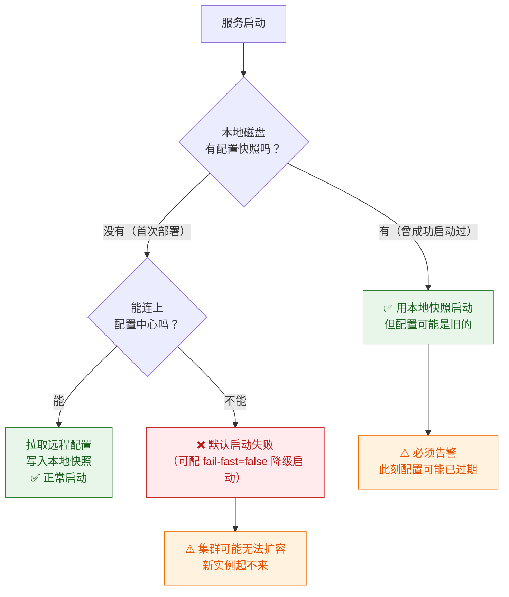

**分场景回答：**

| 场景 | 行为 | 说明 |
|---|---|---|
| **已运行中的服务** | ✅ **不受影响**，继续用内存里的配置 | 配置已经在 JVM 内存里了，配置中心挂了不影响已有实例 |
| **服务重启 / 新实例启动（有本地快照）** | ✅ **能用旧配置启动** | Nacos Client 会把配置快照写到 `${user.home}/nacos/config/fixed-{serverAddr}/data/config-data/` |
| **服务重启 / 新实例启动（无本地快照）** | ❌ **默认启动失败** | 因为 Spring 启动需要 `PropertySource`，拿不到配置就无法完成上下文初始化。`spring.cloud.nacos.config.import-check` / `fail-fast` 控制这个行为 |
| **配置变更** | ❌ 无法变更 | 这个期间**发布窗口被冻结**——线上有 bug 也没法改配置，只能改代码发版 |

> [!danger] 这里有个非常隐蔽的生产陷阱
> **本地快照的路径包含 `serverAddr`**。如果你把 Nacos 地址从 IP 改成域名、或者换了集群地址，**旧快照就找不到了** —— 相当于"没有本地缓存"，配置中心一挂服务就起不来。
> 另外，**容器化部署时 `user.home` 可能是临时目录**，Pod 重建后快照丢失。所以生产上要么挂持久卷，要么接受"配置中心必须高可用"。
>
> 更进一步：**"能启动"不等于"能正常工作"**。用旧配置启动可能连的是已经下线的 DB、过期的 MQ 地址 —— 所以用兜底快照启动时**必须告警**，让人知道"现在跑的是过期配置"。

**必答 callout —— 配置中心挂了会怎样：**

> [!important] 30 秒版回答
> 「分三种情况：
> **① 运行中的服务不受影响**——配置已经在 JVM 内存里，配置中心只是变更通道；
> **② 重启的服务能起来**——Nacos Client 会在本地磁盘写配置快照，拿不到远程就用快照兜底；
> **③ 全新部署的实例起不来**——没有本地快照，Spring 上下文初始化缺配置，直接启动失败。
> 所以真正的风险不是"已有服务挂掉"，而是**「弹性伸缩和发布能力被冻结」**：流量涨了扩不了容，有 bug 改不了配置只能改代码。**这才是配置中心必须做高可用的真正理由。**
> 兜底手段有四条：① 本地快照（注意路径含 serverAddr，换地址会失效，容器里要挂持久卷）；② Nacos 集群至少 3 节点，跨机房部署；③ 客户端的 `fail-fast` 配置要评估，别为了"能启动"而让服务带着错配置裸奔；④ 兜底启动时**必须告警**，因为跑的是可能过期的配置。
> 另外要提醒一句：**兜底是为了"不中断"，不是为了"正常运行"**——配置中心的可用性目标应该定得比业务服务更高。」

---

## 四、API 网关

### 4.1 核心职责

| 职责 | 说明 | 不做的后果 |
|---|---|---|
| **路由转发** | 按 path/host/header 把请求转发到对应服务 | 客户端要知道所有服务地址 |
| **统一鉴权** | JWT 校验、Token 解析、黑白名单 | 每个服务都要写一遍鉴权，改规则要发 N 个版 |
| **限流** | 全局限流（网关层）+ 服务级限流（Sentinel） | 恶意流量直接打到业务服务 |
| **灰度/蓝绿** | 按 header/用户 ID/权重路由到不同版本 | 灰度只能靠发布系统，粒度粗 |
| **协议转换** | 外部 HTTP/REST → 内部 Dubbo/gRPC | 客户端要适配内部协议 |
| **日志与链路起点** | 生成 TraceId、记录访问日志、埋点 | 链路追踪断在入口 |
| **跨域 / 响应改写** | CORS、统一响应包装、脱敏 | 每个服务各写一遍 |
| **熔断降级** | 网关层兜底降级（如返回缓存/静态页） | 下游全挂时用户看到白页 |
| **流量防护** | IP 黑名单、防爬、防重放 | 安全风险 |
| **请求/响应体改写** | 加签、字段裁剪 | — |

> [!warning] 为什么网关不能做业务逻辑（必答）
> **① 网关是单点，业务逻辑会让它变成瓶颈和故障爆炸点。** 网关是所有流量的必经之路，一个服务的业务逻辑出错，影响面是**全站**，而不是那一个业务域。
> **② 网关的扩容粒度最粗。** 业务服务可以按自身 QPS 独立扩缩容，网关的容量要覆盖全站峰值。在网关里做重逻辑（查 DB、查 Redis、算价格），会让网关的 CPU/连接数成为整个系统的天花板，而且**你没法只给"订单相关的那部分网关逻辑"扩容**。
> **③ 发布耦合。** 网关里塞业务，任何业务小改动都要发布网关，而发布网关 = **全站流量抖动**。原本一天发 10 次业务代码，现在变成一天发 10 次网关。
> **④ 职责混乱导致排查困难。** 出了故障，你无法判断是网关自己的问题还是业务问题，因为它们在同一个进程里。
> **正确的边界**：网关只做**横切关注点**——流量入口的鉴权、路由、限流、日志、灰度。**任何"需要理解业务语义"的逻辑，都应该在业务服务里，或者下沉到一个专门的 BFF（Backend For Frontend）层。** 网关要做的是把请求**正确地送到该去的地方**，而不是**处理它**。
> 例外：非常轻量的"业务感知路由"（如按 `userId` 哈希选机房、按 App 版本路由）是允许的，因为它是**路由策略**而不是**业务逻辑**。

### 4.2 Spring Cloud Gateway vs Zuul vs Nginx

| 维度 | **Spring Cloud Gateway** | **Zuul 1.x** | **Zuul 2.x** | **Nginx / OpenResty** |
|---|---|---|---|---|
| 编程模型 | **响应式（WebFlux + Reactor Netty）** | 同步阻塞（Servlet） | 异步非阻塞（Netty） | C 模块 / Lua |
| 线程模型 | 少量事件循环线程 | **每请求一线程** | 事件循环 | 事件驱动 + worker 进程 |
| 吞吐/连接数 | 高（少量线程撑大量连接） | 低（线程数 = 并发上限） | 高 | **最高** |
| 生态/可编程性 | **Java 生态，写 Filter 极方便**（限流、鉴权、灰度） | Java，但模型老 | Java | Lua / C，**业务集成成本高** |
| 与 Spring Cloud 集成 | **原生**（Nacos/Sentinel/Seata 开箱） | 原生（老版本） | 一般 | 需自己适配 |
| 动态路由 | 支持（`RefreshRoutesEvent` + Nacos 配置） | 支持 | 支持 | 需 reload/`balancer` |
| 适合 | **Java 微服务的业务网关** | 存量老系统 | 存量 | **四/七层入口、静态资源、SSL 卸载** |

> [!important] 生产上的典型架构是**两层**，不是二选一
> `SLB/LVS（四层） → Nginx（七层入口，SSL 卸载、静态资源、WAF、IP 限流） → Spring Cloud Gateway（业务网关：鉴权、灰度、路由到微服务） → 微服务`
> **为什么两层**：Nginx 处理"和业务无关的通用流量"（静态文件、TLS、超大连接数）性价比最高；Spring Cloud Gateway 处理"和业务有关的动态路由和鉴权"，因为它能直接读 Nacos、写 Java Filter。**各用各的长处。**
> 也有团队只用一个（纯 Nginx + Lua，或纯 Gateway），取舍是：只用一个更简单，但会把大量非业务流量压到 Java 网关上，性价比低。

### 4.3 网关的瓶颈与高可用

| 风险 | 原因 | 治理 |
|---|---|---|
| **成为全局单点** | 所有流量必经 | 至少 2 实例 + 前面的 SLB 做四层负载；**网关本身必须无状态**，不能存 session |
| **连接数打满** | 响应式网关连接数上限受 `maxConnections` 和文件描述符限制 | 调优 `ulimit -n`、Reactor Netty 的 `maxConnections`、连接池 |
| **慢下游拖垮网关** | 下游慢，网关的连接被占住 | **网关必须配超时**（`connect-timeout` / `response-timeout`），并且**超时必须小于上游 SLB 的超时**，否则请求被上游先切断 |
| **大响应体 OOM** | 网关缓存整个响应体做改写 | 限制响应体大小；流式转发不做全量缓存 |
| **日志打太多** | 全量请求/响应体落盘 | 采样、只记关键字段、异步落盘 |
| **规则变更引发全站抖动** | 路由/限流规则变更发布 | 动态配置 + 灰度生效；变更走审核 |
| **CPU 打满在 JSON 解析/加解密上** | 鉴权里做 JWT RSA 验签（CPU 密集） | 用 HMAC 代替 RSA、缓存公钥和验签结果、必要时卸载到专门的鉴权服务 |

---

## 五、服务调用：REST vs RPC

### 5.1 对比

| 维度 | **REST（HTTP + JSON，OpenFeign）** | **RPC（Dubbo / gRPC）** |
|---|---|---|
| 协议 | HTTP/1.1 或 HTTP/2 + 文本 JSON | 自定义二进制协议（Dubbo）/ HTTP/2 + Protobuf（gRPC） |
| **序列化效率** | 低（JSON 文本，字段名重复传输，体积大） | **高**（二进制，字段用编号，体积小） |
| 序列化性能 | 慢（文本解析 + 反射） | **快**（Protobuf/Hessian2 编解码） |
| 连接复用 | HTTP/1.1 默认短连接（需连接池）；HTTP/2 支持多路复用 | **原生长连接 + 多路复用** |
| 接口定义 | 无强约束（OpenAPI 可选） | **强接口契约**（IDL / Java Interface） |
| 跨语言 | **天然好**（任何语言都有 HTTP + JSON） | gRPC 好；Dubbo 以 Java 为主 |
| 可调试性 | **极好**（curl、浏览器、Postman） | 差（需要专用工具） |
| 穿透性 | **好**（网关、防火墙、CDN 都友好） | 差（自定义协议可能被拦截） |
| 性能量级 | 基准 | **通常显著高于 REST**（具体数字依实现和场景，不要背具体倍数） |
| 适合 | **对外 API、跨语言、内部调用量不大** | **内部高频调用、性能敏感** |

> [!note] 负责人视角：别为了性能数字上 RPC
> 真实决策链路是：
> 1. **内部调用 QPS 高不高？** 几千 QPS 以下，REST 完全够用，省下的机器钱不如省下的开发/排障成本；
> 2. **团队技术栈是不是纯 Java？** 混合栈（Go/Python）就用 gRPC 或 REST，别用 Dubbo；
> 3. **要不要走网关暴露？** 要走网关就是 HTTP；
> 4. **排障能力够不够？** RPC 出问题排查成本明显更高（抓包难、协议不透明），要评估团队能力。
> 结论通常是：**对外 REST，对内按需 RPC；新项目优先 gRPC（跨语言 + HTTP/2 + 生态好），存量 Java 体系用 Dubbo。**
> 而且**序列化格式**往往比协议选择影响更大——**避免 JSON 里塞大对象和冗余字段，比换 RPC 收益更直接**。

### 5.2 负载均衡在哪一层

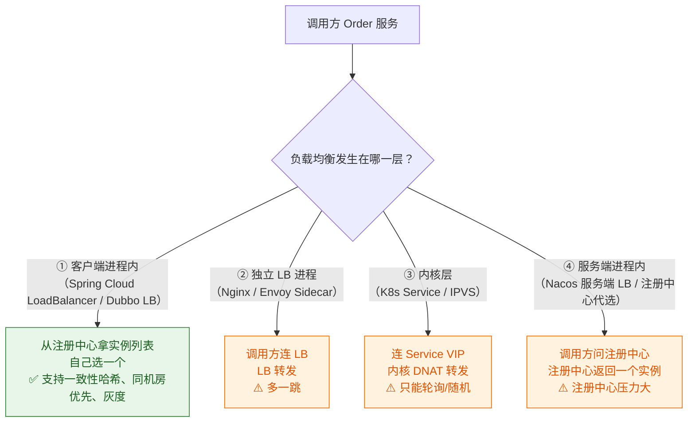

| 层次 | 代表 | 优点 | 缺点 |
|---|---|---|---|
| **客户端进程内** | Ribbon（旧）、Spring Cloud LoadBalancer、Dubbo LB | 无额外跳数；**算法最灵活**（一致性哈希、同机房、灰度、权重） | 每种语言都要实现；SDK 升级难 |
| **独立 LB** | Nginx、Envoy、HAProxy | 语言无关、集中治理 | 多一跳；LB 自己要高可用；算法受限于 LB 能力 |
| **内核层** | K8s Service（iptables/IPVS） | 零配置、性能好 | 算法简单（RR/随机）；**不支持应用层会话粘性**（除非用 sessionAffinity，但很粗） |
| **服务端选** | 注册中心代选 | 客户端极简 | **注册中心成为热点和单点**，不推荐 |

一致性哈希、加权轮询、最小连接数等算法细节见 [[5-一致性哈希与负载均衡]]。

---

## 六、链路追踪与可观测性

### 6.1 三大支柱

| 支柱 | 回答什么问题 | 代表工具 | 数据特征 |
|---|---|---|---|
| **Metrics（指标）** | "系统整体健康吗？"（QPS、RT、错误率、CPU） | Prometheus + Grafana、Micrometer | 聚合数值，**便宜，能长期存** |
| **Tracing（链路）** | "这个慢请求慢在哪一段？" | **SkyWalking**、Zipkin、Jaeger | 单请求全链路，**采样存储，成本高** |
| **Logging（日志）** | "当时到底发生了什么？" | ELK、Loki | 明细文本，**最贵，要分级和采样** |

> [!tip] 三者配合的排查路径（这是面试要讲出来的"方法论"）
> 1. **告警来自 Metrics** —— "订单服务 P99 从 200ms 涨到 2s"；
> 2. **进 Tracing 定位** —— 打开 SkyWalking，找几个慢 Trace，发现耗时都集中在 `调用库存服务` 这一段；
> 3. **用 TraceId 捞 Logs** —— 拿具体 TraceId 去 ELK 搜两侧的日志，确认是库存服务自己的 DB 慢，还是网络问题；
> 4. **定位根因** —— 库存服务某个 SQL 没走索引。
> **没有 TraceId 的话，第 3 步就要在几台机器的 GB 级日志里捞，基本等于不可排查。**

### 6.2 TraceId 透传的完整链路

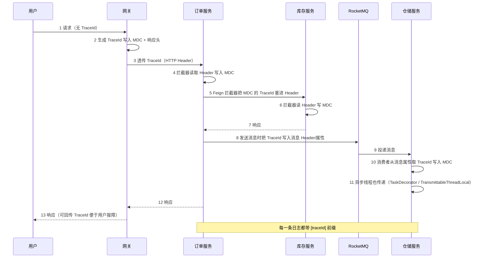

**每个环节的落地要点：**

| 环节 | 怎么做 | 坑 |
|---|---|---|
| **HTTP 入口** | `Filter` / `HandlerInterceptor`：先从 Header 取（上游可能已有），取不到就生成（雪花/UUID），**放入 `MDC` 并回写响应头** | 一定要"优先复用上游的"，否则每条链路断裂 |
| **MDC 与线程池** | `MDC` 用 `ThreadLocal`，**线程池复用线程会导致 TraceId 串号或丢失** | 用 `TransmittableThreadLocal`（TTL）或 `TaskDecorator` 包装线程池；**必须在任务结束时清理 MDC**，否则线程复用会带到下一个任务 |
| **Feign / RestTemplate** | `RequestInterceptor` 从 MDC 取 TraceId 塞到 Header | 别用 `@Async` 里发请求而不传递上下文 |
| **Dubbo** | 用 `RpcContext` 的 attachment 传递 | — |
| **MQ 生产端** | TraceId 写入消息的 user property / header | **不能放消息体里**（会污染业务语义，且消费端要解析） |
| **MQ 消费端** | 从消息属性取 TraceId 写入 MDC，**消费结束后清理** | 消费者线程池是复用的，不清理必然串号 |
| **异步/定时任务** | 手动生成或透传 TraceId | 定时任务没有上游，自己生成一个代表"这一批任务"的 ID，并写入业务日志 |
| **日志格式** | Logback pattern 加 `[%X{traceId}]` | 格式里没有它，MDC 放了也白放 |
| **跨语言** | 用标准 Header（W3C `traceparent`）而不是自定义 | 自定义 Header 在跨语言/跨网关时容易丢 |

> [!danger] TraceId 串号事故
> 现象：A 用户的请求日志里出现了 B 用户的 TraceId，导致排查时完全对不上。
> 原因：线程池复用 + 只在入口 `MDC.put` 而**在线程归还前没有 `MDC.clear()`**。
> 治理：统一在**任务提交时注入上下文、任务结束时清理**（用 `TransmittableThreadLocal` 或自己包装 `Runnable`），并把这条写进代码规范。**这类问题靠 Code Review 兜，工具兜不住。**

> [!important] 为什么日志里必须有 TraceId（必答）
> 「微服务把一个请求拆到了 N 个进程，日志天然是**按进程分散**的。没有 TraceId，出故障时你面对的是 N 台机器上互不关联的 GB 级日志——**你甚至无法判断一个报错属于哪个用户的哪次请求**。
> TraceId 的作用是把『**按时间维度**的日志』变成『**按请求维度**的日志』，这是微服务可观测性的最低门槛。它比引入 APM 更基础、更便宜——**哪怕你不上 SkyWalking，也必须先有 TraceId**。
> 实现上要注意三件事：入口**优先复用上游 TraceId**、**异步/MQ 场景的上下文传递**（线程池复用会串号）、以及**日志 pattern 里真的把它打出来**。这三件事任何一件没做，TraceId 就等于没有。」

---

## 七、微服务拆分的边界

### 7.1 怎么拆

| 原则 | 说明 | 反例 |
|---|---|---|
| **按业务能力拆（DDD 限界上下文）** | 一个服务对应一个完整的业务能力（订单、库存、支付），**自己拥有自己的数据** | 把 `UserService` 拆成"用户查询服务 + 用户写入服务" |
| **按限界上下文划分数据边界** | 每个服务独占自己的库/表，**不跨服务直接读别人的表** | 订单服务直接 `SELECT * FROM stock` |
| **高内聚低耦合** | 频繁一起变更的放一起，变更节奏不同的拆开 | 把 `订单` 和 `订单报表` 放一起（报表变更频繁拖累订单） |
| **团队规模匹配（两个披萨团队）** | 一个服务对应一个能独立负责的团队 | 20 人团队拆 30 个服务，每人维护 1.5 个 |
| **按变化频率拆** | 变化快和变化慢的分开 | 促销逻辑（天天改）和订单核心（稳定）放一起 |

> [!warning] 别按技术分层拆（最常见的错误）
> **错误拆法**：`controller 服务` / `service 服务` / `dao 服务` —— 这是把单体按层横切成"分布式单体"。
> **后果**：任何一次业务改动都要同时改 N 个服务、协调 N 次发布；调用链从 1 跳变 3 跳；事务从 1 个变成 3 个。**你付出了微服务的全部成本，却没拿到任何收益**（因为业务能力仍然耦合在一起，无法独立演进）。
> **正确认知**：微服务的拆分维度应该是**业务垂直切分**，技术分层是每个服务**内部**的事。

### 7.2 拆太细的代价

| 代价 | 具体表现 | 量化感受 |
|---|---|---|
| **分布式事务** | 原本一个 `@Transactional` 搞定的事，现在要 TCC/Saga + 对账 | 开发量 × 3~5，且要处理空回滚、悬挂、幂等（见 [[2-分布式事务]]） |
| **调用链变长** | 1 次请求 → 8 次 RPC，每次都有网络开销和失败概率 | 若单次调用成功率 99.9%，8 次串行后**整体成功率约 99.2%**（可用性相乘） |
| **RT 累加** | 串行调用 RT = Σ 各段耗时 | 每段 +2ms 网络，8 段就是 +16ms，还不含排队 |
| **排障成本** | 一个 bug 要跨 8 个服务和 8 份日志 | 必须有全链路追踪，否则基本查不动 |
| **发布复杂度** | 改一个功能要协调 5 个服务的发布顺序 | 需要契约测试、版本兼容策略 |
| **资源开销** | 每个 JVM 至少要几百 MB（含元空间、框架开销） | 30 个服务 × 3 环境 × 2 副本 = 180 个 JVM，"基础设施比业务还贵" |
| **数据一致性** | 跨服务查询要组装，报表要跨库 | 引入宽表/数仓做 CQRS 读模型 |

> [!important] 什么时候不该拆（必答）
> 1. **团队规模小**（< 10 人）：拆分带来的协调成本会超过收益，**先做好模块化（Modular Monolith）就够了**——代码上分模块、接口清晰、数据不跨界，将来真要拆，成本很低；
> 2. **事务强一致要求高**：核心资金/账务类逻辑，如果必须强一致，硬拆会引入分布式事务的复杂度，**得不偿失**。可以做成"一个服务 + 内部模块化"；
> 3. **业务还在快速试错期**：需求天天变，服务边界也会天天变，**频繁重划分的代价极高**；
> 4. **QPS 很低、没有独立扩容需求**：拆分的核心收益是"独立扩容/独立部署"，没有这个需求就别拆；
> 5. **团队没有分布式运维能力**：没有链路追踪、没有统一日志、没有 CI/CD，拆完就是灾难。
>
> **推荐路径**：**模块化单体 → 按瓶颈/变更频率拆出少数几个服务 → 逐步演进**。
> 拆分的合理触发信号是：**"这个模块需要独立的扩容节奏"、"这个模块的变更频率显著高于其他"、"这个模块有独立的技术栈诉求"、"这个团队要独立交付"** —— 出现这些信号再拆，不要为了架构图好看而拆。

### 7.3 服务拆分的粒度自检表

| 自检项 | 健康的答案 | 危险信号 |
|---|---|---|
| 这个服务能独立部署吗？ | 能，改它不用动别人 | 每次都要和其他服务一起发 |
| 它有自己的数据吗？ | 有，独占库/表 | 多个服务直接读写同一批表 |
| 它的接口稳定吗？ | 稳定，很少变 | 接口天天改，下游天天跟着改 |
| 一个新人能在一周内理解它吗？ | 能 | 需要拉 3 个人讲两天 |
| 它挂了会影响谁？ | 影响面清晰、可降级 | "说不好，好像全站都受影响" |
| 调用链有多深？ | 3~4 跳以内 | 8 跳以上 |

---

## 八、本篇速查

### 8.1 组件职责速查

| 组件 | 一句话职责 | 挂了会怎样 | 兜底 |
|---|---|---|---|
| **注册中心（Nacos）** | 告诉消费者有哪些健康实例 | 扩容/发布被冻结；已运行实例靠本地缓存继续 | 客户端本地缓存 + 推空保护 + 集群部署 |
| **配置中心（Nacos）** | 集中管理配置并动态下发 | 已有实例不受影响；新实例无快照则起不来 | 本地磁盘快照 + fail-fast 配置 + 告警 |
| **网关（Gateway）** | 统一入口：路由、鉴权、限流、灰度 | **全站不可访问** | 多实例 + 前置 SLB + 无状态 |
| **限流熔断（Sentinel）** | 保护自身不被流量/下游打垮 | 失去保护能力，等同于裸奔 | 规则持久化到 Nacos，Dashboard 挂了不影响客户端 |
| **MQ（RocketMQ）** | 异步解耦、削峰、最终一致 | 消息积压、异步链路中断 | 多副本、生产者本地消息表兜底 |
| **链路追踪（SkyWalking）** | 定位慢在哪一段 | **不影响业务**，但丧失排障能力 | 采样率可调；OSS 存 Trace |
| **分布式事务（Seata）** | 跨服务一致性 | 事务无法提交/回滚 → **数据不一致**，必须人工介入 | TC 集群 + 事务补偿 + **对账兜底** |

### 8.2 必答 callout 汇总

> [!question] 高频三问的 30 秒答案
>
> **Q1：注册中心怎么选？**
> 新项目选 **Nacos**：临时实例走 AP（Distro）保可用，持久化实例走 CP（Raft）保元数据不丢，**一种产品覆盖两种诉求**，且自带配置中心少一个故障点。Eureka 是纯 AP、只有客户端心跳、已停止演进；Zookeeper 是 CP，网络分区时可能整体不可用，会卡死扩容和发布，且 Session 抖动会误摘健康实例，作为注册中心天然不匹配其负载特征。Consul 服务端探测强、多语言友好，但 Java 生态不如 Nacos。
>
> **Q2：服务优雅下线怎么做？**
> **先摘流量 → 等在途请求完成 → 再停服**，四步：① SIGTERM 后在 shutdown hook 里**主动反注册**，不等心跳超时；② **sleep 5~10s** 等注册中心把变更推到消费者、消费者刷新本地缓存（AP 最终一致模型下这个窗口省不掉）；③ `server.shutdown=graceful` 排空在途请求；④ K8s 侧 `preStop: sleep` + `readinessProbe` 摘 Endpoints，且 `terminationGracePeriodSeconds` 要大于整个流程，否则会被 SIGKILL 打断。上线侧反问题：**延迟注册**，等依赖和缓存预热完成再注册。
>
> **Q3：配置中心挂了会怎样？**
> ① **运行中的服务不受影响**（配置在 JVM 内存里）；② **重启的服务能用本地磁盘快照起来**；③ **全新实例起不来**（无快照 + Spring 上下文缺配置）。所以真正的风险不是"服务挂掉"，而是**弹性伸缩和配置变更能力被冻结**——扩不了容、改不了配置。兜底：本地快照（注意路径含 `serverAddr`，换地址会失效；容器里要挂持久卷）→ Nacos 集群 ≥3 节点 → `fail-fast` 策略评估 → **兜底启动必须告警**。

### 8.3 相关笔记

| 主题 | 笔记 |
|---|---|
| 系列总览 | [[0-分布式总览]] |
| CAP / BASE / 一致性模型 | [[1-分布式理论基础]] |
| 跨服务一致性 | [[2-分布式事务]] |
| 多实例互斥 | [[3-分布式锁]] |
| 全局唯一 ID | [[4-分布式ID与雪花算法]] |
| 负载均衡算法 | [[5-一致性哈希与负载均衡]] |
| 多级缓存与一致性 | [[6-缓存一致性与高可用]] |
| 服务容错 | [[7-限流熔断降级]] |
| 面试速答骨架 | [[面试准备/技术面试题库/09-分布式与微服务]] |
| 面试深度指引 | [[9-分布式面试高频题]] |
| 角色专项 | [[面试准备/冠顿/04-事务一致性]] |
