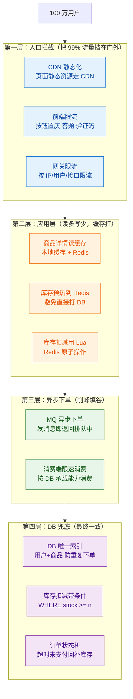
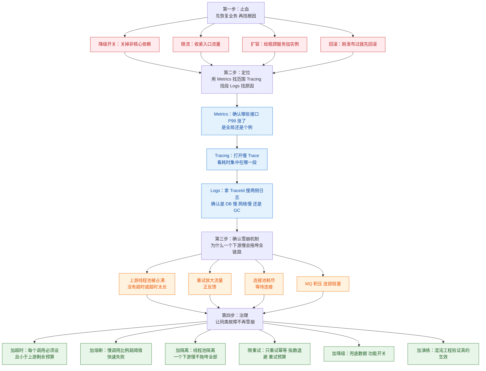
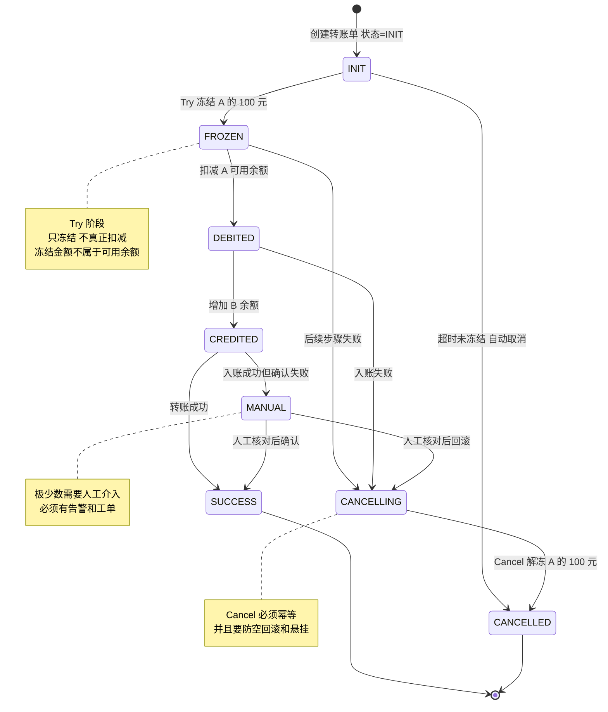

# 🎯 九、分布式面试高频题

> 本篇是**面试冲刺用的收口篇**，定位是「**速答骨架 + 深度指引**」：每题先给能当场说出口的 3~6 条得分骨架，再给一个面试官最可能追的深入问题，最后把追问引到本系列对应的深度笔记。
> 配合 [[面试准备/技术面试题库/09-分布式与微服务]]（基础骨架）一起用：**那篇负责"不漏点"，本篇负责"讲得出深度、扛得住追问"**。返回 [[0-分布式总览]]。

---

## 〇、怎么用这篇

| 阶段 | 用法 |
|---|---|
| **面试前 3 天** | 只看「一、十大必答题」的**得分骨架**，确保每题都能开口 |
| **面试前 1 天** | 看「三、易错陷阱 TOP 12」，把踩坑说法戒掉 |
| **面试前 30 分钟** | 只看「五、10 分钟速记卡」 |
| **面试中被追问** | 按骨架里的「→ 深度笔记」链接现场回忆 |

> [!important] 一条心法
> 分布式题的**加分点从来不是"知道几个方案"，而是"知道每个方案的代价，以及什么场景下不选它"**。
> 面试官问「怎么选」时，他想听的是**判断链路**（业务能不能接受最终一致 → 一致性要求多高 → 性能要求 → 团队能力），不是方案清单。
> **每答一个方案，主动补一句"它的代价是什么 / 什么时候不该用它"，这一句话就把你和背八股的人区分开了。**

---

## 一、十大必答题

### 1. CAP 与 BASE

**得分骨架**

1. **C**（一致性）指所有节点同一时刻看到同一份数据；**A**（可用性）指每个请求都能在有限时间内得到**非错误**响应；**P**（分区容错性）指网络分区时系统仍能继续运行。
2. **P 在分布式系统里不是"选项"，是"事实"** —— 只要跨网络、跨机房，分区一定会发生（网线、交换机、GC、超时）。所以真正的选择只有：分区发生时，**是拒绝服务保 C（CP），还是返回可能旧的数据保 A（AP）**。
3. **CP 的代价**：分区时少数派不可用，可能整个集群写不了、甚至读不了。代表：Zookeeper、etcd、Consul 默认模式、Nacos 持久化实例。**风险是"扩容和发布被冻结"**。
4. **AP 的代价**：分区时返回旧数据/旧列表。代表：Eureka、Nacos 临时实例、Cassandra、Redis 主从。**风险是"读到过期数据"**。
5. **选择依据是业务**：**注册中心、商品详情、Feed 流** → AP（短暂旧数据可接受，不可用不可接受）；**余额、库存扣减、分布式锁、选主** → CP（宁可拒绝也不能错）。
6. **BASE 是对 CAP 的工程妥协**：**B**asically **A**vailable（基本可用：降级、限流、延迟响应，而不是完全不可用）、**S**oft state（软状态：允许中间态存在）、**E**ventually consistent（最终一致）。**BASE 本质是"承认放弃强一致，换取可用性和性能，然后用补偿/对账把数据拉回一致"。**

**深入追问：既然 P 必须保，那"三选二"的说法错在哪？**

> [!example] 答案要点
> 「三选二」的表述预设了三个维度是**对等的、可以任意放弃一个**，但实际上：
> 1. **P 不能放弃** —— 放弃 P 意味着假设网络永远可靠，这在跨进程通信中不成立。真放弃了 P，你得到的是一个"网络一抖就整个不可用"的系统；
> 2. **C 和 A 也不是二选一那么简单** —— CAP 里的 C 是**线性一致性**（最强的一致性），这是一个极端的定义。现实中有**因果一致性、会话一致性、单调读**等中间态。比如 Nacos 的临时实例是 AP，但它提供的是**最终一致**而不是"不一致"；Redis 主从是 AP，但正常运行时延迟通常在毫秒级。
> 3. **所以准确的说法是**：分布式系统**必须容忍分区**，在分区**发生的那段时间里**，你只能在 C 和 A 之间取舍；分区没发生时，C 和 A 可以同时满足。这才是 CAP 的完整表述——**它是一个"分区期间的二选一"，不是"永久的三选二"**。
> 4. **实践中更常用的判断维度其实是 PACELC**：分区时在 C/A 之间选（PAC），**没有分区时在延迟 L 和一致性 C 之间选（ELC）**。后者对日常更有指导意义——比如"要不要为了强一致牺牲一次跨机房往返的延迟"。

→ 原理与一致性模型细节见 [[1-分布式理论基础]]

---

### 2. 分布式事务方案与选型

**得分骨架**

1. 先问一句：**"业务能接受最终一致吗？"** —— 这一问就能把方案范围砍掉一半。能接受 → 消息型/本地消息表/Saga；不能接受 → TCC/Seata AT（且要评估全局锁代价）。
2. **2PC/XA**：准备 + 提交两阶段，协调者统一决策。**强一致**，但**同步阻塞**（准备阶段资源被锁住）、**协调者单点**、**有"部分提交"的不一致窗口**（协调者提交阶段挂了，部分参与者已提交部分未提交）。适合**短事务、低并发、跨库但同构**的场景。
3. **TCC**：Try 预留资源 → Confirm 确认 → Cancel 释放。**性能好、不长时间持锁**，但**代码侵入极大**，必须处理**空回滚、悬挂、幂等**三件事。适合**资金/库存这类核心且能明确预留语义**的场景。
4. **Saga**：长事务拆成一串本地事务，每步配一个补偿动作。适合**长流程、跨多个服务、参与方多**（如订单履约）。**没有隔离性**，中间态对外可见，需要业务上做"状态机 + 允许中间态"的设计。
5. **消息型（本地消息表 / MQ 事务消息）**：本地事务和"发消息"绑在同一个原子操作里，保证**消息一定发出**，下游消费保证**最终一致**。**实现简单、可靠性高、是大多数业务的最优解**；代价是**只能保证最终一致**，且下游必须**幂等**。
6. **Seata AT**：自动生成 undo log，**业务无侵入**，通过**全局锁**保证写隔离。代价是**全局锁带来的性能损耗和热点竞争**，且对 SQL 有约束（必须有主键、不支持某些语法）。
7. **兜底永远要有对账**：任何最终一致方案都可能在极端情况下不一致（消息丢失、补偿失败、人工干预），**必须有一个定时对账 + 差异告警 + 人工/自动修复的机制**。**"没有对账的最终一致方案是不完整的"。**

**深入追问：你怎么在项目里做选型？**

> [!example] 答案要点
> 给出一个**决策链路**而不是清单：
> 1. **一致性强不强求？** 强一致（余额、账务）→ TCC/AT；最终一致（积分、通知、统计）→ 消息型；
> 2. **事务有多长？** 短事务（< 1s）→ 2PC/AT 可接受；长流程（分钟级、要等人审核）→ Saga；
> 3. **并发高不高？** 高并发热点（秒杀扣库存）→ **绝不能用全局锁**，用 TCC 预留 + 异步化，或者干脆把扣减收敛到一个服务用本地事务；
> 4. **团队维护能力？** TCC 的代码量和排查成本是消息型的数倍，团队没有成熟的事务框架和运维经验时，**优先消息型 + 对账**；
> 5. **能不能"消灭"分布式事务？** **最好的方案是不产生分布式事务** —— 把强一致的部分收敛进一个服务（如把"扣库存 + 建订单"放同一个库），跨服务的部分做成异步最终一致。**这是负责人视角最重要的一条：先想能不能不拆，再想怎么拆得好。**
> 6. **上线后的兜底**：无论选哪个，**幂等 + 对账 + 人工补偿入口**三件套必须有。

→ 方案对比、Seata 原理、失败场景见 [[2-分布式事务]]，角色专项见 [[面试准备/冠顿/04-事务一致性]]

---

### 3. TCC 的三个坑：空回滚、悬挂、幂等

**得分骨架**

1. **背景**：TCC 的 Try / Confirm / Cancel 是**三个独立的网络调用**，任何一个都可能超时、丢包、重试，所以它们的执行顺序、次数都**没有保证**。三个坑本质都是"**调用不可靠**"导致的。
2. **空回滚**：Try **没有执行**（比如 Try 的请求丢包了、或者 Try 超时被回滚了），但 Cancel **执行了**。Cancel 里如果做"把之前扣的加回去"，就会**凭空给用户加钱/加库存**。
   - **怎么发生的**：Try 请求超时 → 事务协调器认定失败 → 发起 Cancel；而 Try 请求可能只是慢，或者根本没到。
   - **解法**：Cancel 执行前**先查一下 Try 有没有执行过**（查事务控制表里有没有这条事务记录）；没有就直接返回成功，什么都不做。
3. **悬挂**：**空回滚之后，Try 才真正到达并执行**。结果是资源被 Try 占住了，但**再也没有 Cancel 来释放**（因为 Cancel 已经执行完了），资源永久泄漏。
   - **怎么发生的**：Try 请求在网络里延迟了很久，超时后协调器发了 Cancel（空回滚返回成功），然后那个迟到的 Try 才到。
   - **解法**：在事务控制表里**记录事务状态**。Cancel 执行时**插入一条"已回滚"的记录**；Try 执行前**先检查有没有"已回滚"记录**，有就**拒绝执行 Try**（直接返回失败或成功但不占资源）。
4. **幂等**：Confirm 和 Cancel 都可能被**重复调用**（重试机制、网络重发）。Confirm 重复执行会**重复加钱**，Cancel 重复执行会**重复退款**。
   - **解法**：事务控制表加**唯一索引**（事务 ID + 分支 ID），重复请求直接返回成功；或用 Redis 的 `SET NX` 做幂等标记。
5. **统一解法**：引入一张**事务控制表**（`tcc_transaction`，字段：`tx_id`、`branch_id`、`status`、`create_time`，`tx_id + branch_id` 建**唯一索引**），三个阶段的**第一步都是"查表 + 插入状态"**，用数据库的唯一约束来保证"**只有一个请求能真正推进状态机**"。
6. **一句话总结**：TCC 的难点**不在业务逻辑，在状态机**。如果不想写这个状态机，就别选 TCC。

**深入追问：Confirm 阶段失败了怎么办？**

> [!example] 答案要点
> 「Confirm 失败**不能回滚**（因为 Cancel 已经不可能了，部分分支已经确认），只能**重试**。所以：
> ① **Confirm 必须幂等**，允许无限重试；
> ② **重试要有上限 + 落库**，超过上限进入**人工处理队列并告警**；
> ③ **最终兜底是对账** —— 事务控制表里"长期处于 Try 成功但未 Confirm"的记录，定时任务捞出来重试或人工修复；
> ④ **业务上要尽量让 Confirm 不失败**：Confirm 阶段**不调用外部依赖、不做可能失败的校验**（这些校验放 Try），只做"把预留态改成确认态"这种**纯本地、必成功**的操作。**这是 TCC 设计的一条铁律：Try 做所有可能失败的事，Confirm/Cancel 只做必然成功的事。**
> 另外 Seata 的 TCC 模式提供了**自动重试 + 事务日志**，可以把这套状态机交给框架，但表结构和幂等还是要自己保证。」

→ 完整状态机与代码级细节见 [[2-分布式事务]]

---

### 4. Redis 分布式锁怎么实现才安全

**得分骨架**

1. **加锁必须原子**：用 `SET key value NX PX 30000` **一条命令**完成"判断不存在 + 设置 + 设过期"，**不能先 `SETNX` 再 `EXPIRE`**（两条命令之间进程挂了就死锁）。
2. **value 必须是唯一标识**（如 `UUID + 线程 ID`）：释放锁时**要校验这个 value 是不是自己的**，否则会**误删别人的锁**（场景：A 的锁超时自动释放，B 拿到了锁，A 执行完直接 `DEL`，把 B 的锁删了）。
3. **释放必须用 Lua 脚本**："比较 value + 删除"要**原子**完成。如果用 `GET` 然后 `IF` 然后 `DEL`，中间有窗口期，同样会误删。
4. **必须有续期机制（看门狗）**：业务执行时间可能超过锁的过期时间。Redisson 的看门狗默认**每 1/3 过期时间续一次**（默认锁 30s，每 10s 续一次），并且续期是在**独立的线程/定时任务**里做，业务线程完成后停止续期。
5. **锁过期时间要大于业务最大耗时**，但也不能太长（否则宕机后锁长期不释放）。**这是"安全"和"可用"的权衡点**。
6. **主从架构下会丢锁（最重要的坑）**：Redis 主从是**异步复制**。A 在 master 加锁成功 → **master 还没把数据同步到 slave 就宕机了** → slave 升主 → B 在新 master 上加锁**也成功** → **两个客户端同时持有锁**。
7. **解法**：
   - **RedLock**（向 N 个独立 Redis 节点加锁，过半成功才算成功）—— 但**争议很大**（Martin Kleppmann 与 antirez 的著名论战），对时钟漂移和 GC 停顿敏感，**生产上慎用**；
   - **更好的方向是把锁的"正确性"转移到下游**：用**数据库唯一约束 / 乐观锁版本号 / 状态机**做最终的防重兜底，把 Redis 锁当作**性能优化**而不是**正确性保证**；
   - 如果一定要强正确性，用 **Zookeeper（CP）或 etcd**，代价是性能和运维复杂度。

**深入追问：Redisson 的看门狗机制，如果客户端和 Redis 之间发生网络分区（脑裂）会怎样？**

> [!example] 答案要点
> 「这是**分布式锁最本质的难题，任何基于"超时"的锁都逃不掉**：
> 场景：客户端 A 拿到锁，正在执行业务。此时 A 与 Redis 之间网络分区（或 A 发生长时间 **Full GC / STW**）：
> ① A 以为锁还在，继续执行业务（**它无法感知锁已经丢了**）；
> ② Redis 侧锁到期自动释放；
> ③ B 请求加锁**成功**；
> ④ **A 和 B 同时认为自己持有锁**，并发操作同一份资源。
> **看门狗解决不了这个问题** —— 它的作用是"业务没做完就续期"，但如果 A 自己卡住了，续期线程同样卡住，锁照样过期。
> **正确的处理思路有三层**：
> ① **业务层兜底**：所有被锁保护的写操作**必须自身幂等或有条件更新**（`UPDATE ... WHERE version = ?` 或 `WHERE status = 'PENDING'`）。**只要下游能拒绝重复写，脑裂就不会造成数据错误，只会造成"一次无效操作"**。这是最可靠的一层；
> ② **用 fencing token（栅栏令牌）**：每次加锁返回一个**单调递增的版本号**，所有对被保护资源的写请求都要**带上这个版本号**，存储层**拒绝比已见过的更小的版本号**。这样即使 A 的锁过期了，它拿着旧 token 写也会被拒。**这是 Kleppmann 提出的方案，能真正解决脑裂**，但需要存储层配合（Redis 原生不支持，需要自己在业务里实现，或用 Zookeeper 的 `zxid`）；
> ③ **减少 lock 持有时长**：把锁保护的临界区做到最小（只保护"判断 + 更新"的原子部分），业务耗时操作放到锁外。**持有时长越短，脑裂窗口越小**。
> 所以我的结论是：**Redis 锁适合做"性能优化"（避免大量无效并发），不适合做"正确性保证"。正确性必须落到数据库的唯一约束或条件更新上。** 这也是我在项目里的实际做法。」

→ 完整实现、RedLock 论战、锁续期细节见 [[3-分布式锁]]，幂等设计见 vault 内 `幂等.excalidraw`

---

### 5. 分布式锁 Redis vs Zookeeper 怎么选

**得分骨架**

1. **一致性模型不同**：Redis 主从**异步复制**，是 **AP** —— 极端情况下会丢锁（脑裂）；Zookeeper 用 **ZAB 协议**，写需要**过半确认**，是 **CP** —— **正常情况下不会丢锁**。
2. **性能差距明显**：Redis 内存操作 + 单命令，**吞吐高、加锁解锁延迟低**；ZK 的加锁要**创建临时顺序节点 + 判断是否最小 + Watch 前一个节点**，涉及多次网络往返和磁盘写入，**吞吐明显低于 Redis**。
3. **锁释放的可靠性**：ZK 用**临时顺序节点**，客户端会话断开（进程崩溃/网络断开）后**节点自动删除，锁自动释放**，不需要过期时间 —— **这是 ZK 的一个明显优势，天然避免"锁不释放"和"业务超时"的两难**。Redis 靠**过期时间**，业务超时和锁提前释放是永恒的矛盾。
4. **公平性**：ZK 的临时顺序节点**天然是公平锁**（按创建顺序排队，先到先得），还能实现**读写锁**、**可重入**；Redis 默认**非公平**（谁抢到算谁的），虽然 Redisson 实现了公平锁但要额外开销。
5. **运维与生态**：Redis 通常项目里**本来就有**（做缓存、做限流），复用它做锁**零新增组件**；ZK 是**额外一套集群**，运维成本高，且现在新项目用 ZK 的越来越少（被 Nacos/etcd 替代）。
6. **选型结论**：
   - **绝大多数场景选 Redis（Redisson）** —— 性能好、组件已有、够用。**前提是接受"极端情况可能丢锁"，并用数据库唯一约束/乐观锁做兜底**；
   - **对正确性要求极高、且无法在业务层兜底**时选 ZK/etcd —— 典型如**选主（leader election）**、**全局序列号**、**元数据变更**；
   - **不选 RedLock**（除非你非常清楚它的争议和适用条件）。

**深入追问：ZK 的锁真的一定安全吗？**

> [!example] 答案要点
> 「不是绝对的，有两个需要注意的点：
> ① **ZK 的会话超时也可能误判**：客户端发生长时间 Full GC，超过了 `sessionTimeout`，ZK 认为它死了、删除了临时节点、把锁给了别人；GC 结束后这个客户端**还以为自己持有锁**。这和 Redis 的惊群是同一类问题 —— **本质是"进程暂停导致的过期"**。解法同样是**fencing token**：用 ZK 的 `zxid` 或自己维护一个单调递增版本号，让存储层拒绝旧版本。**ZK 的 `zxid` 是全局单调递增的，天然适合做 fencing token，这是它比 Redis 强的地方。**
> ② **ZK 集群不可用时，锁服务整体不可用**：ZK 是 CP，分区时少数派拒绝服务。如果锁是核心链路的强依赖，ZK 不可用会导致业务不可用。**这是 CP 的固有代价。**
> 所以准确结论是：**ZK 排除了"复制延迟丢锁"，但没有排除"进程暂停丢锁"；Redis 两个风险都有。真正的正确性永远要靠存储层的条件更新来兜底，而不是靠锁本身。**」

→ 详见 [[3-分布式锁]]

---

### 6. 雪花算法原理与时钟回拨

**得分骨架**

1. **64 位结构**：1 位符号位（恒为 0，保证正数）+ **41 位时间戳**（毫秒，可用约 **69 年**）+ **10 位机器 ID**（1024 个节点）+ **12 位序列号**（同一毫秒内 4096 个 ID）。
2. **趋势递增**：高位是时间戳，所以生成的 ID **整体随时间递增**，对 MySQL 的 **InnoDB 聚簇索引非常友好**（避免页分裂和随机 IO）—— **这是它比 UUID 强的核心原因**。
3. **本地生成、无网络开销**：性能极高（单机每秒几十万），不依赖任何中心服务，**没有单点和网络故障问题**。
4. **单机每毫秒的上限**是 4096 个 ID（12 位序列号）。超出则**阻塞到下一毫秒**，所以理论单机上限约 **409.6 万 QPS**（4096 × 1000）。注意这只是理论值，实际受时钟精度和系统调用影响。
5. **时钟回拨是最大的坑**：机器的时钟被 NTP 校准或手动调整导致**时间倒退**，此时生成的时间戳可能**重复**，导致 ID 重复。
6. **回拨的处理方式**：
   - **等待追平**：回拨幅度小（如几毫秒）就 `sleep` 等到时间追上再生成。**最常用**；
   - **抛异常 + 报警**：回拨幅度大（如几秒）说明有问题，**宁可拒绝服务也不能发重复 ID**，同时告警让人介入；
   - **备用机器 ID**：预留一批 workerId，检测到回拨就切换到备用 ID。**实现复杂，且要保证 ID 不与旧数据冲突**；
   - **用扩展位记录回拨次数 / 用历史时间戳的备用序列**。
7. **生产建议**：用**美团 Leaf** 这类成熟方案（Leaf-segment 号段模式 / Leaf-snowflake 带 ZooKeeper 协调 workerId），或者**用数据库号段模式替代雪花**（不依赖时钟，代价是需要一次 DB 往返，但可以批量取段）。

**深入追问：41 位时间戳能用多久？如果公司要活 100 年怎么办？**

> [!example] 答案要点
> 「**41 位毫秒时间戳的容量是 2^41 毫秒 ≈ 2.199 × 10^12 毫秒 ≈ 69.7 年**。如果从**当前时间**开始用（而不是从 1970 年开始），那么可以用到大约 2090 年前后。
> 关键实现细节是：**不要直接用 Unix 时间戳（1970 起算），而是用一个自定义的起始纪元（epoch）** —— 比如把雪花算法上线的那一天（或者某个约定的日期）作为 0 点。这样 41 位就能覆盖 69 年，足够任何公司。
> 如果真要考虑更长期限，有几个方向：
> ① **缩减机器 ID 位数**：10 位机器 ID 支持 1024 节点，很多公司根本用不到，可以压到 5~6 位，多出的 4~5 位给时间戳 —— 但这样时间戳位数变了，**新旧 ID 的长度和解析规则不一致，迁移时非常麻烦**；
> ② **改用号段模式（Leaf-segment）**：从数据库批量取 ID 段，**完全不依赖时钟**，ID 是纯递增的数字，可以做到无限期。代价是**强依赖数据库**（虽然可以双 buffer 预取降低延迟）；
> ③ **接受"够用就行"**：69 年在工程上已经足够 —— 更现实的问题是**系统能不能活 10 年**。**过度设计时间戳宽度，不如把 ID 的迁移方案设计好**（比如预留一位标识"算法版本"，将来换算法时新旧 ID 能共存）。
> 我的实际建议是：**用自定义 epoch + 10 位机器 ID 的标准雪花，同时保证 ID 的解析逻辑不写死在业务代码里**，将来真要换，靠版本位或路由规则平滑过渡。」

→ 见 [[4-分布式ID与雪花算法]]

---

### 7. 一致性哈希与虚拟节点

**得分骨架**

1. **要解决的问题**：普通取模哈希 `hash(key) % N`，当节点数 N 变化时（扩容/缩容），**几乎所有 key 的归属都会改变**，导致缓存**大范围失效**（缓存雪崩）。
2. **一致性哈希的原理**：把哈希空间组织成一个**环**（0 ~ 2^32-1），节点和 key 都映射到环上，**key 顺时针找到的第一个节点就是它的归属**。
3. **迁移量大幅减少**：节点从 N 变到 N+1 时，**只有落在被移除/新增节点区间上的 key 需要迁移**，理论上平均只有 **1/N 的 key 需要迁移**（而不是取模的几乎全部）。
4. **数据倾斜问题**：节点少的时候，节点在环上分布不均，会导致**某些节点承载绝大部分 key**（甚至一个节点扛 80%）。
5. **虚拟节点解决倾斜**：给每个物理节点分配**大量虚拟节点**（如 150~200 个）映射到环上，key 找到虚拟节点后再映射回物理节点。**虚拟节点越多，分布越均匀**（标准差越小），但**内存开销和查找开销也越大**（通常用 TreeMap 的 `ceilingEntry` 做 O(log n) 查找）。
6. **虚拟节点的第二个好处**：**加权**。性能好的机器分配更多虚拟节点，自然分到更多流量。
7. **注意区分**：**Redis Cluster 用的不是一致性哈希**，而是**哈希槽（16384 个 slot）**。槽的好处是**迁移粒度可控**（以槽为单位搬迁）、**归属关系可以集中管理**（cluster 元数据）、**扩缩容时槽的分配可以人工干预**（避免自动均衡导致的倾斜）。

**深入追问：一致性哈希的"雪崩"和"数据倾斜"是不是一回事？怎么一起解决？**

> [!example] 答案要点
> 「**不是一回事，但相关，要分开治**：
> ① **雪崩（迁移量）问题**：是**节点数变化时迁移的 key 太多**的问题。一致性哈希把迁移量从"几乎全部"降到"约 1/N"，这是**算法本身**解决的；
> ② **倾斜（负载不均）问题**：是**静态分布**的问题 —— 即使节点数不变，环上分布不均也会让某些节点过热。这是**虚拟节点**解决的；
> ③ **但虚拟节点解决不了的**：**热点 key 问题**。如果一个 key（比如某个爆款商品的缓存）本身访问量占全站 30%，无论怎么分布，它都落在一个节点上，**那个节点就是热点**。这时候虚拟节点完全无效 —— 解法是**热点探测 + 本地缓存 + key 打散（把这个 key 复制成 N 份副本，随机读其中一份）**。
> ④ **另一个坑：虚拟节点 + 缓存穿透的组合**。如果某个虚拟节点对应的物理节点挂了，它承载的所有 key 会**同时转移到下一个节点**（顺时针的下一跳），导致**下一个节点被打挂**（类似连锁反应）。所以节点故障时的**熔断和限流**同样必要，不能只靠哈希算法。
> ⑤ **对比 Redis Cluster**：Redis Cluster 的槽机制在**迁移粒度**上更优（1/16384 vs 1/N），而且**槽的归属由集群元数据统一管理**，不会出现"节点挂了 key 自动跑到下一个节点导致连锁雪崩"的情况 —— **槽是显式分配的，不是自动找下一个**。**这是槽比一致性哈希更适合做分布式缓存的一个关键原因。**
> **所以我在实际选型里**：做客户端分片（如 ShardingSphere 分库分表、本地缓存路由）用一致性哈希 + 大量虚拟节点；用 Redis 做分布式缓存时直接用 Redis Cluster 的槽（或者用 codis/代理层），**不自己实现一致性哈希**。」

→ 见 [[5-一致性哈希与负载均衡]]

---

### 8. 如何保证缓存与 DB 一致

**得分骨架**

1. **先说结论**：**缓存和 DB 的强一致做不到，只能做到最终一致**，而且要接受一个**短暂的不一致窗口**。任何声称"完全保证一致"的方案都是在骗人（除非用分布式锁串行化所有读写，性能不可接受）。**主动说出这句话，比背方案更有价值。**
2. **为什么"先更新 DB 再更新缓存"不行**：两个并发写请求 A、B，可能 A 先更新 DB，B 后更新 DB（B 的值是新的），但**B 先更新缓存、A 后更新缓存**，导致**缓存里是 A 的旧值，DB 里是 B 的新值 —— 永久不一致**。
3. **为什么"先删缓存再更新 DB"也不行**：删完缓存后、更新 DB 前，来了一个读请求，**读到的还是 DB 的旧值并写回缓存**，然后 DB 才更新 —— **缓存里是旧值，永久不一致**。
4. **推荐方案：Cache-Aside（先更新 DB，再删除缓存）**。这个方案出问题的概率**极低**，因为它要求"读请求恰好在'更新 DB'之后、'删除缓存'之前完成整个读流程"，而**写操作通常比读操作慢**（读快于写的话，这个窗口几乎不会出现）。这是**业界最主流、性价比最高**的方案。
5. **延迟双删**：更新 DB 前后各删一次缓存，第二次**延迟几百毫秒**（延迟时间要大于"一次读请求 + 写回缓存"的耗时）。目的是清掉那个窗口期内被写回的旧值。**注意：延迟双删只是"降低概率"，不能"完全保证"，而且延迟时间难以精确设定，还有第二次删除失败的风险。**
6. **更强的方案：订阅 binlog（Canal / Debezium）+ MQ 异步删缓存**。DB 的变更**以 binlog 为准**，通过 Canal 解析后投递到 MQ，消费者删除缓存。优点是**业务代码零侵入、顺序有保证（binlog 是有序的）、可靠性高（可重放）**；代价是**引入 Canal + MQ，链路变长，有延迟（通常几十到几百毫秒）**。
7. **兜底永远要有**：**缓存设置过期时间**（比如 5 分钟），即使出现不一致，**最坏情况也只是脏几分钟**——这是最简单、最有效的兜底手段，**任何方案都必须配上**。

**深入追问：如果缓存删除失败了怎么办？**

> [!example] 答案要点
> 「这是 Cache-Aside 方案里最现实的漏洞 —— 更新 DB 成功，但删缓存失败（网络抖动、Redis 短暂不可用）。此时缓存里是旧值且**会一直存在（如果没有过期时间）**。三层处理：
> ① **必配过期时间**：这是最关键的兜底。TTL 让不一致**有时间上界**，代价是"最多脏 N 分钟"。**没有 TTL 的缓存是定时炸弹。**
> ② **删除重试**：删除失败后把"待删除的 key"投递到**MQ 或本地重试队列**，异步重试。注意重试要**幂等**（删除天然幂等）、**有上限**、**超过上限要告警**。
> ③ **binlog 订阅兜底（最可靠）**：这也是我推荐 Canal 的原因 —— **缓存的失效不依赖业务代码的删除是否成功，而是依赖 binlog 这个"唯一真相源"**。DB 只要变更成功，binlog 就一定有记录，Canal 一定能读到，最终一定能删掉缓存。**这把"删除可靠性"从"业务代码级别的 try-catch"提升到了"数据层面的保证"。**
> ④ **更进一步：读写分离场景要特别注意**。如果读请求走从库，而主从复制有延迟，那么"更新主库 → 删缓存 → 读请求走从库拿到旧值 → 写回缓存"会**无限延续旧值**。所以**缓存回填时应该读主库，或者对一致性敏感的 key 强制走主库**。
> 一句话总结：**Cache-Aside + TTL 是底线，延迟双删是优化，binlog 订阅是工程上最可靠的方案，而对账/巡检是最后的兜底。**」

→ 见 [[6-缓存一致性与高可用]]

---

### 9. 缓存穿透 / 击穿 / 雪崩

**得分骨架**

1. **先分清三者的定义（面试官最在意这个）**：
   - **穿透**：查询的 key **在缓存和 DB 里都不存在**。每次请求都绕过缓存打到 DB。**本质是"查不存在的数据"**；
   - **击穿**：**单个热点 key 过期**的瞬间，大量并发请求同时打到 DB。**本质是"一个 key 的重建风暴"**；
   - **雪崩**：**大量 key 同时过期**，或者**缓存服务整体不可用**，流量全部涌向 DB。**本质是"大规模缓存失效"**。
2. **穿透的解法**：
   - **缓存空值**：即使 DB 查不到，也缓存一个空值（设一个**较短的 TTL**，如 30s~5min）。**要注意：TTL 太短没效果，太长会阻碍"数据后来真的被创建了"的场景**；
   - **布隆过滤器**：把所有存在的 key 先加载进布隆过滤器，查询前先过一遍，**不存在直接返回**。空间效率极高（用位数组），但有**误判率**（说存在的可能不存在，说不存在的一定不存在）—— **这个特性正好适合做前置拦截**；
   - **参数校验**：非法 ID（负数、超长、格式错误）直接拒绝，**这是最便宜的一层，但经常被忽略**；
   - **限流 + 黑名单**：对恶意扫描的 IP/用户限流。
3. **击穿的解法**：
   - **互斥锁（分布式锁）**：只让一个请求去重建缓存，其他请求等待或返回降级值。**代价是等待期间响应变慢，而且锁本身有故障风险**；
   - **逻辑过期**：缓存里**不设 TTL，而是存一个逻辑过期时间字段**。读到时如果发现逻辑过期，**返回旧值的同时异步去刷新缓存**。**优点：永不阻塞、可用性极高；缺点：会返回一段时间的旧数据**（这是典型的 AP 选择）；
   - **热点 key 永不过期**：靠后台定时任务主动更新。
4. **雪崩的解法**：
   - **TTL 加随机值**：给过期时间加一个随机扰动（如 `base + random(0, 300s)`），**避免同一时刻批量过期**。**这是最简单有效的一条**；
   - **多级缓存**：本地缓存（Caffeine）+ Redis，Redis 挂了还有本地缓存兜底；
   - **缓存预热**：系统启动/大促前主动加载热点数据，**避免冷启动时全部穿透**；
   - **熔断降级**：DB 前面加熔断，超过阈值直接返回降级结果（**保护 DB 不被彻底打挂**）——**注意这里的重点是"保 DB"，DB 挂了就不是慢的问题，是整个系统不可用**；
   - **Redis 集群 + 主从 + 哨兵**做高可用，避免 Redis 本身成为单点。
5. **面试要讲透的一句话**：**这三个问题的共同本质是"缓存失效时，流量穿透到了 DB"，但失效的"范围"和"原因"不同 —— 穿透是"数据不存在"，击穿是"单个热点过期"，雪崩是"大面积失效"。所以解法也必须对症：穿透靠"拦"，击穿靠"挡"，雪崩靠"分散 + 兜底"。**

**深入追问：布隆过滤器能删除元素吗？**

> [!example] 答案要点
> 「**标准布隆过滤器不支持删除**。原因是：一个元素会映射到多个位（k 个哈希函数），**多个元素可能共享某些位**。如果删除元素 A 时把它的位清零，**可能把元素 B 依赖的位也清了**，导致 B 被误判为"不存在"—— 而布隆过滤器的保证是"**说不存在的一定不存在**"，这个保证被破坏了，就会出现"数据明明在 DB 里，却被过滤器拦掉了"的严重错误。
> 想支持删除有几个方案：
> ① **计数布隆过滤器（Counting Bloom Filter）**：把每个位换成一个**计数器**，插入时加一、删除时减一，计数器为 0 才表示不存在。代价是**空间膨胀数倍**（原来是 1 bit，现在是 4 bit 或更多），而且计数器溢出、并发更新需要额外处理；
> ② **Cuckoo Filter（布谷鸟过滤器）**：存指纹而不是位，**支持删除**，空间效率也不错，且查询性能通常更好。是布隆过滤器的现代替代品；
> ③ **定期重建**：不接受删除，**定时全量重建布隆过滤器**（比如每天凌晨从 DB 重新加载）。**这是工程上最常用的做法** —— 因为布隆过滤器保护的通常是"商品 ID 是否存在"这类**变更不频繁**的数据集合，每天重建一次完全可接受。重建时用**双缓冲**（一份在用、一份在构建，构建完原子切换）避免服务中断。
> 补充一个实战细节：**布隆过滤器理论上应该用 Redis 的 bitmap 实现（多实例共享），而不是放本地内存** —— 否则每个实例的过滤器状态不一致，且重启后要重新加载。Redis 有 `RedisBloom` 模块，或者用 Guava 的 `BloomFilter` + 定时重建 + 本地内存（适合单机或数据量小的场景）。」

→ 见 [[6-缓存一致性与高可用]]，限流熔断见 [[7-限流熔断降级]]

---

### 10. 服务雪崩怎么防

**得分骨架**

1. **先定义清楚**：**服务雪崩**是一条链路上某个下游服务变慢或不可用，导致**上游的线程/连接被占满**，进而上游也不可用，**故障沿着调用链逐级向上传播，最终整条链路甚至整个系统崩溃**。**核心机制是"资源耗尽"而不是"错误传播"。**
2. **防御是一个组合拳，不是单一手段，按"事前 / 事中 / 事后"分**：
3. **事前：**
   - **限流**：控制入口流量，别让系统过载。算法见下表（四算法），落在网关/服务/接口三层；
   - **超时**：**每个 RPC/HTTP 调用都必须设置超时**，而且**超时要短**（如 200ms~1s）。**没有超时的调用是雪崩的头号元凶** —— 一个慢下游会让上游线程全部挂起；
   - **重试要克制**：重试会**放大流量**（下游已经慢了，你再重试 3 次，等于给它 4 倍压力）。**只重试幂等请求、限制重试次数（1~2 次）、用指数退避 + 抖动、并且要设重试预算（retry budget，如不超过总请求的 10%）**；
   - **隔离**：线程池隔离（每个下游一个独立线程池，"一个下游慢不拖垮全部"）或信号量隔离（更轻量，但不支持异步和超时）；
   - **扩容 + 容量规划**：按峰值 + buffer 规划，别卡着水位跑。
4. **事中：**
   - **熔断**：当下游错误率/慢调用比例超阈值时**快速失败**，不再调用下游。三态：**关闭（正常放行）→ 打开（直接失败，走降级）→ 半开（放少量请求试探，成功则关闭，失败则继续打开）**。**熔断的价值是"给下游恢复的时间"，避免持续打垮它**；
   - **降级**：**兜底返回**。返回缓存数据、默认值、推荐兜底、静态页；或者**关掉非核心功能**（如"猜你喜欢"、"评价列表"），保证**核心链路（下单、支付）可用**。**降级要有开关，能手动触发，且事前演练过**；
   - **舱壁模式（Bulkhead）**：按调用方/业务线隔离资源，一个业务把资源耗尽不影响其他业务。
5. **事后：**
   - **快速失败 + 兜底数据**，保证用户看到的是"可用的降级页"而不是"白页/超时"；
   - **故障演练**（混沌工程）：定期注入延迟/错误，验证熔断降级是否真的生效。**没演练过的降级方案，真出事时大概率不生效。**
6. **区分两个最容易混的概念**：
   - **限流是"防别人打挂我"**（保护自身，控制入口流量）；
   - **熔断是"防我被打挂"**（保护自身不被下游拖垮，快速失败）；
   - **降级是"打挂了以后怎么办"**（提供兜底能力）。
   **很多人把限流和熔断混为一谈，这两个的防护对象和触发条件完全不同。**

**深入追问：重试能提高可用性，为什么你说要克制？**

> [!example] 答案要点
> 「**重试在"偶发单点失败"场景能提高可用性，在"下游过载"场景会直接引发雪崩** —— 关键是区分这两种情况：
> ① **偶发失败**（单个实例网络抖动、一次 GC）：重试有效，换个实例就好了；
> ② **下游过载**（下游处理不过来了，RT 从 50ms 涨到 2s）：**重试是灾难** —— 下游已经满负荷，你的重试等于**给它叠加 2~3 倍流量**，让它更慢，上游超时更多，重试更多，**形成正反馈直到整个链路崩溃**。这就是所谓的**重试风暴（retry storm）**。
> 我见过的真实事故模式：客户端超时 1s、重试 3 次 → 下游 RT 涨到 1.2s → 全部超时 → 重试流量 ×4 → 下游彻底打挂 → 上游线程池占满 → 雪崩。
> **所以重试必须配四道约束**：
> ① **只重试安全/幂等的请求**（GET、查询），写操作重试必须有幂等保证；
> ② **限制次数**（1~2 次足够，不要 3 次以上）；
> ③ **指数退避 + 随机抖动（jitter）** —— 让重试请求在时间上分散，避免"同一时刻的失败请求同时重试"造成脉冲；
> ④ **重试预算（retry budget）** —— 整个系统里重试流量不超过总流量的某个比例（如 10%），**这是一个全局刹车**，很多成熟框架（Envoy、gRPC）都支持。
> ⑤ **配合熔断**：如果熔断器打开了，**重试应该在客户端直接被拦截**（不再发出去），这样重试不会绕过熔断保护。
> 一句话：**重试是"用流量换成功率"的交易，在系统有余量时划算，在系统过载时是自杀。判断标准是"下游是偶发失败还是系统性过载"。**」

**限流四算法与熔断三态速查**

| 算法 | 原理 | 优点 | 缺点 |
|---|---|---|---|
| **固定窗口** | 每 N 秒一个计数器，超阈值拒绝 | 实现最简单、内存小 | **临界问题**：两个窗口交界处可能放行 2 倍流量 |
| **滑动窗口** | 把窗口切时间片，滚动统计 | 解决临界问题，较平滑 | 需要存时间片，精度受片数影响 |
| **漏桶** | 请求入桶，**恒定速率**流出 | **绝对平滑**，强制削峰 | **不允许突发**，桶满即拒绝，突发流量被浪费 |
| **令牌桶** | 恒定速率放令牌，请求拿令牌 | **允许一定突发**（桶里攒了令牌），实现简单 | 需注意桶容量设置（太大则失去限流意义） |

| 熔断状态 | 行为 | 进入条件 | 退出 |
|---|---|---|---|
| **关闭（Closed）** | 正常放行，统计错误率 | 初始状态 / 半开成功 | — |
| **打开（Open）** | **直接拒绝**，走降级，不调用下游 | 错误率/慢调用比例超阈值 | 经过一个**熔断时长**（如 10s）后进入半开 |
| **半开（Half-Open）** | **放少量请求试探** | 熔断时长到期 | 试探成功率达阈值 → 关闭；否则 → 回到打开 |

→ 见 [[7-限流熔断降级]]，网关层限流见 [[8-微服务架构与注册配置中心]]

---

### 11. 注册中心选型与优雅下线（加分题）

**得分骨架**

1. **注册中心的四大职责**：服务注册、健康检查、服务发现、**变更推送**。本质是一个**带健康检查的高可用分布式 KV + 变更通知**，特点是**读多写极少、容忍短暂不一致** —— 所以 **AP 天然适合注册中心**。
2. **Nacos 的杀手锏是双模式**：**临时实例走 AP（Distro 协议，客户端心跳）**，**持久化实例走 CP（Raft，服务端主动探测）**，让每个服务自己选。Eureka 只有 AP、只有客户端心跳；ZK 是纯 CP。
3. **ZK 做注册中心的风险**：网络分区时不足半数就**整个不可用**，会**冻结扩容和发布**（新实例注册不进来）；而且 **Session 超时会误摘健康实例**，抖动一批就批量消失，**没有推空保护的话消费者拉到空列表直接全挂**。
4. **推 vs 拉**：纯轮询延迟大（默认几十秒）、纯推送可能丢、**长轮询兼顾实时性和服务端压力**、**Nacos 用 UDP 推送 + 长轮询兜底**。**推送延迟是发布速度的实际控制参数**。
5. **优雅下线三步**：**先摘流量 → 等在途请求完成 → 再停服**。具体：SIGTERM 后**主动反注册**（别等心跳超时 15~30s）→ **sleep 5~10s** 等推送传播 → `server.shutdown=graceful` 排空在途请求。
6. **K8s 配合**：`preStop: sleep 10`（**在 SIGTERM 之前执行**）+ `readinessProbe` 摘 Endpoints，且 **`terminationGracePeriodSeconds` 必须大于整个流程耗时**，否则被 SIGKILL 打断。**注意 `preStop` 不等于应用优雅停机，两者都要配。**
7. **上线侧同样重要**：**延迟注册**（等依赖就绪、缓存预热完成再注册），否则新实例第一批流量必挂。

**深入追问：健康检查怎么发现"实例假死"？**

> [!example] 答案要点
> 「**假死 = 进程活着、心跳正常、端口能连，但业务请求全部超时**。典型原因是 Tomcat 线程池被慢下游占满，或者长时间 Full GC。
> **为什么常规手段发现不了**：
> ① **客户端心跳**只证明"进程还在跑"，跟业务能力无关；
> ② **TCP 探测**只证明"内核能握手"，TCP 三次握手在内核完成，**应用根本没参与**；
> ③ **简单的 HTTP 探针**如果只是 `return "ok"`，同样是自欺欺人。
> **正确的做法是业务探针，但要非常小心**：探针里检查**自身状态** —— 线程池活跃度（>90% 返回 503）、是否有长时间 STW、本地队列积压深度。
> **但绝对不能**在探针里检查下游依赖（DB、Redis 连通性）—— 那样**下游一挂，所有实例同时不健康、全量摘除，把一个下游故障放大成全站不可用**。这是探针最常见的自伤方式。
> **更根本的解法不是探针，而是两头治理**：
> ① **别让线程被占住** —— 下游调用必须设短超时（200ms 级）+ 熔断 + 线程池隔离，这样慢下游不会耗尽线程；
> ② **快速失败** —— 熔断打开后直接返回降级，不占线程。
> **我的观点是：业务探针是"最后一道保险"，不是"主要手段"。真正解决假死要靠超时、熔断、隔离这套组合拳 —— 让系统在压力下不产生假死，比事后检测假死更重要。**」

→ 见 [[8-微服务架构与注册配置中心]]

---

## 二、快问快答表

| # | 问题 | 一句话答案 |
|---|---|---|
| 1 | **2PC 为什么阻塞** | 准备阶段参与者**锁定资源**（DB 行锁/表锁），必须等协调者的最终决定才能释放，**期间其他事务无法访问这些资源** |
| 2 | **3PC 解决 2PC 的阻塞了吗** | **没真正解决**。3PC 加了"预询问（CanCommit）"和参与者超时机制，降低了协调者单点故障导致的**参与者长期阻塞**，但**数据不一致窗口依然存在**（分区时仍可能部分提交），而且**多一轮网络往返，性能更差**，实际很少用 |
| 3 | **Seata AT 的全局锁是什么** | 写操作前向 TC **申请该行的全局锁**，保证**跨服务的写隔离**（别的全局事务不能同时改这一行）；**本地事务提交后不立刻释放，要等全局事务结束**，所以是性能瓶颈所在 |
| 4 | **Saga 有隔离性吗** | **没有**。中间态对外可见（比如"已扣款未发货"），业务必须能容忍中间态；要隔离性得靠**语义锁**（业务字段标记状态）或**状态机约束**自行实现 |
| 5 | **本地消息表为什么可靠** | 因为它把「**业务写入**」和「**消息记录写入**」放在**同一个数据库的同一个本地事务**里 —— **要么都成功要么都失败**，不存在"业务成功但消息没发"的情况；然后由**定时任务/异步线程**扫表投递，失败就重试，直到成功 |
| 6 | **MQ 事务消息为什么要回查** | 生产者发半消息成功后、本地事务执行完之前**进程挂了**，Broker 不知道本地事务到底成没成。所以 Broker 要**定期回查生产者**（查本地事务状态表），据此决定**提交还是回滚**半消息 |
| 7 | **幂等与防重是一回事吗** | **不是**。**防重是"不让它发生"**（如前端置灰、分布式锁、唯一索引拦截），是**事前**；**幂等是"重复发生了也不出错"**（如状态机判断、`INSERT IGNORE`），是**事后兜底**。正确做法是**两者都要**：防重降低概率，幂等保证正确性 |
| 8 | **雪花算法 41 位能用多久** | 41 位毫秒 ≈ **69.7 年**。**关键是别用 1970 做起点**，用自定义 epoch（上线日），否则已经用掉了 50 多年 |
| 9 | **UUID 为什么不适合做主键** | ① **无序**——InnoDB 聚簇索引按主键组织数据，随机主键会导致**频繁页分裂和随机 IO**，插入性能急剧下降；② **占空间**（36 字符 vs 8 字节 bigint），二级索引都要存主键，**空间放大明显**；③ 可读性差、无法从 ID 看出时间顺序 |
| 10 | **号段模式的优点** | **一次取一批**（如 1000 个）缓存在内存，**ID 纯递增、无时钟依赖、DB 压力极小**（每 1000 次才访问一次 DB）；配合**双 buffer 预取**，可以做到取号几乎无延迟 |
| 11 | **一致性哈希的数据倾斜怎么解** | **引入虚拟节点**。每个物理节点映射成上百个虚拟节点散布在环上，key 命中虚拟节点后回落到物理节点。虚拟节点越多分布越均匀，但内存和查找开销越大 |
| 12 | **Redis Cluster 是一致性哈希吗** | **不是**。它用 **16384 个哈希槽**，key 经 CRC16 取模落到某个槽，槽的归属由**集群元数据集中管理**。好处：迁移粒度可控、槽归属可人工干预、**节点故障不会自动把 key 甩给下一个节点造成连锁雪崩** |
| 13 | **布隆过滤器能删元素吗** | **标准布隆过滤器不能**（删除会清掉其他元素共享的位，破坏"说不存在的一定不存在"的保证）。方案：**计数布隆过滤器**、**Cuckoo Filter**，或**定期全量重建（最常用）** |
| 14 | **逻辑过期 vs 互斥锁** | **逻辑过期**：返回旧值 + 异步刷新，**永不阻塞、可用性高**，但会返回一段时间的旧数据（AP 取舍）；**互斥锁**：只让一个请求重建，**数据新鲜**，但其他请求要**等待或降级**，且锁本身可能出故障 |
| 15 | **延迟双删的局限** | ① **延迟时间无法精确设定**（取决于读请求耗时，是个经验值）；② **只降低概率，不能完全保证**；③ **第二次删除可能失败**；④ 读写分离场景下从库延迟会让旧值被反复写回。**必须配 TTL 兜底** |
| 16 | **缓存预热怎么做** | 系统启动或大促前，**主动把热点数据加载进缓存**。做法：① 启动时跑一个预热任务；② 定时任务定期刷新热点；③ 基于历史访问日志统计 topN key 提前加载。**避免冷启动时全部穿透到 DB** |
| 17 | **热 key 怎么处理** | ① **本地缓存**（Caffeine，把热 key 前移到 JVM，连 Redis 都不用走）；② **key 打散**（复制成 N 份副本 `key_1..key_N`，随机读一份，分摊到多个 Redis 节点）；③ **读写分离 + 多级缓存**；④ **热点探测**（如京东 hotkey、Sentinel 的热点参数限流） |
| 18 | **大 key 怎么处理** | **危害**：单次操作耗时长、**阻塞 Redis 单线程**、网络传输大、删除时可能阻塞。**处理**：① **拆分**（大 Hash 拆成多个小 Hash、大 List 分段）；② **压缩**（gzip 后存）；③ **删除用 `UNLINK` 或 `SCAN` 分批删**，不要直接 `DEL`；④ 监控单 key 的 size，超过阈值告警 |
| 19 | **限流四算法** | **固定窗口**（简单，有临界问题）、**滑动窗口**（解决临界，需存时间片）、**漏桶**（恒定流出，强制削峰，不允许突发）、**令牌桶**（恒定放令牌，**允许突发**，Sentinel/Guava 常用） |
| 20 | **熔断三态** | **关闭**（正常放行、统计指标）→ **打开**（直接拒绝、走降级）→ **半开**（放少量请求试探，成功则关闭、失败则回到打开） |
| 21 | **半开状态的作用** | **探测下游是否恢复**。如果打开后一直不放请求，就永远不知道下游好了没有；半开用**极小的流量成本**换取恢复信号，**避免下游刚好一点就被全量流量再次打垮** |
| 22 | **线程池隔离 vs 信号量隔离** | **线程池隔离**：每个依赖一个独立线程池，**支持超时（可以主动中断）**、隔离彻底，代价是**线程上下文切换开销 + 线程数膨胀**；**信号量隔离**：只计并发数，**无线程切换、更轻量**，但**不支持超时中断**（因为还是原线程在跑），适合内部可信的纯内存调用 |
| 23 | **重试风暴** | 下游过载变慢 → 上游超时 → **大量请求同时重试** → 下游压力翻倍 → 更慢 → 更多重试，**正反馈直到链路崩溃**。治理：限制次数、指数退避 + 抖动、重试预算、熔断打开时禁止重试 |
| 24 | **超时传递（超时预算）** | 上游给下游的超时，**必须依据自己剩余的可用时间倒推**。比如网关给 A 1s，A 已经花了 200ms，那 A 调 B 的超时最多 700ms（还要留出 C 的时间），**绝不能 A 给 B 也设 1s** —— 否则 A 自己先超时了，B 还在那儿跑，**浪费资源且日志混乱** |
| 25 | **Nacos 的 CP / AP 双模式** | **临时实例（ephemeral=true，默认）**：Distro 协议、AP、客户端心跳、心跳超时**自动摘除**、只存内存；**持久化实例（ephemeral=false）**：Raft、CP、**服务端主动探测**、探测失败**只标记不摘除**、持久化到磁盘 |
| 26 | **Eureka 的自我保护机制** | 当**心跳续约成功率低于阈值**（默认 85%）时，Eureka **停止剔除任何实例**（宁可保留可能已死的实例，也不误删健康实例）。**本质是 AP 取向的体现：分区时保可用性，牺牲一致性。** 副作用是**过期实例会被保留，请求可能打到死实例**，需要客户端重试/熔断兜底 |
| 27 | **配置中心挂了怎么办** | ① **运行中的服务不受影响**（配置在 JVM 内存）；② **重启的服务能用本地磁盘快照启动**；③ **全新实例无快照则起不来**。真正风险是**弹性伸缩和配置变更被冻结**。注意：**快照路径含 serverAddr，换地址会失效；容器里要挂持久卷；兜底启动必须告警** |
| 28 | **为什么有些配置改了不生效** | ① **静态字段 / `final` 字段**不参与 Spring 重新绑定；② **Bean 没有 `@RefreshScope`**，字段不重新注入；③ **连接池/线程池已创建**，改属性不会自动重建（要手动 `setXxx`）；④ **启动期配置**（`server.port`）设计上就不能动态改 |
| 29 | **TraceId 怎么透传** | 网关生成（**优先复用上游的**）→ 写 **MDC** + 响应头 → **Feign 拦截器**塞进 HTTP Header → **MQ 生产端**写入消息 property → **消费端**取出写 MDC。**坑：线程池复用会串号，必须用 TTL/TaskDecorator 传递并在任务结束时清理 MDC** |
| 30 | **网关的职责边界** | **只做横切关注点**：路由、鉴权、限流、灰度、协议转换、日志、跨域。**不做业务逻辑** —— 原因：网关是全局单点、扩容粒度最粗、任何业务改动都要发网关（全站流量抖动）、故障归因困难。业务逻辑要么在业务服务，要么下沉到 BFF |
| 31 | **客户端发现 vs 服务端发现** | **客户端发现**：消费者从注册中心拉列表、**进程内负载均衡**，少一跳、**能做同机房优先/灰度/一致性哈希**，但要每种语言实现一套 SDK；**服务端发现**：调 VIP/域名，由 LB 转发，客户端极简、语言无关，但**多一跳且 LB 要自己高可用** |
| 32 | **推 vs 拉做配置/服务变更通知** | **纯轮询**：延迟大（几十秒），服务端压力小；**纯推送**：毫秒级但可能丢，服务端要维护所有连接；**长轮询**：兼顾实时性和压力（Nacos 客户端默认挂 29.5s）；**Nacos 实际是 UDP 推送 + 长轮询兜底**，快的走 UDP，丢了的靠长轮询必达 |
| 33 | **什么是推空保护** | 客户端收到某服务的实例列表为**空**时，**拒绝更新本地缓存，继续使用旧列表**并告警。防止注册中心异常（如 ZK Session 批量超时、Nacos 数据被误删）导致**消费者拿到空列表把流量全部摘掉** |
| 34 | **实例假死怎么发现** | 心跳和 TCP 探测都发现不了（进程活着、内核能握手）。要用**业务探针**检查**自身状态**（线程池水位、STW），**绝不能检查下游依赖**（否则下游一挂全量摘除，放大故障）。根本解法是**超时 + 熔断 + 隔离**让系统不产生假死 |
| 35 | **优雅下线的顺序** | **主动反注册 → sleep 5~10s 等推送传播 → `server.shutdown=graceful` 排空在途 → 释放资源 → 退出**。K8s 侧配 `preStop: sleep` + `readinessProbe`，且 `terminationGracePeriodSeconds` 要够长。**`preStop` 在 SIGTERM 之前执行，和应用优雅停机是两回事** |
| 36 | **幂等键怎么设计** | 用**业务唯一标识**做幂等键（如订单号、支付流水号、`业务类型 + 业务ID`），落**唯一索引**，配 `INSERT IGNORE` / `ON DUPLICATE KEY`；或用 Redis `SET NX` 做前置拦截（**但 Redis 可能丢，DB 唯一索引才是最终保证**） |
| 37 | **TCC 的悬挂和空回滚区别** | **空回滚**：Try 没执行但 Cancel 执行了（Cancel 要**先查有没有 Try 记录**，没有就直接返回成功）；**悬挂**：Cancel 先执行了，**迟到的 Try 又到了**并占用了资源、且再也没人释放（Try 要**先查有没有"已回滚"记录**，有就拒绝执行）。两者**共用一张事务控制表的唯一索引**来防 |
| 38 | **最终一致方案为什么必须配对账** | 因为补偿可能失败、消息可能丢、人工可能误操作 —— **所有最终一致方案都有"极端情况下不一致"的尾部风险**。对账是**兜底的最后一道防线**：定期比对两侧数据、输出差异、告警并支持自动/人工修复。**没有对账的最终一致方案是不完整的** |
| 39 | **为什么"缓存和 DB 强一致"做不到** | 因为缓存和 DB 是**两个独立的存储**，没有跨两者的原子操作。用分布式锁串行化所有读写可以做到，但**性能不可接受**。所以工程上只能追求**最终一致 + 有界的不一致窗口**（靠 TTL 给窗口设上界） |
| 40 | **限流和熔断是一回事吗** | **不是**。**限流**是控制**入口**流量，防**别人打挂我**；**熔断**是在**下游**故障时**快速失败**，防**我被下游打挂**。触发条件也不同：限流看**流量大小**，熔断看**错误率/慢调用比例** |

---

## 三、易错陷阱 TOP 12

> [!warning] 用法
> 下面是**面试中最容易说错、说错就掉档**的说法。每条给「❌ 错误说法 → ✅ 正确说法」，**背下来，别踩**。

| # | ❌ 错误说法 | ✅ 正确说法 |
|---|---|---|
| 1 | **CAP 是三选二** | **P 在分布式系统里必须保**（网络分区是事实，不是选项）。真正的选择是**分区发生时**在 C 和 A 之间取舍，也就是 **CP vs AP 之争**；而且 C 指的是**线性一致性**这个最强定义，现实中还有因果一致、会话一致等中间态。准确表述是「**分区期间在 C/A 二选一，无分区时可以同时满足**」 |
| 2 | **延迟双删能完全保证缓存与 DB 一致** | **不能**。延迟双删只是**降低不一致的概率**：延迟时间无法精确设定（依赖读请求耗时）、第二次删除可能失败、读写分离下从库延迟会让旧值反复写回。**必须配 TTL 给不一致设时间上界，可靠方案是订阅 binlog** |
| 3 | **加锁就能保证幂等** | **不是**。分布式锁只保证"**同一时刻只有一个请求在执行**"，但**锁超时、脑裂、客户端重试**都可能让同一请求执行两次。幂等的正确保证是**数据库唯一索引 / 状态机条件更新**（如 `UPDATE ... WHERE status='PENDING'`），**锁只是性能优化**。而且【防重】和【幂等】是两件事：防重事前拦截，幂等事后兜底 |
| 4 | **熔断和限流是一回事** | **不是**。**限流**看**流量大小**，保护**自身入口**不被过载（防别人打挂我）；**熔断**看**错误率/慢调用比例**，在**下游故障时快速失败**（防我被下游打挂）。一个是"拒绝超出能力的请求"，一个是"停止调用已经坏掉的下游" |
| 5 | **Zookeeper 做注册中心总是更好，因为它保证一致性** | **不是**。ZK 是 CP，**网络分区时不足半数就整个不可用** —— 新实例注册不进来、扩容和发布被**冻结**；而且 **Session 超时会误摘健康实例**，抖动一批就批量消失。注册中心的负载特征是"**读多写极少、容忍短暂不一致**"，**AP 天然更合适**。ZK 更适合选主和元数据 |
| 6 | **重试能提高可用性，所以应该多配几次** | **只在"偶发单点失败"时有效**。下游**过载**时，重试会**放大流量**（×2~4）形成**重试风暴**，让下游更慢、超时更多、重试更多，**正反馈直到雪崩**。必须配四道约束：只重试幂等请求、限制次数（1~2 次）、指数退避 + 抖动、**重试预算**；熔断打开时禁止重试 |
| 7 | **用了 RPC 就一定比 REST 快，所以应该全面上 Dubbo** | **协议和序列化只是性能的一部分，而且往往不是瓶颈**。RPC 的优势在**内部高频调用**；代价是**可调试性差**（curl 打不通）、**跨语言成本**（Dubbo 以 Java 为主）、**排障成本高**。真实决策看：调用 QPS 量级、技术栈是否纯 Java、是否需要走网关、团队排障能力。**减少 JSON 冗余字段往往比换 RPC 收益更直接** |
| 8 | **配置中心挂了，所有服务都会挂** | **不是**。① **运行中的服务不受影响**（配置在 JVM 内存里，配置中心只是变更通道）；② **重启的服务能用本地磁盘快照启动**；③ 只有**全新实例无快照时起不来**。真正被影响的是「**弹性伸缩和配置变更能力被冻结**」—— 扩不了容、改不了配置。**这才是它必须高可用的理由** |
| 9 | **健康检查通过就说明实例能正常服务** | **不是**。**心跳只证明进程活着**，**TCP 探测只证明内核能握手**（三次握手在内核完成，应用没参与）。**实例假死**（线程池被慢下游占满、长时间 GC）时两者都通过，但业务请求全部超时。需要用**业务探针检查自身状态**（线程池水位），且**绝不能检查下游依赖**（否则下游一挂全量摘除，把故障放大） |
| 10 | **Redis 分布式锁加个过期时间就安全了** | **不够**。还必须：**原子加锁**（`SET NX PX` 一条命令）、**唯一 value**（防误删别人的锁）、**Lua 原子释放**、**看门狗续期**。而且**主从异步复制会丢锁**（master 加锁后宕机、数据没同步到 slave，B 在新 master 上加锁也成功 → 两个客户端同时持锁）。**RedLock 有争议，正确做法是把正确性下沉到 DB 唯一约束/条件更新，锁只做性能优化** |
| 11 | **拆得越细越"微服务"，架构越先进** | **不是**。拆太细的代价：分布式事务（开发量 ×3~5）、调用链变长（**可用性相乘**：8 个 99.9% 串行 ≈ 99.2%）、RT 累加、排障跨 N 个服务、发布要协调、**资源开销爆炸**（每个 JVM 几百 MB）。**团队 <10 人、强事务一致、业务快速试错期都不该拆**。而且**按技术分层拆（controller/service/dao 各一个服务）是最糟的拆法**，等于"分布式单体" |
| 12 | **网关上多做点事情没关系，反正所有流量都过它** | **非常有关系**。网关是**全局单点**：业务逻辑出错影响面是**全站**而不是一个业务域；**扩容粒度最粗**（没法只扩"订单相关的网关逻辑"）；任何业务改动都要**发布网关 = 全站流量抖动**；故障归因困难。**网关只做横切关注点**（路由、鉴权、限流、灰度、日志），业务逻辑放业务服务或 BFF。例外：轻量的"业务感知路由"（按 userId 选机房）算路由策略，不算业务逻辑 |

---

## 四、场景设计题

### 4.1 设计一个"秒杀"系统

> [!question] 题目
> 「设计一个秒杀系统：1 万件商品，预计 100 万人同时抢。要防止超卖、防止刷单、保证系统不被打挂。」

**答题框架（按"分层拦截"讲，这是最加分的结构）**

| 要求 | 方案 | 关键点 / 代价 |
|---|---|---|
| **防系统被打挂** | CDN 静态化 + 前端限流 + 网关限流 + 库存预热到 Redis + **MQ 异步下单** | **核心思想是"分层拦截 + 异步削峰"**：能挡在 CDN 的别到网关，能挡在网关的别到应用，能挡在 Redis 的别到 DB |
| **防超卖** | ① **Redis Lua 原子扣减**（判断 + 扣减在同一个 Lua 脚本里，原子）；② **DB 层兜底** `UPDATE stock SET num = num - 1 WHERE id = ? AND num > 0`（**用 `WHERE` 条件而非先查后改**） | **Redis 扣减是性能层，DB 条件更新是正确性层**。两层都要有，因为 Redis 可能丢数据/主从切换 |
| **防重复下单（幂等）** | ① **DB 唯一索引**（`user_id + goods_id + 活动ID`）；② 用户维度**加锁/限流**（一个用户只能抢一次）；③ 订单号做幂等键 | **唯一索引是最终保证** —— 即使 MQ 重复投递、用户重复点击，DB 也只会有一条订单 |
| **防刷单** | ① **前置校验**（实名、手机号、风控评分）；② **验证码/答题**（增加机器成本）；③ **限流**（单用户/单 IP/单设备维度）；④ **行为风控**（同一设备多账号、异常时序） | 安全是**对抗性**的，没有一劳永逸的方案，**要能动态调整策略**（灰度放量 + 观察） |
| **削峰** | **MQ 异步下单**，用户请求只做"库存预扣 + 发消息"，立即返回"排队中" | 代价：**用户体验变成"排队"**（要前端轮询结果）；**MQ 积压时要有降级**（积压超阈值就拒绝新请求） |
| **库存回补** | 订单**超时未支付自动取消**并回补库存（**延迟消息 / 定时任务扫描**） | **回补也要幂等**（防止重复回补导致超卖反向问题——库存变多） |
| **数据一致性** | 异步下单后，Redis 库存和 DB 库存**最终一致**，靠**定时对账**兜底 | 对账是必需的：Redis 扣了但消息丢了 → 少卖；DB 扣了但 Redis 状态错乱 → 超卖 |

> [!tip] 负责人视角的加分点
> 说完方案后主动补三句：
> ① **「上面的核心是分层拦截，每一层都要有独立的能力上限，不能指望某一层扛住全部流量。」**
> ② **「我要明确说出代价：异步下单牺牲了强一致（用户看到的库存可能短暂不准）和实时反馈（要排队），换来的是系统不崩。如果业务要求"必须实时告诉用户抢到没"，那就要在库存扣减上做同步串行化，吞吐会掉一个数量级 —— 这是我需要在需求阶段和业务方确认的取舍。」**
> ③ **「上线前必须有预案：Redis 挂了怎么办（降级到 DB 直扣 + 强限流）、MQ 积压怎么办（限流 + 扩容消费者 + 丢弃非核心消息）、DB 慢了怎么办（熔断 + 返回"活动太火爆"）。这些预案要演练过。」**

→ 限流降级细节见 [[7-限流熔断降级]]，缓存见 [[6-缓存一致性与高可用]]，幂等见 [[2-分布式事务]]

---

### 4.2 下游服务偶发超时导致链路雪崩：排查与治理

> [!question] 题目
> 「线上突然出现大面积超时，排查发现是某个下游服务偶发变慢，导致整条链路雪崩。你怎么排查、怎么治理？」

**答题框架：先"止血"再"根治"，这是运维铁律**

**排查部分（说清"用什么工具做什么判断"）**

| 步骤 | 工具 | 关键判断 |
|---|---|---|
| **确认范围** | 监控大盘 / Metrics | 是**单个接口**还是**整个服务**？是**单个实例**还是**全部实例**？是整个机房还是单机房？**范围决定了是代码问题、依赖问题还是基础设施问题** |
| **定位慢在哪一段** | **链路追踪（SkyWalking）** | 打开慢 Trace，看耗时分布。**重点看是"下游 RT 高"还是"本地排队时间长"** —— 后者说明是线程池/连接池被打满 |
| **确认根因** | 日志（用 TraceId 关联） + 下游自身的监控 | 是**慢 SQL**（看慢查询日志、索引）、**GC**（看 GC 日志、STW 时长）、**网络**（看 TCP 重传、DNS）、还是**下游下游也慢**（递归） |
| **确认雪崩机制** | 线程池监控、连接池监控 | **上游线程池 active 数打满？连接池等待队列长？** 这是"资源耗尽"的证据 |

**治理部分（分"这个下游"和"整条链路"）**

| 层面 | 措施 | 说明 |
|---|---|---|
| **治这个下游** | 优化慢 SQL / 加索引；扩容；缓存热点；异步化 | **根因必须治**，否则只是把熔断阈值调来调去 |
| **超时** | 所有跨进程调用**必须显式设超时**，并且**逐级递减**（上游剩余预算 1s → 给下游 700ms → 再下游 400ms） | **超时是防雪崩的第一道防线，也是最便宜的一道** |
| **熔断** | 慢调用比例 / 错误率超阈值 → **打开熔断，快速失败** | 给下游**恢复的时间**，避免持续打垮它 |
| **隔离** | **线程池隔离**：每个下游独立线程池，一个慢不拖垮全部；**信号量隔离**用于纯内存调用 | 隔离是"**限制故障的爆炸半径**" |
| **降级** | 返回缓存/默认值；**功能开关关掉非核心依赖** | 要有**开关**，能手动触发，**且演练过** |
| **重试治理** | 只重试幂等请求、1~2 次、指数退避 + 抖动、**重试预算**、熔断打开时禁止重试 | **重试是最容易被忽略的放大器** |
| **容量** | 压测确定容量水位；**发布期间按"实例数 - 在重启的实例数"核算容量** | 很多时候"偶发超时"其实是容量不够 |
| **演练** | 混沌工程：定期注入延迟/错误，**验证熔断降级真的生效** | **没演练过的降级方案，真出事时大概率不生效** |

> [!important] 必说的两句总结
> ① **「排查的核心方法论是：Metrics 定范围 → Tracing 定链路位置 → Logs 定根因。三者缺一不可，没有 TraceId 的话第三步基本做不了。」**
> ② **「治理的核心不是'让这个下游变快'，而是'让下一次有下游变慢时系统不雪崩'。前者治标，后者治本 —— 因为分布式系统里'某个下游偶发变慢'是常态，不是异常。」**

→ 见 [[7-限流熔断降级]]、[[8-微服务架构与注册配置中心]]

---

### 4.3 跨服务转账的一致性方案设计

> [!question] 题目
> 「A 账户给 B 账户转账 100 元，A 和 B 分别在两个不同的服务/数据库里。请设计一致性方案，包含失败补偿与对账。」

**答题框架**

| 设计维度 | 方案 | 理由 |
|---|---|---|
| **一致性强度选择** | **强一致优先**：资金类业务不能接受"最终一致"下的资损风险 | 但**不追求全程强一致**（性能不可接受），而是**"准实时最终一致 + 全程可对账"** |
| **核心方案** | **TCC**：Try 冻结 A 的 100 元 → Confirm 扣减 A、增加 B → Cancel 解冻 A | 资金场景**天然有"冻结"语义**，与 TCC 的 Try 完美匹配。**而且冻结不改变可用余额总数，是"预留"不是"扣减"** |
| **为什么不用 2PC/AT** | **全局锁**在资金热点账户（如平台大账户）上会造成严重竞争，性能不可接受 | 转账是**高频 + 热点账户**场景，全局锁不可行 |
| **为什么不用 Saga** | Saga 无隔离性，中间态（已扣 A 未加 B）**对外可见**，资金场景不可接受 | 用户在中间态看到余额少了但对方没收到，会产生大量客诉 |
| **幂等设计** | **转账单号作为幂等键**，落唯一索引；每个阶段的写操作都带 `WHERE status = '期望的前置状态'` | 防止重复转账、重复入账。**状态机条件更新是最可靠的幂等** |
| **防空回滚** | Cancel 前**先查事务表有没有 Try 成功的记录**，没有就直接返回成功 | Try 请求丢包时，Cancel 不能凭空解冻 |
| **防悬挂** | Try 前**先查有没有"已回滚"记录**，有就拒绝执行 | 迟到的 Try 不能占用资源后无人释放 |
| **防资损（最关键的兜底）** | ① **账户余额变动全部走"流水 + 余额"双写**，且**幂等**；② **任何写操作必须满足 `余额 >= 0` 的条件更新**；③ **每次变动都有唯一流水号** | **这是最后一道防线** —— 即使补偿逻辑出 bug，账户也不会出现负数余额或重复入账 |
| **异步化** | 非核心步骤（通知、积分、风控记账）走 **MQ 异步** | 保证核心转账链路短、快、少失败点 |
| **对账** | **三方对账**：① 转账单表 vs A 服务流水；② 转账单表 vs B 服务流水；③ **A 服务流水 vs B 服务流水**（总额守恒） | **只对"转账单 vs 两侧"还不够 —— 必须对两侧流水本身**，防止某一侧的补偿逻辑把两侧都"改对了"但实际都错了 |
| **对账的时机与手段** | **准实时对账**（每 5 分钟扫近 10 分钟的单据）+ **T+1 全量对账** | 准实时发现异常，全量对账兜住长尾 |
| **差异处理** | ① **自动补单**（可明确判断的一侧缺失 → 重试补偿）；② **自动冲正**（两侧都不一致 → 生成冲正流水，把资金还原）；③ **人工工单**（无法自动判断 → 告警 + 挂起 + 人工介入） | **绝不能"自动猜"** —— 资金场景宁可挂起也不能乱补 |
| **监控告警** | 中间态单据数、超时未完成的单据数、对账差异笔数、差异金额 | **中间态单据数是最灵敏的指标** —— 它涨了就说明补偿链路有问题 |
| **人工兜底入口** | 一个**可查询、可重试、可冲正**的运营后台 | 任何自动化方案都有尾部场景，**必须有人工通道**，否则只能改库（最危险） |

> [!danger] 这个题最容易挂的地方
> **只说 TCC 三步不说状态机和幂等** —— 面试官立刻会问「Cancel 重复调用怎么办」「Try 没到但 Cancel 到了怎么办」，答不上来就说明没实战过。
> **只说补偿不说对账** —— 补偿逻辑本身也会失败（重试超限、服务下线、人工误操作），**没有对账就等于没有最终一致的保证**。
> **只说"最终一致"不说资损防护** —— 资金场景里"最终一致"的时间窗口内不能出现**负余额**或**重复入账**，所以必须有 `余额 >= 0` 的条件更新和唯一流水号做硬约束。

> [!tip] 收尾的负责人视角
> **「这个方案里我特意保留了三层：TCC 负责正常路径、补偿负责异常路径、对账 + 人工负责兜底。任何一层都可能失效，所以三层不能省。而且我会上线前做一次"故障注入演练"—— 手动让入账服务在下游超时，验证补偿和对账能不能真的把单据推平。」**
> **「另外，如果业务方允许，我会先问一句：这两个账户能不能放进同一个库？如果能，一个本地事务就解决了，不需要 TCC。『消灭分布式事务』永远优于『解决分布式事务』。」**

→ 见 [[2-分布式事务]]、[[面试准备/冠顿/04-事务一致性]]、Vault 内 `分布式事务.excalidraw`

---

## 五、面试前 10 分钟速记卡

> [!important] 12 条一句话结论（只看这一节也能上场）
> 1. **CAP 不是三选二** —— P 必须保，是分区期间 **CP vs AP** 之争；BASE 是对 CAP 的工程妥协（基本可用 + 软状态 + 最终一致）。
> 2. **分布式事务选型先问"能不能接受最终一致"** —— 能接受用**本地消息表/MQ 事务消息**，不能接受用 **TCC/Seata AT**；**所有方案都要幂等 + 对账兜底**。
> 3. **TCC 的三个坑是空回滚、悬挂、幂等** —— 统一用一张**事务控制表 + 唯一索引**解决；**Try 做所有可能失败的事，Confirm/Cancel 只做必然成功的事**。
> 4. **Redis 锁安全五要素**：`SET NX PX` 原子加锁、唯一 value、Lua 原子释放、看门狗续期、**主从异步复制会丢锁**；**正确性最终靠 DB 唯一约束/条件更新兜底，锁只是性能优化**。
> 5. **Redis 锁 vs ZK 锁**：Redis 性能好、组件已有，但极端情况丢锁；ZK 是 CP 不丢锁（**但进程暂停仍会丢，需要 fencing token**），性能差、运维重；**选主用 ZK/etcd，业务锁用 Redis**。
> 6. **雪花算法 = 1 符号 + 41 时间戳 + 10 机器 + 12 序列**，趋势递增（对 InnoDB 友好）；**41 位约 69.7 年，但必须用自定义 epoch**；时钟回拨靠等待追平 / 抛异常 + 报警；**UUID 无序会导致页分裂，不适合做主键**。
> 7. **一致性哈希把扩缩容的迁移量从"几乎全部"降到约 1/N**；**虚拟节点解决数据倾斜和加权**；但**热点 key 和节点故障连锁转移它解决不了**；**Redis Cluster 用的不是一致性哈希，是 16384 个哈希槽**。
> 8. **缓存一致性做不到强一致** —— 主流是 **Cache-Aside（先更新 DB 再删缓存）**，**延迟双删只是降低概率不能保证**，**binlog 订阅（Canal）最可靠**，**TTL 是必备兜底**。
> 9. **穿透靠"拦"**（缓存空值、布隆过滤器、参数校验），**击穿靠"挡"**（互斥锁、逻辑过期），**雪崩靠"分散 + 兜底"**（TTL 加随机、多级缓存、预热、熔断）；**布隆过滤器不能删元素**（用计数布隆 / Cuckoo / 定期重建）。
> 10. **防雪崩是组合拳**：**超时（第一道防线）+ 熔断（给下游恢复时间）+ 降级（兜底）+ 隔离（限制爆炸半径）+ 限流（防过载）+ 重试克制（别放大流量）**；**限流防别人打挂我，熔断防我被下游打挂**。
> 11. **注册中心选 Nacos** —— 临时实例 AP（Distro）+ 持久化实例 CP（Raft）双模式；**ZK 是 CP，分区时可能整体不可用，会冻结扩容和发布**；**优雅下线 = 主动反注册 → 等推送传播 → 排空在途请求 → 停服**；**配置中心挂了，已运行服务不受影响，新实例靠本地快照，真正被冻结的是弹性伸缩和配置变更**。
> 12. **责任兜底思维** —— 任何方案都要回答三个问题：「**它的代价是什么**」「**它什么时候会失效**」「**失效后谁来兜底**」。分布式系统里**没有不出故障的组件，只有爆炸半径可控的架构**。

---

## 六、系列导航

| 主题 | 笔记 |
|---|---|
| **系列总览（MOC）** | [[0-分布式总览]] |
| CAP / BASE / 一致性模型 | [[1-分布式理论基础]] |
| 分布式事务（2PC / TCC / Saga / 消息型 / Seata） | [[2-分布式事务]] |
| 分布式锁（Redis / ZK / RedLock） | [[3-分布式锁]] |
| 分布式 ID（雪花 / 号段 / Leaf） | [[4-分布式ID与雪花算法]] |
| 一致性哈希与负载均衡 | [[5-一致性哈希与负载均衡]] |
| 缓存一致性与高可用 | [[6-缓存一致性与高可用]] |
| 限流熔断降级 | [[7-限流熔断降级]] |
| 微服务架构与注册配置中心 | [[8-微服务架构与注册配置中心]] |
| **面试基础骨架** | [[面试准备/技术面试题库/09-分布式与微服务]] |
| 角色专项（事务一致性） | [[面试准备/冠顿/04-事务一致性]] |
| 可视化 | Vault 内 `分布式事务.excalidraw`、`分布式锁.excalidraw`、`幂等.excalidraw` |

> [!tip] 最后一句话
> **分布式面试的胜负手不在"知道多少方案"，而在"知道每个方案的代价、失效场景和兜底手段"。**
> 每答一个方案，主动补一句「**它的代价是……，如果它失效了，我用……兜底**」—— 这一句话就是工程师和技术负责人的分界线。

返回 [[0-分布式总览]]
