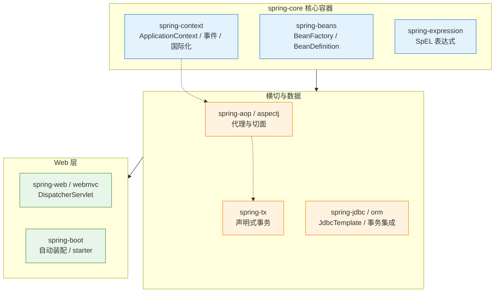

# 🌿 Spring 总览

> 这是 `8-spring/` 的**总入口**，也是 Spring 体系化学习的主线。
> 系列回答四个层次：**① 容器怎么运转（架构/IoC/Bean）② 横切能力怎么实现（AOP/事务）③ Web 与工程化（MVC/Boot）④ 进阶与实战（扩展点/踩坑/面试）**。
> 关联：[[面试准备/专业技能/02-Java核心与微服务|面试 · Java 核心与微服务]]、[[面试准备/技术面试题库/13-Spring源码专题|Spring 源码专题（速答骨架）]]。

> [!note] 本目录已有资料的关系
> | 已有 | 定位 | 与本系列的关系 |
> |---|---|---|
> | [[spring.excalidraw\|spring 脑图]] | **图纸**：IoC/DI 概念、Spring MVC 流程、core 四模块 | 本系列是它的**文字详解版** |
> | [[spring 版本.smm\|spring 版本脑图]] | 版本演进 | 对应 §五 版本速览 |
> | [[LOGBACK_SETUP\|Logback 集成]] | 实操文档 | [[8-Spring实战与踩坑]] 中引用 |
> | [[面试准备/技术面试题库/13-Spring源码专题\|13-Spring 源码专题]] | **面试速答骨架**（源码方法名级） | 本系列讲**why 与体系**，两者互补 |
> | [[面试准备/技术面试题库/14-Spring循环依赖专题\|14-循环依赖专题]] | 循环依赖深度专篇 | [[7-Spring进阶专题]] 只做摘要 + 引导 |

---

## 一、系列导航

| # | 笔记 | 一句话定位 | 核心内容 |
|---|---|---|---|
| 1 | **[[1-Spring架构与IoC容器]]** | 容器是什么 | 模块架构、IoC/DI 本质、BeanFactory vs ApplicationContext、父子容器、BeanDefinition、refresh 十二步 |
| 2 | **[[2-Bean生命周期与依赖注入]]** | Bean 怎么活 | 完整生命周期、三种注入方式、`@Autowired`/`@Resource`、作用域与线程安全 |
| 3 | **[[3-AOP原理与实战]]** | 横切能力 | 概念辨析、五种通知与顺序、切点表达式、JDK vs CGLIB、**失效场景大全** |
| 4 | **[[4-声明式事务]]** | 事务怎么生效 | `@Transactional` 属性、**传播行为详解**、**失效场景**、事务同步、大事务治理 |
| 5 | **[[5-SpringMVC请求全流程]]** | 一个请求的一生 | DispatcherServlet 九大组件、完整时序、参数绑定、拦截器 vs 过滤器、异常处理 |
| 6 | **[[6-SpringBoot自动装配]]** | 约定优于配置 | 自动装配原理、条件注解、启动流程、配置优先级、自定义 starter |
| 7 | **[[7-Spring进阶专题]]** | 拉开差距的地方 | 扩展点全景、事件机制、**Bean 线程安全**、`@Async`、缓存抽象、定时任务 |
| 8 | **[[8-Spring实战与踩坑]]** | 生产问题手册 | 启动/运行时/性能问题排查、日志与 TraceId、反模式清单、工具箱 |
| 9 | **[[9-Spring面试高频题]]** | 面试怎么答 | 12 道必答题 + 快问快答 + 陷阱 TOP12 + 场景设计题 |

---

## 二、按需求的阅读路径

> [!tip] 三条路径
> **面试突击（1 天）**：[[9-Spring面试高频题]] → [[1-Spring架构与IoC容器]]（refresh/IoC）→ [[3-AOP原理与实战]]（失效场景）→ [[4-声明式事务]]（传播与失效）→ [[5-SpringMVC请求全流程]]（流程）
> **系统吃透（1 周）**：1 → 2 → 3 → 4 → 5 → 6 → 7 顺序读；其中 **3、4 值得反复读**（生产事故高发区）
> **排障导向**：[[8-Spring实战与踩坑]] → 按现象跳转对应篇（AOP 失效 → 3；事务不回滚 → 4；406/精度 → 8；启动失败 → 8）

---

## 三、Spring 六大模块全景

> **一句话理解**：`core/beans/context` 提供容器能力 → `aop/tx` 在容器之上提供横切能力 → `webmvc/boot` 提供 Web 与工程化封装。

---

## 四、30 秒速查表

| 问题 | 一句话答案 | 详见 |
|---|---|---|
| IoC 和 DI 什么关系 | **IoC 是设计思想（控制权反转），DI 是实现方式** | [[1-Spring架构与IoC容器]] |
| BeanFactory vs ApplicationContext | 后者在前者基础上加了**事件、国际化、资源加载、AOP 集成**，且默认预实例化单例 | [[1-Spring架构与IoC容器]] |
| BeanDefinition 是什么 | **Bean 的"配方"**：类名、作用域、构造参数、属性值；Bean 是"成品" | [[1-Spring架构与IoC容器]] |
| 推荐哪种注入方式 | **构造器注入**（不可变、非空保证、暴露循环依赖） | [[2-Bean生命周期与依赖注入]] |
| Bean 生命周期关键节点 | 实例化 → 属性填充 → Aware → BPP 前置 → `@PostConstruct` → `afterPropertiesSet` → init-method → **BPP 后置（AOP 代理在此）** | [[2-Bean生命周期与依赖注入]] |
| Bean 是线程安全的吗 | **单例 Bean 本身不保证线程安全**，关键是**无状态** | [[2-Bean生命周期与依赖注入]]、[[7-Spring进阶专题]] |
| `@Autowired` vs `@Resource` | 前者**按类型**（Spring 提供），后者**优先按名字**（JSR-250） | [[2-Bean生命周期与依赖注入]] |
| AOP 实现原理 | **运行期动态代理**（JDK 接口代理 / CGLIB 继承代理） | [[3-AOP原理与实战]] |
| JDK 代理 vs CGLIB | 接口 vs 继承；CGLIB 不能代理 final；**Boot 2.x 起默认 CGLIB** | [[3-AOP原理与实战]] |
| 为什么自调用 AOP 失效 | **没走代理对象**，`this` 调用绕过了增强逻辑 | [[3-AOP原理与实战]] |
| `@Around` 最大的坑 | **必须 `proceed()` 并返回其结果**，否则目标方法不执行/返回值丢失 | [[3-AOP原理与实战]] |
| `@Transactional` 默认回滚什么 | **只回滚 `RuntimeException` 和 `Error`**，受检异常**不回滚** → 要写 `rollbackFor` | [[4-声明式事务]] |
| 事务失效最常见原因 | **自调用**、非 public、异常被吞、`rollbackFor` 没配对、跨线程 | [[4-声明式事务]] |
| `REQUIRES_NEW` vs `NESTED` | 前者**挂起外层、开全新事务**；后者**基于 savepoint 嵌套**，外层回滚会带走内层 | [[4-声明式事务]] |
| 为什么跨线程事务失效 | 事务绑定在 **`TransactionSynchronizationManager` 的 ThreadLocal** 上 | [[4-声明式事务]] |
| 事务提交后才发消息怎么做 | `TransactionSynchronization` 或 **`@TransactionalEventListener(AFTER_COMMIT)`** | [[4-声明式事务]]、[[7-Spring进阶专题]] |
| DispatcherServlet 处理流程 | 取 handler → 取 adapter → `preHandle` → 执行 → 返回值处理 → `postHandle` → 视图渲染 → `afterCompletion` | [[5-SpringMVC请求全流程]] |
| 拦截器 vs 过滤器 | Filter 属 **Servlet 规范**（更外层、拿不到 handler）；Interceptor 属 **Spring**（能拿 handler/ModelAndView） | [[5-SpringMVC请求全流程]] |
| 为什么有 HandlerAdapter | **适配不同类型的 handler**（注解式/函数式/HttpRequestHandler） | [[5-SpringMVC请求全流程]] |
| 自动装配原理 | `@EnableAutoConfiguration` → `AutoConfigurationImportSelector` 读 **`AutoConfiguration.imports`** → 条件过滤 → 注册 BeanDefinition | [[6-SpringBoot自动装配]] |
| `@ConditionalOnMissingBean` 的意义 | 让**用户自定义的 Bean 优先**，自动配置只在缺失时兜底 | [[6-SpringBoot自动装配]] |
| 配置文件谁优先级高 | 命令行参数 > 环境变量 > 外部配置 > `application-{profile}` > `application` | [[6-SpringBoot自动装配]] |
| BFPP vs BPP | 前者改 **BeanDefinition**（更早），后者改 **Bean 实例** | [[7-Spring进阶专题]] |
| Spring 事件是同步的吗 | **默认同步**；要异步需 `@Async` + `@EnableAsync` | [[7-Spring进阶专题]] |
| `@Async` 最容易踩的坑 | **不指定线程池就用 `SimpleAsyncTaskExecutor`（每次新建线程）** | [[7-Spring进阶专题]]、[[8-Spring实战与踩坑]] |
| `@Scheduled` 默认线程数 | **单线程**，一个任务慢会阻塞其他任务 | [[7-Spring进阶专题]] |
| 返回 Long 给前端精度丢失 | **JS Number 精度问题** → 用 String 序列化 | [[8-Spring实战与踩坑]] |
| 启动报 BeanCreationException | **先看最底层的 caused by**，再看是配置类、依赖还是条件装配问题 | [[8-Spring实战与踩坑]] |

---

## 五、版本演进速览

| 版本 | 关键变化 | 对使用者的影响 |
|---|---|---|
| Spring 4 | 支持 Java 8、`@Conditional` 增强 | 注解驱动成熟 |
| **Spring 5** | **WebFlux 响应式**、Java 8+ 基线、Kotlin 支持 | 响应式可选，但 MVC 仍是主流 |
| **Spring Boot 2.x** | 默认 **CGLIB 代理**、`spring.factories` 自动装配 | **AOP/事务代理默认走 CGLIB** |
| Boot 2.4 | 配置加载机制重构（`spring.config.import`） | 配置优先级有调整 |
| **Boot 2.6** | **默认禁止循环依赖**（`allow-circular-references=false`） | 老项目升级会直接启动失败 |
| **Boot 2.7** | 自动装配声明从 `spring.factories` 迁到 **`AutoConfiguration.imports`** | 自定义 starter 要改写法 |
| **Spring 6 / Boot 3** | **Java 17 基线**、Jakarta EE 9+（`javax` → **`jakarta`**）、AOT 支持、**移除了旧的自动装配方式** | **升级要大改包名**；`@Transactional` 在非 public 方法上的限制放宽 |
| Boot 3.2+ | 虚拟线程支持（Java 21） | 高并发 IO 场景可用 |

> [!note] 本系列口径
> 以 **Spring 6 / Spring Boot 3.x** 为主，涉及版本差异处会明确标注（尤其是 `javax` → `jakarta`、循环依赖默认禁止、自动装配声明文件迁移这三处）。
> 你已有 [[spring 版本.smm|spring 版本脑图]] 可对照。

---

## 六、学习检查清单

- [ ] 能说清 IoC 与 DI 的关系，并解释为什么推荐构造器注入
- [ ] 能画出 `refresh()` 主流程并说明关键步骤"为什么在这个顺序"
- [ ] 能说清 `BeanFactory` 与 `ApplicationContext` 的区别
- [ ] 能完整背出 Bean 生命周期，并说出各初始化方式的执行顺序
- [ ] 能解释单例 Bean 的线程安全问题与无状态设计
- [ ] 能画出 AOP 五种通知的执行顺序（正常与异常两种情况）
- [ ] 能列出 AOP 失效的至少 5 种场景并给出解法
- [ ] 能说清 `@Transactional` 默认回滚规则与传播行为差异
- [ ] 能列出事务失效的至少 6 种场景
- [ ] 能画出 DispatcherServlet 处理一个请求的完整流程
- [ ] 能说清拦截器与过滤器的区别与执行顺序
- [ ] 能解释 Spring Boot 自动装配的原理与 `@ConditionalOnMissingBean` 的作用
- [ ] 能说出至少 6 个 Spring 扩展点及其触发时机
- [ ] 能说清"事务提交后再发消息"的三种正确做法
- [ ] 能针对启动失败/406/连接池打满等现象给出排查路径

---
> [!question] 还需要补充什么？
> 可继续扩展的方向：Spring WebFlux 响应式编程、Spring Security 认证授权体系、Spring Data JPA/MyBatis 深入、Spring Cloud 微服务全家桶（见 [[7-分布式/8-微服务架构与注册配置中心]]）、Spring AI（与你 AI 方向结合）、测试体系（Testcontainers）。需要哪块就新开一篇并在上表登记。
