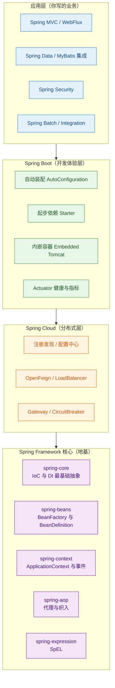
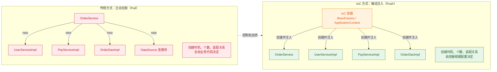
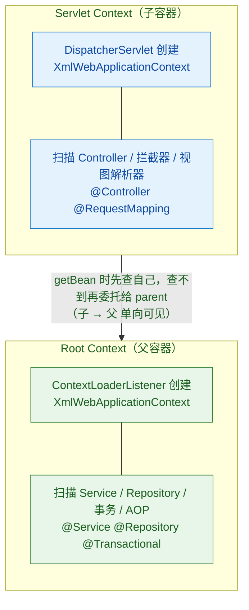
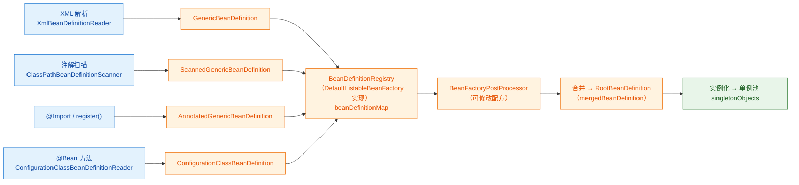
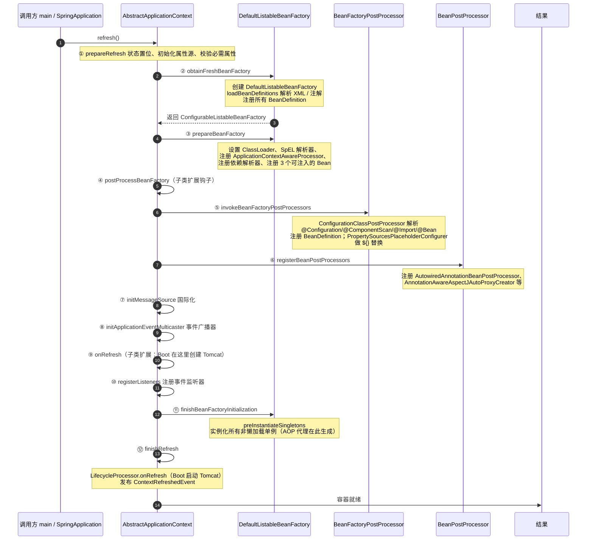
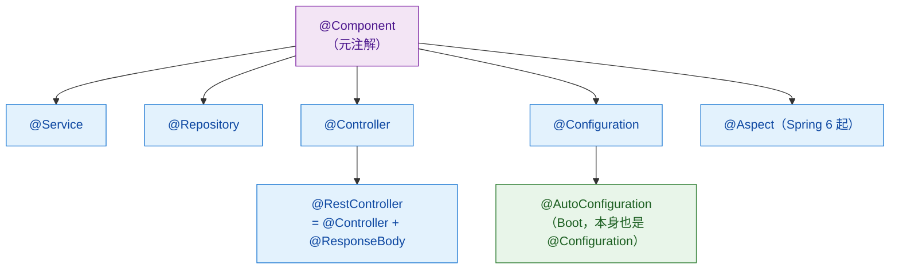

# 🏛️ 一、Spring 架构与 IoC 容器

> 本篇回答：Spring 到底解决什么问题，为什么它能取代 EJB？IoC 和 DI 是什么关系，"控制"到底反转到哪里去了？`BeanFactory` 和 `ApplicationContext` 差在哪，父子容器为什么会让你"Controller 里拿得到 Service、Service 里拿不到 Controller"？`BeanDefinition` 这张"配方"上写了哪些字段？`refresh()` 十二步为什么必须是这个顺序？以及那些写在简历上的"设计模式"，到底对应哪个类名？
> 本文是**体系详解版**：讲 WHY、讲配置、讲踩坑；**方法名的速答骨架见 [[面试准备/技术面试题库/13-Spring源码专题]]**，循环依赖的深度推导见 [[面试准备/技术面试题库/14-Spring循环依赖专题]]。图形化的"图纸"见 [[8-spring/spring.excalidraw|spring 脑图]]。
> 系列导航：[[0-Spring总览]] · [[2-Bean生命周期与依赖注入]] · [[3-AOP原理与实战]] · [[4-声明式事务]] · [[5-SpringMVC请求全流程]] · [[6-SpringBoot自动装配]] · [[7-Spring进阶专题]] · [[8-Spring实战与踩坑]] · [[9-Spring面试高频题]]

---

## 一、Spring 是什么，它到底解决了什么问题

### 1.1 从 EJB 的笨重说起

2000 年代初的 Java 企业级开发（J2EE）主流是 **EJB 2.x**。它的模型是这样的：

| EJB 2.x 的痛点 | 具体表现 | 后果 |
| --- | --- | --- |
| 强侵入 | 业务类必须实现 `SessionBean` 接口，还要写 `ejbCreate`/`ejbActivate` 等生命周期方法 | 业务代码和容器 API 死死耦合，脱离容器跑不起来 |
| 必须跑在容器里 | 单元测试要启动完整的 Application Server | 测试慢到没人愿意写测试 |
| 配置地狱 | 一个 Bean 要配 `ejb-jar.xml` + `weblogic-ejb-jar.xml` + 厂商私有描述符 | 改一个字段要动三个 XML |
| 分布式被强加 | 远程接口（Remote）和本地接口（Local）要分别实现 | 明明是同进程调用，被迫走 RMI 序列化 |
| 无法继承/组合 | EJB 组件不支持继承 | 复用只能靠复制 |
| 查找依赖靠 JNDI | `ctx.lookup("java:comp/env/ejb/OrderService")` | 字符串魔法，编译期无保障 |

Rod Johnson 在 2002 年写了《Expert One-on-One J2EE Design and Development》，核心论点：**大部分企业应用根本不需要 EJB 的复杂性和分布式能力**，用普通的 Java 对象（POJO）+ 依赖注入 + AOP 就够了。2004 年 Spring 1.0 发布，把这本书的代码（`interface21` 框架）产品化。

> [!important] 一句话本质
> **Spring 的革命性不在于"提供了什么功能"，而在于"把普通 Java 对象（POJO）变成了企业级组件"。**
> 你的 `OrderService` 就是一个普通类，不实现任何接口、不继承任何基类、不认识 Spring 的任何 API；容器负责创建它、装配它、给它加事务和日志。这叫**无侵入（non-invasive）**，也是 Spring 能活二十年的根本原因。

### 1.2 核心只有两件事：IoC 与 AOP

Spring 的官网从来都说自己的核心是 **IoC Container** 和 **AOP**，其他全是围绕这两件事的扩展：

- **IoC（控制反转）**：把"对象的创建与依赖装配"这个控制权从业务代码反转给容器。→ 解决**对象之间的耦合**。
- **AOP（面向切面编程）**：把日志、事务、缓存、权限这些横切关注点从业务代码里抽出来，运行时织入。→ 解决**业务与非业务逻辑的耦合**。

其余的模块（MVC、Data、Security、Boot）都是**在 IoC 容器这个地基上的应用层**。

> [!note] 为什么 AOP 也必须依赖 IoC
> AOP 的产物是**代理对象**，而代理对象是容器在 Bean 初始化阶段生成并放进容器里的。**没有容器托管 Bean，AOP 就没有"织入点"**。所以 IoC 是地基，AOP 是地基上的第一层楼。详见 [[3-AOP原理与实战]]。

### 1.3 Spring 全家桶版图



**对应脑图 [[8-spring/spring.excalidraw|spring 脑图]] 里的 spring core 四模块**——注意脑图列了 Beans/Core/Context/SpEL 四个，实际 `spring-aop` 是第五个核心模块：

| 模块 | 核心类/抽象 | 职责 | 常识性记忆点 |
| --- | --- | --- | --- |
| `spring-core` | `Resource`、`ResourceLoader`、`ConversionService` | 最底层的工具：资源抽象、类型转换、反射工具 | 能被几乎所有 Spring 模块依赖，本身不依赖任何人 |
| `spring-beans` | `BeanFactory`、`BeanDefinition`、`DefaultListableBeanFactory` | Bean 的定义、注册、实例化、装配 | **IoC 的真正实现层**；名字叫 beans 而不是 ioc |
| `spring-context` | `ApplicationContext`、`ApplicationEventPublisher`、`MessageSource` | 在 BeanFactory 之上加企业级能力 | 依赖 `spring-beans` + `spring-aop` + `spring-expression` |
| `spring-expression` | `SpelExpressionParser`、`EvaluationContext` | SpEL 表达式语言，支持 `@Value("#{...}")`、`@ConditionalOnExpression` | 是独立模块，可以单独用 |
| `spring-aop` | `ProxyFactory`、`Advisor`、`Pointcut` | 动态代理、通知、切点匹配 | 只依赖 `spring-beans` + `spring-core`，**不依赖 context** |

> [!tip] 面试加分点
> 被问到"Spring 有哪些模块"时，绝大多数人只背 Beans/Core/Context/SpEL 四个。**补一句"AOP 是第五个核心模块，而且 `spring-aop` 不依赖 `spring-context`，可以脱离它单独用 `ProxyFactory`"**，立刻区分于背题党。

---

## 二、IoC 与 DI 的本质

### 2.1 "控制反转"反转的到底是什么

先看没有 IoC 的写法：

```java
public class OrderService {
    // 依赖自己 new —— 控制权在业务代码手里
    private UserService userService = new UserServiceImpl();
    private PayService payService = new PayServiceImpl();
    private OrderDao orderDao = new OrderDaoImpl();
}
```

这段代码的问题不是"写法难看"，而是三个**结构性问题**：

1. **编译期硬绑定**：`OrderService` 在字节码层面就依赖了 `UserServiceImpl`，想换成 mock 或另一实现，只能改源码重新编译。
2. **生命周期不可控**：`UserServiceImpl` 什么时候创建、创建几次、什么时候销毁，全由业务代码决定。三个 Service 各 new 一次，`UserServiceImpl` 就被创建了三次（如果它是有状态或有连接的，就炸了）。
3. **无法统一加工**：想在 `userService` 上加事务、加缓存、加日志，只能改源码或者搞一堆静态代理类。

反转之后：

```java
@Service
public class OrderService {
    // 依赖从外部"推"进来 —— 控制权在容器手里
    private final UserService userService;
    private final PayService payService;

    public OrderService(UserService userService, PayService payService) {
        this.userService = userService;
        this.payService = payService;
    }
}
```



**反转的是"依赖的获取方式"**：从"我需要什么，我主动去创建/查找"（Pull）变成"我需要什么，声明出来，容器推给我"（Push）。这就是 Hollywood Principle —— **"Don't call us, we'll call you."**

> [!question] 那 IoC 就只是"把 new 挪个地方"吗？
> 不是。**IoC 的真正价值是把"对象的装配关系"从编译期的代码，变成了运行期可替换的配置（XML / 注解 / Java Config）。** 一旦装配关系外置，容器就能在这条链路上插入统一加工：代理、事务、缓存、懒加载、作用域控制。没有 IoC，这些能力无处安放。

### 2.2 DI 是 IoC 的实现方式

IoC 是一个**设计原则**（谁控制对象生命周期），DI 是它的**具体实现手段**（通过构造函数/Setter/字段把依赖注入进去）。

| 维度 | IoC | DI |
| --- | --- | --- |
| 层次 | 设计原则 / 思想 | 设计模式 / 实现方式 |
| 关注点 | "控制权归谁" | "依赖怎么交到对象手里" |
| 关系 | 上位概念 | 下位实现（DI 是 IoC 的一种，不是唯一一种） |
| 其他实现 | —— | 依赖查找（Dependency Lookup，如 JNDI `ctx.lookup()`）、模板方法回调 |

**依赖查找 vs 依赖注入**——这是 IoC 的两种实现，很多人混为一谈：

```java
// 依赖查找（Lookup）：对象自己主动去容器里问
UserService us = context.getBean(UserService.class);   // 主动查找，侵入容器 API

// 依赖注入（Injection）：容器主动塞给你
public OrderService(UserService us) { this.us = us; }  // 无侵入，不认识容器
```

**Spring 同时支持两者**：`ApplicationContextAware` 拿到 context 后 `getBean` 就是查找；`@Autowired` 是注入。**但 Spring 主推注入，因为查找是有侵入的**——你的类被迫认识 `ApplicationContext` 这个容器 API。

### 2.3 三种注入方式

```java
// ① 构造器注入（官方推荐）
@Service
public class A {
    private final OrderDao dao;
    public A(OrderDao dao) { this.dao = dao; }        // 依赖在构造时全部就位
}

// ② Setter 注入
@Service
public class B {
    private OrderDao dao;
    @Autowired public void setDao(OrderDao dao) { this.dao = dao; }
}

// ③ 字段注入
@Service
public class C {
    @Autowired private OrderDao dao;                   // 最简洁，也最被诟病
}
```

| 维度 | 构造器注入 | Setter 注入 | 字段注入 |
| --- | --- | --- | --- |
| 能否 `final` | ✅ 可以 | ❌ 不行 | ❌ 不行 |
| 不可变性 | ✅ 对象创建即完整 | ❌ 可变 | ❌ 可变 |
| 非空保证 | ✅ 编译期强制传参 | ❌ 可能忘记调用 | ❌ 可能为 null |
| 单测友好度 | ✅ 直接 `new A(mockDao)`，无需 Spring | 🟡 `new B()` + `setDao(mock)`，尚可 | ❌ 必须反射或 `ReflectionTestUtils.setField` |
| 隐藏依赖 | ❌ 构造器参数暴露一切 | 🟡 部分暴露 | ✅ 严重隐藏（类可以有 20 个 `@Autowired` 字段） |
| 循环依赖 | ❌ **直接抛异常，无法解决** | ✅ 三级缓存可解（对 setter 注入） | ✅ 三级缓存可解（对字段注入） |
| 依赖过多时的信号 | ✅ 构造器超长 = 明确的坏味道 | 🟡 分散，不易察觉 | ❌ 完全无感，膨胀到不可维护 |
| Spring 官方态度 | **推荐** | 可选依赖时使用 | **不推荐**（Spring 团队明确表态） |

**为什么 Spring 官方推荐构造器注入？** 官方文档原话大意：**构造器注入能保证注入的依赖不为 null，能保证依赖不可变，能让组件从容器中拿出来就是一个完整可用的对象，也便于脱离容器进行单元测试。**

> [!important] 构造器注入的"副作用"恰恰是它最大的价值
> 构造器注入**无法解决循环依赖**（`A` 的构造要 `B`，`B` 的构造要 `A`，死锁，Spring 只能抛 `BeanCurrentlyInCreationException`）。
> 很多人把这个当缺点。**恰恰相反：这是特性，不是缺陷。** 循环依赖本身就是设计缺陷（说明两个类的职责边界不清）。构造器注入把这个问题在启动期就暴露出来，而不是靠三级缓存把它"糊"过去、等到运行期才出诡异问题。
> 详见 [[面试准备/技术面试题库/14-Spring循环依赖专题]]。

**那什么时候用 Setter 注入？** 只有一种场景：**可选依赖**。某依赖可能不存在，存在时增强，不存在也能跑（比如可选的通知器、可选的监控上报器）。此时用 Setter 或 `@Autowired(required = false)`。

> [!warning] 字段注入的真实事故
> 字段注入因为写起来最省事，是实际项目里最常见的写法。它的典型事故：
> **① 循环依赖被三级缓存掩盖**——`A` 注入 `B`、`B` 注入 `A`，本地跑得好好的，一上 AOP（比如 `A` 加了 `@Transactional`）就报"注入的是原始对象不是代理对象"，因为提前暴露的是 `ObjectFactory` 生成的早期引用。详见循环依赖专题。
> **② 单测必须起 Spring**——想测一个纯逻辑方法，得写 `@SpringBootTest` 加载整个上下文，一个测试跑十几秒。
> **③ 依赖膨胀无感知**——类里堆了 15 个 `@Autowired` 字段，没人觉得有问题；换成构造器，15 个参数的构造器立刻会让代码评审爆炸。

### 2.4 DI 的"配置元数据"三种载体

| 载体 | 时代 | 示例 | 特点 |
| --- | --- | --- | --- |
| XML | Spring 1.x–2.x | `<bean id="a" class="..."><property name="b" ref="b"/></bean>` | 完全解耦、可热改、但冗长、无编译期校验 |
| 注解 | Spring 2.5+ | `@Component` + `@Autowired` + `@Qualifier` | 简洁、编译期校验、但**装配关系埋在代码里** |
| Java Config | Spring 3.0+ | `@Configuration` + `@Bean` | 类型安全、可编程（if/for 决定注册哪些 Bean）、**Boot 自动装配的基础** |

**三者可以混用**，同一个容器里既有 XML 加载的 BeanDefinition，也有注解扫描出来的。这也解释了一个常见困惑：**"为什么我 `@Autowired` 一个 XML 里配的 bean 也能注入成功？"** —— 因为它们最终都变成 `BeanDefinition` 注册进同一个 `BeanFactory`，**容器不关心配方从哪来**。

---

## 三、容器体系

### 3.1 BeanFactory 与 ApplicationContext 的关系

```mermaid
classDiagram
  class BeanFactory {
    <<interface>>
    +getBean(String) Object
    +getBean(Class) Object
    +getBeanProvider(Class) ObjectProvider
    +containsBean(String) boolean
    +isSingleton(String) boolean
    +isPrototype(String) boolean
    +getType(String) Class
  }
  class HierarchicalBeanFactory {
    <<interface>>
    +getParentBeanFactory() BeanFactory
  }
  class ListableBeanFactory {
    <<interface>>
    +getBeanDefinitionNames() String[]
    +getBeansOfType(Class) Map
    +getBeanNamesForAnnotation(Class) String[]
  }
  class AutowireCapableBeanFactory {
    <<interface>>
    +createBean(Class) Object
    +autowireBean(Object) void
    +initializeBean(Object, String) Object
  }
  class ConfigurableBeanFactory {
    <<interface>>
    +setParentBeanFactory(BeanFactory) void
    +addBeanPostProcessor(BeanPostProcessor) void
    +addBeanFactoryPostProcessor(BeanFactoryPostProcessor) void
    +registerSingleton(String, Object) void
  }
  class ConfigurableListableBeanFactory {
    <<interface>>
    +preInstantiateSingletons() void
    +ignoreDependencyType(Class) void
  }
  class DefaultListableBeanFactory {
    -Map beanDefinitionMap
    -List beanDefinitionNames
    -Map singletonObjects
    -Map earlySingletonObjects
    -Map singletonFactories
    +registerBeanDefinition(String, BeanDefinition) void
    +getBeanDefinition(String) BeanDefinition
  }
  class ApplicationContext {
    <<interface>>
    +refresh() void
    +publishEvent(ApplicationEvent) void
    +getMessage(String, Object[], Locale) String
    +getResource(String) Resource
    +getEnvironment() Environment
  }
  class ConfigurableApplicationContext {
    <<interface>>
    +setParent(ApplicationContext) void
    +addBeanFactoryPostProcessor(BeanFactoryPostProcessor) void
    +addApplicationListener(ApplicationListener) void
  }
  class AbstractApplicationContext {
    <<abstract>>
    +refresh() void
    #obtainFreshBeanFactory() void
    #invokeBeanFactoryPostProcessors(BeanFactory) void
    #registerBeanPostProcessors(BeanFactory) void
    #finishBeanFactoryInitialization(BeanFactory) void
    #finishRefresh() void
  }
  class AbstractRefreshableApplicationContext {
    <<abstract>>
    #refreshBeanFactory() void
  }
  class GenericApplicationContext {
    -DefaultListableBeanFactory beanFactory
  }
  class AnnotationConfigApplicationContext
  class ClassPathXmlApplicationContext
  class AnnotationConfigWebApplicationContext

  BeanFactory <|-- HierarchicalBeanFactory
  BeanFactory <|-- ListableBeanFactory
  BeanFactory <|-- AutowireCapableBeanFactory
  HierarchicalBeanFactory <|-- ConfigurableBeanFactory
  ListableBeanFactory <|-- ConfigurableListableBeanFactory
  AutowireCapableBeanFactory <|-- ConfigurableListableBeanFactory
  ConfigurableBeanFactory <|-- ConfigurableListableBeanFactory
  ConfigurableListableBeanFactory <|-- DefaultListableBeanFactory
  BeanFactory <|.. ApplicationContext
  ApplicationContext <|-- ConfigurableApplicationContext
  ConfigurableApplicationContext <|.. AbstractApplicationContext
  AbstractApplicationContext <|-- AbstractRefreshableApplicationContext
  AbstractApplicationContext <|-- GenericApplicationContext
  AbstractRefreshableApplicationContext <|-- ClassPathXmlApplicationContext
  GenericApplicationContext <|-- AnnotationConfigApplicationContext
  AbstractRefreshableApplicationContext <|-- AnnotationConfigWebApplicationContext
  classDef iface fill:#e3f2fd,stroke:#1976d2,color:#0d47a1
  classDef impl fill:#e8f5e9,stroke:#2e7d32,color:#1b5e20
  classDef abs fill:#f3e5f5,stroke:#7b1fa2,color:#4a148c
  class BeanFactory iface
  class HierarchicalBeanFactory iface
  class ListableBeanFactory iface
  class AutowireCapableBeanFactory iface
  class ConfigurableBeanFactory iface
  class ConfigurableListableBeanFactory iface
  class ApplicationContext iface
  class ConfigurableApplicationContext iface
  class DefaultListableBeanFactory impl
  class AnnotationConfigApplicationContext impl
  class ClassPathXmlApplicationContext impl
  class AnnotationConfigWebApplicationContext impl
  class AbstractApplicationContext abs
  class AbstractRefreshableApplicationContext abs
  class GenericApplicationContext abs
```



这张图要读出的关键信息：

1. **`ApplicationContext` 继承自 `BeanFactory`**（虚线实现，因为它是接口继承接口）——所以**"ApplicationContext 是 BeanFactory 的子接口"**这句话是对的。
2. **`DefaultListableBeanFactory` 是整个容器体系的"发动机"**——不管你用哪种 `ApplicationContext`，最后干活的那个 `BeanFactory` 都是它（或者它的子类）。`ApplicationContext` 只是"外壳 + 增强"。
3. 三级缓存的三个 Map（`singletonObjects` / `earlySingletonObjects` / `singletonFactories`）就定义在 `DefaultListableBeanFactory` 里。

> [!question] 必答：BeanFactory 和 ApplicationContext 的区别
> **一句话：ApplicationContext 是 BeanFactory 的超集，在"能拿 Bean"之外，多了六样企业级能力，并且默认预实例化单例。**
>
> | 能力 | BeanFactory | ApplicationContext |
> | --- | --- | --- |
> | 依赖注入 / `getBean` | ✅ | ✅ |
> | Bean 自动注册 `BeanPostProcessor` | ❌ 需手动 `addBeanPostProcessor` | ✅ 自动（`registerBeanPostProcessors`） |
> | Bean 自动注册 `BeanFactoryPostProcessor` | ❌ 需手动 | ✅ 自动 |
> | 国际化 `MessageSource` | ❌ | ✅ |
> | 事件发布 `ApplicationEventPublisher` | ❌ | ✅ |
> | 资源加载 `ResourceLoader`（`classpath:`/`file:`/URL） | ❌ | ✅ |
> | `Environment` / `@Value` 属性解析 | ❌ | ✅ |
> | AOP 集成 | ❌ 需手动加 `AnnotationAwareAspectJAutoProxyCreator` | ✅ （通过自动注册 BPP） |
> | 单例创建时机 | **懒加载**，`getBean` 才创建 | **默认预实例化**，`refresh()` 时全部创建 |
> | 启动期错误发现 | 用到才炸 | 启动就炸（这是优点） |
>
> **最后一行的"预实例化"才是工程上最重要的差别**：`ApplicationContext` 启动时就把所有非懒加载单例造出来，配置错了当场启动失败；`BeanFactory` 要等第一次 `getBean` 才报错，可能上线三天后才在某个低频接口上炸。**这也是"BeanFactory 是面向 Spring 自身的，ApplicationContext 才是面向开发者的"这句话的来源。**
>
> 补充：`BeanFactory` 并非不能用 Spring 的高级特性，它只是**不自动为你打开**——手动 `addBeanPostProcessor(new AutowiredAnnotationBeanPostProcessor())` 一样能注入。所谓"ApplicationContext 多了六样能力"，本质是 `prepareBeanFactory()` 和 `registerBeanPostProcessors()` 这两个方法替你做了这些注册。

### 3.2 常见容器实现与选用

| 实现类 | 触发方式 | 适用场景 | 注意 |
| --- | --- | --- | --- |
| `ClassPathXmlApplicationContext` | `new ClassPathXmlApplicationContext("app.xml")` | 传统 XML 项目、老系统维护 | 文件必须严格放在 classpath 下 |
| `FileSystemXmlApplicationContext` | 传绝对/相对路径 | 配置在容器外、需运维改 | 路径依赖工作目录，**打包后容易踩坑** |
| `AnnotationConfigApplicationContext` | `new AnnotationConfigApplicationContext(AppConfig.class)` | 注解/Java Config 项目、**写工具类时手动建容器** | 最常用于非 Web 场景 |
| `AnnotationConfigWebApplicationContext` | 在 `web.xml` 里配 `ContextLoaderListener` 的 `contextClass` | 传统 war 包 Spring MVC | 就是父子容器的"子容器" |
| `XmlWebApplicationContext` | `web.xml` 默认 | 传统 war 包 + XML 配置 | 默认值 |
| `ServletWebServerApplicationContext` | Spring Boot 内嵌 Tomcat | Boot 应用 | 在 `onRefresh()` 里 `createWebServer()` |

> [!example] 手动建容器的实战用途
> 写一个**不依赖 Spring Boot 的独立工具/脚本**，或者写**纯 Spring 单元测试**时：
> ```java
> try (AnnotationConfigApplicationContext ctx =
>          new AnnotationConfigApplicationContext(AppConfig.class)) {
>     OrderService svc = ctx.getBean(OrderService.class);
>     svc.doWork();
> }   // try-with-resources 关闭 → 触发 Bean 销毁回调
> ```
> 注意最后一行：**`ApplicationContext` 实现了 `Closeable`，必须关闭才会执行 `@PreDestroy` / `destroyMethod`**。这是"用了 `AnnotationConfigApplicationContext` 做定时任务，结果 `@PreDestroy` 从来不执行"的经典原因。

### 3.3 父子容器——Spring MVC 最大的历史包袱

#### 3.3.1 结构

传统 Spring MVC（war 包部署）会启动**两个容器**：



**关键规则**：`getBean` 时从当前容器往上找父容器，**但父容器不会往下找子容器**。

#### 3.3.2 两个必答的坑

> [!danger] 坑一：Controller 里能拿到 Service，Service 里拿不到 Controller
> - `Controller` 在**子容器**，`Service` 在**父容器**。子容器里 `getBean(Service.class)` → 自己找不到 → 委托父容器 → 找到 ✅
> - `Service` 在父容器，`Controller` 在子容器。父容器里 `getBean(Controller.class)` → 自己找不到 → **父容器没有 parent，直接抛 `NoSuchBeanDefinitionException`** ❌
>
> **这不是 bug，是设计**：父容器代表"业务核心层"，不应该反向依赖"接入层"。方向是**接入层 → 核心层**，和分层架构的方向一致。
>
> **真实踩坑场景**：在 `Service` 里 `@Autowired` 一个 `HttpServletRequest` 或某个 Web 层组件，启动报找不到 Bean。正解是把 Web 相关的东西从 Service 里拿掉（Service 应该与协议无关），而不是去改容器结构。

> [!danger] 坑二：`@Transactional` 写在 Controller 上不生效 / 事务的 AOP 代理没生成
> 事务的 AOP 基础设施（`@EnableTransactionManagement` 引入的 `InfrastructureAdvisorAutoProxyCreator`、以及 `ProxyTransactionManagementConfiguration` 注册的 `BeanFactoryTransactionAttributeSourceAdvisor`）**只在它所在的那个容器里生效**。
>
> 典型错误配置：
> ```xml
> <!-- 根容器：只扫 service -->
> <context:component-scan base-package="com.x.service"/>
> <!-- 子容器：扫 controller，且配了 <tx:annotation-driven/> -->
> <context:component-scan base-package="com.x.controller"/>
> <tx:annotation-driven/>
> ```
> 此时 `@Transactional` 的 advisor 在**子容器**里，而 `Service` 在**父容器** —— **Service 永远不会被事务代理**。表现是"事务莫名其妙不生效，也不报错"。
>
> **正解**：`<tx:annotation-driven/>`、`<context:component-scan>` 的 service 扫描、以及 Spring MVC 的 `DispatcherServlet` 配置，**要在正确的容器里各司其职**。最稳的做法是：
> - 父容器扫 `@Service`/`@Repository`/`@Component`（排除 `@Controller`）
> - 子容器只扫 `@Controller`
> - `<tx:annotation-driven/>` 放在**父容器**
>
> ```xml
> <!-- 父容器 -->
> <context:component-scan base-package="com.x">
>     <context:exclude-filter type="annotation"
>         expression="org.springframework.stereotype.Controller"/>
> </context:component-scan>
> <tx:annotation-driven/>
> ```
> 或者干脆用 Spring Boot——**Boot 只有一个容器**（`ServletWebServerApplicationContext`），这个包袱就消失了。

> [!tip] 为什么 Spring Boot 没有父子容器问题
> Boot 里 `DispatcherServlet` 用的容器就是根容器本身（`DispatcherServletAutoConfiguration` 注册时传入的是当前 context），**不存在两个容器**。所以 Boot 项目里"Service 注入 Controller"照样报错，但原因不是父子容器，而是**分层规范**——真发生这种情况，说明你的设计有问题，不是配置问题。

---

## 四、BeanDefinition——Bean 的"配方"

### 4.1 BeanDefinition 是什么

`BeanDefinition` 描述**如何创建**一个 Bean，而不是 Bean 本身。它是 Spring 的"元数据容器"，是"图纸"而不是"房子"。

**为什么必须先有 BeanDefinition？** 因为它实现了**两步走**：先**收集所有配方**（解析 XML/注解，注册 BeanDefinition），再**统一生产**（`preInstantiateSingletons`）。

这个两步走带来三个不可能被绕过的能力：

1. **可干预**：`BeanFactoryPostProcessor` 可以在"配方齐全、还没生产"的窗口期修改配方（改 scope、改属性、加新 Bean）。占位符替换 `${...}` 就是在这做的。
2. **可校验**：生产之前就能检测配置错误（比如引用了一个不存在的 bean name）。
3. **可排序**：能基于 `dependsOn`、`@Order`、依赖关系算出创建顺序。

**如果边解析边创建，这三个能力全都没了。**

### 4.2 BeanDefinition 上的字段

```java
public interface BeanDefinition extends AttributeAccessor, BeanMetadataElement {
    String getBeanClassName();          // ① 类名（注意是 String，不是 Class，支持延迟加载）
    MutablePropertyValues getPropertyValues();  // ② 属性值（setter 注入的目标）
    ConstructorArgumentValues getConstructorArgumentValues(); // ③ 构造器参数
    String getScope();                  // ④ singleton / prototype / request ...
    boolean isLazyInit();               // ⑤ 是否懒加载
    boolean isPrimary();                // ⑥ 同类型多个时优先
    String[] getDependsOn();            // ⑦ 强制先创建哪些 Bean
    String getInitMethodName();         // ⑧ 初始化方法名
    String getDestroyMethodName();      // ⑨ 销毁方法名
    boolean isAutowireCandidate();      // ⑩ 是否参与自动装配
    boolean isAbstract();               // ⑪ 抽象定义（只做模板，不创建实例）
    String getFactoryBeanName();        // ⑫ FactoryBean 的名字（工厂方法模式）
    String getFactoryMethodName();      // ⑬ 工厂方法名
    int getRole();                      // ⑭ ROLE_APPLICATION / ROLE_SUPPORT / ROLE_INFRASTRUCTURE
    String getDescription();
    BeanDefinition getOriginatingBeanDefinition(); // ⑮ 装饰前的原始定义
}
```

**常见实现类**：

| 实现类 | 来源 | 特点 |
| --- | --- | --- |
| `GenericBeanDefinition` | XML `<bean>`、注解扫描 | 最通用，`setParentName` 是"一等的"（不要求父定义必须存在） |
| `RootBeanDefinition` | 合并产物、`@Bean` 方法 | **合并后的最终形态**，容器内实际使用的就是它 |
| `ChildBeanDefinition` | 已废弃 | 父定义必须已注册 |
| `ScannedGenericBeanDefinition` | `@ComponentScan` | 持有 `AnnotationMetadata`，能读注解 |
| `AnnotatedGenericBeanDefinition` | `@Import` / `register()` | 同上 |
| `ConfigurationClassBeanDefinition` | `@Bean` 方法 | 记录 `factoryBeanName` + `factoryMethodName` |



### 4.3 BeanDefinitionRegistry 的作用

`BeanDefinitionRegistry` 是**注册中心接口**，`DefaultListableBeanFactory` 实现了它：

```java
public interface BeanDefinitionRegistry extends AliasRegistry {
    void registerBeanDefinition(String beanName, BeanDefinition bd);  // 注册/覆盖
    void removeBeanDefinition(String beanName);                        // 移除
    BeanDefinition getBeanDefinition(String beanName);                 // 查询
    boolean containsBeanDefinition(String beanName);
    String[] getBeanDefinitionNames();
    int getBeanDefinitionCount();
    boolean isBeanNameInUse(String beanName);
}
```

**底层是两个字段**（都在 `DefaultListableBeanFactory`）：

```java
private final Map<String, BeanDefinition> beanDefinitionMap = new ConcurrentHashMap<>(256);
private volatile List<String> beanDefinitionNames = new ArrayList<>(256);
```

> [!important] 为什么这个接口重要？因为它决定了"动态注册 Bean"怎么写
> 想在运行时**动态注册一个 Bean**（比如多数据源、按配置动态生成 N 个客户端），标准姿势就是拿到 `BeanDefinitionRegistry` 自己注册：
> ```java
> @Component
> public class DynamicBeanRegistrar implements ImportBeanDefinitionRegistrar {
>     @Override
>     public void registerBeanDefinitions(AnnotationMetadata importingClassMetadata,
>                                         BeanDefinitionRegistry registry) {
>         for (String ds : new String[]{"master", "slave1", "slave2"}) {
>             BeanDefinition bd = BeanDefinitionBuilder
>                     .genericBeanDefinition(HikariDataSource.class)
>                     .addPropertyValue("jdbcUrl", "jdbc:mysql://" + ds + "/app")
>                     .getBeanDefinition();
>             registry.registerBeanDefinition(ds + "DataSource", bd);   // ← 核心一行
>         }
>     }
> }
> ```
> **`BeanDefinitionRegistryPostProcessor`（BFPP 的子接口）就是在"配方收集完毕、生产开始之前"这个窗口做这件事的**——`ConfigurationClassPostProcessor` 本身就是一个 `BeanDefinitionRegistryPostProcessor`。这是 [[6-SpringBoot自动装配]] 的底层机制。

### 4.4 BeanDefinition 的合并（mergedBeanDefinition）

**问题**：XML 支持 `<bean parent="...">` 继承，注解侧也可能有"子定义"的概念（比如 `@Bean` 定义的 Bean 与 `BeanDefinition` 的属性覆盖）。但是容器在实例化时只想要一个**完整无歧义**的配方。

**解法**：`DefaultListableBeanFactory#getMergedBeanDefinition(beanName)`。

```java
protected RootBeanDefinition getMergedBeanDefinition(String beanName, BeanDefinition bd, BeanDefinition containingBd) {
    // ① 检查缓存 mergedBeanDefinitions
    // ② 如果有 parentName：递归合并父定义，子定义的值覆盖父定义
    // ③ 把 GenericBeanDefinition 提升为 RootBeanDefinition
    // ④ 把一个"明确的 Class 对象"回填进去（不再延迟解析）
    // ⑤ 缓存起来
}
```

合并规则：**子定义中"显式设置过"的属性覆盖父定义；没设置过的继承父定义**（这就是为什么 XML 里要用 `parent` + 只写差异属性）。

> [!warning] `mergedBeanDefinitions` 缓存导致的"改了不生效"陷阱
> 因为合并结果被缓存在 `mergedBeanDefinitions` Map 里，**如果你在运行期修改了 `BeanDefinition`（比如改 scope、改属性），已经合并过的定义不会自动失效**。手写动态 Bean 注册时，如果同名 Bean 已被合并过，必须调用 `clearMergedBeanDefinition(beanName)` 或直接 `removeBeanDefinition` 再重新注册，否则改了没效果。
> 这是个极少人知道、但一旦踩上就非常难查的坑。

### 4.5 BeanDefinition 与 Bean 的区别

| 维度 | BeanDefinition | Bean（实例） |
| --- | --- | --- |
| 是什么 | 元数据 / 配方 / 图纸 | 对象实例 / 成品 / 房子 |
| 数量关系 | 一个 name 一个定义 | singleton 只有一个；prototype 有 N 个 |
| 生命周期阶段 | 解析期存在（`refresh()` 第 2–5 步） | 实例化期产生（第 11 步） |
| 存放位置 | `beanDefinitionMap` | `singletonObjects`（三级缓存的一级） |
| 是否共享 | 全局唯一 | prototype 时每次 `getBean` 都是新的 |
| 类比 | `Class` | `new` 出来的对象 |
| 可修改性 | **可**（BFPP 改它） | 一般不再改（改了容器不知道） |

> [!tip] 面试话术
> "BeanDefinition 和 Bean 的关系，就像 `Class` 和对象的关系——一个是模具，一个是铸件。容器启动分两大阶段：**先解析所有 BeanDefinition（造模具），再统一实例化（浇铸）**。中间那个窗口就是 `BeanFactoryPostProcessor` 的用武之地，Spring Boot 的自动装配、`${}` 占位符替换、`@ComponentScan` 的扫描结果注册，全都发生在这个窗口。"

---

## 五、容器启动主流程：refresh() 十二步

### 5.1 流程图



### 5.2 每一步的职责

| 步骤 | 方法 | 职责 | 出问题时的症状 |
| --- | --- | --- | --- |
| 1 | `prepareRefresh` | 记录启动时间、`active=true`、`closed=false`；初始化 `Environment` 属性源；**校验 `requiredProperties`**（`setRequiredProperties` 设的必须存在） | 缺必需属性时启动报 `IllegalStateException` |
| 2 | `obtainFreshBeanFactory` | `refreshBeanFactory()` 创建 `DefaultListableBeanFactory` → `loadBeanDefinitions()` 解析配置 → 关闭旧的 BeanFactory | XML 语法错、`classpath*:` 路径写错 |
| 3 | `prepareBeanFactory` | 配 `ClassLoader`、`StandardBeanExpressionResolver`（SpEL）、`ResourceEditorRegistrar`；`addBeanPostProcessor(new ApplicationContextAwareProcessor(...))`；**注册 3 个可解析依赖**：`BeanFactory`、`ResourceLoader`、`ApplicationEventPublisher`、`ApplicationContext`；`registerResolvableDependency` | `@Autowired ApplicationContext` 能注入就靠这步 |
| 4 | `postProcessBeanFactory` | **空方法（模板方法模式）**，留给子类。Boot 的 `ServletWebServerApplicationContext` 在这里注册 `WebApplicationContextServletContextAwareProcessor` | —— |
| 5 | `invokeBeanFactoryPostProcessors` | ★**执行所有 BFPP**（含 `BeanDefinitionRegistryPostProcessor`，且它优先） | 见 5.3 |
| 6 | `registerBeanPostProcessors` | ★注册所有 BPP，**并按 `PriorityOrdered` → `Ordered` → 无序分组排序** | 顺序错会导致注入失败或代理没生成 |
| 7 | `initMessageSource` | 注册 `MessageSource` 到容器（国际化） | `getMessage` 报 `NoSuchMessageException` |
| 8 | `initApplicationEventMulticaster` | 注册事件广播器 `SimpleApplicationEventMulticaster` | 事件发不出去 |
| 9 | `onRefresh` | **空方法（模板方法）**，留给子类。Boot 的 `ServletWebServerApplicationContext#onRefresh` → `createWebServer()` **创建**内嵌 Tomcat | 端口占用在这报 |
| 10 | `registerListeners` | 把 `ApplicationListener` 注册进广播器；**提前发布早期事件**（`earlyApplicationEvents` 里缓存的） | —— |
| 11 | `finishBeanFactoryInitialization` | ★`preInstantiateSingletons()` **实例化所有非懒加载单例**；注册 `LoadTimeWeaverAware` 处理；冻结配置 | 见 5.3 |
| 12 | `finishRefresh` | `initLifecycleProcessor()` → `onRefresh()`（**Boot 在这里 `webServer.start()`**）；发布 `ContextRefreshedEvent`；注册 MBean；`LiveBeansView` | 启动卡在这通常是某个 `@PostConstruct` 里死循环/远程调用超时 |

### 5.3 两个关键步骤：为什么必须在这个位置

#### 为什么 BFPP（第 5 步）必须在 BPP（第 6 步）之前？

因为 **BFPP 会往容器里注册新的 BeanDefinition，而这些新的 BeanDefinition 有可能就是 BPP**。

最典型的例子：`@EnableAspectJAutoProxy` 通过 `@Import(AspectJAutoProxyRegistrar.class)` 注册了 `AnnotationAwareAspectJAutoProxyCreator` —— **它本身是一个 `BeanPostProcessor`**。如果第 6 步先跑，此时这个 BPP 的 BeanDefinition 还不存在，就注册不进去，**AOP 直接失效**。

> [!important] 一句话
> **BFPP 是"生产配方的"，BPP 是"加工实例的"。必须先有全部配方，才能确定要有哪些加工者。**

#### 为什么单例实例化（第 11 步）必须放在最后？

因为**实例化一个 Bean 会触发它的全部依赖链，而依赖链的终点可能是任何东西**：

| 依赖 | 需要在实例化前就位的原因 |
| --- | --- |
| `BeanPostProcessor` | `@Autowired` 注入靠 `AutowiredAnnotationBeanPostProcessor`，AOP 代理靠 `AnnotationAwareAspectJAutoProxyCreator` |
| `MessageSource` | 某个 Bean 构造时 `messageSource.getMessage(...)` |
| `ApplicationEventMulticaster` | 某个 Bean 在 `@PostConstruct` 里 `publishEvent` |
| `ApplicationListener` | 监听器要先注册好，否则错过早期事件（所以第 10 步虽在 11 之前，但支持 `earlyApplicationEvents` 缓存补发） |
| `LifecycleProcessor` | —— |
| 属性源 / `Environment` | `@Value("${...}")` 解析 |

**所以十二步的顺序本质是"基础设施先于业务对象"**：先把所有"加工工具"（BFPP/BPP/事件/国际化/环境）备齐，最后才开动流水线生产业务 Bean。

> [!tip] 反过来说，第 11 步之前的任何异常都叫"容器启动失败"，第 11 步的异常才叫"Bean 创建失败"
> 前者通常是配置/环境问题（缺配置文件、占位符没值、BeanDefinition 冲突），后者通常是 Bean 自身问题（依赖缺失、`@PostConstruct` 抛异常、循环依赖）。**看堆栈最上面是谁，就能定位到阶段。**

### 5.4 常见启动失败与定位

| 异常/现象 | 阶段 | 常见原因 |
| --- | --- | --- |
| `BeanDefinitionStoreException` / `SAXParseException` | 2 | XML 格式错误 |
| `NoSuchBeanDefinitionException` | 11 | 依赖的 Bean 没被扫描到 / 包路径错 |
| `NoUniqueBeanDefinitionException` | 11 | 同类型多个实现且无 `@Primary`/`@Qualifier` |
| `BeanCurrentlyInCreationException` | 11 | 循环依赖（构造器注入无法解决） |
| `BeanCreationException ... Could not resolve placeholder` | 11 | `${}` 没有对应配置项 |
| `IllegalStateException: Cannot enhance @Configuration bean definition ... is not eligible for getting processed by all BeanPostProcessors` | 6→11 | 某个 `@Configuration` 类被过早实例化（打了 `@Bean`+`BeanPostProcessor` 的常见坑） |
| 启动非常慢、卡在某个 Bean | 11 | 该 Bean 的 `@PostConstruct` 里有慢调用（远程接口、大查询） |

> [!danger] 高频坑：BeanPostProcessor 过早实例化导致 AOP 失效
> **背景**：如果某个 `BeanPostProcessor` 实现类是通过 `@Bean` 方法定义的，Spring 为了创建这个 BPP，必须**提前实例化它所属的 `@Configuration` 类**。此时后面那些 BPP（比如 AOP 创建器）还没注册好，于是这个 `@Configuration` 类**不会被 CGLIB 增强**，日志里会出现：
> ```
> Cannot enhance @Configuration bean definition 'xxxConfig' since its singleton
> instance has been created too early. The typical cause is a non-static @Bean
> method with a BeanPostProcessor return type: Consider declaring such methods as 'static'.
> ```
> **后果**：这个配置类里的 `@Bean` 方法互相调用不再走代理，**每次调用都 new 一个新对象**，单例语义被破坏。
> **正解**：把返回 `BeanPostProcessor` / `BeanFactoryPostProcessor` 的 `@Bean` 方法声明为 **`static`**：
> ```java
> @Bean
> public static PropertySourcesPlaceholderConfigurer propertyConfigurer() { ... }  // ← 加 static
> ```
> 这样创建 BPP 时不需要实例化配置类本身，就不会提前触发。

---

## 六、注解驱动的容器

### 6.1 @Configuration 与 proxyBeanMethods

```java
@Configuration
public class AppConfig {
    @Bean
    public DataSource dataSource() { return new HikariDataSource(); }

    @Bean
    public OrderDao orderDao() {
        return new OrderDaoImpl(dataSource());   // ← 方法调用！
    }
}
```

**问题**：`dataSource()` 是一次普通的方法调用，正常语义应该 new 一个新 `DataSource`。但实际运行时，`orderDao` 拿到的 `dataSource` **和容器里的 `dataSource` 是同一个对象**。

**为什么？** 因为 `@Configuration` 类在注册时被标记为 `full` 模式（`ConfigurationClassUtils.checkConfigurationClassCandidate` 设置 `ConfigurationClassPostProcessor.configurationClass` 属性），`ConfigurationClassPostProcessor` 会通过 `enhanceConfigurationClasses` 给它生成一个 **CGLIB 子类**：

```
AppConfig$$EnhancerBySpringCGLIB$$xxx  extends  AppConfig
    └── 重写每个 @Bean 方法
         ├── 先查容器有没有这个 bean（BeanFactory#getBean("dataSource")）
         ├── 有 → 直接返回容器里的（保证了单例）
         └── 没有 → super.dataSource() → 真正 new
```

> [!important] 关键点：CGLIB 增强的目的是"保证 @Bean 方法的单例语义"，不是"性能优化"
> 没有这层代理，上面的 `orderDao()` 会创建第二个 `DataSource`——**两个连接池，连接数翻倍，最常见的事故是"连接池被打爆"或"事务用了一个连接、DAO 用了另一个连接，事务失效"**。

#### proxyBeanMethods = false（Lite 模式）

```java
@Configuration(proxyBeanMethods = false)   // 不生成 CGLIB 子类
public class LiteConfig {
    @Bean public DataSource dataSource() { return new HikariDataSource(); }
    @Bean public OrderDao orderDao() {
        return new OrderDaoImpl(dataSource());   // ❌ 真的会 new 第二个 DataSource！
    }
}
```

| 维度 | `proxyBeanMethods = true`（默认，Full 模式） | `proxyBeanMethods = false`（Lite 模式） |
| --- | --- | --- |
| CGLIB 子类 | 生成 | 不生成 |
| `@Bean` 方法互调 | 走容器，返回单例 ✅ | 直接 new，新对象 ❌ |
| 启动速度 | 慢（要生成类） | 快（Boot 大量使用，`@AutoConfiguration` 默认就是 false） |
| 内存/元空间 | 多一份 CGLIB 类 | 少 |
| 适用场景 | 配置类里有**互相调用的 `@Bean` 方法** | 配置类里 `@Bean` 方法互相独立；或 Bean 本身是 `@Component` 扫描来的 |
| 被 `final` 修饰 | ❌ 报错（CGLIB 无法继承） | ✅ 可以 |

> [!danger] Lite 模式最隐蔽的坑
> `proxyBeanMethods=false` 时，**方法调用直接 new**。如果一个 `@Bean` 方法被多个地方调用，就会产生多个实例，而且这些实例**不在容器管理之下**：
> - 它们的 `@PostConstruct` 不会执行（因为不是容器创建的）
> - 它们的 AOP 代理不会生成
> - 它们的 `@PreDestroy` 不会执行
> - 依赖注入到它们内部的字段全是 null
>
> **判断标准**：只要你的配置类里出现 `@Bean` 方法调用另一个 `@Bean` 方法，就**必须**用默认的 `proxyBeanMethods = true`。
>
> **Boot 为什么敢用 false？** 因为 Boot 的每个 `@AutoConfiguration` 类里的 `@Bean` 方法几乎不互相调用，需要依赖时直接把其他 Bean 作为**方法参数**传进来：
> ```java
> @Bean
> public OrderDao orderDao(DataSource dataSource) {   // ← 参数注入，不调用方法
>     return new OrderDaoImpl(dataSource);
> }
> ```
> **参数注入才是 Lite 模式下的正解写法**，它完全不依赖 CGLIB 代理。

> [!tip] 最佳实践：即使 Full 模式，也优先用参数注入
> ```java
> @Bean
> public OrderDao orderDao(DataSource dataSource) {   // ✅ 推荐
>     return new OrderDaoImpl(dataSource);
> }
> @Bean
> public OrderDao orderDao() {                        // ⚠️ 依赖 CGLIB 代理才正确
>     return new OrderDaoImpl(dataSource());
> }
> ```
> 参数注入的写法**在 Full 和 Lite 模式下语义一致**，且不依赖 CGLIB，还能显式看出依赖关系。**这是唯一一种"写一次到处都对"的写法。**

### 6.2 @ComponentScan 与派生注解

```java
@ComponentScan(
    basePackages = "com.example",
    includeFilters = @ComponentScan.Filter(type = FilterType.ANNOTATION, classes = MyMarker.class),
    excludeFilters = @ComponentScan.Filter(type = FilterType.ASSIGNABLE_TYPE, classes = EvilConfig.class),
    lazyInit = false,
    nameGenerator = ...,
    scopeResolver = ...
)
```

**扫描规则**：默认只扫**当前包及子包**（`basePackages` 不写时取被标注类所在包），默认 include filter 是 `@Component`。因为 `@Service`/`@Repository`/`@Controller`/`@Configuration` 都**元注解**了 `@Component`，所以都能被扫到——**这就是"派生注解"（meta-annotation）机制**。



| 注解 | 语义 | **功能差异**（不只是语义） |
| --- | --- | --- |
| `@Component` | 通用组件 | 无额外行为 |
| `@Service` | 业务层 | **无额外行为**，纯语义（很多人以为有，其实没有） |
| `@Repository` | 数据访问层 | ★**有额外行为**：`PersistenceExceptionTranslationPostProcessor` 会为它生成代理，把厂商异常（`SQLException`、`HibernateException`、`JpaSystemException`）**转换成 Spring 的 `DataAccessException` 体系** |
| `@Controller` | 接入层 | 被 `DispatcherServlet` 识别为处理器；配合 `@RequestMapping` 映射请求 |
| `@RestController` | `@Controller` + `@ResponseBody` | 方法返回值直接序列化为响应体 |
| `@Configuration` | 配置类 | `proxyBeanMethods=true` 时生成 CGLIB 子类 |

> [!important] `@Repository` 的异常转换——这是个真能答出差异的点
> **面试官问"`@Service` 和 `@Repository` 有什么区别"，标准答案不是"语义不同"，而是下面这段：**
>
> Spring 的 DAO 抽象（`JdbcTemplate`、`HibernateTemplate`）会自己转换异常，但**直接用 MyBatis/JPA 原生 API 抛出的异常是厂商特有的**（`org.apache.ibatis.exceptions.PersistenceException`、`java.sql.SQLException`、唯一键冲突的 `MySQLIntegrityConstraintViolationException`）。这些异常让上层业务无法统一处理——换个数据库就得改 catch。
>
> `@Repository` 触发 `PersistenceExceptionTranslationPostProcessor`（一个 `BeanPostProcessor`）为 DAO 生成代理，通过 `PersistenceExceptionTranslator` 把厂商异常翻译成 Spring 统一的 `DataAccessException` 层次（`DuplicateKeyException`、`DataIntegrityViolationException`、`CannotAcquireLockException` …）。**这样业务层就能写出与数据库无关的 `catch (DuplicateKeyException e)`。**
>
> **注意**：Spring Boot 的 MyBatis Starter 里 `MyBatisExceptionTranslator` 也接了这套机制，但**前提是你的 Mapper 或实现类上有 `@Repository`**（或者用 `@Mapper` + MyBatis 自己的异常转换）。漏了 `@Repository` 导致"捕获不到 `DuplicateKeyException`"，是实际项目常见问题。

**`@ComponentScan` 与 `@MapperScan` / `@ServletComponentScan` 的区别**：后者是**特定框架自己的扫描器**，不走 `ClassPathBeanDefinitionScanner` 那套通用逻辑。比如 `@MapperScan` 用的是 `ClassPathMapperScanner`，它会把扫到的接口的 `BeanClass` 替换成 `MapperFactoryBean`（一个 `FactoryBean`），这是"扫描出接口但注册成工厂类"的经典技巧。

### 6.3 @Import 的三种用法

```java
@Import(PlainConfig.class)                    // ① 普通类：直接当配置类注册
@Import(MyImportSelector.class)               // ② 选择器：动态决定导入哪些类
@Import(MyRegistrar.class)                    // ③ 注册器：直接操作 BeanDefinitionRegistry
```

#### ① 普通类（含 `@Configuration` / `@Component` / 甚至普通 POJO）

```java
public class PlainPojo { }                     // 没有 @Component 也会被注册成 Bean

@Configuration
@Import(PlainPojo.class)
public class AppConfig { }
```
处理逻辑在 `ConfigurationClassParser#processImports`：普通的 `@Configuration` 类会被递归解析；普通类会被当作 `@Configuration` 候选处理（`processConfigurationClass`）。

#### ② ImportSelector——按条件选一批类

```java
public class MySelector implements ImportSelector {
    @Override
    public String[] selectImports(AnnotationMetadata importingClassMetadata) {
        // 可以从注解属性、环境变量、SPI 决定导入什么
        boolean enabled = importingClassMetadata.getAnnotationAttributes(EnableXxx.class.getName())
                             .get("value").equals(Boolean.TRUE);
        return enabled ? new String[]{"com.x.FeatureA"} : new String[]{"com.x.FeatureB"};
    }
}
```

**这是 Spring Boot 自动装配的核心接口**——`AutoConfigurationImportSelector` 就是它，通过 `selectImports` 返回从 `META-INF/spring/...AutoConfiguration.imports`（2.7+）或 `spring.factories`（2.7 前）读到的自动配置类全限定名数组。详见 [[6-SpringBoot自动装配]]。

> [!tip] 还有 `DeferredImportSelector`——Boot 用的正是它
> `DeferredImportSelector` 是 `ImportSelector` 的子接口，区别是**它的 `selectImports` 会被推迟到所有 `@Configuration` 类解析完之后才执行**。
> **为什么需要延迟？** 因为自动配置类需要看到用户自己定义的所有 Bean（`@ConditionalOnMissingBean` 要靠这个判断"用户是否已定义"）。如果立即执行，用户配置还没解析完，条件判断就会错。
> **"自动配置类总是最后被处理"这个特性，就是 `DeferredImportSelector` 提供的**，配合 `@AutoConfigureOrder` / `@AutoConfigureAfter` / `@AutoConfigureBefore` 完成排序。

#### ③ ImportBeanDefinitionRegistrar——直接写注册表

```java
public class MyRegistrar implements ImportBeanDefinitionRegistrar {
    @Override
    public void registerBeanDefinitions(AnnotationMetadata meta, BeanDefinitionRegistry registry) {
        Map<String, Object> attrs = meta.getAnnotationAttributes(EnableMyCache.class.getName());
        String[] names = (String[]) attrs.get("value");
        for (String name : names) {
            BeanDefinition bd = BeanDefinitionBuilder
                    .genericBeanDefinition(MyCacheManager.class)
                    .addPropertyValue("name", name)
                    .setScope(BeanDefinition.SCOPE_SINGLETON)
                    .getBeanDefinition();
            registry.registerBeanDefinition(name + "CacheManager", bd);
        }
    }
}
```

**三种用法的选择**：

| 需求 | 用哪个 | 代表案例 |
| --- | --- | --- |
| 我想让某个现成的类变成 Bean | ① 普通类 | `@Import(SomeConfig.class)` |
| 我要**选择一批**类，选择逻辑是动态的 | ② `ImportSelector` | `@EnableAsync` → `AsyncConfigurationSelector` |
| 我要**自定义 Bean 的属性/名字/scope**，或者要注册"比类更复杂"的东西 | ③ `ImportBeanDefinitionRegistrar` | `@MapperScan` → `MapperScannerRegistrar`；`@EnableAspectJAutoProxy` → `AspectJAutoProxyRegistrar` |

> [!example] 面试常问：`@MapperScan` 是怎么把接口变成 Bean 的？
> `@MapperScan` 上的 `@Import(MapperScannerRegistrar.class)` → 注册器创建 `ClassPathMapperScanner` 扫描指定包 →
> 对每个扫到的 `Mapper` 接口，把 `BeanDefinition` 的 `beanClass` **替换成 `MapperFactoryBean.class`**，并把原接口类名 via 构造参数传入 →
> 容器实例化时调用的其实是 `MapperFactoryBean#getObject()`，它内部用 `SqlSession.getMapper(接口)` 生成 **JDK 动态代理** →
> 注入到业务代码里的，就是这个代理对象。
>
> **"接口不能被实例化，所以要用 FactoryBean 包一层"——这就是 `FactoryBean` 存在的意义。**

### 6.4 @Conditional 家族

```java
@Conditional(OnSomethingCondition.class)       // 基础
```
`Condition` 接口只有一个方法：`boolean matches(ConditionContext context, AnnotatedTypeMetadata metadata)`，通过 `ConditionContext` 能拿到 `BeanFactory`（判断 Bean 是否存在）、`Environment`（读配置）、`ResourceLoader`（读资源）、`ClassLoader`（判断类是否存在）。

Boot 派生出的常用条件注解：

| 注解 | 判断条件 | 典型用途 |
| --- | --- | --- |
| `@ConditionalOnClass` / `@ConditionalOnMissingClass` | classpath 上是否有该类 | 依赖存在才装配 |
| `@ConditionalOnBean` / `@ConditionalOnMissingBean` | 容器中是否已有该 Bean | **用户自定义优先于默认配置**（Boot 的灵魂） |
| `@ConditionalOnProperty` | 配置项的值 | 开关式功能 |
| `@ConditionalOnResource` | 资源文件是否存在 | 有 `logback.xml` 才启用 |
| `@ConditionalOnWebApplication` | 是否是 Web 应用 | Servlet/Reactive 分流 |
| `@ConditionalOnExpression` | SpEL 表达式 | 复杂组合条件 |
| `@ConditionalOnSingleCandidate` | 有且仅有一个候选 Bean | 自动装配唯一候选时才生效 |
| `@ConditionalOnJava` / `@ConditionalOnJndi` / `@ConditionalOnCloudPlatform` | 运行环境 | 平台适配 |

> [!warning] `@ConditionalOnMissingBean` 为什么必须配合 `DeferredImportSelector` / 自动配置顺序
> `@ConditionalOnMissingBean` 的语义是"容器里没有这个 Bean 时才注册"。它**必须在你（用户）的所有 BeanDefinition 都注册完之后才能判断**。
> 所以：**① 用户配置先于自动配置被处理**（靠 `DeferredImportSelector` 延迟）；**② 自动配置类之间有 `@AutoConfigureAfter/Before` 排序**（比如 `DataSourceAutoConfiguration` 必须在 `MyBatisAutoConfiguration` 之前）。
> 如果你把自定义的 `DataSource` 写在一个**普通 `@Configuration` 被后处理的位置**（比如用 `@Import` 在某个自动配置类内部引入），就会出现"我定义了 DataSource，但还是起了两个"的诡异现象。**把自定义配置写在主应用类同包的 `@Configuration` 里永远是最安全的。**

---

## 七、Spring 与设计模式（说得出类名才算数）

| 设计模式 | Spring 中的体现 | **必须报得出的类名** | 为什么用它 |
| --- | --- | --- | --- |
| **模板方法** | `refresh()` 十二步固定骨架，第 4/9 步留给子类 | `AbstractApplicationContext#refresh`、`postProcessBeanFactory`、`onRefresh`、`JdbcTemplate#execute`、`AbstractBeanDefinition`、`TransactionTemplate` | 把"不变的流程"固化，把"可变的步骤"下放。`refresh()` 定义了容器启动的顺序，具体容器只需重写扩展点 |
| **工厂方法 / 简单工厂** | 创建 Bean 的统一入口 | `BeanFactory#getBean`、`FactoryBean#getObject`、`ObjectFactory`、`BeanDefinitionBuilder`、`SqlSessionFactoryBean` | 把"造对象"的逻辑集中，调用方不关心构造细节 |
| **抽象工厂** | 一次性创建一族相关对象 | `ApplicationContext`（既是 BeanFactory 又是 ResourceLoader/EventPublisher）、`ProxyFactory` | 提供创建一族产品的接口 |
| **单例** | 容器内的单例注册表（**不是 GoF 的类级单例**） | `DefaultListableBeanFactory#singletonObjects`、`getSingleton(String, boolean)`、`AbstractBeanFactory#doGetBean` | 保证同 name 只有一个实例，但**实例存在容器里而不是类静态字段里**，可以有多容器 |
| **代理** | AOP、事务、缓存、异步 | `JdkDynamicAopProxy`、`CglibAopProxy`、`ProxyFactoryBean`、`AbstractAutoProxyCreator#wrapIfNecessary` | 在不改源码的前提下增强行为 |
| **装饰器** | 为 BeanFactory 叠加能力 | `BeanPostProcessor` 处理链、`TransactionAwareCacheDecorator`、`HttpServletRequestWrapper` | 用组合代替继承，动态叠加 |
| **观察者** | 事件机制 | `ApplicationEventPublisher#publishEvent`、`ApplicationListener`、`SimpleApplicationEventMulticaster`、`@EventListener` | 解耦发布者与订阅者，支持同步/异步 |
| **责任链** | 过滤器、拦截器、通知链 | `FilterChain`、`HandlerInterceptor#preHandle`、`ReflectiveMethodInvocation#proceed`、`HandlerExecutionChain` | 请求/调用沿链传递，每环可中断 |
| **策略** | 同一接口的不同实现 | `Resource`（`ClassPathResource`/`FileSystemResource`/`UrlResource`）、`HandlerMapping`、`InstantiationStrategy`（`SimpleInstantiationStrategy`/`CglibSubclassingInstantiationStrategy`）、`PropertyEditor` | 运行时按条件选实现 |
| **适配器** | 把异构处理器统一成统一接口 | `HandlerAdapter`（`RequestMappingHandlerAdapter`/`HttpRequestHandlerAdapter`）、`AdvisorAdapter`、`MethodArgumentResolver` | 让 `DispatcherServlet` 只依赖 `handle()` 一个方法，无需关心 Controller 的写法 |
| **委托** | 只做转发，不做业务 | `DelegatingFilterProxy`、`DelegatingApplicationContextInitializer`、`DelegatingMessageSource`、`BeanDefinitionParserDelegate` | 让 Servlet 容器能调用到 Spring 容器里的 Filter（`Filter` 由 Servlet 容器管，Bean 由 Spring 管，`DelegatingFilterProxy` 是桥） |
| **建造者** | 复杂对象分步构造 | `BeanDefinitionBuilder`、`UriComponentsBuilder`、`MockMvcRequestBuilders`、`BeanWrapperImpl` | 分步构造 + 链式调用 |
| **原型** | Bean 作用域 | `BeanDefinition.SCOPE_PROTOTYPE`、`ObjectFactory` | 每次获取产出新对象 |
| **门面** | 统一入口 | `JdbcTemplate`、`TransactionTemplate`、`ApplicationContext` 本身 | 简化复杂子系统的使用 |
| **桥接** | 抽象与实现分离 | `JdbcTemplate` 与 `DataSource` | —— |

> [!important] 面试时的答法
> **不要只说"Spring 用了工厂模式、单例模式、代理模式"**——这是最廉价的答案。要说成：
> "Spring 里最典型的是**模板方法**：`AbstractApplicationContext#refresh()` 就是标准骨架，十二步是抽象类里写死的，第 4 步 `postProcessBeanFactory` 和第 9 步 `onRefresh` 是留给子类的钩子，Boot 的 `ServletWebServerApplicationContext` 就是重写 `onRefresh` 来创建内嵌 Tomcat 的。
> 再比如**适配器**：`DispatcherServlet` 不直接调用 Controller，而是通过 `HandlerAdapter#handle()` 统一调用，`RequestMappingHandlerAdapter` 适配 `@RequestMapping` 方法，`HttpRequestHandlerAdapter` 适配 `HttpRequestHandler` 接口——**这样 `DispatcherServlet` 的代码里永远看不到 `if (是注解Controller) ... else if (是实现类) ...`**。
> 还有**委托**：`DelegatingFilterProxy` 让 Servlet 容器管理的 Filter 能转发给 Spring 容器里的 Bean，解决两套生命周期不一致的问题。"

---

## 八、必答 callout 汇总

> [!question] Q1：IoC 和 DI 的区别？
> **IoC（控制反转）是设计原则**，反转的是"对象创建与依赖装配的控制权"——从业务代码主动 `new`/查找，变成容器创建并推给你。
> **DI（依赖注入）是 IoC 的一种实现方式**，讲的是"依赖怎么到你手里"（构造器/setter/字段注入）。
> **IoC 的另一种实现是依赖查找（`ctx.getBean()`）**，那是主动的、有侵入的；Spring 主推 DI 是因为它无侵入。
> **一句话**：IoC 是"谁说了算"，DI 是"怎么给到你"。

> [!question] Q2：BeanFactory 和 ApplicationContext 的区别？
> **继承关系**：`ApplicationContext` 继承自 `BeanFactory`，是超集。
> **能力差异**：ApplicationContext 多了国际化（`MessageSource`）、事件（`ApplicationEventPublisher`）、资源加载（`ResourceLoader`）、`Environment`/`@Value`、AOP 集成，以及**自动注册 BFPP/BPP**（`BeanFactory` 需要手动 `addBeanPostProcessor`）。
> **最本质差异**：`ApplicationContext` **默认预实例化所有非懒加载单例**（第 11 步 `preInstantiateSingletons`），启动就暴露配置错误；`BeanFactory` 是懒加载，`getBean` 才创建。
> **底层真相**：所有容器的"发动机"都是 `DefaultListableBeanFactory`，`ApplicationContext` 只是外壳 + 增强。

> [!question] Q3：为什么推荐构造器注入？
> 四个理由：**① 依赖可用 `final`，对象不可变且创建即完整；② 编译期强制非空，不可能拿到半成品；③ 单测可以 `new XxxService(mockDao)` 完全脱离 Spring；④ 依赖关系显式暴露在构造器签名上，依赖过多立刻可见。**
> **附加价值**：构造器注入遇到循环依赖会直接启动失败——这是**好事**，把设计问题在启动期暴露，而不是靠三级缓存掩盖到运行期。
> **Setter 注入只用于可选依赖**；**字段注入不推荐**（无法 final、测试要反射、隐藏依赖、掩盖循环依赖）。

> [!question] Q4：父子容器的坑有哪些？
> **① 可见性单向**：子容器（DispatcherServlet）能找到父容器（ContextLoaderListener）的 Bean，反之不行——所以 Service 注入不到 Controller（这是设计，接入层→核心层单向依赖）。
> **② `@Transactional` 失效**：如果 `<tx:annotation-driven/>` 配在子容器、而 Service 在父容器，事务 advisor 对 Service 不可见，**事务静默失效**。正解是把它放在父容器，或直接用 Spring Boot（单容器）。
> **③ 组件扫描要分工**：父容器扫 Service/Repository，子容器扫 Controller，并用 `exclude-filter` 明确排除，避免同一个类被注册两次（两容器各一个实例，各自持有不同的状态和 AOP 代理，是极难查的偶发 bug）。

> [!question] Q5：BeanDefinition 和 Bean 的区别？
> **BeanDefinition 是"配方"（元数据），Bean 是"成品"（实例）。** 前者在解析期产生、存于 `beanDefinitionMap`、可被 `BeanFactoryPostProcessor` 修改；后者在实例化期产生、存于 `singletonObjects`。
> **这个两步设计是 Spring 可扩展性的根源**：给了 BFPP 一个"配方齐全但尚未生产"的干预窗口，自动装配、`${}` 占位符替换、动态注册 Bean 全部依赖它。

---

## 九、自查清单

- [ ] 能画出 Spring 核心五模块（core / beans / context / aop / expression）并说清依赖方向
- [ ] 能用"EJB 的六个痛点"解释 Spring 为什么诞生
- [ ] 能画出「主动 new」vs「容器注入」的对比图，并说出 IoC 反转的是"获取方式"
- [ ] 能说清 IoC（原则）→ DI / 依赖查找（实现）的层次关系
- [ ] 能针对三种注入方式给出选型理由，并说出构造器注入"不解决循环依赖"是特性
- [ ] 能画出 BeanFactory 继承体系类图，报出 `DefaultListableBeanFactory` 是发动机
- [ ] 能说出 ApplicationContext 相对 BeanFactory 多出的 6 项能力 + 预实例化差异
- [ ] 能画出父子容器结构，讲清"Controller 拿得到 Service、反之不行"和事务失效的坑
- [ ] 能默写 `BeanDefinition` 的 8 个以上字段
- [ ] 能解释 `mergedBeanDefinition` 合并规则与缓存陷阱
- [ ] 能按顺序说出 `refresh()` 十二步，并回答"为什么 BFPP 在 BPP 前""为什么单例实例化在最后"
- [ ] 能解释 `@Configuration` CGLIB 增强的目的（单例语义）与 `proxyBeanMethods=false` 的坑
- [ ] 能区分 `@Service` 与 `@Repository`（异常转换）的功能差异
- [ ] 能说出 `@Import` 三种用法各自的代表案例
- [ ] 能解释 `DeferredImportSelector` 为什么必须延迟
- [ ] 能对至少 10 个 Spring 组件说出"设计模式 + 类名"

---

> [!note] 相关笔记
> - 速答骨架（方法名清单）→ [[面试准备/技术面试题库/13-Spring源码专题]]
> - 循环依赖深度推导 → [[面试准备/技术面试题库/14-Spring循环依赖专题]]
> - 简历视角的技能组织 → [[面试准备/专业技能/02-Java核心与微服务]]
> - 基础问答 → [[面试准备/技术面试题库/05-Spring与框架]]
> - 图形化脑图 → [[8-spring/spring.excalidraw|spring 脑图]]
> - 本系列下一篇 → [[2-Bean生命周期与依赖注入]]
