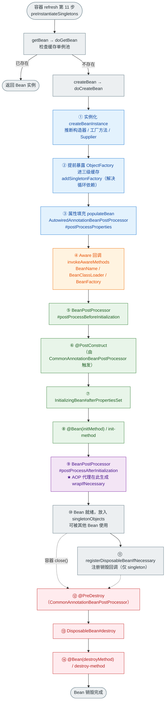
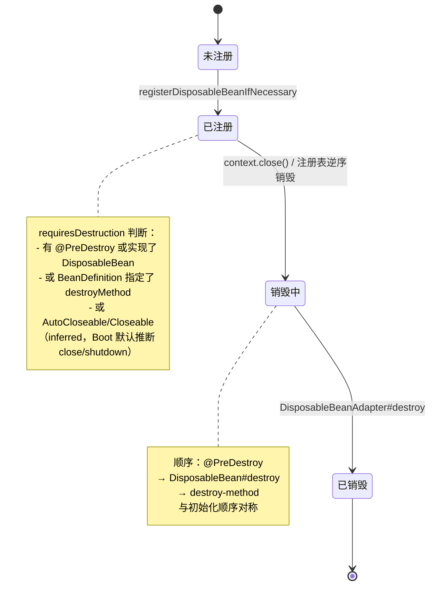
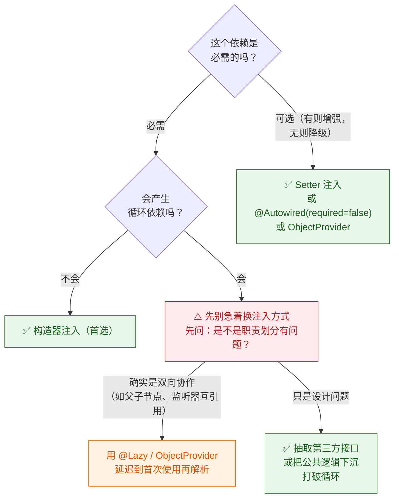
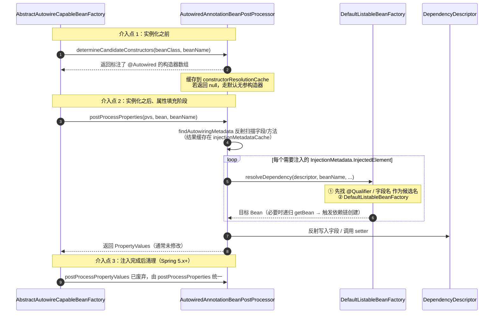
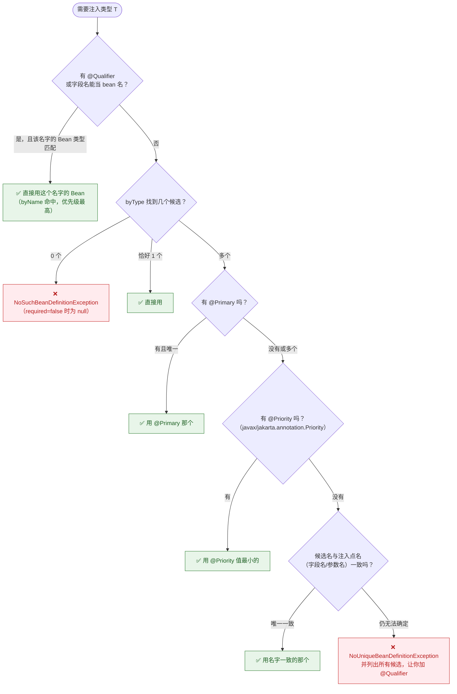
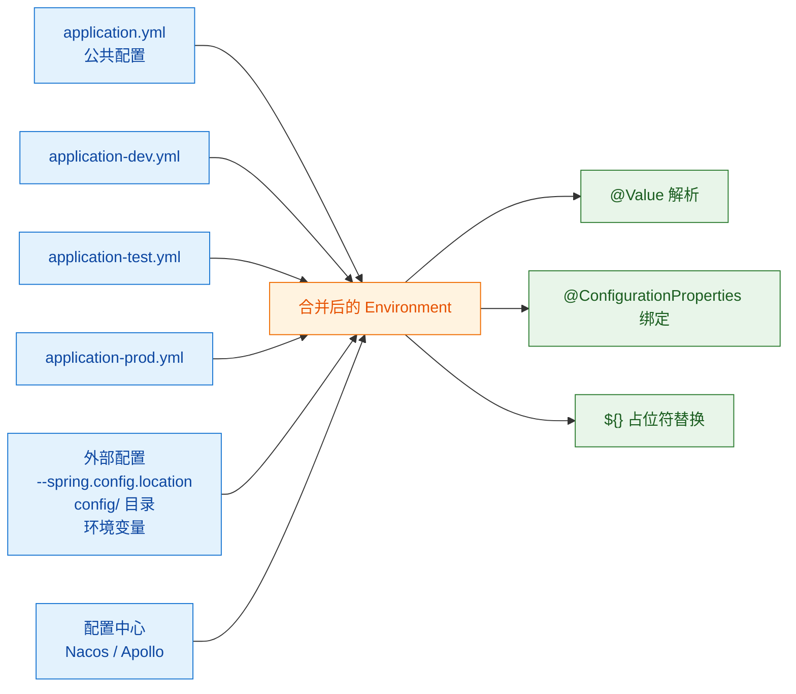
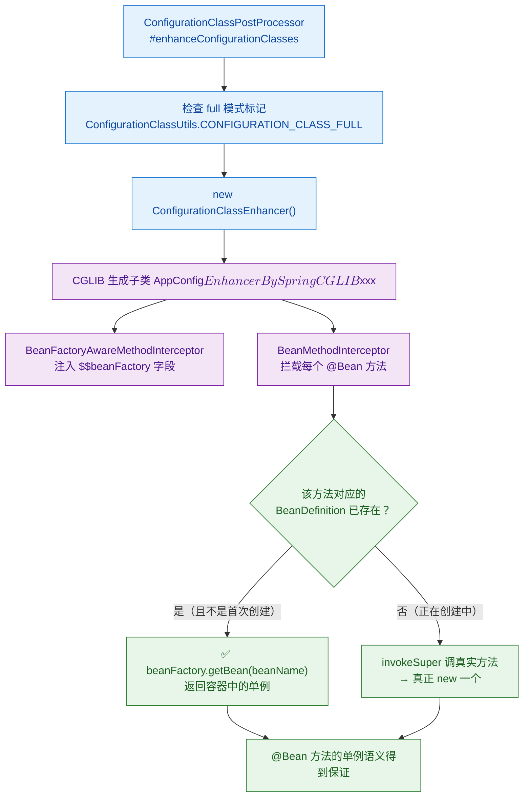

# 🌱 二、Bean 生命周期与依赖注入

> 本篇回答：一个 Bean 从"配方"到"成品"再到"销毁"到底经历了哪些阶段，为什么必须是这个顺序？`@PostConstruct`、`afterPropertiesSet`、`init-method` 谁先谁后，为什么这么设计？`@Autowired` 和 `@Resource` 到底差在哪？同类型多个 Bean 时 Spring 按什么规则挑？`ObjectProvider` / `@Lazy` 能解决什么别人解决不了的问题？单例 Bean 到底安不安全，`prototype` 注入进 `singleton` 为什么会"只注入一次"？
> 本文是**体系详解版**：讲 WHY、讲顺序背后的设计意图、讲真实事故；**方法名的速答骨架见 [[面试准备/技术面试题库/13-Spring源码专题]]**，循环依赖的完整推导见 [[面试准备/技术面试题库/14-Spring循环依赖专题]]。图纸见 [[8-spring/spring.excalidraw|spring 脑图]]。
> 系列导航：[[0-Spring总览]] · [[1-Spring架构与IoC容器]] · [[3-AOP原理与实战]] · [[4-声明式事务]] · [[5-SpringMVC请求全流程]] · [[6-SpringBoot自动装配]] · [[7-Spring进阶专题]] · [[8-Spring实战与踩坑]] · [[9-Spring面试高频题]]

---

## 一、Bean 的完整生命周期

### 1.1 全局流程图



> [!important] 三个阶段的分界线
> - **实例化（Instantiation）**：`createBeanInstance` —— **造出一个空壳对象**，字段全是默认值（null / 0）。
> - **属性填充（Populate）**：`populateBean` —— **把依赖灌进去**（`@Autowired`/`@Value` 在这一步生效）。
> - **初始化（Initialization）**：`initializeBean` —— **依赖已就位，此时才允许业务逻辑运行**（`@PostConstruct`、`afterPropertiesSet`、AOP 代理）。
>
> **这三步的先后顺序是整个生命周期的骨架。**理解它，就理解了 90% 的相关面试题。

### 1.2 为什么必须是这个顺序

#### 为什么实例化必须在属性填充之前？

因为**属性填充需要一个对象**。`populateBean(beanName, mbd, instanceWrapper)` 的第一个参数就是刚创建出来的实例。没有实例，往哪儿 set？

**唯一的例外**：`@Autowired` 标注在**构造器**上时，依赖必须在实例化**过程中**就解析好——这就是 `determineCandidateConstructors` 存在的意义（`AutowiredAnnotationBeanPostProcessor` 实现了 `SmartInstantiationAwareBeanPostProcessor`，在实例化**之前**被调用，用来决定用哪个构造器）。

#### 为什么属性填充必须在 Aware 回调之前？

**因为 Aware 回调的定位是"给 Bean 提供基础设施访问能力"，它是初始化阶段的开始。** `BeanNameAware` / `BeanClassLoaderAware` / `BeanFactoryAware` 在 `invokeAwareMethods` 里被调用，此刻 Bean 的业务依赖已经就位，可以安全地使用。

顺序上更准确的说法：`invokeAwareMethods` 只处理三个内建 Aware（在 `initializeBean` 开头）；而 `ApplicationContextAware`、`EnvironmentAware`、`ResourceLoaderAware` 等是通过 **`ApplicationContextAwareProcessor`（一个 BPP）** 在 `postProcessBeforeInitialization` 里调用的——**它们落在 BPP 的回调里，而不是 `invokeAwareMethods` 里**。

> [!tip] 这个细节能区分"看过源码"和"背过面经"
> | Aware 接口 | 触发位置 | 触发者 |
> | --- | --- | --- |
> | `BeanNameAware`、`BeanClassLoaderAware`、`BeanFactoryAware` | `initializeBean#invokeAwareMethods` | `AbstractAutowireCapableBeanFactory` 自己 |
> | `EnvironmentAware`、`EmbeddedValueResolverAware`、`ResourceLoaderAware`、`ApplicationEventPublisherAware`、`MessageSourceAware`、`ApplicationContextAware` | `postProcessBeforeInitialization` 阶段 | `ApplicationContextAwareProcessor`（BPP） |
> | `ServletContextAware`、`ServletConfigAware` | 同上 | `ServletContextAwareProcessor`（Web 容器注册） |
> | `LoadTimeWeaverAware` | `postProcessBeforeInitialization` | `LoadTimeWeaverAwareProcessor` |
> | `BeanFactoryAware` 的派发顺序 | `invokeAwareMethods` 里 **BeanName → BeanClassLoader → BeanFactory** | 固定顺序 |

#### 为什么 `@PostConstruct` 必须在 `afterPropertiesSet` 之前？

因为这是**"由外到内、从通用到具体"**的顺序设计：

| 顺序 | 方式 | 归属 | 设计意图 |
| --- | --- | --- | --- |
| 1 | `@PostConstruct` | **JSR-250 规范**（`jakarta.annotation`） | 标准注解，**不绑定 Spring**，同类代码搬到 Guice/CDI 也能用 |
| 2 | `InitializingBean#afterPropertiesSet` | **Spring 专有接口** | 提供"属性肯定填完了"的契约 |
| 3 | `init-method` / `@Bean(initMethod)` | **配置声明** | 不侵入代码，可为**第三方类**指定初始化方法 |

**为什么标准注解优先？** 因为规范优先于框架实现是 Java 生态的基本约定；同时，用户显式写的注解意图最明确。

**为什么 `InitializingBean` 优先于 `init-method`？** 因为接口是"代码内声明"（编译期确定、更可靠），`init-method` 是"配置声明"（字符串、可被外部覆盖、可指向第三方类）。**代码内的约定高于外部的配置**，外部配置作为最后的补充和覆盖手段。

> [!important] 三者的执行顺序（必答）
> ```
> @PostConstruct  →  InitializingBean#afterPropertiesSet  →  init-method / @Bean(initMethod)
> ```
> **为什么 `afterPropertiesSet` 一定在 `init-method` 之前？** 看 `invokeInitMethods` 的实现就明白：
> ```java
> protected void invokeInitMethods(String beanName, Object bean, RootBeanDefinition mbd) throws Throwable {
>     boolean isInitializingBean = (bean instanceof InitializingBean);
>     if (isInitializingBean && (mbd == null || !mbd.isExternallyManagedInitMethod("afterPropertiesSet"))) {
>         ((InitializingBean) bean).afterPropertiesSet();     // ← 先接口
>     }
>     if (mbd != null && bean.getClass() != NullBean.class) {
>         String initMethodName = mbd.getInitMethodName();
>         if (StringUtils.hasLength(initMethodName) && ...) {
>             invokeCustomInitMethod(beanName, bean, mbd);    // ← 后配置
>         }
>     }
> }
> ```
> **代码顺序就是硬证据**——`afterPropertiesSet()` 的调用写在 `invokeCustomInitMethod` 之前，无可争议。

**`@PostConstruct` 在哪执行？** 它**不在** `invokeInitMethods` 里，而是在 **`CommonAnnotationBeanPostProcessor#postProcessBeforeInitialization`** 中（它继承 `InitDestroyAnnotationBeanPostProcessor`，内部缓存了 `LifecycleMetadata`，反射调用所有 `@PostConstruct` 方法）。因为 BPP 的 before 回调在 `invokeInitMethods` 之前，所以 `@PostConstruct` 自然早于 `afterPropertiesSet`。

> [!warning] 一个真实的顺序陷阱：多个 `@PostConstruct` 的执行顺序
> - **同一个类里多个 `@PostConstruct` 方法**：顺序**不保证**（`InitDestroyAnnotationBeanPostProcessor` 内部用 `LifecycleElement` 列表，顺序来自反射 `getDeclaredMethods()`，**JVM 不保证返回顺序**）。**绝对不要写两个互相依赖的 `@PostConstruct`。**
> - **父类与子类的 `@PostConstruct`**：**父类的先执行**。因为 `LifecycleMetadata` 构建时会沿继承链向上收集（先 `superclass` 再本类），且父类的 `@PostConstruct` 更"基础"。
> - **`@PostConstruct` 与 `afterPropertiesSet` 混用**：不会重复执行，但没必要两个都写。**选一个，别混。**

#### 为什么 AOP 代理必须在 `postProcessAfterInitialization` 生成？

因为代理对象要取代原对象放进容器，而**代理必须包裹一个"初始化完成"的目标对象**：

- 如果代理在**初始化之前**生成，那么 `@PostConstruct` 会在原始对象上执行，而容器里放的是代理——**代理持有的 target 没有执行过初始化，状态是半成品**。
- 如果代理在**实例化时**生成（`postProcessAfterInstantiation`），此时字段还是 null，代理转发过去的方法会全部 NPE。
- 放在**初始化之后**，目标对象已经完全就绪，代理只需要做方法拦截。

**`wrapIfNecessary` 的具体位置**：`AbstractAutoProxyCreator#postProcessAfterInitialization` → 检查是否有匹配的 Advisor → 有则 `createProxy`（`JdkDynamicAopProxy` 或 `CglibAopProxy`）→ **返回代理对象**。`initializeBean` 的返回值就是它，最终写进 `singletonObjects` 的是**代理**，不是原始对象。

> [!danger] 由此推导出的经典问题："为什么 `@Transactional` 自调用不生效？"
> 因为容器里放的是**代理**，外部调用走代理 → 代理加事务 → 调 target 方法。
> 而 `this.methodB()` 是**目标对象内部的方法调用**，`this` 指向 target 自身而不是代理，**根本不会经过代理**，事务自然不生效。
> 解法：注入自己（`@Autowired private XxxService self;`）、`AopContext.currentProxy()`（需 `@EnableAspectJAutoProxy(exposeProxy = true)`）、或把方法拆到另一个 Bean。
> 详见 [[4-声明式事务]] 与 [[3-AOP原理与实战]]。

### 1.3 销毁阶段



| 顺序 | 方式 | 归属 |
| --- | --- | --- |
| 1 | `@PreDestroy` | JSR-250 标准注解 |
| 2 | `DisposableBean#destroy` | Spring 专有接口 |
| 3 | `destroy-method` / `@Bean(destroyMethod)` | 配置声明 |

**顺序与初始化完全对称**（标准 → 接口 → 配置），这是刻意设计的对称性。

**销毁的顺序**：`DefaultSingletonBeanRegistry#destroySingletons` **按注册顺序的逆序销毁**（`disposableBeans` 是 `LinkedHashMap`，`destroySingletons` 遍历时倒序）。所以**先创建的 Bean 后销毁**——和"依赖者先销毁、被依赖者后销毁"的直觉一致（因为依赖者通常后创建）。

> [!danger] `@PreDestroy` 的四条"不执行"条件（高频追问）
> **1. `prototype` 作用域的 Bean，销毁完全不由容器管理。**
> Spring 只对 singleton 注册销毁回调（`registerDisposableBeanIfNecessary` 里有 `if (!mbd.isSingleton()) return;`）。**prototype Bean 用完就丢，容器不持有引用，无法销毁。**
> **这是一条铁律**：任何 prototype Bean 如果持有需要释放的资源（连接、文件句柄、线程），**必须由调用方自己负责释放**，或者用 `@Bean(destroyMethod = "...")` 配合手动调用——但容器不会自动调。
> **正解**：需要资源释放的对象不要用 prototype；确实要用，就让客户端实现 `DisposableBean` 并自己调 `destroy()`，或者干脆用 `ObjectProvider` + 手动管理。
>
> **2. 容器没有被 `close()`。**
> `AnnotationConfigApplicationContext` 必须 `ctx.close()`（或用 try-with-resources）；`ConfigurableApplicationContext` 不 close，销毁回调永远不会跑。**Web 应用**由 `ContextLoaderListener#contextDestroyed` 触发；**Spring Boot** 由 `SpringApplication` 注册的 shutdown hook（或 Actuator 的 `/actuator/shutdown`）触发。
>
> **3. 进程被 `kill -9`。**
> SIGKILL 无法被捕获，shutdown hook 不执行。**这是"优雅停机"必须解决的场景**，也是 K8s 里 `preStop` + `terminationGracePeriodSeconds` 存在的原因。
>
> **4. Bean 已经被手动从容器移除，或容器启动失败中途销毁。**
>
> **还有一个隐蔽的**：`@PreDestroy` 方法如果是 `private`，**某些版本/JDK 组合下反射调用会失败**（`ReflectionUtils.makeAccessible` 一般能处理，但如果开了模块化强封装就可能失败）。**约定：`@PostConstruct` / `@PreDestroy` 一律声明为 `public`（或至少 `protected`）**，别用 `private`。

**`DisposableBeanAdapter` 的职责**（简述）：因为销毁方式有四种（`@PreDestroy` 注解、`DisposableBean` 接口、配置的 `destroyMethod`、`AutoCloseable` 推断），而销毁注册表只想存一个统一回调。`DisposableBeanAdapter` 就是这个**适配器**：它实现了 `DisposableBean`，内部记录了该 Bean 的**所有**销毁方式并按顺序依次调用，还负责：
- 处理 `destroyMethod` 名称推断（`inferredDestroyMethodName` 识别 `close` / `shutdown`）；
- 处理 `@Bean(destroyMethod = "")` 表示禁用推断；
- 处理 `destroyMethod` 的 `(inferred)` 前缀标记；
- 在 `DisposableBeanAdapter#destroy` 里捕获每个销毁方法的异常，避免一个失败阻塞其他 Bean 的销毁。

---

## 二、依赖注入的细节

### 2.1 三种注入方式对比与选型

| 维度 | 构造器注入 | Setter 注入 | 字段注入 |
| --- | --- | --- | --- |
| 语法 | 构造器参数 + `@Autowired`（单构造器可省） | `@Autowired` 标注 setter | `@Autowired` 标注字段 |
| `final` 支持 | ✅ | ❌ | ❌ |
| 对象完整性 | ✅ 创建即完整 | ❌ 可能半成品 | ❌ 可能半成品 |
| 单测 | ✅ `new X(mockA, mockB)` | 🟡 需 `new` + setter | ❌ 反射注入 |
| 循环依赖 | ❌ **启动失败（特性）** | ✅ 三级缓存可解 | ✅ 三级缓存可解 |
| 暴露依赖 | ✅ 构造器签名一览无余 | 🟡 分散 | ❌ 完全隐藏 |
| Spring 官方态度 | **推荐** | 可选依赖时用 | 不推荐 |
| 典型误用 | 构造器 15 个参数仍不拆分 | 拿 setter 注入必需依赖 | 生产代码大量使用 |

**选型决策**：



> [!important] 一句话原则
> **必需依赖用构造器；可选依赖用 Setter / `ObjectProvider`；永远不用字段注入（除非写测试）。**

### 2.2 @Autowired vs @Resource vs @Inject

| 维度 | `@Autowired` | `@Resource` | `@Inject` |
| --- | --- | --- | --- |
| 来源 | **Spring 专有**（`org.springframework.beans.factory.annotation`） | **JSR-250**（`jakarta.annotation`，JDK 6+ 曾内置） | **JSR-330**（`jakarta.inject`，需引入 `jakarta.inject-api`） |
| 装配策略 | **默认 byType**，类型不唯一时再退化为 byName（按字段名/参数名匹配） | **默认 byName**，找不到名字再 byType | 默认 byType（与 `@Autowired` 一致） |
| 能否指定名字 | 靠 `@Qualifier` 辅助 | **自带 `name` 属性** | 靠 `@Qualifier` 辅助（`@Named` 也可以） |
| `required` | ✅ `@Autowired(required = false)` | ❌ 没有（但 `name` 找不到时会退化到 byType，都找不到才报错） | ❌ 没有 |
| 可标注位置 | 构造器、方法、参数、字段、注解 | **字段、方法（setter）** | 构造器、方法、字段 |
| 优先级 | 三者同时存在于同一位置时会冲突；`@Autowired`/`@Inject` 由 `AutowiredAnnotationBeanPostProcessor` 处理，`@Resource` 由 `CommonAnnotationBeanPostProcessor` 处理 | —— | —— |
| 推荐场景 | Spring 项目 | 希望减少 Spring 耦合、按名字注入更直观 | 追求标准（但实际项目少用） |

> [!question] 必答：`@Autowired` 和 `@Resource` 的区别
> **三点：**
> **① 来源**：`@Autowired` 是 Spring 自己的；`@Resource` 是 JSR-250 标准（`jakarta.annotation.Resource`），不绑定 Spring。
> **② 装配策略**：`@Autowired` **默认按类型（byType）**，类型有多个候选时才会退化成按字段名/参数名匹配；`@Resource` **默认按名字（byName）**，名字取字段名或 setter 名，可用 `name` 属性显式指定，名字找不到才退化成 byType。
> **③ 处理者**：`@Autowired` 由 `AutowiredAnnotationBeanPostProcessor` 处理（它同时处理 `@Value` 和 `@Inject`）；`@Resource` 由 `CommonAnnotationBeanPostProcessor` 处理（它同时处理 `@PostConstruct`、`@PreDestroy`）。
>
> **实践建议**：Spring 项目里用 `@Autowired` + `@Qualifier` 更常见；想按名字注入更省事的时候用 `@Resource(name = "xxx")`。
>
> **一个常见混淆**：很多人说"`@Resource` 更安全，因为它按名字"，但他往往忘了——**`@Resource` 没有 `required=false`**，而且**名字匹配失败后会静默退化成类型匹配**，此时如果该类型有多个实现，照样报 `NoUniqueBeanDefinitionException`。**它不是"按名字注入"的银弹。**

### 2.3 @Autowired 的解析过程

**处理者：`AutowiredAnnotationBeanPostProcessor`**（一个 `InstantiationAwareBeanPostProcessor` + `SmartInstantiationAwareBeanPostProcessor`）。它有三个介入点：



| 介入点 | 方法 | 作用 |
| --- | --- | --- |
| 实例化前 | `determineCandidateConstructors` | 决定用哪个构造器（多个 `@Autowired` 构造器时按 `required` 和参数解析能力选） |
| 实例化后 / 属性填充 | `postProcessProperties` | ★ **真正做注入的地方** |
| 属性填充后 | `postProcessPropertyValues` | **Spring 5.1 起废弃**，逻辑合并进 `postProcessProperties` |
| 支持 `@Value` | 内部 `StringValueResolver` | `@Value("${...}")` 也走这个 BPP（`AutowiredFieldElement` 的 `resolveFieldValue` 区分 `@Value` 与 `@Autowired`） |

> [!important] `@Autowired` 与 `@Value` 共用一个 BPP
> 这是很多人不知道的：**`@Value("${db.url}")` 和 `@Autowired` 是同一个后处理器处理的**（`AutowiredAnnotationBeanPostProcessor` 的 `autowiredAnnotationTypes` 里同时包含 `Autowired.class` 和 `Value.class`）。
> **推论**：如果一个字段既标 `@Value` 又标 `@Autowired`，只有一个生效（先匹配到的）。**别这么写。**

### 2.4 同类型多个 Bean 时怎么办

**查找规则（优先级从高到低）**：



**四种解决手段的对比**：

| 手段 | 写法 | 作用范围 | 适用场景 |
| --- | --- | --- | --- |
| `@Primary` | 标在**实现类**上 | **全局**，所有按类型注入都优先选它 | 有一个"默认实现"（如默认 `DataSource`、默认 `ObjectMapper`） |
| `@Qualifier` | 标在**注入点**上，配合 bean 名 | **局部**，只影响这个注入点 | 大部分场景下的正解 |
| 字段名 / 参数名匹配 | 注入点名字 == bean 名 | 局部（最后的兜底） | 变量名恰好和 bean 名一致，省一个注解（**但很脆弱，改名就炸**） |
| `@Priority` | 标在**实现类**上 | 全局 | 很少用；实际项目基本用 `@Primary` |

> [!warning] `@Qualifier` 的三种写法，别写错
> ```java
> @Autowired @Qualifier("mysqlDataSource") private DataSource ds;      // ① 按 bean 名（最常用）
> @Qualifier("mysqlDataSource") private DataSource ds;                 // ② 只写 @Qualifier 也行
> @Autowired @Qualifier("main") private DataSource ds;                 // ③ 按 @Bean 方法名/自定义限定符
> ```
> **第 ① 种最稳**。另外还有**自定义限定符注解**的玩法（元注解 `@Qualifier`），适合大型项目消除字符串：
> ```java
> @Target({ElementType.FIELD, ElementType.PARAMETER, ElementType.METHOD})
> @Retention(RetentionPolicy.RUNTIME)
> @Qualifier                                    // ← 关键：元注解
> public @interface MysqlDataSource { }
> ```

> [!tip] 为什么 `@Primary` 是"全局"的，有时候反而是坑
> 如果 A 模块用 `@Primary` 标了 `mysqlDataSource` 为默认，B 模块想注入 `oracleDataSource` 时忘了写 `@Qualifier`，**它不会报错，而是静默拿到了 mysql 的数据源**——直到运行期连错库才发现。
> **建议**：有多个同类型实现时，**优先用 `@Qualifier` 显式指定，慎用 `@Primary`**；如果确实需要默认实现，就在评审时重点确认其他注入点是否都显式指定了。

### 2.5 required=false vs Optional vs @Nullable

| 写法 | 依赖不存在时的结果 | 依赖存在但类型不唯一时 | 语义 |
| --- | --- | --- | --- |
| `@Autowired`（默认） | **抛 `NoSuchBeanDefinitionException`** | 抛 `NoUniqueBeanDefinitionException` | 必需 |
| `@Autowired(required = false)` | 字段保持 **`null`** | 抛异常 | 可选，但"没有"和"有但为 null"无法区分 |
| `@Autowired Optional<T>` | `Optional.empty()` | 抛异常 | 可选，类型安全，**推荐** |
| `@Autowired @Nullable T` | 注入 **`null`**（`@Nullable` 告诉 Spring 这是合法的） | 抛异常 | 可选，但同样是 null |
| `@Autowired ObjectProvider<T>` | `getObject()` 抛 `NoSuchBeanDefinitionException`；`getIfAvailable()` 返回 `null`；`stream()` 返回空流 | **不报错**，`stream()` 返回所有候选 | 可选 + 多候选 + 延迟，**最强** |

> [!important] 关键差异：`required = false` 只影响"找不到"，不影响"找多了"
> 很多人以为 `@Autowired(required = false)` 能解决 `NoUniqueBeanDefinitionException`——**不能**。`required` 控制的是 `NoSuchBeanDefinitionException` 这一种情况。**类型不唯一仍然报错**，必须用 `@Qualifier` 或 `@Primary`。
>
> **推荐顺序**：能用 `Optional<T>` 就用 `Optional<T>`（语义清晰、调用方被迫处理空值）；需要枚举所有实现或延迟获取时用 `ObjectProvider<T>`；`required = false` 是最后手段。

### 2.6 ObjectProvider 与 @Lazy

#### 解决的问题

| 问题 | `ObjectProvider` | `@Lazy` |
| --- | --- | --- |
| 打破**构造器**注入的循环依赖 | ✅ | ✅ |
| 按需创建（不用就不创建） | ✅ | ✅ |
| 获取**所有**同类型实现（含顺序） | ✅ `stream()` / `orderedStream()` | ❌ |
| 获取**可能不存在**的 Bean 而不抛异常 | ✅ `getIfAvailable()` / `getIfUnique()` | ❌（`@Lazy` 只延迟，不存在还是抛） |
| 注入点语义 | ✅ `ObjectProvider<T> provider` 参数 | ✅ 在字段/参数上加注解 |

```java
// ① ObjectProvider：延迟 + 可选 + 多候选
@Service
public class OrderService {
    private final ObjectProvider<NotifyChannel> channels;
    public OrderService(ObjectProvider<NotifyChannel> channels) { this.channels = channels; }

    public void notifyAll(Order o) {
        // 拿到所有实现（按 @Order 排序），容器里没有就返回空流，不报错
        channels.orderedStream().forEach(c -> c.send(o));
        // 只想要一个且可能没有：
        NotifyChannel fallback = channels.getIfAvailable(() -> NoopChannel.INSTANCE);
    }
}

// ② @Lazy：在注入点生成一个代理，首次调用时才真正 getBean
@Service
public class A {
    @Lazy @Autowired private B b;                       // 字段级
    public A(@Lazy B b) { this.b = b; }                 // 构造器参数级（打破构造器循环依赖）
}
```

> [!important] `@Lazy` 打破构造器循环依赖的原理
> `ContextAnnotationAutowireCandidateResolver#getLazyResolutionProxyIfNecessary` 会为这个注入点创建一个**代理对象**注入进去。**这个代理不持有真实目标**，它内部记录了一个 `TargetSource`，**第一次调用方法时才去 `beanFactory.getBean()`**。
> 于是 `A` 的构造器拿到的是一个"壳"，能顺利构造完成；`B` 构造时同理；两者都构造完之后，谁先被使用，谁才去拿真实的对方。
>
> **代价**：① 注入的是代理，`a.getClass()` 是 `B$$EnhancerBySpringCGLIB`，**`instanceof` 和类型判断要小心**；② 首次调用有额外开销；③ **如果目标是 `final` 类或没有无参构造器，CGLIB 代理会失败**；④ **用 `@Lazy` 掩盖了循环依赖，等于把设计问题藏起来了**——用在确有双向协作语义的场景（如父子节点、注册中心回调），不要用来"让编译通过"。

> [!tip] 什么时候真正该用 `ObjectProvider` 而不是 `@Autowired`
> **① 可选依赖**：插件式扩展点（有就调用，没有就跳过）——比 `required = false` 好，因为不会拿到 null。
> **② 需要"所有实现"**：策略集合、责任链节点、`ApplicationRunner` 替代方案。
> **③ 打破循环依赖**：`ObjectProvider` 天然延迟，不会像 `@Lazy` 那样悄悄换成代理。
> **④ 避免启动顺序问题**：某个重资源 Bean（大数据量初始化）只在真正用到时才创建。
> **Spring Boot 自己就大量使用 `ObjectProvider`**——`ObjectProvider<HttpMessageConverters>`、`ObjectProvider<Validator>` 等等，就是靠它实现"用户没配就用默认、配了就用用户的、配了多个也不报错"。

---

## 三、Bean 作用域

### 3.1 六种作用域

| 作用域 | 说明 | 每个实例范围 | 创建时机 | 销毁时机 | 线程安全 |
| --- | --- | --- | --- | --- | --- |
| `singleton`（**默认**） | 容器内唯一实例 | 每个容器 1 个 | 容器启动时（`preInstantiateSingletons`）或首次 `getBean`（懒加载） | 容器 `close()` 时 | **取决于有无可变状态** |
| `prototype` | 每次获取新实例 | 每次 `getBean` 1 个 | 每次 `getBean` 时 | **容器不管理**（调用方负责） | 每个线程有独立实例，天然安全 |
| `request` | 每个 HTTP 请求 1 个 | 每个请求 | 请求进入时 | 请求结束时 | ✅（同一请求内） |
| `session` | 每个 HTTP Session 1 个 | 每个会话 | 会话首次使用时 | 会话失效时 | ⚠️ 同一会话的并发请求仍有竞态 |
| `application` | 每个 ServletContext 1 个 | 每个 Web 应用 | 应用启动时 | 应用关闭时 | 同 singleton（跨容器） |
| `websocket` | 每个 WebSocket 会话 1 个 | 每个 WS 会话 | 握手完成时 | 连接关闭时 | ⚠️ 同 session |

> [!warning] 后四种"Web 作用域"的配置前提
> `request`/`session`/`application`/`websocket` **不是 Spring Core 内建的**，它们通过 `WebApplicationContextUtils.registerWebApplicationScopes` 注册到 `ConfigurableBeanFactory#registerScope`。**在非 Web 容器（比如 `AnnotationConfigApplicationContext` 的单元测试）里使用它们，会直接抛 `IllegalStateException: No Scope registered for scope name 'request'`。**
> 正解：单元测试用 `@WebAppConfiguration` + `MockMvc`，或者干脆把这些 Bean 设计成方法参数（`HttpServletRequest` 直接作为 Controller 方法参数，天然是请求级的）。

**作用域的底层实现**：`Scope` 接口（`get`/`remove`/`registerDestructionCallback`/`getConversationId`）。

```java
public interface Scope {
    Object get(String name, ObjectFactory<?> objectFactory);   // 从作用域存储里取，没有就创建
    Object remove(String name);
    void registerDestructionCallback(String name, Runnable callback);
    Object resolveContextualObject(String key);
    String getConversationId();
}
```

| 作用域名 | 实现类 | 存储位置 |
| --- | --- | --- |
| `singleton` | **无 `Scope` 实现**（特殊处理） | `DefaultListableBeanFactory#singletonObjects` |
| `prototype` | **无 `Scope` 实现**（特殊处理，`createBean` 直接返回不缓存） | 无 |
| `request` | `RequestScope` | `RequestAttributes#setAttribute(SCOPE_REQUEST)` |
| `session` | `SessionScope` | `RequestAttributes#setAttribute(SCOPE_SESSION)` |
| `application` | `ServletContextScope` | `ServletContext#setAttribute` |
| `websocket` | `WebSocketScope` | WebSocket 会话属性 |
| **自定义** | 实现 `Scope` + `ConfigurableBeanFactory#registerScope` | 自定 |

> [!tip] 自定义作用域的实战用途
> **线程级作用域**（比如多租户上下文、请求追踪 ID、`ThreadLocal` 缓存）：实现一个基于 `ThreadLocal` 的 `Scope` 并 `registerScope("thread", new ThreadScope())`，就能写出 `@Scope("thread")` 的 Bean。
> **"Refresh 作用域"**：`@RefreshScope`（Spring Cloud）本质就是自定义作用域 + `RefreshScopeRefreshedEvent` 触发 `destroy` 后重建——**这是"配置热更新不重启"的实现原理**。

### 3.2 singleton Bean 是线程安全的吗？

> [!danger] 结论先行：**Spring 不保证、也无法保证单例 Bean 的线程安全。**
> Spring 只保证**一个实例**，它**不管这个实例的字段会不会被并发修改**。
> **是否线程安全，取决于你有没有可变状态。**

```java
// ❌ 反例：有状态的单例 Controller
@RestController
public class OrderController {
    private Long currentUserId;                     // ← 成员变量 = 共享可变状态
    private final List<Order> buffer = new ArrayList<>();

    @GetMapping("/orders")
    public List<Order> list(@RequestParam Long userId,
                            @RequestParam(required = false) Long lastId) {
        this.currentUserId = userId;                // 线程 A 写入
        if (lastId != null) {
            // 线程 B 已经把 currentUserId 覆盖成别人了
            return orderService.queryAfter(currentUserId, lastId);   // ← 越权返回他人订单！
        }
        return orderService.queryByUser(currentUserId);
    }
}
```

**这个反例的真实后果不是"数据错乱"这么轻**——如果 `currentUserId` 代表租户 ID 或用户 ID，**并发下 A 用户会看到 B 用户的数据，是严重的越权漏洞**。这类 bug 在单机压测下几乎必现，但人工点击测不出来。

```java
// ✅ 正解 1：无状态（首选）
@RestController
public class OrderController {
    private final OrderService orderService;        // final 且无状态，安全
    public OrderController(OrderService orderService) { this.orderService = orderService; }

    @GetMapping("/orders")
    public List<Order> list(@RequestParam Long userId,
                            @RequestParam(required = false) Long lastId) {
        return lastId == null
                ? orderService.queryByUser(userId)
                : orderService.queryAfter(userId, lastId);   // 全部走方法参数，方法栈是线程私有的
    }
}
```

```java
// ✅ 正解 2：确实需要状态时，用 ThreadLocal（且必须 remove！）
@Component
public class TenantContext {
    private static final ThreadLocal<Long> TENANT = new ThreadLocal<>();
    public static void set(Long id) { TENANT.set(id); }
    public static Long get() { return TENANT.get(); }
    public static void clear() { TENANT.remove(); }     // ★ 必须清理
}
// 在拦截器里：preHandle → set，afterCompletion → clear
```

```java
// ✅ 正解 3：确实需要可变状态时，用并发容器 / 原子类
@Component
public class MetricsCollector {
    private final LongAdder requestCount = new LongAdder();       // 高并发计数器
    private final Map<String, Long> perApi = new ConcurrentHashMap<>();
    private final AtomicReference<Config> config = new AtomicReference<>();
    public void inc() { requestCount.increment(); }
}
```

**判断一个单例 Bean 是否安全的检查清单**：

| 检查项 | 安全 | 危险 |
| --- | --- | --- |
| 字段是否 `final` + 不可变对象 | ✅ | —— |
| 字段类型是 `String`/`Integer`/`LocalDate`（不可变） | ✅ | —— |
| 字段是 Service / DAO / Mapper（无状态） | ✅ | —— |
| 字段是 `SimpleDateFormat` | ❌ **典型危险**（内部 Calendar 非线程安全） | 用 `DateTimeFormatter` 代替 |
| 字段是 `ArrayList`/`HashMap` 且会被写 | ❌ | 用 `ConcurrentHashMap` / `CopyOnWriteArrayList` |
| 字段是基本类型的累加器 | ❌ | 用 `LongAdder` / `AtomicInteger` |
| 字段是缓存的 `HttpServletRequest` | ❌ **严重** | 直接作为方法参数 |
| 字段是 `ApplicationContext` | ⚠️ 一般安全（容器本身线程安全） | —— |

> [!important] 面试标准答法
> "**Spring 的 singleton 只是'容器内单实例'，不等于'线程安全'。** 是否安全完全取决于 Bean 有没有可变状态。Spring MVC 的 `Controller`、`Service`、`DAO` 默认都是单例，所以**正确写法是把所有状态都放到方法局部变量或方法参数里，让 Bean 保持无状态**。
> 如果确实需要状态，有三种处理：① 改用 `prototype`/`request` 作用域；② 用 `ThreadLocal`（注意必须 `remove` 避免线程池串数据和内存泄漏）；③ 用 `ConcurrentHashMap`/`LongAdder` 等并发安全结构。
> 一个经典陷阱是 `SimpleDateFormat` 作为成员变量——它在单例里必然出错，应换成 `DateTimeFormatter`。"

### 3.3 prototype 注入 singleton 的问题与解法

```java
// ❌ 典型错误：以为每次调用都能拿到新的 prototype
@Component
@Scope("prototype")
public class OrderTask {
    private final long createdAt = System.currentTimeMillis();
    public long getCreatedAt() { return createdAt; }
}

@Component
public class TaskRunner {
    @Autowired private OrderTask task;              // ← 只注入一次！
    public long run() { return task.getCreatedAt(); }
}
```

**现象**：`TaskRunner` 是单例，它只在**创建时注入一次** `OrderTask`。之后每次 `taskRunner.run()` 返回的 `createdAt` **永远是同一个值**——`OrderTask` 实际上退化成了单例。

> [!important] 为什么？
> **注入只发生一次（`populateBean`），发生在 `TaskRunner` 创建的那一刻。** prototype 的语义是"每次向容器**索取**时创建新的"，而 `@Autowired` 只索取了一次。**"注入"和"每次获取"是两回事**——这是理解这个问题的关键。

**三种正解**：

```java
// ✅ 解法 1：ObjectProvider（推荐，无侵入、不依赖代理）
@Component
public class TaskRunner {
    private final ObjectProvider<OrderTask> taskProvider;
    public TaskRunner(ObjectProvider<OrderTask> taskProvider) { this.taskProvider = taskProvider; }
    public long run() { return taskProvider.getObject().getCreatedAt(); }   // 每次都是新的
}

// ✅ 解法 2：@Lookup（Spring 原生，但要求方法可被 CGLIB 重写）
@Component
public abstract class TaskRunner {                   // 类必须是 abstract（或非 final）
    public long run() { return createTask().getCreatedAt(); }

    @Lookup("orderTask")
    protected abstract OrderTask createTask();       // 容器重写此方法 → 每次 getBean
}
// @Lookup 原理：AutowiredAnnotationBeanPostProcessor 的 LookupOverride
// 被 CglibSubclassingInstantiationStrategy 处理，为该方法生成
// "return beanFactory.getBean(name)" 的实现

// ✅ 解法 3：注入 ApplicationContext（最简单，但侵入容器 API）
@Component
public class TaskRunner {
    @Autowired private ApplicationContext ctx;
    public long run() { return ctx.getBean(OrderTask.class).getCreatedAt(); }
}

// ✅ 解法 4（不推荐但常见）：让 TaskRunner 自己也变成 prototype
//    —— 只适用于调用方本身就是短生命周期的场景，会引发连锁的 prototype 扩散
```

| 解法 | 优点 | 缺点 | 推荐度 |
| --- | --- | --- | --- |
| `ObjectProvider` | 无侵入、类型安全、不依赖代理、能拿多个 | 需要改调用方签名 | ★★★★★ |
| `@Lookup` | Spring 原生、调用方代码最干净 | **类必须非 final、方法必须可重写（不能用 private/static/final）**；依赖 CGLIB；单测时抽象方法不好 mock | ★★★ |
| `ApplicationContext` | 直观、什么都能拿 | **侵入容器 API**（类被迫认识 Spring）；单测必须 mock 容器 | ★★ |
| `@Scope(proxyMode = TARGET_CLASS)` | 对调用方完全透明 | 生成代理、有额外开销，容易掩盖真正的设计问题 | ★★ |

> [!warning] `@Scope(value="prototype", proxyMode=ScopedProxyMode.TARGET_CLASS)` 的坑
> 这个写法会让容器注入一个**代理**，每次调用方法时代理去 `getBean` 拿新的真实对象。看起来完美，但有三个坑：
> ① **代理对象的方法调用才触发重新获取**，如果你注入的是接口类型而目标是类，需要 `TARGET_CLASS` 而不是 `INTERFACES`；
> ② **`getClass()` / `instanceof` / 直接访问字段 都拿不到真实对象**；
> ③ **它掩盖了"为什么需要新对象"的设计问题**——如果一个 Bean 需要每次都新建，通常说明它承载的是"一次任务"而不是"一个组件"，那它根本不该是 Spring Bean。

> [!question] 那反过来，prototype 注入 prototype、singleton 注入 singleton 呢？
> - **singleton → singleton**：正常，两个都是单例，注入一次即可。✅
> - **singleton → prototype**：**问题（本节讨论的）**。❌
> - **prototype → singleton**：**正常**。prototype Bean 每次新建时，都会重新走一遍注入流程，拿到的是同一个单例。✅
> - **prototype → prototype**：正常，但要注意**每次都新建一整条链**，可能引发对象爆炸。
> **只有"长生命周期持有短生命周期"这一种组合有问题**，规律和"单例持有请求对象"是一样的。

---

## 四、条件装配与 Profile

### 4.1 @Profile

```java
@Configuration
@Profile("prod")
public class ProdDataSourceConfig {
    @Bean public DataSource dataSource() { return new HikariDataSource(prodConfig()); }
}

@Service
@Profile({"dev", "test"})                    // 可以多个
public class MockSmsService implements SmsService { ... }
```

```yaml
# application.yml
spring:
  profiles:
    active: dev                    # 方式 1：配置文件指定
---
spring:
  config:
    activate:
      on-profile: prod
```

```bash
java -jar app.jar --spring.profiles.active=prod        # 方式 2：命令行（优先级最高）
export SPRING_PROFILES_ACTIVE=prod                     # 方式 3：环境变量
```

> [!important] `@Profile` 是 `@Conditional` 的特例
> `@Profile` 底层就是 `@Conditional(ProfileCondition.class)`，`ProfileCondition` 读取 `Environment#acceptsProfiles`。
> **推论**：`@Profile` 也能用在 `@Bean` 方法上，也能和 `@Conditional` 组合；并且**`@Profile` 的判断发生在 BeanDefinition 注册阶段**（`ConfigurationClassPostProcessor` 解析时通过 `ConditionEvaluator` 判定），**不满足条件的 `@Configuration` 类根本不会被解析**——这比"注册了再排除"更高效。

**Profile 的实践踩坑**：

| 坑 | 现象 | 正解 |
| --- | --- | --- |
| `spring.profiles.active` 不生效 | 激活了错误的 profile | 优先级：命令行 > 环境变量 > 配置文件；`spring.profiles.active` 在 profile-specific 文档里**不能覆盖** |
| `@Profile` 与 `@ConditionalOnProperty` 混用顺序不清 | 两类条件互相打架 | 两者都基于 `Condition`，**同一层级上的多个条件是与（AND）的关系，都满足才生效** |
| 多 profile 组合 | `dev,mysql` 这种组合，配置合并顺序不明 | **后面的 profile 覆盖前面的**（`spring.profiles.active=dev,mysql` 时 mysql 优先） |
| profile 未指定时的默认 | 什么都没配 | `spring.profiles.default` 指定默认值；`@Profile("!prod")` 表示"非 prod 时生效" |

> [!danger] 生产环境最危险的一条：`@Profile("!prod")` 会把测试代码带上线
> 如果激活的 profile 是空的（比如部署时忘了设 `SPRING_PROFILES_ACTIVE`），`!prod` 条件**成立**——那些本该只在开发期存在的 Mock、内存数据库、跳过鉴权的配置**全都生效了**。
> **实践建议**：① 生产部署脚本里必须显式设置 `spring.profiles.active=prod`；② **用正向条件（`@Profile("dev")`）而不是负向条件（`@Profile("!prod")`）**；③ 在 `application-prod.yml` 里加 `@PostConstruct` 校验（比如断言数据源 URL 不含 `localhost`）。

### 4.2 @ConditionalOnProperty 与其他条件

```java
@Configuration
@ConditionalOnProperty(
    prefix = "feature.new-order",
    name = "enabled",
    havingValue = "true",       // 默认就是 "true"
    matchIfMissing = false      // 配置缺失时是否生效，默认 false
)
public class NewOrderFeatureConfig { ... }
```

```yaml
feature:
  new-order:
    enabled: true
```

| 条件注解 | 判断依据 | 典型场景 |
| --- | --- | --- |
| `@ConditionalOnProperty` | 配置项值 | **功能开关 / 灰度**（配合配置中心可动态切换，但注意 `@Conditional` 只在**启动时**判断一次，运行期改配置不会重新装配！） |
| `@ConditionalOnBean` / `@ConditionalOnMissingBean` | 容器中的 Bean | Boot 自动配置的"用户优先" |
| `@ConditionalOnClass` | classpath | 依赖存在才装配 |
| `@ConditionalOnWebApplication(type = SERVLET/REACTIVE)` | 应用类型 | Web/非 Web 分流 |
| `@ConditionalOnExpression("${a} && ${b}")` | SpEL | 复杂组合条件 |

> [!warning] `@Conditional` 的执行时机——"动态开关"的常见误解
> **`@Conditional` 只在容器启动、解析 `BeanDefinition` 时判断一次。**运行期改了配置项，**Bean 不会因此被创建或移除**。
> **正解**：
> - 需要**方法级**的运行期开关 → 在方法里 `if (!enabled) return;`（读配置或用 `@Value` + `@RefreshScope`）。
> - 需要**真正动态换 Bean** → 用 `@RefreshScope`（Spring Cloud）、自定义作用域、或者干脆用策略模式的 `Map<String, Handler>` 在运行期选实现。
> - 用 `@ConditionalOnProperty` 做灰度开关，**只能靠重启生效**，别在需求评审时承诺"配置中心一改就切"。

### 4.3 多环境配置的实践



**配置优先级（高 → 低，Spring Boot 2.4+）**：

| 优先级 | 来源 |
| --- | --- |
| 1（最高） | 命令行参数 `--spring.profiles.active=prod` |
| 2 | `SPRING_APPLICATION_JSON` |
| 3 | `ServletConfig` / `ServletContext` 参数 |
| 4 | JNDI |
| 5 | `System.getProperties()` |
| 6 | 操作系统环境变量 |
| 7 | `random.*` |
| 8 | **profile-specific 外部配置**（`application-{profile}.yml`，jar 同级 `config/` 目录） |
| 9 | **profile-specific 打包内配置** |
| 10 | 外部 `application.yml` |
| 11 | 打包内 `application.yml`（最低） |

> [!important] 三个实践要点
> **① 敏感信息不进代码库**：数据库密码、密钥用环境变量或配置中心，`application-prod.yml` 里写 `${DB_PASSWORD}`，配合 `${DB_PASSWORD:default}` 提供兜底（但**生产不要给密码兜底值**，宁可启动失败）。
> **② 用 `@ConfigurationProperties` 而不是散落的 `@Value`**：前者类型安全、支持嵌套对象、支持 JSR-303 校验（`@Validated` + `@NotBlank`），**启动时就能校验必填项**，比 `@Value` 好得多。
> **③ `@Value` 在构造器里用不了**：`@Value` 的注入发生在属性填充阶段，构造器执行时字段还是 null。需要在构造器里用配置值，要么改用 `@ConfigurationProperties` 的构造器绑定（`@ConstructorBinding`），要么把配置作为构造器参数（`public X(@Value("${a}") String a)`）。

---

## 五、@Configuration vs @Component

### 5.1 为什么 @Bean 方法调用能返回同一个实例

```java
@Configuration                     // ← Full 模式，会被 CGLIB 增强
public class AppConfig {
    @Bean public DataSource dataSource() { return new HikariDataSource(); }
    @Bean public OrderDao orderDao() {
        return new OrderDaoImpl(dataSource());   // 方法调用，却拿到容器里的那个
    }
}
```

**底层机制**：



**`BeanMethodInterceptor` 的核心逻辑**（简化）：
1. 通过方法名（或 `@Bean(name=...)`）确定 beanName；
2. 检查容器里是否已有该 bean → 有就返回（**这就是单例的来源**）；
3. 没有则 `invokeSuper` 走真实方法体，并把返回值注册到容器；
4. 特判 `BeanFactoryPostProcessor` 类型的 `@Bean` 方法——**这类必须返回新实例**（否则会被提前创建，见 [[1-Spring架构与IoC容器]] 的"BPP 过早实例化"坑）。

> [!important] CGLIB 增强的本质是"让 Java 方法调用语义变成容器查找语义"
> 正常 Java 里 `dataSource()` 就是一次调用，每次都 new。CGLIB 子类把每个 `@Bean` 方法重写成"先查容器"。**这是 Spring 用字节码技术"修正"Java 语言语义的典型案例**，也是为什么 `@Configuration` 类不能是 `final`、`@Bean` 方法不能是 `final`/`private`。

### 5.2 proxyBeanMethods = false 的行为差异

```java
@Configuration(proxyBeanMethods = false)   // Lite 模式
public class LiteConfig {
    @Bean public DataSource dataSource() { return new HikariDataSource(); }
    @Bean public OrderDao orderDao() {
        DataSource ds = dataSource();      // ❌ 真的 new 了第二个 DataSource！
        return new OrderDaoImpl(ds);
    }
}
```

| 维度 | `@Configuration`（Full） | `@Configuration(proxyBeanMethods=false)`（Lite） | `@Component` + `@Bean` |
| --- | --- | --- | --- |
| CGLIB 增强 | ✅ | ❌ | ❌ |
| `@Bean` 方法互调 | 走容器，返回单例 | **直接 new**，可能多实例 | **直接 new**，可能多实例 |
| 类能否 `final` | ❌ | ✅ | ✅ |
| 启动性能 | 需生成 CGLIB 类 | 快 | 快 |
| Boot 自动配置 | 用 Lite | ✅ 默认 | —— |
| 正确写法 | 互调也行，但推荐参数注入 | **必须参数注入** | **必须参数注入** |

> [!danger] `@Component` + `@Bean` 是最容易被忽视的错误写法
> 很多人为了"少写一个 `@Configuration`"，用 `@Component` 标注配置类。**此时 CGLIB 增强不会发生**（`ConfigurationClassUtils` 只把带 `@Configuration` 的类标记为 Full），行为等价于 Lite 模式——`@Bean` 方法互调会 new 出多个实例。
> **判断标准**：只要配置类里出现 `@Bean` 方法**互相调用**，就必须用 `@Configuration`；否则用哪个都行，但**统一用 `@Configuration` 更安全**。

> [!example] 一个能跑起来的复现实验
> ```java
> @Component                                  // ← 故意用 @Component
> public class BadConfig {
>     @Bean public DataSource ds1() { System.out.println("创建 ds1"); return new HikariDataSource(); }
>     @Bean public DataSource ds2() { return ds1(); }        // 又创建一次！
> }
> ```
> 启动日志里 `创建 ds1` 会打印**两次**，控制台还会有一个 HikariCP 的连接池初始化日志出现两次。**连接池数量翻倍 → 数据库连接数被打爆**，是这类问题最典型的生产事故。
> 把 `@Component` 换成 `@Configuration`，或者把 `ds2()` 改成 `public DataSource ds2(DataSource ds1) { return ds1; }`，问题即解决。

### 5.3 正确写法：参数注入永远是对的

```java
@Configuration
public class GoodConfig {
    @Bean
    public DataSource dataSource() { return new HikariDataSource(); }

    @Bean
    public OrderDao orderDao(DataSource dataSource) {       // ✅ 参数注入
        return new OrderDaoImpl(dataSource);
        // 无论 Full 还是 Lite 模式，语义都正确
        // 不依赖 CGLIB，单测时也能直接调 orderDao(mockDs)
        // 依赖关系显式，IDE 能跳转
    }
}
```

> [!tip] 为什么说参数注入是"唯一到处都对"的写法
> | 场景 | `dataSource()` 互调 | `orderDao(DataSource)` 参数注入 |
> | --- | --- | --- |
> | Full 模式 | ✅ 正确 | ✅ 正确 |
> | Lite 模式 | ❌ 多实例 | ✅ 正确 |
> | `@Component` 配置类 | ❌ 多实例 | ✅ 正确 |
> | 单元测试直接调用 | ❌ 无法传 mock | ✅ 可传 mock |
> | 配置文件被 static 方法调用 | ❌ | ✅ |
> **除了"少打几个字符"，参数注入在每一个维度上都不劣于方法互调。**

---

## 六、必答 callout 汇总

> [!question] Q1：Bean 的完整生命周期？
> **实例化 → 属性填充 → Aware 回调 → BPP 前置 → `@PostConstruct` → `afterPropertiesSet` → `init-method` → BPP 后置（AOP 代理生成）→ 就绪入单例池 → 容器关闭 → `@PreDestroy` → `destroy` → `destroy-method`。**
> **三个必须点出的"为什么"**：
> ① **实例化先于属性填充**，因为填充需要一个对象；例外是构造器注入，它在实例化过程中就解析依赖（`determineCandidateConstructors`）。
> ② **AOP 代理在 BPP 后置生成**，因为代理必须包裹一个初始化完成的目标对象，否则 `@PostConstruct` 会在 target 上执行而容器里放的是代理，状态不一致。
> ③ **初始化顺序是 `@PostConstruct` → `afterPropertiesSet` → `init-method`**，遵循"标准规范 > 框架接口 > 外部配置"，且 `invokeInitMethods` 的源码顺序就是硬证据。
> **补充**：`registerDisposableBeanIfNecessary` 只对 singleton 注册销毁回调，**prototype 的销毁容器不管**。

> [!question] Q2：三种注入方式怎么选？
> **必需依赖 → 构造器注入**（不可变、非空、易测、依赖显式、循环依赖启动即暴露）。
> **可选依赖 → Setter 注入或 `ObjectProvider`**（`ObjectProvider` 更好，因为不会拿到 null 且能拿多个）。
> **不推荐字段注入**（无法 final、单测要反射、隐藏依赖、`@PostConstruct` 之外的时序问题、掩盖循环依赖）。
> **加分回答**：构造器注入解决不了循环依赖，但这是**优点**——循环依赖是设计缺陷，应该在启动期失败而不是靠三级缓存糊过去。

> [!question] Q3：singleton Bean 线程安全吗？
> **Spring 不保证。Spring 只保证"容器内一个实例"，不保证"字段并发安全"。**
> 是否安全取决于**有没有可变状态**。`Controller`/`Service`/`DAO` 默认都是单例，所以正确写法是**保持无状态**——所有数据走方法参数和局部变量（方法栈是线程私有的）。
> 需要状态时：① 换 `prototype`/`request` 作用域；② `ThreadLocal`（**必须 `remove`**，否则线程池场景下会串数据 + 内存泄漏）；③ `ConcurrentHashMap` / `LongAdder` / `AtomicReference`。
> **经典反例**：`SimpleDateFormat` 作成员变量（内部 `Calendar` 非线程安全）→ 换 `DateTimeFormatter`。

> [!question] Q4：prototype 注入进 singleton 会怎样？
> **只会注入一次，prototype Bean 退化成事实上的单例。**
> **原因**：注入发生在单例创建时的 `populateBean`，只执行一次；prototype 的语义是"每次向容器索取都新建"，而 `@Autowired` 只索取了一次。
> **解法**：① `ObjectProvider#getObject()`（**首选**，无侵入）；② `@Lookup`（类和方法都不能 final/private，靠 CGLIB 重写）；③ `ApplicationContext#getBean`（侵入容器 API）；④ `@Scope(proxyMode = TARGET_CLASS)`（透明但有代理开销，且掩盖设计问题）。
> **反面情况**：`prototype → singleton`、`singleton → singleton`、`prototype → prototype` 都没问题。**只有"长生命周期持有短生命周期"才有问题。**

> [!question] Q5：@Autowired(required = false) 和 Optional 有什么区别？
> 功能上都能处理"Bean 不存在"，但 **`required = false` 拿到的是 `null`，`Optional<T>` 拿到的是 `Optional.empty()`**，后者强制调用方处理空值、语义更清晰。
> **关键区别在"找多了"的场景**：`required = false` **不能**解决 `NoUniqueBeanDefinitionException`——`required` 只管"找不到"，不管"找太多"。
> **`ObjectProvider` 才是最强形态**：既能处理不存在（`getIfAvailable()`），又能处理多个（`stream()`），还天然延迟。Spring Boot 内部大量使用它。

> [!question] Q6：`@Bean` 方法互相调用为什么能返回同一个实例？
> 因为 `@Configuration` 类被 `ConfigurationClassPostProcessor#enhanceConfigurationClasses` 标记为 **Full 模式**并用 **CGLIB 生成子类**，子类里每个 `@Bean` 方法都被 `BeanMethodInterceptor` 拦截：**先查容器有没有，有就返回容器里的，没有才走真实方法**。
> **所以 `@Configuration` 类不能是 `final`，`@Bean` 方法不能是 `private`/`final`。**
> 一旦 `proxyBeanMethods = false`（Lite 模式）或者用 `@Component` 代替 `@Configuration`，这层代理消失，`dataSource()` 就真的会 new 第二个连接池。
> **最稳写法是参数注入**：`public OrderDao orderDao(DataSource ds)` —— 在 Full/Lite/单测三种场景下语义一致。

---

## 七、自查清单

- [ ] 能完整画出 Bean 生命周期流程图（含三大阶段分界线）
- [ ] 能说出 `invokeAwareMethods` 只处理 3 个 Aware，其余 Aware 在 `ApplicationContextAwareProcessor` 里
- [ ] 能背出 `@PostConstruct` → `afterPropertiesSet` → `init-method` 并解释为什么这样排
- [ ] 能解释为什么 AOP 代理在 `postProcessAfterInitialization` 生成（并用它推导自调用失效）
- [ ] 能说出销毁顺序与初始化顺序的对称性
- [ ] 能列出 `@PreDestroy` 不执行的 4 种情况（尤其 prototype）
- [ ] 能说出 `DisposableBeanAdapter` 的 3 个职责
- [ ] 能针对必需/可选/循环依赖三种场景给出注入方式选择
- [ ] 能说清 `@Autowired`（byType）vs `@Resource`（byName）的三个差异
- [ ] 能说出 `AutowiredAnnotationBeanPostProcessor` 的三个介入点，并知道它同时处理 `@Value`
- [ ] 能背出同类型多 Bean 的判定链：`@Qualifier`/名字 → 唯一 → `@Primary` → `@Priority` → 名字兜底
- [ ] 能解释 `required=false` 不能解决 `NoUniqueBeanDefinitionException`
- [ ] 能说出 `ObjectProvider` 的 4 类适用场景，以及 Spring Boot 自己的用法
- [ ] 能解释 `@Lazy` 打破构造器循环依赖的原理与三个代价
- [ ] 能列出 6 种作用域并说明各自的创建/销毁/线程安全
- [ ] 能举出"有状态单例 Controller"的具体事故并给出 3 种正解
- [ ] 能解释 prototype 注入 singleton 退化的原因与 4 种解法
- [ ] 能说出 `@Conditional` 只在启动时判断一次的推论
- [ ] 能解释 `@Configuration` CGLIB 增强的拦截逻辑（`BeanMethodInterceptor`）
- [ ] 能演示"`@Component` 配置类导致连接池翻倍"的事故

---

> [!note] 相关笔记
> - 速答骨架（方法名清单）→ [[面试准备/技术面试题库/13-Spring源码专题]]
> - 循环依赖深度推导 → [[面试准备/技术面试题库/14-Spring循环依赖专题]]
> - 容器架构与 BeanDefinition → [[1-Spring架构与IoC容器]]
> - AOP 代理生成细节 → [[3-AOP原理与实战]]
> - 事务与自调用失效 → [[4-声明式事务]]
> - 自动装配与条件注解 → [[6-SpringBoot自动装配]]
> - 图形化脑图 → [[8-spring/spring.excalidraw|spring 脑图]]
> - 本系列下一篇 → [[3-AOP原理与实战]]
