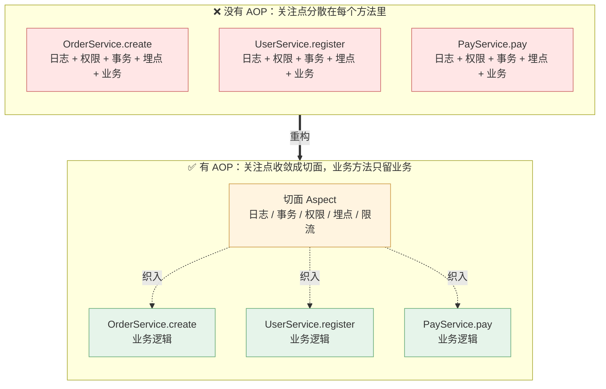
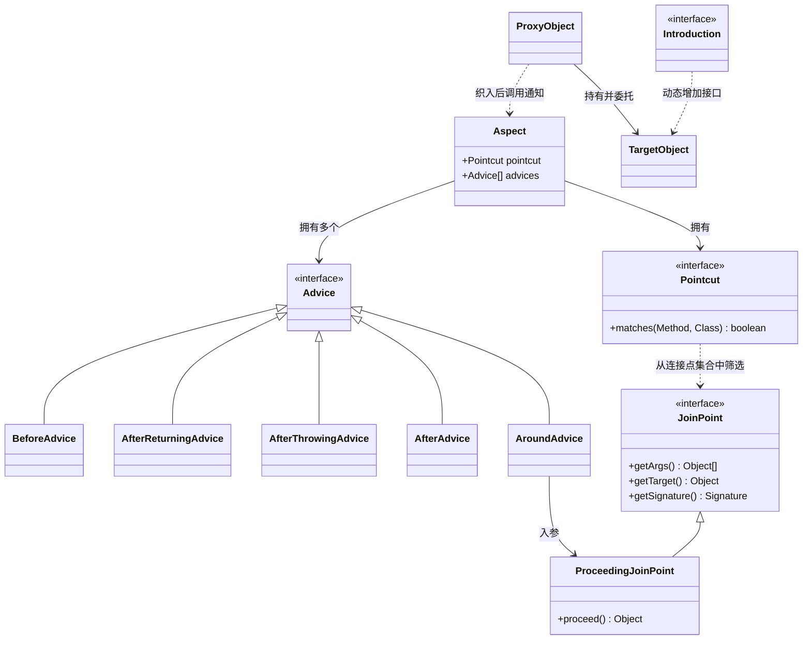
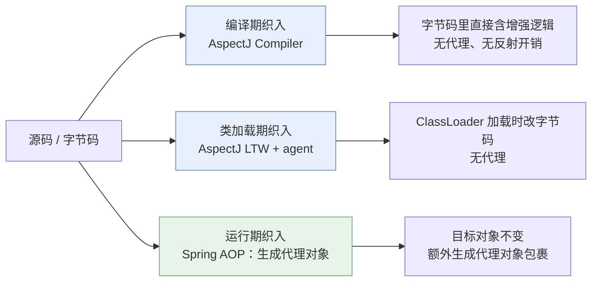
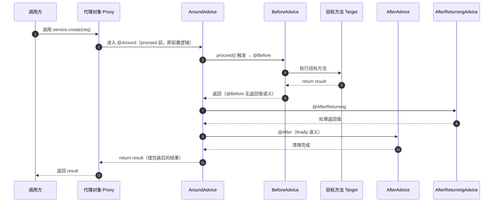
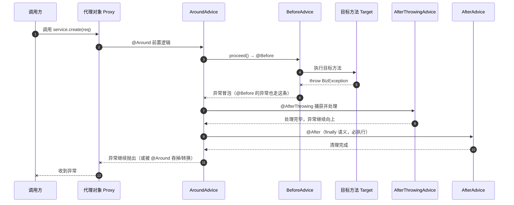
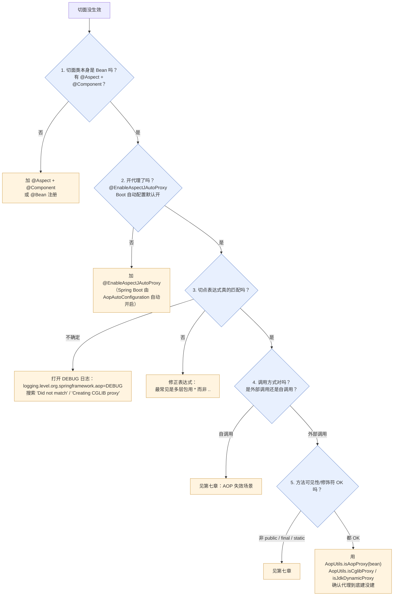
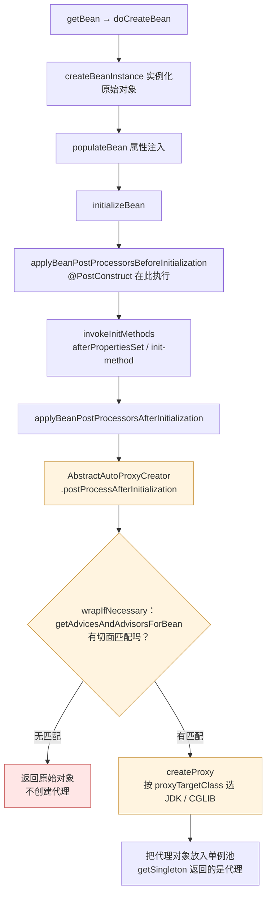
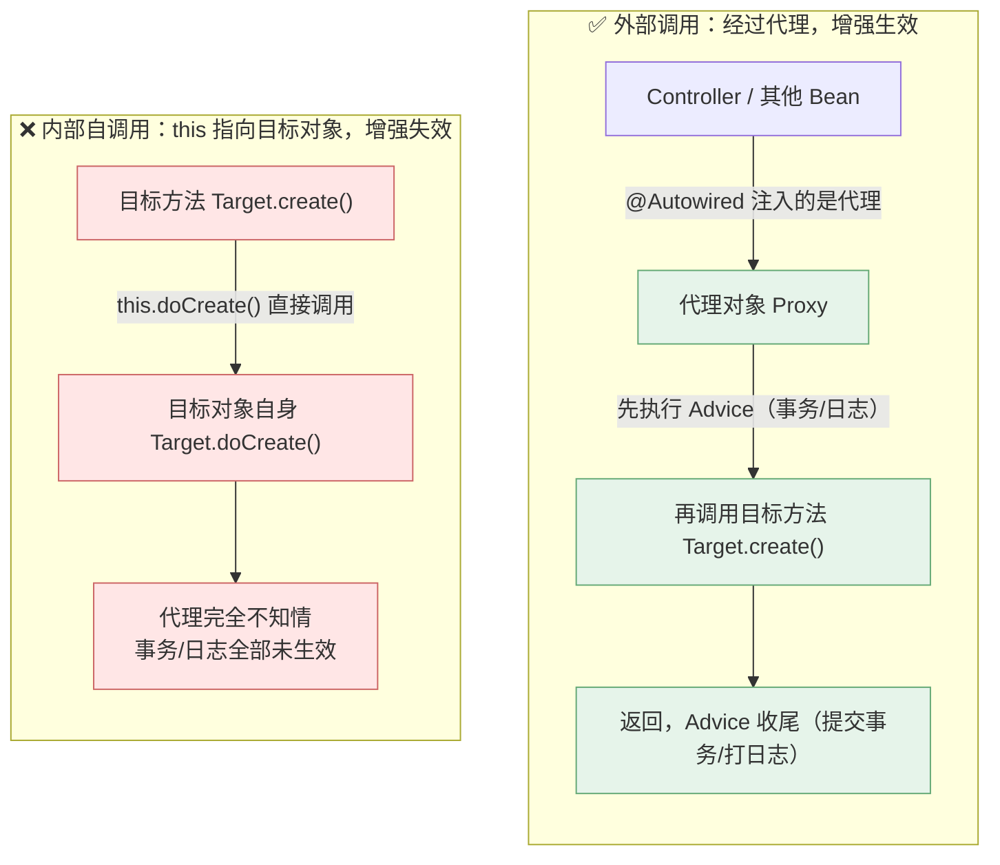
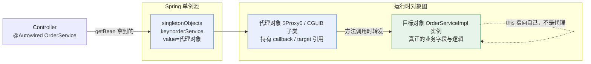
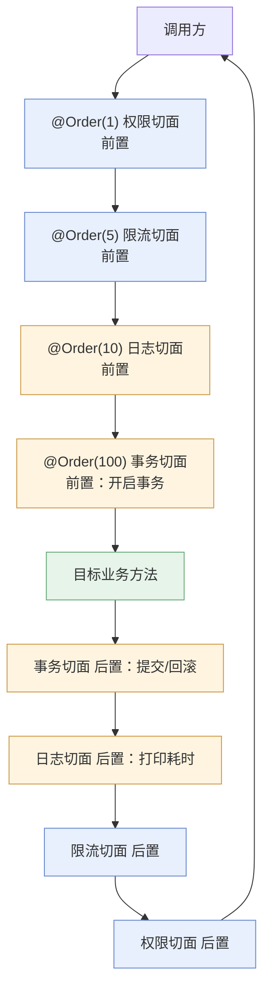

# 🎯 三、AOP 原理与实战

> 本篇回答四个问题：**AOP 到底解决了什么问题**（横切关注点为什么会烂在业务代码里）、**AOP 的八個核心概念之间是什么关系**（尤其是 JoinPoint 与 Pointcut 的区别）、**Spring AOP 用什么机制实现**（JDK 动态代理 vs CGLIB、代理什么时候创建、为什么必须是代理）、以及**生产环境里 AOP 会在哪些场景下静默失效**。
> 定位：本篇是**体系详解版**，讲 WHY、讲配置、讲真实踩坑。**速答骨架（源码级、refresh 12 步、三级缓存）见 [[面试准备/技术面试题库/13-Spring源码专题]]**，本篇不重复源码调用链；**AOP 与循环依赖交织的报错问题见 [[面试准备/技术面试题库/14-Spring循环依赖专题]]**。
> 关联：[[0-Spring总览]]（MOC）、[[1-Spring架构与IoC容器]]（容器是 AOP 的土壤）、[[2-Bean生命周期与依赖注入]]（代理在 `postProcessAfterInitialization` 生成）、[[4-声明式事务]]（`@Transactional` 就是 AOP 最大的应用）、[[8-Spring实战与踩坑]]（TraceId 透传与异步丢上下文）、[[9-Spring面试高频题]]。

---

## 一、为什么需要 AOP

### 1.1 横切关注点：一种"无法用继承和组合收拾干净"的代码

面向对象的核心武器是**继承与组合**，它们擅长处理**纵向**的、层级化的职责（Service 复用 DAO、子类扩展父类）。但有一类需求天然是**横向**的：它不属于任何一层，却要穿过所有层。

| 横切关注点 | 典型诉求 | 若手写会出现在哪里 |
|---|---|---|
| **日志/链路追踪** | 入参、出参、耗时、TraceId | 每个 Service 方法的第一行与最后一行 |
| **事务** | 开启、提交、回滚 | 每个写操作方法的 try/catch/finally |
| **权限校验** | 登录态、角色、数据权限 | 每个 Controller/Service 入口 |
| **缓存** | 查缓存、回填缓存、失效缓存 | 每个查询方法前后 |
| **监控埋点** | QPS、RT、成功率、异常率 | 每个被监控方法 |
| **限流/幂等** | 令牌桶、去重键 | 每个入口方法 |
| **重试/降级** | 失败重试、兜底返回值 | 每个不稳定依赖调用点 |

这类需求的三个特征，决定了**继承与组合都收拾不干净**：
1. **与业务逻辑正交**：日志和"下单"这件事没有语义关系，它们只是碰巧写在同一个方法里。
2. **散落且重复**：100 个方法就要写 100 遍，改一次规则要改 100 处。
3. **易漏**：新人加了个新方法忘了加事务注解、忘了打日志——这是**线上事故的常见来源**，而且是"静默漏"，编译期不报错、测试大概率发现不了。

### 1.2 没有 AOP vs 有 AOP



**左边的问题不是"代码丑"，而是三件事**：改动成本随方法数线性增长、漏加无法被编译期发现、业务代码被淹没导致可读性崩塌。**右边的收益**是：关注点**单点定义、全局生效**，业务方法回到"只表达业务"。

### 1.3 AOP 是 OOP 的补充，不是替代

这是面试里很容易被追问、也很容易答偏的一点。

| 维度 | OOP | AOP |
|---|---|---|
| 解决的问题 | **纵向**的职责划分与复用（继承、组合、多态） | **横向**的横切关注点复用 |
| 复用单位 | 类 / 对象 | 切面（作用于一批方法） |
| 关注点 | "谁是什么、谁拥有什么能力" | "在哪些执行点上，额外做什么" |
| 关系 | 主体 | **补充**：AOP 的切点仍然要按 OOP 的类/方法来描述 |

**关键结论**：AOP 无法独立存在——它的**切点表达式本身就是用 OOP 的语言写的**（`execution(* com.x.service.OrderService.*(..))` 里的类名就是 OOP 概念）。所以准确的说法是：**OOP 负责纵向解耦，AOP 负责横向解耦；AOP 建立在 OOP 之上，解决 OOP 表达不了的横切问题。** 说"AOP 替代 OOP"是错的。

> [!tip] 一句话回答"为什么要 AOP"
> 因为有一类**与业务正交、需要作用于大批方法**的逻辑（事务、日志、权限、缓存、监控），用继承和组合都会导致**重复、散落、易漏**；AOP 把它们抽成切面统一织入，让业务代码只表达业务。**它的本质是"把横切关注点从业务代码里搬出去"，而不是"让代码更酷"。**

---

## 二、核心概念：八个术语的关系

### 2.1 术语表

| 术语 | 英文 | 一句话定义 | 谁提供 | 例子 |
|---|---|---|---|---|
| **切面** | Aspect | 横切关注点的模块化封装，= 切点 + 通知 | 开发者 | `LogAspect` 类（`@Aspect`） |
| **连接点** | JoinPoint | **程序执行过程中"可以"被拦截的点** | Spring 框架（客观存在） | 一个方法的执行、一次异常抛出 |
| **切点** | Pointcut | **匹配连接点的表达式/谓词**，回答"我选哪些点" | 开发者 | `execution(* com.x.service.*.*(..))` |
| **通知** | Advice | 在连接点上**要执行的动作**，以及**执行的时机** | 开发者 | `@Around` 打印耗时 |
| **织入** | Weaving | 把切面**应用**到目标对象、生成代理的过程 | Spring 框架 | 运行期生成代理对象 |
| **引入** | Introduction | 给目标对象**动态增加新方法/新接口** | 开发者 | 让 Bean 实现 `ITimeAware` |
| **目标对象** | Target | 被代理的**原始业务对象**（未被增强） | 开发者 | `OrderServiceImpl` 实例 |
| **代理** | Proxy | 织入后**实际暴露给调用方**的对象 | Spring 框架 | `OrderServiceImpl$$EnhancerBySpringCGLIB` |

> [!important] 最容易答混的一点：JoinPoint vs Pointcut
> - **JoinPoint 是"可以被拦截的点"** —— 它是**客观存在**的执行点集合，Spring AOP 里**只支持方法执行这一种 JoinPoint**（这是 Spring AOP 相对 AspectJ 最大的能力短板）。它的视角是**候选集**、是**运行时的一个具体时刻**（所以 `ProceedingJoinPoint` 能拿到实参、能 `proceed()`）。
> - **Pointcut 是"我从中挑选哪些点"** —— 它是**开发者定义的匹配规则**，是**静态的表达式**，运行时被用来判断"当前这个 JoinPoint 要不要拦截"。
> - **一句话记法**：JoinPoint 是**全集**（可拦截的点），Pointcut 是**筛选条件**（我要哪些点）。通知要绑定到 Pointcut 上，才在匹配的 JoinPoint 处执行。
> - 类比：JoinPoint = 全公司所有员工；Pointcut = "技术部职级 P7 以上"；Advice = 给他们发的通知。

### 2.2 概念关系（类图）



### 2.3 织入时机：三种流派



**Spring 选择运行期代理的理由**（面试常问"为什么不用 AspectJ"）：
1. **无需额外编译器/agent**：纯 Java 代码，构建链路简单，IDE 与调试友好。
2. **与容器天然集成**：代理由 BeanPostProcessor 在 Bean 生命周期里生成，能直接享受依赖注入、作用域（singleton/prototype）、`@Order`、条件装配等一切容器能力。
3. **足够覆盖业务需求**：企业开发里 95% 的 AOP 需求（事务、日志、缓存、权限）都发生在 **Spring Bean 的方法调用**上，AspectJ 的"任意连接点"能力用不上。
4. **代价可接受**：多一层方法调用 + 反射/字节码调用，纳秒~微秒量级，相对一次 DB/Redis 往返可忽略。

**AspectJ 更适合**：需要拦截**非 Spring 管理的对象**（如 new 出来的 DTO）、需要拦截**字段访问/构造器/static 方法**、或者高频调用路径上对代理开销极度敏感的场景。

---

## 三、五种通知类型与执行顺序

### 3.1 五种通知对比

| 注解 | 时机 | 能否阻止目标方法执行 | 能否拿到返回值 | 能否拿到异常 | 典型用途 |
|---|---|---|---|---|---|
| `@Before` | 目标方法**之前** | ❌ 不能（只能抛异常中断） | ❌ | ❌ | 参数校验、权限预检、打印入参 |
| `@AfterReturning` | 目标方法**正常返回**后 | ❌ | ✅（`returning` 指定形参） | ❌ | 记录成功结果、缓存回填 |
| `@AfterThrowing` | 目标方法**抛异常**后 | ❌ | ❌ | ✅（`throwing` 指定形参） | 异常告警、错误埋点 |
| `@After` | 目标方法**之后（finally 语义）** | ❌ | ❌ | ❌ | 资源清理（**无论成败都执行**） |
| `@Around` | **包裹**目标方法 | ✅ **能**（不调 `proceed()` 就不执行） | ✅ | ✅ | 耗时统计、重试、缓存、限流、事务 |

> [!important] `@After` 的 finally 语义
> `@After` 等价于 `try { ... } finally { ... }`，**正常返回和抛异常都会执行**。这是它与 `@AfterReturning`（只在正常返回时执行）的本质区别。
> 注意：**`@After` 执行时拿不到返回值也拿不到异常对象**——想拿必须用 `@AfterReturning`/`@AfterThrowing`，或者干脆用 `@Around` 统一处理。

### 3.2 执行顺序：正常返回



### 3.3 执行顺序：抛异常



**顺序记忆法**（从外到内再出来）：
`@Around 前半段` → `@Before` → `目标方法` → `@AfterReturning` 或 `@AfterThrowing` → `@After` → `@Around 后半段`

> [!warning] 注意：`@AfterReturning` / `@AfterThrowing` / `@After` 三者的相对顺序
> Spring 内部把它们都归为"后置类"通知，实际执行顺序是 **`@AfterReturning` → `@After`**（正常）或 **`@AfterThrowing` → `@After`**（异常）。**不要依赖"后置通知之间的顺序"写关键业务逻辑**——需要强顺序请合并到 `@Around` 里显式控制。

### 3.4 `@Around` 的两个致命坑（超高频）

```java
// ❌ 坑 1：忘记调用 proceed() —— 目标方法永远不会执行
@Around("@annotation(com.x.anno.LogTime)")
public Object around(ProceedingJoinPoint pjp) throws Throwable {
    long start = System.currentTimeMillis();
    // 忘了 pjp.proceed()！
    return null;                    // 调用方拿到 null，且业务逻辑完全没跑
}
```

```java
// ❌ 坑 2：调用了 proceed() 但没有返回其结果 —— 返回值被吞
@Around("@annotation(com.x.anno.LogTime)")
public Object around2(ProceedingJoinPoint pjp) throws Throwable {
    pjp.proceed();                  // 执行了
    return null;                    // 【致命】业务返回值丢失，调用方以为没查到数据
}
```

```java
// ✅ 正确写法：proceed() 一次，捕获返回，finally 里做清理
@Around("@annotation(com.x.anno.LogTime)")
public Object around3(ProceedingJoinPoint pjp) throws Throwable {
    long start = System.nanoTime();
    Object result = null;
    try {
        result = pjp.proceed();                     // 必须调用，且保存返回值
        return result;                              // 必须返回
    } finally {
        long costMs = (System.nanoTime() - start) / 1_000_000;
        log.info("{} cost={}ms", pjp.getSignature().toShortString(), costMs);
    }
}
```

| 坑 | 现象 | 根因 | 解法 |
|---|---|---|---|
| 不调 `proceed()` | 业务**静默不执行**，接口返回 `null` | 目标方法只能由 `proceed()` 触发 | 必须调用 `proceed()` |
| 不返回 `proceed()` 的结果 | 查询接口返回空、更新接口看似成功实则被吞 | 代理的返回值 = `@Around` 的返回值 | `return pjp.proceed();` |
| 调了两次 `proceed()` | 业务**执行两次**（重复下单/重复扣款） | `proceed()` 不是幂等的 | 保证调用一次，存到局部变量 |
| `proceed()` 传了错误的参数 | 参数被篡改或 `IllegalArgumentException` | `proceed(Object[])` 参数个数/类型必须与原方法一致 | 想改参数用 `proceed(pjp.getArgs())` 的**副本**并保证签名一致 |
| `@Around` 里 return 类型不兼容 | `ClassCastException` | `@Around` 返回 `Object`，调用方会强转 | 返回原类型或可兼容类型 |

> [!danger] `@Around` 是唯一能"改变控制流"的通知
> 正因为 `@Around` 能决定目标方法是否执行、能改返回值、能吞异常，它也是最容易写出事故的通知类型。**能不用 `@Around` 就不用**：只是打印日志用 `@Before`+`@AfterReturning`；只有需要"包裹 + 控制流"（耗时、重试、缓存、限流）才用 `@Around`。

---

## 四、切点表达式详解

### 4.1 `execution` 的完整语法

```
execution(修饰符? 返回值类型 声明类型?.方法名(参数类型) 异常类型?)
```

| 位置 | 含义 | 通配写法 | 示例 |
|---|---|---|---|
| 修饰符 | `public`/`protected`/`*` | `*` 或省略 | 省略表示任意 |
| 返回值类型 | 方法返回类型 | `*` 任意、`void`、全限定类名 | `*`、`String`、`com.x.Result` |
| 声明类型 | 方法所属的类/接口 | `*` 一层、`..` 任意层 | `com.x.service.OrderService`、`com.x.service..*` |
| 方法名 | 方法名 | `*` 任意、`get*` 前缀 | `*`、`create*` |
| 参数 | 参数类型列表 | `..` 任意个任意类型、`*` 一个任意类型 | `(..)`、`(String, ..)`、`()` |
| 异常 | `throws` 的异常 | 通常省略 | `throws java.io.IOException` |

**背下 4 个最常用模板**：

```java
// 1. service 包下所有类的所有方法（注意：只有一层包！）
execution(* com.x.service.*.*(..))

// 2. service 包及其所有子包（.. 表示任意层级）
execution(* com.x.service..*.*(..))

// 3. 所有 public 方法且返回值非 void
execution(public !void com.x.service..*.*(..))

// 4. 指定方法名前缀
execution(* com.x.service..*.create*(..))
```

> [!warning] `..` 与 `*` 在包路径上的区别（最常见的写错点）
> - `com.x.service.*.*(..)` —— `*` **只匹配一层包**，即 `com.x.service.OrderService.create()` 会匹配，但 `com.x.service.impl.OrderServiceImpl.create()` **不会**匹配。这是"切点写了但没生效"的头号原因。
> - `com.x.service..*.*(..)` —— `..` **匹配任意层级（含零层）**，`com.x.service.OrderService` 与 `com.x.service.impl.OrderServiceImpl` 都能匹配。
> - **经验法则**：业务代码有 `impl` 子包时，**一律用 `..`**，否则你会花一整天排查"为什么切面不生效"。

### 4.2 其他指示符（designator）

| 指示符 | 含义 | 匹配对象 | 示例 |
|---|---|---|---|
| `execution` | 按方法签名匹配（**最常用、最精确**） | 方法 | `execution(* com.x.service..*.*(..))` |
| `@annotation` | 标注了某注解的**方法** | 方法 | `@annotation(com.x.anno.LogTime)` |
| `@within` | **类**上有某注解的方法 | 类（含子类） | `@within(org.springframework.transaction.annotation.Transactional)` |
| `@target` | **运行时目标对象类**有某注解 | 运行时类型 | 慎用（代理场景下语义易混） |
| `within` | 指定类/包内的方法 | 类（编译期） | `within(com.x.service..*)` |
| `this` | **代理对象**是某类型 | 代理类型 | `this(com.x.service.OrderService)` |
| `target` | **目标对象**是某类型 | 目标类型 | `target(com.x.service.OrderService)` |
| `args` | **运行时实参**是某类型 | 运行时参数 | `args(String, ..)`、`args(java.io.Serializable)` |
| `@args` | 运行时实参的**类型**上有某注解 | 运行时参数类型 | `@args(com.x.anno.Validated)` |
| `bean` | **Spring Bean 名称**匹配（Spring 特有） | Bean 名 | `bean(orderService)`、`bean(*Service)` |

### 4.3 `this` vs `target`：一个经典陷阱

| 指示符 | 判断的是 | 有代理时会发生什么 |
|---|---|---|
| `this(Type)` | 判断**代理对象**能否转成 `Type` | JDK 代理时，代理实现了接口 → `this(接口)` 成立，`this(实现类)` 不成立 |
| `target(Type)` | 判断**目标对象**能否转成 `Type` | 目标对象始终是实现类实例 → `target(实现类)` 成立 |

**结论**：**要匹配"某个业务实现类"时，优先用 `target` 或直接用 `execution` 按类名匹配**。用 `this(实现类)` 在 JDK 动态代理下会失配——因为代理类继承 `Proxy` 并只实现接口，**不是**实现类的子类。

> [!example] 一个真实踩坑
> 团队里有人写了 `@Pointcut("this(com.x.service.OrderServiceImpl)")`，在本地（Boot 2.x 默认 CGLIB，代理是子类，`this` 成立）一切正常，上了某个显式配了 `proxyTargetClass=false` 的老服务后切面**完全失效**且无任何报错。**这是"配置漂移 + 切点指示符选错"叠加的典型事故。**

### 4.4 切点组合

```java
// 用 && || ! 组合，注意 XML 里要用 and/or/not（& 是 XML 特殊字符）
@Pointcut("execution(* com.x.service..*.*(..)) && @annotation(com.x.anno.LogTime)")
public void logPointcut() {}

@Pointcut("within(com.x.controller..*) || within(com.x.service..*)")
public void webAndService() {}
```

**跨切面复用**：把切点抽成空方法，别的切面用全限定名引用，避免表达式散落：

```java
@Aspect
@Component
public class Pointcuts {
    @Pointcut("execution(* com.x.service..*.*(..))")
    public void serviceLayer() {}

    @Pointcut("@annotation(com.x.anno.LogTime)")
    public void logTimeAnno() {}
}

@Aspect
@Component
@Order(1)
public class LogAspect {
    @Around("com.x.aspect.Pointcuts.serviceLayer() && com.x.aspect.Pointcuts.logTimeAnno()")
    public Object around(ProceedingJoinPoint pjp) throws Throwable { /* ... */ }
}
```

### 4.5 切点写错导致不生效的排查方法

按这个顺序排查，**90% 的问题在第 2、3 步**：



**最有效的三板斧**：

```java
// ① 确认代理建了没有、是哪种代理
@Autowired private OrderService orderService;

@PostConstruct
public void check() {
    log.info("isAopProxy={}, isCglib={}, isJdk={}",
        AopUtils.isAopProxy(orderService),
        AopUtils.isCglibProxy(orderService),
        AopUtils.isJdkDynamicProxy(orderService));
    log.info("targetClass={}", AopUtils.getTargetClass(orderService));
}
```

```yaml
# ② 打开 AOP DEBUG 日志，Spring 会告诉你哪些切点没匹配上
logging:
  level:
    org.springframework.aop: DEBUG
    org.springframework.transaction.interceptor: TRACE
```

```java
// ③ 在切点方法上打断点/或临时用最宽松的切点验证链路是否通
@Around("execution(* com.x..*.*(..))")   // 先验证代理链路，再逐步收窄表达式
```

---

## 五、代理机制：JDK 动态代理 vs CGLIB

### 5.1 对比表

| 维度 | JDK 动态代理 | CGLIB |
|---|---|---|
| **前提条件** | 目标类**至少实现一个接口** | 目标类**不能是 final**，被代理方法**不能是 final/private/static** |
| **生成机制** | 运行时生成 `implements 目标接口` 的类，继承 `java.lang.reflect.Proxy` | 运行时生成目标类的**子类**（ASM 改字节码） |
| **代理类形态** | `class $Proxy0 extends Proxy implements OrderService` | `class OrderServiceImpl$$EnhancerBySpringCGLIB$$xxx extends OrderServiceImpl` |
| **方法调用** | 反射调用（`Method.invoke`），有反射开销 | 生成 FastClass 索引，**直接调用**（无反射），调用更快 |
| **创建开销** | 小 | 较大（生成字节码），但只发生一次 |
| **对 private/final 方法** | 代理不到（接口里本就没有） | **代理不到**（无法覆写） |
| **对 static 方法** | 代理不到 | 代理不到（静态方法不参与多态） |
| **字段注入** | 代理对象与目标对象是不同实例，父类字段为 null | **是同一实例的"外壳"，`this` 引用与字段可见性更好** |
| **JDK 版本影响** | — | JDK 9+ 需 `--add-opens java.base/java.lang=ALL-UNNAMED`（Boot 3 已用 Spring 内置的 repackage 规避） |
| **Spring 版本默认** | Spring Boot 1.x 默认按"有无接口"自动选 | **Spring Boot 2.x 起默认 `spring.aop.proxy-target-class=true`，一律用 CGLIB** |

> [!important] Spring Boot 2.x 起默认走 CGLIB
> 配置项 `spring.aop.proxy-target-class`（对应 `@EnableAspectJAutoProxy(proxyTargetClass = true)`），**Spring Boot 2.x 起默认为 true**（1.x 默认 false）。
> **为什么要改默认**：① 避免"有接口用 JDK、没接口用 CGLIB"的不一致行为；② JDK 代理下**注入实现类类型会失败**（`BeanNotOfRequiredTypeException`），而 CGLIB 生成的子类同时满足"接口类型"和"实现类类型"，**注入更不容易出错**；③ CGLIB 调用不依赖反射，性能略优。
> **要注意的副作用**：`@Autowired` 一个 `final` 的 Service 实现类、或实现类是 `final` 的，在 CGLIB 下会直接启动失败（无法生成子类）——这是要**显式改回 JDK 代理**的场景。

**显式切换的三种方式**：

```java
// ① 全局：强制 JDK 动态代理（要求目标类有接口）
@EnableAspectJAutoProxy(proxyTargetClass = false)
```

```yaml
# ② 配置文件（Spring Boot）
spring:
  aop:
    proxy-target-class: false   # 默认 true
```

```java
// ③ 单 Bean 粒度（Boot 2.0+）：This bean is only affected
@Bean
@Scope(proxyMode = ScopedProxyMode.INTERFACES)  // 或用 @EnableAspectJAutoProxy 的 per-bean 控制
```

### 5.2 代理对象什么时候创建



**三个必须讲清的点**：

1. **代理是在 `postProcessAfterInitialization` 生成的**，即"初始化之后"。所以：
   - **`@PostConstruct` 里调用被增强的方法，走的是原始对象，AOP 不生效**（此时代理还没出生）。
   - 依赖注入注入的是**代理对象**（因为 `getSingleton` 返回的是后置处理后的对象）。

2. **`wrapIfNecessary` 的判断逻辑**：先找 `getAdvicesAndAdvisorsForBean`，**只有找到至少一个匹配的 Advisor 才创建代理**；没匹配就直接返回原对象。这解释了一个常见困惑：「我的 Bean 为什么不是代理？」——因为**没有切面匹配它**（`@Transactional` 的方法不是 public、切点写错、类不在扫描范围等都会导致"没有 Advisor 匹配"，从而连代理都不建）。

3. **`@EnableAspectJAutoProxy` 的作用**：注册 `AnnotationAwareAspectJAutoProxyCreator`（本质是一个 `BeanPostProcessor` + `SmartInstantiationAwareBeanPostProcessor`）。在 Spring Boot 中由 `AopAutoConfiguration` 根据条件自动装配，**通常不需要手写**。它的两个常用属性：
   - `proxyTargetClass`：true = CGLIB，false = 按接口自动选。
   - `exposeProxy`：true = 把当前代理放到 `AopContext` 的 ThreadLocal 里，从而能在**自调用**场景用 `AopContext.currentProxy()` 拿到代理。

```java
@Configuration
@EnableAspectJAutoProxy(exposeProxy = true)   // 必须显式开启才能用 AopContext
public class AopConfig {}
```

```java
// 自调用的解法之一（有代价：必须 exposeProxy=true，且不能跨线程）
public void createOrder(Order order) {
    // 拿到当前线程的代理对象，再调用，等于绕开自调用
    ((OrderService) AopContext.currentProxy()).doCreate(order);
}
```

### 5.3 为什么必须是代理 —— AOP 失效的根本原因

**核心事实**：Spring AOP 的增强逻辑**写在代理对象里**，不在目标对象里。所以**只有"调用经过代理"的代码路径才有增强**。



> [!important] 一句话讲透 AOP 失效
> **`this` 永远指向目标对象本身，而不是代理对象。** 代理对象是 Spring 额外造出来的"外壳"，只有从容器里取出来的那个引用才是代理。类内部写 `this.method()` 或直接 `method()`（语法糖，等价 `this.method()`）都是**在目标对象内部打转**，永远碰不到代理，因此增强逻辑（事务、日志、缓存、权限）**全部静默失效**。
> 这也解释了为什么"外部调用同一个方法却正常"——因为外部拿到的引用是代理。

### 5.4 代理对象与目标对象的关系（内存视角）



**两个推论**：
- **`getClass()` 得到的是代理类**（`OrderServiceImpl$$EnhancerBySpringCGLIB$$1a2b3c`），做 `instanceof`/日志判断时要注意；`AopUtils.getTargetClass()` 才能拿到真实的业务类。
- **CGLIB 代理对象"是"目标类的子类实例**（因为继承了它），但**其中没有目标对象的字段值**——CGLIB 是通过继承同一个类并覆写方法来转发，所以字段在目标对象上。

---

## 六、AOP 失效场景大全

> [!danger] 这一节是本篇最有生产价值的部分
> 下面 10 个场景的共同特点是：**不报错、不告警、编译通过、单测可能通过，但增强逻辑静默失效**。在事务场景下，这意味着**数据不一致**。

### 6.1 总表

| # | 场景 | 现象 | 根因 | 解法 |
|---|---|---|---|---|
| 1 | **自调用（this 调用）** | 同类中 A 方法调 B 方法，B 上的增强不生效 | `this` 指向目标对象，不经过代理 | ① 拆到另一个 Bean ② 注入自身（`ObjectProvider`/`@Lazy`）③ `AopContext.currentProxy()`（需 `exposeProxy=true`） |
| 2 | **方法非 public** | `protected`/`private`/包级方法上的注解无效 | Spring AOP 基于代理，**只增强 public 方法**（CGLIB 技术上能覆写 protected，但 Spring 官方文档明确只支持 public） | 改为 public；或改用 AspectJ |
| 3 | **final 类 / final 方法** | 整个类或该方法不生效 | CGLIB 靠继承，无法覆写 final | 去掉 final；或改用 JDK 代理（final 类无接口则无解，只能改设计） |
| 4 | **private 方法** | 完全不生效 | 子类无法继承/覆写 private 方法 | 提升可见性并拆 Bean |
| 5 | **`static` 方法** | 不生效 | 静态方法不参与多态，代理无法介入 | 改为实例方法 |
| 6 | **对象不是 Spring 管理的** | `new OrderService()` 出来的对象无增强 | 没有经过 BeanPostProcessor，根本没建代理 | 交给容器管理 |
| 7 | **`@PostConstruct` 里调用** | 初始化方法内的调用无增强 | 代理在 `postProcessAfterInitialization` 才生成，`@PostConstruct` 在其之前 | 挪到 `ApplicationReadyEvent` / `SmartInitializingSingleton` |
| 8 | **`@Transactional` 与 `@Async` 同用** | 事务不生效，或异步里没有事务 | 两个增强各自建代理/顺序问题；且事务绑定 ThreadLocal，**跨线程必然丢** | 拆成两个 Bean：外层 `@Async`，内层 `@Transactional`（详见 [[4-声明式事务]]） |
| 9 | **切点表达式写错** | 无任何报错，切面不触发 | 多层包用了 `*`；类名/包名拼错 | 用 `..`；开 DEBUG 日志排查 |
| 10 | **类没有被扫描到** | 切面或目标类都不是 Bean | `@ComponentScan` 范围外；多模块下包路径不匹配 | 检查扫描范围 / `@Import` |

### 6.2 场景 1：自调用 —— 最经典、最高频

```java
@Service
public class OrderService {

    public void createOrder(Order order) {
        // ❌ 自调用：this.doCreate() —— 不经过代理
        this.doCreate(order);          // doCreate 上的 @Transactional / @LogTime 全部失效
    }

    @Transactional(rollbackFor = Exception.class)
    public void doCreate(Order order) {
        orderMapper.insert(order);
        throw new RuntimeException("模拟失败");   // 不会回滚！数据已落库
    }
}
```

**四种解法对比**：

| 解法 | 写法 | 优点 | 缺点 |
|---|---|---|---|
| **拆 Bean**（推荐） | 把 `doCreate` 挪到 `OrderInnerService`，注入调用 | 最干净、语义清晰、无魔法 | 多一个类 |
| **注入自身** | `@Autowired @Lazy private OrderService self;` 然后 `self.doCreate()` | 改动小 | `@Lazy` 是为了避免循环依赖报错，略隐晦 |
| **ObjectProvider** | `@Autowired ObjectProvider<OrderService> self;` → `self.getObject().doCreate()` | 延迟解析，天然避免循环依赖 | 语法稍啰嗦 |
| **AopContext** | 配置 `exposeProxy=true`，用 `((OrderService) AopContext.currentProxy()).doCreate()` | 不改结构 | 依赖配置；**跨线程失效**（ThreadLocal）；代码里出现框架细节，可测性差 |

```java
// ✅ 解法二：注入自身（注意 @Lazy 避免 "currently in creation" 循环依赖报错）
@Service
public class OrderService {
    @Autowired @Lazy private OrderService self;   // 注入的是代理，且延迟到使用时才解析

    public void createOrder(Order order) {
        self.doCreate(order);                     // 走代理 → 增强生效
    }

    @Transactional(rollbackFor = Exception.class)
    public void doCreate(Order order) { /* ... */ }
}
```

> [!warning] 为什么注入自身通常要加 `@Lazy`
> 不加 `@Lazy` 时，`OrderService` 在创建过程中需要注入 `OrderService`，形成**自引用**。Spring 能处理"单例 + setter/字段注入"的自引用（靠三级缓存提前暴露），但**在构造器注入或某些代理场景下会抛 `BeanCurrentlyInCreationException`**。`@Lazy` 让注入的是一个延迟解析的代理，**从根本上绕开创建时序问题**。这也是 `@Async` + `@Transactional` 同用时报循环依赖错误的常见修法。

### 6.3 场景 8：`@Transactional` 与 `@Async` 同用

```java
// ❌ 反例：同一个方法上同时加两个注解
@Async
@Transactional
public void handle(Order order) {
    orderMapper.update(order);        // 大概率事务不生效
    sendMq(order);
}
```

**为什么出问题**：
1. **执行顺序不确定**：两个增强都在同一个代理链上，谁先谁后由 `@Order` 决定；如果 `@Async` 先执行，方法被投递到线程池，**事务注解生效时已经在新线程**。
2. **事务绑定 ThreadLocal**：`TransactionSynchronizationManager` 把连接绑在**发起事务的那个线程**上。`@Async` 把执行体丢到另一个线程，**新线程上没有事务上下文**（详见 [[4-声明式事务]] 的事务同步机制一节）。
3. **可能在自调用链上**：如果这个方法是同类内部调用的，两个注解双双失效。

**正确做法：拆两个 Bean，异步在外、事务在内**

```java
@Service
public class OrderAsyncService {
    private final OrderTxService orderTxService;
    public OrderAsyncService(OrderTxService s) { this.orderTxService = s; }

    @Async("orderExecutor")            // 外层：异步，无事务
    public void handleAsync(Order order) {
        orderTxService.handle(order);   // 通过注入的代理调用 → 事务生效（在新线程里新开事务）
    }
}

@Service
public class OrderTxService {
    @Transactional(rollbackFor = Exception.class)   // 内层：事务
    public void handle(Order order) { /* ... */ }
}
```

> [!tip] 顺带一提：线程池里的上下文
> `@Async` 不仅丢事务，还会丢 **MDC（TraceId）、SecurityContext、RequestContextHolder、`AopContext`**。统一解法是用 `TaskDecorator` 在任务提交时把上下文复制过去、执行后清理——见 [[8-Spring实战与踩坑]]。

### 6.4 场景 7：`@PostConstruct` 里调用

```java
@Service
public class CacheWarmer {
    @PostConstruct
    public void init() {
        // ❌ 此刻代理还没生成（代理在 postProcessAfterInitialization 才建）
        loadCache();          // @LogTime / @Transactional / @Cacheable 全部无效
    }

    @LogTime
    public void loadCache() { /* ... */ }
}
```

**替代方案**（都在"代理已就绪"之后）：

| 方案 | 时机 | 适用 |
|---|---|---|
| `SmartInitializingSingleton#afterSingletonsInstantiated` | 所有单例实例化之后 | 需要所有 Bean 就绪（推荐） |
| `ApplicationReadyEvent` 监听 | 容器完全启动、WebServer 已起 | 想等应用可对外服务 |
| `InitializingBean#afterPropertiesSet` | **仍在 `@PostConstruct` 之后、代理生成之前** | ⚠️ 同样拿不到代理，别用 |

### 6.5 场景 6：对象不是 Spring 管理的

```java
// ❌ 自己 new：没有经过容器，没有 BPP，没有代理
OrderService svc = new OrderServiceImpl();
svc.doCreate(order);           // @Transactional 完全不生效，数据不会回滚
```

**常见的"隐形 new"来源**：
- `@Bean` 方法里 `new` 出来但**又手动包了一层**（如 `new OrderServiceProxy(new OrderServiceImpl())`）。
- **反序列化/克隆/反射创建**的对象。
- **MyBatis/JPA 返回的实体**、**Jackson 反序列化的 DTO**——它们本来就不该带增强，但有人把 `@Transactional` 写在实体方法上。
- **手写的线程池任务里 new 出来的对象**。

### 6.6 快速自检清单

> [!question] 上线前 60 秒自检
> - [ ] 需要增强的方法都是 **public** 吗？
> - [ ] 类和方法都**不是 final** 吗？
> - [ ] 增强方法都是**从外部（其他 Bean / Controller）调进来**的吗？
> - [ ] 切点用 `..` 覆盖了 `impl` 子包吗？
> - [ ] `@Aspect` 类确实被扫描成 Bean 了吗？
> - [ ] `@Transactional` 的 `rollbackFor` 配了吗？（默认不回滚受检异常）
> - [ ] 有没有在 `@PostConstruct` 里调增强方法？
> - [ ] 有没有 `@Async` / 线程池里调增强方法？
> - [ ] 用 `AopUtils.isAopProxy(bean)` 验证过关键 Bean 了吗？

---

## 七、实战案例

### 7.1 案例一：接口耗时日志（`@Around` + 参数与耗时）

```java
@Target(ElementType.METHOD)
@Retention(RetentionPolicy.RUNTIME)
@Documented
public @interface LogTime {
    /** 超过该毫秒数才打印（避免日志刷屏），默认 0 = 全打 */
    long slowThreshold() default 0L;
    /** 是否打印入参（敏感参数场景关闭） */
    boolean printArgs() default true;
}
```

```java
@Slf4j
@Aspect
@Component
@Order(10)                       // 日志切面：希望它在事务/权限之外层，便于观察真实耗时
public class LogTimeAspect {

    @Around("@annotation(logTime)")
    public Object around(ProceedingJoinPoint pjp, LogTime logTime) throws Throwable {
        MethodSignature sig = (MethodSignature) pjp.getSignature();
        String method = sig.getDeclaringType().getSimpleName() + "#" + sig.getName();
        long start = System.nanoTime();
        try {
            Object result = pjp.proceed();                       // ✅ 必须调用并保存返回值
            long costMs = (System.nanoTime() - start) / 1_000_000;
            if (costMs >= logTime.slowThreshold()) {
                log.info("[SLOW] {} cost={}ms args={}", method, costMs,
                         logTime.printArgs() ? safeArgs(pjp.getArgs()) : "-");
            }
            return result;                                        // ✅ 必须返回
        } catch (Throwable ex) {
            long costMs = (System.nanoTime() - start) / 1_000_000;
            log.warn("[FAIL] {} cost={}ms ex={}: {}", method, costMs,
                     ex.getClass().getSimpleName(), ex.getMessage());
            throw ex;                                             // ✅ 不能吞异常，否则事务/调用方全乱
        }
    }

    /** 参数裁剪：避免打印大对象/敏感信息，也避免日志里出现换行 */
    private String safeArgs(Object[] args) {
        if (args == null || args.length == 0) return "[]";
        return Arrays.stream(args)
            .map(a -> a == null ? "null" : abbreviate(String.valueOf(a), 200))
            .collect(Collectors.joining(", ", "[", "]"));
    }

    private String abbreviate(String s, int max) {
        String flat = s.replaceAll("\\s+", " ");
        return flat.length() <= max ? flat : flat.substring(0, max) + "...";
    }
}
```

> [!warning] `@Around` 里写日志的四个生产注意点
> 1. **不要把大对象 `toString()` 全量打出来**——既拖慢接口又可能撑爆日志盘（尤其是 `List<10000>` 或含大字段的实体）。
> 2. **不要吞异常**：`catch` 后必须 `throw`，否则事务的回滚判定、调用方的错误处理全部失效。
> 3. **`@Around` 的参数绑定**：`@annotation(logTime)` 可以额外把注解实例作为参数传入（如上例），比反射取注解更清晰。
> 4. **加 `slowThreshold`**：高频接口的无差别日志会把磁盘打满，只打印慢调用才有价值。

### 7.2 案例二：自定义注解 + AOP 实现幂等

```java
@Target(ElementType.METHOD)
@Retention(RetentionPolicy.RUNTIME)
public @interface Idempotent {
    /** 幂等键的 SpEL 表达式，从入参里取值，如 "#req.orderNo" */
    String key();
    /** 幂等窗口（秒），窗口内同 key 视为重复请求 */
    int expireSeconds() default 10;
    /** 重复请求的行为：抛异常 还是 返回缓存结果 */
    Strategy strategy() default Strategy.THROW;

    enum Strategy { THROW, RETURN_CACHED }
}
```

```java
@Slf4j
@Aspect
@Component
@Order(20)
public class IdempotentAspect {

    private final StringRedisTemplate redis;
    private final ExpressionParser parser = new SpelExpressionParser();
    private final ParameterNameDiscoverer nameDiscoverer = new DefaultParameterNameDiscoverer();

    public IdempotentAspect(StringRedisTemplate redis) { this.redis = redis; }

    @Around("@annotation(idem)")
    public Object around(ProceedingJoinPoint pjp, Idempotent idem) throws Throwable {
        String key = buildKey(pjp, idem);
        String redisKey = "idem:" + key;
        String token = UUID.randomUUID().toString();

        // setIfAbsent = SET NX，原子占位；返回 false 说明窗口内已有请求
        Boolean acquired = redis.opsForValue()
                .setIfAbsent(redisKey, token, Duration.ofSeconds(idem.expireSeconds()));

        if (Boolean.FALSE.equals(acquired)) {
            if (idem.strategy() == Idempotent.Strategy.RETURN_CACHED) {
                String cached = redis.opsForValue().get(redisKey + ":result");
                if (cached != null) return JSON.parseObject(cached, Object.class);
            }
            throw new BizException("请勿重复提交");
        }

        try {
            Object result = pjp.proceed();                       // ✅ 调用并保存返回值
            if (idem.strategy() == Idempotent.Strategy.RETURN_CACHED) {
                redis.opsForValue().set(redisKey + ":result",
                        JSON.toJSONString(result),
                        Duration.ofSeconds(idem.expireSeconds()));
            }
            return result;                                       // ✅ 必须返回
        } catch (Throwable ex) {
            // ⚠️ 关键决策：业务失败时是否释放幂等键？
            // 抛业务异常（可重试）→ 释放，让用户能重试
            // 系统异常（不应重试）→ 保留，防止高频重试打垮下游
            if (ex instanceof BizException) {
                releaseIfOwner(redisKey, token);
            }
            throw ex;
        }
    }

    /** 用 Lua 保证"只删自己的锁"，避免误删别人的 */
    private void releaseIfOwner(String key, String token) {
        String lua = "if redis.call('get', KEYS[1]) == ARGV[1] then return redis.call('del', KEYS[1]) else return 0 end";
        redis.execute(new DefaultRedisScript<>(lua, Long.class), Collections.singletonList(key), token);
    }

    /** 用 SpEL 从方法入参解析幂等键 */
    private String buildKey(ProceedingJoinPoint pjp, Idempotent idem) {
        MethodSignature sig = (MethodSignature) pjp.getSignature();
        EvaluationContext ctx = new MethodBasedEvaluationContext(
                pjp.getTarget(), sig.getMethod(), pjp.getArgs(), nameDiscoverer);
        Object v = parser.parseExpression(idem.key()).getValue(ctx);
        if (v == null) throw new BizException("幂等键解析为空：" + idem.key());
        return v.toString();
    }
}
```

**用法**：

```java
@Idempotent(key = "#req.orderNo", expireSeconds = 30)
public Result createOrder(CreateOrderReq req) { /* ... */ }
```

> [!danger] 幂等切面的三个坑
> 1. **幂等键必须在业务层唯一**：用订单号没问题，用"用户ID+时间戳"就等于没做幂等。
> 2. **释放锁必须校验持有者**：直接 `DEL` 会误删下一个请求的锁（A 超时释放了 B 的锁 → 并发重复执行）。必须用 Lua 做 compare-and-delete。
> 3. **幂等切面自己也受 AOP 失效约束**：如果入口是自调用，幂等同样不生效。

### 7.3 案例三：MDC TraceId 透传

```java
@Slf4j
@Aspect
@Component
@Order(Ordered.HIGHEST_PRECEDENCE)     // 最外层：保证 TraceId 覆盖所有其他切面的日志
public class TraceIdAspect {

    private static final String TRACE_ID = "traceId";
    private static final String SPAN_ID  = "spanId";

    @Around("execution(* com.x.controller..*.*(..)) || execution(* com.x.service..*.*(..))")
    public Object around(ProceedingJoinPoint pjp) throws Throwable {
        String traceId = MDC.get(TRACE_ID);
        boolean root = (traceId == null);          // 是否是最外层调用
        try {
            if (root) {
                traceId = resolveOrCreateTraceId();
                MDC.put(TRACE_ID, traceId);
            }
            return pjp.proceed();
        } finally {
            if (root) {
                MDC.remove(TRACE_ID);              // ⚠️ 必须清理，否则线程池复用会串 TraceId
                MDC.remove(SPAN_ID);
            }
        }
    }

    /** 优先透传上游（HTTP Header / MQ Header），没有才生成 */
    private String resolveOrCreateTraceId() {
        ServletRequestAttributes attrs =
                (ServletRequestAttributes) RequestContextHolder.getRequestAttributes();
        if (attrs != null) {
            String fromHeader = attrs.getRequest().getHeader("X-Trace-Id");
            if (StringUtils.hasText(fromHeader)) return fromHeader;
        }
        return UUID.randomUUID().toString().replace("-", "");
    }
}
```

> [!warning] MDC 是 ThreadLocal，异步必然丢
> `MDC` 底层是 `ThreadLocal`，**一旦跨线程（`@Async`、`CompletableFuture`、手写线程池、MQ 消费回调）就会丢失**。三种解法：
> 1. **`TaskDecorator`**：在提交任务时 `MDC.getCopyOfContextMap()` 拷贝到子线程，执行完清理（**推荐**，统一无侵入）。
> 2. **`TransmittableThreadLocal`（TTL，阿里开源）**：包裹线程池，自动传递。
> 3. **手动透传**：把 traceId 作为参数显式传下去（最土但最可靠）。
>
> 完整实现与线程池配置见 [[8-Spring实战与踩坑]]。

**`TaskDecorator` 骨架**（配合 `ThreadPoolTaskExecutor`）：

```java
public class MdcTaskDecorator implements TaskDecorator {
    @Override
    public Runnable decorate(Runnable runnable) {
        Map<String, String> ctx = MDC.getCopyOfContextMap();     // 提交线程的上下文
        return () -> {
            Map<String, String> original = MDC.getCopyOfContextMap();
            try {
                if (ctx != null) MDC.setContextMap(ctx);
                runnable.run();
            } finally {
                if (original != null) MDC.setContextMap(original); else MDC.clear();
            }
        };
    }
}
```

### 7.4 案例四：权限校验切面（注解 + SpEL）

```java
@Target(ElementType.METHOD)
@Retention(RetentionPolicy.RUNTIME)
public @interface RequirePerm {
    String value();                        // 权限码，如 "order:refund"
    String dataScope() default "";         // 数据范围 SpEL，如 "#req.tenantId"
}
```

```java
@Aspect
@Component
@Order(5)                                  // 权限应在日志/事务之前
public class PermissionAspect {

    @Before("@annotation(requirePerm)")
    public void check(JoinPoint jp, RequirePerm requirePerm) {
        LoginUser user = SecurityContextHolder.getUser();
        if (user == null) throw new BizException(401, "未登录");
        if (!user.hasPermission(requirePerm.value())) {
            throw new BizException(403, "无权限：" + requirePerm.value());
        }
        // 数据权限：校验用户能访问的目标租户
        if (StringUtils.hasText(requirePerm.dataScope())) {
            // ... SpEL 解析后与 user 的数据范围比对
        }
    }
}
```

> [!tip] 为什么权限校验用 `@Before` 而不是 `@Around`
> 权限校验的语义是"**不满足就中断**"，`@Before` 里抛异常即可达成，**不需要包裹目标方法、也不需要处理返回值**。用 `@Around` 反而增加了一个"忘记 `proceed()` / 忘记 return"的风险面。**通知类型选择原则：能用简单的就不用 `@Around`。**

---

## 八、AOP 的顺序与性能

### 8.1 多个切面的执行顺序

| 控制方式 | 写法 | 优先级 |
|---|---|---|
| `@Order` 注解 | `@Order(1)` 在切面类上 | **值越小优先级越高**（越靠外层） |
| `Ordered` 接口 | `implements Ordered { getOrder() }` | 同上 |
| XML `order` 属性 | `<aop:aspect order="1">` | 同上 |
| 未指定 | 默认 `Ordered.LOWEST_PRECEDENCE`（`Integer.MAX_VALUE`） | **顺序不确定**，按 Bean 注册顺序 |

**执行模型：像洋葱一样嵌套**



> [!important] 顺序错误会导致什么
> 1. **日志切面在事务之外 vs 之内**：在**外**（`@Order` 数值更小）→ 日志记录的耗时**包含事务提交时间**，能反映真实接口耗时；在**内** → 耗时只含业务执行，**会漏掉提交慢的问题**（比如大事务提交花 2 秒却看不出来）。**推荐日志在外。**
> 2. **事务切面在最内层是关键**：如果事务切面不在内层，其他切面的异常可能被事务的 `catch` 逻辑误判（Spring 事务的 `completeTransactionAfterThrowing` 依据**异常类型**判断是否回滚，但异常若被外层切面转换过，回滚规则就可能不再匹配）。
> 3. **`@Transactional` 与 `@Cacheable` 同用**：**缓存切面必须在事务之外**（`@Order` 更小）。否则先开事务再查缓存，**命中缓存也会白开一个数据库连接**，白白占用连接池。
> 4. **权限/限流必须在最外层**：让无权限、被限流的请求**连事务都不开**，避免无谓的资源消耗。

**关于事务切面的默认顺序**：`@EnableTransactionManagement` 的默认 `order` 是 `Ordered.LOWEST_PRECEDENCE`（即默认在最内层），这个默认值的设计意图正是"事务应该最贴近业务方法"。**如果你显式给其他切面设了很大的 `@Order` 值，可能反而跑到事务里面去了——设 `@Order` 时要意识到这个默认值。**

### 8.2 AOP 的性能开销

> [!note] 讲量级，不讲假数字
> 下面都是**量级判断**，具体数字随 JDK 版本、方法参数个数、JIT 是否内联、是否逃逸分析优化而变，**不要背具体纳秒数，面试时讲"影响因子"更显专业**。

| 环节 | 开销来源 | 量级 | 影响因子 |
|---|---|---|---|
| 代理对象创建 | 生成字节码（CGLIB）/ 反射代理类（JDK） | 相对昂贵，但**只在 Bean 初始化时发生一次** | 一个应用里被代理的 Bean 数量 |
| 方法调用转发 | 多一次方法调用 + 通知链遍历 | 很小 | 通知数量（每个匹配的通知都要走一遍） |
| 参数/注解解析 | `Signature`、注解反射读取 | **比调用转发大**，反射是主要成本 | 是否每次调用都做反射；是否可缓存 |
| 通知内部逻辑 | 你的代码（打日志、SpEL 解析、Redis 调用） | **通常远大于 AOP 本身开销** | 日志量、SpEL 复杂度、是否有网络 IO |
| JIT 影响 | 代理方法可能影响内联与逃逸分析 | 不确定 | 热点方法被代理后可能失去部分优化 |

**生产判断（这才是面试官想听的）**：

1. **AOP 本身的代理开销通常可以忽略**——它相对一次 DB/Redis 往返（毫秒级）小几个数量级。
2. **真正的成本在你的通知里**：
   - **`@Around` 里打全量日志**（大对象 `toString`、JSON 序列化）→ 可能比业务本身还慢。
   - **`@Around` 里做 SpEL 解析** → 每次调用都解析字符串，**务必缓存 `Expression` 对象**（`SpelExpressionParser` 每次 `parseExpression` 都新建）。
   - **切点用 `execution(* com.x..*.*(..))` 这种超宽范围** → 每次调用都要走匹配判断，**切点应尽量收窄**。
3. **高频路径要格外小心**：QPS 高的接口（如风控、序列号生成、行情推送），AOP 的固定成本会被放大。这类路径优先考虑：只匹配必要的注解、通知里做前置快速判断（如 `log.isDebugEnabled()`）、必要时**用手写代码替代 AOP**（牺牲可维护性换性能，只在确证是瓶颈后做）。
4. **切面数量也是成本**：一个方法被 5 个切面匹配，就有 5 层通知链。**别把所有关注点都塞进一个超宽切点。**

---

## 九、AspectJ 与 Spring AOP 的完整对比

| 维度 | Spring AOP | AspectJ |
|---|---|---|
| **织入时机** | **运行期**（生成代理对象） | 编译期（ajc）/ 编译后（post-compile）/ 类加载期（LTW + agent） |
| **实现机制** | JDK 动态代理 / CGLIB | 直接修改字节码（无代理） |
| **支持的连接点** | **仅方法执行** | 方法、构造器、字段读写、static 初始化、异常处理块等 |
| **能拦 private/static/final 吗** | ❌ | ✅ |
| **能拦非 Spring Bean 吗** | ❌（必须经容器） | ✅ |
| **能拦自调用吗** | ❌（这是最痛的限制） | ✅（字节码层面直接改，不走代理） |
| **性能** | 有一次转发开销 | 无代理开销，通常更快 |
| **构建复杂度** | 无额外要求 | 需要 ajc 编译器 / `-javaagent` / 字节码插件 |
| **调试体验** | 好（源码即字节码） | 相对差（字节码被改，栈帧可能不直观） |
| **与容器集成** | 天然（BPP 生成代理） | 需要额外配置 |
| **Spring 支持度** | 原生 | 支持注解语法（`@Aspect`），但**默认仍用 Spring AOP 的代理引擎执行** |

> [!important] 最容易答错的一点
> 你在 Spring 里写的 `@Aspect` / `@Pointcut` / `@Around` **是 AspectJ 的注解语法，但执行引擎仍然是 Spring AOP 的运行期代理**。
> 也就是说：**用了 `@Aspect` 不等于用了 AspectJ**。要真正启用 AspectJ 织入，需要 `@EnableLoadTimeWeaving` + `aop.xml` + `-javaagent:aspectjweaver.jar`，**极少有业务项目这么做**。
> 面试话术：**「Spring AOP 借用了 AspectJ 的注解和切点表达式语法，但织入机制是运行期代理，只支持方法级连接点，且不能拦自调用——这是它和 AspectJ 的本质区别。」**

---

## 十、必答总结

> [!question] AOP 的实现原理
> **一句话**：Spring AOP 在 **Bean 初始化后（`AbstractAutoProxyCreator#postProcessAfterInitialization`）**，通过 `wrapIfNecessary` 判断该 Bean 是否有 Advisor 匹配；有匹配就**创建代理对象**（JDK 动态代理 or CGLIB）替换原对象放入单例池；代理对象在方法调用时**先执行通知链**（`ReflectiveMethodInvocation` 责任链），再（或不再）调用目标方法。
> **三个关键**：① 增强在代理里，不在目标对象里 → 所以必须"经过代理"；② 只有匹配到 Advisor 才建代理 → 所以"没生效"可能是连代理都没建；③ 只支持方法级连接点 → 所以 private/final/static/构造器都拦不到。

> [!question] JDK 动态代理与 CGLIB 怎么选
> 1. **默认**：Spring Boot 2.x+ 默认 **CGLIB**（`spring.aop.proxy-target-class=true`），因为它同时满足接口类型与实现类类型注入，更不容易出错，且调用不走反射。
> 2. **必须用 JDK 代理**：目标类是 **final**、或必须注入**接口而非实现类**（如某些多实现/装饰器场景）、或历史上为了规避 CGLIB 的 JDK 模块开放问题。配置 `spring.aop.proxy-target-class=false`。
> 3. **必须有接口**才能用 JDK 代理；**不能是 final** 才能用 CGLIB。二者都拦不到 private/static。
> 4. **面试加分**：CGLIB 生成的是**子类**，所以"代理对象的字段为空"这类困惑通常出现在 JDK 代理上；反过来 CGLIB 因为继承，会遇到"父类构造器被调用两次"（Spring 用 Objenesis 规避）这种细节。

> [!question] 为什么自调用会失效
> 因为**增强逻辑写在代理对象里**，而类内部的 `this.method()` 调用**直接作用于目标对象**，完全绕过了代理。`this` 是目标对象自己的引用，永远不可能是代理。
> **解法**：拆 Bean（最优）／注入自身（`@Lazy`/`ObjectProvider`）／`AopContext.currentProxy()`（需 `exposeProxy=true`，且跨线程失效）。
> **注意**：这个问题在 `@Transactional` 上后果最严重——**事务静默失效 → 数据不一致**，而且不报错。所以「为什么加了 `@Transactional` 却不回滚」的排查第一步永远是：**这个方法是外部调用的吗？**

> [!question] `@Around` 的坑
> 1. **不调 `proceed()`** → 目标方法静默不执行。
> 2. **不返回 `proceed()` 的结果** → 返回值丢失（查询返回 null）。
> 3. **调两次 `proceed()`** → 业务重复执行（重复扣款/重复下单），因为 `proceed()` 不幂等。
> 4. **`catch` 后不 `throw`** → 吞异常，事务回滚判定失效。
> 5. **`proceed(Object[])` 的参数签名不匹配** → `IllegalArgumentException`。
> 6. **在 `@Around` 里做重活**（全量日志、SpEL 每次解析、同步远程调用）→ 性能损耗远超 AOP 本身。
> 7. **能用 `@Before`/`@AfterReturning` 就别用 `@Around`**——`@Around` 是能力最强也最容易写出事故的通知。

---

## 十一、关联与延伸

| 想深入了解 | 去看 |
|---|---|
| AOP 源码调用链、refresh 12 步、三级缓存 | [[面试准备/技术面试题库/13-Spring源码专题]] |
| AOP 与循环依赖交织（代理对象的提前暴露、报错排查） | [[面试准备/技术面试题库/14-Spring循环依赖专题]] |
| `@Transactional` 就是 AOP 的最大应用（传播行为、失效、提交后动作） | [[4-声明式事务]] |
| Bean 生命周期与代理创建时机 | [[2-Bean生命周期与依赖注入]] |
| IoC 容器、BeanPostProcessor 扩展点 | [[1-Spring架构与IoC容器]] |
| `@Async` 线程池、MDC/TraceId 透传、上下文丢失 | [[8-Spring实战与踩坑]] |
| 自动装配（`AopAutoConfiguration` 的条件装配） | [[6-SpringBoot自动装配]] |
| 缓存注解、事件机制、`@TransactionalEventListener` | [[7-Spring进阶专题]] |
| 面试速答 | [[9-Spring面试高频题]]、[[面试准备/技术面试题库/05-Spring与框架]] |
| 分布式事务（与本地事务的边界） | [[7-分布式/2-分布式事务]] |

> [!tip] 一句话收束
> **AOP 的全部威力与全部陷阱，都来自同一句话：增强在代理里，不在目标对象里。**
> 记住这句，"为什么失效"这一类问题就全都能自己推出来。
