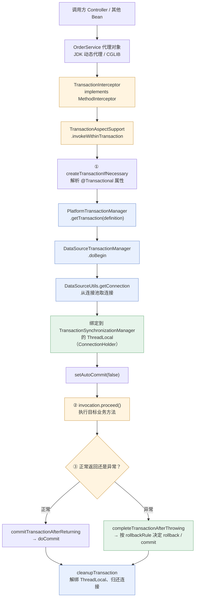
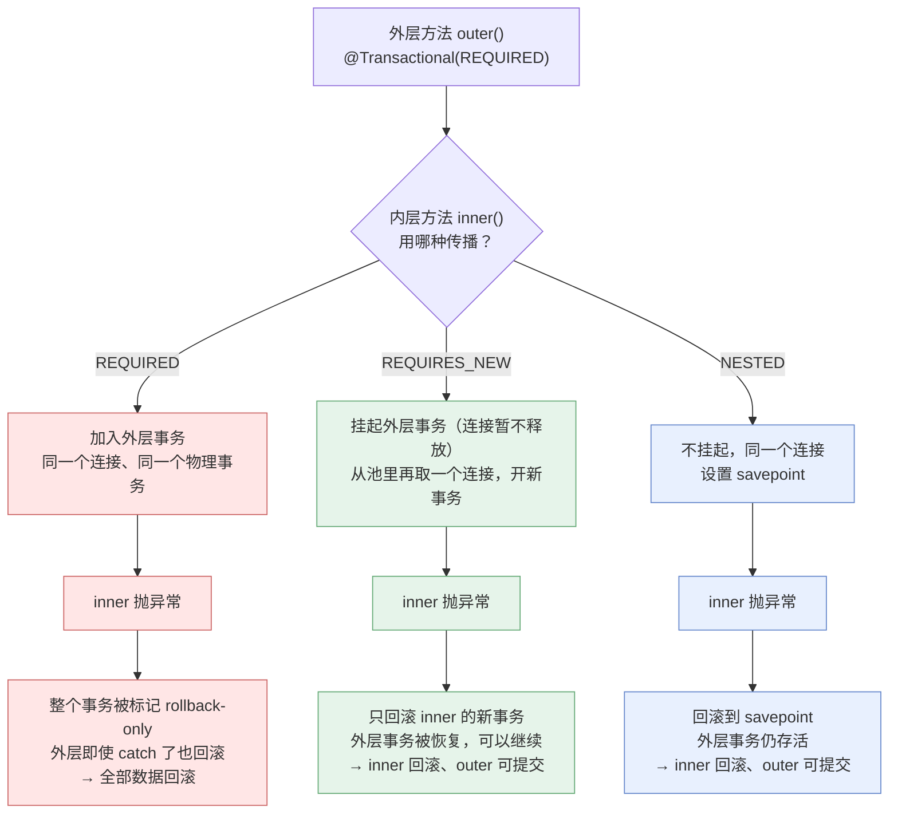
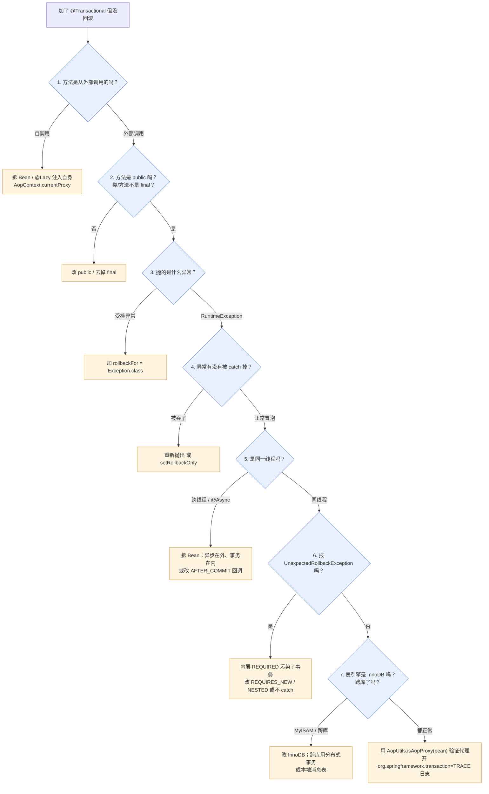
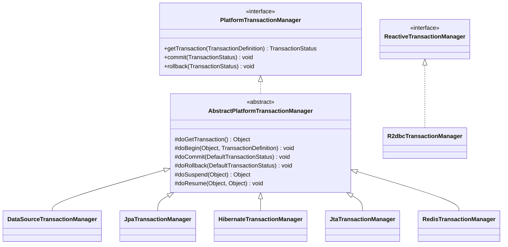
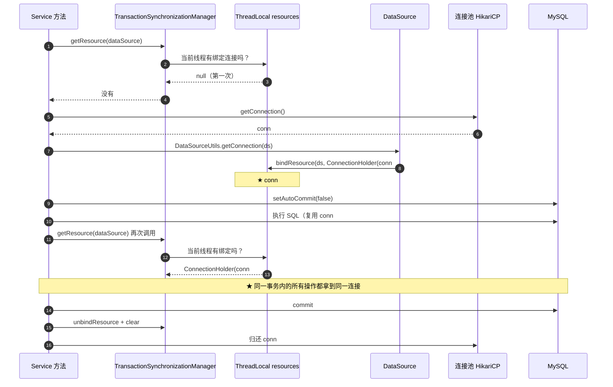
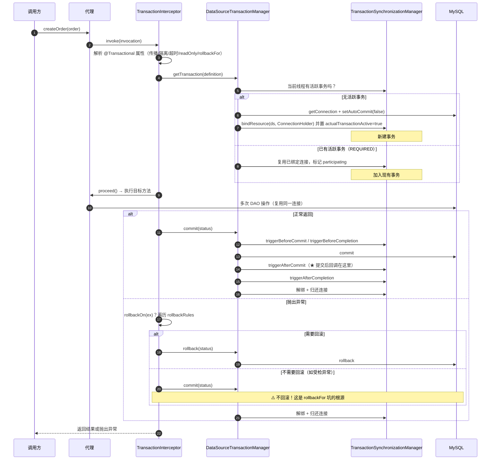
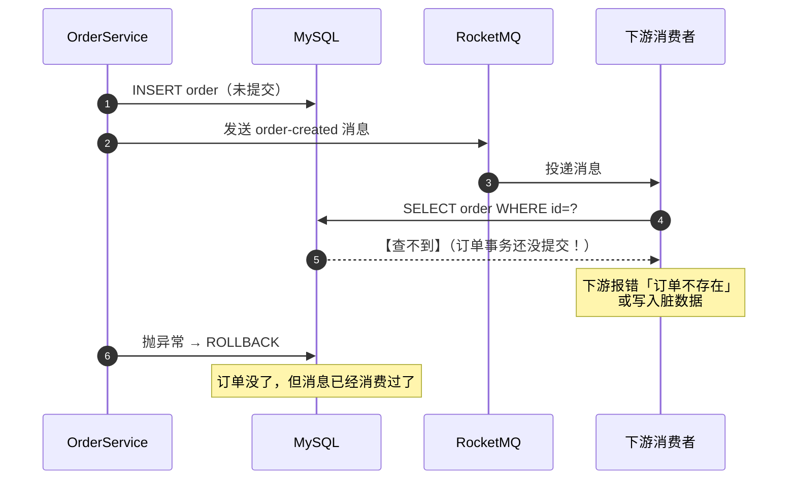
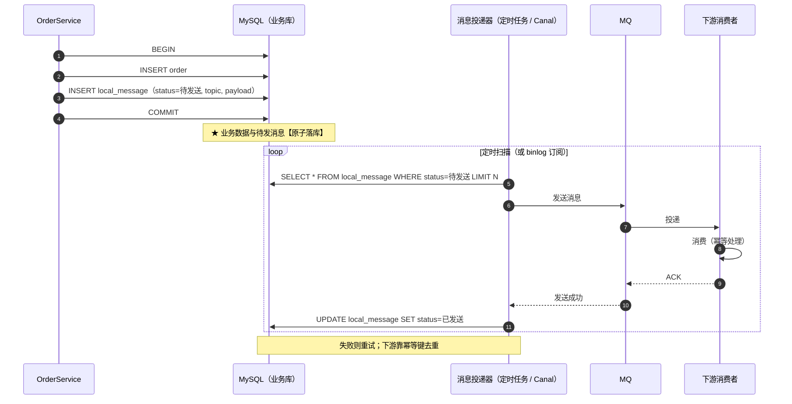
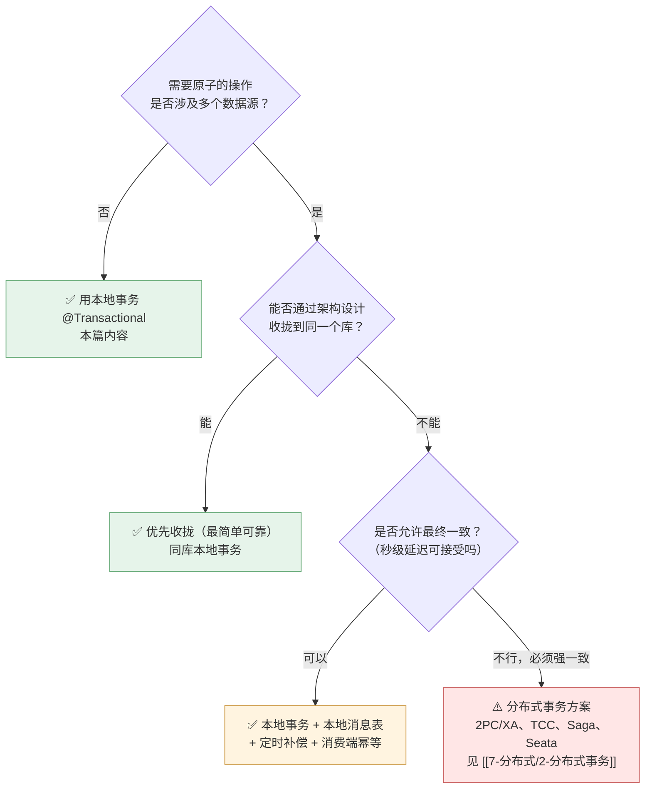

# 🔄 四、声明式事务

> 本篇回答四个问题：**`@Transactional` 的本质是什么**（AOP + `TransactionInterceptor` 的调用链）、**七个核心属性的语义与实际影响**（重点是 `rollbackFor` 默认行为的坑与三种传播行为的差异）、**事务会在哪些场景下静默失效**（12 个场景，每个给原因与解法）、以及**事务的底层机制**（`PlatformTransactionManager` 体系、`ThreadLocal` 绑定连接为什么导致跨线程失效、事务提交后怎么安全地做后续动作）。
> 定位：本篇是**体系详解版**，讲 WHY、讲配置、讲生产踩坑。**速答骨架（`AbstractPlatformTransactionManager` 源码流程、`DataSourceTransactionManager` 细节）见 [[面试准备/技术面试题库/13-Spring源码专题]]**。
> **重要边界**：本篇讲的是 **Spring 的本地声明式事务（单数据源、同一 JVM）**，与**分布式事务**（2PC/TCC/Saga/Seata/本地消息表）是完全不同的问题域——后者见 [[7-分布式/2-分布式事务]]，本篇只在"本地事务 vs 分布式事务的边界"和"跨库怎么办"处做衔接。
> 关联：[[0-Spring总览]]、[[3-AOP原理与实战]]（事务就是一种 AOP）、[[7-Spring进阶专题]]、[[8-Spring实战与踩坑]]、[[9-Spring面试高频题]]。
> **循环依赖相关**：`@Transactional` 让 Bean 需要被代理，会与循环依赖相互作用（`BeanCurrentlyInCreationException`、代理对象的提前暴露）——该问题见 [[面试准备/技术面试题库/14-Spring循环依赖专题]]，本篇只在"注入自身 + `@Lazy`"处点到。

---

## 一、事务的基础：编程式 vs 声明式

### 1.1 两种写法对比

**编程式事务（`TransactionTemplate`）**：

```java
@Service
public class OrderService {

    private final TransactionTemplate txTemplate;
    private final OrderMapper orderMapper;
    private final StockMapper stockMapper;

    public OrderService(PlatformTransactionManager txManager,
                        OrderMapper orderMapper, StockMapper stockMapper) {
        // 也可以不设回滚规则，用默认（RuntimeException 回滚）
        this.txTemplate = new TransactionTemplate(txManager);
        this.txTemplate.setPropagationBehavior(TransactionDefinition.PROPAGATION_REQUIRED);
        this.txTemplate.setIsolationLevel(TransactionDefinition.ISOLATION_DEFAULT);
        this.txTemplate.setTimeout(30);                       // 秒
        this.orderMapper = orderMapper;
        this.stockMapper = stockMapper;
    }

    public void createOrder(Order order) {
        // execute 有返回值版本；executeWithoutResult 是无返回值版本
        txTemplate.executeWithoutResult(status -> {
            orderMapper.insert(order);
            stockMapper.deduct(order.getSkuId(), order.getQty());
            // 想回滚：throw 异常，或显式 status.setRollbackOnly()
        });
    }
}
```

**声明式事务（`@Transactional`）**：

```java
@Service
public class OrderService {

    @Transactional(rollbackFor = Exception.class, timeout = 30)
    public void createOrder(Order order) {
        orderMapper.insert(order);
        stockMapper.deduct(order.getSkuId(), order.getQty());
    }
}
```

### 1.2 对比与选型

| 维度 | 编程式（`TransactionTemplate`） | 声明式（`@Transactional`） |
|---|---|---|
| **侵入性** | 业务代码里混入事务 API | 一行注解，业务纯净 |
| **事务范围控制** | ✅ **精确到代码块**，可只包 3 行 | ⚠️ **粒度是整个方法**，不能只包一部分 |
| **可读性** | 显式，一眼看到边界 | 隐式，靠注解推断 |
| **失效风险** | 低（不依赖代理） | **高**（自调用、非 public、final 等一票失效场景） |
| **传播行为/隔离级别的动态性** | ✅ 可在运行时按条件选择不同配置 | ❌ 注解是静态的 |
| **可测试性** | 需要 mock `PlatformTransactionManager` | 更好（普通方法调用） |
| **适用场景** | 事务范围与方法边界不一致、需要动态决策、AOP 失效难以规避的场景 | **绝大多数业务方法**（90%+ 的场景） |

> [!tip] 为什么推荐声明式
> 1. **关注点分离**：事务是横切关注点，天然适合 AOP——这与日志、权限的论证完全一致（见 [[3-AOP原理与实战]]）。
> 2. **减少样板代码与人为错误**：忘写 `commit`、`try/catch` 把异常吞掉导致 `rollback` 没执行，是编程式事务的经典 bug；声明式由框架统一保证。
> 3. **统一治理**：可以全局配置默认超时、默认回滚规则，通过切面统一加监控。
> 4. **但**：一旦事务边界与方法边界不一致（例如方法里前半段是只读查询、只有后半段 3 行需要事务，且这段是高频路径），**编程式反而更合适**——它避免了给不需要事务的代码开启连接。

> [!important] 一个重要但常被忽略的判断
> **`@Transactional` 的粒度是方法，而"开事务"意味着"从连接池拿一个连接并持有到方法结束"。**
> 所以：**把一个耗时很长的老方法整体加上 `@Transactional`，等于让一个数据库连接被占用整个方法时长**（包含里面的 HTTP 调用、文件 IO、MQ 发送）。这是**大事务**的典型成因，见第六章。

### 1.3 `@Transactional` 的本质：AOP + `TransactionInterceptor`



**必须讲清的五个点**：

1. **`@Transactional` 不是 Spring 容器内建的特殊机制，它就是一套 AOP**：由 `@EnableTransactionManagement` 注册 `InfrastructureAdvisorAutoProxyCreator`（一个 `AbstractAutoProxyCreator`），它为带 `@Transactional` 的 Bean 创建代理，并挂上 `BeanFactoryTransactionAttributeSourceAdvisor`。
2. **增强逻辑在 `TransactionInterceptor#invoke`**，核心委托给 `TransactionAspectSupport#invokeWithinTransaction`，逻辑就是"**开事务 → `proceed()` → 提交/回滚**"三段式。
3. **属性解析来自 `TransactionAttributeSource`**：`AnnotationTransactionAttributeSource` 解析 `@Transactional`，得到 `RuleBasedTransactionAttribute`（含传播行为、隔离级别、超时、只读、回滚规则）。
4. **回滚判定在 `completeTransactionAfterThrowing`**：它遍历 `rollbackRules`，**命中"回滚规则"就 `rollback`，否则 `commit`**（是的，**不匹配回滚规则的异常会被提交**——这是 `rollbackFor` 坑的源码依据）。
5. **连接的生命周期由 `TransactionSynchronizationManager` 的 ThreadLocal 掌管**（见第五章）——这是"跨线程必然失效"的根源。

> [!warning] 由此推出的一个关键结论
> **因为 `@Transactional` 是 AOP，所以 [[3-AOP原理与实战]] 里所有失效场景（自调用、非 public、final、对象非 Spring 管理、`@PostConstruct` 里调用等）在事务上全部成立**，而且后果更严重——**事务静默不回滚 = 数据不一致**，且编译期与单测都不一定会暴露。
> **排查"为什么 `@Transactional` 不生效"的第一步永远是：这个方法是从外部调用的吗？**

---

## 二、`@Transactional` 核心属性详解

### 2.1 属性总览

| 属性 | 类型 | 默认值 | 一句话影响 |
|---|---|---|---|
| `rollbackFor` / `rollbackForClassName` | `Class[]` / `String[]` | `{}`（**仅 RuntimeException + Error 回滚**） | **决定哪些异常会回滚**（★最高频坑） |
| `noRollbackFor` / `noRollbackForClassName` | `Class[]` / `String[]` | `{}` | 指定某些异常**不回滚** |
| `propagation` | `Propagation` | `REQUIRED` | 决定事务是"加入当前"还是"新开"（★重点） |
| `isolation` | `Isolation` | `DEFAULT` | 隔离级别，**多数情况由数据库决定** |
| `readOnly` | `boolean` | `false` | 只读提示，**是 hint 不是强制** |
| `timeout` | `int` | `-1`（跟随底层默认） | 超时秒数，**不精确** |
| `transactionManager` | `String` | `""`（用默认 TM Bean） | 多数据源时指定用哪个事务管理器 |
| `label` | `String[]` | `{}` | 事务标签，可被监控/传播策略使用（Spring 5.3+） |

### 2.2 `rollbackFor`（★重点：最高频的坑）

> [!danger] 默认行为：**只回滚 `RuntimeException` 和 `Error`，受检异常（Checked Exception）不回滚**
> 这来自 Spring 的默认回滚规则：`DefaultTransactionAttribute#rollbackOn` 的判断是
> **`ex instanceof RuntimeException || ex instanceof Error` 才回滚，否则提交**。
> 设计初衷是遵循 EJB 的历史约定："受检异常代表可预期的业务情况，调用方应当处理，不应自动回滚"。
> **但在实际业务里，这几乎总是错的期望**——大家的直觉是"抛异常就该回滚"。

**反例：为什么捕获了 `IOException` 事务却没回滚**

```java
// ❌ 反例 1：抛受检异常，事务不回滚，数据已落库
@Service
public class OrderService {

    @Transactional                              // 没有 rollbackFor！
    public void createOrder(Order order) throws IOException {
        orderMapper.insert(order);              // 已写入
        if (order.getQty() <= 0) {
            throw new IOException("库存文件读取失败");   // 受检异常 → 【事务提交】→ 脏数据！
        }
    }
}
```

```java
// ❌ 反例 2：更隐蔽 —— try-catch 吞掉了 RuntimeException
@Service
public class OrderService {

    @Transactional(rollbackFor = Exception.class)
    public void createOrder(Order order) {
        orderMapper.insert(order);
        try {
            stockClient.deduct(order.getSkuId(), order.getQty());
        } catch (Exception e) {
            log.error("扣减库存失败", e);
            // 【致命】异常被吞掉了，方法正常返回 → 事务提交 → 订单创建但库存没扣
        }
    }
}
```

```java
// ❌ 反例 3：手动捕获后重新抛出，但破坏的类型 —— 也常见
@Transactional(rollbackFor = Exception.class)
public void createOrder(Order order) {
    try {
        doBiz(order);
    } catch (BizException e) {
        throw new RuntimeException(e.getMessage());   // 类型变了，如果原规则依赖具体类型会失配
    }
}
```

```java
// ✅ 正确做法 1：统一配 rollbackFor = Exception.class
@Transactional(rollbackFor = Exception.class)
public void createOrder(Order order) throws IOException { /* ... */ }
```

```java
// ✅ 正确做法 2：吞异常时显式标记回滚
@Transactional(rollbackFor = Exception.class)
public void createOrder(Order order) {
    orderMapper.insert(order);
    try {
        stockClient.deduct(order.getSkuId(), order.getQty());
    } catch (Exception e) {
        log.error("扣减库存失败", e);
        TransactionAspectSupport.currentTransactionStatus().setRollbackOnly();  // 强制标记回滚
        // 或者：throw new BizException("库存不足", e);
    }
}
```

**最佳实践：全局默认配置**（避免每个方法都要记得写）

```java
@Configuration
public class TransactionConfig {

    /**
     * 通过 TransactionInterceptor 统一设置默认回滚规则：
     * 所有异常都回滚。这样即使某处忘了写 rollbackFor 也不会漏。
     */
    @Bean
    public TransactionInterceptor transactionInterceptor(PlatformTransactionManager tm) {
        TransactionInterceptor interceptor = new TransactionInterceptor();
        interceptor.setTransactionManager(tm);

        RuleBasedTransactionAttribute attr = new RuleBasedTransactionAttribute();
        attr.setRollbackRules(Collections.singletonList(
                new RollbackRuleAttribute(Exception.class)));       // ★ 全局：Exception 也回滚
        attr.setPropagationBehavior(TransactionDefinition.PROPAGATION_REQUIRED);
        attr.setTimeout(30);

        NameMatchTransactionAttributeSource source = new NameMatchTransactionAttributeSource();
        // 也可以用 AnnotationTransactionAttributeSource 并设置默认属性
        interceptor.setTransactionAttributeSource(source);
        return interceptor;
    }
}
```

> [!tip] 更简单的团队规范
> **所有 `@Transactional` 必须显式写 `rollbackFor = Exception.class`**，并在代码规范里用静态检查（如 ArchUnit / SonarQube 自定义规则 / Checkstyle）强制。
> 面试话术：**「`@Transactional` 默认只回滚 `RuntimeException` 和 `Error`，受检异常不回滚——这是最高频的坑。我们的规范是全部显式写 `rollbackFor = Exception.class`，并在 CI 里加静态检查兜底，因为靠人记住是不可靠的。」**

**`noRollbackFor` 的用法**：有些异常你**希望不回滚**（例如"业务校验失败但要记录操作日志"）。

```java
@Transactional(rollbackFor = Exception.class, noRollbackFor = AuditFailException.class)
public void doBiz() { /* AuditFailException 不会导致回滚 */ }
```

**回滚规则匹配是"类型 + 继承链"**：`rollbackFor = Exception.class` 能覆盖所有 `Exception` 子类（含受检异常）；`rollbackFor = Throwable.class` 连 `Error` 一起包（**一般不推荐**，`Error` 通常是 OOM/StackOverflow，此时回滚也可能失败，且不应该掩盖）。

### 2.3 `propagation` 传播行为（★重点）

"传播行为"回答的是：**当一个已经处于事务中的方法，再去调用另一个带事务的方法时，事务怎么处理？**

#### 2.3.1 七种传播行为总表

| 传播行为 | 当前有事务时 | 当前无事务时 | 典型用途 | 风险 |
|---|---|---|---|---|
| **`REQUIRED`**（默认） | **加入**当前事务 | 新建一个事务 | 99% 的业务方法 | 内层异常会导致**整个外层事务回滚**；内层 `catch` 了也没用 |
| **`REQUIRES_NEW`** | **挂起**当前事务，**新建独立事务** | 新建一个事务 | 日志记录、发消息、独立提交的补偿记录 | **两个连接**，连接池压力翻倍；**不能跨库保证一致性**；**必须在另一个 Bean 里才生效** |
| **`NESTED`** | **基于 savepoint 嵌套**（不挂起，同一连接同一事务） | 等同 `REQUIRED`（新建） | 外层可选择性回滚内层，内层失败不影响外层（外层可 catch 后继续） | **仅 JDBC savepoint 支持**（MySQL InnoDB 支持）；JTA 不支持；内层回滚后外层仍可提交 |
| **`SUPPORTS`** | 加入当前事务 | **以非事务方式执行** | 查询方法（有事务就跟着走，没有也不强求） | 语义模糊，容易误用 |
| **`NOT_SUPPORTED`** | **挂起**当前事务，以非事务方式执行 | 以非事务方式执行 | 批量导入、大批量只读操作（避免长事务占连接） | 挂起期间的操作**不在事务里**，失败无法回滚 |
| **`MANDATORY`** | 加入当前事务 | **抛异常** `IllegalTransactionStateException` | 强制"必须由上层开事务"的内部方法 | 被独立调用时会直接报错，适合做契约约束 |
| **`NEVER`** | **抛异常** `IllegalTransactionStateException` | 以非事务方式执行 | 明确禁止事务的方法（如某些 DDL 操作） | 约束性强，慎用 |

#### 2.3.2 三大核心传播行为的行为差异



#### 2.3.3 `REQUIRED` vs `REQUIRES_NEW` vs `NESTED` 深度对比

| 维度 | `REQUIRED` | `REQUIRES_NEW` | `NESTED` |
|---|---|---|---|
| **物理事务数量** | 1（共用） | **2（独立）** | 1（同一事务内的 savepoint） |
| **数据库连接** | 1 | **2（内层需新连接）** | 1 |
| **内层事务是否可见于外层** | 同一事务，天然可见 | ⚠️ **外层看不到内层的未提交数据**（不同事务） | 同一事务，可见 |
| **内层失败后外层能否继续提交** | ❌ **不能**（整个事务 mark rollback-only） | ✅ **能**（外层被恢复） | ✅ **能**（回滚到 savepoint） |
| **外层失败时内层会怎样** | 一起回滚 | ⚠️ **内层已经提交，不会回滚**（这是关键差异！） | 一起回滚（外层回滚包含整个事务） |
| **内层提交时机** | 外层结束时统一提交 | **内层方法返回时立即提交** | 外层结束时统一提交 |
| **锁的影响** | 共用锁，外层长事务会拉长内层持锁时间 | **可能死锁**：内外层持不同连接、锁不同资源时 | 共用锁 |
| **依赖** | — | `PlatformTransactionManager#suspend/resume` | **必须底层支持 savepoint**（JDBC `Savepoint`，MySQL InnoDB 支持；JTA 不支持） |
| **能否跨库** | ❌ | ⚠️ 表面可行，**但不是分布式事务，无法保证原子性** | ❌ |

> [!important] 面试高频：`REQUIRES_NEW` 和 `NESTED` 的区别
> **一句话版本**：`REQUIRES_NEW` 是**两个独立事务**（挂起外层、开新事务、内层立即提交）；`NESTED` 是**一个事务内的嵌套**（用 savepoint 标记回滚点，内层回滚不影响外层，但最终由外层统一提交）。
> **三个关键差异**：
> 1. **连接数**：`REQUIRES_NEW` 需要**两个连接**，`NESTED` 只用一个。所以高并发下 `REQUIRES_NEW` 会放大连接池压力，**甚至可能因为连接池耗尽而死锁**（外层持有连接等内层，内层等连接池释放）。
> 2. **外层失败时**：`REQUIRES_NEW` 的**内层已提交，不会回滚**（数据留存）；`NESTED` 的内层**跟着外层一起回滚**。
> 3. **依赖**：`NESTED` 依赖数据库 savepoint 支持，`REQUIRES_NEW` 无此依赖。
> **选型**：需要"无论外层成败，内层都要独立留存"（如**操作日志、审计记录、发消息记录**）→ `REQUIRES_NEW`；需要"内层失败可以单独回滚但最终跟外层同生共死"（如**批量处理中单条失败不影响其他**）→ `NESTED`。

#### 2.3.4 `REQUIRED` 的隐藏陷阱：`UnexpectedRollbackException`

```java
// ❌ 经典事故：内层 REQUIRED 抛异常，外层 catch 了，结果外层还是回滚 + 报错
@Service
public class OuterService {
    @Autowired private InnerService innerService;

    @Transactional(rollbackFor = Exception.class)
    public void outer() {
        orderMapper.insert(new Order("A"));
        try {
            innerService.inner();          // REQUIRED：加入同一个事务
        } catch (Exception e) {
            log.warn("内层失败，忽略继续", e);   // 以为 catch 住就没事了
        }
        orderMapper.insert(new Order("B"));      // 想继续插入 B
    }
}

@Service
public class InnerService {
    @Transactional(rollbackFor = Exception.class)   // 默认 REQUIRED
    public void inner() {
        throw new BizException("内层失败");
    }
}
```

**结果**：`outer()` 抛出 **`UnexpectedRollbackException: Transaction rolled back because it has been marked as rollback-only`**，A、B **全部回滚**。

**为什么**：内层异常时，**虽然是同一个物理事务，但 Spring 仍然把这个事务标记成 `rollback-only`**（`globalRollbackOnParticipationFailure` 默认 true）。外层 `catch` 后想提交，提交时发现标记 → **抛 `UnexpectedRollbackException` 强制回滚**。

**三种解法**：

| 解法 | 做法 | 适用 |
|---|---|---|
| **改传播行为** | 内层改 `REQUIRES_NEW` 或 `NESTED` | 内层失败确实不应影响外层 |
| **不 catch，让它抛出去** | 内层异常直接冒泡到最外层 | 内层失败 = 整体失败（最常见、最正确） |
| **拆分事务边界** | 把"互相独立的子操作"拆成两个独立事务 | 业务上本就独立 |

> [!warning] `UnexpectedRollbackException` 是"事务失效"排查中最容易误判的一种
> 看到这个异常不要以为是配置问题——**它是 Spring 在保护你**：告诉你有代码"catch 了异常还想提交"。**根因永远是"内层异常被外层 catch 但仍然污染了事务状态"**。

#### 2.3.5 `REQUIRES_NEW` 必须在另一个 Bean 里才生效

```java
// ❌ 自调用：REQUIRES_NEW 完全不生效（走了同一个事务，且不挂起）
@Service
public class LogService {
    @Transactional(rollbackFor = Exception.class)
    public void biz() {
        orderMapper.insert(new Order("A"));
        this.saveLog("A");                   // ❌ this 调用 → 不经过代理 → REQUIRES_NEW 无效
        throw new BizException("回滚");
    }

    @Transactional(propagation = Propagation.REQUIRES_NEW, rollbackFor = Exception.class)
    public void saveLog(String msg) {
        logMapper.insert(new Log(msg));      // 【期望独立提交，实际跟着回滚了】
    }
}
```

```java
// ✅ 拆成两个 Bean：REQUIRES_NEW 生效
@Service
public class LogService {
    @Transactional(propagation = Propagation.REQUIRES_NEW, rollbackFor = Exception.class)
    public void saveLog(String msg) { logMapper.insert(new Log(msg)); }
}

@Service
public class BizService {
    @Autowired private LogService logService;

    @Transactional(rollbackFor = Exception.class)
    public void biz() {
        orderMapper.insert(new Order("A"));
        logService.saveLog("A");             // ✅ 通过代理调用 → 挂起外层、开新事务、立即提交
        throw new BizException("回滚");       // 订单回滚，日志保留
    }
}
```

> [!danger] `REQUIRES_NEW` 的三个生产级风险
> 1. **连接池翻倍占用 → 可能死锁**：外层持有连接 1，内层需要连接 2。若连接池 size = 1（或并发下已耗尽），**外层等内层、内层等连接**，直接挂死。**这是线上事故的真实成因**，尤其在 HikariCP `maximumPoolSize` 偏小的服务里。
> 2. **锁等待/死锁**：内层独立事务若访问外层已加锁的行，会**自己等自己**（外层持锁未释放），表现为长事务甚至锁等待超时。
> 3. **不是分布式事务**：`REQUIRES_NEW` 只是"两次独立的本地提交"，**内层提交后外层失败，内层不会回滚**。如果你需要的是"内层必须跟外层同生共死"，用 `NESTED` 或干脆 `REQUIRED`。

> [!tip] `REQUIRES_NEW` 的正确定位
> 它适合"**我就是要独立留存、不受外层影响**"的旁路记录：**操作审计日志、接口调用流水、幂等记录、失败补偿任务登记**。
> 典型反例（错误用法）：把"扣库存"配成 `REQUIRES_NEW` 想"避免外层影响"——结果外层下单失败、库存已经扣了，**数据不一致**。

### 2.4 `isolation` 隔离级别

| Spring `Isolation` | 常量值 | 对应数据库级别 | 现象 |
|---|---|---|---|
| `DEFAULT` | -1 | **用数据库默认** | MySQL InnoDB 默认 `REPEATABLE READ`；Oracle 默认 `READ COMMITTED` |
| `READ_UNCOMMITTED` | 1 | 读未提交 | 脏读、不可重复读、幻读 |
| `READ_COMMITTED` | 2 | 读已提交 | 不可重复读、幻读 |
| `REPEATABLE_READ` | 4 | 可重复读 | 幻读（InnoDB 用 **MVCC + 间隙锁**在很大程度规避） |
| `SERIALIZABLE` | 8 | 串行化 | 无并发问题，但**性能极差** |

> [!important] 「用了 MySQL 时隔离级别由数据库决定」这句话的准确含义
> Spring 的 `isolation` **只是把隔离级别传递给 JDBC**（`Connection.setTransactionIsolation`），**最终生效的是数据库实现**。三个实际后果：
> 1. **不写 `isolation`（即 `DEFAULT`）时，生效的是数据库的会话/全局默认值**。所以要改默认隔离级别，**改数据库配置比改注解更可靠**（`SET GLOBAL transaction_isolation`）。
> 2. **写了一个数据库不支持的级别**：有的驱动/数据库会**抛异常**，有的会**静默降级**为它能支持的最接近级别——所以"我明明写了 `SERIALIZABLE`，怎么还有并发问题"是可能的。
> 3. **MySQL 的 `REPEATABLE READ` 与你课本上的语义不同**：InnoDB 通过 MVCC 的快照读 + 间隙锁，**在多数场景下避免了幻读**；快照在读事务第一次读时建立，所以"同一事务内两次读结果一致"成立，但**`UPDATE`/`SELECT ... FOR UPDATE` 这类当前读看到的是最新数据**——这会导致"读到的和更新用的不是同一份数据"的困惑。
>
> **实践建议**：**不要在注解上写 `isolation`**（除极特殊场景），把隔离级别交给数据库统一治理——因为注解上的设置**容易与 DBA 的全局策略冲突**，且分散在各处难以审计。

### 2.5 `readOnly`

**语义**：一个**提示（hint）**，告诉底层"本事务不会修改数据"，框架/驱动可以做优化。

**实际生效路径**：

| 层 | 对 `readOnly = true` 的反应 |
|---|---|
| Spring `DataSourceTransactionManager` | 设置 `Connection.setReadOnly(true)` |
| MySQL JDBC 驱动 | **默认会把 `readOnly` 的提示带到服务端**（取决于 `useLocalSessionState` / `readOnlyPropagatesToServer`，MySQL Connector/J 8.0.13+ 需显式开启才传递） |
| **MySQL 服务端** | 对**普通 InnoDB 表**基本不做强制限制；开启 `--read-only` 或 `super_read_only` 时**只允许从库/只读实例** |
| **Hibernate / JPA** | ✅ **有实际优化**：设置 `FlushMode.MANUAL`，跳过脏检查（dirty checking）——**这是 `readOnly` 最实在的收益** |
| 读写分离中间件 / 动态数据源 | ✅ **路由依据**：用它决定走主库还是从库（见下） |

> [!warning] 「在只读事务里写数据会怎样」——可能什么都不会发生
> **在 Spring + MyBatis + MySQL 的默认组合下，`readOnly = true` 时执行 `INSERT`/`UPDATE` 通常照样成功。** 原因是：
> 1. Spring 只是调了 `Connection.setReadOnly(true)`；
> 2. MySQL Connector/J 在默认配置下**不把这个标志传给服务端**（或服务端不强制）；
> 3. 所以**数据库层面没有任何拦截**。
>
> **结论**：**不要把 `readOnly = true` 当成"写保护"**，它是性能提示，不是安全约束。
> **真的想强制只读**：用**只读账号**（数据库权限层面）、或连到**只读实例**、或用 `super_read_only`。**权限才是强约束。**

**`readOnly` 与读写分离（这是一个很强的加分点）**：

```java
@Service
public class OrderQueryService {

    @Transactional(readOnly = true)              // 提示路由层：走从库
    public OrderVO getOrder(Long id) { /* ... */ }

    @Transactional(rollbackFor = Exception.class) // 默认 readOnly=false → 走主库
    public void createOrder(Order order) { /* ... */ }
}
```

```java
/** 自定义路由：AOP 切面 + AbstractRoutingDataSource 实现读写分离 */
public class ReadWriteRoutingDataSource extends AbstractRoutingDataSource {
    @Override
    protected Object determineCurrentLookupKey() {
        // 由切面根据 @Transactional(readOnly=...) 写入 ThreadLocal
        return ReadOnlyContext.isReadOnly() ? "slave" : "master";
    }
}
```

**读写分离的三个必须说清的坑**：
1. **主从延迟**：`readOnly = true` 走从库，**刚写完立刻查可能查不到**（复制延迟）。解法：写后一段时间内的读强制走主库（"写后读一致性"）、或让关键查询用主库。
2. **`readOnly` 是路由依据，不是"只要是查询就走从库"**：`SELECT ... FOR UPDATE`、`SELECT` 后紧跟写操作的场景**必须走主库**。
3. **事务内的读全部在同一数据源**：一旦事务开始，连接已确定，**事务中途无法切换数据源**。所以"事务内前半段写主库、后半段读从库"是不可能的。

### 2.6 `timeout`

```java
@Transactional(timeout = 5, rollbackFor = Exception.class)   // 单位：秒
public void doBiz() { /* ... */ }
```

| 维度 | 说明 |
|---|---|
| **单位** | **秒**（`int`），`-1` 表示跟随底层默认 |
| **谁在计时** | 不是 Spring 自己起定时器，而是**把值传给底层**：`DataSourceTransactionManager` 会调 `Statement.setQueryTimeout(seconds)`，由 **JDBC 驱动/数据库**执行超时 |
| **超时后行为** | 抛出异常（如 MySQL 的 `Statement cancelled due to timeout`），**事务按异常规则回滚** |
| **精度** | ❌ **不精确**。它约束的是**单条 SQL 的执行时间**（`Statement` 级别），**不是整个事务的总时长**——一个事务里执行 100 条各耗时 4 秒的 SQL，在 `timeout = 5` 下**不会超时** |
| **能否覆盖事务外的耗时** | ❌ 完全不能。方法里的 HTTP 调用、文件读取、`Thread.sleep` 都不受它约束 |
| **`@Transactional` 之外的超时** | 想限制整个方法的时长，用 `Resilience4j TimeLimiter` / `CompletableFuture.orTimeout`；想限制整个事务时长，只能靠**业务侧治理（不大事务）** |

> [!danger] 别把 `timeout` 当成"大事务的保护伞"
> 这是很常见的误解。**`timeout` 保护不了"长事务占连接"的问题**——因为一个事务里的每条 SQL 都可能很快，但事务整体持续几十秒（中间在做 RPC、在循环）。真正要治理的是**事务边界**，不是超时值。详见第六章。

---

## 三、事务失效场景大全（★最高频）

> [!danger] 这一节的共同特征
> **不报错、不回滚、数据不一致**。在事务场景下，这类 bug 的破坏性远高于 AOP 的一般失效——因为它直接产生脏数据，而且往往在**线上跑了一段时间后**才被数据核对发现。

### 3.1 失效场景总表（12 个）

| # | 场景 | 现象 | 根因 | 解法 |
|---|---|---|---|---|
| 1 | **自调用（同类方法调用）** | 内部调用的方法事务不生效 | `this` 不走代理 | 拆 Bean / `@Lazy` 注入自身 / `AopContext.currentProxy()` |
| 2 | **方法非 public** | `protected`/`private`/包级方法上的注解无效 | Spring AOP 只增强 **public** 方法（**Spring 6 之前是硬性要求**） | 改 public；或 `@EnableTransactionManagement(proxyTargetClass=true)` + 提可见性（**注意版本差异见 3.3**） |
| 3 | **`rollbackFor` 没配对** | 抛受检异常但数据已落库 | 默认只回滚 `RuntimeException`/`Error` | 显式 `rollbackFor = Exception.class` |
| 4 | **异常被 try-catch 吞掉** | 日志里有异常，数据却没回滚 | 方法**正常返回** → 事务提交 | 重新抛出，或 `setRollbackOnly()` |
| 5 | **类没被 Spring 管理** | 注解完全无效 | 没有走 BeanPostProcessor，没建代理 | 交给容器：`@Service`/`@Component`/`@Bean` |
| 6 | **多线程/异步** | 子线程里的写操作不受事务控制 | 事务绑定 **ThreadLocal**，跨线程上下文丢失 | 拆 Bean + `@Async` 在外、事务在内；或把事务收拢到主线程 |
| 7 | **数据库引擎不支持事务** | `@Transactional` 形同虚设 | **MyISAM 引擎不支持事务** | 改成 **InnoDB**；检查是否用了临时表/系统表 |
| 8 | **传播行为设置不当** | 想独立提交却跟着回滚（或反之） | `REQUIRED` 的 rollback-only 污染；`REQUIRES_NEW` 自调用失效 | 见 2.3 节 |
| 9 | **`@Transactional` 加在接口上** | 有时生效有时不生效 | **CGLIB 代理不读取接口上的注解**；JDK 代理才能读到 | **一律加在实现类的方法上** |
| 10 | **`@Transactional` 与 `@Async` 同用** | 事务不生效 | 执行体被丢到新线程，事务上下文不在那个线程 | 拆两个 Bean，异步在外、事务在内 |
| 11 | **被 final 方法/类** | 注解无效 | CGLIB 靠继承，无法覆写 final | 去掉 final；JDK 代理下 final 类无解 |
| 12 | **Seata/分布式事务与本地事务混用** | 全局事务不生效或分支事务行为异常 | `@GlobalTransactional` 与 `@Transactional` 的顺序/边界问题；数据源代理未生效 | 见 [[7-分布式/2-分布式事务]]；Seata AT 模式下本地事务由 Seata 的代理数据源管理 |

### 3.2 场景 1：自调用（最高频，必答）

```java
// ❌ 反例：批量导入，外层循环调内层方法，事务完全没生效
@Service
public class ImportService {

    public void importAll(List<Row> rows) {          // 注意：外层【没有】@Transactional
        for (Row row : rows) {
            this.saveOne(row);                       // ❌ 自调用 → saveOne 上的 @Transactional 不生效
        }
    }

    @Transactional(rollbackFor = Exception.class)
    public void saveOne(Row row) {
        rowMapper.insert(row);
        if (row.isInvalid()) {
            throw new BizException("非法行");         // 【期望只回滚这一条，实际每条都是自动提交，全都留下了】
        }
    }
}
```

**这个反例的双重错误**：① 自调用让 `@Transactional` 失效 → **每条 insert 都是 autocommit**，一条都不会回滚；② 即使修好自调用，用 `REQUIRED` 的话**第一条异常就会污染外层**（如果外层有事务）。

```java
// ✅ 解法一（推荐）：拆 Bean
@Service
public class ImportService {
    private final RowTxService rowTxService;          // 独立 Bean

    public void importAll(List<Row> rows) {
        for (Row row : rows) {
            try {
                rowTxService.saveOne(row);            // ✅ 走代理
            } catch (BizException e) {
                log.warn("第 {} 行导入失败，跳过", row.getNo(), e);
            }
        }
    }
}

@Service
public class RowTxService {
    // REQUIRES_NEW：每条独立提交，互不影响（注意连接池开销！）
    @Transactional(propagation = Propagation.REQUIRES_NEW, rollbackFor = Exception.class)
    public void saveOne(Row row) { rowMapper.insert(row); }
}
```

```java
// ✅ 解法二：注入自身（注意 @Lazy 避免循环依赖报错）
@Service
public class ImportService {
    @Autowired @Lazy private ImportService self;

    public void importAll(List<Row> rows) {
        for (Row row : rows) {
            try { self.saveOne(row); } catch (BizException ignored) {}
        }
    }

    @Transactional(propagation = Propagation.REQUIRES_NEW, rollbackFor = Exception.class)
    public void saveOne(Row row) { rowMapper.insert(row); }
}
```

> [!tip] 批量导入场景的正确架构（面试加分）
> 上面"逐条 `REQUIRES_NEW`"的写法**在高并发/大批量下很危险**：每条都要新开事务、新拿连接。更好的做法：
> 1. **分批 + 批量 SQL**：每 500 条一个事务，用 `INSERT ... VALUES (...),(...)` 批量插入 → **一次事务、一次网络往返**，吞吐提升一个数量级。
> 2. **失败分流**：先试批量插入，失败后**回退到逐条**插入并收集失败行（批量插入的错误定位难，这是权衡）。
> 3. **不在事务里做非数据库操作**：校验、转换、调用远程服务都放在事务外。

### 3.3 场景 2：方法非 public 与 Spring 6 的版本差异

```java
// ❌ Spring 6 之前：protected / private / 包级方法上的 @Transactional 完全无效（且无任何告警）
@Transactional(rollbackFor = Exception.class)
protected void doBiz() { /* 不生效！ */ }
```

| Spring 版本 | 非 public 方法上的 `@Transactional` | 说明 |
|---|---|---|
| **Spring 5.x 及之前** | ❌ **不生效** | Spring AOP 的 `AopUtils.canApply` 与 `AnnotationTransactionAttributeSource` 只考虑 public 方法；官方文档明确写 "method visibility must be public" |
| **Spring 6.0+** | ⚠️ **可能生效**（有前提） | Spring 6 放宽为支持 **protected / 包级可见**方法（需 `proxyTargetClass = true` 即 CGLIB），**`private` 仍然不支持**；且**官方文档仍建议只对 public 方法使用** |

> [!important] 面试怎么答这个版本差异（这是一个很好的"你跟得上版本"的信号）
> 「Spring 6 之前，`@Transactional` 只对 **public** 方法生效，非 public 会被静默忽略。Spring 6 放宽了对 **protected 和包级可见**方法的支持（因为是 CGLIB 代理，可以覆写这些方法），但 **`private` 依然不支持**，官方文档也仍然建议只用在 public 方法上。所以我们的规范是**一律 public**，这样跨版本行为一致——**依赖一个只在特定版本生效的行为是隐患。**」

### 3.4 场景 4：异常被 try-catch 吞掉

```java
// ❌ 三种"看起来处理了异常，其实吞掉了事务回滚"的写法
@Transactional(rollbackFor = Exception.class)
public void doBiz() {
    orderMapper.insert(order);
    try {
        riskyCall();
    } catch (Exception e) {
        log.error("失败", e);                  // ① 只打日志，不抛 → 事务提交
        // return;                              // ② 提前 return，更隐蔽
        // throw new BizException("...");        // ③ 换了异常类型（如果 rollbackFor 是 Exception 则 OK，但语义丢了）
    }
}
```

**三种正确的处理方式**：

```java
// ✅ 方式 1：不 catch，让它冒泡（最简单）
@Transactional(rollbackFor = Exception.class)
public void doBiz() {
    orderMapper.insert(order);
    riskyCall();
}

// ✅ 方式 2：catch 后显式标记回滚
@Transactional(rollbackFor = Exception.class)
public void doBiz() {
    orderMapper.insert(order);
    try {
        riskyCall();
    } catch (Exception e) {
        log.error("失败", e);
        TransactionAspectSupport.currentTransactionStatus().setRollbackOnly();
    }
}

// ✅ 方式 3：catch 后包装成业务异常再抛（推荐：既能记录，又能回滚，还能保留语义）
@Transactional(rollbackFor = Exception.class)
public void doBiz() {
    orderMapper.insert(order);
    try {
        riskyCall();
    } catch (Exception e) {
        log.error("失败", e);
        throw new BizException("下单失败：" + e.getMessage(), e);   // 保留 cause
    }
}
```

> [!warning] `setRollbackOnly()` 的一个副作用
> 调用 `setRollbackOnly()` 后，事务被标记为**只能回滚**。此时**如果后续代码继续执行，后面所有的数据库操作都白做**（最终全回滚），但代码不会报错——**容易造成"看起来执行成功了，实际什么都没存"的困惑**。
> 更糟的是：如果这个标记发生在**内层 `REQUIRED`** 方法里、外层还想提交，就会在提交时抛 **`UnexpectedRollbackException`**（见 2.3.4）。
> **建议**：优先用"抛异常"而不是 `setRollbackOnly()`，语义更清晰。

### 3.5 场景 6：多线程/异步（根源是 ThreadLocal）

```java
// ❌ 反例：在事务方法里开线程，子线程的操作不受事务管辖
@Transactional(rollbackFor = Exception.class)
public void createOrder(Order order) {
    orderMapper.insert(order);

    new Thread(() -> {
        // ❌ 子线程拿不到当前事务的连接（ThreadLocal 没有继承）
        // 这里用的是【一个新的、autocommit 的连接】
        logMapper.insert(new Log("order created"));   // 独立提交，外层回滚它也留着
    }).start();

    throw new BizException("让外层回滚");
    // 结果：order 回滚了，log 还在 → 数据不一致
}
```

**为什么必然失效**：`TransactionSynchronizationManager` 用 `ThreadLocal`（`ThreadLocal<Map<Object, Object>> resources`）绑定 `ConnectionHolder`。**ThreadLocal 不跨线程传递**（也不被 `InheritableThreadLocal` 帮助到这里——因为线程池复用线程，继承发生在创建时）。详见第五章。

```java
// ✅ 正解：事务收拢在当前线程；异步动作放到事务提交之后再做
@Transactional(rollbackFor = Exception.class)
public void createOrder(Order order) {
    orderMapper.insert(order);
    // 注册"提交后回调"，在事务成功提交后才丢给线程池
    TransactionSynchronizationManager.registerSynchronization(new TransactionSynchronization() {
        @Override public void afterCommit() {
            asyncExecutor.execute(() -> logService.writeLog("order created"));
        }
    });
}
```

**`@Async` 的三种正确组合**：

| 目标 | 方案 |
|---|---|
| 异步执行里要有完整事务 | **外层 `@Async`、内层 `@Transactional`，两个不同 Bean**（异步方法在新线程里开启自己的事务） |
| 事务提交后才异步执行 | `@TransactionalEventListener(phase = AFTER_COMMIT)` 或 `registerSynchronization` |
| 主线程事务 + 子线程参与同一事务 | ❌ **不可能**。要么合并到主线程，要么升级为分布式事务 |

### 3.6 场景 7：数据库引擎不支持事务

```sql
-- 查看表的引擎（MyISAM 不支持事务，@Transactional 完全无效）
SHOW TABLE STATUS LIKE 'order_info'\G
-- 或者
SELECT TABLE_NAME, ENGINE FROM information_schema.TABLES
WHERE TABLE_SCHEMA = 'your_db' AND ENGINE <> 'InnoDB';
```

| 引擎 | 事务 | 行锁 | 说明 |
|---|---|---|---|
| **InnoDB** | ✅ | ✅ | 默认，唯一正确选择 |
| MyISAM | ❌ | ❌（表锁） | **`@Transactional` 在此表上完全无效，且不报错** |
| Memory | ❌ | ❌ | 临时表用 |
| Archive | ❌ | ❌ | 归档用 |

**其他"看起来有事务其实没有"的情况**：
- **MySQL 的 DDL 会隐式提交**（`ALTER TABLE`、`CREATE TABLE` 会 `COMMIT` 当前事务）——所以**不要在事务里做 DDL**。
- **临时表在某些场景下不参与事务**（`CREATE TEMPORARY TABLE` 不隐式提交但行格式限制多）。
- **跨库/跨数据源**：`@Transactional` 只作用于**一个 `DataSource`**。用一个 `DataSourceTransactionManager` 管两个库 = **假事务**（一个库回滚、另一个库已提交）。跨库要么用 **分布式事务**（[[7-分布式/2-分布式事务]]），要么用**本地消息表 + 最终一致**。

### 3.7 场景 9：`@Transactional` 加在接口上

```java
// ⚠️ 可以工作，但有前提 —— 不推荐
public interface OrderService {
    @Transactional(rollbackFor = Exception.class)     // 注解在接口方法上
    void createOrder(Order order);
}

@Service
public class OrderServiceImpl implements OrderService {
    @Override
    public void createOrder(Order order) { /* ... */ }
}
```

| 代理方式 | 接口上的 `@Transactional` 能否读到 | 原因 |
|---|---|---|
| **JDK 动态代理** | ✅ **能** | Spring 解析 `TransactionAttribute` 时会**沿接口方法查找** |
| **CGLIB 代理（Boot 2.x+ 默认）** | ⚠️ **默认不能** | `AnnotationTransactionAttributeSource` 的 `publicMethodsOnly` + CGLIB 场景下，**Spring 5.3 起会尝试查找接口**（`AnnotationTransactionAttributeSource` 有 `findTransactionAttribute` 的接口回退逻辑），但**行为随版本有差异** |

> [!danger] 结论：**把 `@Transactional` 写在实现类的方法上**
> 这是唯一跨代理方式、跨版本都稳定的写法。理由：
> 1. **行为确定性**：不依赖"Spring 会不会回退到接口查找"这种版本相关的细节。
> 2. **语义正确性**：事务是**实现细节**（用哪个数据源、什么隔离级别），不该污染接口契约。
> 3. **没有歧义**：一个接口多个实现、或实现类方法又加了注解时，不会出现"哪个生效"的困惑。
>
> **这条经验对 `@Cacheable`、`@Async`、自定义注解一律适用：注解都放实现类。**

### 3.8 场景 10：`@Transactional` 与 `@Async` 同用

```java
// ❌ 反例：同一个方法上同时加两个注解
@Async
@Transactional(rollbackFor = Exception.class)
public void handle(Order order) {
    orderMapper.update(order);   // 大概率事务不生效
}
```

**三重问题**：
1. **执行顺序不确定**：两个增强都在同一个代理链上，谁在外由 `@Order` 决定。若 `@Async` 在外，方法体被投递到线程池，**事务的 `ThreadLocal` 不在新线程上**。
2. **事务必然跨线程**：即使顺序"看起来对"，`@Async` 让执行体在**另一个线程**运行，而事务的连接绑定在**调用线程**的 ThreadLocal 上。
3. **可能触发循环依赖报错**：Boot 2.6+ 默认禁止循环引用，某些组合下启动就报 `BeanCurrentlyInCreationException`。

```java
// ✅ 正确：拆两个 Bean，异步在外（无事务）、事务在内（新线程里新开事务）
@Service
public class OrderAsyncService {
    private final OrderTxService txService;
    public OrderAsyncService(OrderTxService txService) { this.txService = txService; }

    @Async("orderExecutor")                    // 外层：只负责异步调度
    public void handleAsync(Order order) {
        txService.handle(order);               // ✅ 通过代理调用；在新线程里开启自己的事务
    }
}

@Service
public class OrderTxService {
    @Transactional(rollbackFor = Exception.class)
    public void handle(Order order) { orderMapper.update(order); }
}
```

> [!tip] 如果要的是「主事务提交后再异步」
> 那就不该用 `@Async` 直接调用，而应该用 **`@TransactionalEventListener(phase = AFTER_COMMIT)`** —— 语义精确、天然异步（配 `@Async` 时）、且保证在提交后才执行。见第八章。

### 3.9 场景 11：被 final 方法/类

```java
// ❌ final 方法：CGLIB 无法覆写 → 事务不生效
@Service
public class OrderService {
    @Transactional(rollbackFor = Exception.class)
    public final void createOrder(Order order) { /* 不生效 */ }
}
```

**为什么**：CGLIB 通过**继承 + 覆写方法**实现代理，`final` 方法无法被覆写，代理类只能调用父类原方法（无增强）。**`final` 类**更彻底——连子类都生成不了，Spring 会直接报错或回退（如果连接口都没有则启动失败）。

**顺带一个高频相关点**：**Kotlin 的类与方法默认是 `final`**。用 Kotlin + Spring 时，Service 必须加 `open` 或使用 `kotlin-spring` 插件（自动把 `@Component`/`@Service` 等注解的类打开为 `open`）。**这是 Kotlin + Spring 项目里"事务莫名失效"的头号原因。**

### 3.10 场景 12：Seata / 分布式事务与本地事务混用

| 混用方式 | 问题 | 正确做法 |
|---|---|---|
| `@GlobalTransactional` 方法里调用了 `@Transactional` 方法 | 一般 OK（本地事务成为全局事务的一个分支），但要理解**两阶段提交的语义**：本地事务**先提交**，全局回滚靠 **undo log 反向补偿** | 理解 AT 模式的补偿语义；避免在分支事务里做不可补偿的操作（如发邮件、调外部 API） |
| `@GlobalTransactional` 与 `@Transactional` 加在同一方法 | 顺序由 `@Order` 决定，**容易让全局事务失效** | 分开：只对入口方法加 `@GlobalTransactional`，内部方法用 `@Transactional` |
| Seata AT 模式下自己 `new` 数据源 / 用了 `@DS` 多数据源 | **数据源未被 Seata 代理 → 全局事务不生效** | 用 `seataDataSourceProxy` 或 `DataSourceProxy` 包装；多数据源需逐个代理 |
| 把 `REQUIRES_NEW` 用在全局事务里 | 内层绕开全局事务，**破坏原子性** | 用 `NESTED`（若支持）或重新设计 |

> [!warning] 关键判断：**先问"是不是真的需要分布式事务"**
> 大部分业务场景**不需要**分布式事务。更好的方案通常是：
> 1. **本地事务 + 本地消息表 + 定时补偿**（最终一致，简单可靠）。
> 2. **业务上的幂等 + 重试 + 对账**。
> 3. **把需要原子的数据放在同一个库**（架构上收拢，而不是技术上弥补）。
>
> 只有在"资金/库存这类强一致且确实跨库"的场景，才值得引入 Seata 这类方案，并承担它的**性能损耗与运维复杂度**（TC 高可用、undo log 存储、脏写防护）。详见 [[7-分布式/2-分布式事务]]。

### 3.11 事务失效的排查流程



**开事务 DEBUG/TRACE 日志是最高效的手段**：

```yaml
logging:
  level:
    org.springframework.transaction: TRACE          # 看事务的创建/提交/回滚
    org.springframework.transaction.interceptor: TRACE   # 看"哪些方法被事务切面匹配了"
    org.springframework.jdbc.datasource.DataSourceTransactionManager: DEBUG  # 看连接获取/释放
```

**日志里能直接看出的关键信息**：
- `Getting transaction for [com.x.OrderService.createOrder]` → **事务切面匹配上了**
- `No need to create transaction for [...]: This method is not transactional.` → **没匹配上**（注解没被解析到，或方法非 public）
- `Initiating transaction rollback` / `Initiating transaction commit` → 最终决策
- `Creating new transaction with name [...]` vs `Participating in existing transaction` → 传播行为是否符合预期

---

## 四、事务的底层机制

### 4.1 `PlatformTransactionManager` 体系



**为什么有多个实现——因为"事务"的载体不同**：

| 实现类 | 管的是什么资源 | "事务"如何实现 | 什么时候用 |
|---|---|---|---|
| `DataSourceTransactionManager` | **一个 JDBC `DataSource`（一个连接）** | `Connection.setAutoCommit(false)` + `commit()`/`rollback()` | **Spring Boot + MyBatis/JdbcTemplate 的默认（99% 场景）** |
| `JpaTransactionManager` | JPA `EntityManagerFactory` | 委托给 JPA 的 `EntityTransaction`，**额外管理持久化上下文（一级缓存）与 flush** | JPA / Hibernate |
| `HibernateTransactionManager` | Hibernate `SessionFactory` | 委托 `Session.beginTransaction()` | 原生 Hibernate |
| `JtaTransactionManager` | **JTA 的 `UserTransaction`** | 委托应用服务器/事务管理器（XA 两阶段提交） | **多数据源、跨资源（DB + MQ）的原子性**；现代 Spring Boot 里很少用（多被 Seata / 本地消息表替代） |
| `RedisTransactionManager` | Redis 连接（`MULTI`/`EXEC`） | Redis 的 `MULTI`/`EXEC` | **极少用**：Redis 事务**不支持回滚**（只是命令排队），与数据库事务混用无意义 |
| `R2dbcTransactionManager` | 响应式 R2DBC 连接 | 响应式事务（`ReactiveTransactionManager` 体系） | WebFlux + R2DBC |

> [!important] `AbstractPlatformTransactionManager` 用模板方法模式统一了"传播行为、挂起恢复、同步回调"这些与资源无关的逻辑
> 子类只需要实现 6 个 `do*` 方法（`doGetTransaction` / `doBegin` / `doCommit` / `doRollback` / `doSuspend` / `doResume`）。
> **这解释了一个设计之美**：传播行为里的"挂起"（`REQUIRES_NEW`、`NOT_SUPPORTED`）是**在抽象层实现的**，所以它对所有资源类型（JDBC/JPA/JTA/Redis）都一致——**这也是为什么 `REQUIRES_NEW` 的语义在换数据源时不变**。

**多数据源的重要提醒**：

```java
// ❌ 一个事务管理器管两个库 = 假事务
@Bean @Primary
public PlatformTransactionManager txManager(DataSource primaryDs) {
    return new DataSourceTransactionManager(primaryDs);   // 只认 primaryDs
}

@Transactional  // 这个方法里写了 secondaryDs 的库 → 那个库的操作【不在事务里】
public void crossDb() { /* ... */ }
```

默认情况下 `@Transactional` 用的是 **`@Primary` 的 `PlatformTransactionManager`**。多数据源时必须显式指定：

```java
@Transactional(transactionManager = "secondaryTxManager", rollbackFor = Exception.class)
public void writeSecondary() { /* ... */ }
```

**但记住：这仍然不是分布式事务**——两个库的提交是独立的，**没有原子性**。

### 4.2 `TransactionSynchronizationManager` 与 ThreadLocal（★核心）

**这是本章最重要的一节**——它同时解释了"为什么跨线程失效"和"怎么在提交后执行逻辑"。

```java
// Spring 内部的真实结构（简化）
public abstract class TransactionSynchronizationManager {

    // ★ 核心：资源（ConnectionHolder）绑定在线程上
    private static final ThreadLocal<Map<Object, Object>> resources =
            new NamedThreadLocal<>("Transactional resources");

    // ★ 当前线程正在执行的事务的同步回调
    private static final ThreadLocal<Set<TransactionSynchronization>> synchronizations =
            new NamedThreadLocal<>("Transaction synchronizations");

    private static final ThreadLocal<String> currentTransactionName = new NamedThreadLocal<>("...");
    private static final ThreadLocal<Boolean> currentTransactionReadOnly = new NamedThreadLocal<>("...");
    private static final ThreadLocal<Integer> currentTransactionIsolationLevel = new NamedThreadLocal<>("...");
    private static final ThreadLocal<Boolean> actualTransactionActive = new NamedThreadLocal<>("...");
}
```



**四个必须理解的推论**：

1. **同一事务内所有 DAO 操作拿到的是同一个连接**——这就是"为什么事务能生效"。
2. **`ThreadLocal` 不跨线程**——所以在子线程里 `getResource` 得到 `null`，会**从池里另取一个连接（autocommit）**，完全脱离事务。**这是"跨线程事务失效"的唯一根源**，不是 Spring 的"限制"，而是模型本身如此。
3. **连接在事务期间一直被持有**——这解释了"大事务占连接"（见第六章）。
4. **线程池复用会串上下文**——如果一个线程执行完成后没清理 ThreadLocal（正常路径 Spring 会清理），下一个任务会看到上一个任务的数据。**这也是 MDC、`SecurityContext`、`RequestContextHolder` 在异步场景出问题的同一个原因**。

> [!question] 面试：为什么在事务方法里开线程，子线程的操作不受事务控制？
> 「因为 Spring 的事务连接是绑定在 **`TransactionSynchronizationManager` 的 `ThreadLocal`** 上的——事务开始时把 `ConnectionHolder` 绑到当前线程，事务内所有 DAO 从 ThreadLocal 里取同一个连接，事务结束时提交并解绑。
> **ThreadLocal 的作用域是单个线程**，子线程看不到父线程的绑定，所以子线程里 `DataSourceUtils.getConnection` 会**从连接池另取一个新连接**（autocommit 模式），它的提交/回滚与外层事务完全无关。
> 所以外层回滚时子线程的写操作会留存 —— **数据不一致**。正确做法是用 `TransactionSynchronization#afterCommit` 或 `@TransactionalEventListener(AFTER_COMMIT)`，**把动作推迟到提交之后**。」

### 4.3 连接的获取与释放：`DataSourceUtils` 保证同一事务同一连接

**为什么不能直接用 `dataSource.getConnection()`？**

```java
// ❌ 直接拿：每次都是【新连接】，事务完全失效
Connection conn = dataSource.getConnection();
```

```java
// ✅ 用 DataSourceUtils：先看 ThreadLocal 里有没有（事务已绑定的）连接，有就复用
Connection conn = DataSourceUtils.getConnection(dataSource);
```

**`DataSourceUtils.getConnection` 的逻辑**（简述）：

| 情况 | 行为 |
|---|---|
| 当前线程的 ThreadLocal 里**有**该 DataSource 的 `ConnectionHolder` | **直接返回已绑定的连接**（保证同一事务同一连接） |
| 当前线程**没有**绑定 | 从 `DataSource` 取新连接返回（**不绑定**，即不在事务里） |
| 有绑定且是 `TransactionAwareDataSourceProxy` 包装的 | 返回事务感知的代理连接（`close()` 不会真的关闭，只是减少引用计数） |

**释放**：

| 情况 | 谁负责归还 | 行为 |
|---|---|---|
| 事务方法正常结束 | 事务管理器（`cleanupAfterCompletion`） | 解绑 ThreadLocal，连接归还池（InnoDB 上还可能 rollback 掉未提交内容） |
| 非事务方法用了 `DataSourceUtils.releaseConnection` | 调用方 | **如果连接是事务绑定的，不真的关闭**（只减引用）；否则归还池 |
| 用了 `TransactionAwareDataSourceProxy` | 代理 | 视同事务的一部分处理 |

> [!warning] 为什么 `JdbcTemplate` / MyBatis 能"自动"参与事务
> 因为它们的底层都通过 `DataSourceUtils.getConnection`（或等价的 `SpringManagedTransaction`）取连接，**而不是直接 `dataSource.getConnection()`**。
> **反例**：如果你在项目里**手写 JDBC 并直接 `dataSource.getConnection()`**，或者用了**自己维护连接池的第三方 SDK**（某些老的消息/缓存客户端），**它们的操作不会加入 Spring 事务**——这类"部分操作不在事务里"的不一致非常难排查。**这是接入第三方组件时必查的一点。**

### 4.4 事务的整体生命周期（完整时序）



> [!important] 时序图里的两个关键点
> 1. **`triggerAfterCommit` 发生在 `commit` 之后、连接归还之前**——这就是"事务提交后执行逻辑"的钩子位置（见第八章）。
> 2. **右边的 `alt 不需要回滚 → commit`** 分支是 `rollbackFor` 坑的**可视化证据**：受检异常走到这个分支，Spring **主动提交**了它。

---

## 五、事务与锁、事务与缓存的一致性

### 5.1 大事务的危害（★强加分点）

**什么是大事务**：事务边界覆盖了**远超必要的代码范围**，导致事务持续时间长、涉及数据多。

```java
// ❌ 典型的大事务：一个方法里什么都干，还加了 @Transactional
@Transactional(rollbackFor = Exception.class)
public void createOrder(CreateOrderReq req) {
    // 1. 校验（含 3 次远程调用）
    UserDTO user = userClient.get(req.getUserId());          // RPC，可能 200ms
    SkuDTO sku = skuClient.get(req.getSkuId());              // RPC，可能 150ms
    CouponDTO coupon = couponClient.check(req.getCouponId()); // RPC，可能 300ms

    // 2. 计算与落库（真正需要事务的部分，其实只有这几行）
    orderMapper.insert(order);
    orderItemMapper.batchInsert(items);

    // 3. 事务内发消息 / 发通知
    rocketMQTemplate.send("order-created", event);           // MQ 发送，可能 50ms

    // 4. 事务内写日志、写审计（其实不需要在事务里）
    auditMapper.insert(...);
    logMapper.insert(...);

    // 总计：一个事务持续 700ms+，全程占着一个数据库连接
}
```

| 危害 | 机制 | 生产表现 |
|---|---|---|
| **① 长时间占用连接** | 事务期间 `ConnectionHolder` 一直持有连接，直到方法结束才归还 | **连接池被耗尽**，其他请求排队等连接 → 整体超时雪崩。这是最直接、最常见的后果 |
| **② 放大锁范围与持锁时间** | 事务的**行锁/间隙锁直到 commit 才释放**；事务越长，锁持有越久 | **锁等待、死锁、`Lock wait timeout exceeded`**；并发写入吞吐骤降 |
| **③ 主从延迟放大** | 大事务在从库上是**一次性大事务回放**（MySQL 5.7+ 可并行复制但有约束），且 binlog 写入集中 | 从库延迟升高，**读写分离下读到旧数据** |
| **④ undo log 膨胀** | 长事务导致 undo 版本链无法清理（MVCC 快照要保留） | **`ibdata`/undo 表空间暴涨**，磁盘告警；purge 线程压力大 |
| **⑤ 回滚代价高** | 回滚要撤销大量已执行的写操作 | 回滚本身耗时，可能又超时 |
| **⑥ 失败率上升** | 事务越长，遇到超时/死锁/网络抖动的概率越大 | **整个事务重试**，放大下游压力 |
| **⑦ 一致性虚高** | 把 RPC、MQ 放进事务里，误以为"原子"了 | **这是最危险的误解**：RPC 无法回滚、MQ 消息无法撤回 → 事务回滚后消息已发出 |

> [!danger] 最危险的一类：**在事务里做不可回滚的副作用**
> **数据库操作可以回滚，但以下动作不能**：
> - **RPC 调用**（下游已经执行了，钱已经扣了）
> - **发送 MQ 消息**（消息已经投递，消费者可能已处理）
> - **发短信/邮件/推送**
> - **写 Redis / 本地缓存**（不在同一事务）
> - **写文件、调外部 HTTP API**
>
> **一旦事务回滚，这些副作用全部留存** → 数据不一致。**这是"大事务"里最需要立刻修的问题**，比性能问题更严重。

### 5.2 大事务的治理清单（可以直接拿去用）

| # | 措施 | 具体做法 | 收益 |
|---|---|---|---|
| 1 | **缩小事务边界** | 把查询、校验、RPC、日志、发消息**全部移到事务外**；只把"必须原子的写操作"包进事务 | 连接占用时间骤降，立竿见影 |
| 2 | **编程式事务精确控制** | 用 `TransactionTemplate` 只包住那 3 行写操作 | 事务边界精确到代码块 |
| 3 | **拆分为"写库（事务）+ 事务后动作（回调）"** | 用 `TransactionSynchronization#afterCommit` 或 `@TransactionalEventListener(AFTER_COMMIT)` 在提交后发 MQ、调 RPC | **既短事务，又保证副作用在提交后发生** |
| 4 | **批量操作分批** | 每 500~1000 条一个事务，而不是 10 万条一个事务 | 避免单事务过大 |
| 5 | **避免循环内单条 SQL** | 用 `batchInsert` / `INSERT ... VALUES` 批量语句 / MyBatis `ExecutorType.BATCH` | 减少 SQL 往返，缩短事务时长 |
| 6 | **禁止在事务里做 RPC / 发消息** | 代码规范 + 静态检查（`ArchUnit` 可断言"事务方法内不得调用 `*Client`"） | 从制度上杜绝 |
| 7 | **合理设置超时** | `@Transactional(timeout = N)` 作为兜底（**但它不是治理手段**，见 2.6） | 兜底止损 |
| 8 | **监控事务时长** | 通过 `TransactionSynchronization` 统计事务耗时并上报（`beforeCommit` 到 `afterCompletion`），超过阈值告警 | 让大事务**可被发现**（这一步最多团队漏掉） |
| 9 | **只读方法标记 `readOnly = true`** | 让 JPA 跳过脏检查、让路由走从库 | 减轻主库压力（注意主从延迟） |
| 10 | **定期复盘慢事务** | 结合 `SHOW ENGINE INNODB STATUS`、`information_schema.INNODB_TRX` 看长事务 | 发现"没人注意到的大事务" |

```sql
-- 查看当前运行中的长事务（MySQL）
SELECT trx_id, trx_state, trx_started,
       TIMESTAMPDIFF(SECOND, trx_started, NOW()) AS duration_sec,
       trx_mysql_thread_id, trx_rows_locked, trx_rows_modified, trx_query
FROM information_schema.INNODB_TRX
ORDER BY duration_sec DESC;
```

```java
/** 监控事务时长：一个通用的事务耗时统计切面（面试加分项） */
@Aspect
@Component
@Order(Ordered.LOWEST_PRECEDENCE - 1)   // 紧贴事务切面外侧
public class TxMonitorAspect {

    @Around("@annotation(org.springframework.transaction.annotation.Transactional)")
    public Object around(ProceedingJoinPoint pjp) throws Throwable {
        long start = System.nanoTime();
        boolean ok = true;
        try {
            return pjp.proceed();
        } catch (Throwable t) {
            ok = false;
            throw t;
        } finally {
            long ms = (System.nanoTime() - start) / 1_000_000;
            if (ms > 500) {          // 阈值：500ms
                log.warn("[LONG-TX] {} cost={}ms success={}",
                    pjp.getSignature().toShortString(), ms, ok);
                metrics.counter("tx.slow").increment();
            }
        }
    }
}
```

### 5.3 事务与缓存的一致性

**核心事实**：**缓存（Redis / 本地缓存）不参与数据库事务**。所以"更新数据库 + 更新缓存"在事务语义下**天然不一致**。

| 方案 | 做法 | 问题 |
|---|---|---|
| **先更新 DB，再删缓存**（Cache Aside，推荐） | 事务提交后 `cache.delete(key)` | 极端并发下仍有短暂不一致（读请求在删除前回填了旧值），但**概率低、影响小** |
| **先删缓存，再更新 DB** | | 并发下**更容易不一致**（删完缓存、DB 还没更新时，读请求回填了旧值） |
| **延迟双删** | 更新 DB 前后各删一次，第二次延迟几百 ms | 缓解，但不是银弹 |
| **把缓存更新放进事务** | 事务里写 Redis | ❌ **事务回滚后缓存已被改** → 严重不一致 |

> [!danger] 最容易出事的写法：在事务里写缓存
> ```java
> @Transactional(rollbackFor = Exception.class)
> public void updateOrder(Order order) {
>     orderMapper.update(order);
>     redisTemplate.opsForValue().set("order:" + order.getId(), order);  // ❌ 不在事务内！
>     if (someCondition) throw new BizException("回滚");                   // DB 回滚，缓存已更新 → 脏缓存
> }
> ```
> **正确做法：把缓存操作放到事务提交之后**（用 `afterCommit` 回调），或者用"先更新 DB、提交后删缓存"。
> **性能上更好的做法**：用 **Canal 订阅 binlog** 异步刷新缓存——**与业务代码完全解耦，且天然在事务提交后**（binlog 只在提交时写出）。

**完整的一致性设计原则**：
1. **数据库是唯一真相源（Source of Truth）**，缓存是可重建的派生数据。
2. **缓存操作一律在事务提交之后**（`afterCommit` / binlog 订阅 / 消息驱动）。
3. **接受短暂不一致**，用**过期时间兜底**（即便删缓存失败，TTL 到期也会自愈）。
4. **不做"事务内双写"**——那是最容易产生永久脏数据的模式。

---

## 六、事务提交后如何做后续动作（★高频实战题）

### 6.1 问题：为什么不能在事务里直接发 MQ / 调远程

```java
// ❌ 经典反例：事务未提交就发消息
@Transactional(rollbackFor = Exception.class)
public void createOrder(Order order) {
    orderMapper.insert(order);                                   // ① 未提交
    rocketMQTemplate.send("order-created", new OrderEvent(order.getId()));  // ② 消息【立即发出】
    if (order.getAmount().compareTo(BigDecimal.ZERO) < 0) {
        throw new BizException("金额非法");                        // ③ 事务回滚
    }
}
```

**时序灾难**：



**两类后果**：
1. **消息先到、数据后到**：消费者查到"订单不存在"，要么报错重试（放大压力），要么按"不存在"做错误处理（写脏数据）。
2. **事务回滚但消息已发出**：**幽灵订单消息**——下游永远等不到那笔订单，这是**永久性不一致**。

**同理不能做的**：RPC 调用（下游已执行，无法撤销）、发短信/推送（已经发到用户手机）、写 Redis（回滚后缓存脏了）。

### 6.2 方案一：`TransactionSynchronizationManager.registerSynchronization`（最底层、最灵活）

```java
@Service
public class OrderService {

    @Transactional(rollbackFor = Exception.class)
    public void createOrder(Order order) {
        orderMapper.insert(order);

        // 注册回调：事务提交成功后才执行
        TransactionSynchronizationManager.registerSynchronization(new TransactionSynchronization() {
            @Override
            public void afterCommit() {
                // ✅ 此刻数据已落库，下游一定能查到
                rocketMQTemplate.send("order-created", new OrderEvent(order.getId()));
            }

            @Override
            public void afterCompletion(int status) {
                // status: STATUS_COMMITTED / STATUS_ROLLED_BACK
                log.info("tx completed, status={}", status);
            }
        });
    }
}
```

**`TransactionSynchronization` 的完整回调点**：

| 回调 | 时机 | 能否改数据 | 能否影响事务结果 |
|---|---|---|---|
| `suspend()` / `resume()` | 事务挂起/恢复时 | — | — |
| `beforeCommit(readOnly)` | **commit 之前** | ⚠️ 能（还能写库） | ✅ **抛异常会导致回滚** |
| `beforeCompletion()` | commit/rollback 之前（**无论成败**） | ⚠️ 能（但处于"即将结束"状态，慎用） | ✅ 抛异常会导致回滚 |
| **`afterCommit()`** | **commit 成功之后** | ⚠️ **不能再写库**（连接已归还，会开启新事务或无事务执行） | ❌ 抛异常**不影响**已提交的事务（但会被吞/记录） |
| `afterCompletion(status)` | 事务完全结束后（**成功失败都会调**） | ⚠️ 不能再写库 | ❌ 不影响 |

> [!warning] `afterCommit` 里的两个陷阱
> 1. **不要在 `afterCommit` 里做数据库写操作**：此时事务已提交、连接已归还（或正在归还），写操作会**开启一个新的独立事务或在无事务状态下执行**，语义混乱。**要写库就放在 `beforeCommit`，要发消息/调 RPC 才放 `afterCommit`。**
> 2. **`afterCommit` 抛异常不会影响外层事务**（已经提交了），但异常会向上传播、可能掩盖"事务其实成功了"这一事实。**`afterCommit` 里的操作要自己 try-catch 并做好重试/告警。**
> 3. **`afterCommit` 只在"真的有事务"时执行**：如果方法没开事务（比如注解失效了），`registerSynchronization` 会**直接抛 `IllegalStateException: Transaction synchronization is not active`**——**这反倒是一个有用的自检**（能帮你发现事务失效）。

### 6.3 方案二：`@TransactionalEventListener(phase = AFTER_COMMIT)`（推荐）

```java
// ① 定义事件
public record OrderCreatedEvent(Long orderId, BigDecimal amount) {}

// ② 发布事件（事务内）
@Service
public class OrderService {
    private final ApplicationEventPublisher publisher;

    @Transactional(rollbackFor = Exception.class)
    public void createOrder(Order order) {
        orderMapper.insert(order);
        publisher.publishEvent(new OrderCreatedEvent(order.getId(), order.getAmount()));
        // 事件在【事务提交后】才被真正消费（见下方监听器配置）
    }
}
```

```java
// ③ 监听：AFTER_COMMIT + 异步
@Component
public class OrderCreatedListener {

    @Async("eventExecutor")                                     // 异步执行（需要 @EnableAsync）
    @TransactionalEventListener(phase = TransactionPhase.AFTER_COMMIT)
    public void onOrderCreated(OrderCreatedEvent event) {
        // ✅ 事务已提交，数据可查；此处可以安全发 MQ、调 RPC、刷新缓存
        rocketMQTemplate.send("order-created", event);
    }
}
```

**`TransactionPhase` 四相**：

| phase | 时机 | 适用 |
|---|---|---|
| `BEFORE_COMMIT` | commit 之前 | 需要在同一事务内做最后处理 |
| **`AFTER_COMMIT`**（**默认**） | commit 成功之后 | **发消息、调 RPC、刷新缓存（最常用）** |
| `AFTER_ROLLBACK` | 回滚之后 | 补偿、告警、释放外部资源 |
| `AFTER_COMPLETION` | 完成之后（提交或回滚） | 清理动作 |

> [!important] `@TransactionalEventListener` 默认行为的一个坑
> **默认 `fallbackExecution = false`**：如果发布事件时**没有活跃事务**，监听器**不会执行**（事件被丢弃，且不报错）。
> - 这在"事务失效"的场景下会导致**消息静默丢失**——非常隐蔽。
> - 若确实需要"无事务时也执行"，显式配 `fallbackExecution = true`。
> - **注意 `@Async` + `@TransactionalEventListener` 一起使用时**：`AFTER_COMMIT` 保证了"提交后才触发"，`@Async` 保证"异步执行"，组合起来正是我们要的语义。

**`registerSynchronization` vs `@TransactionalEventListener`**：

| 维度 | `registerSynchronization` | `@TransactionalEventListener` |
|---|---|---|
| 侵入性 | 高（业务代码里写回调） | **低（声明式）** |
| 复用性 | 每处都要写 | 监听器可复用、可多个 |
| 灵活性 | 高（可精确控制 before/after） | 中（按 phase 划分） |
| 可测性 | 差 | **好** |
| 事务边界耦合 | 强 | 弱（Spring 事件机制） |
| **推荐** | 需要极精细控制时 | **默认选它** |

### 6.4 方案三：本地消息表（最终一致，最可靠）

`afterCommit` 和 `AFTER_COMMIT` 有一个共同的**残留风险**：**如果"提交成功"之后、消息发出之前，进程崩了/机器挂了** → **消息永久丢失**。
**本地消息表**解决这个问题：**把"要发的消息"和业务数据放在同一个本地事务里落库**，然后由一个独立的投递器（定时任务 / binlog 订阅）去发送并保证送达。



**关键设计点**：

| 点 | 要求 |
|---|---|
| **原子性** | 业务数据与消息记录**在同一个本地事务**中写入 → 天然的原子性，无需分布式事务 |
| **投递** | 定时任务扫描（简单、有延迟）或 **Canal 订阅 binlog**（近实时、与业务解耦，推荐） |
| **幂等** | 消息**至少投递一次**（at-least-once），所以**消费者必须幂等**（用业务唯一键/去重表） |
| **清理** | 已发送的消息定期归档，避免表膨胀 |
| **状态机** | `待发送 → 发送中 → 已发送 / 发送失败（重试 N 次后转人工）` |

> [!tip] 三种方案的选型
> | 场景 | 选择 |
> |---|---|
> | 允许"极小概率丢消息"，追求简单 | `@TransactionalEventListener(AFTER_COMMIT)` |
> | 需要极精细的事务钩子控制 | `registerSynchronization` |
> | **资金/订单等不允许丢消息** | **本地消息表 + 定时补偿（或 Canal）** |
> | 需要跨库/跨服务的强原子性 | **分布式事务**（Seata 等），见 [[7-分布式/2-分布式事务]] |
>
> **面试话术**：「事务里绝对不能发 MQ——会出现'消息先到、数据后到'，以及'事务回滚但消息已发出'。我们的方案是 **`@TransactionalEventListener(AFTER_COMMIT)` 做常规场景**，**资金链路的通知走本地消息表 + Canal 投递**，保证 at-least-once，消费端用业务唯一键做幂等。**关键是要意识到 afterCommit 仍然存在'提交后进程崩溃'的窗口，所以强一致要求下必须用本地消息表兜底。**」

### 6.5 反向场景：事务回滚后要做什么

```java
TransactionSynchronizationManager.registerSynchronization(new TransactionSynchronization() {
    @Override
    public void afterCompletion(int status) {
        if (status == STATUS_ROLLED_BACK) {
            // 回滚后的补偿：释放已预占的资源（如预扣的库存、预占的优惠券）
            // ⚠️ 这里的写操作是【独立】的，不受已回滚的事务影响
            stockClient.release(preOccupyId);
            log.warn("[ROLLBACK-COMPENSATE] 释放预占资源 {}", preOccupyId);
        }
    }
});
```

或用 `@TransactionalEventListener(phase = AFTER_ROLLBACK)`。**注意**：补偿动作本身要**幂等**（可能被执行多次），并且要考虑到"补偿失败怎么办"（重试 + 告警）。

---

## 七、本地事务 vs 分布式事务的边界

> [!important] 本篇讲的是本地事务
> **本地事务（`@Transactional`）**：单数据源、单 JVM、由数据库保证 ACID。`@Transactional` 的全部能力都建立在这个前提上。
> **分布式事务**：跨库/跨服务，本地事务的 ACID 无法覆盖，需要 2PC/XA、TCC、Saga、可靠消息、Seata 等方案——**完整内容见 [[7-分布式/2-分布式事务]]**，本篇不重复。

**判断要不要分布式事务的三个问题**：



**几个常见误解**：

| 误解 | 真相 |
|---|---|
| 「用 `REQUIRES_NEW` 就能实现两个库的原子」 | ❌ 完全不能。它是"两次独立提交"，跨库必然不一致 |
| 「配两个 `DataSourceTransactionManager` 就有分布式事务了」 | ❌ 一个 `@Transactional` 只能指定**一个**事务管理器 |
| 「加了 `@GlobalTransactional` 就万事大吉」 | ⚠️ Seata AT 模式靠 **undo log 补偿**，**不是真正的原子**：补偿可能失败、脏写需要 `@GlobalLock` 防护、性能有显著损耗 |
| 「MQ 事务消息能保证"消息与本地事务一致"」 | ✅ RocketMQ 的**事务消息**确实能做（半消息 + 回查），但**它保证的是"本地事务与消息发送"的一致，不是"两个数据库"的一致**；且需要实现回查接口、消息可能重复（消费端仍需幂等） |

> [!tip] 一个体现架构判断力的观点
> **分布式事务不是"更高级的本地事务"，而是"在放弃本地 ACID 后用补偿换可用性"的工程妥协。**
> 能用**架构收拢**（把需要原子的数据放同一库）解决的，不要用分布式事务；能用**最终一致 + 幂等 + 对账**解决的，不要用强一致的分布式事务。
> **面试里主动说"我会先问是不是真的需要分布式事务"，比背 Seata 的三阶段流程更能体现技术负责人的判断力。**

---

## 八、面试速答与必答总结

> [!question] `@Transactional` 默认回滚哪些异常？
> **默认只回滚 `RuntimeException` 及其子类、以及 `Error`。受检异常（Checked Exception，如 `IOException`、`SQLException` 的包装）默认【不回滚】——Spring 会主动提交。**
> **根源**：`DefaultTransactionAttribute#rollbackOn` 的实现是 `ex instanceof RuntimeException || ex instanceof Error`；这是沿袭 EJB 的约定（"受检异常是可预期的业务情况，应由调用方处理"）。
> **解法**：显式写 `rollbackFor = Exception.class`（**我们的编码规范强制要求**，并用静态检查兜底）；或者在全局 `TransactionInterceptor` 上配置默认回滚规则。
> **追问预警**：如果异常被 `try-catch` 吞掉了，**什么 `rollbackFor` 都没用**——方法正常返回，事务一定提交。此时要 `throw` 或 `setRollbackOnly()`。

> [!question] 事务失效有哪些场景？（按频率排序）
> 1. **自调用**（`this.method()`）——最高频，根因是 `this` 不走代理。
> 2. **`rollbackFor` 没配对**（受检异常不回滚）。
> 3. **异常被 try-catch 吞掉**（方法正常返回 → 提交）。
> 4. **方法非 public**（Spring 6 之前硬性要求；`private` 在任何版本都不行）。
> 5. **类/方法 `final`**（CGLIB 无法覆写；**Kotlin 默认 final 是高发区**）。
> 6. **对象不是 Spring 管理的**（自己 `new`）。
> 7. **多线程/`@Async`**（事务绑定 `ThreadLocal`，跨线程必然失效）。
> 8. **`@Transactional` 加在接口上**（CGLIB 代理读不到）。
> 9. **数据库引擎不支持事务**（MyISAM）。
> 10. **跨库/多数据源**（一个事务管理器管不了两个库，是"假事务"）。
> 11. **传播行为设置不当**（`REQUIRED` 的 rollback-only 污染 → `UnexpectedRollbackException`；`REQUIRES_NEW` 自调用失效）。
> 12. **`@Transactional` 与 `@Async` 同用**（执行体跑到别的线程）。
> 13. **在 `@PostConstruct` 里调用**（代理还没生成）。
> **排查三板斧**：`AopUtils.isAopProxy(bean)` 验证代理 → 开 `org.springframework.transaction=TRACE` 看是否匹配 → 检查调用是否来自外部。

> [!question] `REQUIRES_NEW` 和 `NESTED` 的区别？
> **`REQUIRES_NEW`：挂起外层事务，开启一个完全独立的新事务**（需要**两个连接**），内层方法**返回时立即提交**。
> **`NESTED`：不挂起，在同一个物理事务里设置 savepoint**（只用**一个连接**），内层回滚只是回滚到 savepoint，**最终由外层统一提交**。
> **三个关键差异**：
> 1. **外层失败时**：`REQUIRES_NEW` 的内层**已提交、不会回滚**；`NESTED` 的内层**跟外层一起回滚**。
> 2. **资源开销**：`REQUIRES_NEW` 占**两个连接**，高并发下会放大连接池压力，**甚至因连接池耗尽而死锁**；`NESTED` 只用一个。
> 3. **依赖**：`NESTED` 需要**数据库支持 savepoint**（MySQL InnoDB 支持，JTA 不支持）；`REQUIRES_NEW` 无此要求。
> **选型**：内层要"无论如何都独立留存"（审计日志、消息记录）→ `REQUIRES_NEW`；内层"失败可单独回滚但最终同生共死"→ `NESTED`。
> **共同前提**：两者都**必须在另一个 Bean 里调用**，否则自调用失效。

> [!question] 怎么在事务提交后发消息？
> **先说为什么不能在事务里发**：① **消息先到、数据后到** —— 消费者在事务提交前收到消息，查库查不到，报错或写脏数据；② **事务回滚但消息已发出** —— 产生"幽灵消息"，下游永久等待，这是不可恢复的不一致。**同理不能在事务里做 RPC、发短信、写缓存。**
> **三种方案**：
> 1. **`@TransactionalEventListener(phase = AFTER_COMMIT)`**（**推荐**）—— 声明式、可复用、可配 `@Async`。**注意 `fallbackExecution` 默认 false，无事务时监听器不执行（容易静默丢消息）。**
> 2. **`TransactionSynchronizationManager.registerSynchronization`** —— 底层灵活，可在 `beforeCommit`/`afterCommit`/`afterCompletion` 精确挂钩。**注意 `afterCommit` 里不要再写库**（连接已归还）。
> 3. **本地消息表**（**强一致场景**）—— 业务数据与"待发消息"在**同一个本地事务**落库，再由定时任务/Canal 投递，保证 **at-least-once**，消费端用业务唯一键**幂等**。
> **加分的一句**：「前两种方案都有一个残留窗口——**提交成功后、消息发出前进程崩溃**，消息就永久丢了。所以**资金/订单这类不允许丢消息的链路，必须用本地消息表兜底**；这也是它和分布式事务的分工边界（见 [[7-分布式/2-分布式事务]]）。」

---

## 九、关联与延伸

| 想深入了解 | 去看 |
|---|---|
| 事务源码流程、`AbstractPlatformTransactionManager` 细节 | [[面试准备/技术面试题库/13-Spring源码专题]] |
| 事务的 AOP 本质、代理机制、失效场景的原理 | [[3-AOP原理与实战]] |
| **分布式事务**（2PC/TCC/Saga/Seata/本地消息表） | [[7-分布式/2-分布式事务]] |
| `@Async` 线程池、MDC/上下文透传、事件机制 | [[7-Spring进阶专题]] |
| 真实踩坑：事务里的 RPC、大事务、连接池耗尽 | [[8-Spring实战与踩坑]] |
| 多数据源与动态数据源、读写分离 | [[6-SpringBoot自动装配]] |
| IoC 容器与 Bean 生命周期（代理创建时机） | [[1-Spring架构与IoC容器]]、[[2-Bean生命周期与依赖注入]] |
| 面试速答 | [[9-Spring面试高频题]]、[[面试准备/技术面试题库/05-Spring与框架]] |
| 目录 | [[0-Spring总览]] |

> [!tip] 三句话收束本篇
> 1. **`@Transactional` 的本质是"代理 + `TransactionInterceptor` 的三段式（开事务 → `proceed` → 提交/回滚）"**，所以 AOP 会失效的地方，事务都会失效——而且后果是**数据不一致**。
> 2. **两个最高频的坑：`rollbackFor` 只默认回滚 `RuntimeException`；自调用让注解完全失效。** 记住这两条能挡掉大部分线上脏数据。
> 3. **事务的连接绑定在 `ThreadLocal` 上**——这一条同时解释了"跨线程失效"、"大事务占连接"、"提交后回调"，是理解整个事务机制的钥匙。
