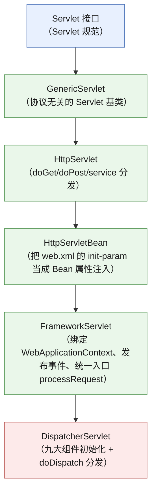
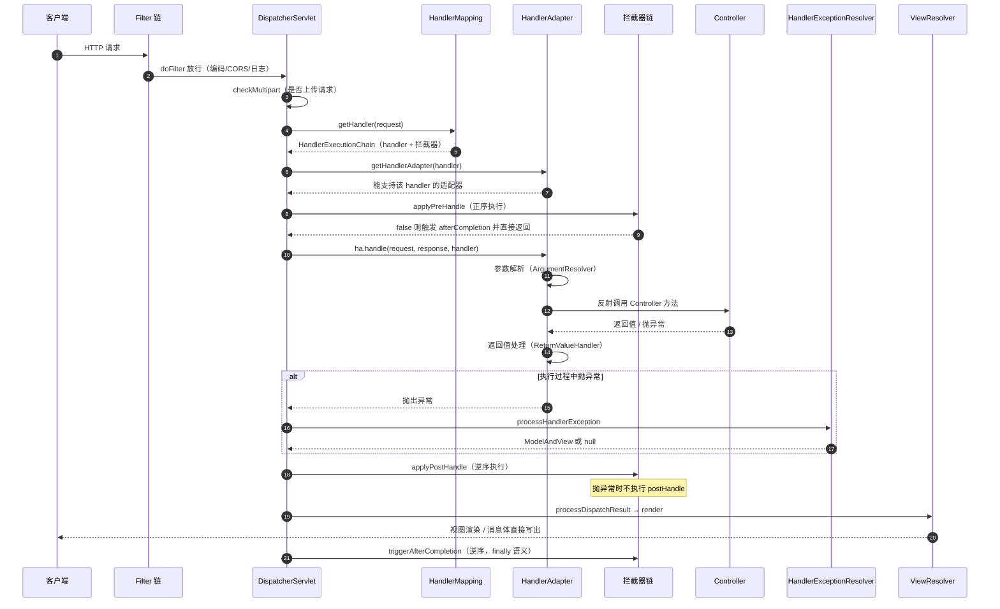
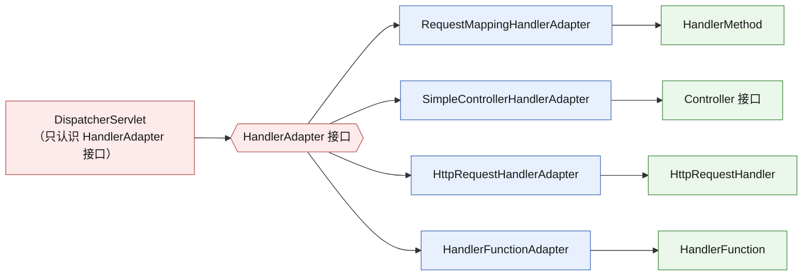
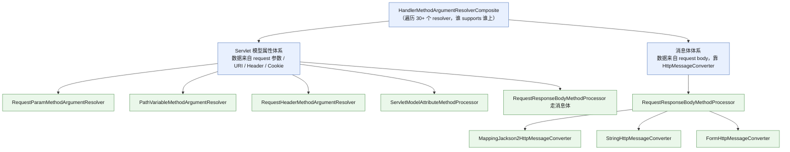
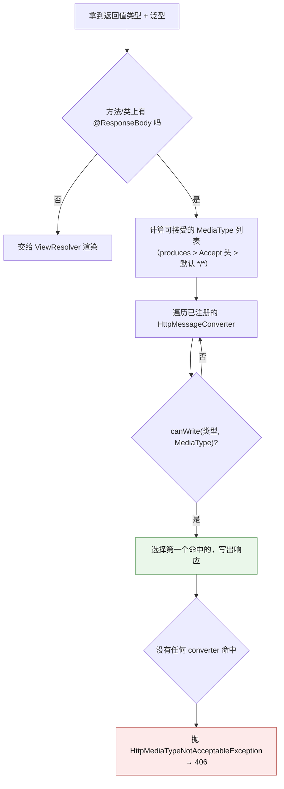
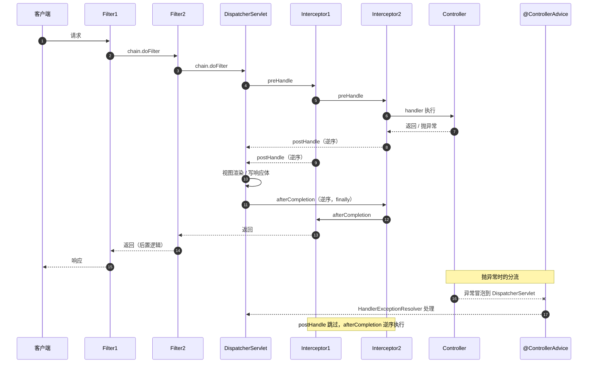
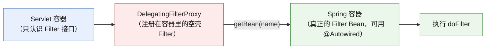
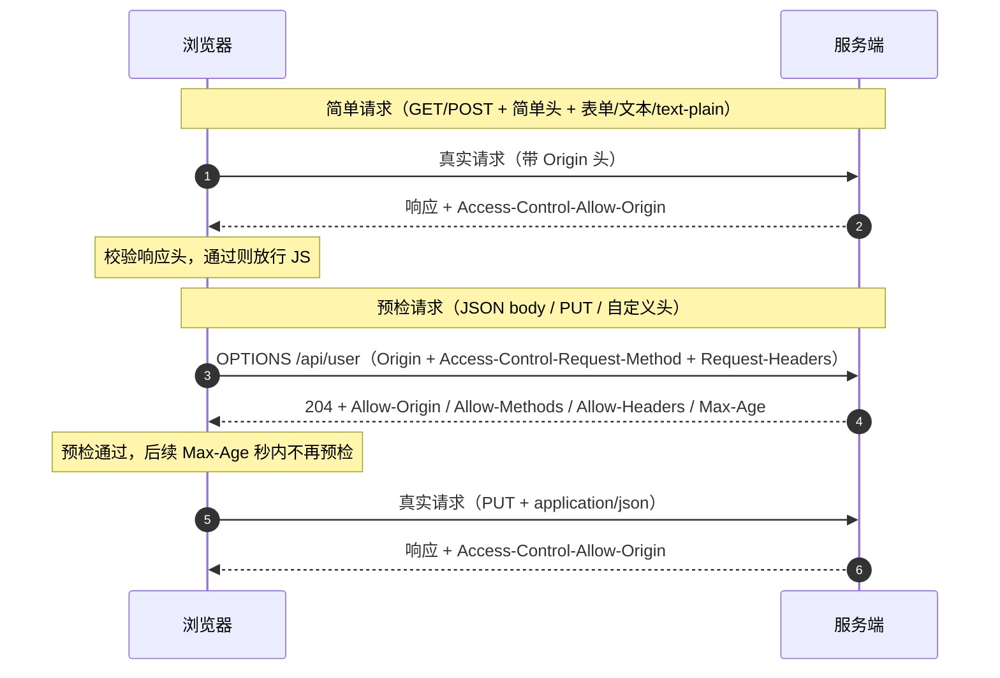

# 🕹️ 五、Spring MVC 请求全流程

> 这一篇回答一个问题：**一个 HTTP 请求从进 Tomcat 到出响应，中间到底经过了谁，每一层为什么存在。**
> 它是 [[spring.excalidraw|spring 脑图]] 里那条「发送请求 → DispatcherServlet → HandlerMapping → HandlerExecutionChain → Handler → HandlerAdapter → ModelAndView → ViewResolver → View → 渲染」主线的**文字详解版**——脑图是"图纸"，本篇是"施工图 + 工地踩坑记录"。
> 速答骨架见 [[面试准备/技术面试题库/13-Spring源码专题]]（那里是 30 秒报流程 + 类名，这里讲 WHY、配置、实战与排错）。系列目录见 [[0-Spring总览]]，前置知识见 [[1-Spring架构与IoC容器]] 与 [[2-Bean生命周期与依赖注入]]。

> [!important] 这一篇的定位（总监/负责人视角）
> 简历写「深入掌握 Spring MVC 源码」的候选人很多，但面试官真正区分人的三个问题几乎总是：
> ① **为什么要有 HandlerAdapter？**（说出「适配器模式让 DispatcherServlet 不依赖具体 handler 类型」是及格）
> ② **拦截器和过滤器到底什么区别，谁先谁后？**（答不出 `afterCompletion` 的 finally 语义是减分项）
> ③ **`@RequestBody` 和 `@RequestParam` 为什么是两套机制？**（能讲清「一个走 `ServletModelAttributeMethodProcessor`/`RequestParamMethodArgumentResolver` 的转换体系，一个走 `HttpMessageConverter` 的消息体体系」才是读过源码）
> 本篇围绕这三问展开，其余内容都是为了把它们讲透而必须的地基。

---

## 一、整体架构：前端控制器模式

### 1.1 为什么是「一个 Servlet 打天下」

早期 Java Web 的写法是 **一个 URL 一个 Servlet**（`/user/list` → `UserListServlet`，`/user/detail` → `UserDetailServlet`），`web.xml` 越写越长，公共逻辑（编码、鉴权、异常）只能在每个 Servlet 里复制一遍。

Spring MVC 用的是 **Front Controller（前端控制器）模式**：**所有请求先打到唯一入口 `DispatcherServlet`**，再由它**分发**给真正的处理器。这一步的收益是决定性的：

| 收益 | 具体体现 |
|---|---|
| 公共逻辑收口 | 编码、Locale、异常、视图渲染、参数解析全部集中在 DispatcherServlet 及其组件，业务 Controller 只管业务 |
| 组件可替换 | 换 JSON 库 = 换 `HttpMessageConverter`；换参数绑定策略 = 换 `HandlerMethodArgumentResolver`；业务代码零改动 |
| 可扩展 | 拦截器、`@ControllerAdvice`、CORS、内容协商都挂在统一链路上 |
| 可测试 | `DispatcherServlet` 可以被 MockMvc 直接驱动，不依赖真实容器 |

> [!note] 与 IoC 的关系
> DispatcherServlet 本身也是一个 **Bean**（由 `DispatcherServletAutoConfiguration` 通过 `ServletRegistrationBean` 注册），它持有的九大组件默认从容器里按类型查找 + 按名称回退，找不到才用 `DispatcherServlet.properties` 兜底。所以「MVC 组件可被业务替换」这件事，本质上是 **IoC 的扩展点在 Web 层的应用**——详见 [[1-Spring架构与IoC容器]]。

### 1.2 九大组件（一张表说清职责）

`DispatcherServlet` 在 `initStrategies()` 里初始化九大组件。**注意：找不到对应类型的 Bean 时，用 `DispatcherServlet.properties` 里的默认实现**，这也是为什么一个空的 Spring MVC 工程也能跑起来。

| # | 组件 | 接口方法 | 职责 | 默认实现 | 实战关注点 |
|---|---|---|---|---|---|
| 1 | `HandlerMapping` | `getHandler` | **URL → 处理器**，返回 `HandlerExecutionChain` | `RequestMappingHandlerMapping` / `BeanNameUrlHandlerMapping` / `RouterFunctionMapping` | 自定义注解路由的入口 |
| 2 | `HandlerAdapter` | `supports` / `handle` | **适配不同类型的 handler 并执行** | `RequestMappingHandlerAdapter` / `HttpRequestHandlerAdapter` / `SimpleControllerHandlerAdapter` | 为什么需要它——见 3.1 |
| 3 | `HandlerExceptionResolver` | `resolveException` | 异常 → `ModelAndView` | `ExceptionHandlerExceptionResolver` / `ResponseStatusExceptionResolver` / `DefaultHandlerExceptionResolver` | `@ControllerAdvice` 靠它生效 |
| 4 | `ViewResolver` | `resolveViewName` | 逻辑视图名 → `View` | `InternalResourceViewResolver`（Boot 下由 `ContentNegotiatingViewResolver` 兜底） | 前后端分离后基本只用于错误页 |
| 5 | `RequestToViewNameTranslator` | `getViewName` | Controller 没返回视图名时，**按请求 URL 猜一个** | `DefaultRequestToViewNameTranslator` | `/user/list` → 视图名 `user/list` |
| 6 | `LocaleResolver` | `resolveLocale` | 从请求解析 Locale | `AcceptHeaderLocaleResolver` | 国际化 `MessageSource` 配合 |
| 7 | `ThemeResolver` | `resolveThemeName` | 解析主题 | `FixedThemeResolver` | 基本已废弃，可一句带过 |
| 8 | `MultipartResolver` | `isMultipart` / `resolveMultipart` | **把请求包装成 `MultipartHttpServletRequest`** | `StandardServletMultipartResolver`（Servlet 3.0+） | 文件上传大小限制、临时目录 |
| 9 | `FlashMapManager` | `saveOutputFlashMap` / `retrieveAndUpdate` | **跨重定向传参**（RedirectAttributes） | `SessionFlashMapManager` | PRG 模式（Post-Redirect-Get） |

> [!tip] 面试问「九大组件」时怎么答得不像背书
> 不要平铺直叙念九个名字。按**请求生命周期的顺序**串起来说：
> 「请求进来先靠 `MultipartResolver` 决定要不要包装成上传请求 → `HandlerMapping` 找到 handler 和拦截器 → `HandlerAdapter` 执行 → 出异常交给 `HandlerExceptionResolver` → 正常返回要么走 `HttpMessageConverter` 写响应，要么交给 `ViewResolver` + `LocaleResolver`/`ThemeResolver` 渲染 → 重定向传参靠 `FlashMapManager`。」
> 最后补一句：「其余像 `RequestToViewNameTranslator` 是给『不返回视图名』这种历史写法兜底的，现在基本用不到。」——这句能体现你真读过而不是背的。

### 1.3 DispatcherServlet 的继承体系（以及为什么要有这么多层）



**每一层都在解决一个具体问题，不是"为了继承而继承"**：

| 层 | 核心动作 | 为什么必须单独一层 |
|---|---|---|
| `HttpServletBean` | `init()`：把 `init-param` 读取为 Bean 属性 | Servlet 的初始化参数是 `String→String` 的键值对，Spring 想用「属性注入」的思路处理它，于是提供了 **`init-param` 名可以带 `:ref` / 前缀** 的宽松解析。这层让 DispatcherServlet 的配置方式（`contextClass`、`namespace`、`publishEvents`）与 Bean 配置风格统一 |
| `FrameworkServlet` | `service`/`doGet`… 全部重写到 `processRequest()`；管理 `WebApplicationContext`；发布 `ServletRequestHandledEvent` | **把「Servlet 生命周期」和「Spring 容器生命周期」缝在一起**：容器随 Servlet `init` 创建、随 `destroy` 关闭。同时它提供了 `initFrameworkServlet()` 这个**空实现的模板方法**，让子类只在正确时机初始化自己的东西 |
| `DispatcherServlet` | `onRefresh()` → `initStrategies()` 初始化九大组件；`doService()` → `doDispatch()` | **只关心"分发"这一件事**。组件的创建、容器的绑定都已由父类完成，这里只做编排 |

> [!important] 为什么九大组件的初始化放在 `onRefresh()` 而不是 `initStrategies()` 直接调
> `FrameworkServlet` 在容器 `refresh()` 完成后才会走到 `onRefresh()` 回调，**这保证了组件查找时容器里的业务 Bean 已经全部就绪**。如果提前初始化，`HandlerMapping` 扫描 `@Controller` 就可能漏掉还没注册的 Bean。这就是「继承分层」带来的实际收益：**父类管时机，子类管内容**。

---

## 二、请求处理的完整流程（★核心）

### 2.1 全过程时序图



### 2.2 `doDispatch` 逐步拆解（谁调用谁 + 为什么需要这层）

下面按源码顺序走，**每一步都给出「这一层解决的问题」**。

#### 步骤 0：`checkMultipart` —— 请求形态可能被改变

```java
processedRequest = checkMultipart(request);   // 若是上传请求，包装成 MultipartHttpServletRequest
mappedHandler = getHandler(processedRequest);
```

- **做什么**：如果 `MultipartResolver.isMultipart(request)` 为真，把原始 `HttpServletRequest` **包装**为 `MultipartHttpServletRequest`。
- **为什么需要**：Servlet 规范里 `getParameter()` 对上传请求拿不到表单字段（数据在 body 里，且是 `multipart/form-data`）。这一层用**装饰器模式**在不改 Servlet 容器的前提下补齐了能力。
- **踩坑**：包装后 `request` 对象的引用变了——所以**不要在 Filter 里缓存 request 对象**，也不要在 Controller 里比较 `request == 原始对象`。另外 `StandardServletMultipartResolver` 依赖 `MultipartConfigElement` 配置（Boot 下由 `MultipartAutoConfiguration` + `spring.servlet.multipart.*` 提供）。

#### 步骤 1：`getHandler` —— URL 怎么变成「一个方法」

```java
for (HandlerMapping mapping : this.handlerMappings) {
    handler = mapping.getHandler(request);
    if (handler != null) break;         // 谁先命中谁负责
}
```

- **返回的不是 handler 本身，而是 `HandlerExecutionChain`** = `handler` + `List<HandlerInterceptor>` + `List<HandlerInterceptor>（异步）`。
- **为什么把拦截器塞进这条链**：拦截器的匹配规则（`pathPattern`、`order`）本质上和 URL 匹配同源，在**映射阶段**一并算好，避免执行阶段重复匹配；而且链对象本身能保证 `preHandle` / `postHandle` / `afterCompletion` 三段共享同一份拦截器集合与索引状态。
- **`RequestMappingHandlerMapping` 内部**：启动时扫描所有 `@Controller`，把每个 `@RequestMapping` 方法封装成 `RequestMappingInfo`（方法、路径、consumes、produces、params、headers 六个条件），存进 `MappingRegistry`。请求来时用 `PathPattern`（Boot 2.6+ 默认，替代 `AntPathMatcher`）匹配，并对候选做**最优匹配排序**（`RequestMappingInfo` 实现了 `Comparable`）。
- **常见 404 归因**：所有 `HandlerMapping` 都没命中 → `noHandlerFound`。Boot 默认会把 404 交给 `/error`（`ErrorMvcAutoConfiguration`），所以**开 `throw-exception-if-no-handler-found` 才能进 `@ControllerAdvice`**。

#### 步骤 2：`getHandlerAdapter` —— 为什么需要「适配器」这一层

```java
for (HandlerAdapter adapter : this.handlerAdapters) {
    if (adapter.supports(handler)) return adapter;
}
throw new ServletException("No adapter for handler ...");
```

**这是整篇最该讲透的设计**。handler 的类型是不统一的：

| handler 类型 | 由谁产生 | 谁执行 |
|---|---|---|
| `HandlerMethod`（`@RequestMapping` 方法） | `RequestMappingHandlerMapping` | `RequestMappingHandlerAdapter` |
| `Controller` 接口实现 | `BeanNameUrlHandlerMapping` | `SimpleControllerHandlerAdapter` |
| `HttpRequestHandler` | `BeanNameUrlHandlerMapping` | `HttpRequestHandlerAdapter` |
| `HandlerFunction`（函数式端点） | `RouterFunctionMapping` | `HandlerFunctionAdapter` |
| `Servlet` | `SimpleUrlHandlerMapping` | `SimpleServletHandlerAdapter` |

如果 `DispatcherServlet` 直接 `((Controller) handler).handleRequest(...)`，它就必须 **import 所有 handler 类型的 API**，任何新 handler 类型都要改 DispatcherServlet——**违反开闭原则**。加一层 `HandlerAdapter` 后：



> [!important] 一句话回答「为什么要有 HandlerAdapter」
> **因为 handler 有多种类型，而 DispatcherServlet 只应该依赖抽象。** `HandlerAdapter` 是适配器模式的落地：把「不同类型的处理器」统一成 `supports()` + `handle()` 两个方法，新增 handler 类型只需新增适配器，**DispatcherServlet 一行不动**。这也是 Spring 里「策略 + 适配器」组合最经典的示范。

#### 步骤 3：`applyPreHandle` —— 拦截器的第一道闸门

```java
if (!mappedHandler.applyPreHandle(processedRequest, response)) {
    return;   // 注意：applyPreHandle 内部已经对已成功执行的拦截器调了 afterCompletion
}
```

- **正序**执行（`order` 小的先执行）。
- 返回 `false` 时：**当前拦截器自身和它之后的都不执行 `postHandle`**，但**之前已成功 `preHandle` 的拦截器会逆序执行 `afterCompletion`**。这条语义极重要——它意味着 `afterCompletion` 是「资源释放点」，你在 `preHandle` 里开的资源（如 `ThreadLocal`、MDC、租户上下文）一定会被回收。

#### 步骤 4：`ha.handle` —— 参数解析 + 调用 + 返回值处理

这是业务代码真正跑起来的地方，内部三段：**`invokeHandlerMethod`**（参数解析 → 反射调用 → 返回值处理）。细节见第三章与第四章。

#### 步骤 5：`applyPostHandle` —— 只有在成功路径上才执行

```java
if (mv != null && !mv.wasCleared()) {
    render(mv, processedRequest, response);
}
```

- **逆序**执行。
- **抛异常时整个 `applyPostHandle` 不会被调用**（因为异常从 `ha.handle` 抛出后直接跳到 `catch` 分支）。这是高频追问点，原因见下一节。

#### 步骤 6：`processDispatchResult` —— 渲染或异常处理

```java
if (exception != null) {
    mv = processHandlerException(request, response, handler, exception);
}
if (mv != null && !mv.wasCleared()) {
    render(mv, request, response);
    ...
} else {
    if (response.isCommitted()) { ... }   // 响应已提交却没视图 → 只能记日志
}
```

- 异常优先交给 `HandlerExceptionResolver` 链，返回的 `ModelAndView` **同样会走渲染流程**——所以 `@ExceptionHandler` 方法返回一个视图名是合法的。
- 渲染由 `ViewResolver` 完成；`@ResponseBody` 场景下 `mv` 为 `null`（响应已在 `ha.handle` 里写出），所以直接跳过渲染。

#### 步骤 7：`triggerAfterCompletion` —— finally 语义的收尾

- 在 **`finally`** 块中调用，**无论成功、异常、还是 `preHandle` 返回 false 都会执行**（若走的是 `applyPreHandle` 的提前返回路径，则由 `applyPreHandle` 内部负责）。
- **逆序**执行，且只对**已成功执行过 `preHandle` 的拦截器**执行——这是为了防止「`preHandle` 都没进过却去 `afterCompletion`」造成 `ThreadLocal` 误清理。

### 2.3 三个回调方法的执行语义（一张表背下来）

| 回调 | 执行时机 | 顺序 | 抛异常时 | 典型用途 |
|---|---|---|---|---|
| `preHandle` | handler 执行**前** | 正序 | 当前及之后不再执行 | 鉴权、限流、租户上下文、MDC traceId |
| `postHandle` | handler 执行**后**、视图渲染**前** | 逆序 | **不执行** | 往 `ModelAndView` 塞公共数据、耗时统计 |
| `afterCompletion` | 视图渲染**后**（`finally`） | 逆序 | **必执行** | 清理 `ThreadLocal`、释放资源、异常审计 |

> [!question] 必答：为什么 `postHandle` 在异常时不执行？
> 因为 `postHandle` 的**设计语义是「处理器正常返回后、视图渲染前的加工点」**——此时 `ModelAndView` 是有效且完整的，往里面塞数据是有意义的。一旦抛异常，`ModelAndView` 根本不存在（`mv` 为 null），`postHandle` 无从下手。
> 更本质的原因在代码结构上：`applyPostHandle` 位于 `try` 块内 `ha.handle` 之后，异常会直接跳到 `catch`，**它是"成功路径专属"的回调**。
> 相对地，`afterCompletion` 放在 `finally`，**语义是"资源清理"**——资源清理必须无论成败都做，否则 `ThreadLocal` 泄漏、连接不释放。
> **实践结论：需要"无论成败都执行"的逻辑一律写 `afterCompletion`，不要写 `postHandle` 再 try-catch 兜底。**

---

## 三、参数绑定机制（实战最常用）

### 3.1 两套并行的体系：`ArgumentResolver` vs `HttpMessageConverter`

这是理解 MVC 参数绑定的**总纲**：



**关键差异**：Servlet 体系的 resolver 走的是 **`WebDataBinder` + `ConversionService`**（字符串 → 目标类型的转换）；消息体体系走的是 **`HttpMessageConverter`**（字节流 → 对象，通常交给 Jackson），**完全不经过 `WebDataBinder`**。所以：

- 给 `@RequestBody` 的字段加 `@DateTimeFormat` **没用**（那是 `Formatter` 体系的注解），要用 `@JsonFormat`。
- `@InitBinder` 对 `@RequestBody` **不生效**。

### 3.2 各类注解的解析器与数据来源（★核心表格）

| 注解 / 写法 | 实际 resolver | 数据来源 | 转换机制 | 是否单值 |
|---|---|---|---|---|
| `@RequestParam` | `RequestParamMethodArgumentResolver` | `request.getParameter`（query string 或 form-urlencoded body） | `WebDataBinder` / `ConversionService` | 单值（可 `List`/数组） |
| `@PathVariable` | `PathVariableMethodArgumentResolver` | `HandlerMapping` 匹配出的 URI 模板变量 | 同上 | 单值 |
| `@RequestHeader` | `RequestHeaderMethodArgumentResolver` | 请求头 | 同上 | 单值 |
| `@CookieValue` | `ServletCookieValueMethodArgumentResolver` | Cookie | 同上 | 单值 |
| `@SessionAttribute` | `SessionAttributeMethodArgumentResolver` | `HttpSession` 属性 | 直接取值，不转换 | 任意 |
| `@RequestAttribute` | `RequestAttributeMethodArgumentResolver` | request 域属性（Filter/拦截器塞的） | 直接取值 | 任意 |
| **不加注解的 POJO** | `ServletModelAttributeMethodProcessor` | `request.getParameter` 逐字段 set | `WebDataBinder` + 校验 | 对象 |
| `@ModelAttribute` | 同上（`ModelMethodProcessor` 处理无注解返回值的场景） | 同上，并**自动加入 Model** | 同上 | 对象 |
| `@RequestBody` | `RequestResponseBodyMethodProcessor` | **请求体字节流** | `HttpMessageConverter`（Jackson 等） | 对象 |
| `HttpServletRequest` / `ServletResponse` / `HttpSession` / `Principal` / `Locale` / `TimeZone` / `InputStream` / `Reader` | `ServletRequestMethodArgumentResolver` | 容器对象 | 直接注入 | — |
| `Map` / `Model` / `ModelMap` | `MapMethodProcessor` / `ModelMethodArgumentResolver` | 容器提供的 Model | — | — |
| `Errors` / `BindingResult` | `ErrorsMethodArgumentResolver` | **紧跟在被校验参数之后** | — | — |
| `@RequestPart` | `RequestPartMethodArgumentResolver` | multipart 的某个 part | 消息体或绑定 | — |

> [!warning] 不加注解的 POJO 有个隐蔽陷阱
> 一个**没有加任何注解**的 POJO 参数会被 `ServletModelAttributeMethodProcessor` 当作**表单对象**处理：它从 query string 逐字段 set，**并且会把该对象放进 Model**。所以：
> - 如果前端用 JSON 提交而你没加 `@RequestBody`，你只会得到一个**所有字段都是 null 的空对象**（不报错！），因为 query string 里什么都没有。
> - 名字很像「模型属性」的类会被误判。想显式表达意图，一律**显式加注解**。

### 3.3 `@RequestBody` vs `@RequestParam`（必答对比）

| 维度 | `@RequestParam` | `@RequestBody` |
|---|---|---|
| 数据位置 | query string / `application/x-www-form-urlencoded` body | **请求体** |
| 处理组件 | `RequestParamMethodArgumentResolver` | `RequestResponseBodyMethodProcessor` |
| 转换机制 | `WebDataBinder` + `ConversionService`（一个个字段转） | `HttpMessageConverter`（整体反序列化） |
| 是否走校验注解 | 需要类上加 `@Validated`（方法级校验），`@Valid` 对非对象参数无效 | 对象上 `@Valid` 直接生效 |
| 支持 `Content-Type` | 仅表单类 | `application/json`、`application/xml` 等 |
| 能否处理复杂嵌套 | 不方便 | 天然支持 |
| `@InitBinder` / `@DateTimeFormat` | 生效 | **不生效**（要用 `@JsonFormat`） |
| 典型错误 | 忘了 `@RequestParam` 且前端发 JSON → 全部 null | 忘加 `@RequestBody` 且前端发 JSON → 400 或字段全 null |
| 缺参处理 | `required=false` 可空；否则 400 | body 为空 → `HttpMessageNotReadableException` → 400 |

> [!tip] 一句话回答「`@RequestBody` 和 `@RequestParam` 的区别」
> **它们根本是两套机制。** `@RequestParam` 属于「Servlet 请求参数 → Java 类型」的**逐字段转换体系**，靠 `WebDataBinder`/`ConversionService`，能处理的只有字符串键值对；`@RequestBody` 属于「请求体字节流 → 对象」的**消息转换体系**，靠 `HttpMessageConverter`（默认 Jackson），做的是整体反序列化。这也解释了为什么 `@DateTimeFormat`、`@InitBinder` 对 `@RequestBody` 无效——它们只在前一套体系里工作。

### 3.4 日期 / 枚举 / 自定义类型的转换

三套机制，选错就踩坑：

| 机制 | 注解/接口 | 作用范围 | 适用场景 |
|---|---|---|---|
| `Converter<S,T>` | 实现接口并注册到 `ConversionService` | 全局 | 通用类型转换（如 `String → Money`） |
| `Formatter<T>` | 实现 `Formatter<T>`，**面向字符串**，可携带 Locale | 全局 | 日期、金额等**有显示格式**的场景 |
| 注解驱动 | `@DateTimeFormat`（`Formatter` 体系）、`@NumberFormat` | 字段级 | 日期/数字格式，最常用 |
| Jackson 注解 | `@JsonFormat` | `@RequestBody` 字段 | JSON 报文里的日期格式 |
| 枚举 | `ConverterFactory` 或 `@JsonCreator` | 全局 | **枚举转换失败会抛 `MethodArgumentTypeMismatchException` → 400，且报错信息很晦涩** |

**注册方式（Boot 下的推荐写法）**：

```java
@Configuration
public class WebConversionConfig implements WebMvcConfigurer {

    @Override
    public void addFormatters(FormatterRegistry registry) {
        // 全局注册：任何 @RequestParam/@PathVariable/表单绑定都能用
        registry.addConverter(new StringToMoneyConverter());
        registry.addFormatterForFieldAnnotation(new MyFormatterAnnotationFactory());
    }

    @Override
    public void addArgumentResolvers(List<HandlerMethodArgumentResolver> resolvers) {
        // 自定义参数解析：例如 @CurrentUser 直接注入登录用户
        resolvers.add(new CurrentUserArgumentResolver());
    }
}
```

**局部注册（只对一个 Controller 生效）**用 `@InitBinder`：

```java
@InitBinder
public void initBinder(WebDataBinder binder) {
    // 注意：只对 @ModelAttribute / 表单绑定生效，对 @RequestBody 无效
    binder.registerCustomEditor(Date.class, new CustomDateEditor(new SimpleDateFormat("yyyy-MM-dd"), true));
    binder.setDisallowedFields("id", "createTime");   // 防前端越权改字段（安全点！）
}
```

> [!danger] `@InitBinder` 的安全价值常被忽略
> 表单绑定场景下，前端多传一个 `role=ADMIN` 或 `balance=999999` 就能直接改到不该改的字段（**Mass Assignment 漏洞**）。用 `binder.setDisallowedFields(...)` 或把敏感字段封进独立 DTO，是最低成本的防护。这也是「POJO 直接绑定」在高安全要求系统里不被推荐的原因。

> [!note] 校验的触发方式
> - `@RequestBody` 对象：参数上加 `@Valid` / `@Validated` 即可，失败抛 `MethodArgumentNotValidException`。
> - 非对象参数（`@RequestParam`）：需要类上加 `@Validated`（Spring 的 `MethodValidationPostProcessor` 生成代理），失败抛 `ConstraintViolationException`。
> - **两者异常类型不同，统一异常处理必须都覆盖**，否则一个 400 一个 500。详见 [[8-Spring实战与踩坑]]。

---

## 四、返回值处理

### 4.1 `HandlerMethodReturnValueHandler` 体系

| 返回值 | 处理器 | 行为 |
|---|---|---|
| `@ResponseBody` / `@RestController` 方法 | `RequestResponseBodyMethodProcessor` | 选 `HttpMessageConverter` **直接写响应体**，`mv` 为 null |
| `ResponseEntity<T>` | `HttpEntityMethodProcessor` | 写入状态码 + 响应头 + body |
| `ModelAndView` | `ModelAndViewMethodReturnValueHandler` | 交给 `ViewResolver` 渲染 |
| `String`（无 `@ResponseBody`） | `ViewNameMethodReturnValueHandler` | 当作**逻辑视图名** |
| `String`（有 `@ResponseBody`） | `RequestResponseBodyMethodProcessor` | 当作响应体（`StringHttpMessageConverter`） |
| `void` | `RequestResponseBodyMethodProcessor`（有 `@ResponseBody`）否则无操作 | 自己用 `HttpServletResponse` 写 |
| `Callable` / `DeferredResult` / `WebAsyncTask` | 异步处理器 | 异步返回，Servlet 线程提前释放 |
| `@ModelAttribute`（无 `@ResponseBody`） | `ModelMethodProcessor` | 放进 Model 供视图使用 |

> [!warning] `@RestController` 与 `@ResponseBody` 的关系
> `@RestController` **就是** `@Controller` + `@ResponseBody` 的组合注解（元注解上标注）。所以类上加 `@RestController` 相当于**给该类所有方法都加了 `@ResponseBody`**。
> **踩坑**：在 `@RestController` 里返回 `String` 视图名，会**直接把视图名当字符串写进响应体**，而不是渲染页面。要返回视图必须用 `@Controller` 或方法上单独标注——但 `@ResponseBody` 无法「反向取消」，只能改类注解。

### 4.2 `HttpMessageConverter` 的选择依据

选择发生在 `AbstractMessageConverterMethodProcessor.writeWithMessageConverters`，逻辑是：



**注册顺序（Boot 默认，可影响结果）**：`ByteArrayHttpMessageConverter` → `StringHttpMessageConverter` → `ResourceHttpMessageConverter` → `AllEncompassingFormHttpMessageConverter` → **`MappingJackson2HttpMessageConverter`** → `MappingJackson2XmlHttpMessageConverter`（若引入 Jackson XML）。

**三个决定性因素**：
1. **`produces`**（`@RequestMapping(produces = "application/json")`）——优先级最高，直接限定 MediaType。
2. **`Accept` 请求头**——客户端声明能接受什么。**注意 `Accept: text/html` 的浏览器会走内容协商，可能命中 `MappingJackson2XmlHttpMessageConverter` 或返回 HTML 错误页**。
3. **返回类型**——`String` 会被 `StringHttpMessageConverter` 抢先（这就是为什么有时候想返回 JSON 字符串却变成 `text/plain`）。

### 4.3 三类高频事故（链接实战篇）

| 症状 | 根因 | 解决 |
|---|---|---|
| **406 Not Acceptable** | 没有 converter 能写出请求 `Accept` 要求的类型；常见于 `produces` 或 `Accept` 与 Jackson 支持的不匹配 | 检查 `produces`、请求 `Accept`；确认 Jackson 依赖在 classpath；必要时加 `MappingJackson2HttpMessageConverter` 的 `supportedMediaTypes` |
| **中文乱码 / `????`** | `StringHttpMessageConverter` 默认字符集问题（早期 Spring 是 ISO-8859-1）；或 `server.servlet.encoding` 未配 | 配 `server.servlet.encoding.charset=UTF-8` + `force=true`；优先返回对象而非手写 `String` |
| **`LocalDateTime` 序列化格式不对** | Jackson 默认把 `LocalDateTime` 序列化成 **数组/时间戳**（`[2026,10,10,12,0,0]`）或 ISO 无格式字符串，前端解析失败 | 全局配 `Jackson2ObjectMapperBuilderCustomizer` 注册 `JavaTimeModule` + 自定义 `LocalDateTimeSerializer`；或字段级 `@JsonFormat(pattern="yyyy-MM-dd HH:mm:ss", timezone="GMT+8")` |

```java
@Configuration
public class JacksonConfig {
    private static final DateTimeFormatter FMT =
            DateTimeFormatter.ofPattern("yyyy-MM-dd HH:mm:ss");

    @Bean
    public Jackson2ObjectMapperBuilderCustomizer jacksonCustomizer() {
        return builder -> {
            builder.serializerByType(LocalDateTime.class,
                    new LocalDateTimeSerializer(FMT));
            builder.deserializerByType(LocalDateTime.class,
                    new LocalDateTimeDeserializer(FMT));
            // 关键：不要用 WRITE_DATES_AS_TIMESTAMPS
            builder.featuresToDisable(SerializationFeature.WRITE_DATES_AS_TIMESTAMPS);
            builder.serializationInclusion(JsonInclude.Include.NON_NULL);
        };
    }
}
```

> [!tip] 为什么推荐返回对象而不是 `String`
> 返回 `String` 时命中的是 `StringHttpMessageConverter`，**完全不经过 Jackson**：不会应用你的 `ObjectMapper` 配置、不会做 `JsonInclude`、字符集由 `StringHttpMessageConverter` 决定。**所有"我明明配了全局 Jackson，为什么没用"的问题，八成是因为返回了 String 或手写 `response.getWriter().write()`。** 更多实战案例见 [[8-Spring实战与踩坑]]。

---

## 五、拦截器 vs 过滤器（★高频）

### 5.1 本质区别

| 维度 | Filter | HandlerInterceptor |
|---|---|---|
| 归属规范 | **Servlet 规范**（`javax/jakarta.servlet`） | **Spring MVC 框架** |
| 作用位置 | Servlet 容器层，**在 DispatcherServlet 之前/之后** | DispatcherServlet **内部**，handler 映射之后 |
| 执行时机 | `doFilter` 包住整个请求（含视图渲染后的写回） | `preHandle` / `postHandle` / `afterCompletion` 三段 |
| 能否拿到 handler | **不能**（不知道会匹配到哪个方法） | **能**（`Object handler`，可强转 `HandlerMethod` 拿注解） |
| 能否拿到 ModelAndView | 不能 | `postHandle` 能 |
| 能否修改请求体 | 能（包装 `HttpServletRequestWrapper` 重写 `getInputStream`） | **基本不能**（读一次就没了；能改参数是因为包装在 Filter 层完成） |
| 执行顺序控制 | `@Order` / `FilterRegistrationBean.setOrder()` / `web.xml` 顺序 | `WebMvcConfigurer.addInterceptors` 的注册顺序 + 拦截器的 `order` |
| 依赖注入 | 普通 Bean 可注入（`OncePerRequestFilter`），但 `@Autowired` 在原生 Filter 里可能不可用 | 天然是 Spring Bean，任意注入 |
| 触发不足 | 所有请求（含静态资源） | 仅被 `HandlerMapping` 命中的请求 |
| 典型用途 | 编码、CORS、TraceId、请求日志、请求体加解密、XSS 过滤 | 鉴权（需读注解）、限流（按方法）、租户上下文、业务耗时、审计 |

> [!important] 一句话回答「拦截器和过滤器的区别」
> **过滤器是 Servlet 规范的、容器级的、在 DispatcherServlet 之前的；拦截器是 Spring MVC 的、handler 级的、在 DispatcherServlet 内部的。** 关键差异是**拦截器能拿到 `HandlerMethod`**（因此能读方法上的注解做声明式鉴权），**过滤器不能**。另外 Filter 能包装请求体，拦截器不能。
> **选型口诀**：需要「改请求/响应本身」→ Filter；需要「按方法/注解做决策」→ Interceptor。

### 5.2 完整执行顺序（Filter → Interceptor → Controller）



**顺序总结（背下来）**：

| 阶段 | Filter | Interceptor |
|---|---|---|
| 进入（请求方向） | 正序 `F1 → F2` | 正序 `I1 → I2` |
| 返回（响应方向） | **逆序**（`F2` 的后置代码先执行） | **逆序** `I2 → I1` |
| 异常路径 | 后置代码仍执行（`try/finally` 语义） | `postHandle` **跳过**，`afterCompletion` 逆序执行 |

> [!warning] 顺序控制的两个坑
> 1. **Filter 的顺序不是「注册顺序」这么简单**：`@Order` 对 `FilterRegistrationBean` 生效，但对**直接实现 `Filter` 并标 `@Component`** 的 Bean，Boot 会按 Bean 名称排序（不可靠）。**生产环境一律用 `FilterRegistrationBean` 显式 `setOrder()`。**
> 2. **拦截器的「注册顺序」在 Boot 下被 `order` 覆盖**：`InterceptorRegistry.addInterceptor` 支持 `order()`，不设则用注册顺序（默认 0）。**鉴权拦截器必须设置比日志拦截器更大的 order（更晚执行）**，否则日志里看不到鉴权拒绝的原因。

### 5.3 `DelegatingFilterProxy` —— Servlet Filter 与 Spring Bean 的桥

**问题**：Servlet 容器管理 Filter 的创建，Spring 管理 Bean 的创建。容器不认识 `@Autowired`，所以「一个需要注入依赖的 Filter」无法直接被容器实例化。

**解法**：



- `DelegatingFilterProxy` 实现 `Filter`，`doFilter` 里 **懒加载**（默认第一次请求时 `initDelegate`）从 `WebApplicationContext` 取名为 `targetBeanName` 的 Bean 并转发调用。
- **为什么懒加载**：Filter 的 `init` 时机可能早于 Spring 容器 `refresh` 完成，提前 `getBean` 会失败。
- Boot 里最常见的使用者是 **`springSecurityFilterChain`**（`SecurityFilterAutoConfiguration` 注册 `DelegatingFilterProxyRegistrationBean`）——这就是「Spring Security 的过滤器链为什么是 Bean」的答案。
- Boot 还提供了 `DelegatingFilterProxyRegistrationBean`，让它在 `ServletContextInitializer` 体系里工作，从而支持**精确控制顺序**。

---

## 六、异常处理

### 6.1 三层异常处理体系

| 层 | 机制 | 作用范围 | 优先级 |
|---|---|---|---|
| 1 | `@ExceptionHandler`（同类内） | 单个 Controller | 最高（同类内先命中） |
| 2 | `@ControllerAdvice` / `@RestControllerAdvice` + `@ExceptionHandler` | 全局（可限定） | 次之 |
| 3 | `HandlerExceptionResolver` 链（默认三个） | 全局兜底 | 最后 |
| 4 | 容器 `/error`（`BasicErrorController`） | 上面都没接住 | 最终兜底 |

**默认 `HandlerExceptionResolver` 的顺序**（`WebMvcConfigurationSupport` 里注册）：

1. **`ExceptionHandlerExceptionResolver`** —— 处理 `@ExceptionHandler`（含 `@ControllerAdvice`）。
2. **`ResponseStatusExceptionResolver`** —— 处理 `@ResponseStatus` 注解，以及 `ResponseStatusException`。
3. **`DefaultHandlerExceptionResolver`** —— 处理 Spring MVC 自己抛出的标准异常（`HttpRequestMethodNotSupportedException` → 405、`HttpMediaTypeNotSupportedException` → 415、`MissingServletRequestParameterException` → 400 等）。

> [!note] `resolveException` 返回 `null` 的含义
> 返回 `null` 表示「**我处理不了，交给下一个 resolver**」。所以自定义 resolver 时返回 null 是**正常且推荐**的（而不是抛异常）。**一旦某个 resolver 返回了非 null 的 `ModelAndView`，链就终止。** 理解这一点才能解释「为什么我的 `@ExceptionHandler` 没生效」——大概率是**前面有别的 `@ControllerAdvice` 先命中了**（Advice 的 `order` 决定顺序）。

### 6.2 `@ControllerAdvice` 的三种限定方式

```java
// 1. 按注解限定：只对标注了 @RestController 的 Controller 生效
@RestControllerAdvice(annotations = RestController.class)
public class RestExceptionAdvice { ... }

// 2. 按包限定：只对指定包（及其子包）生效
@RestControllerAdvice(basePackages = "com.example.api")
public class ApiExceptionAdvice { ... }

// 3. 按类型限定：只对指定 Controller 类（及其子类）生效
@RestControllerAdvice(assignableTypes = {UserController.class, OrderController.class})
public class SpecificAdvice { ... }
```

| 限定方式 | 语义 | 典型用途 |
|---|---|---|
| `annotations` | 匹配「类上有这些注解」 | 区分 REST 接口与页面接口的返回格式 |
| `basePackages` / `basePackageClasses` | 匹配包路径 | 多模块系统按模块隔离异常策略 |
| `assignableTypes` | 匹配具体类 | 特殊接口定制 |
| `order`（配合 `@Order`） | 多个 Advice 的优先级 | **数字越小越先命中** |

> [!warning] 多个 `@ControllerAdvice` 的命中规则是"最先匹配的赢"
> `ExceptionHandlerExceptionResolver` 会遍历所有 Advice（按 `order` 排序），**第一个 `isApplicableToBeanType` 通过且 `@ExceptionHandler` 匹配上的直接返回**。所以两个 `@ControllerAdvice` 都声明了 `@ExceptionHandler(Exception.class)` 时，order 大的那个**永远不会执行**。生产建议：**全局兜底 Advice 设 `@Order(Ordered.LOWEST_PRECEDENCE)`**，业务 Advice 设更小的值。

### 6.3 统一异常返回结构（生产骨架）

```java
// 统一响应体
public record ApiResponse<T>(int code, String message, T data, String traceId) {
    public static <T> ApiResponse<T> ok(T data) { return new ApiResponse<>(0, "ok", data, MDC.get("traceId")); }
    public static <T> ApiResponse<T> fail(int code, String msg) { return new ApiResponse<>(code, msg, null, MDC.get("traceId")); }
}

// 业务异常基类
public class BizException extends RuntimeException {
    private final int code;
    public BizException(int code, String message) { super(message); this.code = code; }
    public int getCode() { return code; }
}

@RestControllerAdvice
@Order(Ordered.LOWEST_PRECEDENCE)   // 兜底，永远最后
public class GlobalExceptionHandler {

    private static final Logger log = LoggerFactory.getLogger(GlobalExceptionHandler.class);

    /** 业务异常：可预期，WARN 级别，不打堆栈 */
    @ExceptionHandler(BizException.class)
    public ResponseEntity<ApiResponse<Void>> handleBiz(BizException e) {
        log.warn("biz error code={} msg={}", e.getCode(), e.getMessage());
        return ResponseEntity.status(HttpStatus.OK)
                .body(ApiResponse.fail(e.getCode(), e.getMessage()));
    }

    /** 参数校验失败：@RequestBody + @Valid */
    @ExceptionHandler(MethodArgumentNotValidException.class)
    public ResponseEntity<ApiResponse<Void>> handleValid(MethodArgumentNotValidException e) {
        String msg = e.getBindingResult().getFieldErrors().stream()
                .map(f -> f.getField() + ": " + f.getDefaultMessage())
                .collect(Collectors.joining("; "));
        return ResponseEntity.badRequest().body(ApiResponse.fail(400, msg));
    }

    /** 参数校验失败：类上 @Validated + @RequestParam */
    @ExceptionHandler(ConstraintViolationException.class)
    public ResponseEntity<ApiResponse<Void>> handleConstraint(ConstraintViolationException e) {
        return ResponseEntity.badRequest().body(ApiResponse.fail(400, e.getMessage()));
    }

    /** 请求体不可读：JSON 格式错误 */
    @ExceptionHandler(HttpMessageNotReadableException.class)
    public ResponseEntity<ApiResponse<Void>> handleUnreadable(HttpMessageNotReadableException e) {
        return ResponseEntity.badRequest().body(ApiResponse.fail(400, "请求体格式错误"));
    }

    /** 405 / 415 等标准异常交给 DefaultHandlerExceptionResolver 更合适，这里只兜底未知 */
    @ExceptionHandler(Exception.class)
    public ResponseEntity<ApiResponse<Void>> handleUnknown(Exception e) {
        log.error("unhandled exception", e);   // ERROR 级别，打全堆栈
        return ResponseEntity.status(HttpStatus.INTERNAL_SERVER_ERROR)
                .body(ApiResponse.fail(500, "系统繁忙，请稍后重试"));
    }
}
```

**设计要点**：

| 要点 | 理由 |
|---|---|
| 业务异常返回 HTTP 200 + 业务 code，还是 HTTP 4xx/5xx？ | **对外 API 推荐语义化状态码**（400/404/409），**内部 RPC 风格可统一 200 + code**。关键是**全系统一致**，不要让网关和设备端都要猜 |
| WARN vs ERROR 分级 | 业务异常是「预期内的」，打 ERROR 会污染告警。**只有未知异常才 ERROR + 堆栈** |
| 一定带 `traceId` | 客户端报错截图能直接定位日志，省掉大量沟通成本 |
| **不要把 `e.getMessage()` 原样返回给用户** | 可能泄漏 SQL、表名、内网地址。**未知异常一律返回固定文案** |

### 6.4 为什么异常处理里不能再抛异常

| 场景 | 会发生什么 |
|---|---|
| `@ExceptionHandler` 方法内部抛异常 | 该 resolver **放弃处理**，冒泡给下一个 `HandlerExceptionResolver`；都处理不了 → 交给容器 `/error`（`BasicErrorController`）→ 返回 Whitelabel 错误页或默认 JSON。**你精心设计的统一格式失效了** |
| 响应已提交后再抛 | `response.isCommitted()` 为真，**无法再改状态码和响应体**，只能在日志里看到 `AsyncRequestNotUsableException` 之类的二次异常，排查时极具迷惑性 |
| 在 `@ExceptionHandler` 里做重 I/O（查库、调远程） | 一旦这个 I/O 也失败（超时、连接池打满），**双重故障**，且异常处理路径本身通常没有熔断保护 |
| `@ExceptionHandler` 里做异步/事务 | 异常处理不在事务范围内（事务已回滚完），写库操作会**以新事务独立提交**，语义上容易出错 |

> [!danger] 生产铁律
> **异常处理器必须是"最不可能失败"的代码路径。** 只做三件事：读异常信息、组装返回体、写日志。**不查库、不调远程、不再抛异常。** 如果必须记录审计信息，用异步消息或本地队列削峰，绝不在异常路径上同步做 I/O。

---

## 七、RESTful 与内容协商

### 7.1 `@RestController` + `ResponseEntity`

```java
@RestController
@RequestMapping("/api/v1/users")
public class UserController {

    @GetMapping("/{id}")
    public ResponseEntity<UserVO> get(@PathVariable Long id) {
        return userService.findById(id)
                .map(ResponseEntity::ok)
                .orElseGet(() -> ResponseEntity.notFound().build());
    }

    @PostMapping(consumes = "application/json", produces = "application/json")
    public ResponseEntity<UserVO> create(@Valid @RequestBody UserCreateCmd cmd) {
        UserVO vo = userService.create(cmd);
        return ResponseEntity
                .created(URI.create("/api/v1/users/" + vo.id()))   // 201 + Location 头
                .body(vo);
    }
}
```

| 用法 | 场景 |
|---|---|
| `@RestController` + 直接返回对象 | 最常用，语义最简 |
| `ResponseEntity<T>` | 需要**精确控制状态码/响应头**（201、204、ETag、Content-Disposition） |
| `HttpServletResponse` 直接写 | 流式下载、SSE；**但会绕过所有转换器，谨慎** |

### 7.2 内容协商（`ContentNegotiationManager`）

**三种策略，按顺序生效**：

| 策略 | 依据 | Boot 默认 | 说明 |
|---|---|---|---|
| 按 `Accept` 头 | 请求头 | **开启** | 标准做法，推荐 |
| 按路径后缀 | `/user.json`、`/user.xml` | **Boot 2.7+ 默认关闭**（`useSuffixPatternMatch` 移除） | 有安全风险（RFD / 缓存污染），**不要开** |
| 按请求参数 | `?format=json` | 默认关闭 | 老系统遗留写法 |

**为什么路径后缀被禁用**：后缀匹配会导致 `/user.json` 与 `/user` 映射到同一个 handler，**为缓存投毒和权限绕过提供了空间**（例如安全框架只拦 `/admin/*`，攻击者用 `/admin/xxx.json` 绕过）。这是「RESTful 为什么必须靠 `Accept` 头」的安全理由。

### 7.3 `consumes` / `produces` 的作用

```java
@PostMapping(value = "/users",
        consumes = MediaType.APPLICATION_JSON_VALUE,     // 请求必须是 JSON，否则 415
        produces = MediaType.APPLICATION_JSON_VALUE)     // 响应固定 JSON，避免 406
```

| 属性 | 校验时机 | 失败结果 |
|---|---|---|
| `consumes` | `HandlerMapping` 匹配阶段（看 `Content-Type`） | 无匹配 handler → **415 Unsupported Media Type** |
| `produces` | 映射匹配阶段 + 消息转换阶段 | 无匹配 → **406 Not Acceptable** |
| `params` | 映射匹配阶段 | 无匹配 → 404 |
| `headers` | 映射匹配阶段 | 无匹配 → 404 |

> [!tip] 同名路径不同版本共存
> 用 `consumes` 做版本隔离：`/api/order` 上同时提供 `consumes=application/vnd.v1+json` 和 `application/vnd.v2+json` 两个方法——**同一 URL，按 `Content-Type` 分发**。比 `/v1/order` 路径版本更符合 REST 语义，也更好做灰度。

### 7.4 HTTP 方法语义与幂等性（负责人视角）

| 方法 | 语义 | 幂等 | 安全 | 请求体 | 缓存 | 实战注意 |
|---|---|---|---|---|---|---|
| `GET` | 获取资源 | ✅ | ✅ | 不应有 | 可缓存 | **URL 长度限制、不要用来做有副作用的操作**（爬虫/预取会误触发） |
| `POST` | 创建 / 非幂等操作 | ❌ | ❌ | 有 | 不缓存 | **重试要小心**，必须配幂等键（`Idempotency-Key`） |
| `PUT` | 全量替换 | ✅ | ❌ | 有 | 不缓存 | **语义是"替换整个资源"**，未传字段应被清空——很多团队误用成"部分更新" |
| `PATCH` | 部分更新 | ❌（严格说不保证） | ❌ | 有 | 不缓存 | JSON Patch / Merge Patch 两种语义要约定清楚 |
| `DELETE` | 删除 | ✅ | ❌ | 可有 | 不缓存 | **重复删除应返回 204 或 404（约定一致）**，不要报 500 |
| `HEAD` | 只取头 | ✅ | ✅ | 无 | 可缓存 | 大文件下载前探测大小 |
| `OPTIONS` | 探测能力 | ✅ | ✅ | 无 | 不缓存 | **CORS 预检就靠它** |

> [!important] 幂等性是「面试官验证你是否真做过高并发系统」的试金石
> **幂等的实现不是"方法选 PUT"就完了**，而是：① 业务上定义唯一键（订单号、请求流水号）；② 落库用唯一索引兜底；③ 重复请求返回**相同结果**而不是报错。这是面试里能展开讲 5 分钟的加分点——比背 HTTP 语义有价值得多。

---

## 八、CORS 与跨域

### 8.1 同源策略与预检请求

**同源** = 协议 + 主机 + 端口三者完全相同。跨域请求分两类：



| 触发预检的条件 | 说明 |
|---|---|
| 方法不是 GET/HEAD/POST | PUT/DELETE/PATCH **必然预检** |
| `Content-Type` 是 `application/json` | **这是最常见的原因**——前后端分离项目几乎必然预检 |
| 带了自定义请求头 | 如 `Authorization`、`X-Token` |
| `credentials: include` | 携带 Cookie 时必须预检 |

> [!note] 关键点：预检请求「不携带 Cookie、不带业务头」
> 预检是一个**裸 `OPTIONS` 请求**，不带 `Authorization`。所以**如果鉴权过滤器在 OPTIONS 上就拦截并返回 401，预检失败 → 浏览器直接报跨域**。这是最经典的「CORS 配了却没用」的原因之一。

### 8.2 三种配置方式对比

| 方式 | 写法 | 作用范围 | 优先级 | 适用 |
|---|---|---|---|---|
| `@CrossOrigin` | 类/方法上注解 | 单个 Controller / 方法 | 高（会被合并） | 少量接口临时开放 |
| `WebMvcConfigurer#addCorsMappings` | 全局配置 | 被 `HandlerMapping` 处理的请求 | 中 | **推荐**，集中管理 |
| `CorsFilter` | 注册 Filter | **所有请求**（含静态资源、未匹配的） | 低（Filter 层） | 需要覆盖全部请求时 |

```java
@Configuration
public class CorsConfig implements WebMvcConfigurer {

    @Override
    public void addCorsMappings(CorsRegistry registry) {
        registry.addMapping("/api/**")
                .allowedOriginPatterns("https://*.example.com")   // 不要用 "*" + credentials
                .allowedMethods("GET", "POST", "PUT", "DELETE", "OPTIONS")
                .allowedHeaders("*")
                .exposedHeaders("X-Trace-Id")                     // 前端才能读到
                .allowCredentials(true)                           // 携带 Cookie
                .maxAge(3600);                                    // 预检缓存 1 小时
    }
}

// 或者用 Filter（当 addCorsMappings 覆盖不到时）
@Configuration
public class CorsFilterConfig {
    @Bean
    public FilterRegistrationBean<CorsFilter> corsFilter() {
        CorsConfiguration cfg = new CorsConfiguration();
        cfg.setAllowedOriginPatterns(List.of("https://*.example.com"));
        cfg.setAllowedMethods(List.of("GET", "POST", "PUT", "DELETE", "OPTIONS"));
        cfg.setAllowCredentials(true);
        cfg.setMaxAge(3600L);

        UrlBasedCorsConfigurationSource source = new UrlBasedCorsConfigurationSource();
        source.registerCorsConfiguration("/**", cfg);

        FilterRegistrationBean<CorsFilter> bean = new FilterRegistrationBean<>(new CorsFilter(source));
        bean.setOrder(Ordered.HIGHEST_PRECEDENCE);   // ★ 必须在鉴权 Filter 之前
        return bean;
    }
}
```

### 8.3 为什么「加了 CORS 还报跨域」（排查清单）

| 原因 | 现象 | 排查/解决 |
|---|---|---|
| **Filter 顺序错** | 预检 OPTIONS 被鉴权 Filter 拦成 401 | CORS Filter 必须 `HIGHEST_PRECEDENCE` |
| **网关层拦截** | 服务本身正常，Nginx/网关没转发 `Origin`/没回 CORS 头 | 在网关统一处理 CORS，**服务层不要再配**（避免重复头 `Access-Control-Allow-Origin: a, b` → 浏览器报错） |
| **`*` + `allowCredentials(true)`** | 浏览器报「credentials flag is true, but Access-Control-Allow-Origin is *」 | **必须用具体 origin**（或 `allowedOriginPatterns` 回显请求 Origin） |
| **`addCorsMappings` 没覆盖到** | 静态资源 / `/error` 路径跨域 | 改用 `CorsFilter` 或 `/**` 映射 |
| **未暴露响应头** | 前端读不到 `X-Trace-Id`、`Content-Disposition` | 配 `exposedHeaders` |
| **重定向后丢失** | 302 之后跨域 | 重定向目标也要有 CORS 头 |
| **`maxAge` 太短** | 每个请求都预检，性能差 | 设 1800~86400 秒 |
| **Nginx 吞掉了 OPTIONS** | 405 Method Not Allowed | 确认 Nginx 放行 OPTIONS 并透传 |
| **多层 CORS 头重复** | 浏览器报「contains multiple values」 | `Access-Control-Allow-Origin` 只能有一个值 |

> [!danger] 一个高频线上事故
> **网关和服务层都配了 CORS** → 响应头出现两个 `Access-Control-Allow-Origin` → 浏览器直接拒绝，报「The 'Access-Control-Allow-Origin' header contains multiple values 'a, b', but only one is allowed」。
> **约定：全链路只在一处处理 CORS。** 有网关就在网关做，服务层不配。这条要写进团队规范。

---

## 九、必答 Callout 汇总

> [!question] Q1：DispatcherServlet 处理请求的完整流程？
> `doDispatch` 主线：
> ① `checkMultipart`（包装上传请求）→ ② `getHandler`（`HandlerMapping` 返回 **`HandlerExecutionChain`** = handler + 拦截器链）→ ③ `getHandlerAdapter`（`supports` 匹配适配器）→ ④ `applyPreHandle`（**false 则触发 `afterCompletion` 后返回**）→ ⑤ `ha.handle`（**参数解析 → 反射调用 Controller → 返回值处理**）→ ⑥ `applyPostHandle`（逆序，**异常时不执行**）→ ⑦ `processDispatchResult`（有异常先走 `HandlerExceptionResolver`，然后 `ViewResolver` + `View.render` 渲染，`@ResponseBody` 则 `mv` 为 null 跳过）→ ⑧ **`finally` 中 `triggerAfterCompletion`**（逆序，**无论成败都执行**）。
> 补一句加分：「三个可替换扩展点是 `HandlerMapping` / `HandlerMethodArgumentResolver` / `HandlerMethodReturnValueHandler`——这是 MVC 能适配各种技术栈的原因。」

> [!question] Q2：拦截器和过滤器的区别？
> **过滤器**是 Servlet 规范、容器级、在 DispatcherServlet **之前**，`doFilter` 包住整个请求，**拿不到 handler**，但能包装请求体；**拦截器**是 Spring MVC 组件、handler 级、在 DispatcherServlet **内部**，能拿到 `HandlerMethod`（所以能读方法注解做声明式鉴权），并有 `preHandle`/`postHandle`/`afterCompletion` 三段。
> 顺序：进入时 Filter 正序 → Interceptor 正序；返回时 Interceptor 逆序 → Filter 逆序。异常时 `postHandle` 跳过、`afterCompletion` 照常。
> 选型：**改请求/响应本身 → Filter；按方法/注解决策 → Interceptor。**

> [!question] Q3：`@RequestBody` 和 `@RequestParam` 的区别？
> **两套完全不同的机制**：`@RequestParam` 走 `RequestParamMethodArgumentResolver`，从 query string / 表单取**字符串键值对**，靠 `WebDataBinder` + `ConversionService` 逐字段转换；`@RequestBody` 走 `RequestResponseBodyMethodProcessor`，从**请求体字节流**整体反序列化，靠 `HttpMessageConverter`（Jackson）。
> 推论：`@InitBinder`、`@DateTimeFormat` 对 `@RequestBody` **无效**（要用 `@JsonFormat`）；`@RequestBody` 只能有一个；忘加注解时 JSON 请求会得到全 null 对象而不报错（落到了 `ServletModelAttributeMethodProcessor`）。

> [!question] Q4：为什么 `postHandle` 在异常时不执行？
> 因为它位于 `try` 块内 `ha.handle` **之后**，异常直接从 `ha.handle` 抛到 `catch` 分支，**结构上就跳过了**。
> 语义上：`postHandle` 的设计目的是「处理器正常返回后、视图渲染前**加工 `ModelAndView`**」——异常时 `ModelAndView` 根本不存在，无从加工。
> 对照 `afterCompletion` 在 **`finally`** 中，**语义是资源清理**（清 `ThreadLocal`、释放连接），必须无论成败都执行。
> **实践结论：需要"无论成败都执行"的逻辑写 `afterCompletion`，不要写 `postHandle` + try-catch 兜底。**

> [!important] 附：本篇与速答骨架的分工
> - **30 秒报流程 + 类名** → [[面试准备/技术面试题库/13-Spring源码专题]]（第六节 MVC 源码）
> - **本文** → 为什么这样设计、怎么配、怎么排错、生产事故案例
> - **继续深入** → [[7-Spring进阶专题]]（MVC 定制与扩展点）、[[8-Spring实战与踩坑]]（406/乱码/日期格式/跨域实战）
> - **答题话术** → [[9-Spring面试高频题]]
