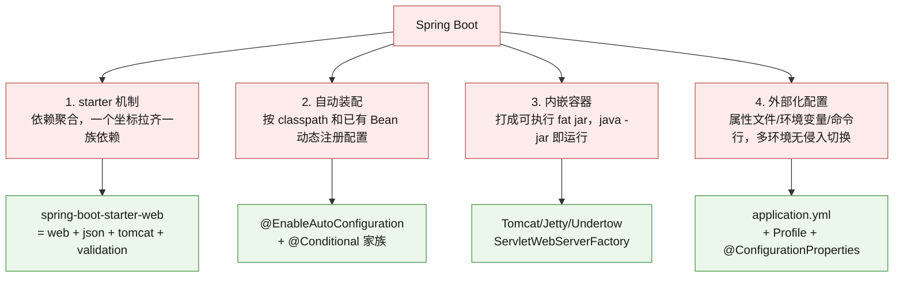
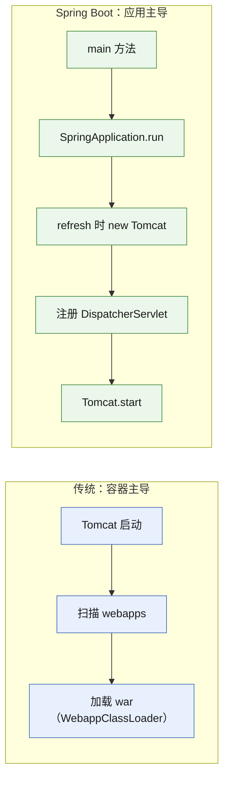
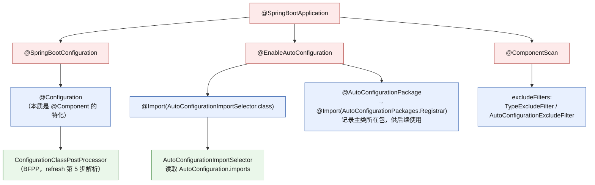
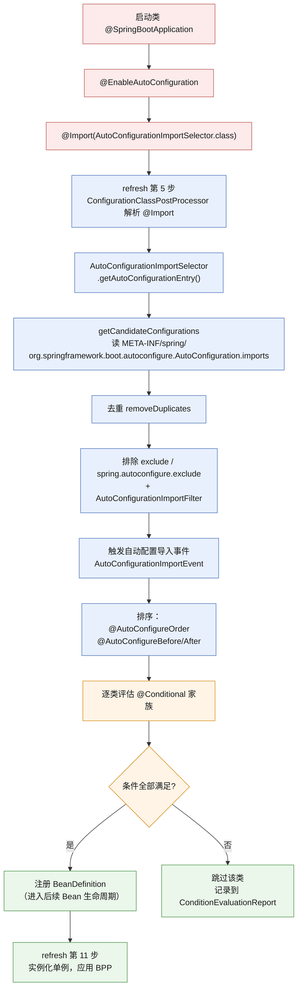
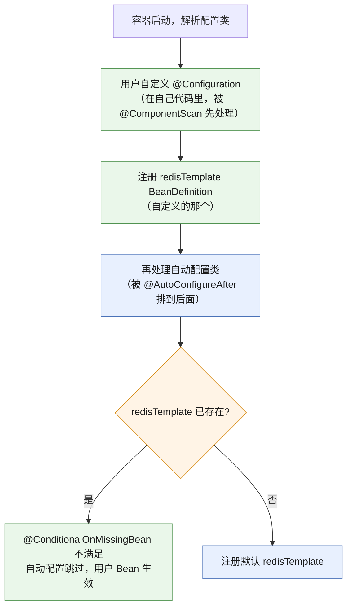
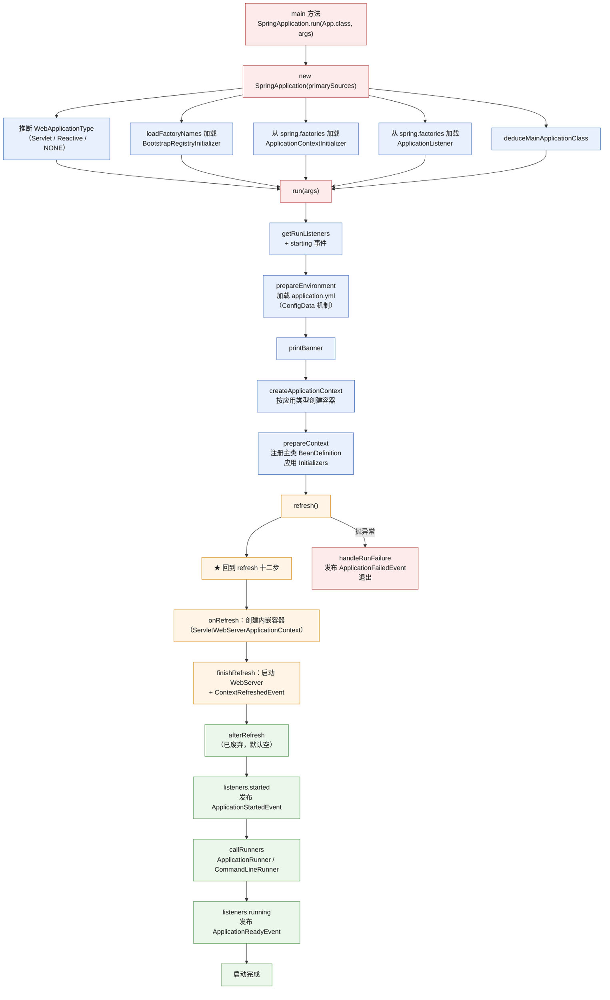
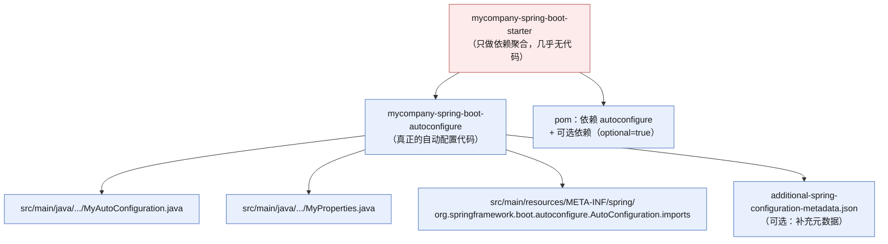
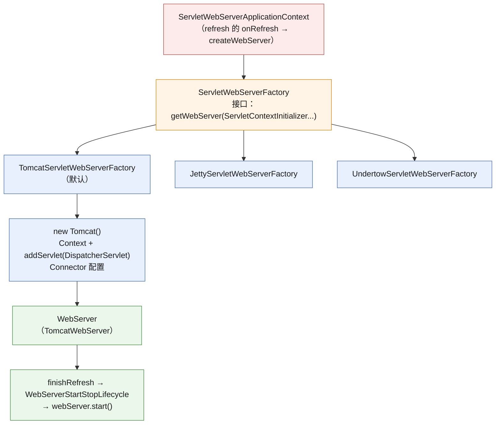
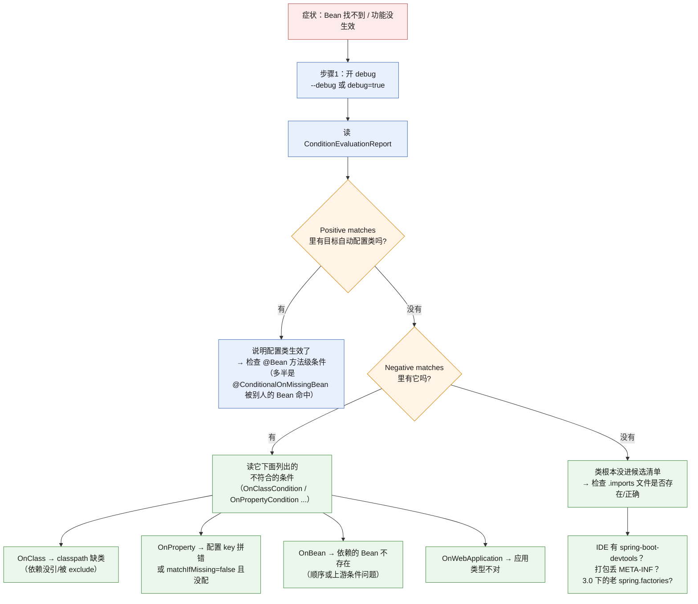

# 🚀 六、Spring Boot 自动装配

> 这一篇回答一个问题：**为什么我只加了一个 starter 依赖，什么都没配，Tomcat 就起来了、DataSource 就注入了、MVC 就配好了？**
> 答案是**自动装配（Auto-configuration）**：一套「按 classpath 里的类 + 用户已有的 Bean + 配置属性」动态决定「要注册哪些配置」的机制。
> 速答骨架见 [[面试准备/技术面试题库/13-Spring源码专题]]（第七节 Boot 源码——那里是流程与类名清单），本篇是**体系详解版**：讲 WHY、配置优先级、自定义 starter、排查手法与生产踩坑。
> 「refresh 十二步」的前置背景见 [[1-Spring架构与IoC容器]]，Bean 的注册与生命周期见 [[2-Bean生命周期与依赖注入]]，条件注解背后的 IoC 扩展点见 [[3-AOP原理与实战]] 里的 BFPP/BPP 章节。

> [!important] 这一篇的定位（总监/负责人视角）
> 「自动装配原理」是 Spring Boot 面试的**标配题**，能背出「`@EnableAutoConfiguration` → `AutoConfigurationImportSelector` → 读 `AutoConfiguration.imports` → 条件过滤 → 注册 BeanDefinition」的人很多。**真正拉开差距的是这三个问题**：
> ① **`@ConditionalOnMissingBean` 为什么能让「用户配置优先」成立？它的顺序敏感性从哪来？**（答不出「依赖 `@AutoConfigurationAfter` 排序 + 后注册不覆盖」就只是背流程）
> ② **自动装配没生效，你怎么查？**（能说出 `--debug` / `ConditionEvaluationReport` / actuator `/conditions` 才是真排过障）
> ③ **2.7 到 3.0 的 `spring.factories` → `AutoConfiguration.imports` 迁移，为什么必须做？**（这是体现你读 release notes、理解 SPI 演进方向的题）
> 另外作为**技术负责人**，「自定义 starter」是团队基建能力的直接体现——把公司内部的日志、鉴权、灰度、监控规范封装成 starter，是让几十个服务保持一致的最低成本手段。

---

## 一、Spring Boot 到底解决了什么问题

### 1.1 从「配置地狱」到「约定优于配置」

| 阶段 | 典型痛点 |
|---|---|
| 纯 Servlet | `web.xml` 里逐个声明 Servlet/Filter/Listener，改一处要重启验证 |
| Spring XML | 每个 Bean 都要 `<bean>` 声明；数据源、事务管理器、MVC 组件全是 XML；**一个中型项目 XML 上千行** |
| Spring 注解版 | `@Configuration` + `@ComponentScan` 消掉了 XML，但**集成第三方库仍需手写大量 `@Bean`**：一个 `DispatcherServlet` 配置类 30 行、一个 `DataSource` 配置 20 行、MyBatis 又是 40 行 |
| **Spring Boot** | **依赖即配置**：加一个 starter，相关 Bean 自动就位，只需覆盖你想改的那几个属性 |

**Spring Boot 的四板斧**：



**四者关系**（面试时这样串起来显得有体系）：**starter 决定 classpath 上有什么 → classpath 决定哪些自动配置类生效 → 自动配置类读取外部化配置决定 Bean 的具体参数 → 内嵌容器让整个应用可以独立启动。**

### 1.2 starter 机制：依赖聚合

`spring-boot-starter-web` 本身**几乎没有代码**，它只是一个 POM——里面声明了 `spring-boot-starter`、`spring-boot-starter-json`、`spring-boot-starter-tomcat`、`spring-web`、`spring-webmvc` 这几条依赖。**starter 的全部内容就是一张依赖清单。**

**starter 的价值**：
- **版本对齐**：所有传递依赖的版本由 `spring-boot-dependencies`（BOM）统一管理，**不会出现 Jackson 版本冲突**。这是它最被低估的价值——**依赖冲突是企业级项目最大的隐性成本**。
- **心智负担转移**：「我要用 Web」→ 一个坐标，而不是「我要不要加 tomcat-embed-core、要不要加 jackson-databind、版本选哪个」。
- **可组合**：starter 之间可以互相依赖（`web` 依赖 `json`），形成依赖图。

> [!warning] starter 的反面：依赖膨胀与「看不见的传递」
> `spring-boot-starter-web` 会传递引入 **Tomcat**。如果你的服务实际部署在**外置 Tomcat 或作为 war 包**，必须把它 `exclude` 掉并换成 `spring-boot-starter-tomcat` 的 `provided` scope，否则会**同时存在两套 Servlet 容器相关类**，症状是启动时报奇怪的 `ClassNotFoundException` 或端口占用。
> 团队规范建议：**任何 starter 引入后，用 `mvn dependency:tree` 看一遍传递依赖**，尤其是公司内部 starter（很容易不小心传递引入一堆东西）。

### 1.3 内嵌容器：为什么一个 jar 能跑起来

传统部署：`war` 包 → 外置 Tomcat 的 `webapps/` → 容器启动时解压部署。
Spring Boot：**把 Tomcat 当作一个普通 jar 依赖打进应用**，由应用**自己启动 Tomcat**。



**关键收益**：
| 收益 | 说明 |
|---|---|
| 部署极简 | `java -jar app.jar`，无需运维装 Tomcat、配 `server.xml` |
| 环境一致 | 容器版本随代码走，开发/测试/生产完全一致（**消除"我本地是好的"**） |
| 微服务友好 | 每个服务自治，天然契合容器化 / K8s |
| 启动时间可控 | 无 webapps 扫描开销；可换成 Undertow/Netty 进一步优化 |

**代价**：
- 应用包变大（Tomcat 约 3-5MB）；
- **不能像传统 Tomcat 那样共享容器资源**（几十个应用要几十个 JVM）；
- 类加载模型从 `WebappClassLoader` 变成**普通 `AppClassLoader`**——这带来的差异是：**传统 Tomcat 下 `webapp` 的类优先于容器的类；Boot 下所有类平级**。所以「同一个库在容器里和 war 里版本不同」这类问题在 Boot 下不再出现（好事），但**真要把 war 部署到外置 Tomcat 时可能出现类冲突**（因为容器自己也带了一份 Jackson 等）。

---

## 二、`@SpringBootApplication` 拆解

### 2.1 它是一个组合注解

```java
@Target(ElementType.TYPE)
@Retention(RetentionPolicy.RUNTIME)
@SpringBootConfiguration        // ← 本质就是 @Configuration（加了一层语义标识）
@EnableAutoConfiguration        // ← 自动装配的开关
@ComponentScan(excludeFilters = { // ← 组件扫描，但排除了两个类型
        @Filter(type = FilterType.CUSTOM, classes = TypeExcludeFilter.class),
        @Filter(type = FilterType.CUSTOM, classes = AutoConfigurationExcludeFilter.class)})
public @interface SpringBootApplication {
    // 用 @AliasFor 把属性透传给子注解
    @AliasFor(annotation = EnableAutoConfiguration.class) Class<?>[] exclude() default {};
    @AliasFor(annotation = ComponentScan.class, attribute = "basePackages")
    String[] scanBasePackages() default {};
}
```



> [!note] 三个容易忽略的细节
> 1. **`@SpringBootConfiguration` 不是简单的别名**：它被 `SpringBootTest` 等测试基础设施当**标记**用（用于定位测试的配置类）。所以**一个 Boot 应用只应有一个 `@SpringBootConfiguration`**，多个会导致测试找到歧义。自定义配置类请用 `@Configuration`。
> 2. **`scanBasePackages` 的默认值**：`@ComponentScan` 未指定时，**以主类所在包为根**向下扫描。所以**主类不要放在默认包（default package）**，也不建议放在很深的子包里——否则要么扫不到、要么扫太多。
> 3. **`excludeFilters` 里的 `AutoConfigurationExcludeFilter`**：它把「既是 `@Configuration` 又在自动配置清单里的类」从组件扫描中排除。**这正是「自动装配的类不能被 `@ComponentScan` 扫到」这条规则的代码实现**——防止自动配置类被 `@ComponentScan` 和自动装配两条路径重复加载。

### 2.2 `@SpringBootApplication` 的常见误区

| 误区 | 正解 |
|---|---|
| 认为它只是三个注解的简单叠加 | `@AliasFor` 让 `exclude`、`scanBasePackages` 等属性**透传**到子注解，属性名与语义必须对齐（写 `@SpringBootApplication(exclude=X.class)` 等价于 `@EnableAutoConfiguration(exclude=X.class)`） |
| 想关掉某个自动装配就 `@ComponentScan(excludeFilters=...)` | 应该用 **`exclude` 属性**或 `spring.autoconfigure.exclude` 配置。前者是「不扫这个类」，后者是「不加载这个自动配置」，**语义完全不同** |
| 在主类上再加 `@EnableAutoConfiguration` | 重复无害但冗余；**注意别在别的 `@Configuration` 上重复加**，会导致自动配置被评估两次（虽然去重了，但理解上要清楚） |
| 把 `@SpringBootApplication` 放在工具类模块 | 会连带启动 `@ComponentScan` 和自动装配，**工具类模块应该只提供自动配置，不提供启动类** |

---

## 三、自动装配的原理（★核心）

### 3.1 全流程



### 3.2 逐环节讲清 WHY

#### 环节 1：`@Import(AutoConfigurationImportSelector)` —— 为什么用 `@Import` 而不是 `@ComponentScan`

`@Import` 是 `@Configuration` 体系提供的**显式导入机制**，被导入的类会**作为配置类**参与解析（`ConfigurationClassParser` 会递归处理它们）。相比 `@ComponentScan`：

| 维度 | `@ComponentScan` | `@Import` / 自动配置机制 |
|---|---|---|
| 发现方式 | 按包路径**扫描** | 按**清单文件**精确列举 |
| 代价 | 类路径扫描有启动开销；扫描范围不可控 | 无扫描开销，清单即契约 |
| 归属 | 应用自己的代码 | **框架/第三方库的代码**（不在应用的包下，扫不到） |
| 可控性 | 依赖包结构约定 | 可精确 exclude、可条件评估 |

**核心原因**：第三方库（如 MyBatis、Redis）的自动配置类在**别人的 jar 包**里，路径完全不在应用的 `@ComponentScan` 范围内。所以必须有独立机制。

#### 环节 2：`AutoConfigurationImportSelector` 与清单文件

`AutoConfigurationImportSelector` 实现 `ImportSelector`，`selectImports` 返回要导入的类名数组。

**版本差异（★必须标注清楚）**：

| 版本 | 清单文件位置 | 说明 |
|---|---|---|
| Spring Boot ≤ 2.6 | `META-INF/spring.factories` | key 为 `org.springframework.boot.autoconfigure.EnableAutoConfiguration`，**与其他 SPI（`ApplicationListener`、`EnvironmentPostProcessor` 等）混在同一个文件里** |
| **Spring Boot 2.7+** | `META-INF/spring/org.springframework.boot.autoconfigure.AutoConfiguration.imports` | **新增专用文件**，每行一个全限定类名；2.7 **同时支持两种**（过渡期，`spring.factories` 会有 deprecation 警告） |
| **Spring Boot 3.0+** | 同上（**仅此一种**） | **`spring.factories` 中的自动配置 key 被彻底移除**；仍在 `spring.factories` 里声明自动配置的**第三方库会静默失效** |

**为什么必须迁移？** `spring.factories` 是一个**全局的、扁平的 SPI 注册表**：自动配置、监听器、初始化器全挤在一个文件里。这导致① 加载成本高（每次解析整个文件，而你只要一个 key）；② 无法对「自动配置」这一类做单独的工具支持（IDE 补全、条件报告）；③ 想改自动配置语义会牵连其他 SPI 使用者。拆出专用文件后，**自动配置成了独立、可工具化、可版本化管理的契约**。**3.0 移除旧方式就是为了逼生态一起迁移**——这是一次典型的「框架用破坏性变更推动生态标准化」。

> [!danger] 升级到 3.0 时最常踩的坑
> 你的应用升级了 Boot 3，但某个第三方 starter 内部**还在用 `spring.factories` 声明自动配置** → **它的自动配置静默不生效**，没有任何报错，只是 Bean 找不到或者功能默默少了。
> **排查手法**：升级前扫描依赖 jar，看是否还有 `META-INF/spring.factories` 里带 `EnableAutoConfiguration` key。如果有，要么等库升级，要么自己在应用里手动 `@Import` 那个配置类兜底。**这是 3.0 升级 checklist 里必须写的一项。**

**`AutoConfiguration.imports` 的格式**：

```
# 每行一个全限定类名，# 开头是注释，空行忽略
com.example.autoconfig.ExampleAutoConfiguration
com.example.autoconfig.AnotherAutoConfiguration
```

#### 环节 3：去重与排除

`getAutoConfigurationEntry` 的六步（**这是「报流程」时的标准骨架**）：

| 步 | 动作 | 关键点 |
|---|---|---|
| ① | `isEnabled` 判断 | `spring.boot.enableautoconfiguration=false` 可整体关掉 |
| ② | `getCandidateConfigurations` | **读清单文件**得到候选列表 |
| ③ | `removeDuplicates` | 多个 jar 可能重复声明同一个类，**去重必须做** |
| ④ | `getExclusions` + `removeAll` | 应用注解 `exclude`/`excludeName` **和** `spring.autoconfigure.exclude` |
| ⑤ | `filter`（`AutoConfigurationImportFilter`） | **快速预过滤**：`OnClassCondition` 在这里先粗筛一轮，避免对 150 个类逐个做完整条件评估 |
| ⑥ | `fireAutoConfigurationImportEvents` | 发布 `AutoConfigurationImportEvent`，**可监听，用于诊断** |

**四种排除方式对比**：

| 方式 | 写法 | 作用范围 | 适用场景 |
|---|---|---|---|
| `@SpringBootApplication(exclude = X.class)` | 注解属性 | 启动类级别 | 少数固定排除 |
| `@EnableAutoConfiguration(excludeName = "全限定名")` | 字符串 | 启动类级别 | 类不在 classpath 时（避免编译依赖） |
| `spring.autoconfigure.exclude=全限定名` | 配置文件 | **可通过多环境 profile 动态控制** | **推荐**：不同环境排除不同自动配置 |
| 自定义 `AutoConfigurationImportFilter` | 实现接口 + `spring.factories` 注册 | 全局 | 框架级定制（如自定义条件预过滤） |

> [!tip] 为什么推荐用配置属性而不是注解
> `exclude` 写在启动类上**编译期就固定了**。而实际生产中，「测试环境要排除 XX 自动配置、生产要保留」是很常见的需求。用 `spring.autoconfigure.exclude` 可以放在 `application-test.yml` 里，**保留多环境灵活性**。这也是「配置外部化」思想的体现。

#### 环节 4：条件过滤（自动装配的灵魂）

**这是「约定优于配置」能成立的真正原因。** 每个自动配置类头部都堆满了 `@Conditional*` 注解：

```java
@AutoConfiguration                                    // 3.0 起的新注解（见 3.5）
@ConditionalOnClass({ DataSource.class, EmbeddedDatabaseType.class })  // classpath 有这些类才生效
@ConditionalOnMissingBean(type = "io.r2dbc.spi.ConnectionFactory")     // 不是响应式才生效
@EnableConfigurationProperties(DataSourceProperties.class)
@Import({ DataSourcePoolMetadataProvidersConfiguration.class,
          DataSourceCheckpointRestoreConfiguration.class })
public class DataSourceAutoConfiguration { ... }
```

**没有条件注解会怎样？** 一个 `spring-boot-autoconfigure` jar 里有 **150+ 个自动配置类**，覆盖 JDBC、Redis、Kafka、Mail、Security、Batch……如果全部无条件生效，你的应用启动时会尝试创建 DataSource（但你可能根本没配数据库）、创建 Kafka 生产者（但你没连 Kafka）——**启动必然失败**。

**条件注解就是「自动配置的准入证」**：它让 150 个配置类里只有**真正相关的十几个**生效。

#### 环节 5：`@ConditionalOnMissingBean` —— 「用户配置优先」的机制（★重点）

```java
@AutoConfiguration
@ConditionalOnClass(RedisOperations.class)
@EnableConfigurationProperties(RedisProperties.class)
public class RedisAutoConfiguration {

    @Bean
    @ConditionalOnMissingBean(name = "redisTemplate")   // ★ 关键
    public RedisTemplate<Object, Object> redisTemplate(
            RedisConnectionFactory connectionFactory,
            RedisProperties properties) {
        RedisTemplate<Object, Object> template = new RedisTemplate<>();
        template.setConnectionFactory(connectionFactory);
        return template;
    }
}
```

**语义**：只有当容器里**还没有**名为 `redisTemplate` 的 Bean 时，才注册这个默认的。于是：



**为什么能保证「用户先行」？三个必要条件**：

| 条件 | 机制 | 如果缺失会怎样 |
|---|---|---|
| **① 用户 Bean 先被注册** | 用户配置类由 `@ComponentScan` 发现，**在同一个 `ConfigurationClassParser` 阶段**处理；自动配置类通过 `@Import` 引入，被排到后面 | 用户 Bean 后到 → 用户配置被忽略，`@ConditionalOnMissingBean` 反而「盖掉」了用户配置 |
| **② 排序保证** | `AutoConfigurationSorter` 按 `@AutoConfigureOrder` / `@AutoConfigureBefore` / `@AutoConfigureAfter` 排序；`AutoConfigurationImportSelector` 还对类做拓扑排序 | 自动配置之间互相依赖时顺序错乱 |
| **③ 条件评估在注册前** | `ConditionEvaluator` 在 `ConfigurationClassParser` 处理**每个配置类之前**评估其类级条件；`@Bean` 方法级条件在**方法解析时**评估 | 评估太晚，BeanDefinition 已注册 |

> [!important] 一句话回答「`@ConditionalOnMissingBean` 的作用」
> 它是**「用户配置优先」的开关**：只有当容器里**不存在**指定类型/名称的 Bean 时，自动配置才提供默认实现。
> 它成立的前提是**顺序**——用户自己的配置类必须**先于**自动配置类被解析，而这一点由「`@ComponentScan` 发现的类先处理、`@Import` 引入的自动配置后处理，且自动配置之间有 `@AutoConfigureAfter` 排序」共同保证。
> 这解释了为什么「有时候我自己的 Bean 盖不掉默认 Bean」——**要么你的 Bean 注册得太晚（比如在 `@Bean` 方法里 `new` 出来而不是交给容器），要么类型/名称对不上（`@ConditionalOnMissingBean` 是按类型 + 名称匹配的，泛型不同就匹配不上）。**

**`@ConditionalOnMissingBean` 的匹配规则（容易踩坑）**：

| 匹配维度 | 说明 | 坑 |
|---|---|---|
| 按类型（默认） | `@ConditionalOnMissingBean` 无参时，**用 `@Bean` 方法的返回类型推断** | 返回类型是接口 `RedisTemplate`，但用户注册的是 `StringRedisTemplate`（子类/不同泛型）→ **可能匹配不上** |
| 按名称 | `name = "xxx"` | 名称写错就没保护 |
| `value` / `type` | 显式指定 | 注意 `@ConditionalOnMissingBean(type = "a.b.C")` 用字符串可避免类加载 |
| **注解属性 `annotation`** | `@ConditionalOnMissingBean(annotation = X.class)` | 按「Bean 上有没有某个注解」判断，适合自定义标记 |
| 泛型擦除 | Spring 会用方法返回值 + 泛型信息匹配 | **`RedisTemplate<String,Object>` 和 `RedisTemplate<Object,Object>` 在 Bean 类型上是同一个 `RedisTemplate`**——所以用户定义 `RedisTemplate<String,Object>` 也能盖掉默认的 |

#### 环节 6：注册 BeanDefinition 并进入后续流程

条件全部满足后，配置类被当作普通 `@Configuration` 处理，其 `@Bean` 方法产生 `BeanDefinition`，**进入 IoC 容器的常规生命周期**（实例化、注入、初始化、AOP）。所以：

> **自动装配没有什么"特殊魔法"——它只是在 refresh 的第 5 步（`invokeBeanFactoryPostProcessors`）多注册了一批 BeanDefinition。之后的流程与手写 `@Bean` 完全一致。** 这句话是把「自动装配」和「IoC 容器」两个知识块打通的关键，详见 [[1-Spring架构与IoC容器]]。

### 3.3 `getCandidateConfigurations` 的调用链

**Boot 2.7+/3.x 用 `ImportCandidates.load(AutoConfiguration.class, classLoader)` 从 `.imports` 文件加载候选类**，随后有一个关键的断言：

```java
Assert.notEmpty(configurations,
    "No auto configuration classes found in META-INF/spring/"
    + AutoConfiguration.class.getName() + ".imports. "
    + "If you are using a custom packaging, make sure that file is correct.");
```

**注意这个 `Assert.notEmpty`**：如果清单文件读不到，启动会**直接失败并报这句明确的错误**。这是「排查自动装配」的第一手线索——看到这句话，说明 `spring-boot-autoconfigure` 的 jar 损坏、或者被自定义打包插件弄丢了 `META-INF` 目录（**Shade/Assembly 打包时忘记合并 `META-INF/spring/*.imports` 是经典事故**）。

---

## 四、`@Conditional` 家族详解

### 4.1 常用注解一览

| 注解 | 判断依据 | 典型用途 | 注意 |
|---|---|---|---|
| `@ConditionalOnClass` | classpath 上**存在**指定类 | 「引入了 Redis 客户端才装配 Redis」 | 用 `name`/`value` 字符串形式可避免类加载失败 |
| `@ConditionalOnMissingClass` | classpath 上**不存在** | 反向装配（无 A 时用 B 方案） | — |
| `@ConditionalOnBean` | 容器里**存在**指定 Bean | 「有 DataSource 才装配 JdbcTemplate」 | **顺序敏感**：依赖的 Bean 必须先注册 |
| `@ConditionalOnMissingBean` | 容器里**不存在** | **用户配置优先**（★核心） | 同上，也用于同名 Bean 冲突保护 |
| `@ConditionalOnSingleCandidate` | **恰好一个或首选**的 Bean | 「有唯一 DataSource 时才装配」 | 多个候选时不生效，避免歧义 |
| `@ConditionalOnProperty` | 配置属性等于/不等于某值 | `xxx.enabled=true` 开关 | **`matchIfMissing` 决定"没配"时的默认行为**，极易踩坑 |
| `@ConditionalOnResource` | classpath/文件系统存在资源 | 有 `logback-spring.xml` 才定制日志 | — |
| `@ConditionalOnWebApplication` | 是 Web 应用 | 只在 Servlet 环境装配 MVC | 可选 `type = SERVLET/REACTIVE/ANY` |
| `@ConditionalOnNotWebApplication` | 不是 Web 应用 | 命令行工具专用配置 | — |
| `@ConditionalOnExpression` | SpEL 表达式为真 | 复杂组合条件 | 慎用，**难调试、启动慢** |
| `@ConditionalOnJava` | JDK 版本区间 | 按 JDK 版本走不同实现 | — |
| `@ConditionalOnJndi` | JNDI 位置可用 | 传统应用服务器集成 | — |
| `@ConditionalOnCloudPlatform` | 运行在特定云平台 | K8s / Cloud Foundry 特化配置 | — |
| `@ConditionalOnWarDeployment` | war 部署（非内嵌） | war 与外嵌 jar 行为差异 | — |
| `@ConditionalOnThreading` | 虚拟线程 / 平台线程 | JDK 21 虚拟线程自动适配 | Boot 3.2+ |
| `@ConditionalOnAvailableEndpoint` | actuator 端点启用 | 只在开了某端点时装配 | Boot 3.x actuator |

### 4.2 `@ConditionalOnProperty` 的实际行为（最容易出错）

```java
@ConditionalOnProperty(
        prefix = "feature.async",
        name = "enabled",
        havingValue = "true",
        matchIfMissing = false)     // ★ 不配时默认关闭
```

| 配置情况 | `havingValue="true"` | `havingValue="true", matchIfMissing=true` | 无 `havingValue` |
|---|---|---|---|
| `feature.async.enabled=true` | ✅ 生效 | ✅ 生效 | ✅ 生效 |
| `feature.async.enabled=false` | ❌ | ❌ | ✅ 生效（**只要有值就行**） |
| 完全没配 | ❌（matchIfMissing=false） | ✅ 生效 | ❌ |

> [!warning] `@ConditionalOnProperty` 的两个经典坑
> 1. **`havingValue` 的字符串比较**：`havingValue = "true"` 时，配置写成 `enabled=TRUE` 或 `enabled=1` 都**不匹配**（除了 `true`/`false` 有特殊处理，其他都是字面量比较）。用 `enabled` 而不是 `1`/`yes`。
> 2. **`matchIfMissing` 默认是 `false`**：意味着「没配就不生效」。如果你的开关本意是「默认开启，可关闭」，**必须显式写 `matchIfMissing = true`**，否则上线后会静默失效——这是最典型的「本地好好的，线上没生效」事故（因为本地 `application-dev.yml` 里配了，线上没配）。

### 4.3 条件注解的评估顺序与 `@AutoConfigureOrder` 系列

**两套排序机制，作用不同**：

| 机制 | 排序对象 | 生效方式 |
|---|---|---|
| `@AutoConfigureOrder` | 自动配置**类之间** | 绝对值排序（类似 `@Order`），数值小的先处理 |
| `@AutoConfigureBefore` / `@AutoConfigureAfter` | 自动配置**类之间** | **相对顺序**，声明式，可读性好（**推荐**） |
| `@Order` | Bean / Advice / 拦截器 | 与自动配置排序**无关**，别混淆 |

```java
@AutoConfiguration(after = DataSourceAutoConfiguration.class)   // 3.0 起可直接写在 @AutoConfiguration 上
@ConditionalOnClass(JdbcTemplate.class)
@ConditionalOnSingleCandidate(DataSource.class)
public class JdbcTemplateAutoConfiguration { ... }

// 旧写法（2.x），仍兼容但不如上面清晰
@Configuration
@AutoConfigureAfter(DataSourceAutoConfiguration.class)
public class JdbcTemplateAutoConfiguration { ... }
```

**排序的实际意义**：`JdbcTemplateAutoConfiguration` 需要 `DataSource` 已经存在（`@ConditionalOnSingleCandidate(DataSource.class)`），所以**必须排在 `DataSourceAutoConfiguration` 之后**。如果没有排序，条件评估时 DataSource 的 BeanDefinition 还没注册 → 条件不满足 → JdbcTemplate 静默不生效。**这就是「排序不是为了好看，而是条件评估的正确性前提」。**

**类内 `@Bean` 方法的顺序敏感**（★ 高频坑）：

```java
@AutoConfiguration
public class BadExampleAutoConfiguration {

    // ❌ 这个 @Bean 方法在前：此时容器里还没有 myService 的 BeanDefinition
    //    @ConditionalOnMissingBean(MyService.class) 会返回 true（因为还没有）
    @Bean
    @ConditionalOnMissingBean
    public MyService myService() { return new DefaultMyService(); }

    // 用户如果期望这个生效——但它定义在同一个类里靠后
    @Bean
    public MyService customMyService() { return new CustomMyService(); }
}
```

> [!danger] 同一个配置类内的 `@ConditionalOnMissingBean` 是"顺序敏感"的
> Spring 处理 `@Configuration` 类的 `@Bean` 方法时是**按方法声明顺序**逐个解析的。所以在**同一个类里**，靠前的方法用 `@ConditionalOnMissingBean` 判断时，**靠后的方法还没被注册**，条件会误判为「不存在」从而注册默认 Bean。
> **正确做法**：把「被判断的 Bean」放在**独立的、更早处理的配置类**里（用 `@AutoConfigureAfter` 控制），或者干脆**不要用 `@ConditionalOnMissingBean` 做同类内的"互相覆盖"**——这是设计错误。
> **一句话规则：`@ConditionalOnMissingBean` 只在跨配置类、且有明确顺序保证时才是可靠的。**

### 4.4 为什么自动配置类要用 `@AutoConfiguration` 而不是 `@Configuration`（3.0 起）

Boot 3.0 引入了 `@AutoConfiguration`，它**本身标注了 `@Configuration(proxyBeanMethods = false)`**，并通过 `@AliasFor` 把 `before` / `after` 属性内联到 `@AutoConfigureBefore` / `@AutoConfigureAfter`。

| 差异 | `@Configuration` | `@AutoConfiguration` |
|---|---|---|
| `proxyBeanMethods` | 默认 **true**（CGLIB 代理，保证 `@Bean` 方法间调用走容器） | 默认 **false**（不代理，性能更好） |
| 排序声明 | 需要额外加 `@AutoConfigureBefore/After` | **`before`/`after` 属性直接内联**，可读性更好 |
| 语义标识 | 只是「我是一個配置类」 | 「**我是自动配置类**」——可被工具/条件报告识别 |
| 是否应被组件扫描 | 可以被扫到 | **应当只在 `.imports` 里声明**（被 `AutoConfigurationExcludeFilter` 排除） |
| 是否可用于应用自身配置 | ✅ | ❌ **不应该**——应用自己的配置用 `@Configuration` |

**为什么 `proxyBeanMethods = false` 是更好的默认值？**

`proxyBeanMethods = true` 时，Spring 用 CGLIB 生成配置类子类，拦截 `@Bean` 方法调用，保证 `@Bean` 方法**互相调用时返回的是容器里的单例**（而不是每次 `new`）。代价是**每个配置类都要生成一个代理类，启动变慢、内存占用更高**。

自动配置类通常**没有 `@Bean` 方法互调**（都是参数注入依赖），所以可以安全关闭代理。Boot 2.2 起就已经把内置自动配置全部改成 `proxyBeanMethods = false`，3.0 通过 `@AutoConfiguration` 把这个约定**固化到注解层面**。

> [!note] 应用自己的 `@Configuration` 要不要改成 `proxyBeanMethods = false`？
> **可以，但要检查有没有 `@Bean` 方法互调**。如果有（例如 `@Bean B b() { return new B(a()); }`），关掉代理会导致 `a()` 每次 `new` 一个新对象，**破坏单例语义**——这是很隐蔽的 bug。
> **建议**：新写的配置类尽量**用方法参数注入依赖**而不是互调（`@Bean B b(A a)`），然后放心改成 `false`。这是 Boot 官方的推荐风格。

---

## 五、`SpringApplication.run` 启动流程

### 5.1 全流程图



### 5.2 关键阶段说明

#### 阶段 1：`new SpringApplication()` —— 推断应用类型

`deduceWebApplicationType()` 的核心判断：**「有 WebFlux 且没有 Spring MVC」→ REACTIVE；「没有 Servlet API」→ NONE；否则 SERVLET。**

| 类型 | 判定条件 | 创建的容器 | 内嵌容器 |
|---|---|---|---|
| `SERVLET` | classpath 有 Servlet + Spring MVC（`spring-webmvc`） | `AnnotationConfigServletWebServerApplicationContext` | Tomcat / Jetty / Undertow |
| `REACTIVE` | 有 WebFlux 且**没有** Spring MVC | `AnnotationConfigReactiveWebServerApplicationContext` | Netty / Undertow（响应式） |
| `NONE` | 没有 Servlet API | `AnnotationConfigApplicationContext` | 无 |

> [!warning] 「同时引入 web 和 webflux」的后果
> 两者都在 classpath 时，**`SERVLET` 优先**（因为 `deduceWebApplicationType` 只在「有 Reactive 且**无** MVC」时才判为 REACTIVE）。这会导致你以为在跑 WebFlux，实际跑的是 Servlet 栈——**这是引入 `spring-boot-starter-webflux` 做 WebClient 时最常见的困惑**。
> **正确姿势**：只想用 `WebClient` 做 HTTP 客户端时，用 `spring-boot-starter-webflux` 会连带引入 Netty 和 WebFlux；应该**只引 `spring-webflux`**（或接受这个副作用，但要知道应用类型仍是 SERVLET）。

#### 阶段 2：加载 `Initializer` 与 `Listener`

从 `spring.factories`（**注意：这些 SPI 在 3.0 中仍然使用 `spring.factories`，只有自动配置迁移了**）读取：

| SPI | key | 典型实现 |
|---|---|---|
| `ApplicationContextInitializer` | `org.springframework.context.ApplicationContextInitializer` | `ConfigurationWarningsApplicationContextInitializer`、`ServerPortInfoApplicationContextInitializer` |
| `ApplicationListener` | `org.springframework.context.ApplicationListener` | `LoggingApplicationListener`、`BackgroundPreinitializer`、`EnvironmentPostProcessorApplicationListener` |
| `BootstrapRegistryInitializer` | `...BootstrapRegistryInitializer` | Boot 2.4+ 新增，用于 bootstrap 阶段的轻量注册 |
| `SpringApplicationRunListener` | `...SpringApplicationRunListener` | `EventPublishingRunListener`（**把启动事件广播出去的关键**） |

> [!important] 这里有一个「版本差异」的坑
> **很多人以为 3.0 把所有 SPI 都从 `spring.factories` 迁走了——不对。** 3.0 只移除的是 **`EnableAutoConfiguration` 这一个 key**。`ApplicationListener`、`ApplicationContextInitializer`、`EnvironmentPostProcessor`、`FailureAnalyzer` 等**仍然在 `spring.factories` 里注册**。
> 面试时说清这一点，能立刻区别于「只背了自动装配迁移」的候选人。

#### 阶段 3：`prepareEnvironment` —— 配置加载（实战重点，见第六章）

`ConfigDataEnvironmentPostProcessor`（通过 `EnvironmentPostProcessorApplicationListener` 触发）负责按 `spring.config.location` / `spring.config.import` 加载配置。

#### 阶段 4：`prepareContext`

- 设置 `Environment`、`ResourceLoader`；
- **把主类（primarySources）注册为 BeanDefinition**（这就是为什么 `@SpringBootApplication` 能被解析）；
- 应用所有 `ApplicationContextInitializer`；
- 发布 `ApplicationContextInitializedEvent`。

#### 阶段 5：`refresh()` —— 与十二步衔接（★）

**这是与 [[1-Spring架构与IoC容器]] 的接缝处**，必须讲清：

| refresh 步骤 | Spring Boot 的额外动作 |
|---|---|
| 1 `prepareRefresh` | — |
| 2 `obtainFreshBeanFactory` | — |
| 3 `prepareBeanFactory` | 注册 `WebApplicationContextServletContextAwareProcessor` 等 Web 相关 BPP |
| 4 `postProcessBeanFactory` | **Servlet 场景注册 `ServletContextAwareProcessor`、注册 request/session scope** |
| 5 `invokeBeanFactoryPostProcessors` | ★ **`ConfigurationClassPostProcessor` 在这里解析 `@SpringBootApplication` → 触发自动装配**（第三章的全流程都发生在此处） |
| 6 `registerBeanPostProcessors` | 注册 AOP、`@Autowired` 处理器等 |
| 9 `onRefresh` | ★ **`ServletWebServerApplicationContext.createWebServer()` —— 创建内嵌容器（Tomcat 对象 new 出来、注册 DispatcherServlet、配置 Connector），但还没 start** |
| 11 `finishBeanFactoryInitialization` | 实例化所有单例 Bean（**Controller、Service、DataSource 都在此时创建**） |
| 12 `finishRefresh` | ★ **`WebServerStartStopLifecycle.start()` → `tomcat.start()` 启动监听端口**；发布 `ContextRefreshedEvent` |

> [!important] 为什么容器"创建"和"启动"分成两步（`onRefresh` vs `finishRefresh`）？
> **创建**放在 `onRefresh`（第 9 步）：此时 `BeanFactory` 已就绪但单例还没实例化。这样容器对象可以先建好、Servlet 可以先注册，**但如果后续 Bean 实例化失败（第 11 步），端口还没有被占用**——避免"启动失败但端口还占着"的尴尬。
> **启动**放在 `finishRefresh`（最后）：保证**所有 Bean 都就绪、所有监听器都注册完毕**才开始接收外部流量。否则可能出现「端口已开，但业务 Bean 还没初始化完」的窗口期，请求进来直接 500。
> 这个设计对**健康检查**也有意义：K8s 的 `readinessProbe` 本质就是在探「端口是否已监听 + 应用是否就绪」。

#### 阶段 6：`callRunners`

**执行顺序**：先所有 `ApplicationRunner`，再所有 `CommandLineRunner`，各自按 `@Order` 排序。

| 维度 | `ApplicationRunner` | `CommandLineRunner` |
|---|---|---|
| 参数类型 | `ApplicationArguments`（**已解析**，支持 `--key=value` 取值） | `String... args`（**原始数组**，要自己解析） |
| 推荐 | ✅ **推荐** | 简单场景 |

**执行时机**：在 `ApplicationReadyEvent` **之前**。所以 runners 里**不能**指望「应用已经能对外提供服务」；如果 runner 要阻塞等待外部依赖，会导致**启动变慢甚至 readiness 探针失败**。

> [!tip] Runner 的生产用法与反模式
> **适合**：数据初始化（幂等）、启动时刷新本地缓存、注册到注册中心后的自检。
> **不适合**：长耗时任务（把启动时间拉到分钟级 → K8s 探针超时 → 反复重启）、需要事务的批量任务。
> **更优雅的替代**：用 `ApplicationReadyEvent` 监听器（在 runners 之后，且不阻塞启动完成事件）或 `@PostConstruct`（更早，但有依赖未就绪的风险）。

---

## 六、配置体系（实战重点）

### 6.1 配置加载优先级（★从高到低）

Spring Boot 2.4+ 使用新的 **`ConfigData` API**，加载顺序如下（**后面的覆盖前面的**，同一 key 时高优先级生效）：

| # | 来源 | 优先级 | 说明 |
|---|---|---|---|
| 1 | **命令行参数** | 最高 | `java -jar app.jar --server.port=8081` |
| 2 | `SPRING_APPLICATION_JSON` | ↓ | 环境变量里的一整段 JSON（K8s 常用） |
| 3 | `ServletConfig` 初始化参数 | ↓ | — |
| 4 | `ServletContext` 初始化参数 | ↓ | — |
| 5 | **JNDI**（`java:comp/env`） | ↓ | 传统应用服务器 |
| 6 | **Java 系统属性**（`System.getProperties()`） | ↓ | `-Dserver.port=8081` |
| 7 | **操作系统环境变量** | ↓ | `SERVER_PORT=8081`（**容器化部署主力**） |
| 8 | `random.*` | ↓ | `RandomValuePropertySource` |
| 9 | **jar 包外部的 profile 特定配置** | ↓ | `./config/application-prod.yml` |
| 10 | jar 包外部的 `application.yml` | ↓ | `./config/application.yml` |
| 11 | **jar 包内部的 profile 特定配置** | ↓ | classpath 里的 `application-prod.yml` |
| 12 | jar 包内部的 `application.yml` | ↓ | classpath 根目录 |
| 13 | `@PropertySource` 注解 | ↓ | 显式声明的属性源 |
| 14 | `SpringApplication.setDefaultProperties` | 最低 | 代码设置的默认值 |

**记忆要点（面试可直接说）**：
> **「命令行 > 环境变量 > 外部配置（含 profile） > 内部配置（含 profile） > 代码默认值」**。
> 更精确地说：**外部文件整体优先于内部文件**；**同目录下 profile 特定文件优先于非特定文件**。

**目录搜索顺序**（`spring.config.location` 未指定时，**就近优先**）：

| 顺序 | 位置 | 用途 |
|---|---|---|
| 1 | `file:./config/` | 当前目录的 config 子目录（**运维最爱**） |
| 2 | `file:./` | 当前目录 |
| 3 | `classpath:/config/` | jar 内 config 目录 |
| 4 | `classpath:/` | jar 根目录（**开发时放这里**） |

> [!tip] 生产部署的最佳实践
> **打成 jar 时，`application.yml` 放在 jar 内作为"默认值"，环境差异用环境变量覆盖。**
> 理由：① 配置随代码走（版本可控）；② 敏感信息（数据库密码、密钥）走环境变量/K8s Secret，**不进代码库、不进镜像**；③ 环境变量优先级高于 jar 内配置，天然可覆盖。
> **不要**把生产配置打到 jar 里再靠外部文件覆盖——镜像一旦构建就无法区分环境，反而更容易出错。

### 6.2 `@Value` vs `@ConfigurationProperties`（推荐后者）

```java
// 方式一：@Value（散装，逐个注入）
@Component
public class AppConfigWithValue {
    @Value("${app.name}") private String name;
    @Value("${app.timeout:3000}") private int timeout;        // 支持默认值
    @Value("${app.retry-times}") private int retryTimes;      // ★ 松散绑定不生效！
}

// 方式二：@ConfigurationProperties（推荐）
@Component
@ConfigurationProperties(prefix = "app")
@Validated                                   // ★ 支持 JSR-303 校验
public class AppProperties {
    private String name;
    private Duration timeout = Duration.ofSeconds(3);
    private int retryTimes;                  // 配置写 retry-times 也能绑上
    private List<String> hosts;              // 复杂结构天然支持
    private Map<String, String> headers;
    private Nested nested = new Nested();    // 嵌套对象

    // setter 必需（JavaBean 绑定）或改用构造器绑定
    public void setName(String name) { this.name = name; }
    // ... 省略其余 getter/setter
}
```

| 维度 | `@Value` | `@ConfigurationProperties` |
|---|---|---|
| 类型安全 | 靠 SpEL 字符串转换，**错了运行时才发现** | 强类型绑定，编译期有类型 |
| **松散绑定** | ❌ **不支持**（`retry-times` 绑不到 `retryTimes`） | ✅ **支持**：`retry-times` / `retryTimes` / `retry_times` / `RETRY_TIMES` 都能绑 |
| 复杂结构（List/Map/嵌套对象） | 需 SpEL 拼装，**很难写** | ✅ 天然支持 |
| 校验 | 只能 `@Value` 上加 `@Validated` 类级 + `@NotNull` 不生效 | ✅ `@Validated` + `@NotBlank`/`@Min` 等直接生效 |
| 元数据提示 | ❌ | ✅ 生成 `spring-configuration-metadata.json`，IDE 有补全和文档 |
| 默认值 | `${key:default}` | 字段初始化值 |
| 适合场景 | 单个简单值、SpEL 表达式、`@Value("${a:${b}}")` 嵌套 | **成组配置、复杂结构、需要校验** |
| 刷新（配合 Cloud/actuator） | 逐个 `@RefreshScope` | ✅ `@ConfigurationProperties` 天然支持整组刷新 |

> [!important] 一句话回答「`@Value` 和 `@ConfigurationProperties` 的区别」
> **`@Value` 是「按 key 取值 + SpEL 转换」，`@ConfigurationProperties` 是「按前缀整体绑定为一个对象」。**
> 后者胜在**松散绑定、类型安全、复杂结构、校验和 IDE 元数据**——所以**只要配置超过 2 个字段，就应该用 `@ConfigurationProperties`**。
> `@Value` 保留给「单个值 + 表达式」的场景，或者需要 `@Value("#{...}")` 这种 SpEL 计算的地方。

**`@ConfigurationProperties` 的三种注册方式**：

| 方式 | 写法 | 特点 |
|---|---|---|
| 加 `@Component` | `@Component @ConfigurationProperties(prefix="app")` | 简单，但**需要被组件扫描到**；在 starter 里不可靠 |
| `@EnableConfigurationProperties(X.class)` | 挂在某个 `@Configuration` 上 | **starter 的标准做法**：显式、可控、不依赖扫描 |
| `@ConfigurationPropertiesScan` | 类上加注解，扫描指定包 | 批量注册，适合应用自身代码（**免去逐个 `@EnableConfigurationProperties`**） |

> [!warning] 为什么 `@ConfigurationProperties` 需要 setter 或构造器绑定？
> 默认使用 **JavaBean 绑定**：Spring 通过 `Binder` 反射调用 **setter** 或直接设字段来填充属性。所以：
> - **只有 getter 没有 setter → 绑定失败（字段保持 null）**，且**默认不报错**，只是静默不生效——非常难查。
> - 想用**不可变对象**（final 字段），必须用**构造器绑定**：类上标注 `@ConstructorBinding`（Boot 3.0 起，如果类**只有一个有参构造器**可以省略该注解），并配合 `@EnableConfigurationProperties`/`@ConfigurationPropertiesScan` 注册。**构造器绑定不能用 `@Component` 单独注册。**
> - **排查技巧**：绑定失败时开 `--debug`，`ConditionEvaluationReport` 里会有 `ConfigurationPropertiesBindException` 的线索；或者直接用 `spring-boot-configuration-processor` 生成元数据，让 IDE 立刻标红拼错的 key。

```java
// 不可变绑定（推荐写新代码时使用）
@ConfigurationProperties(prefix = "app")   // Boot 3.0 起单构造器可省略 @ConstructorBinding
public record AppProperties(String name, Duration timeout, List<String> hosts) { }
```

### 6.3 Profile 与多环境

```java
@Profile("prod")            // 只在 prod 生效
@Profile({"dev", "test"})   // 多个 profile 任一匹配
@Profile("!prod")           // 非 prod 生效（★ 表达式取反）
```

```yaml
# application.yml（主文件）
spring:
  application:
    name: order-service
  profiles:
    active: dev            # 默认激活（★ 生产不要写死在这里！）

---
# application-dev.yml
spring:
  config:
    activate:
      on-profile: dev       # ★ 2.4+ 新写法（旧的 spring.profiles 已废弃）
  datasource:
    url: jdbc:mysql://localhost:3306/order_dev

---
# application-prod.yml —— 只写差异项，其余继承 application.yml
spring:
  config:
    activate:
      on-profile: prod
  datasource:
    url: jdbc:mysql://prod-db:3306/order
    hikari:
      maximum-pool-size: 50
```

| 激活方式 | 写法 | 优先级 |
|---|---|---|
| 命令行 | `--spring.profiles.active=prod` | 高 |
| 环境变量 | `SPRING_PROFILES_ACTIVE=prod` | 高（**容器化推荐**） |
| 系统属性 | `-Dspring.profiles.active=prod` | 中 |
| 主配置文件的 `spring.profiles.active` | 写在 `application.yml` | **低（会被上面覆盖）** |
| 代码 | `SpringApplication.setAdditionalProfiles()` | 最低 |

> [!danger] Profile 的三个生产坑
> 1. **不要在 `application.yml` 里写死 `spring.profiles.active=prod`**——这会让「所有环境都跑生产配置」，是灾难级失误。默认值写 `dev` 或干脆不写（用环境变量注入）。
> 2. **`spring.profiles.active` 与 `spring.config.activate.on-profile` 不能在同一个文档块里混用**——Boot 2.4+ 会**直接启动失败**并报 `InvalidConfigDataPropertyException`。前者只能出现在不带 `on-profile` 的文档里。
> 3. **profile 特定文件不会"覆盖整个文件"，而是按 key 逐条覆盖**。`application-prod.yml` 只写了 `datasource.url`，其余配置仍来自 `application.yml`——这是好事（避免重复），但要清楚**合并语义是"属性级"而非"文件级"**。

### 6.4 配置的加密与敏感信息

| 方案 | 做法 | 适用 |
|---|---|---|
| **环境变量 / K8s Secret** | 敏感项不进配置文件 | **首选**，最简单可靠 |
| 配置中心 | Nacos / Apollo / Spring Cloud Config，配置与代码分离 | 微服务标配，支持动态刷新、灰度、审计 |
| 加密存储 | Jasypt（`ENC(...)` 前缀）；配置中心自带的加密 | 配置中心不支持加密时 |
| 密钥管理服务 | Vault / KMS，启动时拉取 | 金融/高合规场景 |

> [!important] 负责人视角：`spring-boot-configuration-processor` 是被低估的团队基建
> 给每个 `@ConfigurationProperties` 类加上这个注解处理器依赖，构建时会生成 `spring-configuration-metadata.json`。效果是：**IDE 里写配置有自动补全、有类型提示、有默认值说明、拼错会标红**。
> 对一个有几十个服务的团队来说，这个 5 分钟就能配好的东西，能消掉大量「配置项拼错 → 静默不生效 → 排查两小时」的沟通成本。**这是典型的高杠杆投入。**

---

## 七、自定义 starter（技术负责人的加分项）

### 7.1 标准结构



**为什么拆成两个模块？**

| 原因 | 说明 |
|---|---|
| **解耦** | 使用者只想「加依赖」，不想关心自动配置类在哪。starter 只做聚合，autoconfigure 承载逻辑 |
| **可复用于多种技术** | 例如 `xxx-spring-boot-starter-jdbc` 和 `xxx-spring-boot-starter-redis` 共享一个 autoconfigure |
| **可选依赖不进使用方** | autoconfigure 里的第三方依赖标记 `<optional>true</optional>`，**不会传递给使用者**——这正是「按 classpath 决定是否生效」的前提（用户不引 Redis，`RedisAutoConfiguration` 的条件就不满足） |

**命名规范**：

| 类型 | 规范 | 示例 |
|---|---|---|
| 官方 starter | `spring-boot-starter-{name}` | `spring-boot-starter-web` |
| **第三方 starter** | **`{name}-spring-boot-starter`** | `mybatis-spring-boot-starter`、`dubbo-spring-boot-starter` |
| 自动配置模块（第三方） | `{name}-spring-boot-autoconfigure` | `mybatis-spring-boot-autoconfigure` |

> [!warning] 命名顺序是硬约定
> **官方的 `name` 在后，第三方的 `name` 在前。** 遵循这条规范能让使用者一眼区分「这是 Spring 官方维护的」还是「这是第三方的」。自定义 starter 千万别起名 `spring-boot-starter-mycompany`（会被误认为官方）。

### 7.2 最小可用示例

**（1）`mycompany-spring-boot-autoconfigure/src/main/java/.../MyProperties.java`**

```java
@ConfigurationProperties(prefix = "mycompany.audit")
@Validated
public class MyProperties {
    private boolean enabled = true;                 // 是否开启审计日志
    @NotBlank private String topic = "audit-log";   // 上报的 topic
    @DecimalMin("0.0") @DecimalMax("1.0")
    private double sampleRate = 1.0;                // 采样率 0~1
    private List<String> excludePaths = new ArrayList<>();
    // getter / setter 省略
}
```

**（2）`.../MyAutoConfiguration.java`**

```java
@AutoConfiguration                                    // Boot 3.0+；2.x 用 @Configuration
@ConditionalOnClass(AuditClient.class)                 // 使用者引了 audit-client 才生效
@ConditionalOnProperty(prefix = "mycompany.audit",
        name = "enabled", havingValue = "true", matchIfMissing = true)
@EnableConfigurationProperties(MyProperties.class)
public class MyAutoConfiguration {

    @Bean
    @ConditionalOnMissingBean                          // ★ 允许使用者用自己的实现覆盖
    public AuditTemplate auditTemplate(MyProperties props) {
        AuditTemplate template = new AuditTemplate(props.getTopic());
        template.setSampleRate(props.getSampleRate());
        return template;
    }

    /** 只有 Servlet Web 应用才注册拦截器 */
    @Bean
    @ConditionalOnWebApplication(type = ConditionalOnWebApplication.Type.SERVLET)
    @ConditionalOnMissingBean
    public WebMvcConfigurer auditWebMvcConfigurer(AuditTemplate template) {
        return registry -> registry.addInterceptor(new AuditInterceptor(template)).order(100);
    }
}
```

**（3）`src/main/resources/META-INF/spring/org.springframework.boot.autoconfigure.AutoConfiguration.imports`**

```
com.mycompany.audit.autoconfigure.MyAutoConfiguration
```

**（4）starter 模块的 POM（只做依赖聚合）**：`mycompany-audit-spring-boot-starter` 只依赖 `mycompany-audit-spring-boot-autoconfigure`，**自身不写一行 Java 代码**。

**（5）自定义 starter 的 Listener / Initializer（若需要）仍写 `spring.factories`**（只有自动配置走 `.imports`）

### 7.3 自定义 starter 的 Checklist（团队落地版）

| 检查项 | 为什么 |
|---|---|
| ✅ 用 `@AutoConfiguration`（3.x）/ `@Configuration`（2.x） | 语义正确，可被条件报告识别 |
| ✅ 入口类写在 `.imports` 文件里 | **不要指望 `@ComponentScan`**（使用者的扫描包不会覆盖你的包） |
| ✅ `@ConditionalOnClass` 保护所有第三方依赖 | 依赖是 `optional` 的，用户不引就不该报错 |
| ✅ 每个 `@Bean` 加 `@ConditionalOnMissingBean` | 允许用户覆盖，这是 starter 的**礼貌** |
| ✅ 用 `@EnableConfigurationProperties` 而非 `@Component` | starter 的配置类不该依赖组件扫描 |
| ✅ 提供 `spring-configuration-metadata.json`（加 `spring-boot-configuration-processor`） | IDE 补全，降低使用成本 |
| ✅ 第三方依赖标 `<optional>true</optional>` | 否则会把依赖强加给所有使用者 |
| ✅ 用 `@AutoConfigureAfter` 声明依赖的其他自动配置 | 保证条件评估顺序正确 |
| ✅ 写清楚「默认行为」和「如何覆盖」的 README | 使用者不需要读源码 |
| ✅ 版本号跟随 Spring Boot 的 BOM 管理 | 避免与使用者版本冲突 |

> [!tip] 被低估的团队价值
> 「自定义 starter」在面试里是**区分"用过 Spring Boot"和"建设过基础设施"的分水岭**。可以这样讲：
> 「我们把公司统一的日志规范（traceId 透传 + 脱敏 + 异步上报）、鉴权、灰度标、监控埋点各封装成一个 starter，几十个服务只需要加一个依赖 + 几行配置。**收益不是省了多少代码，而是消除了"每个服务自己实现一遍、行为不一致"的问题**——比如脱敏规则不一致会导致合规风险，traceId 不统一会导致跨服务排查断链。这类一致性收益，靠 code review 是保证不了的，靠 starter 才是可强制的。」

---

## 八、内嵌容器原理

### 8.1 `ServletWebServerFactory` 体系



**切换容器**：从 `spring-boot-starter-web` 中 `<exclusion>` 掉 `spring-boot-starter-tomcat`，再引入 `spring-boot-starter-undertow`（或 `-jetty`）。**切换由 `ServletWebServerFactoryAutoConfiguration` 的 `@ConditionalOnClass` 自动完成**——classpath 上有哪个容器就装配哪个 Factory。这本身就是自动装配的一个绝佳例证。

### 8.2 三种容器对比

| 维度 | Tomcat | Jetty | Undertow |
|---|---|---|---|
| 模型 | 线程池 + NIO（默认） | 线程池 + NIO，**可扩展性好** | **XNIO**，非阻塞，内存占用低 |
| 内存 | 中等 | 中等 | **最低**（对高并发小包友好） |
| 启动速度 | 中等 | **快** | 快 |
| 生态/资料 | **最丰富** | 丰富 | 较少 |
| 长连接/WebSocket | 好 | **很好** | 很好 |
| Boot 默认 | ✅ | — | — |
| 适合 | 通用，**没特殊理由就用它** | 嵌入式、长连接密集 | 内存敏感、超高并发 |

> [!note] 「Undertow 性能更好，为什么 Boot 默认还是 Tomcat？」
> ① **稳定性与生态**：Tomcat 是企业事实标准，出问题资料最多、社区最强；② **性能差距在真实业务里往往不是瓶颈**——瓶颈通常在数据库、RPC、GC，而不是 Servlet 容器；③ **默认值要服务于大多数人**。
> **结论**：不要为了「性能」盲目换容器。**先有压测数据证明容器是瓶颈，再换。** 这句话在面试里比背参数更有说服力。

### 8.3 内嵌容器 vs 外置容器

| 维度 | 内嵌（Boot 默认） | 外置 Tomcat |
|---|---|---|
| 部署 | `java -jar` | war 丢进 `webapps/` |
| 类加载 | 单一 `AppClassLoader` | `WebappClassLoader`（**webapp 类优先**） |
| 多应用共享 | ❌ 一个 JVM 一个应用 | ✅ 一个 Tomcat 多个应用 |
| 端口/参数调整 | 改配置 / 环境变量，**需重启应用** | 改 `server.xml`，可只重启应用 |
| 线程池归属 | 应用自己配置（`server.tomcat.*`） | 容器统一管理、共享 |
| 云原生适配 | ✅ **完美**（一容器一进程） | ❌ 难以容器化（一个容器跑多个应用是反模式） |

> [!important] 什么时候还应该用外置容器？
> ① **存量系统迁移成本高**（几百个 war 包、依赖容器提供的 JNDI/共享类库）；② **需要容器级统一管理**（统一线程池、统一连接器配置、运维习惯）。
> 但**新系统、微服务、云原生场景应该一律用内嵌容器**——「一个容器一个进程」是 K8s 的前提假设（资源限制、健康探针、滚动更新都基于此）。

---

## 九、常见坑与排查

### 9.1 自动装配没生效 —— 标准排查四步



**三种开启方式**：

| 方式 | 写法 | 适用 |
|---|---|---|
| 启动参数 | `java -jar app.jar --debug` | **最常用**，不改代码不改配置 |
| 配置项 | `debug=true`（`application.yml`） | 需要长期开着调 |
| **actuator 端点** | `GET /actuator/conditions` | **生产环境可用**（不用重启就能看） |

**`ConditionEvaluationReport` 的四段结构**：

| 段 | 含义 | 排查价值 |
|---|---|---|
| **Positive matches** | 条件满足、**已生效**的自动配置 | 确认你想要的类在不在 |
| **Negative matches** | 条件不满足、**未生效**的自动配置 | **最有价值**：直接列出是哪个条件没通过 |
| **Exclusions** | 被显式排除的 | 确认是不是有人 `exclude` 了 |
| **Unconditional classes** | 无条件类 | 一般不需关注 |

**真实报告片段（Negative matches 的样子）**：

```
Negative matches:
-----------------
   RedisAutoConfiguration matched:
      - @ConditionalOnClass found required class '...redis.core.RedisOperations' (OnClassCondition)

   RedisAutoConfiguration#redisTemplate:
      Did not match:
         - @ConditionalOnMissingBean (types: ...RedisTemplate; SearchStrategy: all)
           found beans of type '...RedisTemplate' redisTemplate (OnBeanCondition)
```

> [!tip] 读报告的诀窍
> `Did not match:` 后面紧跟着的**第一条**就是原因。上面的例子里，**不是** Redis 类没找到，而是**用户自己已经定义了一个 `redisTemplate` Bean**，所以自动配置主动让位——**这是正确行为**，不是 bug。很多人看到 "Negative matches" 就以为出问题了，其实要看清是哪一条不满足。

### 9.2 「我的 Bean 被自动装配覆盖」/「反过来」

| 症状 | 根因 | 解决 |
|---|---|---|
| 自定义 Bean 没生效，用的还是默认的 | ① 你的 Bean **没被容器管理**（在 `@Bean` 方法里 `new` 出来、或 `new` 完自己调用）；② **类型不匹配**（自动配置判断的是接口类型，你实现的是另一个接口）；③ **Bean 名称冲突**导致覆盖顺序问题 | 确认 Bean 在容器里（`actuator/beans` 查）；确认类型精确匹配；必要时用 `@Primary` |
| 自动装配的 Bean 没生效，你的生效了 | **这是 `@ConditionalOnMissingBean` 的正常行为** | 无需处理，理解即可 |
| 两个同类型 Bean 导致 `NoUniqueBeanDefinitionException` | 默认 Bean + 你的 Bean 共存（自动配置**没**加 `@ConditionalOnMissingBean`，或类型不精确） | 用 `@Primary`、`@Qualifier`，或排除自动配置 |
| 多个数据源时 `@ConditionalOnSingleCandidate` 失效 | 有多个 `DataSource` → 条件不满足 → 依赖它的自动配置全部不生效 | **这是设计使然**，多数据源场景需要手动配置相关 Bean |
| 想让自己的配置**完全取代**某自动配置 | — | `spring.autoconfigure.exclude=...` 显式排除，再全手写。**但通常不需要**——加个自己的 Bean 就够了 |

> [!important] 关键认知：`@ConditionalOnMissingBean` 是「让位」而不是「覆盖」
> 很多人误以为「用户 Bean 覆盖自动配置 Bean」是一种**覆盖机制**（后注册的取代先注册的）。**不是。**
> 真实机制是：**自动配置主动检查"用户是否已经提供了"，如果提供了，自动配置就根本不注册。** 这是**条件式的主动让位**，不是覆盖。
> 这个区别很重要，因为它解释了为什么**顺序是前提**——如果自动配置先评估，它就会看到"没有用户 Bean"，从而自己注册，之后用户的 Bean 再来就会造成**同类型多 Bean**（或者 BeanDefinition 覆盖，取决于是否允许覆盖，Boot 2.1 起默认**禁止 BeanDefinition 覆盖**，会直接启动失败）。

### 9.3 依赖冲突与类加载问题

| 症状 | 根因 | 排查 |
|---|---|---|
| `NoClassDefFoundError` / `ClassNotFoundException` | 依赖被 `exclude` 掉了，或 scope 不对（`provided`），或传递依赖版本冲突 | `mvn dependency:tree -Dverbose`，搜 `omitted for conflict` |
| `NoSuchMethodError` / `AbstractMethodError` | **同一个库的多个版本**（通常是第三方 starter 传递引入了不同版本） | 用 BOM 统一版本；`dependencyManagement` 强制锁定 |
| `No auto configuration classes found in ...imports` | `spring-boot-autoconfigure` jar 丢失/被自定义打包破坏 | 检查打包插件（Shade 需合并 `META-INF/spring/*.imports`） |
| `@ConditionalOnClass` 报 `ClassNotFoundException` | 注解里用了 `Class` 字面量，而该类不在 classpath | 改用 `name = "全限定名"` 字符串形式（**Spring 内部就是这么做的**） |
| 同一个类被两个类加载器加载 | 传统 war 部署的 classloader 隔离问题 | 检查是否把某个库同时放在 `WEB-INF/lib` 和容器 `lib` 下 |

> [!danger] 印象最深的一类事故
> **打包插件把 `.imports` 文件吃掉了。** 用 `maven-shade-plugin` 打 fat jar 时，如果不配置 `ServicesResourceTransformer`（负责合并 `META-INF/services`）和针对 `META-INF/spring/` 的 `AppendingTransformer`，多个 jar 里的同名文件会**互相覆盖**——最后只剩一个，其他库的自动配置全部丢失。
> **症状**：本地 IDE 跑得好好的（IDE 用原始 classpath，不走 shade），`mvn package` 后运行就废了。**这类问题一定要在 CI 里跑"打出来的 jar 能启动"的冒烟测试**，否则会一直到生产才暴露。

### 9.4 自动装配类不能被 `@ComponentScan` 扫到（★ 容易被问到的细节）

**规则**：**自动配置类必须声明在 `META-INF/spring/org.springframework.boot.autoconfigure.AutoConfiguration.imports` 里，不能只靠 `@ComponentScan` 发现。**

**原因（两层）**：

| 层 | 说明 |
|---|---|
| **物理层** | 第三方库的包路径（如 `org.mybatis.spring.boot.autoconfigure`）**不在**使用者的 `@ComponentScan` 根包下，**根本扫不到** |
| **语义层** | 即使扫到了也不该生效——`@ComponentScan` 加载的配置类**不参与自动配置的排序和条件报告机制**，会破坏「用户配置优先」的顺序保证。Boot 的 `AutoConfigurationExcludeFilter` 正是为了防止「既在自动配置清单里、又被组件扫描发现」的重复加载 |

> [!note] 与第十章 Q4 的对应关系
> 「怎么排查自动装配没生效」的完整四步法见 **第十章 Q4 与 9.1 的流程图**，这里不再重复。9.1 给的是**排查路径**，第十章给的是**面试话术版**。

---

## 十、必答 Callout 汇总

> [!question] Q1：Spring Boot 自动装配的原理？
> **一句话**：`@SpringBootApplication` 里的 `@EnableAutoConfiguration` 通过 `@Import(AutoConfigurationImportSelector)` 引入一个"选择器"，它**从所有 jar 包的 `META-INF/spring/org.springframework.boot.autoconfigure.AutoConfiguration.imports` 文件里读取自动配置类清单**，经过**去重 → 排除（`exclude` / `spring.autoconfigure.exclude`）→ 排序（`@AutoConfigureBefore/After`）→ 逐类评估 `@Conditional` 家族**，最终把满足条件的类当作普通 `@Configuration` 注册其 `BeanDefinition`，进入常规 IoC 生命周期。
> **触发时机**：`refresh()` 第 5 步 `invokeBeanFactoryPostProcessors` 里由 `ConfigurationClassPostProcessor` 解析。
> **版本差异**：2.6 及以前用 `spring.factories`；**2.7 起迁移到 `.imports` 文件（两种并存）；3.0 彻底移除旧方式**。迁移是为了把自动配置从「全局扁平 SPI 注册表」中独立出来，让它成为可工具化、可独立演进的契约。
> **为什么能"约定优于配置"**：因为有 `@Conditional` 家族——150+ 个自动配置类里，只有 classpath 和配置真正满足的那十几个会生效。

> [!question] Q2：`@ConditionalOnMissingBean` 的作用？
> **它是「用户配置优先」的开关**：只有当容器里**不存在**指定类型/名称的 Bean 时，自动配置才注册默认实现。
> **关键前提是顺序**——用户自己的配置类（`@ComponentScan` 发现）必须**先于**自动配置类（`@Import` 引入 + `@AutoConfigureAfter` 排序）被解析。
> **注意它不是"覆盖"而是"让位"**：自动配置主动检查用户是否已提供，提供了就**根本不注册**。
> **两个坑**：① **同一个 `@Configuration` 类内方法顺序敏感**——靠前的 `@Bean` 判断时，靠后的 `@Bean` 还没注册，会误判；② **类型匹配有讲究**——按 `@Bean` 返回类型（含泛型）匹配，名称也算一个维度，对不上就保护失效。
> **它也是"能不能覆盖默认 Bean"这类问题的统一答案**：盖不掉 → 要么你的 Bean 没进容器，要么类型/名称对不上。

> [!question] Q3：配置文件（属性源）的优先级？
> **从高到低**：命令行参数 → `SPRING_APPLICATION_JSON` → Servlet 参数 → JNDI → **Java 系统属性（`-D`）** → **操作系统环境变量** → `random.*` → **jar 外部的 profile 特定配置** → jar 外部的 `application.yml` → **jar 内部的 profile 特定配置** → jar 内部的 `application.yml` → `@PropertySource` → `setDefaultProperties`。
> **记忆口诀**：**命令行 > 环境变量 > 外部文件 > 内部文件 > 代码默认值**；同层内 **profile 特定 > 非特定**。
> **目录搜索顺序**：`./config/` → `./` → `classpath:/config/` → `classpath:/`（就近优先）。
> **工程实践**：jar 内放"默认值"，环境差异用环境变量覆盖，**敏感信息只走环境变量/Secret，不进代码库**。

> [!question] Q4：怎么排查自动装配没生效？
> ① **开报告**：`--debug`（或 `debug=true`；生产用 `GET /actuator/conditions`）；
> ② **看 Positive matches**：在不在——在说明配置类生效了，问题在 `@Bean` 方法级条件；
> ③ **看 Negative matches**：**最重要**——直接列出未满足的条件：`OnClassCondition`（缺类）、`OnPropertyCondition`（key 错 / `matchIfMissing` 没配）、`OnBeanCondition`（上游 Bean 缺失）、`OnWebApplicationCondition`（应用类型错）；
> ④ **都不在** → 类没进候选清单：查 `.imports` 文件、查 3.0 升级下第三方库是否还在用旧 `spring.factories`、查打包是否丢了 `META-INF`（shade 插件未合并 `META-INF/spring/`）。

> [!important] 附：本篇与速答骨架的分工
> - **30 秒讲流程 + 类名** → [[面试准备/技术面试题库/13-Spring源码专题]]（第七节 Boot 源码）
> - **本文** → 每一步的 WHY、配置优先级、自定义 starter、内嵌容器、排查方法论
> - **前置** → [[1-Spring架构与IoC容器]]（refresh 十二步）、[[2-Bean生命周期与依赖注入]]（Bean 注册与实例化）
> - **继续深入** → [[7-Spring进阶专题]]（`EnvironmentPostProcessor`、`FailureAnalyzer` 等扩展点）、[[8-Spring实战与踩坑]]（依赖冲突、打包事故）
> - **答题话术** → [[9-Spring面试高频题]]
> - **系列目录** → [[0-Spring总览]]
