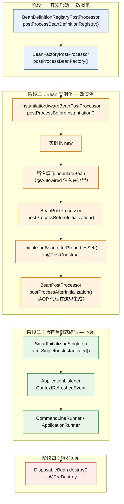
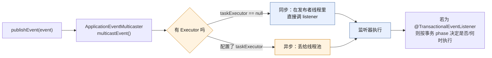
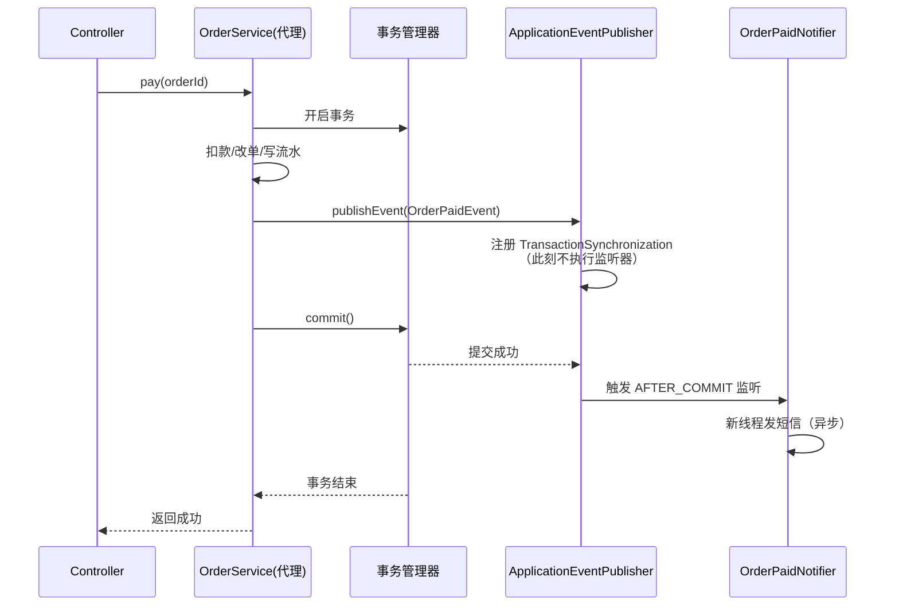
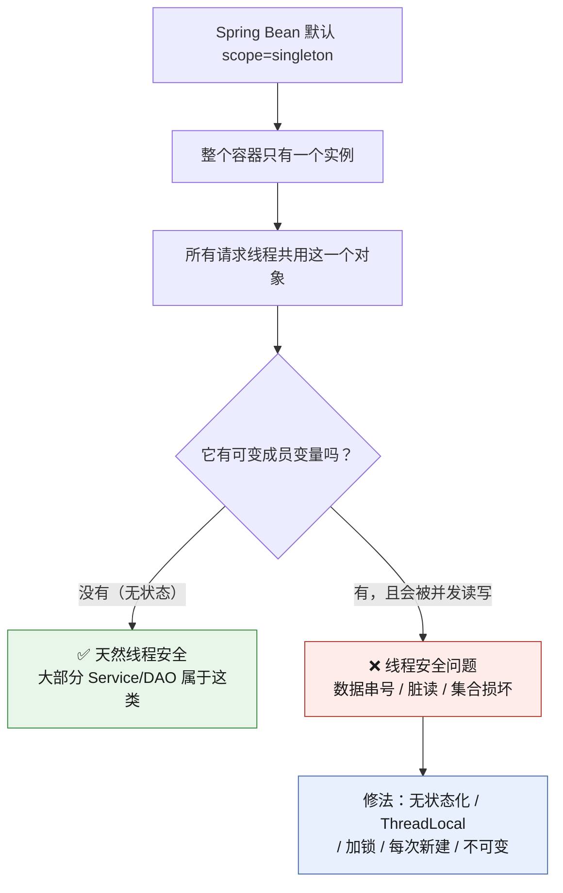
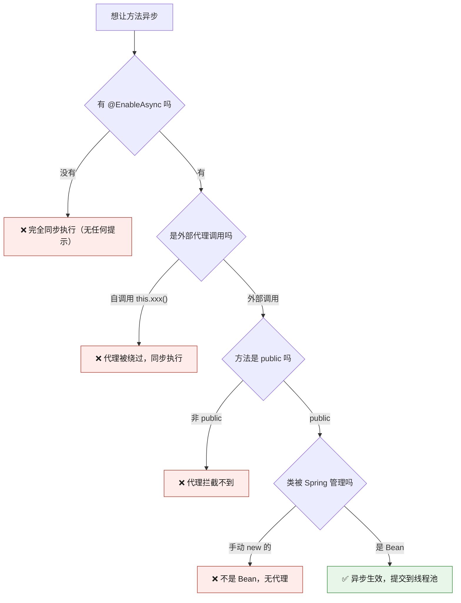
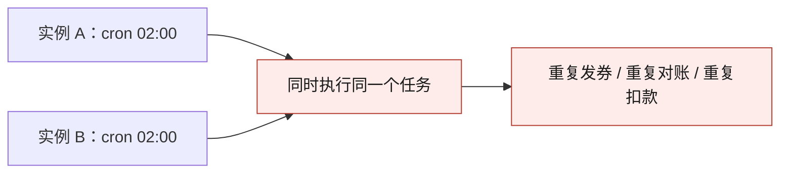
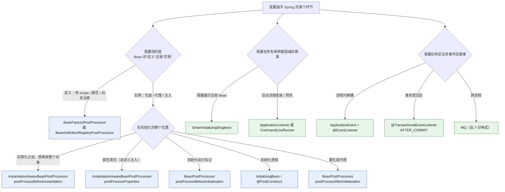

# 🔬 七、Spring 进阶专题

> 返回 [[0-Spring总览]] · 上一篇 [[6-SpringBoot自动装配]] · 下一篇 [[8-Spring实战与踩坑]] · 速答骨架 [[面试准备/技术面试题库/13-Spring源码专题]]
>
> 这篇回答的是：**前面六篇把"Spring 怎么跑起来"讲完了，那"我能在哪些点上插手"？** 以及**"插进去之后，多线程下会不会翻车"？**
> 内容对标 **技术负责人 / 架构师** 的追问深度：不是"知道有这个接口"，而是"知道它在哪个时刻被调、改的是定义还是实例、Spring 内部谁在用、我该用哪个"。
>
> [!abstract] 本篇的定位（别和别的笔记打架）
> - **循环依赖**：本篇只给一句话结论 + 指路，**源码级推演全在 [[面试准备/技术面试题库/14-Spring循环依赖专题]]**。
> - **Bean 生命周期细节**：见 [[2-Bean生命周期与依赖注入]]；本篇只讲**生命周期上的钩子点全景与选型**。
> - **AOP / 事务**：见 [[3-AOP原理与实战]]、[[4-声明式事务]]；本篇只讲**它们和扩展点、和线程的结合部**。
> - **踩坑与排查**：见 [[8-Spring实战与踩坑]]；本篇偏"原理 + 正确用法"。

---

## 一、循环依赖（一句话 + 指路）

> [!important] 记住这一句就够了
> **三级缓存解决的是「Setter / 字段注入」的循环依赖；「构造器注入」因为对象还没 new 出来就把引用交不出去，Spring 无法自动解决，直接抛 `BeanCurrentlyInCreationException`。**

三个关键点（面试官追问时能顶上就行，**细节不要在这里展开**）：

| 问题 | 一句话答案 |
|---|---|
| 为什么要三级缓存（而不是两级） | 第三级 `singletonFactories` 存的是**工厂**，为的是在提前暴露时**按需决定要不要生成 AOP 代理**；两级缓存会把"原始对象"和"代理对象"的时序搞乱 |
| Spring Boot 2.6+ 为什么默认禁止 | `spring.main.allow-circular-references=false`（2.6 起默认）。理由：循环依赖本身就是**设计坏味道**，官方希望你重构而不是依赖容器的兜底 |
| `@Async` / `@Transactional` 加在循环依赖的 Bean 上会怎样 | 可能抛 `BeanCurrentlyInCreationException`，因为提前暴露的原始对象和最终代理对象不是同一个 |

> 📖 **完整源码级推演（三级缓存源码、完整时序、边界与特例、@Async + 循环依赖、手画清单）见 [[面试准备/技术面试题库/14-Spring循环依赖专题]]。本篇不再重复。**

**重构正解**（面试时说这句比说"我加个 `@Lazy`"高一个档次）：

```java
// ❌ 治标：@Lazy 只是把注入推迟到第一次调用，环路还在
@Autowired @Lazy private StockService stockService;

// ✅ 治本：把环上的"动作"抽成第三个 Bean，让依赖变成单向
// 原：OrderService -> StockService -> OrderService（B 只是要回调 A 的一个动作）
// 新：OrderService -> StockService -> OrderCallback（接口），OrderCallback 的实现由 A 提供
```

---

## 二、Spring 扩展点全景（★重点，负责人级别的加分项）

### 2.1 为什么这一节值钱

普通候选人答得出来 `BeanPostProcessor`。**负责人级别**要能回答：

- 这些扩展点**按时间排出来**是什么顺序？
- 哪个改的是 **BeanDefinition**（图纸），哪个改的是 **Bean 实例**（房子）？
- **两个都能做同一件事**时（比如都想改属性），该选谁？为什么？
- Spring **自己内部**在哪些地方用了它们？（能举例 = 读过源码）

### 2.2 执行时机全景（Mermaid）



> [!warning] 图示的三个"卡点"必须记住
> 1. **`BeanFactoryPostProcessor` 跑在"任何业务 Bean 被 new 之前"**——此时容器里只有 BeanDefinition，还没有实例。
> 2. **`BeanPostProcessor` 是逐一 Bean 地跑**，每个 Bean 初始化前后各一次；而 BFPP 是**全局跑一轮**。
> 3. **AOP 代理生成在 `postProcessAfterInitialization`**——这就是"自调用为什么失效"的根源（见 [[3-AOP原理与实战]]）。

### 2.3 扩展点对照表（★核心考点）

| 扩展点 | 触发时机 | 改什么 | 典型用途 | Spring 内部真实案例 |
|---|---|---|---|---|
| `BeanDefinitionRegistryPostProcessor` | 最早，BFPP 之前 | **BeanDefinition 注册表**（可新增/删除定义） | 动态注册 Bean、扫描自定义注解 | `ConfigurationClassPostProcessor`（解析 `@Configuration`/`@Bean`/`@ComponentScan`）、`MapperScannerConfigurer`（MyBatis 扫描 Mapper 接口） |
| `BeanFactoryPostProcessor` | 所有 BeanDefinition 已加载、Bean 实例化之前 | **BeanDefinition 属性**（改 scope、改属性值、加依赖） | 改占位符、动态改配置、给 BeanDefinition 加属性 | `PropertySourcesPlaceholderConfigurer`（解析 `${}`）、`CustomEditorConfigurer` |
| `InstantiationAwareBeanPostProcessor` | **实例化前后** + 属性填充前 | 实例本身 / 属性值 | 返回一个替代实例、跳过某些属性的注入、返回代理对象 | `AutowiredAnnotationBeanPostProcessor`（正是它 `postProcessProperties` 完成 `@Autowired`/`@Value` 注入）、`CommonAnnotationBeanPostProcessor` |
| `BeanPostProcessor#postProcessBeforeInitialization` | 初始化方法（`@PostConstruct`）**之前** | Bean 实例 | 打标记、处理自定义注解、注入元数据 | `ApplicationContextAwareProcessor`（注入 `ApplicationContext`/`Environment`）、`InitDestroyAnnotationBeanPostProcessor` |
| `InitializingBean#afterPropertiesSet` / `@PostConstruct` | 属性填充完成后 | Bean 自身 | 校验必填属性、预热缓存、建立连接 | `SqlSessionFactoryBean`、`RedisTemplate` 的部分初始化 |
| `BeanPostProcessor#postProcessAfterInitialization` | 初始化方法**之后** | Bean 实例（常返回代理） | **AOP 代理、包装、埋点** | `AbstractAutoProxyCreator`（`@Transactional`/`@Cacheable`/`@Async` 的代理全在这生成） |
| `SmartInitializingSingleton` | **所有非懒加载单例实例化完成之后** | 遍历所有单例做收尾 | 拿到"确定已全部就绪"的全集做汇总 | `EventListenerMethodProcessor`（扫描 `@EventListener`）、`ScheduledAnnotationBeanPostProcessor`（启动 `@Scheduled`） |
| `ApplicationListener` / `@EventListener` | `ContextRefreshedEvent` 等事件发布时 | 收事件做业务 | 启动预热、缓存加载 | `AbstractApplicationContext.finishRefresh()` 里发 `ContextRefreshedEvent` |
| `CommandLineRunner` / `ApplicationRunner` | **`ApplicationContext` 刷新完、`SpringApplication.run` 返回前** | 执行启动逻辑 | 启动后跑一次的任务（区别：Runner 的参数是 `ApplicationArguments`） | `SpringApplication.callRunners()` |
| `DisposableBean#destroy` / `@PreDestroy` | 容器关闭 / Bean 销毁时 | 释放资源 | 关线程池、flush 缓冲、注销 | `ThreadPoolTaskExecutor`、`HikariDataSource` |

> [!tip] `CommandLineRunner` vs `ApplicationRunner` 的唯一区别
> 参数类型：`CommandLineRunner.run(String... args)`；`ApplicationRunner.run(ApplicationArguments args)`。
> **`ApplicationArguments` 能区分 `--key=value` 形式的选项参数和非选项参数**，生产里更推荐它。执行顺序可用 `@Order` 控制。

### 2.4 `BeanFactoryPostProcessor` vs `BeanPostProcessor`（高频必答）

| 对比项 | `BeanFactoryPostProcessor`（BFPP） | `BeanPostProcessor`（BPP） |
|---|---|---|
| **作用对象** | **BeanDefinition**（图纸） | **Bean 实例**（房子） |
| **执行时机** | 容器启动早期，**Bean 还没实例化** | **每个 Bean** 实例化过程中 |
| **执行次数** | **全局一轮** | **每个 Bean 各一轮**（前后两次） |
| **能否拿到 `ApplicationContext`** | ❌ 不能直接拿（`ApplicationContext` 还没 ready） | ✅ 可以（实现 `BeanFactoryAware` 或注入） |
| **注册方式** | 静态 `@Bean` 方法 / `static` 修饰，否则会被过早实例化 | 实例方法即可 |
| **排序接口** | `PriorityOrdered` / `Ordered` | `PriorityOrdered` / `Ordered`（另有 `OrderComparator`） |
| **典型用途** | 改配置、动态注册 Bean | AOP 代理、注解注入、埋点 |

> [!danger] 一个经典坑：BFPP 里注入别的 Bean 会导致"过早实例化"
> `BeanFactoryPostProcessor` 执行时，**业务 Bean 还没被创建**。如果你在它的 `@Bean` 方法（非 static）里依赖了别的 Bean，Spring 为了造出这个 BFPP，会**被迫提前创建那个 Bean**，进而可能让**其它 BPP 还没注册就生效**，导致 AOP 不生效、`@Autowired` 注入不上。
> **正解：BFPP 的 `@Bean` 方法声明为 `static`。**

```java
@Configuration
public class MyConfig {
    // ✅ static：不触发配置类自身实例化，避免过早创建其它 Bean
    @Bean
    public static BeanFactoryPostProcessor myBfpp() {
        return bf -> { /* 改 BeanDefinition */ };
    }

    // ❌ 非 static：会把 MyConfig 及其依赖提前创建，BPP 生效顺序被打乱
    // @Bean public BeanFactoryPostProcessor badBfpp(SomeService s) { ... }
}
```

### 2.5 `SmartInitializingSingleton` vs `ApplicationListener<ContextRefreshedEvent>`

这是**负责人级别**的追问点——两个"看起来都是启动后执行一次"，差别在哪？

| 对比项 | `SmartInitializingSingleton` | `ApplicationListener<ContextRefreshedEvent>` |
|---|---|---|
| **回调位置** | `preInstantiateSingletons()` 的**循环结束之后**，同一个方法内 | `finishRefresh()` 中 `publishEvent(new ContextRefreshedEvent(this))` |
| **相对顺序** | **先**（更早） | **后** |
| **能拿到什么** | 可以遍历 `beanFactory.getBeanNamesForType(...)` 拿到**全部已就绪的单例** | 拿到事件对象 + `ApplicationContext`（可 `getBeansOfType`） |
| **是否随子容器重复触发** | 否 | ✅ **会**！父子容器（如 Spring Cloud 场景）中 `ContextRefreshedEvent` 会**多次触发** |
| **典型场景** | 需要"确定所有单例都好了"再做汇总（如 Spring 扫描 `@EventListener`） | 启动预热、初始化缓存 |

> [!warning] `ContextRefreshedEvent` 重复触发的经典 bug
> 在 Spring Cloud / 有父容器的场景，`ContextRefreshedEvent` 可能被发**多次**（根容器一次、子容器一次）。
> **防重复的写法**（判断事件源是当前容器的上下文）：

```java
@Component
public class WarmUpListener implements ApplicationListener<ContextRefreshedEvent> {
    private final AtomicBoolean warmed = new AtomicBoolean(false);

    @Override
    public void onApplicationEvent(ContextRefreshedEvent event) {
        // 只处理"当前容器自己"刷新完的事件，忽略子容器冒泡上来的
        if (event.getApplicationContext().getParent() != null) {
            return;
        }
        if (warmed.compareAndSet(false, true)) {
            doWarmUp();
        }
    }
}
```

### 2.6 自己写 BPP 的正确姿势（含排序）

```java
@Component
public class TraceBeanPostProcessor implements BeanPostProcessor, Ordered {

    // 想"早于 AOP 代理生成"生效：用 postProcessBeforeInitialization
    @Override
    public Object postProcessBeforeInitialization(Object bean, String beanName) {
        if (bean instanceof Traceable) {
            ((Traceable) bean).setTraceIdPrefix(beanName);
        }
        return bean;   // ⚠️ 必须 return，返回 null 会让容器认为"跳过后续 BPP"
    }

    @Override
    public Object postProcessAfterInitialization(Object bean, String beanName) {
        return bean;
    }

    @Override
    public int getOrder() {
        // AOP 的 AbstractAutoProxyCreator 是 Ordered.LOWEST_PRECEDENCE
        // 想“包在代理外层”要在它之后，想“拿原始对象”要在它之前
        return Ordered.LOWEST_PRECEDENCE;
    }
}
```

> [!danger] 写 BPP 的两个致命细节
> 1. **`return null`**：Spring 会把 `null` 当成"这个 BPP 声明了不处理"，直接**跳过后续所有 BPP**——AOP、`@Autowired` 全部失效，且极难排查。
> 2. **BPP 本身不能被其它 BPP 加工**：Spring 会打印 `is not eligible for getting processed by all BeanPostProcessors` 警告。**BPP 里别注入业务 Bean**，否则这个 Bean 会失去 AOP 能力。

---

## 三、Spring 事件机制

### 3.1 四个角色

| 角色 | 说明 |
|---|---|
| `ApplicationEvent` | 事件对象（Spring 4.2+ 起**任意 POJO 都能当事件**，不必继承） |
| `ApplicationListener<E>` | 监听器接口，`onApplicationEvent(E event)` |
| `@EventListener` | 注解式监听，方法签名就是事件类型，**更推荐** |
| `ApplicationEventMulticaster` | 广播器，默认实现 `SimpleApplicationEventMulticaster`，**决定同步还是异步** |



### 3.2 默认是同步的！（必答）

> [!important] 面试必答
> **Spring 事件默认是同步的**：`SimpleApplicationEventMulticaster` 的 `taskExecutor` 默认是 `null`，`multicastEvent` 会**在发布者线程中依次调用所有监听器**。
> 后果：**监听器抛异常会传染给发布者**（整个业务事务回滚）；**监听器慢会拖慢主流程**。

**开启异步的两种方式：**

```java
// 方式一：给 @EventListener 加 @Async（需要 @EnableAsync）
@Configuration
@EnableAsync
public class AsyncEventConfig { }

@Component
public class OrderListener {
    @Async("bizExecutor")   // 指定线程池，别用默认的
    @EventListener
    public void onCreated(OrderCreatedEvent e) { /* 在新线程执行 */ }
}

// 方式二（更彻底）：替换 ApplicationEventMulticaster，全局异步
@Bean(name = AbstractApplicationContext.APPLICATION_EVENT_MULTICASTER_BEAN_NAME)
public ApplicationEventMulticaster applicationEventMulticaster(ThreadPoolTaskExecutor executor) {
    SimpleApplicationEventMulticaster multicaster = new SimpleApplicationEventMulticaster();
    multicaster.setTaskExecutor(executor);   // 保留 ErrorHandler 才不会静默吞异常
    multicaster.setErrorHandler(TaskUtils.LOG_AND_SUPPRESS_ERROR_HANDLER);
    return multicaster;
}
```

| 方式 | 粒度 | 取舍 |
|---|---|---|
| `@Async` + `@EventListener` | 单个监听器 | 灵活；但**全局仍是同步语义**，别的监听器还在主线程跑 |
| 自定义 `ApplicationEventMulticaster` | 全局 | 一劳永逸；但**所有监听器都异步**，包括框架内部的，异常处理需自己兜 |
| 事件 + MQ | 跨进程 | 真·解耦（见 [[7-分布式/8-微服务架构与注册配置中心]]） |

> [!warning] 异步监听器的异常会被**静默吞掉**
> 异步执行时异常不在发布者线程，**默认只打日志不抛出**（`SimpleAsyncUncaughtExceptionHandler`）。
> 需要业务感知就必须显式处理：`setErrorHandler` 或监听器内部 try-catch 落库/告警。

### 3.3 `@TransactionalEventListener` 的四个 phase（★核心）

> [!important] "事务提交后再发消息"的正解就是这里
> 在事务方法里直接 `publishEvent` + 异步监听发 MQ，会出现 **"消息已发出但事务回滚了"** 的数据不一致。
> `@TransactionalEventListener` 默认 **只在事务成功提交后** 才执行，**这就是正解**。

| phase | 执行时机 | 典型用途 |
|---|---|---|
| `BEFORE_COMMIT` | 事务提交**之前**（还在事务内） | 需要在同一事务里做最后校验/写库 |
| `AFTER_COMMIT`（**默认**） | 提交**成功后** | **发 MQ、发短信、发通知**（记住这个） |
| `AFTER_ROLLBACK` | 回滚**之后** | 补偿、告警、清理 |
| `AFTER_COMPLETION` | 提交**或**回滚之后（都会执行） | 资源清理、埋点 |

其他关键属性：

| 属性 | 作用 |
|---|---|
| `fallbackExecution = true` | **没有事务时也执行**（默认 `false`：没事务就静默跳过！这是最常见的"监听器不触发"原因） |
| `@Order` | 多个监听器的顺序 |

> [!danger] 最大的坑：没有事务 → 监听器静默不执行
> `@TransactionalEventListener` 默认 `fallbackExecution=false`。如果你的发布方法**没有被事务代理包住**（自调用、事务失效、只读没开事务），监听器**一声不响地不执行**。
> 排查第一步：**确认发布事件的方法真的有事务**。参考 [[4-声明式事务]]。

### 3.4 完整示例：下单成功后发短信

```java
// 1) 事件（POJO 即可，Spring 4.2+）
public record OrderPaidEvent(Long orderId, Long userId, String phone, BigDecimal amount) { }

// 2) 发布（在事务方法内，事务提交后才会真正触发监听）
@Service
@RequiredArgsConstructor
public class OrderService {
    private final ApplicationEventPublisher publisher;

    @Transactional(rollbackFor = Exception.class)
    public void pay(Long orderId) {
        // ... 扣款、改单、写流水（都在同一事务）
        publisher.publishEvent(new OrderPaidEvent(orderId, userId, phone, amount));
        // 此刻监听器还“没执行”，只是登记了一个事务同步回调
    }
}

// 3) 监听：事务提交后再发短信（异步执行，失败不影响主流程）
@Component
@RequiredArgsConstructor
@Slf4j
public class OrderPaidNotifier {

    private final SmsClient smsClient;

    @Async("notifyExecutor")                                   // 异步，别拖慢主流程
    @TransactionalEventListener(phase = TransactionPhase.AFTER_COMMIT)
    @Order(10)
    public void onPaid(OrderPaidEvent e) {
        try {
            smsClient.send(e.phone(), "您的订单 " + e.orderId() + " 已支付成功");
        } catch (Exception ex) {
            log.error("发送支付短信失败, orderId={}", e.orderId(), ex);   // 打堆栈
            // 落重试表 / 发告警，别让它抛出去
        }
    }
}

// 4) 同一事件的另一个监听：扣减优惠券（同步，就在提交后立刻做）
@TransactionalEventListener(phase = TransactionPhase.AFTER_COMMIT)
public void onPaidForCoupon(OrderPaidEvent e) { couponService.consume(e.orderId()); }
```



> [!tip] `AFTER_COMMIT` 里的一个隐藏陷阱
> `AFTER_COMMIT` 执行时**事务已经提交但连接可能还绑在线程上**。此时**再发起新的数据库写操作**，某些场景下会复用到那个已提交的连接。
> 更稳的写法：`AFTER_COMMIT` 里**只做"发消息/发通知"**，需要写库就用 `REQUIRES_NEW` 开新事务，或者干脆再发一个异步事件。
> 另外，如果监听器是 `@Async`，**MDC/TraceId 会丢**——见 [[8-Spring实战与踩坑]]。

---

## 四、Bean 的线程安全（★重点，生产事故高发区）

### 4.1 根因：Spring 的 Bean 默认是单例



### 4.2 反例 vs 正解

```java
// ❌ 反例 1：Controller 里放可变成员变量（最经典的生产事故）
@RestController
public class UserController {
    private User currentUser;                  // 单例！所有请求共享

    @GetMapping("/me")
    public User me(@RequestParam Long id) {
        currentUser = userService.get(id);     // 线程 A 写
        return currentUser;                    // 线程 B 可能已经把它覆盖了 → 串号
    }
}

// ✅ 正解：方法局部变量
@RestController
@RequiredArgsConstructor
public class UserController {
    private final UserService userService;
    @GetMapping("/me")
    public User me(@RequestParam Long id) {
        return userService.get(id);            // 局部变量，栈私有
    }
}
```

```java
// ❌ 反例 2：Service 里放可变集合做“请求级缓存”
@Service
public class ReportService {
    private final Map<Long, Report> cache = new HashMap<>();   // 单例共享 + HashMap 非线程安全

    public Report get(Long id) {
        Report r = cache.get(id);              // 并发 put 可能死循环 / 丢数据（JDK8 后不一定死循环，但一定不安全）
        if (r == null) { r = build(id); cache.put(id, r); }
        return r;
    }
}

// ✅ 正解 A：真要做缓存，用线程安全的 + 有上限的（Caffeine/Redis）
private final Cache<Long, Report> cache = Caffeine.newBuilder()
        .maximumSize(10_000).expireAfterWrite(Duration.ofMinutes(5)).build();

// ✅ 正解 B：请求级数据用 RequestScope / 方法参数传递
```

> [!danger] `SimpleDateFormat` / `Calendar` / `Random`（旧版）也是重灾区
> 它们是**非线程安全**的。放到单例 Bean 的成员变量上，高并发下会出现**日期解析错乱**（`NumberFormatException`、日期串号）。
> 正解：用 `DateTimeFormatter`（**不可变、线程安全**）或 `ThreadLocal<SimpleDateFormat>`。

### 4.3 `@Scope("prototype")` 不是万能解

很多人第一反应是"改成 prototype 就安全了"。**它的代价：**

| 问题 | 说明 |
|---|---|
| **性能** | 每次 `getBean` 都要走完整创建流程（含 BPP、依赖注入），比单例贵得多 |
| **生命周期管理** | Spring **不管理 prototype Bean 的销毁**，`@PreDestroy` **不会被调用** → 资源泄漏（连接、线程池） |
| **注入陷阱** | 单例 Bean 注入 prototype Bean，**只注入一次**，拿到的永远是同一个实例 → 你以为它是新的，其实不是 |
| **线程安全没根治** | 如果 prototype Bean 被放进了某个单例的成员变量里，照样共享 |

> 想"单例里每次拿新的"，正解是 **`ObjectProvider` / `@Lookup`**，而不是 `@Scope("prototype")` 直接注入：

```java
@Service
public class TaskService {
    private final ObjectProvider<TaskContext> provider;   // ✅ 延迟、每次拿新的

    public void run() {
        TaskContext ctx = provider.getObject();           // 每次都是新实例
    }
}
```

### 4.4 ThreadLocal 的正确使用与内存泄漏

```java
public final class UserContext {
    private static final ThreadLocal<LoginUser> HOLDER = new ThreadLocal<>();

    public static void set(LoginUser u) { HOLDER.set(u); }
    public static LoginUser get()      { return HOLDER.get(); }

    // ⚠️ 必须清理！线程池的线程是复用的
    public static void clear() { HOLDER.remove(); }
}
```

```java
// 用拦截器保证"进有 set，出必 remove"
@Component
public class UserContextInterceptor implements HandlerInterceptor {
    @Override
    public boolean preHandle(HttpServletRequest req, HttpServletResponse resp, Object handler) {
        UserContext.set(parseToken(req));
        return true;
    }

    @Override
    public void afterCompletion(HttpServletRequest req, HttpServletResponse resp,
                                Object handler, Exception ex) {
        UserContext.clear();          // ✅ 必须在 finally 语义的位置清理
    }
}
```

> [!danger] ThreadLocal 内存泄漏的机理（必答）
> 1. `ThreadLocalMap` 的 **key 是 `ThreadLocal` 的弱引用，value 是强引用**。
> 2. `ThreadLocal` 对象被回收后，key 变成 `null`，但 **value 还被线程强引用着**——因为线程池的线程**永不销毁**，value 就**永不释放**。
> 3. 结果：类加载器无法回收（**类加载器泄漏**）+ 堆内存持续占用。
> **正解**：**用完必须 `remove()`**，且要放在 `finally` / `afterCompletion` 里。手动 `set(null)` 不够——**那只是把 value 置空，Entry 还在**。
> 详见 [[1-java/1-juc/4-多线程与内存模型]]。

### 4.5 共享可变状态的几种修法对比（★选型表）

| 修法 | 适用场景 | 优点 | 代价 / 风险 |
|---|---|---|---|
| **无状态化**（首选） | 绝大多数 Service/Controller | 零成本、无锁、天然可水平扩展 | 需要把状态提到参数/上下文里，改造有工作量 |
| **ThreadLocal** | 请求级上下文（用户、TraceId、租户） | 无需改方法签名 | **必须 `remove()`**，异步/线程池下会丢（见 4.6） |
| **加锁**（`synchronized`/`ReentrantLock`） | 临界区短、竞争低 | 改动小 | **串行化 → 吞吐暴跌**；锁粒度/死锁风险；分布式下无效 |
| **每次新建**（`new` / `ObjectProvider`） | 对象本身持有可变状态、创建便宜 | 彻底隔离 | 创建开销；Spring 不管销毁 |
| **不可变对象** | 配置、快照、DTO | 天然安全、可安全共享 | 每次变更要造新对象（适合小对象） |
| **并发容器 / 原子类** | 真需要共享的计数器、缓存 | 无锁/细粒度锁 | 只解决"单个操作原子"，**复合操作仍需同步** |

> [!tip] 选型口诀
> **能无状态就无状态；要请求上下文用 ThreadLocal 并必删；要共享就上并发容器或分布式缓存；加锁是最后手段，因为它在分布式下根本不管用。**

### 4.6 异步线程里状态会丢（重点）

| 载体 | 跨线程是否保留 | 解决 |
|---|---|---|
| `ThreadLocal`（含 MDC） | ❌ 丢 | `TaskDecorator` 手动拷贝 / `TransmittableThreadLocal` |
| `SecurityContext`（默认策略） | ❌ 丢 | `DelegatingSecurityContextAsyncTaskExecutor` |
| `RequestContextHolder` | ❌ 丢 | `RequestContextFilter` + 手动传，或干脆别用 |
| `TransactionSynchronizationManager` | ❌ 丢（新线程无事务） | 见 §5「`@Async` + `@Transactional`」 |

具体解法骨架见 [[8-Spring实战与踩坑]]。

---

## 五、`@Async` 的正确使用与坑（★重点）

### 5.1 生效条件（缺一不可）



### 5.2 不指定线程池 = 生产事故

> [!danger] `SimpleAsyncTaskExecutor` 每次新建线程
> 不指定 Executor 时，默认用 `SimpleAsyncTaskExecutor`——它**不复用线程，每次调用都 `new Thread()`**。
> 高并发下会**疯狂创建线程 → CPU 上下文切换爆炸 → OOM: unable to create new native thread**。
> **生产必须自定义线程池。**

```java
@Configuration
@EnableAsync
public class AsyncConfig implements AsyncConfigurer {

    @Bean("bizExecutor")
    public ThreadPoolTaskExecutor bizExecutor() {
        ThreadPoolTaskExecutor e = new ThreadPoolTaskExecutor();
        e.setCorePoolSize(Runtime.getRuntime().availableProcessors() * 2);
        e.setMaxPoolSize(64);
        e.setQueueCapacity(500);                       // ⚠️ 队列必须有界
        e.setThreadNamePrefix("biz-async-");           // 打日志/arthas 排查靠它
        e.setKeepAliveSeconds(60);
        e.setWaitForTasksToCompleteOnShutdown(true);   // 优雅停机：等任务跑完
        e.setAwaitTerminationSeconds(30);
        // 拒绝策略：默认 AbortPolicy（抛异常）——要明确知道你的选择
        e.setRejectedExecutionHandler(new ThreadPoolExecutor.CallerRunsPolicy());
        // 异步透传 MDC / TraceId
        e.setTaskDecorator(new MdcTaskDecorator());
        e.initialize();
        return e;
    }

    // 兜底：全局默认 Executor + 异常处理器
    @Override public Executor getAsyncExecutor() { return bizExecutor(); }

    @Override
    public AsyncUncaughtExceptionHandler getAsyncUncaughtExceptionHandler() {
        return (ex, method, params) ->
            log.error("异步任务异常: {}", method.getName(), ex);   // 一定要打堆栈
    }
}
```

> [!warning] 队列容量的隐藏陷阱
> `LinkedBlockingQueue` 默认容量是 `Integer.MAX_VALUE`（近乎无界）。
> 如果只调大 `corePoolSize` 而不管队列，实际效果是：**核心线程满了以后任务全堆在队列里，`maxPoolSize` 永远到不了** → 任务无限堆积 → OOM 或超时。
> **规律：先有界队列，再谈 `maxPoolSize`。**

### 5.3 线程池满 / 四种拒绝策略

| 策略 | 行为 | 适用 |
|---|---|---|
| `AbortPolicy`（**默认**） | 直接抛 `RejectedExecutionException` | 希望调用方感知、能接受报错 |
| `CallerRunsPolicy` | **由提交任务的线程自己执行** | 希望"降级为同步"，起到反压作用（注意：会阻塞主线程） |
| `DiscardPolicy` | 静默丢弃 | ⚠️ **几乎不要用**，任务无声消失 |
| `DiscardOldestPolicy` | 丢掉队列里最老的，再提交 | 只保留最新任务（如行情推送） |

### 5.4 异常捕获：`void` 方法拿不到异常

| 返回类型 | 异常去哪了 | 能否拿到 |
|---|---|---|
| `void` | 交给 `AsyncUncaughtExceptionHandler`（**默认只打日志**） | ❌ 调用方拿不到 |
| `Future<T>` / `CompletableFuture<T>` | 包在 `Future` 里 | ✅ `future.get()` 抛 `ExecutionException` |

```java
// ✅ 需要感知失败时用 CompletableFuture
@Async("bizExecutor")
public CompletableFuture<Result> doWork(Long id) {
    try {
        return CompletableFuture.completedFuture(work(id));
    } catch (Exception e) {
        return CompletableFuture.failedFuture(e);      // ✅ 显式失败
    }
}
```

### 5.5 `@Async` + `@Transactional` 的坑（★）

> [!danger] 核心结论：`@Async` 在**新线程**跑，那里**没有原线程的事务上下文**，也就**加入不了原事务**。
> 常见错误期待："我在事务里调了个 `@Async` 方法，它应该在我事务里" → **不可能**。

| 组合 | 实际行为 |
|---|---|
| 外层 `@Transactional` + 内层 `@Async` | **异步方法在新线程、新事务（或无事务）中执行**，与外层事务无关 |
| 外层事务回滚了 | **异步方法可能已经执行**（甚至已经把数据写进去了）→ 数据不一致 |
| `@Async` + `@Transactional` 在**同一个方法** | 顺序：代理先做异步判断再开事务，**实际是新线程 + 新事务**；但如果方法不是 public / 自调用，两者**同时失效** |
| 异步方法里抛异常 | **不会**回滚外层事务（都不在同一线程） |

**正确的心智模型**：

```java
@Transactional
public void createOrder(Order o) {
    orderMapper.insert(o);
    // ❌ 错误期待：以为 sendMail 在事务里
    mailService.sendAsync(o);          // 已经在新线程跑了，随时可能先于 commit
}

// ✅ 正解：要"提交后再异步"，用事务事件（§3.3）
publisher.publishEvent(new OrderCreatedEvent(o.getId()));

@Async("notifyExecutor")
@TransactionalEventListener(phase = TransactionPhase.AFTER_COMMIT)
public void onCreated(OrderCreatedEvent e) { mailService.send(e.getId()); }
```

### 5.6 MDC / TraceId / SecurityContext 丢失

```java
// TaskDecorator：把发布线程的 MDC 拷到执行线程，并在执行完后恢复/清理
public class MdcTaskDecorator implements TaskDecorator {
    @Override
    public Runnable decorate(Runnable runnable) {
        Map<String, String> ctx = MDC.getCopyOfContextMap();
        return () -> {
            Map<String, String> old = MDC.getCopyOfContextMap();
            try {
                if (ctx != null) MDC.setContextMap(ctx);   // 继承父线程的 traceId
                runnable.run();
            } finally {
                if (old != null) MDC.setContextMap(old); else MDC.clear();  // ★ 必须清理
            }
        };
    }
}
```

| 方案 | 说明 |
|---|---|
| `TaskDecorator` | 手动拷贝 MDC，简单可控；只覆盖你自己配置的线程池 |
| `TransmittableThreadLocal`（阿里 TTL） | 自动透传，支持**线程池复用**场景；需 `TtlExecutors.getTtlExecutorService` 包装 |
| `InheritableThreadLocal` | ⚠️ **只在线程创建时复制一次**，线程池复用下**无效**（这是常见误区） |

---

## 六、Spring 的缓存抽象

### 6.1 三个注解的语义差异（必答）

| 注解 | 读缓存？ | 写缓存？ | 方法会执行吗 | 典型用途 |
|---|---|---|---|---|
| `@Cacheable` | ✅ 先查，命中则**直接返回** | ✅ 未命中时把返回值写入 | **命中时不执行** | 查询 |
| `@CachePut` | ❌ 不查 | ✅ **总是**把返回值写入 | **每次都执行** | 更新后刷新缓存 |
| `@CacheEvict` | ❌ | 删除（`allEntries=true` 清空） | 每次都执行 | 删除/更新后失效缓存 |

```java
@Cacheable(cacheNames = "user", key = "#id", unless = "#result == null")
public User getById(Long id) { return userMapper.selectById(id); }

@CachePut(cacheNames = "user", key = "#user.id")
public User update(User user) { userMapper.update(user); return user; }

@CacheEvict(cacheNames = "user", key = "#id")
public void delete(Long id) { userMapper.delete(id); }

@CacheEvict(cacheNames = "user", allEntries = true)   // 清空整个 cacheName
public void refreshAll() { }
```

### 6.2 `@Cacheable` 的 key 生成规则

| 场景 | 默认 key |
|---|---|
| 无参数 | `SimpleKey.EMPTY` |
| 单参数 | **参数对象本身**（靠 `equals/hashCode`） |
| 多参数 | `SimpleKey(param1, param2)`（数组，`hashCode` 基于全部参数） |

```java
// ❌ 坑：多参数对象没重写 equals/hashCode → 每次都是不同 key → 缓存永远不命中
public record QueryReq(String name, int page) { }   // record 自动生成 equals/hashCode ✅

// ✅ 显式指定 key，最稳
@Cacheable(cacheNames = "order", key = "#userId + ':' + #status")
```

> [!warning] SPEL 里不要调远程/耗时方法
> `key = "#userService.slowHash(#id)"` 会在**每次请求**都执行，把缓存的收益吃光。

### 6.3 自调用失效（和 AOP 同一个病根）

```java
@Service
public class UserService {
    public User outer(Long id) {
        return this.inner(id);      // ❌ 绕过代理 → 缓存完全不生效，每次都查库
    }

    @Cacheable(cacheNames = "user", key = "#id")
    public User inner(Long id) { return userMapper.selectById(id); }
}
```

- **验证**：`AopUtils.isAopProxy(this)` + `AopUtils.isCglibProxy(this)` 打印；或断点看调用栈里有没有 `CglibAopProxy`。
- **修法**：拆到另一个 Bean / `AopContext.currentProxy()`（需 `@EnableAspectJAutoProxy(exposeProxy = true)`）/ 注入自身。
- 根源见 [[3-AOP原理与实战]]。

### 6.4 缓存穿透的默认行为与 `unless`

> [!important] Spring Cache 会缓存 `null`！
> `@Cacheable` **默认把 `null` 也当作一个有效返回值缓存起来**。
> - **好处**：天然抵御**缓存穿透**（同一个不存在的 id 不会反复打库）。
> - **坏处**：`null` 被长期缓存，之后数据真的插入了，**还是返回 null**（需要等 TTL 或主动 evict）。

```java
// 想要“不缓存 null”：加 unless
@Cacheable(cacheNames = "user", key = "#id", unless = "#result == null")

// 想要“缓存空值防穿透但 TTL 短”：在 CacheManager 层面为每个 cacheName 配 TTL（Redis 场景）
```

| 目标 | 做法 |
|---|---|
| 不缓存 null | `unless = "#result == null"` |
| 缓存空值防穿透 | 保持默认 + 设置较短 TTL |
| 区分"没查到"与"查过但为空" | 返回 `Optional` 或哨兵对象（注意序列化） |

### 6.5 与 Redis 集成时的序列化坑

```java
@Bean
public RedisCacheManager cacheManager(RedisConnectionFactory factory) {
    RedisCacheConfiguration cfg = RedisCacheConfiguration.defaultCacheConfig()
            .entryTtl(Duration.ofMinutes(30))
            .computePrefixWith(name -> "cache:" + name + ":")   // 清晰的 key 前缀
            // 用 JSON 序列化，别用默认的 JDK 序列化
            .serializeKeysWith(RedisSerializationContext.SerializationPair
                    .fromSerializer(new StringRedisSerializer()))
            .serializeValuesWith(RedisSerializationContext.SerializationPair
                    .fromSerializer(new GenericJackson2JsonRedisSerializer()))
            .disableCachingNullValues();     // 与 unless 二选一
    return RedisCacheManager.builder(factory).cacheDefaults(cfg).build();
}
```

| 坑 | 现象 | 解决 |
|---|---|---|
| 默认 `JdkSerializationRedisSerializer` | Redis 里是**乱码二进制**，无法直接排查，跨语言不通 | 换 `GenericJackson2JsonRedisSerializer` |
| `GenericJackson2JsonRedisSerializer` 存 class 信息 | 反序列化依赖类路径，**改包名就炸** | 显式配置类型，或用 `Jackson2JsonRedisSerializer<T>` |
| `LocalDateTime` 序列化 | 抛 `Java 8 date/time type not supported by default` | 注册 `JavaTimeModule` **并** `disable(WRITE_DATES_AS_TIMESTAMPS)` |
| 缓存对象**反序列化失败** | `SerializationException` | 检查类是否有**无参构造** + `equals/hashCode` |
| 多实例**缓存不一致** | 各节点本地缓存不同步 | 用 Redis（集中式），别用 `ConcurrentMapCacheManager` |

---

## 七、`@Scheduled` 定时任务

### 7.1 默认单线程（最容易踩的坑）

> [!danger] `@Scheduled` 默认只有一个线程
> Spring 默认用**单线程**的 `ThreadPoolTaskScheduler`（`poolSize=1`）。
> **一个任务执行慢了，会把后面所有任务全部阻塞**——表现是"某个定时任务莫名不执行了"，实际是被前面的任务卡住。

```java
@Configuration
@EnableScheduling
public class ScheduleConfig implements SchedulingConfigurer {
    @Override
    public void configureTasks(ScheduledTaskRegistrar registrar) {
        ThreadPoolTaskScheduler s = new ThreadPoolTaskScheduler();
        s.setPoolSize(8);                              // ★ 必须 > 1
        s.setThreadNamePrefix("sched-");
        s.setWaitForTasksToCompleteOnShutdown(true);   // 优雅停机
        s.setAwaitTerminationSeconds(60);
        s.setErrorHandler(t -> log.error("定时任务异常", t));  // 默认异常只打日志，显式接管
        s.initialize();
        registrar.setTaskScheduler(s);
    }
}
```

### 7.2 `fixedRate` vs `fixedDelay` vs `cron`

| 属性 | 计时起点 | 上次没跑完会怎样 |
|---|---|---|
| `fixedRate` | 从**上一次任务开始**算 | **不会等待**！到点就触发下一次（单线程下表现为"排队积压"，多线程下**并发执行同一任务**） |
| `fixedDelay` | 从**上一次任务结束**算 | 天然串行，不会重叠（**多数业务场景应该用这个**） |
| `cron` | 按日历表达式 | 同 `fixedRate` 语义，不关心上次是否结束 |

```java
@Scheduled(cron = "0 */5 * * * ?")             // 每 5 分钟
@Scheduled(fixedDelay = 5000)                  // 上次结束后 5s
@Scheduled(fixedRate = 5000)                   // 每 5s（可能与上次重叠）
@Scheduled(cron = "0 0 2 * * ?", zone = "Asia/Shanghai")   // ★ 一定要显式时区！
```

> [!warning] cron 不写 `zone` 的隐患
> 容器时区可能是 UTC，导致"凌晨 2 点"的任务实际在**北京时间 10 点**跑。**一定要显式指定 `zone`。**
> 另外：`@Scheduled` 方法**不能有参数**，且返回值必须是 `void`；同样**受代理限制**（自调用、非 public 不生效）。

### 7.3 分布式环境下重复执行



**三种解法（按推荐度）：**

| 方案 | 说明 | 取舍 |
|---|---|---|
| **调度平台**（XXL-JOB / PowerJob / ElasticJob） | 把调度从应用里剥离，平台保证"只发一次" | ✅ 生产首选（可见、可重跑、可告警） |
| **分布式锁**（Redis/Redisson/ZK） | 任务开始时抢锁，抢到才执行 | 简单；但锁超时、锁续期、时钟漂移要处理，见 [[7-分布式/3-分布式锁]] |
| **数据库乐观锁 / 状态位** | 用一张任务表 `update ... where status=0` 抢占 | 无需额外组件，适合简单场景；注意**幂等**才是根本 |

> [!important] 别忘了一件事：**幂等**才是根本
> 即使调度只触发一次，**网络重试、人工重跑、MQ 重投**都会导致重复执行。
> **最终防线永远是业务幂等**（唯一索引 / 状态机 / 幂等表）。参见 [[7-分布式/2-分布式事务]] 里的幂等章节。

### 7.4 任务耗时长于周期的处理

| 现象 | 根因 | 处理 |
|---|---|---|
| 任务"越跑越密"、内存涨 | `fixedRate` + 任务超时 → 任务堆积 | 换 `fixedDelay` 或加分布式锁防重 |
| 同一任务并发跑了两份 | 线程池 > 1 且 `fixedRate` | 加锁 / 改用 `fixedDelay` |
| 任务执行到一半应用重启 | 无优雅停机 | `waitForTasksToCompleteOnShutdown` + `awaitTerminationSeconds` |
| 任务被静默跳过 | 单线程被前一个任务阻塞 | §7.1 配线程池 |

---

## 八、`@Valid` / 参数校验

### 8.1 JSR-303 常用注解

| 注解 | 作用 |
|---|---|
| `@NotNull` / `@Null` | 非空 / 必须为空 |
| `@NotBlank` / `@NotEmpty` | **字符串**非空白 / 集合或字符串**非空** |
| `@Size(min,max)` | 长度 / 集合大小 |
| `@Min` / `@Max` / `@DecimalMin` / `@DecimalMax` | 数值范围 |
| `@Pattern(regexp)` | 正则 |
| `@Email` | 邮箱 |
| `@Past` / `@Future` | 时间 |
| `@Positive` / `@Negative` | 正/负数 |
| `@Valid`（嵌套） | **级联校验**，缺它嵌套对象里的注解**全部不生效** |

> [!danger] `@NotBlank` 和 `@NotEmpty` 用错 = 校验形同虚设
> - `@NotEmpty` 对 `"   "`（纯空格）**判定为通过**！
> - 字符串场景一律用 **`@NotBlank`**。

### 8.2 `@Valid` vs `@Validated`（必答）

| 对比项 | `@Valid` | `@Validated` |
|---|---|---|
| 来源 | **JSR-303 标准**（`javax/jakarta.validation`） | **Spring 自己**（`org.springframework.validation.annotation`） |
| **分组校验** | ❌ **不支持** | ✅ **支持**（`@Validated(AddGroup.class)`） |
| 嵌套/级联 | ✅ | ✅ |
| 作用位置 | 方法参数、字段、方法 | **类上**（方法级校验需类上标注）+ 方法参数 |
| 底层实现 | 都会被 `MethodValidationPostProcessor` / `RequestResponseBodyMethodProcessor` 处理 | 同 |

> **一句话记忆：需要分组就用 `@Validated`；只需要基础校验两者都行，团队统一即可。**

```java
public interface AddGroup { }
public interface UpdateGroup { }

public class UserDTO {
    @Null(groups = AddGroup.class, message = "新增时不能指定 id")
    @NotNull(groups = UpdateGroup.class, message = "更新时必须指定 id")
    private Long id;

    @NotBlank(message = "用户名不能为空", groups = {AddGroup.class, UpdateGroup.class})
    @Size(max = 32, message = "用户名最长 32")
    private String name;

    @Valid                                   // ★ 缺它就等于没校验
    @NotNull(message = "地址不能为空")
    private AddressDTO address;
}

@PostMapping("/user")
public Result add(@RequestBody @Validated(AddGroup.class) UserDTO dto) { }

@PutMapping("/user")
public Result update(@RequestBody @Validated(UpdateGroup.class) UserDTO dto) { }
```

### 8.3 统一异常处理

```java
@RestControllerAdvice
@Slf4j
public class GlobalExceptionHandler {

    /** @RequestBody 上的校验失败 */
    @ExceptionHandler(MethodArgumentNotValidException.class)
    @ResponseStatus(HttpStatus.BAD_REQUEST)
    public Result<Void> handleBody(MethodArgumentNotValidException e) {
        String msg = e.getBindingResult().getFieldErrors().stream()
                .map(f -> f.getField() + ": " + f.getDefaultMessage())
                .collect(Collectors.joining("; "));
        log.warn("参数校验失败: {}", msg);
        return Result.fail(400, msg);
    }

    /** @RequestParam / @PathVariable 上的校验失败（@Validated 在类上） */
    @ExceptionHandler(ConstraintViolationException.class)
    @ResponseStatus(HttpStatus.BAD_REQUEST)
    public Result<Void> handleParam(ConstraintViolationException e) {
        String msg = e.getConstraintViolations().stream()
                .map(v -> v.getPropertyPath() + ": " + v.getMessage())
                .collect(Collectors.joining("; "));
        return Result.fail(400, msg);
    }

    /** @RequestBody JSON 解析失败（格式错 / 类型错） */
    @ExceptionHandler(HttpMessageNotReadableException.class)
    @ResponseStatus(HttpStatus.BAD_REQUEST)
    public Result<Void> handleUnreadable(HttpMessageNotReadableException e) {
        log.warn("请求体解析失败", e);
        return Result.fail(400, "请求体格式错误");     // ⚠️ 别把原始异常信息返回给前端
    }

    /** 兜底 */
    @ExceptionHandler(Exception.class)
    @ResponseStatus(HttpStatus.INTERNAL_SERVER_ERROR)
    public Result<Void> handleAll(Exception e) {
        log.error("系统异常", e);                      // ★ 必须打堆栈
        return Result.fail(500, "系统繁忙，请稍后重试");
    }
}
```

> [!warning] 两个高频细节
> 1. **`@Validated` 加在类上才有方法级校验**：`public void f(@NotBlank String name)` 这种 `@RequestParam` 校验，必须类上加 `@Validated`，否则**不生效**。
> 2. **异常处理器顺序**：`@ExceptionHandler` 会优先匹配**最具体的异常类型**；但如果你既有 `Exception.class` 兜底又有 `@RestControllerAdvice` 的 `Order`，要注意顺序，别让兜底把业务异常吞了。

### 8.4 自定义校验注解

```java
@Documented
@Target({ElementType.FIELD, ElementType.PARAMETER})
@Retention(RetentionPolicy.RUNTIME)
@Constraint(validatedBy = PhoneValidator.class)          // ★ 关联校验器
public @interface Phone {
    String message() default "手机号格式不正确";
    Class<?>[] groups() default {};                      // ★ 必须有
    Class<? extends Payload>[] payload() default {};      // ★ 必须有
}

public class PhoneValidator implements ConstraintValidator<Phone, String> {
    private static final Pattern P = Pattern.compile("^1[3-9]\\d{9}$");

    @Override
    public boolean isValid(String value, ConstraintValidatorContext ctx) {
        if (value == null || value.isEmpty()) return true;   // ★ 空值交给 @NotBlank，别重复报错
        boolean ok = P.matcher(value).matches();
        if (!ok) {
            // 关掉默认消息，自定义更友好的提示
            ctx.disableDefaultConstraintViolation();
            ctx.buildConstraintViolationWithTemplate("手机号 " + value + " 格式不正确")
               .addConstraintViolation();
        }
        return ok;
    }
}
```

> [!tip] 校验注解的设计原则
> **空值一律返回 `true`**（"格式校验"和"必填校验"职责分离），否则一个字段会同时报"不能为空"和"格式错误"两条消息，前端体验很差。

---

## 九、选型决策：我到底该用哪个扩展点



---

## 十、面试必答 callout（背下来）

> [!question] Q1：`BeanFactoryPostProcessor` 和 `BeanPostProcessor` 有什么区别？
> **BFPP 改"BeanDefinition"（图纸），BPP 改"Bean 实例"（房子）。**
> BFPP 在**所有 Bean 实例化之前**跑，**全局只跑一轮**；BPP 在**每个 Bean 初始化前后**各跑一次。
> 典型用途：BFPP 做配置解析/动态注册（`ConfigurationClassPostProcessor`、`PropertySourcesPlaceholderConfigurer`）；BPP 做**代理生成**（`AbstractAutoProxyCreator`，`@Transactional` / `@Async` / `@Cacheable` 全靠它）、注解注入（`AutowiredAnnotationBeanPostProcessor`）。
> 补充加分点：BFPP 的 `@Bean` 方法要 **static**，否则过早实例化会打乱 BPP 生效顺序。

> [!question] Q2：Spring 事件是同步还是异步的？
> **默认同步。** `SimpleApplicationEventMulticaster` 的 `taskExecutor` 默认是 `null`，监听器在**发布者线程中依次执行**，所以监听器抛异常会**连带发布者一起回滚**，监听器慢会**拖慢主流程**。
> 异步两种方式：① 给监听器加 `@Async`（需 `@EnableAsync`）；② 替换 `ApplicationEventMulticaster` 并 `setTaskExecutor`（全局异步）。
> 加分点：异步后异常会被**静默吞掉**（`AsyncUncaughtExceptionHandler` 默认只打日志），必须显式接管。

> [!question] Q3：怎么在事务提交之后再发消息 / 发通知？
> **用 `@TransactionalEventListener(phase = AFTER_COMMIT)`**，它是"事务提交后"的正解。
> 四个 phase：`BEFORE_COMMIT`（提交前，还在事务里）/ `AFTER_COMMIT`（**默认，提交成功后**）/ `AFTER_ROLLBACK`（回滚后）/ `AFTER_COMPLETION`（提交或回滚都执行）。
> 必须提到的坑：`fallbackExecution` 默认 `false`，**发布事件的方法没有事务时监听器会静默不执行**；另外 `AFTER_COMMIT` 里别依赖原事务的写操作，要写库用 `REQUIRES_NEW`。
> 对比：直接在事务里 `@Async` 发 MQ 的写法是**错的**——事务可能回滚，但消息已经发出去了。

> [!question] Q4：`@Async` 有哪些坑？
> ① **必须 `@EnableAsync`**，否则静默同步；
> ② **必须走代理**（自调用 `/` 非 `public` / 手动 `new` 都不生效）——这是"没异步"的头号原因；
> ③ **不指定线程池就用 `SimpleAsyncTaskExecutor`，每次 `new Thread()`**，生产必炸，必须自定义有界队列的线程池；
> ④ **`void` 方法拿不到异常**，要感知失败得返回 `CompletableFuture` 或配 `AsyncUncaughtExceptionHandler`；
> ⑤ **`@Async` + `@Transactional`：异步在新线程，没有原事务**，指望"在我事务里执行"是错的，要用事务事件；
> ⑥ **MDC / TraceId / SecurityContext 会丢**，用 `TaskDecorator` 或 TTL 透传，并且**必须清理**。

> [!question] Q5（加餐）：单例 Bean 怎么保证线程安全？
> **Spring Bean 默认单例，所以安全的前提是"无状态"。**
> 有状态就有问题：Controller 放成员变量、Service 放可变 `HashMap`、成员变量用 `SimpleDateFormat`，都会在高并发下串号/损坏。
> 修法优先级：**无状态化 > ThreadLocal（必须 remove）> 并发容器/原子类 > 每次新建（ObjectProvider/@Lookup）> 加锁（最后手段，分布式无效）**。
> `@Scope("prototype")` **不是万能解**：贵、Spring 不管理销毁、单例注入它只注入一次。

---

## 十一、实践清单（自查）

| 项 | 检查点 |
|---|---|
| ☐ | 自定义 `BeanFactoryPostProcessor` 的 `@Bean` 方法是否 `static`？ |
| ☐ | 自定义 `BeanPostProcessor` 是否**一定 return 非 null**？是否注入了业务 Bean？ |
| ☐ | `@Async` 是否配了**自定义线程池 + 有界队列 + 有意义的线程名前缀**？ |
| ☐ | 线程池是否配了 `TaskDecorator` 透传 MDC，且**执行完清理**？ |
| ☐ | `MDC` / `ThreadLocal` 是否在 `afterCompletion` / `finally` 里 `remove()`？ |
| ☐ | "提交后才发消息"的场景，是否用了 `@TransactionalEventListener(AFTER_COMMIT)`？ |
| ☐ | `@Scheduled` 是否配了**多线程**、是否显式写了 `zone`、是否防了多实例重复？ |
| ☐ | `@Cacheable` 的 key 是否显式指定？多参数对象是否重写 `equals/hashCode`？Redis 序列化是否为 JSON？ |
| ☐ | DTO 的嵌套对象是否加了 `@Valid`？字符串校验是否用 `@NotBlank`？ |
| ☐ | 全局异常处理是否覆盖了 `MethodArgumentNotValidException` 和 `ConstraintViolationException`？ |

---

## 十二、关联笔记

| 主题 | 去处 |
|---|---|
| Spring 整体地图 | [[0-Spring总览]] |
| IoC 容器 / Bean 生命周期 | [[1-Spring架构与IoC容器]] · [[2-Bean生命周期与依赖注入]] |
| AOP / 自调用失效根因 | [[3-AOP原理与实战]] |
| 声明式事务 / 事务失效 | [[4-声明式事务]] |
| MVC 请求全流程 | [[5-SpringMVC请求全流程]] |
| 自动装配 / 配置优先级 | [[6-SpringBoot自动装配]] |
| **踩坑与排查手册（姊妹篇）** | [[8-Spring实战与踩坑]] |
| 面试高频题 | [[9-Spring面试高频题]] |
| Spring 源码速答骨架 | [[面试准备/技术面试题库/13-Spring源码专题]] |
| **循环依赖完整推演** | [[面试准备/技术面试题库/14-Spring循环依赖专题]] |
| 面试技能骨架 | [[面试准备/专业技能/02-Java核心与微服务]] · [[面试准备/技术面试题库/05-Spring与框架]] |
| 线程 / ThreadLocal / 内存模型 | [[1-java/1-juc/4-多线程与内存模型]] |
| Logback 集成 | [[LOGBACK_SETUP]] |
| 分布式事务与幂等 | [[7-分布式/2-分布式事务]] |
| 分布式锁 | [[7-分布式/3-分布式锁]] |
| 微服务与注册配置中心 | [[7-分布式/8-微服务架构与注册配置中心]] |
