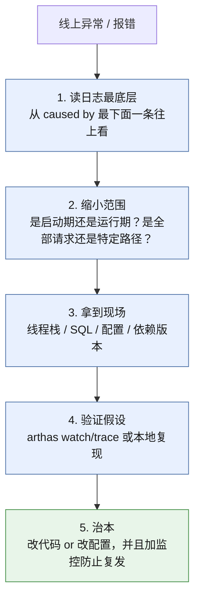
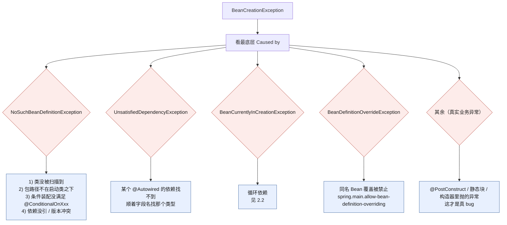
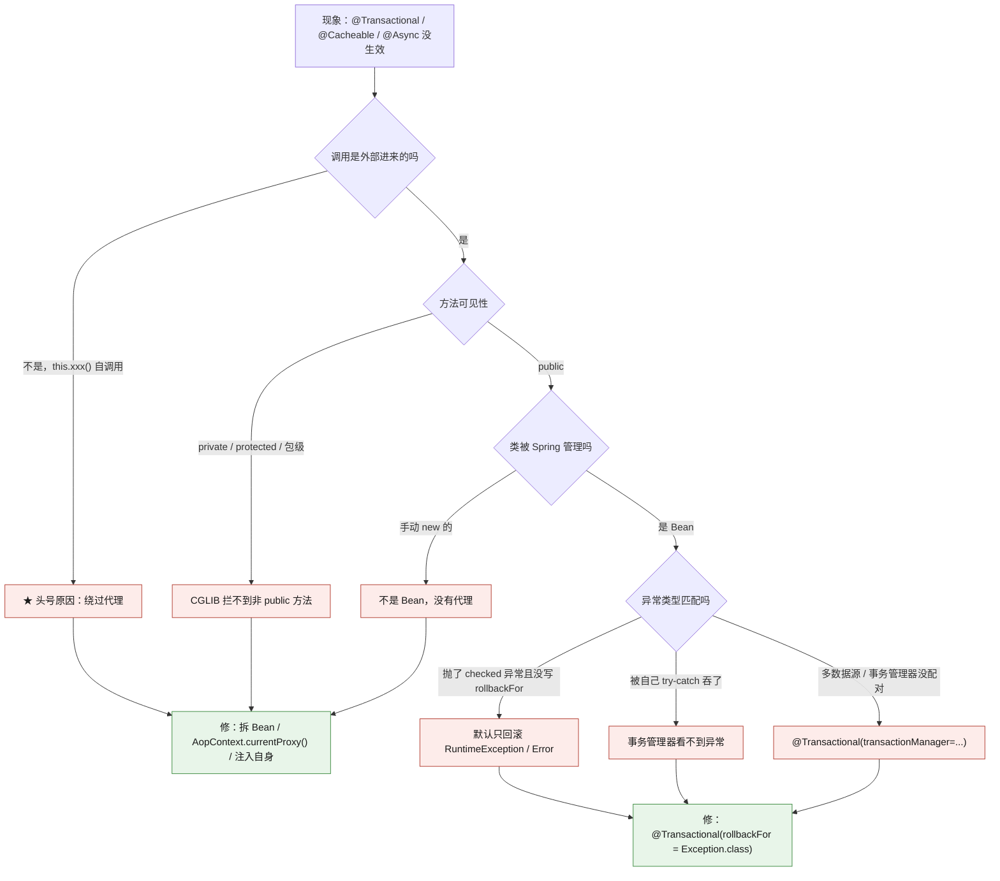
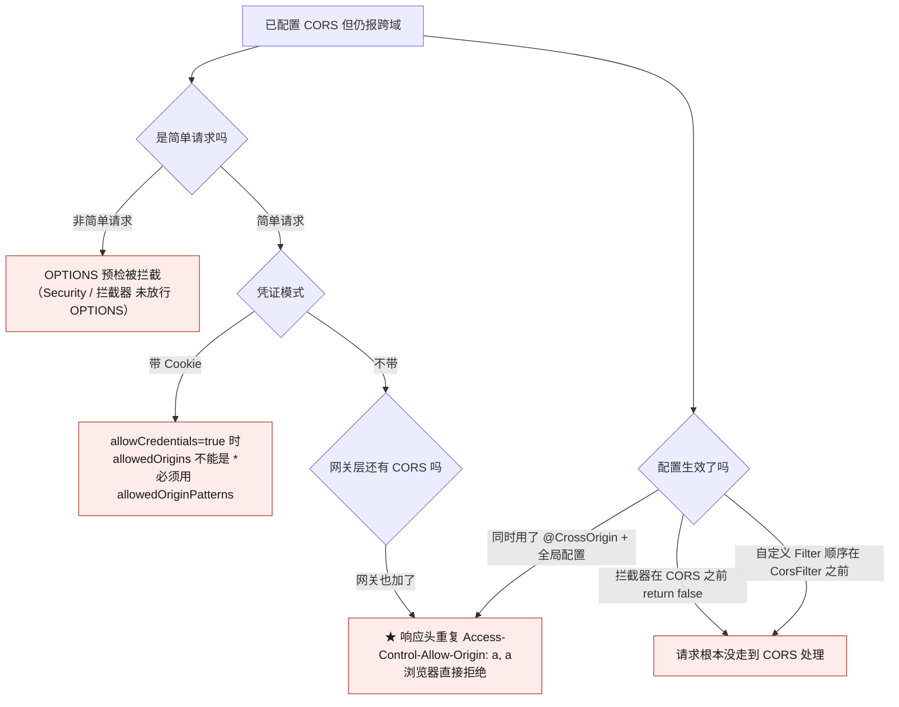
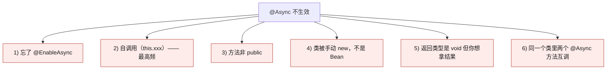
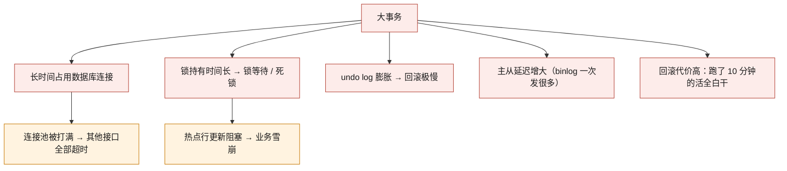
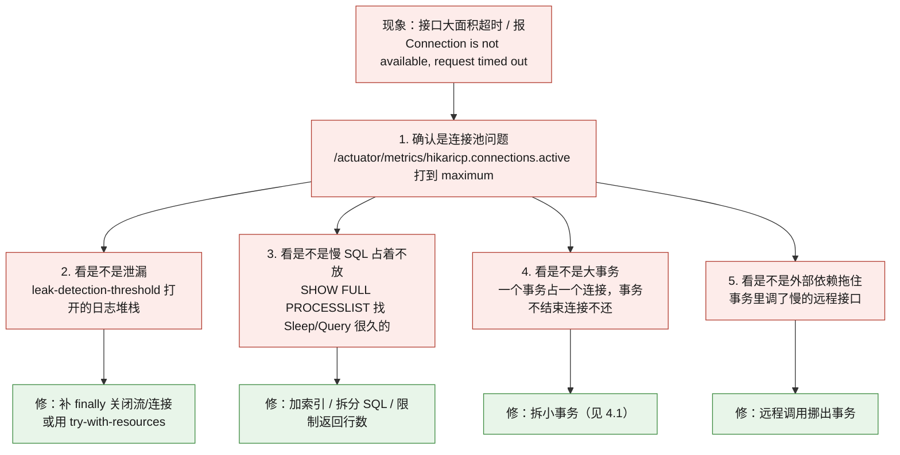
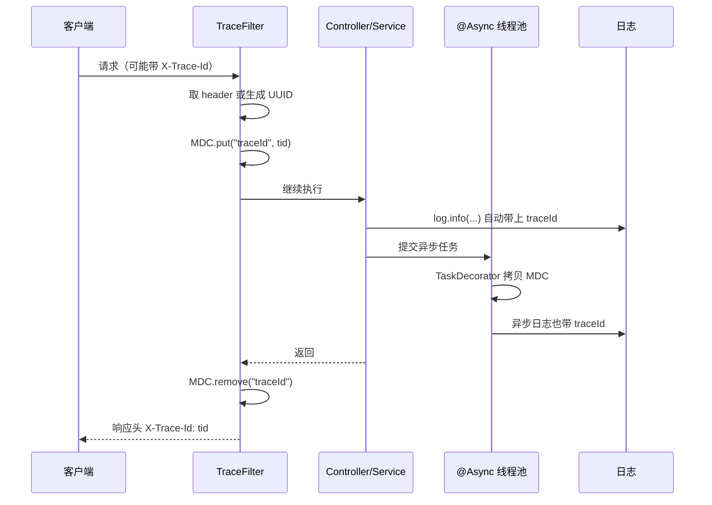
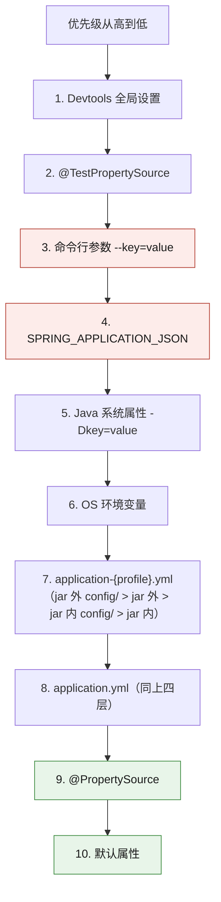

# 🧰 八、Spring 实战与踩坑手册

> 返回 [[0-Spring总览]] · 上一篇 [[7-Spring进阶专题]] · 速答骨架 [[面试准备/技术面试题库/13-Spring源码专题]]
>
> 这是**手册**，不是教程。每个条目都是同一个格式：**现象 → 原因 → 定位 → 解决**。
> 用法：出事的时候按关键词直接搜；面试的时候按「现象—根因—验证—治理」四步讲，比背概念高一档。
>
> [!abstract] 为什么负责人要背这份手册
> 面试 **AI 应用开发总监 / 技术负责人** 时，面试官关心的是"**线上出过什么事，你怎么定位的，最后怎么治的**"。
> 会背"三级缓存"是基本功；能说清"**连接池打满我是从 HikariCP 的 `activeConnections` 指标 + `SHOW PROCESSLIST` 定位到某段代码忘了关流**"才是负责人。
>
> [!info] 姊妹篇
> **原理与正确用法**（扩展点全景、`@Async`、缓存抽象、定时任务、线程安全）见 [[7-Spring进阶专题]]。

---

## 一、排查总纲：四步法



> [!tip] 第一条铁律：**永远先看 `Caused by` 的最底层**
> Spring 的异常是**层层包装**的。你看到的 `BeanCreationException` 只是"创建 xxx 时出错"，真正的根因在最底下的 `Caused by`。
> 常见包装链：`BeanCreationException` → `BeanInstantiationException` → `NoSuchMethodException`；或者 `BeanCreationException` → `UnsatisfiedDependencyException` → `NoSuchBeanDefinitionException`。

---

## 二、启动阶段问题

### 2.1 `BeanCreationException` / `NoSuchBeanDefinitionException`



**排查顺序（照做）：**

| 步骤 | 动作 |
|---|---|
| 1 | 日志里搜 `Caused by`，**看最后一条** |
| 2 | 搜 `Bean with name 'xxx'`，确认是**哪个 Bean** |
| 3 | 该 Bean 所在包是否在 `@SpringBootApplication` 的**扫描路径之下**？（启动类默认只扫**自己所在包及子包**） |
| 4 | 用 `--debug` 或 `/actuator/conditions` 看**自动装配报告**（见 §八） |
| 5 | `mvn dependency:tree` 看**依赖冲突 / 版本不一致** |
| 6 | 本地在 `AbstractAutowireCapableBeanFactory#createBean` 打断点，看调用栈 |

```java
// 扫描路径的经典坑：启动类放太深
// com.example.demo.DemoApplication  →  只扫 com.example.demo.**
// 而你的 Service 在 com.example.service  →  ❌ 扫不到

// ✅ 显式放宽扫描范围
@SpringBootApplication(scanBasePackages = "com.example")
public class DemoApplication { }
```

### 2.2 同类型多个 Bean 冲突（`NoUniqueBeanDefinitionException`）

**现象：**

```
NoUniqueBeanDefinitionException: No qualifying bean of type 'com.x.PayService' available:
expected single matching bean but found 2: alipayService,wechatPayService
```

**三种解法（按推荐度）：**

| 解法 | 写法 | 适用 |
|---|---|---|
| **`@Qualifier` 显式指定**（★首选） | `@Qualifier("alipayService") PayService pay;` | 调用方明确知道要哪个；**最不容易误伤** |
| `@Primary` | 在被选 Bean 上加 `@Primary` | 有明确的"默认实现"，大多数场景用默认 |
| `@Bean` 方法名指定 | `private final PayService alipayService;`（**按字段名匹配 Bean 名**） | 名字刚好一致才行，**不直观，别依赖** |

```java
// ✅ 更稳的工程做法：用 Map 注入，把策略选择显式化
@Service
public class PayServiceRouter {
    private final Map<String, PayService> registry;   // key = Bean 名

    public PayServiceRouter(Map<String, PayService> registry) { this.registry = registry; }

    public PayService route(String channel) {
        PayService s = registry.get(channel + "Service");
        if (s == null) throw new BizException("不支持的支付渠道: " + channel);
        return s;
    }
}

// 上下文中注册了 alipayService / wechatPayService → registry 自动是 {alipayService:..., wechatPayService:...}
// 注意：若 PayService 的实现上加了 @Primary，Map 注入仍然会拿到全部实现（不受 @Primary 影响）
```

> [!warning] `@Primary` 的隐蔽副作用
> `@Primary` 影响的是**按类型注入**时的选择。如果你某天加了第三个实现想让 `Map` 注入拿到它，但忘了 `@Primary` 已经改过——**按类型注入的地方会悄悄换实现**，且没有编译错误。
> **结论：优先 `@Qualifier`，`@Primary` 只用在真正有"默认语义"的地方。**

### 2.3 循环依赖报错（Boot 2.6+）

**现象：**

```
The dependencies of some of the beans in the application context form a cycle:
┌─────┐
|  orderService defined in file [...]
↑     ↓
|  stockService defined in file [...]
└─────┘
Action:
  Relying upon circular references is discouraged and they are prohibited by default.
  Update your application to remove the dependency cycle between beans.
  As a last resort, it may be possible to break the cycle automatically by setting
  spring.main.allow-circular-references=true.
```

> [!danger] 面试正解：**重构，而不是打开开关**
> `spring.main.allow-circular-references=true` 只是把问题**藏起来**：
> - 打开后走三级缓存提前暴露，**`@Async` / `@Transactional` 场景可能拿到未代理的原始对象** → AOP 静默失效；
> - 说明这两个类**职责耦合**，随着业务增长环会越来越粗，最后变成不可维护的"大泥球"。
> **说得出"我选择重构"是负责人分水岭。** 只答"加个开关"会被判定为背题。

```java
// ❌ 环：OrderService → StockService → OrderService（Stock 只是要回调 Order 的一个动作）
// ✅ 解环：把"被回调的动作"抽成独立 Bean，依赖变单向

public interface OrderPaidCallback {          // 第三个 Bean，双方都只依赖抽象
    void onPaid(Long orderId);
}

@Service
public class OrderService implements OrderPaidCallback {
    private final StockService stockService;   // → 只依赖 Stock
    @Override public void onPaid(Long orderId) { /* ... */ }
}

@Service
public class StockService {
    private final OrderPaidCallback callback;  // → 只依赖 Callback，不再依赖 OrderService
}
```

**其他解环手段（次选，知道就行）：**

| 手段 | 说明 | 何时用 |
|---|---|---|
| `@Lazy` | 注入代理，首次调用才真正解析 | 应急；环还在，只是不报错了 |
| `ApplicationEventPublisher` | 把同步回调改成事件 | 回调是"通知"语义时最优雅 |
| `ObjectProvider<T>` | 延迟获取 | 只在少数路径需要那个依赖时 |
| 重构抽第三类 | **根治** | 默认选它 |

> 📖 **三级缓存源码、完整时序推演、为什么是三级不是两级、边界与特例、`@Async` + 循环依赖，全部见 [[面试准备/技术面试题库/14-Spring循环依赖专题]]。**

### 2.4 `Failed to configure a DataSource`

**现象：**

```
Failed to configure a DataSource: 'url' attribute is not specified and no embedded datasource
could be configured.
Reason: Failed to determine a suitable driver class
```

**根因：** 引了 `spring-boot-starter-data-jpa` / `mybatis-spring-boot-starter` / `spring-boot-starter-jdbc`，触发了 `DataSourceAutoConfiguration`，**但你没有配数据源**。

| 场景 | 解决 |
|---|---|
| 确实不需要数据库 | **排除自动装配**（下面两种写法） |
| 只是漏配了 | 补 `spring.datasource.url/username/password/driver-class-name` |
| 配置在别的 profile 里 | `spring.profiles.active` 搞错了（见 2.6） |
| 配置项名字写错 | `spring.datasource.url` 不是 `spring.datasource.jdbc-url`（Hikari 专用名除外） |

```java
// 方式一：注解排除（最常用）
@SpringBootApplication(exclude = { DataSourceAutoConfiguration.class })
public class App { }

// 方式二：配置排除（不用改代码，多模块场景更灵活）
// spring.autoconfigure.exclude=org.springframework.boot.autoconfigure.jdbc.DataSourceAutoConfiguration
```

### 2.5 端口占用

```
Web server failed to start. Port 8080 was already in use.
```

```bash
# 定位
lsof -i :8080                    # macOS / Linux
netstat -ano | grep 8080         # Windows
ps -ef | grep <PID>              # 看看是什么进程

# 处理
kill -15 <PID>                   # 优雅停；别一上来 kill -9
```

**若排查后仍要启动：**
- 临时改端口：`--server.port=8081`（命令行优先级最高）
- 但也可能是**上一次没杀干净**（`kill -9` 后端口还没释放，`TIME_WAIT`）——等 30s 或换端口。

> [!warning] IDEA 里"端口被自己占用"
> IDEA 有时会**启动两个实例**（一个是上次没停干净，一个是 Run 又起了一个）。
> 看 IDEA 的 Services 面板，确认只有一个是 Running。

### 2.6 配置文件没生效 / profile 搞错

**现象：** "我明明改了 `application-prod.yml`，为什么没生效？"

> [!important] 配置优先级（从高到低，只列最常用的）
> 1. **命令行参数**（`--server.port=8081`）
> 2. `SPRING_APPLICATION_JSON`（环境变量里的 JSON）
> 3. `ServletConfig` / `ServletContext` 参数
> 4. **JNDI**
> 5. **Java 系统属性**（`-Dserver.port=8081`）
> 6. **OS 环境变量**（`SERVER_PORT`）
> 7. `application-{profile}.yml`（**profile 专属**，优先于下面）
> 8. `application.yml`
> 9. `@PropertySource`
> 10. 默认属性（`SpringApplication.setDefaultProperties`）
>
> 另外**外部 `config/` 目录 > 外部当前目录 > classpath `config/` > classpath 根目录**。
> 详见 [[6-SpringBoot自动装配]]。

**排查清单：**

| 检查 | 命令 / 做法 |
|---|---|
| 当前激活的是哪个 profile？ | `/actuator/env` 搜 `activeProfiles`；或启动日志的 `The following 1 profile is active: "prod"` |
| 配置到底来自哪个文件？ | `/actuator/env` 会列出**每个属性的来源**（这是最好用的工具） |
| IDEA 里配了 profile 吗？ | Run Configuration → Active profiles（**常常是这里覆盖了**） |
| 打包后配置文件进 jar 了吗？ | `jar tf app.jar \| grep application` |
| 是不是被环境变量覆盖了？ | `env \| grep -i spring` / `env \| grep SERVER_` |

```java
// 想看"某个属性最终生效值 + 来自哪里"：注入 Environment 打印
@Component
public class ConfigDumper implements ApplicationRunner {
    private final ConfigurableEnvironment env;
    public ConfigDumper(ConfigurableEnvironment env) { this.env = env; }

    @Override public void run(ApplicationArguments args) {
        // PropertySource 列表按优先级排列
        env.getPropertySources().forEach(ps ->
            System.out.println(ps.getName()));   // 实际项目请用 log
    }
}
```

---

## 三、运行时问题

### 3.1 AOP / 事务失效



**怎么验证"代理到底有没有生效"：**

```java
@Service
@Slf4j
public class OrderService implements InitializingBean {
    @Override
    public void afterPropertiesSet() {
        // 最直接的验证
        log.info("isAopProxy={}, isCglibProxy={}, class={}",
                AopUtils.isAopProxy(this),
                AopUtils.isCglibProxy(this),
                this.getClass().getName());
        // 代理生效时 class 形如 OrderService$$SpringCGLIB$$0
    }

    @Transactional
    public void outer() {
        log.info("内部 this 指向: {}", this.getClass());   // 打印出来是原始类 → 说明自调用确实绕过了代理
        this.inner();                                     // ❌ 失效
    }

    @Transactional(propagation = Propagation.REQUIRES_NEW)
    public void inner() { }
}
```

| 修法 | 写法 | 取舍 |
|---|---|---|
| **拆到另一个 Bean**（★首选） | `otherService.inner()` | 结构最清晰，无魔法 |
| 注入自身 | `@Autowired private OrderService self; self.inner();` | 能用，但要小心循环依赖 |
| `AopContext.currentProxy()` | `((OrderService) AopContext.currentProxy()).inner()` | 需要 `@EnableAspectJAutoProxy(exposeProxy = true)`，有性能开销 |
| 编程式事务 | `transactionTemplate.execute(...)` | 最可控，适合细粒度控制 |

> 原理见 [[3-AOP原理与实战]]、[[4-声明式事务]]；扩展点视角见 [[7-Spring进阶专题]]。

> [!danger] `@Transactional` 失效的隐藏项：**方法被 `final` / `static` 修饰**
> CGLIB 靠**继承 + 覆写**生成代理，`final` 方法无法被覆写 → **事务静默失效**。同理还有类被 `final` 修饰。

### 3.2 406 / 415 / 乱码

| 状态码 | 含义 | 常见根因 | 解决 |
|---|---|---|---|
| **406** Not Acceptable | 服务端**产不出**客户端要的类型 | 接口返回对象但没配 `MappingJackson2HttpMessageConverter`（缺 `jackson-databind`）；或 `produces` 写死成了 `text/plain` | 加依赖 / 修正 `produces` / 检查 `Accept` 头 |
| **415** Unsupported Media Type | 服务端**不支持**请求的 Content-Type | 前端发了 `text/plain` 但用了 `@RequestBody`（需要 `application/json`）；或没引 Jackson | 前端加 `Content-Type: application/json` |
| **乱码** | 编码不一致 | 响应没设 `charset=UTF-8`；`StringHttpMessageConverter` 默认 ISO-8859-1 | `server.servlet.encoding.charset=UTF-8` + `force=true` |
| **400** | 参数格式错 | JSON 类型不匹配 / `LocalDateTime` 格式不认 | 见 3.3 |

```yaml
# 一次性治理编码
server:
  servlet:
    encoding:
      charset: UTF-8
      enabled: true
      force: true          # ★ force=true 才会强制覆盖默认的 ISO-8859-1
```

```java
// 406 的一种隐蔽成因：自定义了 Converter 但顺序不对
@Configuration
public class WebConfig implements WebMvcConfigurer {
    @Override
    public void configureMessageConverters(List<HttpMessageConverter<?>> converters) {
        // ⚠️ configureMessageConverters 会【替换】默认列表，导致 Jackson 没了 → 406
        // ✅ 应该用 extendMessageConverters（追加），或把默认的加回来
    }

    @Override
    public void extendMessageConverters(List<HttpMessageConverter<?>> converters) {
        // ✅ 安全：在默认列表上做增删
    }
}
```

### 3.3 `LocalDateTime` 格式 / `Long` 精度丢失

**现象 A：** 前端拿到的时间是 `[2026,10,10,12,0,0]` 或 `1696900000000`，或者**反序列化直接 400**。

```
JSON parse error: Cannot deserialize value of type `java.time.LocalDateTime` from String "2026-10-10 12:00:00"
```

**现象 B（★极其高频）：** 订单号 `1234567890123456789` 到了前端变成 `1234567890123456800`——**JS 的 `Number` 只有 53 位精度，雪花 ID / 大 Long 必丢精度**。

> [!important] 这是很实战的加分点：**所有可能超 2^53 的数字，一律序列化成 String**
> 全局配置一次，胜过在每个字段上加注解（容易漏）。

```java
@Configuration
public class JacksonConfig {

    @Bean
    public Jackson2ObjectMapperBuilderCustomizer jacksonCustomizer() {
        return builder -> {
            // 1) Long / long → String，根治精度丢失
            builder.serializerByType(Long.class, ToStringSerializer.instance);
            builder.serializerByType(Long.TYPE, ToStringSerializer.instance);
            // 若只针对特定注解，可用 @JsonSerialize(using = ToStringSerializer.class)

            // 2) 时间格式：日期用 yyyy-MM-dd，时间用 yyyy-MM-dd HH:mm:ss
            builder.simpleDateFormat("yyyy-MM-dd HH:mm:ss");
            builder.serializers(new LocalDateTimeSerializer(
                    DateTimeFormatter.ofPattern("yyyy-MM-dd HH:mm:ss")));
            builder.deserializers(new LocalDateTimeDeserializer(
                    DateTimeFormatter.ofPattern("yyyy-MM-dd HH:mm:ss")));
            builder.serializers(new LocalDateSerializer(DateTimeFormatter.ofPattern("yyyy-MM-dd")));
            builder.deserializers(new LocalDateDeserializer(DateTimeFormatter.ofPattern("yyyy-MM-dd")));

            // 3) 忽略未知字段（前端多加字段不至于 400）——按团队规范决定
            builder.featuresToDisable(DeserializationFeature.FAIL_ON_UNKNOWN_PROPERTIES);
            // 4) 不把日期序列化成时间戳数组
            builder.featuresToDisable(SerializationFeature.WRITE_DATES_AS_TIMESTAMPS);
            // 5) null 不输出（按需）
            // builder.serializationInclusion(JsonInclude.Include.NON_NULL);
        };
    }
}
```

> [!warning] 全局 `Long → String` 的副作用（必须知道）
> 好处不用说了。副作用有两个：
> 1. **反序列化**：前端传 `"123"`（字符串）给 `Long` 字段，Jackson **默认能自动转**（`ACCEPT_EMPTY_STRING_AS_NULL_OBJECT` 等行为视版本），但传 `""` 会炸 —— 需要显式处理。
> 2. **`@RequestBody` 里前端传数字也 OK**，但**接口文档（Swagger）要同步标注成 string**，否则前端联调会踩坑。
>
> **折中方案**：只给"ID 类字段"加 `@JsonSerialize(using = ToStringSerializer.class)`，而不是全局。**但全局更不容易漏**——团队自己权衡。

| 需求 | 写法 |
|---|---|
| 单个字段定制格式 | `@JsonFormat(pattern = "yyyy-MM-dd HH:mm:ss", timezone = "GMT+8")` |
| 单个字段转 String | `@JsonSerialize(using = ToStringSerializer.class)` |
| 全局定制 | `Jackson2ObjectMapperBuilderCustomizer`（★推荐，Spring Boot 官方扩展点） |
| 完全替换 ObjectMapper | 直接 `@Bean ObjectMapper`（**会丢掉 Boot 的默认配置，不推荐**） |
| 入参不区分大小写 | `builder.featuresToEnable(MapperFeature.ACCEPT_CASE_INSENSITIVE_PROPERTIES)` |

> [!danger] 别直接 `new ObjectMapper()` 替换 Boot 的
> 自己 `@Bean public ObjectMapper objectMapper()` 会**覆盖** Boot 自动配置的那个，导致 `JavaTimeModule`、`ParameterNamesModule` 等默认模块丢失，出现一堆序列化怪问题。
> **正解：用 `Jackson2ObjectMapperBuilderCustomizer` 在默认配置上做增量修改。**

### 3.4 跨域还报错



**五种真实原因（按出现频率）：**

| # | 原因 | 定位 | 解决 |
|---|---|---|---|
| 1 | **网关 + 应用都加了 CORS** → 响应头重复 | 看响应头有没有两个 `Access-Control-Allow-Origin` | **只在一层加**（推荐网关层） |
| 2 | `allowCredentials(true)` + `allowedOrigins("*")` | 控制台报 `When allowCredentials is true, allowedOrigins cannot contain the special value "*"` | 改用 `allowedOriginPatterns("*")` |
| 3 | **OPTIONS 预检被 Security / 拦截器拦了** | 预检请求返回 401/403 | Security 放行 `OPTIONS`：`.antMatchers(HttpMethod.OPTIONS).permitAll()` |
| 4 | **拦截器 `preHandle` 返回 false** | 预检请求没到 CORS 处理器 | 在拦截器最前面 `if (CorsUtils.isPreFlightRequest(request)) return true;` |
| 5 | 同时用 `@CrossOrigin` 和全局 `WebMvcConfigurer#addCorsMappings` | 头重复 | 二选一 |

```java
// ✅ 推荐：统一一个 CorsFilter，放最前面
@Bean
public CorsFilter corsFilter() {
    CorsConfiguration c = new CorsConfiguration();
    c.setAllowedOriginPatterns(List.of("*"));      // ★ 用 Patterns，兼容 allowCredentials
    c.setAllowedMethods(List.of("GET","POST","PUT","DELETE","OPTIONS"));
    c.setAllowedHeaders(List.of("*"));
    c.setAllowCredentials(true);
    c.setMaxAge(3600L);                            // 预检结果缓存 1 小时，减少 OPTIONS 请求
    UrlBasedCorsConfigurationSource src = new UrlBasedCorsConfigurationSource();
    src.registerCorsConfiguration("/**", c);
    return new CorsFilter(src);
}
```

### 3.5 `@RequestBody` 读不到参数

| 现象 | 根因 | 解决 |
|---|---|---|
| 参数全是 `null` | Content-Type 是 `text/plain` / `application/x-www-form-urlencoded` | 前端改 `application/json`；或用 `@RequestParam` 接收表单 |
| 抛 `Required request body is missing` | 用了 GET 请求带 body（部分客户端会丢掉） | 改用 POST |
| `HttpMessageNotReadableException` | JSON 类型不匹配（传字符串给数字）/ 字段名不一致 | 对齐字段名；加 `@JsonProperty` |
| **读了一次就空了** | `InputStream` / `Reader` **只能读一次**；被 Filter/拦截器提前消费 | 用 `ContentCachingRequestWrapper` 包装，或把参数放到 `ThreadLocal` |
| 自定义 Filter 里读了 body | 同上 | 见下 |

```java
// ✅ 需要在 Filter 里读 body（比如做签名校验）时：缓存请求体
@Component
public class BodyCachingFilter extends OncePerRequestFilter {
    @Override
    protected void doFilterInternal(HttpServletRequest req, HttpServletResponse resp,
                                    FilterChain chain) throws ServletException, IOException {
        ContentCachingRequestWrapper wrapped = new ContentCachingRequestWrapper(req);
        chain.doFilter(wrapped, resp);
        // 读完之后再取（注意：只有在 body 被下游读过之后 getContentAsByteArray 才有内容）
        byte[] body = wrapped.getContentAsByteArray();
    }
}

// 或者在 Controller 里直接拿（Spring 已经缓存）
@PostMapping("/callback")
public String cb(@RequestBody String rawBody) { return rawBody; }
```

> [!tip] `@RequestBody` vs `@RequestParam` vs `@ModelAttribute`
> - `@RequestBody`：读**请求体**，靠 `HttpMessageConverter`（JSON），**只能有一个**。
> - `@RequestParam`：读 **query string 或表单**，可多个。
> - `@ModelAttribute`：把表单字段**按名字绑到对象属性**，不读 JSON 体。
> - **`@RequestBody` 和 `@RequestParam` 可以同时用**（一个读体，一个读 query）。

### 3.6 文件上传：大小限制 / 临时目录 / 大文件 OOM

```yaml
spring:
  servlet:
    multipart:
      max-file-size: 50MB          # 单个文件
      max-request-size: 100MB      # 整个请求（多文件之和）
      file-size-threshold: 2MB     # ★ 超过这个大小才写磁盘；小于它全在内存
      location: /data/tmp/upload   # ★ 临时目录，默认是系统 tmp
```

| 现象 | 根因 | 解决 |
|---|---|---|
| `MaxUploadSizeExceededException` | 超过 `max-file-size` | 调大配置 + **全局异常处理返回友好提示** |
| 请求根本进不到 Controller（413） | **Nginx 的 `client_max_body_size` 更小** | 同步调 Nginx（默认只有 1M！） |
| `java.io.IOException: The temporary upload location ... is not valid` | 系统 `/tmp` 被清理（**容器里常见**） | 显式配 `location` 到持久卷 |
| **大文件 OOM** | 用了 `MultipartFile#getBytes()` 把整个文件读进内存 | 用 `getInputStream()` **流式**处理 |
| 上传慢 / 超时 | 同步落盘 + 同步处理 | 落 OSS/MinIO 后异步处理 |

```java
// ❌ 大文件 OOM 元凶
byte[] bytes = file.getBytes();                       // 100MB 文件 → 100MB 堆内存 × 并发数
Files.write(path, bytes);

// ✅ 流式拷贝
try (InputStream in = file.getInputStream();
     OutputStream out = Files.newOutputStream(target)) {
    in.transferTo(out);                               // 8KB 缓冲，堆占用恒定
}

// ✅ 超大文件：分片上传 + 前端直传 OSS
```

> [!warning] `file-size-threshold` 的隐藏风险
> 默认阈值很小（Spring Boot 默认让 Tomcat 处理）。如果设得**很大**（比如 100MB），那么每个并发上传请求都会在**堆里**占用最多 100MB → **并发 20 个就 OOM**。
> **正确做法：阈值调小（1~2MB），大文件一律走磁盘临时目录 + 流式处理。**

### 3.7 `@Async` 不生效 / 线程池打满 / TraceId 丢失



**线程池打满的现象与定位：**

| 现象 | 定位手段 |
|---|---|
| 接口变慢、异步任务不执行 | `/actuator/metrics/executor.active`、`executor.queued`（需先注册 `ExecutorMetricsAutoConfiguration`） |
| 日志里线程名暴涨 | 线程名前缀（如 `biz-async-`）→ `jstack` 数一下数量 |
| CPU 飙高但 QPS 不高 | `jstack` 看是不是大量线程在**创建/销毁**（用了 `SimpleAsyncTaskExecutor`） |
| 内存涨 | 队列无界 → 任务堆在 `LinkedBlockingQueue` 里 |

> [!danger] `@Async` 不指定线程池 = `SimpleAsyncTaskExecutor` = 每次 `new Thread()`
> 高并发下线程数失控，直接 `OutOfMemoryError: unable to create new native thread`。
> **生产必须自定义线程池。** 见 [[7-Spring进阶专题]] §5。

**TraceId / MDC 透传的完整骨架（`TaskDecorator` 方案）：**

```java
public class MdcTaskDecorator implements TaskDecorator {
    @Override
    public Runnable decorate(Runnable task) {
        // 捕获「提交任务的那个线程」的上下文
        Map<String, String> callerCtx = MDC.getCopyOfContextMap();
        SecurityContext secCtx = SecurityContextHolder.getContext();   // 按需

        return () -> {
            Map<String, String> old = MDC.getCopyOfContextMap();
            SecurityContext oldSec = SecurityContextHolder.getContext();
            try {
                if (callerCtx != null) MDC.setContextMap(callerCtx);
                SecurityContextHolder.setContext(secCtx);
                task.run();
            } finally {
                // ★ 线程是复用的，必须还原，否则会串到下一个任务
                if (old != null) MDC.setContextMap(old); else MDC.clear();
                SecurityContextHolder.setContext(oldSec);
            }
        };
    }
}
```

| 方案 | 优点 | 缺点 |
|---|---|---|
| `TaskDecorator`（上面这个） | 简单、可控、无额外依赖 | 只覆盖**自己配置的**线程池；线程池内部再提交（嵌套）需再包一层 |
| `TransmittableThreadLocal`（阿里 TTL） | 自动透传，**支持线程池复用** | 需 `TtlExecutors.getTtlExecutorService(...)` 包装；注意与 `InheritableThreadLocal` 的区别 |
| `InheritableThreadLocal` | JDK 原生 | ⚠️ **只在线程创建时复制**，线程池复用后完全失效（**最常见的错误答案**） |

### 3.8 定时任务重复执行 / 单线程阻塞

| 现象 | 根因 | 定位 | 解决 |
|---|---|---|---|
| 任务"没跑" | **单线程被前一个任务阻塞** | 看线程名 `scheduling-1` 的栈 | 配 `ThreadPoolTaskScheduler(poolSize>1)`，见 [[7-Spring进阶专题]] §7 |
| 任务执行了 N 次 | 多实例都跑了 | 数一下日志里同一时间点的执行记录 | 分布式锁 / 调度平台（[[7-分布式/3-分布式锁]]） |
| 同一任务并发跑了两份 | `fixedRate` + 线程池 > 1 | 日志中两次执行时间重叠 | 改 `fixedDelay` 或加锁 |
| 任务在"错误的时间"跑 | **cron 没写 `zone`**，容器是 UTC | `date` 看容器时区 | `zone = "Asia/Shanghai"` |
| 任务执行一半应用重启 | 无优雅停机 | — | `setWaitForTasksToCompleteOnShutdown(true)` |

```java
// 应急止血：先干掉重复执行（分布式锁版本的骨架）
@Scheduled(cron = "0 0 2 * * ?", zone = "Asia/Shanghai")
public void dailySettle() {
    String key = "job:dailySettle:" + LocalDate.now();
    Boolean got = redis.opsForValue().setIfAbsent(key, "1", Duration.ofHours(6));
    if (!Boolean.TRUE.equals(got)) return;         // 没抢到，本实例跳过

    try {
        doSettle();
    } catch (Exception e) {
        redis.delete(key);                          // ★ 失败要放锁，允许重试
        throw e;
    }
    // ⚠️ 成功不删：靠 TTL 过期。否则多实例会在同一秒内接力重复执行
}
```

> [!important] 但最终防线是**幂等**
> 锁只能防"同一时刻并发"。**重跑、重试、人工执行**都会重复。
> 业务幂等（唯一索引 / 状态机 / 幂等表）才是根治。见 [[7-分布式/2-分布式事务]]。

---

## 四、性能与资源问题

### 4.1 大事务的危害与治理



> [!danger] 大事务最典型的"三步走"事故
> 事务里**调远程接口 / 发 MQ / 处理大批数据** → 事务持续几十秒 → 连接池被占满 → **整个服务不可用**。
> 而且这类代码常常在测试环境完全正常（数据量小、远程快），**上生产才炸**。

**❌ 典型错误写法：**

```java
@Transactional(rollbackFor = Exception.class)
public void syncOrders(List<Long> ids) {
    for (Long id : ids) {                       // 循环 1 万条
        Order o = remoteClient.fetch(id);       // ❌ 事务里调远程（可能 100ms × 10000 = 16 分钟）
        orderMapper.insert(o);                  // ❌ 逐条 insert（N 次网络往返）
        mqTemplate.send("order.sync", o);       // ❌ 事务里发 MQ
    }
}
```

**✅ 治理后的写法：**

```java
public void syncOrders(List<Long> ids) {
    // 1) 事务外做远程调用和组装（最耗时的一步挪出去）
    List<Order> orders = ids.parallelStream()
            .map(remoteClient::fetch)
            .filter(Objects::nonNull)
            .toList();

    // 2) 短事务 + 批量写
    for (List<Order> batch : Lists.partition(orders, 500)) {
        self.batchInsert(batch);                // 注入自身或提到另一个 Bean，保证事务生效
    }

    // 3) 事务提交后再发 MQ（事务事件）
    publisher.publishEvent(new OrdersSyncedEvent(ids));
}

@Transactional(rollbackFor = Exception.class)
public void batchInsert(List<Order> batch) {
    orderMapper.batchInsert(batch);             // 一条 SQL 插 500 条
}
```

**📋 大事务自查清单：**

| # | 自查项 | 合格标准 |
|---|---|---|
| ☐ | 事务里有没有**远程调用**（HTTP / RPC / Redis 大操作）？ | 必须挪到事务外 |
| ☐ | 事务里有没有**发 MQ**？ | 用 `@TransactionalEventListener(AFTER_COMMIT)` |
| ☐ | 事务里有没有**循环查库 / 循环写库**？ | 改批量 SQL（`IN` / `batchInsert`） |
| ☐ | 有没有 `select` 了**全表 / 大结果集**再在内存里 for 循环更新？ | 分批（每批 ≤ 500），或改 `UPDATE ... WHERE` 直接改 |
| ☐ | 事务方法是不是**很长**（> 50 行）？ | 拆成"准备（无事务） + 落库（短事务） + 后续（事务后）" |
| ☐ | 有没有 `@Transactional` 加在**定时任务的整个循环**上？ | 每条一个短事务，或凑批 |
| ☐ | 有没有监控能看出慢事务？ | 加事务耗时埋点（AOP 环绕），超过阈值告警 |
| ☐ | **只读**操作是不是也开了写事务？ | `@Transactional(readOnly = true)`，能走只读库 |

```java
// 慢事务监控（很值得加，成本低、收益大）
@Aspect
@Component
@Slf4j
public class SlowTxAspect {
    @Around("@annotation(org.springframework.transaction.annotation.Transactional)")
    public Object around(ProceedingJoinPoint pjp) throws Throwable {
        long start = System.currentTimeMillis();
        try {
            return pjp.proceed();
        } finally {
            long cost = System.currentTimeMillis() - start;
            if (cost > 1000) {                    // 阈值按业务定
                log.warn("慢事务: {}#{}, 耗时 {}ms",
                        pjp.getTarget().getClass().getSimpleName(),
                        pjp.getSignature().getName(), cost);
            }
        }
    }
}
```

### 4.2 连接池配置与打满排查

**HikariCP 关键参数：**

| 参数 | 含义 | 建议 |
|---|---|---|
| `maximum-pool-size` | 最大连接数 | **默认 10**。不是越大越好（见下） |
| `minimum-idle` | 最小空闲 | 建议 = `maximum-pool-size`（避免频繁创建） |
| `connection-timeout` | **拿连接的超时** | 默认 30s。**建议 3~5s**（快速失败，别让请求线程干等） |
| `idle-timeout` | 空闲连接回收 | 默认 10min |
| `max-lifetime` | 连接最大存活 | **必须小于 DB 的 `wait_timeout`**（MySQL 默认 8h；建议 30min） |
| `leak-detection-threshold` | **连接泄漏检测**（★排查神器） | 设 20000（20s），日志会打出**泄漏处的堆栈** |
| `validation-timeout` | 连接有效性校验 | 默认 5s |

```yaml
spring:
  datasource:
    hikari:
      maximum-pool-size: 20
      minimum-idle: 20
      connection-timeout: 3000          # ★ 3s 快速失败，别用默认 30s
      idle-timeout: 600000
      max-lifetime: 1800000             # ★ 30min < MySQL wait_timeout
      leak-detection-threshold: 20000   # ★ 泄漏检测，排查完可以关掉
      pool-name: main-pool
```

> [!important] `maximumPoolSize` 到底怎么定？
> **别再背"核数 × 2"了。** 正确做法：
> 1. **连接数是瓶颈资源**（数据库的并发处理能力有限），不是越多越好；
> 2. PostgreSQL 官方给的公式：`connections = ((core_count * 2) + effective_spindle_count)`；
> 3. **实战方法**：从 10 开始压测，观察**等待时间（`connectionTimeout` 命中率）**和**数据库 CPU/IO**，
>    逐步加到"DB 成为瓶颈但应用不排队"的点；
> 4. 多实例情况：`单实例池大小 × 实例数 ≤ DB max_connections × 0.8`。
>    **4 个实例各配 50 → 200 连接，MySQL 默认 `max_connections=151`，直接就爆了。**

**连接池打满的完整排查路径：**



```sql
-- 找长时间运行的 / 卡住的 SQL
SHOW FULL PROCESSLIST;

-- 找当前运行超过 5 秒的
SELECT id, user, host, db, command, time, state, info
FROM information_schema.processlist
WHERE command <> 'Sleep' AND time > 5
ORDER BY time DESC;

-- 看连接数使用情况
SHOW STATUS LIKE 'Threads_connected';
SHOW VARIABLES LIKE 'max_connections';
```

**指标（Micrometer，Boot 自动注册）：**

| 指标 | 含义 | 告警建议 |
|---|---|---|
| `hikaricp.connections.active` | 正在被使用的连接 | > 80% `maximumPoolSize` 告警 |
| `hikaricp.connections.idle` | 空闲连接 | 长期为 0 说明池太小 |
| `hikaricp.connections.pending` | **等连接的线程数** | **> 0 就该告警！** 这是最灵敏的指标 |
| `hikaricp.connections.timeout` | 获取连接超时次数 | > 0 立即告警 |
| `hikaricp.connections.acquire` | 获取连接耗时 | P99 上升说明池不够 |

> [!tip] `pending > 0` 是连接池告警的"金指标"
> 它意味着**已经有线程在排队等连接了**。此时业务还没报错，但你已经在悬崖边上。
> **建议：`hikaricp_connections_pending > 0 持续 1 分钟` 就发告警。**

**连接泄漏的典型代码：**

```java
// ❌ 泄漏：Connection / Statement / ResultSet 没关
public void bad() throws Exception {
    Connection c = dataSource.getConnection();
    PreparedStatement ps = c.prepareStatement("select * from t");   // 异常就泄漏
    ResultSet rs = ps.executeQuery();
    // 没有 finally，没有 close
}

// ✅ try-with-resources，一定会关
public void good() throws Exception {
    try (Connection c = dataSource.getConnection();
         PreparedStatement ps = c.prepareStatement("select * from t");
         ResultSet rs = ps.executeQuery()) {
        // ...
    }
}
```

> [!warning] MyBatis / JPA 用户注意：连接"看起来"没泄漏也可能是泄漏
> 用了 ORM 后你不再手写 `close()`，但 **`SqlSession` 未关闭**（手动 `sqlSessionFactory.openSession()` 忘了 commit/close）、
> **流式查询（`ResultHandler` / `Cursor`）没消费完就返回**，都会占住连接。
> 这类问题**只有 `leak-detection-threshold` 的堆栈日志能定位**。

### 4.3 Spring 启动慢的排查

| 现象 | 根因 | 定位 | 解决 |
|---|---|---|---|
| 启动要 2 分钟+ | Bean 太多（扫描范围过大） | 启动日志搜 `Initializing Spring` 到 `Started App` 的耗时 | `scanBasePackages` 收窄；去掉无用的 starter |
| 卡在某个 Bean | `@PostConstruct` / `afterPropertiesSet` 做重活（预热缓存、拉全量数据） | `--debug` 看 Bean 创建顺序；arthas `trace` 初始化方法 | 把重活挪到**异步**或**懒加载**（`@Lazy`） |
| 卡在自动装配 | 某个 starter 的三方自动配置在扫类路径 | 看启动日志的 `Auto-configuration` 部分 | 排除不需要的自动装配 |
| 每个 Bean 创建都慢 | 大量 AOP 代理 / `BeanPostProcessor` 过多 | arthas `trace org.springframework.beans.factory.support.AbstractAutowireCapableBeanFactory createBean` | 精简切面 |
| 数据库连接池预热慢 | 启动时建立 N 个连接 | HikariCP 日志 | 按需调整 `minimum-idle` |

```java
// 打印每个 Bean 的创建耗时（排查启动慢的利器，临时加）
@Component
public class BeanCreationTimingBPP implements BeanPostProcessor {
    private final Map<String, Long> start = new ConcurrentHashMap<>();

    @Override
    public Object postProcessBeforeInitialization(Object bean, String name) {
        start.put(name, System.currentTimeMillis());
        return bean;
    }

    @Override
    public Object postProcessAfterInitialization(Object bean, String name) {
        Long s = start.remove(name);
        if (s != null && System.currentTimeMillis() - s > 200) {
            System.out.println("SLOW BEAN " + name + " = " + (System.currentTimeMillis() - s) + "ms");
        }
        return bean;
    }
}
```

**`spring.main.lazy-initialization=true` 的取舍：**

| 优点 | 风险（★必须知道） |
|---|---|
| 启动快很多（Bean 首次用到才创建） | **启动期的配置错误推迟到运行时才暴露**（比如 Bean 定义有误，可能上线后某接口第一次被调用才 500） |
| 开发环境体感好 | **首次请求变慢**（懒加载的 Bean 在首个请求创建，可能秒级延迟） |
| Spring Boot 2.2+ 支持 | **`@Lazy` 与循环依赖、AOP 的交互更复杂** |
| | **健康检查/预热的语义变了**（`SmartInitializingSingleton` 拿不到全部单例） |

```yaml
spring:
  main:
    lazy-initialization: true
  # ✅ 更精准的替代方案：只对"确实不需要启动就绪"的 Bean 加 @Lazy
```

> [!tip] 推荐策略
> **不要全局开 `lazy-initialization`。** 用 `@Lazy` **精确标注**那些启动成本高、又不需要启动就绪的 Bean（如报表服务、批处理组件）。
> 全局懒加载适合**开发环境**提速，生产用要非常谨慎——它会**把启动期错误变成运行期错误**。

### 4.4 内存与 GC 相关

| 现象 | 根因 | 定位 | 解决 |
|---|---|---|---|
| 老年代持续增长、Full GC 频繁 | **Bean 持有大对象**（`@PostConstruct` 里把全表加载进内存的静态 Map） | `jmap -histo:live` / MAT 找支配树 | 改懒加载 + 有上限的缓存；大对象别放成员变量 |
| OOM: Java heap space | **缓存无上限**（自己写的 `HashMap` 缓存） | heap dump 分析 | Caffeine（`maximumSize` + `expireAfterWrite`）或 Redis |
| OOM: Metaspace | 动态生成类太多（CGLIB 代理爆炸 / 热部署） | `-XX:MaxMetaspaceSize` 监控 | 减少 prototype + AOP 的组合；别在生产用 devtools |
| ClassLoader 泄漏 | ThreadLocal 未 remove / 静态集合持有 | MAT 看 `WebappClassLoader` 的 GC Root 路径 | `ThreadLocal.remove()`（见 [[7-Spring进阶专题]] §4.4） |
| GC 停顿抖动 | 堆太大 / 新生代太小 | GC 日志 | 调堆与 GC 参数 |

```java
// ❌ 经典 OOM：启动时把全表塞进内存
@Component
public class DictCache {
    private static final Map<String, Dict> CACHE = new HashMap<>();

    @PostConstruct
    public void init() {
        dictMapper.selectAll().forEach(d -> CACHE.put(d.getCode(), d));   // 表涨到 500 万行 → OOM
    }
}

// ✅ 有界缓存 + 懒加载
private final Cache<String, Dict> CACHE = Caffeine.newBuilder()
        .maximumSize(10_000)
        .expireAfterWrite(Duration.ofMinutes(30))
        .recordStats()                      // ★ 打开统计，能看命中率
        .build();

public Dict get(String code) {
    return CACHE.get(code, this::loadFromDb);   // 按需加载
}
```

> [!important] 缓存必须回答的四个问题
> 1. **容量上限**是多少？（`maximumSize`，没有上限就是定时炸弹）
> 2. **过期策略**是什么？（`expireAfterWrite` / `expireAfterAccess`）
> 3. **失效怎么保证一致性**？（本地缓存多实例不一致 → 用 Redis 或 MQ 广播失效）
> 4. **命中率**能观测吗？（`recordStats` + 暴露 metrics）
>
> JVM 层面的深入排查见 [[1-java/4-jvm/7-JVM故障排查实战]]。

---

## 五、日志与可观测性

### 5.1 日志规范（团队级红线）

| 规则 | 反例 | 正解 |
|---|---|---|
| **禁止 `System.out.println`** | `System.out.println("user=" + user)` | `log.info("user={}", user)` — `System.out` **无级别、无时间、无上下文、同步阻塞** |
| **异常必须打堆栈** | `log.error("失败: " + e.getMessage())` | `log.error("下单失败, orderId={}", orderId, e)` — **`e` 必须是最后一个参数且不带 `{}`** |
| **禁止在循环里打日志** | 10 万次循环里 `log.debug` | 计数后打一次汇总，或用 `if (log.isDebugEnabled())` |
| **禁止字符串拼接** | `log.info("a" + a + "b" + b)` | `log.info("a={} b={}", a, b)` — 拼接**无论级别都会执行** |
| **级别要用对** | 业务校验失败打 `error` | `ERROR`=需人工介入；`WARN`=异常但可自愈；`INFO`=关键业务节点；`DEBUG`=调试（生产默认关） |
| **关键链路要有 traceId** | — | 见 5.2 |
| **敏感信息脱敏** | `log.info("card={}", cardNo)` | 见 5.4 |
| **日志要有业务主键** | `log.error("支付失败")` | `log.error("支付失败, orderId={}, userId={}", ...)` — 没有主键的日志**没法排查** |

```java
// ❌ 三种错误打日志的方式
try { pay(); } catch (Exception e) {
    log.error("支付失败: " + e.getMessage());     // 1) 丢了堆栈，只剩一句话
    log.error("支付失败", e.getMessage());        // 2) 同上，而且 message 被当参数
    e.printStackTrace();                          // 3) 输出到 stderr，进不了日志文件
}

// ✅ 唯一正确写法
try { pay(orderId); } catch (Exception e) {
    log.error("支付失败, orderId={}, userId={}", orderId, userId, e);   // ★ 异常对象放最后
}
```

> [!warning] `log.error("xx: {}", e)` 是个经典事故
> 如果 `{}` 占位符数量不够，SLF4J 会把异常对象当成**普通参数**处理——**堆栈丢了**，只打出一行异常信息。
> **规则：异常对象永远作为最后一个参数，且不给它配 `{}` 占位符。**

### 5.2 MDC + TraceId 完整实现



```java
// 1) 过滤器：入口设置 traceId
@Component
@Order(Ordered.HIGHEST_PRECEDENCE)          // ★ 必须最先执行
public class TraceFilter extends OncePerRequestFilter {
    public static final String TRACE_ID = "traceId";
    public static final String HEADER = "X-Trace-Id";

    @Override
    protected void doFilterInternal(HttpServletRequest req, HttpServletResponse resp,
                                    FilterChain chain) throws ServletException, IOException {
        String tid = req.getHeader(HEADER);
        if (tid == null || tid.isBlank()) {
            tid = UUID.randomUUID().toString().replace("-", "");
        }
        MDC.put(TRACE_ID, tid);
        resp.setHeader(HEADER, tid);          // ★ 返回给前端，便于用户报障时提供
        try {
            chain.doFilter(req, resp);
        } finally {
            MDC.remove(TRACE_ID);             // ★ 必须清理（线程池复用）
        }
    }
}
```

```xml
<!-- 2) logback-spring.xml 的 pattern 里引用 MDC -->
<pattern>%d{yyyy-MM-dd HH:mm:ss.SSS} [%thread] %-5level [%X{traceId:-N/A}] %logger{36} - %msg%n</pattern>
```

> 完整的 Logback 配置（文件切分、异步 Appender、多环境）见 **[[LOGBACK_SETUP]]**。

```java
// 3) 异步透传（见 §3.7 的 MdcTaskDecorator），或 TTL 方案：
//    executor = TtlExecutors.getTtlExecutorService(rawExecutor);
//    TtlMDCAdapter 由 transmittable-thread-local 提供

// 4) Feign / RestTemplate 出站时把 traceId 带下去（否则跨服务断链）
@Bean
public RequestInterceptor traceIdFeignInterceptor() {
    return template -> {
        String tid = MDC.get(TraceFilter.TRACE_ID);
        if (tid != null) template.header(TraceFilter.HEADER, tid);
    };
}

// 5) MQ 出站：放进消息 header；消费端在监听器里 MDC.put 还原
```

| 环节 | 是否自动透传 | 要做什么 |
|---|---|---|
| 同一线程内 | ✅ | 只要 `MDC.put` |
| `@Async` / 线程池 | ❌ | `TaskDecorator` 或 TTL |
| HTTP 出站（Feign/RestTemplate） | ❌ | 拦截器塞 header |
| MQ 生产/消费 | ❌ | 消息 header 传递 + 消费端还原 |
| 定时任务 | ❌（根本没请求） | 任务开始自己生成一个 traceId |

> [!tip] 生产建议
> 跨进程的完整链路追踪，最终还是要上 **SkyWalking / Zipkin / OpenTelemetry**。
> 但 **MDC + traceId 是最低成本、最高收益的第一步**——先做这个，再谈 APM。

### 5.3 敏感信息脱敏

```java
// 日志脱敏：Logback 自定义 Converter 或 PatternLayout 里做替换
public class SensitiveConverter extends ClassicConverter {
    private static final Pattern PHONE = Pattern.compile("(1[3-9]\\d)\\d{4}(\\d{4})");
    private static final Pattern ID_CARD = Pattern.compile("(\\d{6})\\d{8}(\\d{4})");
    private static final Pattern CARD_NO = Pattern.compile("(\\d{4})\\d{8,11}(\\d{4})");

    @Override
    public String convert(ILoggingEvent event) {
        String msg = event.getFormattedMessage();
        msg = PHONE.matcher(msg).replaceAll("$1****$2");
        msg = ID_CARD.matcher(msg).replaceAll("$1********$2");
        msg = CARD_NO.matcher(msg).replaceAll("$1********$2");
        return msg;
    }
}
```

```java
// 接口出参脱敏：Jackson 自定义序列化器（比在 DTO 上手动 set 更不容易漏）
public class PhoneMaskSerializer extends JsonSerializer<String> {
    @Override
    public void serialize(String value, JsonGenerator gen, SerializerProvider p) throws IOException {
        gen.writeString(value == null ? null : value.replaceAll("(\\d{3})\\d{4}(\\d{4})", "$1****$2"));
    }
}

public class UserVO {
    @JsonSerialize(using = PhoneMaskSerializer.class)
    private String phone;
}
```

> [!danger] 必须脱敏的字段清单（做团队 code review 时对照）
> 手机号 / 身份证 / 银行卡 / 密码（**永远不打，连 debug 都不打**）/ token / 密钥 / 家庭住址 / 姓名（视合规要求）。
> **特别注意**：**请求日志里打印完整请求体**是最常见的泄漏源。建议用 AOP 统一处理，或干脆只打关键字段。

---

## 六、Spring Boot 配置与部署

### 6.1 配置优先级速查（贴墙上）



> **一句话记忆：命令行 > 环境变量 > profile 文件 > 默认文件。**
> 详细与自动装配的关系见 [[6-SpringBoot自动装配]]。

### 6.2 优雅停机（★必配）

```yaml
server:
  shutdown: graceful                       # ★ 开启优雅停机
spring:
  lifecycle:
    timeout-per-shutdown-phase: 30s        # ★ 每个阶段的等待上限
```

| 对比 | 默认（立即停机） | `graceful` |
|---|---|---|
| 正在处理的请求 | **直接被中断**，用户看到 502/连接重置 | 处理完再退出 |
| 新请求 | 继续接收 → 然后被打断 | **停止接收**（返回 503 / 从 LB 摘除） |
| 线程池任务 | `shutdownNow()` 直接中断 | 等待完成（需配 `waitForTasksToCompleteOnShutdown`） |

```java
// ★ 优雅停机的三个配套（缺一不可）
@Bean("bizExecutor")
public ThreadPoolTaskExecutor bizExecutor() {
    ThreadPoolTaskExecutor e = new ThreadPoolTaskExecutor();
    e.setWaitForTasksToCompleteOnShutdown(true);   // 1) 不丢任务
    e.setAwaitTerminationSeconds(30);              // 2) 最多等 30s
    e.initialize();
    return e;
}

// 定时任务同样要配
// scheduler.setWaitForTasksToCompleteOnShutdown(true); scheduler.setAwaitTerminationSeconds(60);
```

> [!danger] 优雅停机的完整链路（少了任何一环都不"优雅"）
> **注册中心摘除 → 负载均衡停止转发 → 应用处理完存量请求 → 关闭线程池 → 关闭连接池 → 退出。**
> 常见问题：**注册中心摘除有延迟**（Eureka 默认 30s 缓存），应用已经开始停了但流量还在进来 → 需要配合 **`preStop` 钩子 sleep 几秒** 或缩短注册中心缓存。
> 见 [[7-分布式/8-微服务架构与注册配置中心]]。

```yaml
# K8s 侧配合（示意）
lifecycle:
  pre-stop:
    exec:
      command: ["sh", "-c", "sleep 10"]        # 等注册中心摘干净
terminationGracePeriodSeconds: 60
```

### 6.3 健康检查与 Actuator

```yaml
management:
  endpoints:
    web:
      exposure:
        include: health,info,metrics,prometheus,conditions   # ★ 白名单，别用 '*'
  endpoint:
    health:
      show-details: when-authorized      # ★ 别设 always，会泄漏数据库/磁盘信息
      probes:
        enabled: true                    # 开启 liveness/readiness（K8s 用）
  health:
    db:
      enabled: true
    diskspace:
      enabled: true
      threshold: 1GB
  server:
    port: 8081                           # ★ 管理端口独立，不对外暴露（生产强烈建议）
```

| 端点 | 用途 | 生产建议 |
|---|---|---|
| `/actuator/health` | 存活/就绪探针 | ✅ 暴露（**不暴露 details**） |
| `/actuator/health/liveness` `/readiness` | K8s 探针 | ✅ 暴露 |
| `/actuator/info` | 版本、构建信息 | ✅ 暴露（配合 `git-commit-id-plugin`） |
| `/actuator/metrics` `/prometheus` | 指标采集 | ✅ 只对内网监控系统开放 |
| `/actuator/conditions` | **自动装配报告** | ⚠️ 仅排障时临时开，会泄漏类路径细节 |
| `/actuator/env` | **所有配置及来源** | 🔴 **危险！会明文泄漏密码**。必须脱敏或关闭 |
| `/actuator/beans` `/mappings` | 全部 Bean / 路由 | ⚠️ 信息量大，谨慎 |
| `/actuator/heapdump` | **下载堆转储** | 🔴 **极高危！等于把内存里的密码全交出去** |
| `/actuator/shutdown` | 远程关闭应用 | 🔴 **默认关闭，永远别开** |
| `/actuator/threaddump` `/loggers` | 线程栈 / 动态改日志级别 | ⚠️ 内网用；`loggers` 排障很好用 |

> [!danger] 生产 Actuator 的三条红线
> 1. **绝不 `include: '*'`** —— 等于把 `/heapdump`、`/env`、`/shutdown` 全暴露到公网，**这是被扫到就完蛋的漏洞**。
> 2. **`management.server.port` 用独立端口**，且**只绑内网 / 只开给监控网段**。
> 3. **`/env` 一定要脱敏**：`management.endpoint.env.show-values=never`（Boot 3.x）或自定义 `SanitizingFunction`。

```java
// 自定义健康检查（比如检查下游依赖）
@Component
public class ThirdPartyHealthIndicator implements HealthIndicator {
    @Override
    public Health health() {
        try {
            if (client.ping()) return Health.up().withDetail("latencyMs", 12).build();
            return Health.down().withDetail("reason", "ping failed").build();
        } catch (Exception e) {
            return Health.down(e).build();     // ★ 别在这里抛异常
        }
    }
}
```

> [!warning] 健康检查写太"重"会自己搞死自己
> K8s 每 5 秒探一次 `/health`。如果你的 `HealthIndicator` 每次都**真去连一次数据库 / 调一次下游**，
> 那么**探针本身就是压力源**。建议：探针只做**轻量本地判断**（如连接池是否可用），重检查放独立的 `/health/deep` 端点。

### 6.4 启动参数与 JVM 参数配合

```bash
# ✅ 生产启动脚本骨架
java -server \
  -Xms4g -Xmx4g \                                    # ★ 堆固定，避免动态扩容抖动
  -XX:MetaspaceSize=256m -XX:MaxMetaspaceSize=512m \
  -XX:+UseG1GC -XX:MaxGCPauseMillis=200 \
  -XX:+HeapDumpOnOutOfMemoryError \
  -XX:HeapDumpPath=/data/dumps/ \                    # ★ OOM 自动 dump，排查靠它
  -Xlog:gc*:file=/data/logs/gc.log:time,uptime:filecount=10,filesize=50M \
  -Duser.timezone=Asia/Shanghai \                    # ★ 时区！容器默认 UTC，影响 cron 和日期
  -Dfile.encoding=UTF-8 \
  -Dspring.profiles.active=prod \
  -jar app.jar \
  --server.port=8080                                 # 命令行参数优先级最高
```

| 参数 | 为什么重要 |
|---|---|
| `-Duser.timezone=Asia/Shanghai` | **容器默认 UTC**，不设会导致 cron 任务错 8 小时、日期跨天错误 |
| `-XX:+HeapDumpOnOutOfMemoryError` | OOM 时自动 dump，**没有它线上 OOM 就是一个黑盒** |
| `-Xlog:gc*` | 排查 GC 抖动必须有 GC 日志 |
| `-Xms = -Xmx` | 避免堆反复扩缩容带来的抖动 |
| `-Dspring.profiles.active` | 用 `-D` 还是环境变量都行，**但别同时用两套**（会覆盖，容易搞错） |

---

## 七、测试

### 7.1 测试切片的选择与启动速度

| 注解 | 启动什么 | 相对速度 | 适用 |
|---|---|---|---|
| `@SpringBootTest` | **完整上下文**（所有 Bean） | 🐢 最慢（秒级~十几秒） | 集成测试、端到端 |
| `@WebMvcTest(XxxController.class)` | **只启动 Web 层**（Controller + `@ControllerAdvice` + 过滤器），**不启动 Service** | 🐇 快 | Controller 层单测 |
| `@DataJpaTest` | 只启动 JPA 相关（默认**回滚事务** + 内嵌库） | 🐇 快 | Repository 层 |
| `@MybatisTest` | 只启动 MyBatis 相关 | 🐇 快 | Mapper 层 |
| `@JsonTest` | 只测序列化 | 🐇🐇 极快 | Jackson 配置验证 |
| `@RestClientTest` | 只测 `RestTemplate` 客户端（Mock 服务端） | 🐇 快 | 外部接口客户端 |
| 纯 JUnit + Mockito（无 Spring） | 什么都不启动 | 🐇🐇🐇 最快 | **Service 层单测的首选** |

> [!tip] 金字塔原则
> **大量纯 Mockito 单测（Service 逻辑）+ 少量切片测试（Web/Mapper）+ 极少量 `@SpringBootTest`（关键链路）。**
> 反过来（全用 `@SpringBootTest`）是 CI 从 2 分钟变成 20 分钟的头号原因。

```java
// ✅ 切片测试：快且专注
@WebMvcTest(OrderController.class)
class OrderControllerTest {
    @Autowired MockMvc mvc;
    @MockBean OrderService orderService;      // ⚠️ 这一行会让上下文缓存失效！见 7.2

    @Test
    void should_return_400_when_amount_invalid() throws Exception {
        mvc.perform(post("/orders").contentType(MediaType.APPLICATION_JSON)
                .content("{\"amount\":-1}"))
           .andExpect(status().isBadRequest())
           .andExpect(jsonPath("$.code").value(400));
    }
}
```

### 7.2 `@MockBean` 与上下文缓存失效（★很实战的坑）

> [!danger] 为什么我的测试越跑越慢？
> Spring Test 会**按上下文配置缓存 `ApplicationContext`**，配置相同的测试类**复用**同一个上下文（启动一次）。
> 但 **`@MockBean` / `@SpyBean` / `@TestPropertySource` / `@Import` / `@ActiveProfiles` / 自定义 `@ContextConfiguration`**
> 都会改变"上下文缓存的 key" → **每个不同的组合都要新建一个上下文**。
>
> **典型事故**：100 个测试类各自 `@MockBean` 一个不同的 Service → **启动 100 次 Spring** → CI 跑 30 分钟。

| 让它变慢的写法 | 让它变快的写法 |
|---|---|
| 每个类 `@MockBean` 不同的 Bean | **抽公共父类/配置类**，让 mock 组合一致 |
| `@TestPropertySource` 每个类写一点不同属性 | 用 `application-test.yml` 统一 |
| `@ActiveProfiles` 不同 | 统一用 `test` |
| 每个类 `@SpringBootTest` | 能用切片就用切片 |
| — | **打开上下文缓存日志**（下面） |

```properties
# src/test/resources/spring.properties —— 打开上下文缓存统计，看见有几套上下文
logging.level.org.springframework.test.context.cache=DEBUG
# 日志会打出：Spring test ApplicationContext cache statistics:
#   size = 7, hitCount = 120, missCount = 7
# ★ missCount 就是"启动了几次上下文"。它应该是 1~3，不该是几十。
```

> [!tip] 立竿见影的优化
> 把 `@SpringBootTest` 的类集中到一个**包**里，共用一个基类：
> ```java
> @SpringBootTest
> @ActiveProfiles("test")
> @AutoConfigureMockMvc
> public abstract class BaseIntegrationTest { }
> ```
> 所有集成测试继承它 → **上下文只启动一次**。

### 7.3 `@Transactional` 在测试中的回滚行为

| 行为 | 说明 |
|---|---|
| **默认回滚** | 测试方法上加 `@Transactional`（或类上加），测试结束后**自动回滚**，不污染数据库 |
| `@Rollback(false)` / `@Commit` | 关闭回滚（调试时想保留数据） |
| **⚠️ 缓存看不到未提交数据** | 因为事务没提交，**别的线程/连接看不到** → 如果你测的是 `@Async` / MQ 消费 / 多线程，**会读不到数据而误判为失败** |
| **⚠️ 掩盖了真实事务行为** | 测试自己开了一个大事务，真实调用链里的事务传播行为被"合并"了 → **`REQUIRES_NEW` 之类的行为测不出来** |
| **⚠️ 自增 ID 不回滚** | MySQL 的自增计数器不会因回滚而复位（对断言有影响） |

```java
// ✅ 推荐：单元测试用 @Transactional 回滚；涉及异步/多线程的用 Testcontainers + 手动清理
@SpringBootTest
@Transactional
class OrderServiceIT {
    @Test
    void should_deduct_stock() { ... }        // 结束自动回滚
}

// ⚠️ 这种测试会"假失败"：异步线程读不到测试事务里的数据
@Test
void async_test_that_will_fail() {
    orderService.createOrder(o);      // 在测试事务里，未提交
    Thread.sleep(1000);
    assertThat(future.get()).isNotNull();   // ❌ 异步线程读不到未提交数据
}
```

---

## 八、❌ 反模式清单（Code Review 对照表）

| # | 反模式 | 后果 | 正解 |
|---|---|---|---|
| 1 | **字段注入滥用**（`@Autowired private X x;`） | 无法用构造器做 **final + 不可变**；单测**必须起 Spring 或反射注入**；**掩盖循环依赖**；隐藏"这个类依赖了 8 个东西"的坏味道 | **构造器注入**（`@RequiredArgsConstructor` + `final`）。需要可选依赖用 `ObjectProvider` |
| 2 | **Service 里放可变状态** | 单例共享 → 并发下串号/损坏（见 [[7-Spring进阶专题]] §4） | **无状态化**；请求上下文用 ThreadLocal（并 `remove`） |
| 3 | **在事务里发 MQ / 调远程** | 远程慢 → 长事务占连接；事务回滚但消息已发 → **数据不一致** | 远程调用挪出事务；发 MQ 用 `@TransactionalEventListener(AFTER_COMMIT)` |
| 4 | **Controller 里写业务逻辑** | 逻辑无法复用；事务边界混乱；难测试 | Controller 只做：**参数校验 → 调 Service → 组装返回** |
| 5 | **`@Transactional` 加在 Controller 上** | 事务范围过大（含序列化、参数解析）；OpenEntityManagerInView 掩盖懒加载问题 | 事务边界放在 **Service 层** |
| 6 | **异常被吞**（`catch (Exception e) { }` / 只打日志不抛） | 上游以为成功，**数据不一致且无人知晓** | 要么**抛出去**，要么**返回明确的失败**；至少 `log.error` 带堆栈 + 告警 |
| 7 | **`catch (Exception e) { throw new RuntimeException("失败"); }`** | 丢失原始异常链，排查时看不到根因 | `throw new BizException("下单失败", e);` — **把 `e` 带上** |
| 8 | **`@Autowired ApplicationContext` 手动 `getBean()`** | 绕过 DI，变成隐式依赖；循环依赖；不可测；Bean 名硬编码 | 显式注入依赖；需要按名/按条件取，用 `Map<String,T>` 或 `ObjectProvider` |
| 9 | **`new XxxConfig()` 把 `@Configuration` 当普通类用** | `@Bean` 方法不被容器管理，**返回的 Bean 全是新实例**，`@Value`/AOP 全失效 | 注入配置类，让它作 Bean 使用 |
| 10 | **`@PostConstruct` 里做重活**（拉全表、调远程、建大缓存） | **启动变慢 + 启动失败风险**（下游挂了应用起不来）+ 内存占用 | 挪到 `ApplicationRunner` + `@Async`，或改为**懒加载**（首次访问时加载） |
| 11 | **循环里查数据库（N+1）** | 1000 条数据 → 1001 次网络往返，慢几十倍 | 批量查（`IN`）+ 内存 `Map` 组装；MyBatis 用 `collection` 嵌套查询或 `fetchType=LAZY` 慎用 |
| 12 | **`@Cacheable` 不带 TTL / 无上限** | 数据永远陈旧；内存无限增长到 OOM | 显式 TTL + 容量上限 + 主动 evict |
| 13 | **日志里打印请求全量 body** | 敏感信息泄漏 + 日志量爆炸 | 只打关键字段 + 脱敏 |
| 14 | **在 Controller 里 `try-catch` 所有异常返回 200** | 前端和监控都以为成功；**错误被彻底隐藏** | 让异常冒泡到 `@RestControllerAdvice`，用 HTTP 状态码语义 |
| 15 | **`@Async` 方法返回 `void` 却指望知道成功与否** | 失败静默丢失 | 返回 `CompletableFuture` 或配 `AsyncUncaughtExceptionHandler` |
| 16 | **硬编码配置**（账号密码写死在代码里） | 换环境要改代码重打包；密码进 Git | 外部化配置 + 密钥管理（KMS/Vault/环境变量） |
| 17 | **在 `@Transactional` 方法里 `Thread.sleep` / 等锁** | 连接被无效占用 | 移出事务 |
| 18 | **`@Scheduled` 单线程 + 无防重** | 任务互相阻塞 + 多实例重复执行 | 配置线程池 + 分布式锁/调度平台 |

---

## 九、排查工具箱

### 9.1 自动装配报告（排"Bean 为什么没装配上"的第一工具）

```bash
# 方式一：启动时打开 debug（输出到控制台，很长，重定向到文件看）
java -jar app.jar --debug
# 或者在配置文件里
# debug: true

# 方式二：运行时查（推荐，可过滤）
curl http://localhost:8081/actuator/conditions | jq
```

报告分两部分，**看 `Negative matches`**：

| 段落 | 含义 |
|---|---|
| `Positive matches` | **装配成功**的自动配置，及**为什么**（哪个 `@Conditional` 满足） |
| `Negative matches` | **没装配**的自动配置，及**为什么不满足**（比如 `@ConditionalOnClass did not find required class`） |
| `Exclusions` | 被 `exclude` 掉的 |
| `Unconditional classes` | 无条件装配的 |

```text
# 示例：为什么 DataSource 没配？
Negative matches:
   DataSourceAutoConfiguration:
      Did not match:
         - @ConditionalOnClass did not find required class 'javax.sql.DataSource'
      # ↑ 一眼看出：JDBC 驱动/依赖没引进来
```

### 9.2 `AopUtils` / `BeanFactory` 常用调试方法

| 方法 | 用途 |
|---|---|
| `AopUtils.isAopProxy(bean)` | 这个对象**是不是代理** |
| `AopUtils.isCglibProxy(bean)` / `isJdkDynamicProxy(bean)` | 代理类型（决定能不能强转成实现类） |
| `AopUtils.getTargetClass(bean)` | 拿到**原始类**（代理是子类，`getClass()` 会显示 `$$CGLIB$$`） |
| `AopProxyUtils.ultimateTargetClass(bean)` | 多级代理时拿到最终目标类 |
| `Proxy.isProxyClass(clazz)` | JDK 原生判断 |
| `beanFactory.getBeanDefinitionNames()` | 列出所有 BeanDefinition 名 |
| `beanFactory.getBeanNamesForType(X.class)` | 按类型找 Bean 名（排查"多个同类型 Bean"） |
| `beanFactory.getBeanProvider(X.class)` | 拿到 `ObjectProvider`，安全延迟获取 |
| `beanFactory.getBeanDefinition(name).getScope()` | 看 scope |
| `context.getBeanFactory().getSingletonCount()` | 单例数量（排查 Bean 爆炸） |

```java
// 一个万能的"Bean 自检"端点（仅内网/排障时开放）
@Component
@ConditionalOnProperty("debug.beans.enabled")
@RestController
public class BeanDebugController implements ApplicationContextAware {
    private ApplicationContext ctx;

    @Override public void setApplicationContext(ApplicationContext c) { this.ctx = c; }

    @GetMapping("/debug/beans")
    public Object beans(@RequestParam String type) throws ClassNotFoundException {
        Class<?> clazz = Class.forName(type);
        Map<String, Object> result = new LinkedHashMap<>();
        for (String name : ctx.getBeanNamesForType(clazz)) {
            Object bean = ctx.getBean(name);
            result.put(name, Map.of(
                "class", bean.getClass().getName(),
                "isProxy", AopUtils.isAopProxy(bean),
                "targetClass", AopUtils.getTargetClass(bean).getName()
            ));
        }
        return result;   // ★ 一眼看出"这个 Bean 到底有没有被代理"
    }
}
```

### 9.3 Arthas 常用命令（线上排障神器）

```bash
# 启动
java -jar arthas-boot.jar            # 选择目标 JVM 进程；或 curl -O https://arthas.aliyun.com/arthas-boot.jar
```

| 命令 | 作用 | 实战场景 |
|---|---|---|
| `dashboard` | 实时面板：线程、内存、GC | **第一眼看整体状况**，谁在吃 CPU |
| `thread` | 线程列表 / `thread -n 3` 看最忙的 3 个 | CPU 100% 时定位是哪个线程 |
| `thread <id>` | 打印指定线程栈 | 定位死循环 / 阻塞点 |
| `thread -b` | **找阻塞其他线程的线程（死锁检测）** | 服务"卡死"时的第一命令 |
| `trace <class> <method>` | **追踪方法内部调用路径与每步耗时** | 定位"这个方法为什么慢" |
| `watch <class> <method> '{params, returnObj, throwExp}'` | **观察出入参和异常** | 不重启、不改代码看真实入参 |
| `watch ... '#cost > 100'` | 条件：只打印耗时 > 100ms 的调用 | 抓慢调用 |
| `jad <class>` | **反编译已加载的类** | **确认线上跑的到底是不是你以为的那份代码**（超实用） |
| `sc -d <class>` | 查看类的加载器、来源 jar | 排查**类冲突 / 多版本** |
| `ognl` | 执行 OGNL 表达式 | 读静态字段、调方法 |
| `profiler start/stop` | 生成火焰图 | 性能瓶颈定位 |
| `heapdump` | 导出堆 | OOM 分析 |
| `logger --name root --level DEBUG` | **动态改日志级别** | 出问题时临时打开 DEBUG，不用重启 |
| `redefine <class-file>` | 热替换类 | 紧急修 bug（谨慎） |

```bash
# 实战：接口慢，不知道慢在哪
trace com.example.OrderService createOrder '#cost > 200' -n 5
# 输出会展示方法内部每一层的耗时，一眼看出是 SQL 慢还是远程调用慢

# 实战：想看 @Transactional 到底有没有生效
watch com.example.OrderService createOrder '{target.getClass().getName()}' -x 2
# 打印出来是 OrderService（不是 $$CGLIB$$）→ 代理没生效！

# 实战：确认线上代码版本
jad com.example.OrderService
```

### 9.4 IDEA 断点看 Bean 创建栈

| 目标 | 断点位置 | 看什么 |
|---|---|---|
| **Bean 是谁创建的**（循环依赖排查） | `AbstractAutowireCapableBeanFactory#doCreateBean` | `beanName`，以及 **Frames 里的调用链**：谁触发了这次创建 |
| **属性注入过程** | `AbstractAutowireCapableBeanFactory#populateBean` | 注入的字段值对不对 |
| **AOP 代理生成** | `AbstractAutoProxyCreator#postProcessAfterInitialization` | `beanName` + 匹配到了哪些 Advisor |
| **事务是否开启** | `DataSourceTransactionManager#doBegin` | 断点命中 = 事务真的开了；**不命中 = 事务失效** |
| **自动装配决策** | `OnClassCondition` / `ConditionEvaluator#shouldSkip` | 为什么这个配置没生效 |
| **循环依赖** | `DefaultSingletonBeanRegistry#getSingleton(String, boolean)` | 三级缓存的每一层命中情况 |

> [!tip] 断点技巧
> - **条件断点**：`beanName.equals("orderService")` —— 避免在几万个 Bean 里大海捞针。
> - **`-XX:+TraceClassLoading`** / `-verbose:class`：看类到底从哪个 jar 加载的（排查**依赖冲突**极有效）。
> - **`mvn dependency:tree -Dincludes=org.springframework`**：看 Spring 版本是否被传递依赖搞乱了。

---

## 十、面试必答 callout（背下来）

> [!question] Q1：启动报 `BeanCreationException`，你怎么排查？
> **第一步：看日志最底层的 `Caused by`**——Spring 的异常是层层包装的，最上面那条只是"创建 xxx 时出错"。
> **第二步：按最底层的异常类型分诊**：
> - `NoSuchBeanDefinitionException` → 类没被扫描到（**包路径不在启动类之下**是头号原因）／条件装配没满足／依赖没引；
> - `UnsatisfiedDependencyException` → 顺着报错的**字段名**找那个类型，看它为什么没被注册；
> - `BeanCurrentlyInCreationException` → 循环依赖（Boot 2.6+ 默认禁止）；
> - `BeanDefinitionOverrideException` → 同名 Bean 重复定义；
> - **其它真实业务异常** → 那就是 `@PostConstruct` / 构造器 / 静态块里抛的，**是真 bug**。
> **第三步：用 `--debug` 或 `/actuator/conditions` 看自动装配报告**，重点看 `Negative matches` 里的 `Did not match` 原因。
> **第四步**：`dependency:tree` 排除依赖/版本冲突；断点在 `doCreateBean` 看调用栈。

> [!question] Q2：接口返回 406 或 Long 精度丢失，怎么解决？
> **406（Not Acceptable）**：服务端**产不出**客户端 `Accept` 要求的类型。三大原因：
> ① 缺 `jackson-databind`（`MappingJackson2HttpMessageConverter` 没注册）；
> ② 接口 `produces` 写死成了不匹配的类型；
> ③ **自定义 `configureMessageConverters` 时把默认转换器替换掉了**（应该用 `extendMessageConverters`）。
>
> **Long 精度丢失**：前端 JS 的 `Number` 是 **IEEE-754 双精度，只有 53 位有效精度**，雪花 ID 这类 19 位 `Long` 必然丢位（`1234567890123456789` → `1234567890123456800`）。
> **正解：全局把 `Long` 序列化成 `String`**：
> ```java
> builder.serializerByType(Long.class, ToStringSerializer.instance);
> builder.serializerByType(Long.TYPE, ToStringSerializer.instance);
> ```
> 通过 **`Jackson2ObjectMapperBuilderCustomizer`** 定制（**别直接 `new ObjectMapper` 覆盖 Boot 的默认配置**）。
> 精准一点可以只给 ID 字段加 `@JsonSerialize(using = ToStringSerializer.class)`，但全局更不容易漏。

> [!question] Q3：连接池打满怎么定位？
> **第一步：确认指标**。`hikaricp.connections.active` 打到 `maximumPoolSize`，**`hikaricp.connections.pending > 0`**（这是最灵敏的告警指标，说明已有线程在排队）。日志里会有 `Connection is not available, request timed out after 3000ms`。
> **第二步：分四条线索查**——
> ① **连接泄漏**：打开 `leak-detection-threshold: 20000`，日志会直接打出**泄漏处的调用堆栈**；典型是手写 JDBC 忘了 `close`、`SqlSession` 没关、流式查询没消费完。
> ② **慢 SQL 占着不放**：`SHOW FULL PROCESSLIST` 找 `time` 很大且 `command <> 'Sleep'` 的，加索引/拆 SQL。
> ③ **大事务**：事务不结束连接不还，一个 30 秒的事务就占用一个连接 30 秒（见 Q4）。
> ④ **事务里调远程**：远程超时导致事务一直挂着。
> **第三步：治理**。`connection-timeout` 从默认 30s 改成 3~5s **快速失败**（避免请求线程干等）；`max-lifetime` **必须小于 MySQL 的 `wait_timeout`**；`maximumPoolSize` 按压测定，并保证 **`单实例池大小 × 实例数 ≤ DB max_connections × 0.8`**。

> [!question] Q4：大事务怎么治理？
> **先讲危害**：① 长时间占用连接 → **连接池打满，整个服务雪崩**；② 锁持有时间长 → 锁等待/死锁；③ undo log 膨胀、回滚极慢；④ binlog 一次发很多 → **主从延迟**；⑤ 回滚代价高，跑几分钟全白干。
> **再给治理四板斧**：
> ① **拆**：把"准备阶段（远程调用、数据组装，无事务）"与"落库阶段（短事务）"分离；主流程拆成 3~4 个短事务；
> ② **移**：远程调用、发 MQ **全部移出事务**；发 MQ 用 **`@TransactionalEventListener(phase = AFTER_COMMIT)`** 保证"提交后才发"；
> ③ **批**：循环单条 insert 改 `batchInsert`（每批 500）；循环查库改 `IN` 一次查完；
> ④ **监**：加 AOP 事务耗时埋点，超过阈值（如 1s）打 WARN 告警；把 `innodb_lock_wait_timeout`、慢 SQL 监控一起配上。
> **加分**：说一句"**大事务的本质问题是把不可控的 I/O 放进了可控的临界区**"，这是负责人视角。

> [!question] Q5（加餐）：`@Transactional` 失效有哪些原因？
> ① **自调用**（`this.xxx()`）——绕过代理，**头号原因**；② 方法非 `public`（CGLIB 拦不到）；
> ③ 类/方法被 **`final`** 修饰（CGLIB 无法覆写）；④ 类不是 Bean（手动 `new`）；
> ⑤ **异常被自己 catch 吞了**，事务管理器看不到；⑥ 抛的是 **checked 异常**且没写 `rollbackFor`（默认只回滚 `RuntimeException`/`Error`）；
> ⑦ **多数据源/多事务管理器**没指定 `transactionManager`；⑧ 数据库引擎不支持事务（**MyISAM**）；
> ⑨ `@Transactional` 注解的类没被 Spring 扫描到。
> **验证手段**：打印 `AopUtils.isAopProxy(this)`；或在 `DataSourceTransactionManager#doBegin` 打断点（**不命中就是没开事务**）。

> [!question] Q6（加餐）：测试为什么越跑越慢？
> **上下文缓存失效**。Spring Test 按配置缓存 `ApplicationContext`，但 **`@MockBean` / `@SpyBean` / `@TestPropertySource` / `@ActiveProfiles` / `@Import`** 都会改变缓存 key → **每种组合新建一个上下文**。
> **验证**：`logging.level.org.springframework.test.context.cache=DEBUG`，看 `missCount`——它应该是 1~3，不该是几十。
> **优化**：抽公共基类统一 mock 组合、统一 `@ActiveProfiles("test")`、能用切片（`@WebMvcTest`/`@DataJpaTest`）就别用 `@SpringBootTest`、Service 层用纯 Mockito。

---

## 十一、关联笔记

| 主题 | 去处 |
|---|---|
| Spring 整体地图 | [[0-Spring总览]] |
| IoC 容器 / Bean 生命周期 | [[1-Spring架构与IoC容器]] · [[2-Bean生命周期与依赖注入]] |
| AOP 原理 / 自调用失效根因 | [[3-AOP原理与实战]] |
| 声明式事务 / 事务失效 | [[4-声明式事务]] |
| MVC 请求全流程 / 406 415 | [[5-SpringMVC请求全流程]] |
| 自动装配 / 配置优先级 | [[6-SpringBoot自动装配]] |
| **进阶专题（原理与正确用法）** | [[7-Spring进阶专题]] |
| 面试高频题 | [[9-Spring面试高频题]] |
| Spring 源码速答骨架 | [[面试准备/技术面试题库/13-Spring源码专题]] |
| **循环依赖完整推演** | [[面试准备/技术面试题库/14-Spring循环依赖专题]] |
| 面试技能骨架 | [[面试准备/专业技能/02-Java核心与微服务]] · [[面试准备/技术面试题库/05-Spring与框架]] |
| 线程池 / ThreadLocal | [[1-java/1-juc/4-多线程与内存模型]] · [[1-java/1-juc/5-线程池]] |
| JVM 故障排查 | [[1-java/4-jvm/7-JVM故障排查实战]] · [[1-java/4-jvm/6-JVM参数与调优实战]] |
| Logback 配置 | [[LOGBACK_SETUP]] |
| 分布式事务与幂等 | [[7-分布式/2-分布式事务]] |
| 分布式锁 | [[7-分布式/3-分布式锁]] |
| 微服务与注册配置中心（优雅停机） | [[7-分布式/8-微服务架构与注册配置中心]] |
