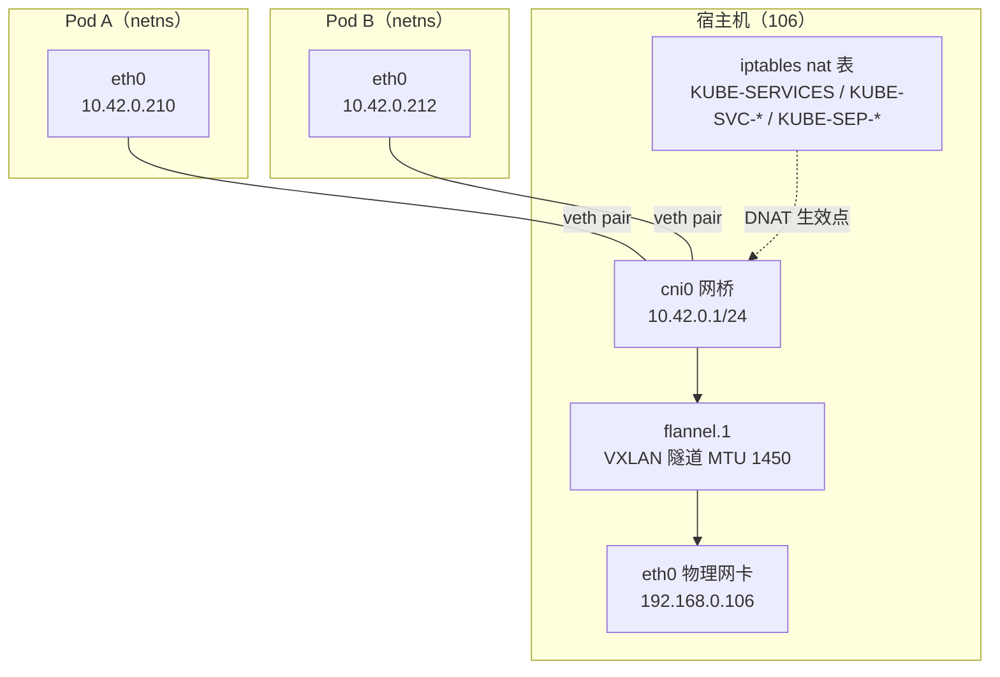
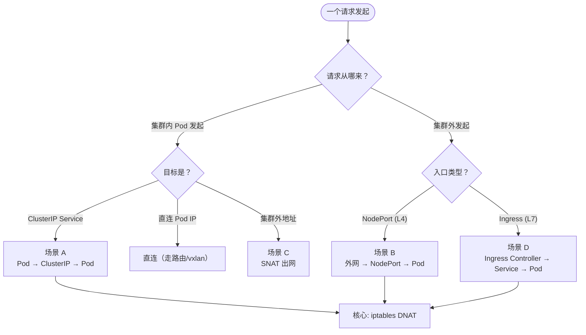
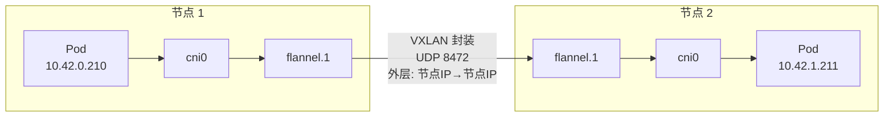

# K8s 网络请求全过程

> [!info] 本文定位
> 回答一个具体问题：**我 `curl` 一个 Service 地址，这个包到底经过了哪些设备、哪些规则、IP 怎么变的、为什么能到 Pod、回包又怎么回来。**
> 全文以**你集群里实测的数据**为依据（iptables 规则链、Pod 内 DNS、flannel MTU 都是真的抓下来的），不是通用教科书。

---

## 〇、学习地图：四个核心问题

请求在 K8s 里跑一圈，本质是回答这四个问题：

| # | 问题 | 答案所在 | 关键机制 |
|---|---|---|---|
| 1 | 包怎么**出 Pod**？ | [[#一、地基：Pod 网络怎么搭起来的]] | veth pair + cni0 网桥 |
| 2 | **ClusterIP 怎么变成 Pod IP**？ | [[#三、场景 A：Pod → Service(ClusterIP) → Pod]] | kube-proxy iptables DNAT |
| 3 | **跨节点**怎么走？ | [[#七、跨节点：flannel vxlan 与 MTU 陷阱]] | vxlan 封装（UDP 8472） |
| 4 | **回包**怎么回来？ | [[#3.5 回包：conntrack 自动还原]] | conntrack 连接跟踪 |

**一条心法**：K8s 网络没有魔法——**Pod 之间是"路由+网桥"，Service 只是 iptables 规则做的 DNAT（四层）或反向代理（七层）**。

---

## 一、地基：Pod 网络怎么搭起来的

### 1.1 三个底层构件

| 构件 | 作用 | 你集群里的实测值 |
|---|---|---|
| **network namespace** | 每个 Pod 一个独立网络栈（自己的网卡/路由/iptables） | 不可见但无处不在 |
| **veth pair** | 一对虚拟网线：一端在 Pod 的 netns 里（叫 `eth0`），另一端插在宿主机网桥上 | `ip -br link` 能看到成对的 veth |
| **cni0 网桥** | 宿主机上的虚拟交换机，所有本节点 Pod 挂上面 | IP **10.42.0.1**（= Pod 网段的网关） |
| **flannel.1** | 跨节点隧道设备（VXLAN） | MTU **1450** |

### 1.2 单节点的网络构造（实测）



**关键理解**：
- Pod 的默认路由指向自己的 eth0 → 包到达宿主机 cni0 网桥 → 由**宿主机的路由表**决定下一步
- **同节点** Pod 互访：直接在 cni0 上二层转发，不经过 flannel
- **跨节点**：走 flannel.1 封装成 UDP 包，从 eth0 发出去

### 1.3 CNI：谁把网线插上的

Pod 创建时，**kubelet 调用 CNI 插件**（你集群是 flannel，配置在 `/var/lib/rancher/k3s/agent/etc/cni/net.d/10-flannel.conflist`），插件负责：
1. 创建 veth pair，一端塞进 Pod 的 netns
2. 给 Pod 分配 IP（从 10.42.0.0/24 里取）
3. 设置路由、通告给集群其他节点

```bash
# 查看你集群的 CNI 配置
ls /var/lib/rancher/k3s/agent/etc/cni/net.d/     # → 10-flannel.conflist
ip -br link | grep -E "flannel|cni0"             # → flannel.1 / cni0
```

---

## 二、请求全景：四种场景



| 场景 | 入口 | 变换层次 | 本文位置 |
|---|---|---|---|
| A | Pod → ClusterIP | L4（iptables DNAT） | 第三章 ⭐ |
| B | 集群外 → NodePort:30081 | L4 + SNAT | 第四章 |
| C | Pod → 集群外 | SNAT（伪装成节点 IP） | 第五章 |
| D | 集群外 → Ingress → Service | L7 反向代理 | 第六章 |

---

## 三、场景 A：Pod → Service(ClusterIP) → Pod

### 3.1 先看一个具体请求

```bash
# 假设 Pod 内执行（flink-jobmanager 的 ClusterIP 是实测值）
curl http://10.43.83.202:8081/
```

### 3.2 报文头部变化全过程（核心表）

| 步骤 | 位置 | 源 IP:Port | 目的 IP:Port | 发生了什么 |
|---|---|---|---|---|
| ① | Pod A 的 netns | 10.42.0.210:54321 | **10.43.83.202:8081** | 应用发出请求，走默认路由 → eth0（veth） |
| ② | 宿主机 `nat/PREROUTING` | 10.42.0.210:54321 | 10.43.83.202:8081 | 进入 **KUBE-SERVICES** 链，匹配到 ClusterIP 规则 |
| ③ | `KUBE-SVC-xxxx` | 同上 | 同上 | 按**概率**选一个后端（K8s 的"随机负载均衡"就在这里） |
| ④ | `KUBE-SEP-xxxx` | 10.42.0.210:54321 | **10.42.0.212:8081** | **DNAT**：目的地址改成真实 Pod IP |
| ⑤ | 宿主机路由 | 同上 | 10.42.0.212:8081 | 查路由表 → 同节点走 cni0（跨节点走 flannel.1） |
| ⑥ | Pod B 的 netns | 10.42.0.210:54321 | 10.42.0.212:8081 | 收到包，应用处理 |
| ⑦ | 回包 | 10.42.0.212:8081 | 10.42.0.210:54321 | Pod B 直接回给 Pod A（源 IP 是真实 Pod IP，不是 ClusterIP） |
| ⑧ | 回程 conntrack | — | — | 中间节点/宿主机按 conntrack 记录**反向还原**（见 3.5） |

> [!tip] 一句话记住
> **ClusterIP 只在"去程"的 iptables 里存在**；包真正在网络上跑的时候，目的 IP 已经是 Pod IP 了。ClusterIP 是"虚拟地址"，没有任何网卡配置它。

### 3.3 iptables 规则链的真实结构（你集群实测）

```bash
# 实测：查询 flink-jobmanager 的 DNAT 规则
iptables -t nat -L KUBE-SERVICES -n | grep flink
```
输出（真实）：
```text
KUBE-SVC-E4J6H7OYPCQZZWVY  tcp -- 0.0.0.0/0  10.43.83.202  /* flink/flink-jobmanager:rpc cluster IP */ tcp dpt:6123
KUBE-SVC-UZGPNONAZQVHXZ5I  tcp -- 0.0.0.0/0  10.43.83.202  /* flink/flink-jobmanager:blob-server cluster IP */ tcp dpt:6124
```

三条链的分工：

```text
KUBE-SERVICES   ← 总入口：所有 ClusterIP 的匹配规则（一条 Service:Port 一行）
   ↓ 命中后跳转
KUBE-SVC-<hash> ← 负载均衡：N 个后端写 N 条规则，各带概率（statistic mode random）
   ↓ 命中后跳转
KUBE-SEP-<hash> ← 终点：执行 DNAT --to-destination <PodIP>:<Port>
```

实测的另一条链（default/kubernetes:https）展示了 **KUBE-MARK-MASQ**：
```text
Chain KUBE-SVC-NPX46M4PTMTKRN6Y
KUBE-MARK-MASQ  tcp -- !10.42.0.0/16  10.43.0.1  /* default/kubernetes:https cluster IP */ tcp dpt:443
```
**含义**：源地址**不在 Pod 网段**（`!10.42.0.0/16`）时，给包打一个标记，后续在 POSTROUTING 里做 MASQUERADE（SNAT）——否则回包会因为"目的地址是 Pod 网段以外"而找不到回程路径。

### 3.4 为什么叫"随机负载均衡"

`KUBE-SVC-*` 里每个后端规则带 `statistic mode random probability 0.33...`：
- 第 1 个后端：概率 1/N
- 第 2 个：概率 1/(N-1)
- …
- 最后 1 个：兜底

**每一条新连接**独立抽签 → 效果是随机分配。所以你会看到"每次 curl 打到不同 Pod"。

### 3.5 回包：conntrack 自动还原

DNAT 改的是**去程**的目的地址。回包（Pod B → Pod A）走的是正常路由，**不需要 iptables 规则**，因为：

- 宿主机上的 **conntrack（连接跟踪表）** 记录了这条连接的 NAT 映射：`10.43.83.202:8081 ↔ 10.42.0.212:8081`
- 回包经过时自动匹配 conntrack，**反向还原**成 `10.43.83.202` 给客户端

```bash
# 查看 conntrack 表（需要 conntrack 工具）
conntrack -L | grep 10.43.83.202
```

> [!warning] conntrack 相关经典故障
> - 表满：`nf_conntrack: table full, dropping packet` → 调 `net.netfilter.nf_conntrack_max`
> - 长连接被丢：NAT 超时（默认 5 天 TCP established）+ 中间设备静默丢连接

---

## 四、场景 B：集群外 → NodePort → Pod

### 4.1 链路


**你集群实测的 NodePort**：

| Service | ClusterIP | NodePort | 用途 |
|---|---|---|---|
| `flink/flink-jobmanager` | 10.43.83.202 | **30081**(webui) 30355(rpc) 30461(blob) | Flink UI |
| `dinky/dinky` | 10.43.155.228 | **30888** | Dinky 平台 |
| `kubernetes-dashboard` | 10.43.65.196 | 其 NodePort | 仪表盘 |
| `default/my-nginx` | 10.43.141.95 | 其 NodePort | 示例 |

### 4.2 externalTrafficPolicy：一个有代价的开关

| 取值 | 行为 | 代价 |
|---|---|---|
| `Cluster`（默认） | NodePort 可能转发到**其他节点**的 Pod | 需 SNAT → **客户端源 IP 丢失** |
| `Local` | 只转发到**本节点**的 Pod，不做 SNAT | **保留源 IP**，但流量不均、可能 502 |

> [!tip] 需要真实客户端 IP 时
> 改 `externalTrafficPolicy: Local`，或上游用 L7 代理（Ingress/Nginx）用 `X-Forwarded-For` 传递。

---

## 五、场景 C：Pod → 集群外（SNAT 出网）

Pod 访问外网（比如你集群里的 Pod 拉取镜像、调外部 API）：

1. 包源 IP 是 `10.42.0.x`（集群内私有网段），外网路由器不认识
2. 出节点前，**POSTROUTING 链做 MASQUERADE**：把源 IP 改成**节点 IP**（192.168.0.106）
3. 外部只看到节点在访问 → 回包回到节点 → conntrack 还原给 Pod

```bash
# 证据：nat 表的 POSTROUTING 里有 MASQUERADE 规则
iptables -t nat -L POSTROUTING -n | grep -i masq
```

**含义**：
- Pod **能出网**（借节点的 IP）
- 但**外部主动连不上 Pod IP**（除非 NodePort/LoadBalancer/Ingress 暴露）

---

## 六、场景 D：Ingress（七层入口）

> [!warning] 你的集群目前没有 Ingress Controller
> 实测 `kubectl get pods -A | grep -i ingress` 无结果，Service 列表里也没有 Traefik/nginx-ingress。**访问入口目前靠 NodePort。**

**Ingress 的本质**：

```text
集群外 → (NodePort/LB) → Ingress Controller Pod → 按 Host/Path 转发 → Service → Pod
```

| | NodePort（L4） | Ingress（L7） |
|---|---|---|
| 工作层次 | TCP/UDP，看 IP:Port | HTTP，看 Host/Path/Header |
| 一个端口 | 一个 Service | **一个入口，路由多个域名/路径** |
| TLS 终止 | 需自己做 | Controller 统一做 |
| 本质 | iptables DNAT | **集群内一个反向代理 Pod**（Nginx/Traefik） |

**装一个**（学习建议，注意镜像源）：
```bash
# 以 Traefik 为例（k3s 通常自带，此处已禁用/移除）
# 或部署 ingress-nginx（社区最常用）
kubectl apply -f https://raw.githubusercontent.com/kubernetes/ingress-nginx/main/deploy/static/provider/baremetal/deploy.yaml
```

---

## 七、跨节点：flannel vxlan 与 MTU 陷阱

### 7.1 包怎么跨节点



**封装过程**（跨节点 Pod 互访）：
1. 宿主机路由表匹配目标 Pod 网段 → 下一跳是 `flannel.1`
2. VXLAN 把原始以太帧**整个包进一个 UDP 包**：外层 = 节点 IP，内层 = Pod IP
3. 从 eth0 发到对端节点（UDP **8472**）
4. 对端解封装 → 取出原始帧 → 送 cni0 → 到目标 Pod

### 7.2 MTU：为什么必须降到 1450（实测证据）

```bash
ip link show flannel.1
# → mtu 1450   （物理网卡是 1500）
```

**原因**：VXLAN 封装要额外占 **50 字节**（外层 IP 20 + UDP 8 + VXLAN 8 + 内层以太 14）。
若不降 MTU：**小包正常、大包黑洞**——典型现象是「能 ping 通、TLS 握手卡住、大响应超时」。

> [!danger] 排查口诀
> **能建连但传大数据卡死 → 先怀疑 MTU。**
> 验证：`ping -M do -s 1422 <对端IP>`（1422 + 28 = 1450）。

---

## 八、DNS：请求发生前的第一步

### 8.1 Pod 里的 DNS 配置（你集群实测）

```bash
kubectl exec -n flink deploy/flink-jobmanager -- cat /etc/resolv.conf
```
```text
search flink.svc.cluster.local svc.cluster.local cluster.local
nameserver 10.43.0.10          # ← CoreDNS 的 ClusterIP（实测值）
options ndots:5
```

**kubelet 在创建 Pod 时自动注入**这三样：

| 项 | 含义 |
|---|---|
| `nameserver 10.43.0.10` | 所有 DNS 查询发给 CoreDNS（它本身也是一个 Service） |
| `search ...` | 短名字自动补全后缀：查 `dinky` → 依次尝试 `dinky.flink.svc.cluster.local` → `dinky.svc.cluster.local` → … |
| `ndots:5` | 名字里点数 < 5 时**先试 search 后缀**（所以集群内短名优先解析） |

### 8.2 四种常见名字

| 写法 | 解析结果 | 场景 |
|---|---|---|
| `dinky` | `dinky.<当前namespace>.svc.cluster.local` | 同 namespace |
| `dinky.dinky` | `dinky.dinky.svc.cluster.local` | 跨 namespace（service.namespace） |
| `dinky.dinky.svc.cluster.local` | 完整 FQDN | 最稳，跨集群/调试用 |
| `kube-dns.kube-system.svc.cluster.local` | **10.43.0.10** | DNS 服务本身 |

### 8.3 Headless Service（无头服务）

`clusterIP: None` 的 Service：DNS 返回**所有 Pod 的 IP 列表**，而不是一个虚拟 IP。
用途：StatefulSet 的稳定网络标识（如 `mysql-0.mysql.default.svc.cluster.local`）。

```bash
# 验证解析（在任意 Pod 内）
nslookup dinky.dinky.svc.cluster.local
```

---

## 九、NetworkPolicy：谁能访问谁

K8s 默认**所有 Pod 互通**（no isolation）。NetworkPolicy 用来做白名单：

```yaml
apiVersion: networking.k8s.io/v1
kind: NetworkPolicy
metadata: { name: allow-only-flink, namespace: flink }
spec:
  podSelector: { matchLabels: { component: taskmanager } }
  ingress:
    - from: [{ podSelector: { matchLabels: { component: jobmanager } } }]
```

**你集群的实现方式是 kube-router**（k3s 内置），证据在 iptables INPUT 链：

```text
Chain INPUT (policy DROP)
KUBE-ROUTER-INPUT     all  --  0.0.0.0/0  /* kube-router netpol */
KUBE-PROXY-FIREWALL   all  --  0.0.0.0/0  /* kubernetes load balancer firewall */
KUBE-NODEPORTS        all  --  0.0.0.0/0  /* kubernetes health check service ports */
KUBE-EXTERNAL-SERVICES all --  0.0.0.0/0  /* kubernetes externally-visible service portals */
```

> [!note] 为什么 INPUT 链的 policy 是 DROP
> 这是 kube-router 接管了节点防火墙（配合 UFW 时要注意，见第十一章的真实案例）。

---

## 十、抓包验证方法论

| 抓包位置 | 能证明什么 | 命令 |
|---|---|---|
| **Pod 内** | 应用实际发出的源/目的地址、DNS 查询 | `kubectl exec <pod> -- tcpdump -i eth0 -nn port 8081` |
| **宿主机 cni0** | DNAT **之后**的包（目的已是 Pod IP） | `tcpdump -i cni0 -nn port 8081` |
| **宿主机 eth0** | 跨节点流量（能看到 VXLAN 外层：UDP 8472） | `tcpdump -i eth0 -nn udp port 8472` |
| **宿主机任何网卡** | DNAT **之前**的包（目的还是 ClusterIP） | `tcpdump -i any -nn host 10.43.83.202` |
| **conntrack** | NAT 映射关系（谁被翻译成谁） | `conntrack -L \| grep <IP>` |

**验证 DNAT 的黄金组合**（同一个包在两个位置看到两个目的地址）：
```bash
# 终端 1：抓 ClusterIP（DNAT 前）
tcpdump -i any -nn host 10.43.83.202 -c 5
# 终端 2：抓 Pod IP（DNAT 后）
tcpdump -i cni0 -nn host 10.42.0.210 -c 5
```

---

## 十一、排障五步法 + 本环境真实案例

### 11.1 Service 不通的五步排查

```bash
# ① Service 存在且端口对？
kubectl get svc -n <ns> <name> -o wide

# ② 有 Endpoints 吗？（没有 endpoint = 没匹配到 Pod）
kubectl get endpoints -n <ns> <name>
#   → 空：检查 selector 是否匹配 Pod 标签、Pod 是否 Ready

# ③ Pod 本身在监听吗？
kubectl exec <pod> -- netstat -tlnp | grep <port>

# ④ iptables 规则生成了吗？
iptables -t nat -L KUBE-SERVICES -n | grep <ClusterIP>

# ⑤ 链路抓包（DNAT 前 vs 后）
tcpdump -i any -nn host <ClusterIP>
tcpdump -i cni0 -nn port <port>
```

### 11.2 本环境踩过的三个"网络类"真实案例

| 案例 | 现象 | 本质 | 详情 |
|---|---|---|---|
| **Pod 解析不了 `hadoop`** | Flink Pod 连 HDFS 报 `UnknownHostException: hadoop` | `hadoop` 是 **docker 网络别名**，k3s Pod 的 DNS（CoreDNS）不认识它 | 给 Pod 加 `hostAliases` → [[服务器巡检-192.168.0.106/Flink-on-K8s-vs-YARN\|Flink on K8s vs YARN]] |
| **DN 注册了 docker 内网 IP** | 写 HDFS 报 `could only be written to 0 of 1 minReplication nodes` | 容器在 bridge 网络里，DN 把 **172.x 内网 IP** 注册给了 NameNode，k3s Pod 路由不到 | 改 hostNetwork + `dfs.datanode.hostname` |
| **UFW 拦截容器 → 宿主机** | 容器连 `192.168.0.106:8020` 被拒 | 走宿主机 **INPUT 链**（UFW 默认 DROP），而本机测试走 conntrack ESTABLISHED 捷径所以"看起来通" | 加 ufw 放行 docker/k3s 网段 |

> [!important] 这三个案例的共同教训
> **"能通"和"该通"之间隔着：DNS 解析路径、注册地址选择、防火墙链路径。**
> 排查时永远问三句：**谁解析这个名字？谁通告这个地址？这个方向的包走哪条防火墙链？**

---

## 十二、本集群网络速查（全部实测）

| 项 | 值 |
|---|---|
| 集群 | k3s v1.36.2（单节点，containerd 2.3.2-k3s2） |
| **Pod CIDR** | `10.42.0.0/24`（节点 podCIDR）；cni0 = 10.42.0.1 |
| **Service CIDR** | `10.43.0.0/16`；kubernetes svc = 10.43.0.1 |
| **CoreDNS** | `10.43.0.10`（kube-system/kube-dns） |
| CNI | flannel（`10-flannel.conflist`），vxlan 设备 flannel.1，**MTU 1450** |
| kube-proxy 模式 | **iptables**（存在 KUBE-SERVICES/SVC/SEP 链） |
| NetworkPolicy 实现 | kube-router（INPUT 链有 KUBE-ROUTER-INPUT） |
| Ingress Controller | **无**（需自行部署） |
| ServiceLB | **无 DaemonSet** |
| NodePort 示例 | 30081 flink-webui · 30888 dinky · dashboard |
| Pod 内 DNS | `nameserver 10.43.0.10` + `search <ns>.svc.cluster.local svc.cluster.local cluster.local` + `ndots:5` |

---

## 十三、自测题（能答出来就算过关）

- [ ] 一个包从 Pod 出来访问 ClusterIP，**在哪个网卡/哪条链上**目的 IP 从 ClusterIP 变成 Pod IP？
- [ ] 为什么 `iptables -t nat -L KUBE-SERVICES` 里会出现 `KUBE-MARK-MASQ`？它在什么条件下生效？
- [ ] 回包路径上有 DNAT 规则吗？为什么不需要？
- [ ] flannel.1 的 MTU 为什么是 1450 不是 1500？MTU 配错会有什么典型现象？
- [ ] `search` 域和 `ndots:5` 是怎么让 `dinky` 这个短名字解析成功的？
- [ ] NodePort 默认模式（Cluster）为什么会丢客户端源 IP？怎么保住？
- [ ] 为什么 Pod 能访问外网，而外网默认访问不了 Pod？
- [ ] 结合本环境：为什么 Flink Pod 解析不了 `hadoop`，而给 hue 容器加 extra_hosts 就行？

---

## 关联笔记

- [[服务器巡检-192.168.0.106/Flink-on-K8s-vs-YARN]] — k3s Pod 写 HDFS 的三个网络坑（DNS/注册 IP/防火墙）
- [[服务器巡检-192.168.0.106/Nacos-Seata学习环境建设方案]] — 同源问题：Nacos 2.x 的 gRPC 端口、服务注册 IP 选择
- [[服务器巡检-192.168.0.106/部署记录-Hadoop+Hue]] — 本集群部署全貌与访问入口
- [[服务器巡检-192.168.0.106/数据流全链路执行手册]] — Flink/Kafka/Hive 在这套网络上的实际数据流
