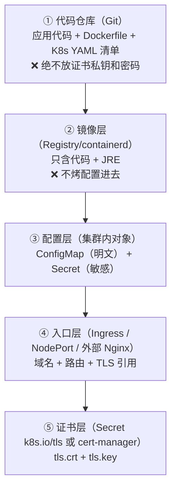
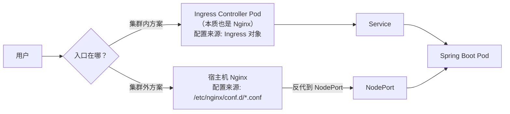

# Spring Boot 上 K8s 与入口/域名/证书管理

> [!info] 本文回答两个问题
> **① 一个 Spring Boot 服务，怎么从代码一步步跑进 k3s？**
> **② 域名、证书、Nginx、Gateway 这些东西，到底该"存放在哪"、由谁读取？**
> 所有方案都以你的 k3s 现状为前提（无 Ingress Controller、无 cert-manager、registry 已停），给出的每条命令都可用。
> 关联：[[9-k8s/0-K8s网络请求全过程|K8s 网络请求全过程]] · [[服务器巡检-192.168.0.106/Nacos-Seata学习环境建设方案|Nacos-Seata 学习环境建设方案]]

---

## 〇、先建立分层心智模型（"如何存放"的答案骨架）

一个服务上线，涉及五层资产，**每层都有它该待的地方**：



### "什么东西放哪里"对照表（★ 核心）

| 资产 | 存放位置 | 谁读取 | 备注 |
|---|---|---|---|
| 应用代码 | Git 仓库 | 构建时打进镜像 | — |
| Dockerfile | Git 仓库 | 构建时 | — |
| **普通配置**（日志级别、超时、URL） | **ConfigMap** | Pod 挂载为文件 或 env | 改了重启 Pod 生效（或配 reload） |
| **敏感配置**（DB 密码、Token、AK/SK） | **Secret** | Pod 挂载 或 env | ⚠️ 只是 base64，**不是加密** |
| **域名** | **Ingress 的 `spec.rules[].host`** | Ingress Controller | 声明式，跟 YAML 走 |
| **TLS 证书** | **`kubernetes.io/tls` 类型 Secret** | Ingress Controller / 应用 | 见第五章 |
| JVM 参数 | Deployment 的 env（`JAVA_TOOL_OPTIONS`） | 容器启动 | 别写死在 Dockerfile |
| Nginx 配置（集群内） | **Ingress 对象**（不是 nginx.conf！） | ingress-nginx | 手改配置文件会被覆盖 |
| Nginx 配置（集群外） | 宿主机 `/etc/nginx/conf.d/*.conf` | 宿主机 Nginx | 不在 K8s 体系内 |
| Gateway 路由（Spring Cloud Gateway） | ConfigMap 或 **Nacos 配置中心** | Gateway 应用 | Nacos 可实现动态刷新 |
| 证书私钥 | ❌ **永不进 Git** | — | 用 External Secrets / sealed-secrets |

> [!danger] 三条红线
> 1. **配置不烤进镜像**（否则改一个参数就要重新构建镜像）
> 2. **密码/私钥不进 Git**（Secret 是 base64，等于明文；见 5.6）
> 3. **证书不进镜像**（`docker history` 能把你删掉的文件挖出来）

---

## 一、Spring Boot 上 K8s：标准八步

```text
① 打包镜像 → ② 分发到 k3s → ③ 建 namespace + 配置 → ④ Deployment
→ ⑤ Service → ⑥ 入口（NodePort/Ingress） → ⑦ 域名 → ⑧ 证书
```

### ① 打包镜像：Dockerfile 两种写法

**写法 A：分层构建（推荐，改代码不重下依赖）**

```dockerfile
# ---- 构建阶段 ----
FROM maven:3.9-eclipse-temurin-17 AS build
WORKDIR /build
COPY pom.xml .
RUN mvn -q dependency:go-offline          # 依赖单独一层，缓存命中率高
COPY src ./src
RUN mvn -q clean package -DskipTests

# ---- 运行阶段（只留 JRE + jar）----
FROM eclipse-temurin:17-jre-jammy
RUN ln -sf /usr/share/zoneinfo/Asia/Shanghai /etc/localtime   # ★ 时区，否则日志差 8 小时
WORKDIR /app
COPY --from=build /build/target/*.jar app.jar
ENV JAVA_TOOL_OPTIONS="-XX:MaxRAMPercentage=75 -Duser.timezone=Asia/Shanghai"
EXPOSE 8080
ENTRYPOINT ["java","-jar","app.jar"]
```

**写法 B：本地构建 jar，只打运行镜像（你机器上最快，因为 `eclipse-temurin:17-jre-jammy` 已有）**

```dockerfile
FROM eclipse-temurin:17-jre-jammy
RUN ln -sf /usr/share/zoneinfo/Asia/Shanghai /etc/localtime
WORKDIR /app
COPY target/*.jar app.jar
ENTRYPOINT ["java","-XX:MaxRAMPercentage=75","-Duser.timezone=Asia/Shanghai","-jar","app.jar"]
```

> [!tip] 为什么用 `MaxRAMPercentage` 而不是 `-Xmx512m`
> 容器里 JVM 要按 **cgroup 内存限额** 自动算堆大小；写死 `-Xmx` 容易和 K8s limits 打架（要么浪费、要么被 OOMKilled）。JDK 10+ 支持 `-XX:MaxRAMPercentage`。

### ② 分发到 k3s（你的 registry 停了，两条路）

**路线 A：起本地 registry（一劳永逸，推荐）**

```bash
# registry 容器已 Exited 2 个月，重启即可
docker start registry || docker run -d --name registry --restart=always \
  -p 5000:5000 -v /opt/registry:/var/lib/registry registry:2

docker tag demo-api:1.0.0 localhost:5000/demo-api:1.0.0
docker push localhost:5000/demo-api:1.0.0
```

**路线 B：`docker save | k3s ctr images import -`（你现在一直在用，最快）**

```bash
docker build -t demo-api:1.0.0 .
docker save demo-api:1.0.0 | /home/vic/.local/bin/k3s ctr images import -
# Deployment 里写 image: demo-api:1.0.0，配 imagePullPolicy: IfNotPresent
```

> [!warning] 为什么 k3s 拉不到 Docker Hub 的镜像
> k3s 用 **containerd**，与 Docker 是两套镜像存储。`docker pull` 成功 ≠ k3s 能用；要么走 registry，要么 `ctr images import`。

### ③ namespace + 配置（ConfigMap / Secret）

```yaml
apiVersion: v1
kind: Namespace
metadata:
  name: demo
---
apiVersion: v1
kind: ConfigMap
metadata:
  name: demo-api-config
  namespace: demo
data:
  application-k8s.yml: |          # ★ 挂载成 Spring Boot 的 profile 配置文件
    server:
      port: 8080
    logging:
      level:
        root: INFO
    demo:
      timeout-ms: 3000
---
apiVersion: v1
kind: Secret
metadata:
  name: demo-api-secret
  namespace: demo
type: Opaque
stringData:                        # ★ 用 stringData 省去手工 base64（写入时自动编码）
  DB_PASSWORD: "ChangeMe@2026"
```

```bash
kubectl apply -f 00-namespace-config.yaml
```

### ④ Deployment（探针 + 资源 + 优雅停机，一个都不能少）

```yaml
apiVersion: apps/v1
kind: Deployment
metadata:
  name: demo-api
  namespace: demo
spec:
  replicas: 2
  selector:
    matchLabels: { app: demo-api }
  strategy:
    type: RollingUpdate
    rollingUpdate: { maxSurge: 1, maxUnavailable: 0 }   # 不中断发布
  template:
    metadata:
      labels: { app: demo-api }
    spec:
      terminationGracePeriodSeconds: 30                 # ★ 给优雅停机留时间
      containers:
        - name: app
          image: demo-api:1.0.0
          imagePullPolicy: IfNotPresent
          ports: [{ containerPort: 8080, name: http }]
          env:
            - name: SPRING_PROFILES_ACTIVE
              value: k8s                                # 激活上一步挂载的 profile
            - name: DB_PASSWORD
              valueFrom:
                secretKeyRef: { name: demo-api-secret, key: DB_PASSWORD }
          volumeMounts:
            - { name: config, mountPath: /app/config, readOnly: true }
          resources:
            requests: { cpu: 250m, memory: 512Mi }
            limits:   { cpu: "1",  memory: 1Gi }
          startupProbe:                                  # ★ 慢启动应用必备
            httpGet: { path: /actuator/health/readiness, port: http }
            failureThreshold: 30
            periodSeconds: 5
          readinessProbe:                                # 不就绪 → 不接流量
            httpGet: { path: /actuator/health/readiness, port: http }
            periodSeconds: 10
          livenessProbe:                                 # 死了 → 重启容器
            httpGet: { path: /actuator/health/liveness, port: http }
            periodSeconds: 20
          lifecycle:
            preStop:
              exec: { command: ["sh","-c","sleep 5"] }   # ★ 等待 Endpoints 摘除
      volumes:
        - name: config
          configMap: { name: demo-api-config }
```

**配套 Spring Boot 侧要求**：

```yaml
# application.yml（应用内）
management:
  endpoint.health.probes.enabled: true      # 暴露 liveness/readiness 端点
  endpoints.web.exposure.include: health,info,metrics,prometheus
server:
  shutdown: graceful                        # ★ 配合 preStop 优雅停机
```

### ⑤ Service（先 ClusterIP，入口后面单独处理）

```yaml
apiVersion: v1
kind: Service
metadata:
  name: demo-api
  namespace: demo
spec:
  selector: { app: demo-api }
  ports:
    - { name: http, port: 80, targetPort: http }   # ★ port 用 name 引用，避免改端口漏改
```

```bash
kubectl apply -f 10-deployment-service.yaml
kubectl -n demo get pods,svc -o wide
kubectl -n demo logs -f deploy/demo-api
```

### ⑥⑦⑧ 入口 + 域名 + 证书

这三件事是一体的，见第三、四、五章。**你现在集群里没有 Ingress Controller**，所以：

| 你想达到 | 需要先做 | 见 |
|---|---|---|
| 用 IP:Port 访问（最快） | 把 Service 改成 NodePort | 3.1 |
| 用 `demo.local` + HTTPS 访问 | 装 Ingress Controller + 自签证书 | 3.2 / 五 |
| 复用宿主机 Nginx 统一入口 | 宿主机装 Nginx，反代到 NodePort | 3.3 / 六 |

---

## 二、域名怎么放（四个层次，从简到正式）

| 层次 | 做法 | 适用 | 验证 |
|---|---|---|---|
| **1. 免 DNS（测试神器）** | 用 `nip.io`/`sslip.io` 泛解析：`demo.192.168.0.106.nip.io` 自动解析到该 IP | 学习、临时演示 | `nslookup demo.192.168.0.106.nip.io` |
| **2. 客户端 hosts** | 每台机器 `/etc/hosts` 加 `192.168.0.106 demo.local` | 内网小规模、不想动 DNS | `ping demo.local` |
| **3. 内网 DNS 服务器** | 内网 DNS（AdGuard/Pi-hole/BIND/路由器 DNS）加 A 记录 | 团队共享 | `dig demo.local @<dns>` |
| **4. 集群内自定义解析** | 改 CoreDNS ConfigMap（`hosts` 块 或 `forward` 到内网 DNS） | Pod 内部要解析自定义域名 | `kubectl exec <pod> -- nslookup demo.local` |

**CoreDNS 自定义解析示例**（给集群内加一条静态解析，参考你之前"Pod 解析不了 hadoop"的坑）：

```bash
kubectl -n kube-system edit configmap coredns
```
```text
Corefile: |
  .:53 {
      errors
      health
      hosts {                      # ★ 静态解析块
          192.168.0.106 demo.local hadoop   # 一条记录解决 Pod 内解析问题
          fallthrough
      }
      kubernetes cluster.local in-addr.arpa ip6.arpa {
          pods insecure
          fallthrough in-addr.arpa ip6.arpa
      }
      forward . /etc/resolv.conf
      cache 30
  }
```
```bash
kubectl -n kube-system rollout restart deploy/coredns   # 改完必须重启 CoreDNS
```

> [!tip] 调试时不想改任何配置
> `curl --resolve demo.local:443:192.168.0.106 https://demo.local/ -k`
> 直接把域名解析到指定 IP，绕过 DNS —— 排障时最利索的办法。

---

## 三、入口三方案（NodePort / Ingress / 外部 Nginx）

### 3.1 方案一：NodePort（零依赖，你现在的方式）

```yaml
apiVersion: v1
kind: Service
metadata: { name: demo-api-np, namespace: demo }
spec:
  type: NodePort
  selector: { app: demo-api }
  ports: [{ name: http, port: 80, targetPort: http, nodePort: 30090 }]
```
访问：`http://192.168.0.106:30090/`

- ✅ 立刻能用，不需要任何额外组件
- ❌ 一个 Service 占一个端口；没有域名、没有统一 TLS

### 3.2 方案二：Ingress（标准做法，推荐）

**Ingress 的本质**：声明式规则（域名/路径 → Service），由 Ingress Controller（一个 Nginx 的 Pod）读取并生成真正的 nginx.conf。**你永远不手改那个 nginx.conf。**

**你的集群目前没有 Controller**，需要装一个（镜像走国内源）：

```bash
# 以 ingress-nginx 为例（bare-metal 版本），注意把镜像换成可达源
kubectl apply -f https://raw.githubusercontent.com/kubernetes/ingress-nginx/main/deploy/static/provider/baremetal/deploy.yaml

# 若 Pod 拉镜像失败（ImagePullBackOff）：在 106 上 docker pull 后导入 k3s
docker pull docker.m.daocloud.io/registry.k8s.io/ingress-nginx/controller:v1.11.3
docker tag  docker.m.daocloud.io/registry.k8s.io/ingress-nginx/controller:v1.11.3 \
           registry.k8s.io/ingress-nginx/controller:v1.11.3
docker save registry.k8s.io/ingress-nginx/controller:v1.11.3 | /home/vic/.local/bin/k3s ctr images import -
# 仍失败则改 Deployment 的 image 字段为该国内地址（imagePullPolicy: IfNotPresent）
```

**Ingress 清单**（域名 + 证书 + 路由，一次到位）：

```yaml
apiVersion: networking.k8s.io/v1
kind: Ingress
metadata:
  name: demo-api
  namespace: demo
  annotations:
    nginx.ingress.kubernetes.io/ssl-redirect: "true"        # HTTP 自动跳 HTTPS
    nginx.ingress.kubernetes.io/proxy-body-size: "20m"      # 上传大小
spec:
  ingressClassName: nginx
  tls:
    - hosts: [demo.local]
      secretName: demo-local-tls          # ★ 证书在这里被引用（见第五章）
  rules:
    - host: demo.local                    # ★ 域名在这里声明
      http:
        paths:
          - path: /
            pathType: Prefix
            backend:
              service:
                name: demo-api
                port: { name: http }
```

```bash
kubectl apply -f 30-ingress.yaml
kubectl -n demo get ingress
# 验证（绕过 DNS）
curl --resolve demo.local:80:192.168.0.106 http://demo.local/actuator/health
curl --resolve demo.local:443:192.168.0.106 -k https://demo.local/
```

### 3.3 方案三：宿主机 Nginx 反代（你 106 上没装 Nginx，103 上有）

**适合**：已有 Nginx、要把 K8s 服务和宿主机上其他站点统一入口、或想用宝塔面板管理证书。

```nginx
# /etc/nginx/conf.d/demo.conf
server {
    listen 80;
    server_name demo.local;
    return 301 https://$host$request_uri;
}

server {
    listen 443 ssl;
    server_name demo.local;

    # ★ 证书放宿主机文件系统（不属于 K8s）
    ssl_certificate     /etc/nginx/ssl/demo.local.crt;
    ssl_certificate_key /etc/nginx/ssl/demo.local.key;
    ssl_protocols       TLSv1.2 TLSv1.3;

    location / {
        proxy_pass http://127.0.0.1:30090;          # 指向 NodePort
        proxy_set_header Host              $host;
        proxy_set_header X-Real-IP         $remote_addr;    # ★ 传递真实客户端 IP
        proxy_set_header X-Forwarded-For   $proxy_add_x_forwarded_for;
        proxy_set_header X-Forwarded-Proto $scheme;
        proxy_http_version 1.1;
        proxy_set_header Upgrade    $http_upgrade;   # WebSocket 支持
        proxy_set_header Connection "upgrade";
        proxy_read_timeout 60s;
    }
}
```

### 3.4 三方案对比与决策

| | NodePort | Ingress（集群内） | 外部 Nginx |
|---|---|---|---|
| 组件 | 无 | Ingress Controller | 宿主机 Nginx |
| 域名 | ❌ | ✅ Ingress host | ✅ server_name |
| 证书位置 | — | K8s Secret | 宿主机文件 |
| 配置方式 | YAML | Ingress YAML（声明式） | nginx.conf（手写） |
| 一个端口多域名 | ❌ | ✅ | ✅ |
| 与 K8s 生命周期 | 一体 | 一体（YAML 跟 GitOps） | 分离（需自己管） |
| 推荐度 | 学习/临时 | ⭐ **生产标准** | 已有 Nginx 时 |

> [!note] K8s Gateway API（Ingress 的下一代）
> 用 `GatewayClass` + `Gateway` + `HTTPRoute` 替代 Ingress，表达能力更强（支持 TCP/gRPC/流量切分）。你集群未安装，学习阶段先用 Ingress 即可。

---

## 四、证书怎么放（重点章节）

### 4.1 先认清证书文件

| 文件 | 内容 | 敏感 |
|---|---|---|
| `xxx.crt` / `fullchain.pem` | 公钥证书（可能含中间链） | 否（可公开） |
| `xxx.key` | **私钥** | ✅ **最高密级** |
| `xxx.pfx` / `.jks` | 证书+私钥打包（Java 常用） | ✅ 含私钥 |

K8s 的 `kubernetes.io/tls` Secret 只认两个 key：**`tls.crt`（含链）** 和 **`tls.key`**。

### 4.2 内网自签证书（你现在的实际场景）

```bash
# 一条命令生成（★ 关键是指定 SAN，否则浏览器/Java 都报域名不匹配）
openssl req -x509 -nodes -newkey rsa:2048 -days 3650 \
  -keyout demo.local.key -out demo.local.crt \
  -subj "/CN=demo.local" \
  -addext "subjectAltName=DNS:demo.local,DNS:*.demo.local,IP:192.168.0.106"

# 查看 SAN（验证用）
openssl x509 -in demo.local.crt -noout -text | grep -A1 "Subject Alternative Name"
```

> [!warning] CN 已经过时
> 现代浏览器和 Java 客户端**只看 SAN**，不再看 CN。漏了 SAN 就会 `hostname mismatch`。

### 4.3 存成 K8s Secret（三种方式）

```bash
# 方式 1：命令行（最省事，自动做 base64）
kubectl -n demo create secret tls demo-local-tls \
  --cert=demo.local.crt --key=demo.local.key

# 方式 2：从已有 Secret 生成 YAML（便于纳入 GitOps，注意私钥仍不应入库）
kubectl -n demo get secret demo-local-tls -o yaml > demo-local-tls.yaml

# 方式 3：手写 YAML（base64 需自己算）
#   tls.crt: $(base64 -w0 demo.local.crt)
#   tls.key: $(base64 -w0 demo.local.key)
```

在 Ingress 里引用（见 3.2）：`spec.tls[].secretName: demo-local-tls` —— **Controller 自动读取并热加载，无需重启**。

### 4.4 挂给应用自己用（Spring Boot 需要证书时）

```yaml
          volumeMounts:
            - { name: tls, mountPath: /app/certs, readOnly: true }
      volumes:
        - name: tls
          secret:
            secretName: demo-local-tls
            defaultMode: 0400          # ★ 私钥权限收紧
```
```yaml
# Spring Boot 侧
server:
  ssl:
    enabled: true
    key-store: /app/certs/tls.crt     # PEM 直接引用（Boot 支持 PEM）
    certificate-private-key: /app/certs/tls.key
```

### 4.5 cert-manager：自动签发与续期（进阶）

手工证书最大的风险是**忘记续期**。cert-manager 用 CRD 声明"我要一张证书"，自动签发、自动写入 Secret、**到期前自动续**：

```yaml
apiVersion: cert-manager.io/v1
kind: ClusterIssuer
metadata: { name: selfsigned-ca }
spec:
  selfSigned: {}
---
apiVersion: cert-manager.io/v1
kind: Certificate
metadata: { name: demo-local, namespace: demo }
spec:
  secretName: demo-local-tls
  duration: 8760h
  renewBefore: 720h            # 到期前 30 天续期
  commonName: demo.local
  dnsNames: [demo.local, "*.demo.local"]
  issuerRef: { name: selfsigned-ca, kind: ClusterIssuer }
```

| Issuer 类型 | 适用 | 备注 |
|---|---|---|
| `SelfSigned` | 内网学习 | 浏览器会警告，需手动信任 |
| 内部 CA（自建 root） | 内网正式 | 把 root 装进客户端信任库 |
| `ACME`（Let's Encrypt） | 公网域名 | 需要公网可达 + 域名解析，内网用 DNS-01 |

### 4.6 证书轮换与生效（几个坑）

| 场景 | 行为 |
|---|---|
| Secret 更新 → Ingress | Controller **自动 reload**，秒级生效 ✅ |
| Secret 更新 → 应用挂载文件 | kubelet 定期同步（约 1 分钟），文件会变；但 **JVM 启动时已加载的证书不会自动重载** ❌ 需应用内做 reload 或滚动重启 |
| Secret 更新 → env 注入 | **不会更新**，必须重启 Pod ❌ |

### 4.7 安全红线：Secret 不是保险箱

- Secret 只是 **base64 编码**，`kubectl get secret -o yaml` 直接可解
- 默认存 etcd **明文** → 生产应开启 **etcd 加密（EncryptionConfiguration）**
- 更好的方案：
  - **sealed-secrets**：加密后可以安全进 Git
  - **External Secrets Operator**：真身在 Vault/云 KMS，集群里只放引用
- RBAC 收紧：只有必要的人能 `get secrets`

---

## 五、Nginx 的两个角色（最容易混淆的地方）



| | 集群内 Ingress Controller | 集群外宿主机 Nginx |
|---|---|---|
| 它是什么 | 一个 Pod（Nginx/Traefik） | 宿主机进程 |
| 配置怎么改 | `kubectl apply` Ingress YAML | 编辑 `nginx.conf` + `nginx -s reload` |
| 证书在哪 | K8s Secret | 宿主机文件 |
| 能否手改配置 | ❌ 会被 Controller 覆盖 | ✅ 唯一来源 |
| 优点 | 声明式、随应用版本走、GitOps 友好 | 可管非 K8s 站点、宝塔面板可视化 |
| 缺点 | 需要维护 Controller | 手工、易漂移、证书要自己续 |

> [!important] 一句话
> **Ingress Controller 就是"Nginx 的配置由 K8s 对象生成"的 Nginx。**
> 用了它，就再也别去手改它的 nginx.conf。

---

## 六、Gateway 放哪（Spring Cloud Gateway）

如果你说的 gateway 是 **Spring Cloud Gateway**（微服务 API 网关），它和 K8s Ingress 是**两层不同的东西**：

```text
公网/内网用户
   ↓
【L7 入口】Ingress Controller（或外部 Nginx）      ← 管：域名、TLS、粗粒度路径
   ↓
【业务网关】Spring Cloud Gateway (Pod)             ← 管：鉴权、限流、灰度、协议转换、聚合
   ↓
【业务服务】order / stock / account (Pod)          ← 管：业务逻辑
```

| | K8s Ingress | Spring Cloud Gateway |
|---|---|---|
| 定位 | 集群入口（南北向） | 业务网关（南北+东西向） |
| 配置语法 | Ingress YAML | 路由配置（Java/YAML/Nacos） |
| 能力 | 域名/路径/TLS | 鉴权、限流、熔断、重试、灰度、日志 |
| 依赖 K8s | 是 | 否（纯应用，可跑在任何地方） |

**Gateway 的路由配置存放**（三种，推荐第 2 种，配合你正在学的 Nacos）：

```yaml
# ① ConfigMap（静态，改配置要重启或 refresh）
apiVersion: v1
kind: ConfigMap
metadata: { name: gateway-routes, namespace: demo }
data:
  routes.yml: |
    spring:
      cloud:
        gateway:
          routes:
            - id: order-route
              uri: http://order-service
              predicates: [ Path=/api/order/** ]
              filters: [ StripPrefix=1 ]
```
```text
② Nacos 配置中心（动态，改完秒级生效）★ 推荐
   DataID: gateway-routes.yml   Group: DEFAULT_GROUP
   Gateway 侧: spring.cloud.gateway.config 走 Nacos + @RefreshScope
③ 代码内 Java DSL（编译期固定，最不灵活）
```

**Gateway 自身的 K8s 部署**：与普通 Spring Boot 服务完全一样（Deployment + Service + 探针），额外注意：
- 它是**所有流量的必经之路** → 副本数 ≥ 2、资源给足、探针要精准
- 用 **Ingress 指向 Gateway 的 Service**（而不是直接指向业务服务）
- 跨服务调用建议用 K8s Service DNS（`http://order-service.demo.svc.cluster.local`）

---

## 七、完整实操：把你的服务跑成 `https://demo.local`

```bash
# ── 0. 准备（106 上执行）──────────────────────────
K=/home/vic/.local/bin/k3s

# ── 1. 构建并导入镜像 ────────────────────────────
cd /path/to/your-springboot
docker build -t demo-api:1.0.0 .
docker save demo-api:1.0.0 | $K ctr images import -

# ── 2. 命名空间 + 配置 ──────────────────────────
$K kubectl apply -f 00-namespace-config.yaml

# ── 3. 应用（Deployment + Service）──────────────
$K kubectl apply -f 10-deployment-service.yaml
$K kubectl -n demo get pods -w          # 等到 2/2 Running

# ── 4. 自签证书 → Secret ────────────────────────
openssl req -x509 -nodes -newkey rsa:2048 -days 3650 \
  -keyout demo.local.key -out demo.local.crt \
  -subj "/CN=demo.local" \
  -addext "subjectAltName=DNS:demo.local,IP:192.168.0.106"
$K kubectl -n demo create secret tls demo-local-tls \
  --cert=demo.local.crt --key=demo.local.key

# ── 5. 装 Ingress Controller（只需一次）─────────
$K kubectl apply -f https://raw.githubusercontent.com/kubernetes/ingress-nginx/main/deploy/static/provider/baremetal/deploy.yaml
$K kubectl -n ingress-nginx get pods -w

# ── 6. Ingress（域名 + 路由 + TLS）──────────────
$K kubectl apply -f 30-ingress.yaml

# ── 7. 域名解析（免 DNS 方案）────────────────────
echo "192.168.0.106 demo.local" | sudo tee -a /etc/hosts     # 106 本机
# 或在 Mac 上加 /etc/hosts，或直接用 nip.io 域名

# ── 8. 验证 ─────────────────────────────────────
curl -k --resolve demo.local:443:192.168.0.106 https://demo.local/actuator/health
curl -kI --resolve demo.local:443:192.168.0.106 https://demo.local/ | head -1
openssl s_client -connect 192.168.0.106:443 -servername demo.local </dev/null 2>/dev/null | grep -E "subject=|issuer="
```

**看到 `HTTP/2 200` 和正确的证书 subject，就算通了。**

---

## 八、常见坑速查

| 现象 | 根因 | 解决 |
|---|---|---|
| `ImagePullBackOff` | k3s 拉不到镜像（containerd 与 Docker 存储分离） | 起 registry 或 `docker save \| ctr images import` |
| Pod 反复重启 | 探针路径错/太早（应用没起来就被 liveness 杀） | 加 `startupProbe`，liveness 用 `/actuator/health/liveness` |
| 滚动更新时 502 | 优雅停机没配：Endpoints 摘除前进程已退出 | `preStop: sleep 5` + `server.shutdown: graceful` |
| 日志时间差 8 小时 | 容器时区 UTC | 镜像里 `ln -sf .../Asia/Shanghai /etc/localtime` + `-Duser.timezone` |
| OOMKilled | JVM 堆写死超过 limits | `-XX:MaxRAMPercentage=75` |
| Ingress 404 | `ingressClassName` 不匹配 / Service 端口名写错 | `kubectl -n demo describe ingress`、检查 `ports[].name` |
| 证书警告 `mismatch` | SAN 里没有该域名 | 重新签发并带上完整 SAN |
| `kubectl get secret` 拿到明文感 | Secret 只是 base64 | 开 etcd 加密 / sealed-secrets |
| 改 Ingress 不生效 | 改的是 Controller 的 nginx.conf（被覆盖） | 只改 Ingress 对象 |
| Service 无 Endpoints | selector 不匹配 / Pod 未 Ready | `kubectl get endpoints` + 检查标签与探针 |

---

## 九、自测题

- [ ] 为什么配置要放 ConfigMap 而不是打进镜像？两者在"改一个参数"时要分别做什么？
- [ ] Secret 和 ConfigMap 的本质区别是什么？为什么说 Secret"不是加密"？
- [ ] 域名在 K8s 里是"存放在哪"的？Ingress host 与 /etc/hosts、内网 DNS 各解决什么问题？
- [ ] TLS 证书为什么要放 `kubernetes.io/tls` Secret？Ingress 更新证书后为什么不重启就生效，而应用挂载的证书却可能不生效？
- [ ] 自签证书为什么必须配 SAN？
- [ ] Ingress Controller 和你手写的 Nginx 配置，谁覆盖谁？
- [ ] Spring Cloud Gateway 和 K8s Ingress 各自的职责边界在哪？Gateway 路由配置放哪最灵活？
- [ ] 你的集群现在没有 Ingress Controller，要支持 `demo.local` 需要补哪些步骤？

---

## 关联笔记

- [[9-k8s/0-K8s网络请求全过程]] — 请求进来之后的网络路径（DNAT、NodePort、DNS）
- [[服务器巡检-192.168.0.106/Nacos-Seata学习环境建设方案]] — Gateway 路由放 Nacos 的完整实践环境
- [[服务器巡检-192.168.0.106/Flink-on-K8s-vs-YARN]] — 镜像导入、hostAliases、探针的真实踩坑记录
- [[服务器巡检-192.168.0.106/部署记录-Hadoop+Hue]] — 本集群现有服务与端口占用（避免冲突）
