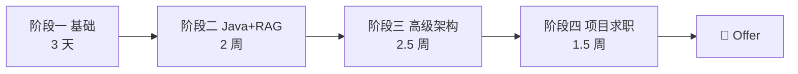

# 🗺️ 学习路径总览

> [!tldr] 一句话目标
> **8 周内：具备「AI 应用开发负责人」的硬技能 + 2 个可演示项目 + 简历，开始求职。**

> [!warning] 压缩版节奏（脱产版）
> 每天 8-10 小时，周末仅半天休息。
> 项目砍到 **2 个**（RAG + Agent），第三个看余力。

## 阶段总览

## 阶段一 基础入门（3 天）

> [!example] 产出：命令行聊天机器人（可流式、可算成本）

| 天数 | 任务 |
| --- | --- |
| Day 1 | 概念扫盲：Token/Context/幻觉/Embedding；注册 API 拿额度 |
| Day 2 | Prompt 工程：结构化模板 + 20 个实验 + CoT |
| Day 3 | API 实战：对话/流式/多轮/Function Calling + Token 成本管理 |

> [!tip] 走捷径：第 1 天直接看 1 篇科普 + 1 个示例代码，边写边学，别收藏课程。

## 阶段二 Java + AI 开发（2 周）

> [!example] 产出：企业知识库 RAG 问答系统（Spring AI + pgvector）

| 周      | 任务           | 要点                                                      |
| ------ | ------------ | ------------------------------------------------------- |
| Week 1 | Spring AI 入门 | 对话/流式(SSE)/Tool Calling；**只学 Spring AI**，LangChain4j 砍掉 |
| Week 2 | RAG 全链路      | 切分→向量化→检索→Rerank→注入；评估集 30 对；防幻觉                        |

> [!warning] 压缩取舍
> - ❌ 砍掉 LangChain4j 对比
> - ❌ 砍掉混合检索的深度调优（先做出 BM25+向量 的简单版）
> - ✅ 保留：评估量化（面试必须能报数字）

## 阶段三 高级架构（2.5 周）

> [!example] 产出：多 Agent 产品 + 一份《企业级 AI 架构方案》

| 周        | 任务      | 要点                                  |
| -------- | ------- | ----------------------------------- |
| Week 3   | Agent   | ReAct/工具调用/记忆/MCP；做一个能自主多步任务的 Agent |
| Week 3.5 | 多模态+工程化 | 读图能力；可观测/降级/成本/安全                   |
| Week 4   | 领导力     | 系统设计 + 技术选型 + 带团队；读 2 篇落地案例         |

## 阶段四 项目与求职（1.5 周）

> [!example] 产出：简历 + 2 个代表作 + 面试

| 时间 | 任务 |
| --- | --- |
| Day 1-2 | 项目打磨：README/演示视频/部署上线 |
| Day 3 | 简历 + 自我介绍 + 2 篇博客 |
| Day 4-7 | 面试冲刺 + 每天投递 10+ |

## 📅 每日打卡

> [!note] 打卡流程
> 1. 复制 [[模板-每日打卡]] 的内容
> 2. 用日历插件（已装）创建当天笔记
> 3. 每天 5 分钟复盘，沉淀到 [[每日进度]]

## ✅ 验收标准

- [ ] 能独立搭一个带评估指标的 RAG 系统
- [ ] 能画企业级 AI 架构图并讲 15 分钟
- [ ] 简历投出后每周 ≥ 3 个面试

---
上一页：[[README]] · 下一页：[[02-基础阶段]]
