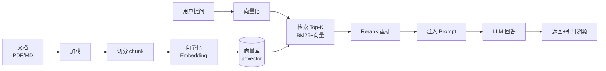

# 阶段二 Java + AI 开发（2 周）

> [!quote] 本阶段目标
> 把 AI 能力接进 Java 工程，做出企业级 RAG 应用。**这是差异化主战场。**

> [!important] 技术选型
> **Spring AI 为主，LangChain4j 砍掉。**
> 理由：投的是 Java 团队，Spring 全家桶是你既有优势，学最快、面试最加分。

## RAG 全链路（Mermaid 图）

## Week 1 · Spring AI 入门

> [!example] 交付：Spring Boot + LLM 聊天服务

- [ ] 对话接口 + 流式输出（SSE，打字机效果）
- [ ] 多轮对话 + 会话记忆
- [ ] Function Calling（查天气/算汇率）
- [ ] 系统 Prompt 配置

## Week 2 · RAG 全链路

> [!example] 交付：本地知识库问答系统（带引用来源）

| 主题 | 要点 |
| --- | --- |
| Embedding 选型 | bge-m3 / text-embedding-3 |
| 向量库选型 | pgvector（轻量，用现有 PG） |
| Chunking | 按段落/语义切分 + 重叠 |
| 检索 | 向量 + BM25 混合 |
| Rerank | bge-reranker |
| 防幻觉 | 置信度阈值 + 引用溯源 + 拒答 |
| 权限 | 元数据过滤做文档级隔离 |
| **评估** | 30+ 测试对，量化：命中率/准确率/引用正确率 |

## 🔧 技术栈

#Java #SpringBoot #SpringAI #pgvector #RAG #Embedding #Rerank #SSE

## ✅ 验收标准

- [ ] 从 0 独立搭一个带评估指标的 RAG 系统
- [ ] "怎么优化 RAG"能讲出 3 个以上手段
- [ ] 能讲清"为什么 RAG 而不是微调"

---
上一页：[[02-基础阶段]] · 下一页：[[04-高级架构阶段]]
