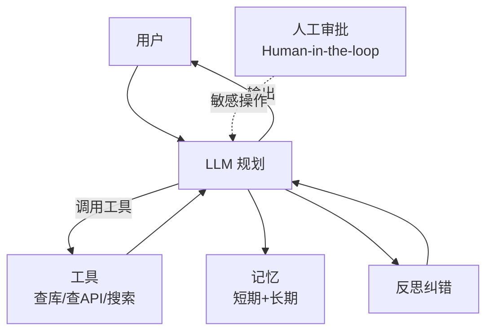

# 阶段三 高级架构（2.5 周）

> [!quote] 本阶段目标
> 从"会调 API"升级到"能设计系统、能带团队、能做技术决策"。**这是配得上"总监"的关键。**

## Agent 原理图

## Week 3 · Agent 开发

> [!example] 交付：能自主完成多步任务的 Agent（查数据→分析→生成报表）

- [ ] ReAct / Plan-and-Execute 模式
- [ ] 工具调用：Search / API / DB 查询
- [ ] 记忆机制：短期（会话）/ 长期（向量库）
- [ ] 失败模式：死循环、错误工具、幻觉指令
- [ ] 了解 **MCP（Model Context Protocol）**

> [!tip] MCP 是 2025 后的主流方向，面试加分点，务必能讲 1 分钟。

## Week 3.5 · 多模态 + 工程化

- [ ] Agent 读图（视觉理解）
- [ ] 可观测性：LLM Trace（输入/输出/Token/成本）
- [ ] 降级兜底：主模型挂了切备选
- [ ] 成本控制：模型分层 + 缓存 + 压缩
- [ ] 安全：Prompt 注入防护 + 脱敏

## Week 4 · 技术领导力

- [ ] AI 项目全流程：需求→选型→POC→排期→上线→迭代
- [ ] 技术选型方法：自研 vs 开源 vs API
- [ ] 团队分工：算法 / AI应用 / 后端 / 测试 / 产品
- [ ] 读 2 个落地案例（金融/电商/医疗）

> [!example] 交付：一份《企业级 AI 应用架构方案》+ 《技术方案/排期/团队分工》文档

## 🏷️ 标签

#Agent #MCP #多模态 #可观测性 #架构设计 #技术选型

## ✅ 验收标准

- [ ] 画出企业级 AI 架构图并讲 15 分钟
- [ ] 能回答"用 RAG 还是微调 / 哪个模型 / 成本多少 / 怎么上线"
- [ ] 有 2 份可直接展示的架构/方案文档

---
上一页：[[03-Java开发阶段]] · 下一页：[[05-项目与求职阶段]]
