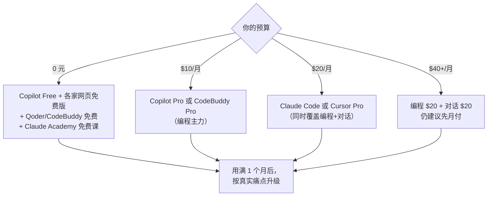

# 💬 AI 对话助手与 API 价格

> 上一篇 [[AI编程工具与订阅总览]] 讲**编程工具**；本篇讲**通用对话助手**（聊天/研究/写作）和 **API 按量计费**。
> 对你的用途：① 学 AI 时问概念、读论文；② 求职时改简历、准备话术；③ 判断"自建应用"要花多少 API 费。

> [!danger] 价格变动快，下单前查官网
> 所有数字抓取自 **2026-10-10** 的官方页面。这个领域调价频繁，**以官网为准**。
> 本篇只写我**核实过来源**的数字；核实不到的我会明确标注"以官方为准"，不猜。

---

## 一、结论先行

> [!important] 给你的配置建议
> | 用途 | 建议 | 成本 |
> |---|---|---|
> | **日常问答 / 学概念** | 用**主力编程工具自带的 Chat**（Claude Code 订阅里就含 Claude 网页版能力） | 已包含 |
> | **深度研究 / 长文写作** | 需要再单开一个**对话助手订阅**（$20 档） | $20/月 |
> | **改简历 / 面试话术** | 用免费额度即可，不必付费 | ¥0 |
> | **开发调 API** | **按量付费，不要包月**；本地开发用便宜模型 | 几美元/月起 |
>
> **核心原则**：**同一个 $20 订阅尽量覆盖两类用途**（编程 + 对话），不要为每个用途各买一个。

---

## 二、对话助手订阅（个人版）

| 服务 | 免费版 | 个人付费档 | 团队/企业 | 说明 |
|---|---|---|---|---|
| **Claude** | 有免费额度 | Pro / Max（见官网） | Team / Enterprise | 编程与长文本强；**Claude Code 走同一订阅** |
| **ChatGPT** | 有免费额度 | Plus / Pro（见官网） | Team / Enterprise | 生态最全；**Codex 走 ChatGPT 订阅** |
| **Gemini** | 有免费额度 | **Google AI Pro $19.99** / Ultra $99.99 / $199.99 | Gemini Enterprise | 与 Antigravity 编程额度共用 |
| **Grok** | 有免费额度 | 见官网 | — | 实时信息强 |
| **DeepSeek** | 免费（网页） | 极低价 API | — | **性价比最高**，中文强 |
| **Kimi / 豆包 / 通义** | 免费 | 低价档 | — | 国内直连、中文友好 |

> [!warning] 我为什么不写死具体档位价格
> Claude / ChatGPT 的付费档位和额度**近期调整频繁**，且不同地区定价不同。
> 官方入口： [claude.com/pricing](https://claude.com/pricing) · [ChatGPT 定价](https://chatgpt.com/pricing) · [Google One / AI 计划](https://one.google.com/)
> **唯一我核实到确切数字的是 Google**：$19.99 / $99.99 / $199.99 三档（2026-05-19 调价后）。

### 2.1 该订几个？

> [!tip] 一个够用，两个封顶
> **不要同时订 3 个以上对话助手**。它们能力高度重叠，而你真正需要的是"一个能持续对话、记得住上下文的主力"。
>
> **选一个主力的判断法**：
> - 你**已经为编程工具付费** → 就用同一家的对话助手（如付了 Claude Code 就用 Claude）
> - **需要联网搜索/实时信息** → Grok 或 ChatGPT
> - **中文写作/论文理解 + 预算敏感** → DeepSeek（网页免费）+ 一个海外主力

---

## 三、API 按量计费（做应用才需要）

> 这一节对你有**双重意义**：① 学习阶段调 API 要花钱；② 面试聊"AI 应用成本"时必须有量级概念。

### 3.1 三个决定成本的因素

| 因素 | 说明 | 省钱方向 |
|---|---|---|
| **输入 token** | 你发给模型的全部内容（含 RAG 检索到的文档！） | 精简 prompt、**做好 RAG 召回截断** |
| **输出 token** | 模型生成的内容 | 限制 `max_tokens`、要求简洁输出 |
| **模型档位** | 同一家不同模型价格可差 **10 倍以上** | **分级使用**：简单任务用便宜模型 |

> [!important] RAG 应用的成本陷阱
> RAG 常把检索到的**多段文档全文**塞进 prompt，输入 token 会暴涨。
> **这是 AI 应用最常见的成本失控点**——你面试被问到"RAG 怎么控成本"时要能答出来：**限制召回条数、做摘要压缩、缓存常见问答**。

### 3.2 缓存（省钱的关键机制）

主流厂商都提供 **prompt caching（提示缓存）**：
- 重复的前缀内容（如系统提示、长文档）可以**按缓存价计费，远低于正常输入价**
- Claude Code 官方文档就明确：会话历史靠 prompt caching 降低重复读取成本
- **实践启示**：把**不变的内容放前面**（系统提示、知识库），**变化的内容放后面**（用户问题），才能吃到缓存

### 3.3 成本量级参考（官方数据）

Claude Code 官方文档给出的**企业实测**（[来源](https://code.claude.com/docs/en/costs.md)）：

| 指标 | 数值 |
|---|---|
| 平均成本 | 约 **$13/开发者/活跃日** |
| 月成本 | **$150–250/开发者/月** |
| 90% 用户 | 低于 **$30/活跃日** |
| 空闲后台消耗 | **<$0.04/会话** |

> [!tip] 怎么用这个数字
> - **开发阶段**：本地调试 API，一个月几美元足够（用便宜模型）
> - **面试时**：被问"AI 应用的成本怎么估"，可以答"Agent 类应用按活跃使用估，重度用户可达每月一两百美元量级，**所以要做模型分级和缓存**"——这是加分回答
> - **别用 API 跑重度 Agent**：成本最不可控

### 3.4 便宜模型的选择

| 场景 | 建议 |
|---|---|
| 简单分类/抽取/改写 | **小模型**（如 Haiku 级、各类 Flash/Mini 级） |
| 日常对话/代码 | **中档**（Sonnet 级） |
| 复杂推理/架构设计 | **顶配**（Opus/GPT 顶配级），只在关键处用 |
| 中文任务、成本敏感 | **DeepSeek / Qwen / Kimi** 等国产，价格显著更低 |

> [!note] 各家的具体单价
> 单价是**每百万 token** 计费，且**频繁调整**，不同版本价格差很大。
> **请查各厂商定价页**（Anthropic / OpenAI / Google / DeepSeek 官网的 Pricing 页面），本文不列具体单价以免误导。

---

## 四、免费额度怎么用满

| 来源 | 免费内容 | 备注 |
|---|---|---|
| **各家网页版** | 都有免费档 | 额度有限，适合轻量 |
| **Copilot Free** | 2000 次补全/月 | 编程场景 |
| **Copilot Student** | **完整 Pro 免费** | 有学生身份的务必申请 |
| **Google Antigravity** | Individual 档免费，无限 Tab | agent 额度按周重置 |
| **Cursor Hobby** | Agent/Chat/Tab（仅 Auto 模型） | 评估用 |
| **Windsurf Free** | 25 额度/月 + 无限 Tab | 偏少 |
| **CodeBuddy Free** | 100 积分 + 活跃赠送 30/天 | **限免期额度很大** |
| **Qoder CN 社区版** | 免费 + Credits | 国内直连 |
| **Claude Academy** | **免费课程** | Claude Code 101 / in Action |
| **官方文档 + 论文** | 全部免费 | 最被低估的资源 |

> [!tip] 学生/教师身份是最大羊毛
> **Copilot Student 免费给完整 Pro**；教师与热门开源维护者也可免费用 Pro。
> 如果你或家人有在读身份，先把这个拿到手。

---

## 五、支付与网络（国内现实问题）

| 问题 | 应对 |
|---|---|
| **需要海外信用卡** | 多数海外服务支持 Visa/Mastercard；部分支持支付宝（视地区） |
| **网络不稳定** | 用国内工具（CodeBuddy / Qoder CN）做日常，海外主力的关键任务挑时段 |
| **账号风控** | 不要用共享账号/代购低价号，**可能随时被封**（Cursor 官方明确不授权第三方转售） |
| **发票/报销** | 国内工具（腾讯/阿里）开票更容易；海外工具个人版一般不开中国发票 |

> [!danger] 不要买"代充/共享号"
> Cursor 官方定价页明确写了：**订阅只通过官网直销**，第三方渠道的账号**可能被封禁或终止**。
> 求职期账号突然失效，比省那点钱损失大得多。

---

## 六、决策速查

---

## 七、避坑清单

| 坑 | 后果 |
|---|---|
| 为同一用途订多个服务 | 白花钱，且上下文分散在多个工具里 |
| 用 API 跑开发 Agent | 成本不可控（可达 $150–250/月/人） |
| RAG 不做召回截断 | 输入 token 暴涨，成本失控 |
| 把变化内容放在 prompt 前面 | **吃不到 prompt caching**，白白多付钱 |
| 买代充/共享账号 | 随时封号，求职期风险极高 |
| 信旧文章的价格 | Gemini CLI 已停服、灵码已改名、Trae 已改计费 |
| 忽视学生免费资格 | 白白错过最有价值的一项 |
| 把"免费额度"当长期方案 | 多为限时活动，随时收紧 |

---

## 八、下单一句话总结

> [!abstract] 记住这三句
> 1. **编程与对话尽量共用同一个 $20 订阅**，别为每个用途各买一份。
> 2. **求职期一律月付**；这个领域半年就可能换产品线（Google 半年调了两次价）。
> 3. **API 只按量、只用于开发和演示**，不要拿来跑重度 Agent；能省的钱全在**模型分级 + 缓存 + RAG 截断**这三件事上。

---

> [!question] 待补充
> - [ ] 各家对话助手**当前档位与额度**（需逐一核实官网，变动太快）
> - [ ] 国产模型（DeepSeek / Qwen / Kimi / GLM）编码与 Agent 能力横向对比
> - [ ] 自建 RAG 应用的**实际月度 API 账单**记录（学习阶段跑一段时间后回来填）
>
> 关联：[[AI编程工具与订阅总览]] · [[README|AI 学习规划]] · [[03-Java开发阶段]] · [[技术栈地图]]
