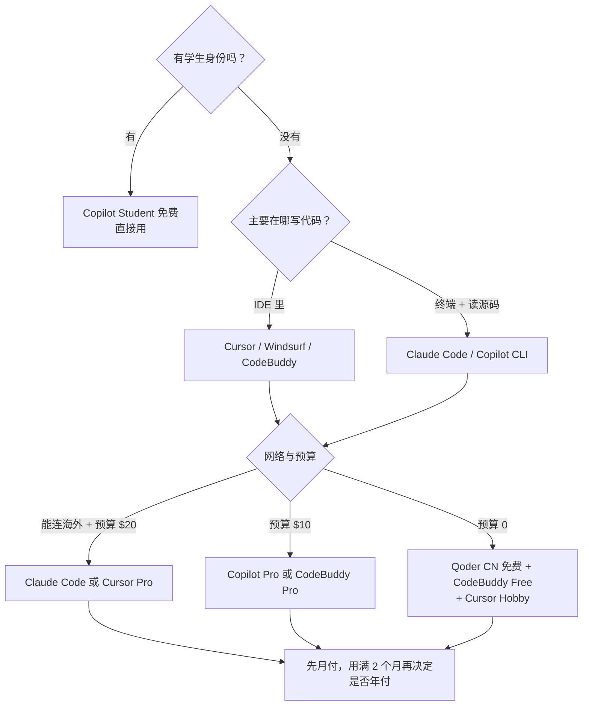

# 🧰 AI 编程工具与订阅总览

> 本篇回答：**现在有哪些 AI 编程工具、各自怎么收费、免费额度够不够用、该买哪个**。
> 面向你的情况：**Java 背景 · 待业脱产 · 目标 AI 应用开发岗**，所以重点是「性价比最高的组合」而不是"全都买"。

> [!danger] 价格会变，用前必查官网
> 这个领域**几个月就调一次价和额度**。本文所有数字都标注了来源与抓取时间（2026-10-10），但**下单前请点开官方定价页核对**。
> 写这篇时就发现了两个"很多教程已经过时"的例子：
> - **Gemini CLI 已于 2026-06-18 停止对免费/个人账号服务**，被 **Antigravity CLI** 取代（[来源](https://developers.googleblog.com/an-important-update-transitioning-gemini-cli-to-antigravity-cli/)）
> - **阿里「通义灵码」已更名为 Qoder CN**；**字节 Trae 从按次数改为按 Token 计费**
> 网上大量"XX 免费"的文章仍在引用旧信息。

---

## 一、30 秒结论：你该买什么

> [!important] 给"脱产求职、要省钱但要出活"的你
> **月付 $20 选一个主力，其余用免费额度补位。先别买年付。**
>
> | 优先级 | 选择 | 月成本 | 理由 |
> |---|---|---|---|
> | **主力（三选一）** | **Claude Code** / **Cursor Pro** / **Copilot Pro** | $10–20 | 每天写代码的生产力工具，值得付一份钱 |
> | **白嫖补位** | **Qoder CN（原灵码）免费版** + **CodeBuddy Free** | ¥0 | 国内可直连、中文友好，做补充 |
> | **先试后买** | Cursor 有免费 Hobby、Windsurf 有 2 周 Pro 试用、CodeBuddy 有 7 天试用 | ¥0 | 都试一遍再决定，别听推荐 |
> | **不要做的事** | ❌ 同时订 3 个 $20 工具 ❌ 一上来买年付 ❌ 买 $100+ 的顶配 | — | 求职期现金流优先 |
>
> **我的具体建议**：主订 **Claude Code**（见 §5 对比），因为它同时是"写代码工具"和"面试陪练/讲源码"的助手，而你的求职方向是 AI 应用开发——用它读源码、写 RAG/Agent 项目的效率优势最明显。国内网络不稳的话，把 **CodeBuddy Pro（$10）** 作为平替。

---

## 二、主流 AI 编程工具价格总表

> 数据抓取日期 **2026-10-10**，均来自官方定价/文档页。

| 工具 | 形态 | 免费版 | 入门付费 | 高阶 | 备注 |
|---|---|---|---|---|---|
| **Cursor** | IDE（VSCode 分支） | ✅ Hobby | **$20/月** Pro | Pro+ $60 · Ultra $200 | 最流行的 AI IDE |
| **Claude Code** | CLI + IDE 插件 + 桌面/Web | ❌（需订阅或 API） | 随 Claude 订阅 | 见 §3 | 终端 Agent 标杆 |
| **GitHub Copilot** | IDE 插件 + CLI | ✅ Free（2000 次补全/月） | **$10/月** Pro | Pro+ $39 · Max $100 | 最便宜的正规军 |
| **Windsurf** | IDE | ✅ Free（25 额度/月） | Pro（500 额度） | Teams $40/人 | 有 2 周 Pro 试用 |
| **Devin** | Agent 平台 + IDE | ✅ Free | **$20/月** Pro | Max $200 · Teams $80+$40/人 | 原 Cognition，主打自主 Agent |
| **Google Antigravity** | IDE + CLI + Agent 管理 | ✅ Individual 免费 | 随 Google AI 订阅 | Pro $19.99 · Ultra $99.99/$199.99 | **已取代 Gemini CLI** |
| **腾讯 CodeBuddy** | IDE + CLI | ✅ Free | **$10/月**（$96/年） | Team $40/人 | 中文友好、国内可用 |
| **Qoder CN**（原通义灵码） | IDE 插件 | ✅ 社区版 | 见官方公告 | — | 阿里，国内直连 |
| **Trae**（字节） | IDE | 有免费额度 | 按 **Token** 计费 | — | 2026 起改为 Token 计费 |

---

## 三、逐个细说

### 3.1 Cursor —— 最主流的 AI IDE

**定价**（[官方](https://cursor.com/help/account-and-billing/pricing.md)）：

| 方案 | 价格 |
|---|---|
| Hobby | **免费** |
| Start（仅印度） | ₹649/月 |
| **Pro** | **$20/月** |
| Pro+ | $60/月 |
| Ultra | $200/月 |
| Teams Standard | $40/人/月 |
| Teams Premium | $120/人/月 |
| Enterprise | 定制 |

**关键机制**（容易踩坑）：
- 大多数付费方案有**两个用量池**：**Cursor Models**（Grok 4.x 系列 + Composer 2.5）和 **Other Models**（第三方模型，按模型原价计费）
- 免费 Hobby：**只能用 Auto 模型**，用量有限（Agent / Chat / Tab 可用）
- 额度**按月重置、不结转**；用完可以开"按量付费"继续用
- **自带 API key**：个人版不计入额度（厂商直接向你收费）；**Teams/Enterprise 仍收 $0.25/百万 token 的 Cursor Token Rate**

> [!tip] 适合谁
> 喜欢**在 IDE 里完成一切**（补全 + 对话 + Agent）的人。缺点：贵，且需要理解"两个用量池"否则容易超支。

### 3.2 Claude Code —— 终端 Agent 的标杆

**计费方式**（[官方文档](https://code.claude.com/docs/en/costs.md)）：
- **按 API token 计费**；用订阅（Pro/Max）则额度含在订阅里，具体价格看 [claude.com/pricing](https://claude.com/pricing)
- 官方给出的**企业实测成本参考**：约 **$13/开发者/活跃日**，**$150–250/开发者/月**；**90% 的用户低于 $30/活跃日**
- 即使不用也在跑后台任务，消耗很低（**<$0.04/会话**）

**省钱要点**（官方推荐，很实用）：
| 手段 | 效果 |
|---|---|
| `/clear` 切换任务时清空上下文 | **最有效**，陈旧上下文每条消息都在烧钱 |
| 用 Sonnet 干活，Opus 只在复杂架构时用 | Sonnet 便宜很多，多数编码任务够用 |
| 把冗长操作交给 subagent | 日志/测试输出留在子上下文，只回传摘要 |
| 用 hooks 预处理（如先 grep ERROR） | 把上万 token 的日志压到几百 token |
| 把 CLAUDE.md 里的专项指令挪到 skills | skills 按需加载，基础上下文更小 |

> [!warning] Agent teams 很烧钱
> 官方文档明确：**Agent teams 在 plan mode 下约消耗普通会话的 7 倍 token**（每个 teammate 独立上下文）。求职期慎用。

> [!tip] 适合谁
> **最适合你的选择**。理由：① 终端里直接跑，读源码/改项目效率高；② 官方有免费课程（Claude Code 101 / Claude Code in Action）；③ 同一个订阅还能当"面试陪练"——让它按你的 [[面试准备/专业技能/02-Java核心与微服务|面试提纲]] 追问原理。

### 3.3 GitHub Copilot —— 最便宜的正规军

**定价**（[官方文档](https://docs.github.com/en/copilot/get-started/plans.md)）：

| 方案 | 价格 | 每月 AI Credits |
|---|---|---|
| **Free** | 免费 | 有额度（补全限 2000 次/月，仅自动选模型） |
| **Student** | **免费** | 有额度（需学生认证） |
| **Pro** | **$10/月** | 1,000 + 500 赠送 = **1,500** |
| Pro+ | $39/月 | 3,900 + 3,100 = **7,000** |
| Max | $100/月 | 10,000 + 10,000 = **20,000** |
| Business | $19/人/月 | 1,900/人 |
| Enterprise | $39/人/月 | 3,900/人 |

**要点**：
- 可用模型包含 Claude（Haiku/Opus 4.8/Opus 5）、Grok、Kimi K3 等，但**不同档位可用模型不同**（Pro 用不了 Opus）
- 教师、热门开源项目维护者可**免费获得 Pro**
- ⚠️ 注意：有报道称 **GitHub 已从付费计划中移除免费模型**（[heise](https://www.heise.de/en/news/GitHub-removes-free-models-from-Copilot-plans-11275252.html)），额度消耗规则请以官方为准

> [!tip] 适合谁
> **预算最紧的首选**：$10/月是所有正规军里最便宜的。有学生身份的话直接免费用。

### 3.4 Windsurf / Devin / Antigravity

**Windsurf**（[官方文档](https://docs.windsurf.com/zh/windsurf/accounts/usage)）：
| 方案 | 内容 |
|---|---|
| Free | **25 提示额度/月**，无限 Tab/预览，每日 1 次部署 |
| Pro Trial | **2 周免费**，100 额度 |
| Pro | **500 额度**，附加额度 $10/250 |
| Teams | 500 额度/人/月，附加 $40/1000 |

额度按月发放**不结转**；附加额度**不过期**。

**Devin**（[官方](https://devin.ai/pricing)）：Free $0 / **Pro $20** / Max $200 / Teams $80 + $40/人。亮点是 Pro 含 SWE-2 模型的免费使用（限时）。

**Google Antigravity**（[官方博客](https://antigravity.google/blog/changes-to-antigravity-plans)）：
- **Individual 档免费**：无限 Tab 补全、无限 Command，**agent 额度按周重置**
- 付费额度**搭载在 Google AI 订阅**上（没有单独的 Antigravity 订阅）：**$19.99**（AI Pro）/ **$99.99**（Ultra 5x）/ **$199.99**（Ultra 20x）
- 付费额度**每 5 小时刷新**，有周上限；**不结转**
- ⚠️ **2026-06-18 起 Gemini CLI 不再服务免费/个人 Google 账号**，由 Antigravity CLI 取代（**所有档位免费获得 CLI**）

> [!note] 一个重要的行业信号
> Google 在 2026-05-19 **半年内第二次调价**：新增 $99.99 档、顶配从 $249.99 降到 $199.99，并把不同 Gemini 模型的独立限额合并成一个池。
> **这说明：不要基于"当前额度"做长期承诺，尽量月付。**

### 3.5 国内可用选项（对你的网络环境更友好）

**腾讯 CodeBuddy**（[官方定价](https://www.codebuddy.ai/docs/zh/ide/Account/pricing)）：

| 方案 | 价格 | 积分/月 |
|---|---|---|
| **Free** | 免费 | 100 + 活跃赠送 30/天；补全 5,000 次/月 |
| **Pro** | **$10/月** 或 $96/年（$8/月） | 1,000 + 1,000 = **2,000**；活跃赠送 50/天；补全**无限** |
| Team | $40/人/月 | 1,000/人 + 团队共享池 |

> [!tip] 限免活动（要把握）
> 官方页面写明：**Free 版限免期间可全模型可选、代码补全不限次、自动任务 99 个**，且 Pro 有 **7 天试用**。
> **限免结束后恢复档位额度**，活动结束时间以官方为准。

**其他国内工具**：
| 工具 | 状态 |
|---|---|
| **Qoder CN**（原通义灵码，阿里） | 有**免费社区版 + Credits**；计费模式有调整公告，[见官方](https://cn.aliyun.com/notice/118264) |
| **Trae**（字节） | **已从"按次数"改为"按 Token"计费**（[报道](https://m.ithome.com/html/0923234.htm)），额度规则变化较大，用前查官网 |

> [!warning] 关于"国内免费"
> 国内工具的免费额度通常**限时活动**（如 CodeBuddy 的限免），且**模型能力与海外顶配仍有差距**。
> 建议策略：**国内工具做日常补全 + 海外主力做复杂 Agent 任务**，而不是二选一。

---

## 四、订阅 vs 按量（API）怎么选

| 方式 | 适合 | 风险 |
|---|---|---|
| **包月订阅** | 每天用、用量可预测 | 用不满就浪费；额度可能中途改规则 |
| **按量 API** | 用量小或波动大 | **容易超支**（Claude Code 实测可达 $150–250/人/月） |
| **免费额度** | 评估阶段、轻量使用 | 能力受限、随时可能收紧 |

> [!important] 给你的建议
> **求职期（脱产、无收入）优先"一个月付主力 + 国内免费号补位"**，总成本控制在 **$10–20/月**。
> 拿到 offer 后如果公司不报销，再考虑升配。
> **不要用按量 API 跑 Agent**——那是成本最不可控的方式。

---

## 五、怎么选：一个能落地的决策法

---

## 六、不要踩的坑

| 坑 | 说明 |
|---|---|
| **买年付** | 这个领域半年就调价/换产品线（Google 半年调两次），年付容易套牢 |
| **同时订多个 $20 工具** | 功能重叠严重，求职期没必要 |
| **忽略"额度不结转"** | 几乎所有工具都**按月重置、当月有效**，用不完就浪费 |
| **不知道有两个用量池**（Cursor） | 第三方模型按原价扣费，容易超预期 |
| **用顶配档做日常开发** | $100–200 档是给重度 Agent 用户的，普通开发用不满 |
| **只看"免费"标签** | 很多"免费"是**限时活动**（CodeBuddy 限免）或**额度极少**（Windsurf 25/月） |
| **忘了 `/clear`**（Claude Code） | 不清上下文，一条消息也在为整个长会话付费 |
| **信过时教程** | Gemini CLI 已停服、灵码已改名、Trae 已改计费——**一律以官网为准** |

---

## 七、结合你的学习路线

| 阶段 | 工具用法 | 对应笔记 |
|---|---|---|
| **基础（LLM/Prompt）** | 用主力工具的 Chat 加免费版对比，理解不同模型差异 | [[02-基础阶段]] |
| **Java + RAG** | **重点**：用 Claude Code 读 Spring AI / 向量库源码，边读边问 | [[03-Java开发阶段]] |
| **Agent + 工程化** | 用 Agent 模式搭工作流；注意 token 成本（用 Sonnet 级模型） | [[04-高级架构阶段]] |
| **求职冲刺** | 让 AI 按面试提纲**追问原理**；把项目 STAR 卡片喂进去做模拟面试 | [[05-项目与求职阶段]] |

> [!tip] 一个高性价比用法
> 你已有大量笔记（Java/JVM/Kafka/Flink/Doris 共 49 篇）。可以把它们喂给主力工具做**定制化追问**：
> "基于我这份 JVM 笔记，模拟面试官追问我三色标记的漏标问题，一次问一个。"
> 这比通用题库更贴近你的实际掌握情况，且**不额外花钱**。

---

## 八、快速核对清单（下单前）

- [ ] 打开**官方定价页**确认当前价格（不要信本文以外的旧文章）
- [ ] 确认**额度是否结转**、**重置周期**
- [ ] 确认免费试用期（Cursor Hobby / Windsurf 2 周 / CodeBuddy 7 天）
- [ ] 有学生/教师/开源维护者身份 → **先申请免费**（Copilot Student / Pro）
- [ ] 选**月付**，不选年付
- [ ] 检查网络与支付方式（国内工具可微信/支付宝，海外需信用卡）
- [ ] 记下**下次复核日期**（建议 1 个月后）

---

> [!question] 待补充
> - [ ] 各家**实际额度消耗速度**对比（需要真实使用数据）
> - [ ] 团队/企业采购流程（拿到 offer 后回来补）
> - [ ] 国产模型的 Agent 能力对比（Qwen / DeepSeek / Kimi 在编码上的表现）
>
> 关联：[[README|AI 学习规划]] · [[技术栈地图]] · [[03-Java开发阶段]] · [[每日进度]]
