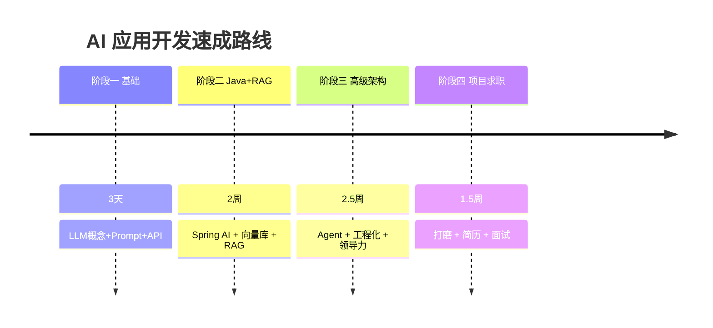

# 🎯 AI 学习规划

> [!abstract] 我的定位
> **AI 应用开发方向 · 目标岗位：AI 开发总监 / AI 技术负责人**
> Java 背景 · 待业脱产 · 需**快速**精通 AI 应用开发

> [!info] 核心数据
> - 现状：Java 程序员，失业脱产
> - 周期：标准 12 周，压缩版 **6-8 周**
> - 方向：AI **应用**开发（不学炼丹）
> - 差异化：**Java + Spring 生态 + RAG + Agent + 企业级工程化**

## 为什么是这个定位

- **Java 是优势**：企业级 AI 应用落地（RAG、Agent、工作流）大多跑在 Spring 生态上，Java 工程师是稀缺的"能把 AI 接到业务里"的人。
- 总监/负责人比拼的不是训练模型，而是：**架构设计 + 业务落地 + 带团队**。

> [!note] 学习原则
> 1. 80% 时间写代码，20% 时间看理论
> 2. 周周有产出，阶段结束必须有可演示的项目
> 3. 以终为始：一切围绕"几周后能拿 offer"
> 4. 每天打卡复盘（用 [[模板-每日打卡]]）

## 🗺️ 学习路线（12 周 / 压缩 6-8 周）

| 阶段 | 标准周期 | 压缩周期 | 主题 | 产出 |
| --- | --- | --- | --- | --- |
| [[01-学习路径总览#阶段一|阶段一 基础]] | 第 1 周 | 3 天 | LLM + Prompt + API 工程 | 命令行聊天机器人 |
| [[01-学习路径总览#阶段二|阶段二 Java+AI]] | 第 2-4 周 | 2 周 | Spring AI + RAG | 完整 RAG 应用 |
| [[01-学习路径总览#阶段三|阶段三 高级架构]] | 第 5-8 周 | 2.5 周 | Agent + 工程化 + 领导力 | Agent 产品 + 架构方案 |
| [[01-学习路径总览#阶段四|阶段四 项目求职]] | 第 9-12 周 | 1.5 周 | 项目 + 简历 + 面试 | 简历 + 3 代表作 |

## 📚 文档导航

- [[01-学习路径总览]] —— 主线路线（每周任务）
- [[02-基础阶段]] —— 阶段一（3 天）
- [[03-Java开发阶段]] —— 阶段二（2 周）
- [[04-高级架构阶段]] —— 阶段三（2.5 周）
- [[05-项目与求职阶段]] —— 阶段四（1.5 周）
- [[技术栈地图]] —— 全栈技能一览
- [[实战项目]] —— 简历用项目清单
- [[面试准备]] —— 高频题 + 领导力视角
- [[论文精读/李沐论文精读系列一-四篇经典论文]] —— ResNet/Transformer/GAN/BERT 精读
- [[每日进度]] —— 打卡汇总 + 甘特图 + 里程碑
- [[模板-每日打卡]] —— 每日打卡模板（配合日历插件）

## 🏷️ 全部标签

#AI #学习规划 #求职 #Java #RAG #Agent

---
*此文档由 Obsidian 渲染，支持双链跳转、Mermaid 图、Callout。*
