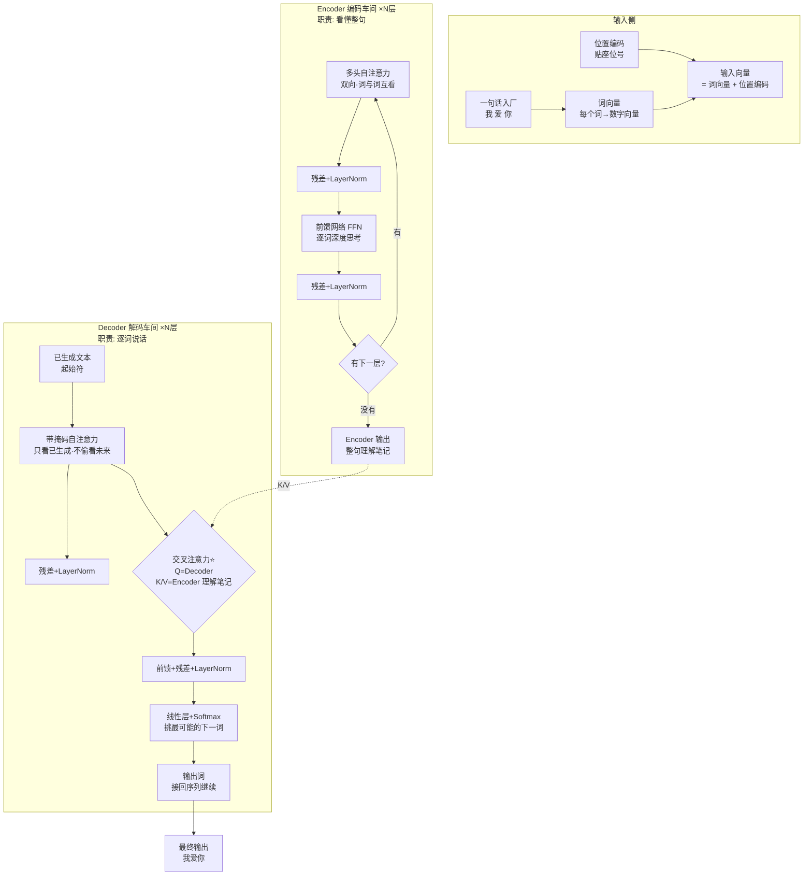
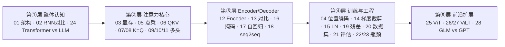

# 00-Transformer 入门总览

> [!abstract] 这份文档是干什么的
> 给「零基础小白」用的 **Transformer 速通地图**。不看公式、不讲推导，先用 3 张图和 1 个比喻建立整体感，然后顺着链接进入每道题学细节。

## 🗺️ 一图看懂：Transformer 全家福

---

## 🧩 它到底是什么？（一个比喻）

把 Transformer 想象成一家**翻译工厂**：

| 车间 | 比喻 | 职责 | 对应题号 |
|---|---|---|---|
| 词向量 | 给词做"数字编号" | 文字变数字 | [[01-聊一聊Transformer的架构和基本原理]] |
| 位置编码 | 贴"座位号" | 告诉顺序 | [[04-Transformer的位置编码是怎样的]] |
| 自注意力 | 全场人互使眼色 | 谁和谁关系近 | [[06-self-attention中的K和Q是用来做什么的]] |
| 多头 | 请一群侦探各管一摊 | 多种关系一起抓 | [[09-为什么Transformer采用多头注意力机制]] |
| Encoder | 阅读理解车间 | 双向看懂整句 | [[12-对Transformer的Encoder模块的理解]] |
| Decoder | 说话车间 | 逐词自回归生成 | [[13-Decoder和Encoder的多头自注意力相同吗]] |
| 残差+LN | 安全绳 + 质检 | 深层也能稳定训练 | [[19-残差连接可以缓解梯度消失吗]] · [[15-为什么用LayerNorm而不是BatchNorm]] |

## 📚 知识地图：28 题的逻辑分组

## 🎯 学习路线（建议顺序）

> [!success] 小白 5 步走
> 1. **建立整体**：先读本页（1 分钟）+ [[01-聊一聊Transformer的架构和基本原理]]
> 2. **啃下注意力**：[[06-self-attention中的K和Q是用来做什么的]] → [[05-计算attention用的是点乘还是加法]] → [[09-为什么Transformer采用多头注意力机制]]
> 3. **弄清编解码**：[[12-对Transformer的Encoder模块的理解]] → [[13-Decoder和Encoder的多头自注意力相同吗]] → [[17-什么是自回归属性autoregressive-property]]
> 4. **工程扫盲**：[[22-Transformer模型的性能瓶颈在哪]] → [[23-怎样缓解Transformer的性能瓶颈]]
> 5. **扩展视野**：[[25-了解ViT吗]] → [[26-了解ViLT吗]] → [[28-chatGLM和GPT在结构上有什么区别]]

## 🔗 全部题目索引

> [!info] 点击进入每道题的详细讲解
> [01 架构](01-聊一聊Transformer的架构和基本原理) · [02 RNN对比](02-使用Transformer解决了RNN面临的什么问题) · [03 显存](03-Transformer的哪个部分最占用显存) · [04 位置编码](04-Transformer的位置编码是怎样的) · [05 点乘vs加法](05-计算attention用的是点乘还是加法) · [06 QKV](06-self-attention中的K和Q是用来做什么的) · [07 K=Q?](07-K和Q可以使用同一个值吗) · [08 K=Q影响](08-让K和Q变成同一个矩阵的影响) · [09 多头](09-为什么Transformer采用多头注意力机制) · [10 head数](10-head能否无限增多) · [11 降维](11-多头注意力需要降维吗) · [12 Encoder](12-对Transformer的Encoder模块的理解) · [13 Decoder对比](13-Decoder和Encoder的多头自注意力相同吗) · [14 梯度裁剪](14-了解梯度裁剪Gradient-Clipping吗) · [15 LayerNorm](15-为什么用LayerNorm而不是BatchNorm) · [16 Attention Masking](16-注意力遮蔽Attention-Masking的工作原理) · [17 自回归](17-什么是自回归属性autoregressive-property) · [18 seq2seq](18-如何实现序列到序列的映射) · [19 残差连接](19-残差连接可以缓解梯度消失吗) · [20 大数据集](20-如何处理大型数据集) · [21 评估](21-如何评估Transformer的性能和效果) · [22 瓶颈](22-Transformer模型的性能瓶颈在哪) · [23 缓解瓶颈](23-怎样缓解Transformer的性能瓶颈) · [24 LLM区别](24-Transformer和LLM有哪些区别) · [25 ViT](25-了解ViT吗) · [26 ViLT](26-了解ViLT吗) · [27 ViLT应用](27-ViLT如何应用于图像识别任务) · [28 GLM vs GPT](28-chatGLM和GPT在结构上有什么区别)

---
> [!info] 导航
> 返回 [[Transformer 面试题]] · 进入 [[面试准备]] · 主规划 [[README]]