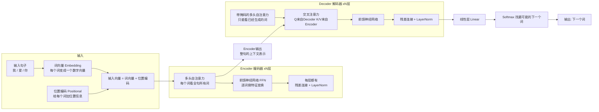

# 01-聊一聊 Transformer 的架构和基本原理

> [!question] 面试官想考什么
> 这道题是 Transformer 的"开胃菜"，面试官想确认：你真的**理解**整个模型长什么样、每块在干嘛，而不是只会背公式。

## 🍼 大白话：先把它当一条流水线

想象一家**翻译工厂**（机器翻译就是 Transformer 的成名场景）：

- 工厂大门进来一句英文句子。
- **第一步：把每个单词变成一个"数字编号"**（这一步叫 Embedding 词向量）。
- 句子有先后顺序，工厂要给每个词贴上一个"位置标签"，不然机器分不清"我打你"和"你打我"（这一步叫位置编码）。
- 然后句子进入**编码车间（Encoder）**，车间里的工人（注意力机制）会看完整句话，理解每个词和其他词的关系。
- 编码完成后，进入**解码车间（Decoder）**，这里会**一个字一个字**地往外吐中文，每吐一个词，就回头看看原文（交叉注意力）和已经翻译出的内容，再决定下一个词。
- 最后车间门口有个**质检员**（Softmax），在所有候选词里挑出概率最高的那个词。

> [!tip] 记忆锚点
> 一句话总结：**先编码理解，再逐字生成**。Encoder 负责"看懂"，Decoder 负责"说话"。

## 📖 详细讲解

### 整体结构图



### 每个零件的职责（小白版）

| 零件            | 类比       | 干什么的            |
| ------------- | -------- | --------------- |
| 词向量 Embedding | 给词贴"编号"  | 把文字变成机器能算的数字    |
| 位置编码          | 贴"座位号"   | 告诉模型词的先后顺序      |
| 多头自注意力        | 多个"关系侦探" | 找出每个词和谁关系密切     |
| 前馈网络 FFN      | "深度思考"环节 | 对每个词单独做一次非线性变换  |
| 残差连接          | "安全绳/捷径" | 防止网络太深学不动       |
| LayerNorm     | "标准化车间"  | 让数值稳定，训练更快      |
| Softmax       | "抽签机"    | 把分数变成概率，挑出最可能的词 |

### 核心公式（能看懂就够）

$$Attention(Q,K,V) = softmax\left(\frac{QK^T}{\sqrt{d_k}}\right)V$$

- $QK^T$：问所有词"咱们关系多近？"（算相似度）
- $\sqrt{d_k}$：防止分数太大，softmax 失灵（缩放）
- softmax：把分数变成"0~1 的权重"（哪些词值得关注）
- 乘以 V：按关注程度把信息加权汇总

> [!note] 关于层数 N
> 上面 Encoder 和 Decoder 都写"xN层"——原版论文用 N=6，就是"车间里叠 6 层一样的工位"。层数越多，模型越"深"，理解能力越强，但也越吃算力。

## 🎯 面试怎么答（话术模板）

```
"Transformer 是一个基于纯注意力机制的编码器-解码器架构。
输入先做词嵌入和位置编码，进入 N 层 Encoder 做双向理解，
每层包括多头自注意力和前馈网络，配合残差连接和 LayerNorm；
然后 Decoder 通过带掩码的自注意力保证自回归逐词生成，
再用交叉注意力从 Encoder 取上下文信息，
最后经过线性层和 Softmax 输出下一个词的概率。
相比 RNN，它的优势是能并行计算，且任意两个词之间的路径长度都是 1，
所以长距离依赖处理得更好。"
```

## 🔗 相关知识链接

- 每个词怎么"互相看"？→ [[06-self-attention中的K和Q是用来做什么的]]
- 为什么要有多个"关系侦探"？→ [[09-为什么Transformer采用多头注意力机制]]
- 为什么"安全绳"这么重要？→ [[19-残差连接可以缓解梯度消失吗]]
- Encoder 和 Decoder 区别？→ [[13-Decoder和Encoder的多头自注意力相同吗]]

---
> [!info] 导航
> 返回 [[Transformer 面试题]] · 下一题 → [[02-使用Transformer解决了RNN面临的什么问题]]