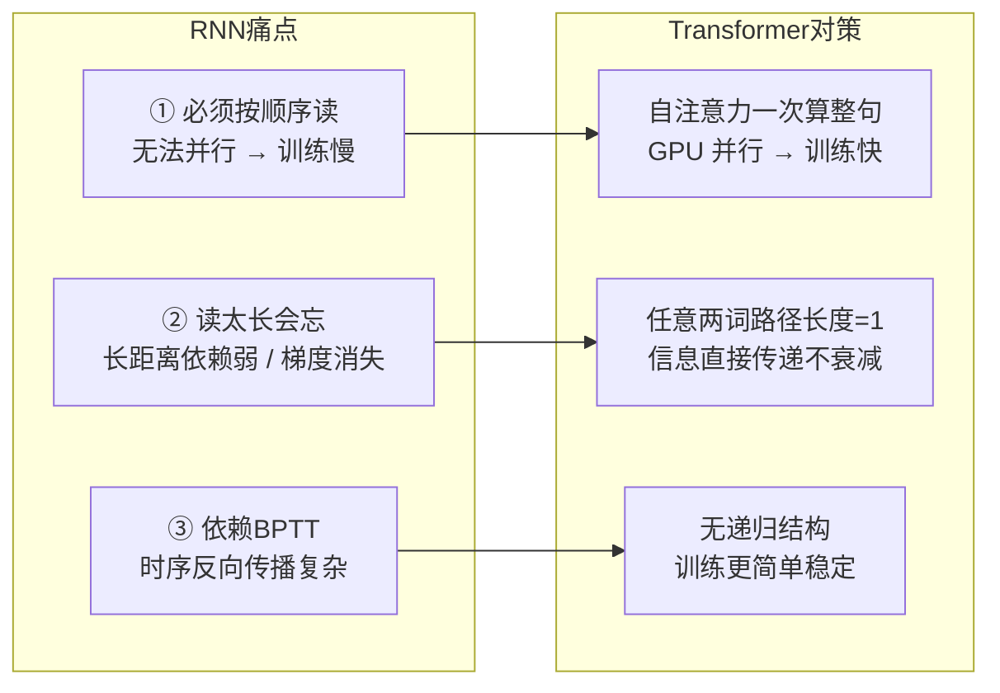

# 02-使用 Transformer 解决了 RNN 面临的一些什么问题

> [!question] 面试官想考什么
> 想确认你知道 Transformer 为什么是"革命性"的——它到底比老前辈 RNN/LSTM 强在哪。这一题答好，后面很多题都有铺垫。

## 🍼 大白话：RNN 是"一个词一个词排队读书的人"

想象 RNN 是个**读书的人**：

- 他读句子时，**必须一个字一个字挨着读**：先读"我"，记住；再读"爱"，结合前面记住的；再读"你"……一步都不能跳，不然就读不懂。
- 读得越长，前面记住的内容就**越模糊**（就像背书背到后面忘了前面）。
- 如果让他同时读 100 个句子（并行），他做不到——因为每次只能读一个。

Transformer 则不同：它像一群**「互相使眼色的全屋人」**——屋里所有人同时看到整个句子，彼此直接打招呼，不用排队。

## 📖 详细讲解

### RNN 的三大痛点 → Transformer 的对策



### 逐条对比表

| 问题 | RNN/LSTM | Transformer |
|---|---|---|
| **能否并行** | ❌ 必须按时间步逐个计算 | ✅ 整句同时计算 |
| **长距离依赖** | ⚠️ 信息多步传递会衰减/丢失 | ✅ 任意两词之间只需一次"目光接触" |
| **梯度消失/爆炸** | ⚠️ 长链反传容易爆/消失 | ✅ 残差+直接路径，梯度好走 |
| **训练速度** | 慢 | 快（GPU 友好） |
| **新代价** | — | O(n²) 注意力复杂度、需要位置编码 |

> [!warning] 面试加分：说完优点，主动说"代价"
> 高级候选人会补一句：Transformer 也不是免费的——自注意力是 O(n²) 复杂度，序列越长越贵；而且它天生分不清词序，必须靠位置编码补上；自回归生成时 Decoder 依然是逐词串行。
> 这样答显得你**辩证、懂权衡**，而不是只会吹。

## 🎯 面试怎么答（话术模板）

```
"RNN 最大的问题是两个：一是必须按时间步串行计算，没法并行，训练慢；
二是长距离依赖弱，信息经过多步传递会衰减，伴随梯度消失。
Transformer 用自注意力机制解决：任意两个位置之间的计算路径都是 1 步，
可以直接建模长距离依赖，而且整句可以并行计算。
当然它也引入了新的代价，比如 O(n²) 的注意力复杂度，以及需要位置编码来补充顺序信息。"
```

## 🔗 相关知识链接

- 什么叫"梯度消失"？和残差连接的关系 → [[19-残差连接可以缓解梯度消失吗]]
- 怎么解决 O(n²) 的代价？→ [[23-怎样缓解Transformer的性能瓶颈]]
- Transformer 为什么要位置编码？→ [[04-Transformer的位置编码是怎样的]]

---
> [!info] 导航
> 返回 [[Transformer 面试题]] · 上一题 [[01-聊一聊Transformer的架构和基本原理]] · 下一题 → [[03-Transformer的哪个部分最占用显存]]