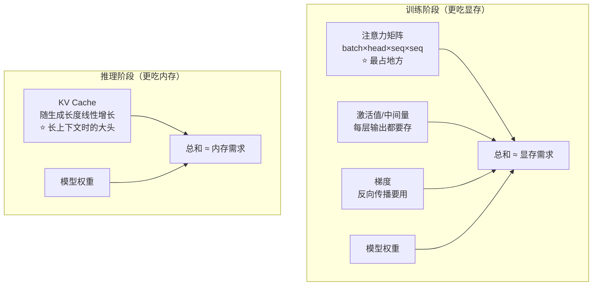

# 03-Transformer 的哪个部分最占用显存

> [!question] 面试官想考什么
> 考察你是否理解 Transformer **在真实运行时资源花在哪**。会答这个说明你不只懂"纸面公式"，还知道落地时的瓶颈。

## 🍼 大白话：显存就像"工位面积"

GPU 显存可以理解成**一张工位**，模型和中间计算数据都得放下，放不下就报"OOM（内存溢出）"。

Transformer 运行时占用显存的，主要是**临时算出来的中间结果（激活值）**，其中最"吃地方"的是——**注意力分数矩阵（attention scores）**。

为什么？因为它的大小是 **batch × 头数 × 序列长度 × 序列长度**，序列长度一翻倍，它直接**平方级变大**（4 倍、9 倍、16 倍……），训练时还要把它存着用来反向传播。

## 📖 详细讲解

### 显存花在哪了（训练 vs 推理）



### 核心结论

| 阶段 | 最大头 | 特点 |
|---|---|---|
| **训练** | 注意力矩阵 | 随序列长度**平方级**增长（最夸张） |
| **训练** | 激活值 | 中间量，逐层都要存 |
| **推理** | KV Cache | 随生成 token 数**线性**增长，长上下文时最占 |

> [!note] 什么是 KV Cache？
> Decoder 每生成一个词，都要重新"回想"前面所有词。为了不每次重算，就把前面每个词的 K、V 缓存起来。生成的词越多，缓存越大。这也是为什么长对话 / 长文章特别吃内存。

### 如果面试官追问"怎么缓解"（加分）

1. **FlashAttention**：不把整个注意力矩阵存下来，分块算、算完就扔 → 内存从 O(n²) 降到 O(n)。
2. **梯度重计算（activation checkpointing）**：反向传播时重新算一遍，用算力换显存。
3. **序列并行**：把超长序列拆到多张卡。
4. 推理侧：**KV Cache 量化**、**GQA（分组查询注意力）** 减少缓存体积。

## 🎯 面试怎么答（话术模板）

```
"训练阶段最占显存的是注意力矩阵，因为它的大小是 batch×head×序列长度²，
随序列长度平方级增长，而且反向传播需要保留它。
其次是各层的激活值。推理阶段则是 KV Cache 成为大头，随生成长度线性增长。
缓解方案包括 FlashAttention 降低注意力显存、梯度重计算、
以及推理侧的 KV Cache 量化和 GQA。"
```

## 🔗 相关知识链接

- FlashAttention 和更多缓解手段 → [[23-怎样缓解Transformer的性能瓶颈]]
- 为什么要缓存 K/V？先看 K/Q/V 是什么 → [[06-self-attention中的K和Q是用来做什么的]]
- 为什么序列长这么费资源 → [[22-Transformer模型的性能瓶颈在哪]]

---
> [!info] 导航
> 返回 [[Transformer 面试题]] · 上一题 [[02-使用Transformer解决了RNN面临的什么问题]] · 下一题 → [[04-Transformer的位置编码是怎样的]]