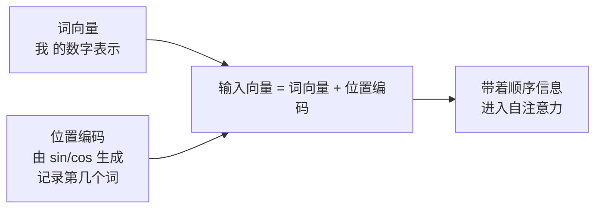

# 04-Transformer 的位置编码是怎样的

> [!question] 面试官想考什么
> 自注意力"不分先后"，而语言最讲究顺序。面试官想知道你懂不懂这个矛盾，以及 Transformer 是怎么解决的。答好这题要会说"为什么需要"+"怎么做"+"有哪些方案"。

## 🍼 大白话：为什么机器分不清"我打你"和"你打我"

Transformer 的自注意力工作时，是把**整句话的所有词一起看**，就像大家开会围坐一圈——**圈里座位打乱了顺序，大家依然能说清谁是谁**。对机器来说，"我打你"和"你打我"包里的词一模一样，只是顺序不同。

如果不做任何处理，机器会认为这两个句子是**同一个意思**——这就出大问题了。

所以必须给每个词**贴上"座位号"（位置编码）**，告诉模型："我是第 1 个词、你是第 2 个词……顺序是这样的"。

## 📖 详细讲解

### 位置编码是怎么"造"出来的

最初论文用**正弦/余弦函数**生成位置编码，给每个位置生成一串"指纹数字"：

$$PE_{(pos, 2i)} = \sin(pos / 10000^{2i/d_{model}})$$
$$PE_{(pos, 2i+1)} = \cos(pos / 10000^{2i/d_{model}})$$

不用背公式，理解三点就够：

1. **pos** = 这是第几个位置（第几个座号）；
2. **不同维度用不同频率**的波浪（sin/cos），就像条形码的不同条纹——不同位置组合出**独一无二的数字串**；
3. 生成好后**直接加到词向量上**，机器就知道每个词在第几位。



### 位置编码家族（进阶必知）

| 方案 | 怎么做的 | 谁在用 | 优点 |
|---|---|---|---|
| **三角函数编码** | sin/cos 直接生成 | 原版 Transformer | 不用学、天然可外推 |
| **可学习编码** | 训练时让模型自己学 | BERT | 更灵活，但超长要插值 |
| **RoPE 旋转编码** | 把位置"转"进 Q/K | GPT、Llama、GLM | 天然支持相对位置，可外推长上下文 |
| **ALiBi 偏差法** | 按距离加个线性惩罚 | 部分开源模型 | 简单直接、好外推 |

> [!tip] 关键词："相对位置"
> 位置编码分两种思考方式：**绝对位置**（我是第 5 个词）vs **相对位置**（我在你后面 3 个）。RoPE 能表达相对位置，所以对长文本更友好——这是现在的主流方案。

## 🎯 面试怎么答（话术模板）

```
"Transformer 的自注意力是置换不变的，也就是它对词的顺序不敏感，
但语言是顺序敏感的，所以必须加位置编码。
原版用三角函数生成绝对位置编码，直接叠加到词向量上；
它不需要学习参数，而且通过三角恒等式能表达相对位置关系。
后续演进有 BERT 的可学习编码，以及 GPT/Llama 采用的 RoPE 旋转编码，
能更好地支持相对位置和外推长上下文。"
```

## 🔗 相关知识链接

- 位置编码是加在词向量上的，词向量是什么？→ [[01-聊一聊Transformer的架构和基本原理]]
- 为什么自注意力"不分顺序"？→ [[06-self-attention中的K和Q是用来做什么的]]
- 长上下文外推困难是这个引起的 → [[22-Transformer模型的性能瓶颈在哪]]

---
> [!info] 导航
> 返回 [[Transformer 面试题]] · 上一题 [[03-Transformer的哪个部分最占用显存]] · 下一题 → [[05-计算attention用的是点乘还是加法]]