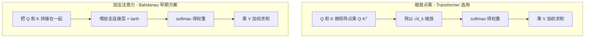

# 05-Transformer 在计算 attention 的时候使用的是点乘还是加法

> [!question] 面试官想考什么
> 这是细节题，考察你对注意力机制**内部实现**是否清楚。核心答案是"缩放点乘"，重点是能说出**为什么选点乘**和**为什么加 sqrt(d_k) 缩放**。

## 🍼 大白话：算"关系多亲"有两种方式

要判断 A 和 B 有多"亲密"，有两种算法：

- **法一（点乘）**：把 A 和 B 各自的"数字指纹"拉直，然后**按位相乘再相加**，一下就得出一个分数。又快又简单。
- **法二（加法）**：把 A 和 B 的指纹**接在一起**，喂给一个"神经网络裁判员"打分，参数多一些、慢一些。

Transformer 选了**法一（点乘）**，因为又快、又适合 GPU 批量运算。就像评选班花，直接比分数表（点乘）比挨个找评委打分（加法）快得多。

## 📖 详细讲解

### 两种注意力对比



### 为什么选点乘？（三个理由背下来）

1. **算得快**：点乘本质是矩阵乘法（GEMM），GPU 高度优化；加法注意力要拼接 + 全连接 + tanh，慢得多。
2. **整齐好并行**：一次 $QK^T$ 就算出所有"词对"的分数，浑然天成。
3. **好缩放**：见下面为什么除以 $\sqrt{d_k}$。

### 关键考点：为什么除以 $\sqrt{d_k}$？

面试官一定会追问这一点：

- 当向量维度 $d_k$ 很大时，点乘算出的分数**方差会变大**（数字很大或很小）；
- 分数太大，经过 softmax 后权重会**两极分化**（几乎 1 或几乎 0），落入 softmax 的"饱和区"，梯度非常小 → **模型学不动**；
- 除以 $\sqrt{d_k}$ 把分数**压缩回正常的量级**，softmax 保持在敏感区，梯度大、好训练。

$$Attention(Q,K,V) = softmax\left(\frac{QK^T}{\sqrt{d_k}}\right)V$$

> [!tip] 记忆口诀
> 点乘 + 缩放 + softmax + 加权 = "缩放点乘注意力"。三个词记住原理：**快、并行、防饱和**。

## 🎯 面试怎么答（话术模板）

```
"Transformer 用的是缩放点乘注意力，而不是加法注意力。
一是点乘可以用高效的矩阵乘法，GPU 上非常快；
二是它一次性算出所有 token 对的相似度，适合并行；
三是点乘需要配合除以 sqrt(d_k) 的缩放——
当维度较大时点积方差会变大，softmax 容易饱和、梯度消失，
缩放后能让注意力分布更稳定、更好训练。"
```

## 🔗 相关知识链接

- Q、K、V 分别是什么？→ [[06-self-attention中的K和Q是用来做什么的]]
- 注意力算出来的权重怎么用？→ [[01-聊一聊Transformer的架构和基本原理]]
- 多组注意力并行？→ [[09-为什么Transformer采用多头注意力机制]]

---
> [!info] 导航
> 返回 [[Transformer 面试题]] · 上一题 [[04-Transformer的位置编码是怎样的]] · 下一题 → [[06-self-attention中的K和Q是用来做什么的]]