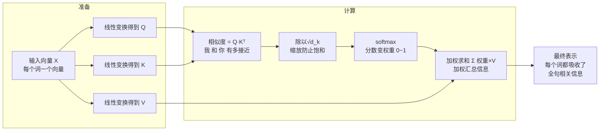

# 06-self attention 中的 K 和 Q 是用来做什么的

> [!question] 面试官想考什么
> 这是注意力机制的"地基题"。答好了，后面 Q=K、多头、掩码那些题都从这棵树上长出来。核心是要把 Q、K、V 三个角色的分工讲清楚。

## 🍼 大白话：用"图书馆检索"理解 Q、K、V

想象你在图书馆找书：

- **Q（Query，你的问题/需求）** = 你在搜索框输入的关键词："如何训练大模型"。
- **K（Key，每本书的标签）** = 每本书上贴的标签："机器学习"、"深度学习"、"生物学"……
- **V（Value，书的内容）** = 书里**真正的内容**。

流程是：你的**问题（Q）** 去和每本书的**标签（K）** 比对，算出和谁最像（相似度），然后按相似度把**书的内容（V）** 加权取出来。和你最相关的书，占的分量最大。

> [!tip] 记忆锚点
> - **Q = Query**：我在找什么（我发出的提问）
> - **K = Key**：我能提供什么（每个词的标签）
> - **V = Value**：真正要拿走的信息（内容本身）
> - **流程 = Q 问所有 K → softmax 打分 → 按分取 V**

## 📖 详细讲解

### 自注意力完整流程图



### 每一步在干嘛（白话版）

| 步骤 | 白话 | 实际动作 |
|---|---|---|
| Q/K/V 生成 | 给每个词造三份"化身" | X 分别乘三个权重矩阵 $W_Q, W_K, W_V$ |
| 算相似度 | "我"问每个词：咱俩近不近？ | $QK^T$ |
| 缩放 | 防止分数过大崩掉 | 除以 $\sqrt{d_k}$ |
| Softmax | 把分数变成"关注比例" | 权重和为 1 |
| 加权求和 | 按比例把大家信息"揉"进来 | 权重 × V 求和 |

### 举个"句子"的例子

句子："**猫** 追 老鼠"。计算"**猫**"这个词的表示时：

1. "猫"发出 Q：我是猫，谁和我有关？
2. 逐个比对 K："追"和"老鼠"都纷纷回答相似度。
3. softmax 后，"老鼠"权重最高（因为"追——老鼠"关系强）。
4. 于是"猫"的新向量 = 一点"猫"自己 + 一点"追" + 比较多"老鼠"的信息 → 猫的表示里就包含了"猫在追老鼠"的语义。

## 🎯 面试怎么答（话术模板）

```
"Q 代表查询，是当前 token 想找什么；K 代表键，是每个 token 的标识/属性；
V 代表值，是真正被取走的信息。
计算时，Q 和所有 K 做点积得到相似度，经过 softmax 变成权重，
最后对 V 加权求和。整个过程可以类比图书馆检索：
Q 是查询词，K 是索引标签，V 是书的内容，
相似度决定我们吸收多少内容。"
```

## 🔗 相关知识链接

- 这个相似度公式里为什么要除以 √d_k？→ [[05-计算attention用的是点乘还是加法]]
- 如果 Q 和 K 用同一个矩阵会怎样？→ [[07-K和Q可以使用同一个值吗]] · [[08-让K和Q变成同一个矩阵的影响]]
- 多个 Q/K/V 一起并行？→ [[09-为什么Transformer采用多头注意力机制]]

---
> [!info] 导航
> 返回 [[Transformer 面试题]] · 上一题 [[05-计算attention用的是点乘还是加法]] · 下一题 → [[07-K和Q可以使用同一个值吗]]