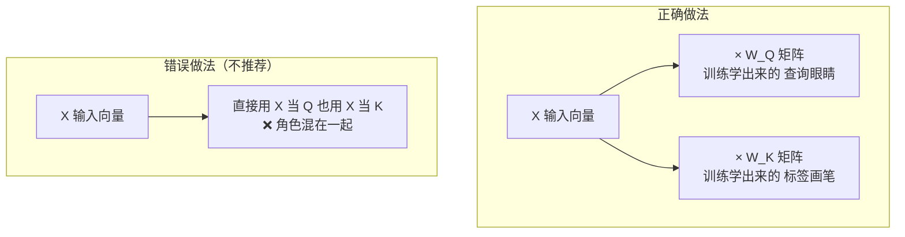

# 07-K 和 Q 可以使用同一个值通过对自身进行点乘得到吗

> [!question] 面试官想考什么
> 这是一道**审题陷阱题**！面试官想看你会不会先拆解题意，而不是直接说对或错。答案是"结构上可以，但实际没人这么做"。

## 🍼 大白话：先拆开题目再回答

题目问"K 和 Q 能不能用同一个值，通过对自身点乘得到"。句子里的「**同一个值**」有两种理解，这就是考点：

**理解一：Q 和 K 的输入 X 是不是同一个？**
- 答案是：**是同一个**。Q 和 K 确实都从同一个输入向量 X 出发。
- 就像同一个人的两张身份证照片——人到没啥用，得看"怎么处理"。

**理解二：Q 和 K 是不是完全不处理，直接用 X 本身？**
- 答案是：**不行**（虽然结构上"可以"这么写，但没人这么做）。
- 因为 Q、K 各自要经过**不同的权重矩阵**（$W_Q$ 和 $W_K$）加工，才获得不同角色。



## 📖 详细讲解

### 关键区分：共享输入 ≠ 共享投影

| | 共享输入 X | 直接用同一个 X（不投影） |
|---|---|---|
| Q | X·$W_Q$ | X（跳过投影） |
| K | X·$W_K$ | X（跳过投影） |
| 角色 | ✅ 灵活，两套"眼睛" | ❌ 角色完全一样 |
| 效果 | 正常 | 注意力退化，只看自身 |

### 为什么"直接用同一个值"不好？

1. **丢失角色分工**：Q 负责"按需查询"，K 负责"展示标签"，共用就分不清谁是谁。
2. **注意力退化**：模型只会关注"自己和与自己很像的"，学不到 Q/K 之间的不对称关系（比如"我打你"里的方向性）。
3. **表达力下降**：等于把原本两个可学矩阵，砍成一个——自由度少了，能学的东西就少了。

> [!note] 一句话记下来
> K 和 Q **来自同一个输入 X**，但**由不同的投影矩阵加工**。结构上"共用同一个值"可以写出来，但现实中是自毁表达力，没人这么干。

## 🎯 面试怎么答（话术模板）

```
"这个问题要分两层看。第一层，K 和 Q 的输入确实来自同一个向量 X，
这是没问题的。第二层，它们各自由独立的权重矩阵 W_Q 和 W_K 投影，
绝不能跳过投影直接用同一个值——否则 Q 和 K 的角色就混在一起了，
注意力只能退化成关注自己，学不到不对称的关系，表达能力大受影响。
所以结论是：共享输入可以，共用同一个"未加工的值"不行。"
```

## 🔗 相关知识链接

- 如果强行使 Q=K，具体会怎样？→ [[08-让K和Q变成同一个矩阵的影响]]
- Q 和 K 各自承担什么角色？→ [[06-self-attention中的K和Q是用来做什么的]]

---
> [!info] 导航
> 返回 [[Transformer 面试题]] · 上一题 [[06-self-attention中的K和Q是用来做什么的]] · 下一题 → [[08-让K和Q变成同一个矩阵的影响]]