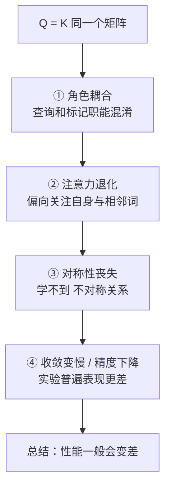

# 08-如果让 K 和 Q 变成同一个矩阵，对模型性能的影响

> [!question] 面试官想考什么
> 上一题的"升级版难题"。不只问能不能，还问**会有什么后果**。考察你从"自由度/表达能力"层面思考问题的能力。

## 🍼 大白话：把"问问题的人"和"推荐书的人"变成同一个人

回到图书馆的例子：

- 正常情况：**你（Q）** 问问题，**图书管理员（K）** 根据标签推荐书——两套人，各自专业，配合默契。
- 如果强制让 Q = K：等于**你只能问自己**，管理员消失了，你只能搜到跟自己完全一样的书，永远发现不了新东西。

对模型来说，让 K 和 Q 同一个矩阵，等于让"查询"和"被查询"合体，模型会变得**只会看自己**，学不到词与词之间复杂的关联。

## 📖 详细讲解

### 具体会有哪些后果



### 四点后果逐条说

| 后果 | 白话解释 | 原理 |
|---|---|---|
| **表达受限** | 只会"自己找自己" | 只能建模对称相似度，丢失 A→B 和 B→A 的差别 |
| **注意力退化** | 眼光短浅 | 容易陷在自身和相邻词，全局对齐能力下降 |
| **可学角度丢失** | 少了半套"眼睛" | 原本 Q 学"怎么查"、K 学"怎么标"，现在二合一 |
| **效果下降** | 实验验证 | 任务精度通常下降、收敛更慢 |

> [!warning] 例外情况（说出口才是高手）
> 某些场景**权重共享（weight tying）** 是故意为之——比如做**正则化**（防止过拟合）、**减少参数**（模型更小）。效果取决于任务，但作为通用做法，Q=K 绑定往往得不偿失。

### 一个灵魂追问

面试官可能顺势问：**那为什么减参数不采用？**
- 答：Q/K 分离带来的表达力收益，通常远大于省下的那几个参数价值；除非任务极端简单或参数极度紧张，否则不合算。

## 🎯 面试怎么答（话术模板）

```
"让 Q 和 K 共用一个矩阵，会显著限制模型的表达能力：
Q 和 K 的职能被耦合，注意力只能退化成对自身和对称关系的建模，
学不到词之间不对称的关联，全局对齐能力变差，
实验上通常表现为精度下降、收敛变慢。
当然也存在少数刻意做权重共享作为正则化、省参数的特例，
但一般不建议。"
```

## 🔗 相关知识链接

- Q/K 本来各负责什么？→ [[06-self-attention中的K和Q是用来做什么的]]
- "能用同一个值吗"的结构题 → [[07-K和Q可以使用同一个值吗]]
- 为什么多数参数能省却不能省这个？→ [[22-Transformer模型的性能瓶颈在哪]]

---
> [!info] 导航
> 返回 [[Transformer 面试题]] · 上一题 [[07-K和Q可以使用同一个值吗]] · 下一题 → [[09-为什么Transformer采用多头注意力机制]]