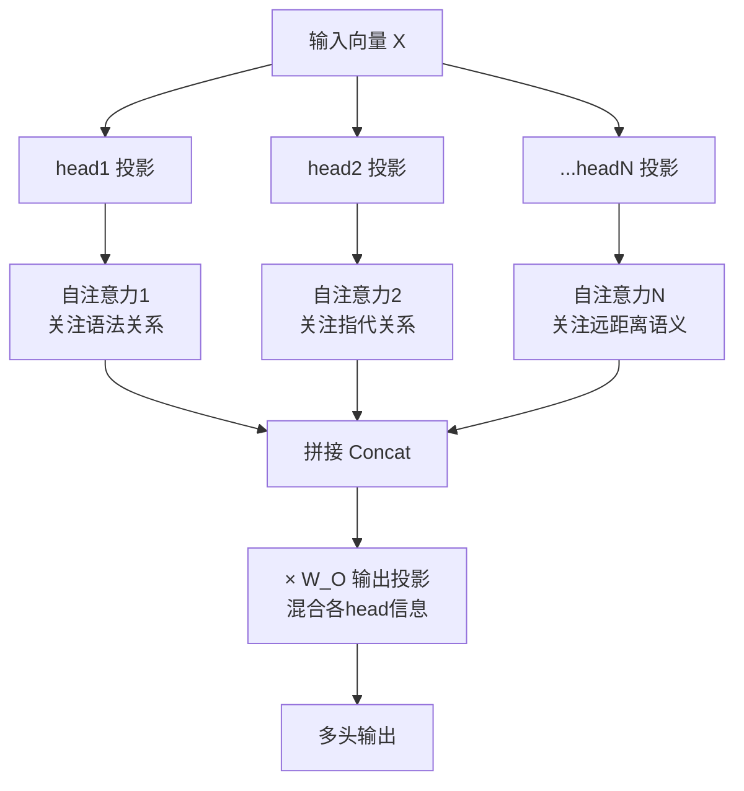

# 09-为什么 Transformer 采用多头注意力机制

> [!question] 面试官想考什么
> 考察你是否理解"多头"的设计动机——**为什么一个 Attention 不够，要复制好几份？** 核心答法是"多个子空间、捕捉多种关系"。

## 🍼 大白话：一个侦探不够，要请一队侦探

- **单头注意力** = 只有一个警察调查案子，只能注意"语法对不对"这一点。
- **多头注意力** = 请了 **8 个"关系侦探"**，各管一摊：
  - 侦探甲：盯**语法依赖**（谁修饰谁）；
  - 侦探乙：盯**指代**（"它"是指猫还是老鼠）；
  - 侦探丙：盯**远距离语义**（开头和结尾有没有呼应）……
  - 每个侦探从**不同角度/子空间**看同一个句子，最后把意见汇总。

> [!tip] 记忆锚点
> 就像同一个文档在 **8 个不同滤镜**下看，每个滤镜显出一类模式，合并起来信息最全。类比 CNN 的多个卷积核——一个核抓边、一个核抓纹理。

## 📖 详细讲解

### 多头注意力工作原理图



### 为什么多头更好（三个理由）

1. **捕捉多种关系**：不同 head 学到不同注意力模式，等价于"一份数据，多种解读"。
2. **更稳定**：多个 head 的结果**平均/拼接**后，可以稀释单个 head 的噪声，注意力更稳健。
3. **表达力更强**：拼接 + 输出投影，等于在表示维度上"加了通道"，信息更丰富。

### 计算公式（记结构就行）

$$\text{MultiHead}(Q,K,V) = \text{Concat}(head_1, ..., head_h)W^O$$

其中每个 $head_i = Attention(XW^Q_i, XW^K_i, XW^V_i)$

> [!note] 参数量疑问
> 很多人以为多头 = 8 个完整的注意力 = 8 倍参数。**不是**！
> 总维度是拆分的：每个 head 维度 $d_k = d_{model}/h$。所以多头**总计算量 ≈ 单头**，却白捞了多种关系。详见 [[11-多头注意力需要降维吗]]。

## 🎯 面试怎么答（话术模板）

```
"单头注意力只能建模一种对齐关系，多头让模型在多个子空间并行工作，
不同的 head 可以学习不同类型的依赖——比如语法关系、指代消解、
远距离语义关联，就像一组互不干扰的专家。
同时多头结果拼接聚合更稳定、抗噪声，表达力也更强。
而且因为总维度被拆分，多头相对单头并没有增加太多计算量。"
```

## 🔗 相关知识链接

- 每个 head 维度为什么变小了？→ [[11-多头注意力需要降维吗]]
- head 数量能不能无限加？→ [[10-head能否无限增多]]
- 单头注意力内部怎么算的？→ [[06-self-attention中的K和Q是用来做什么的]]

---
> [!info] 导航
> 返回 [[Transformer 面试题]] · 上一题 [[08-让K和Q变成同一个矩阵的影响]] · 下一题 → [[10-head能否无限增多]]