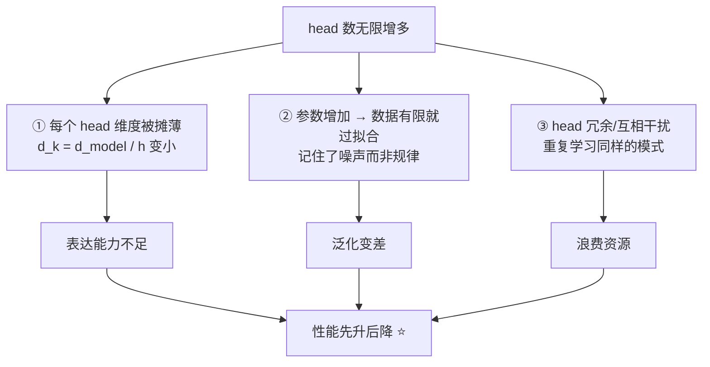

# 10-在不考虑计算量的情况下，head 能否无限增多

> [!question] 面试官想考什么
> 这题的陷阱是"**不考虑计算量**"——面试官故意堵死"算不起"这条退路，看你能不能想到**别的原因**：维度、数据、冗余。答案是"不能"。

## 🍼 大白话：8 个侦探是不是越多越好？

假设不管预算，你是不是想把"关系侦探"请到 100 个、10000 个？

- 那得先有个前提：**侦探办公桌上得有地方放资料**。
- Transformer 的总"桌面"（$d_{model}$ 维度）是**固定的**。侦探越多，每人分到的桌面越窄（每个 head 维度 $d_k = d_{model}/h$ 越小）。
- 桌面窄到一定程度，每个侦探**啥也看不全**，等于雇了一批废人。
- 而且案件（训练数据）就那么多，雇太多侦探，他们都在**猜同样的规律**（过拟合），互相重复、还乱干涉。

所以：**不能**。不仅不能无限，加过头了性能还会掉。

## 📖 详细讲解

### 限制 head 数量的三个原因



### 逐条解释

| 限制 | 白话 | 关键公式/事实 |
|---|---|---|
| **维度摊薄** | 桌面不够分 | head 越多，每个 head 的 $d_k$ 越小，单头能力不足 |
| **过拟合** | 数据不够侦探花式 | 参数随 $h \times d_k$ 增加，数据固定就会过拟合 |
| **冗余干扰** | 侦探重复办案 | 多数 head 学到的模式高度重复，可剪枝去除 |

### 经验数据

- 主流模型的 **head 数通常在 8~16** 之间（原版 Transformer 用 8）。
- 再多，收益不明显甚至下降。这也印证了最后一点结论：**性能先升后降**。

> [!tip] 加分：head 剪枝（pruning）
> 研究表明：Transformer 里**很多 head 是冗余的**，剪掉一部分对性能几乎无影响。这反过来证明"头不是越多越好"——存在大量重复劳动。

## 🎯 面试怎么答（话术模板）

```
"不能无限增多，而且不是算力的问题。首先，模型总维度 d_model 固定，
head 越多，每个 head 的维度 d_k 越小，单个 head 的表达能力被摊薄；
其次，head 多了参数增加，在有限数据下容易过拟合；
最后，很多 head 学到的模式是重复的，存在大量冗余。
实践上 head 数通常在 8~16，超过一定数量性能会先升后降，
这从 head 剪枝实验也能验证——剪掉部分 head 性能几乎不变。"
```

## 🔗 相关知识链接

- head 为什么共享总维度？→ [[11-多头注意力需要降维吗]]
- 多头能带来什么好处？→ [[09-为什么Transformer采用多头注意力机制]]
- 参数多了为什么容易过拟合？→ [[21-如何评估Transformer的性能和效果]]

---
> [!info] 导航
> 返回 [[Transformer 面试题]] · 上一题 [[09-为什么Transformer采用多头注意力机制]] · 下一题 → [[11-多头注意力需要降维吗]]