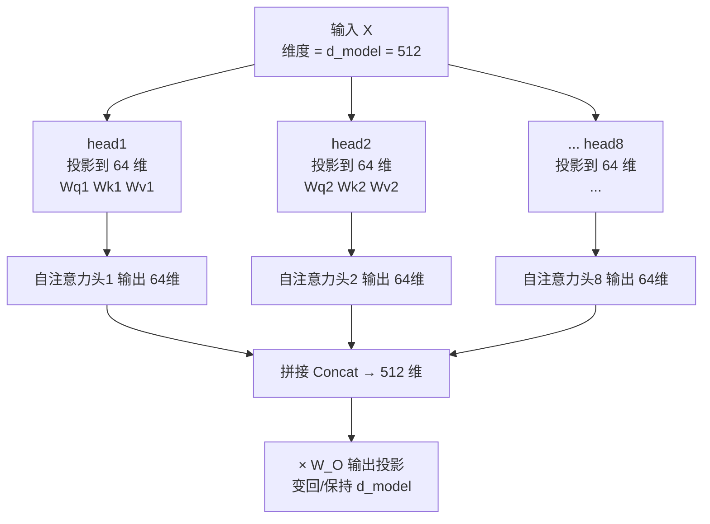

# 11-在进行多头注意力的时候需要对每个 head 进行降维吗

> [!question] 面试官想考什么
> 很多人的第一个念头是"不降维，那不是更快吗？"——这题考的是你**算不算得清总计算量**。答案是：**需要**，而且这是设计的关键。

## 🍼 大白话：本来是 512 维，切成 8 份就是每个头 64 维

假设一个词的向量是 **512 维**，我们想用 **8 个 head**（8 个侦探）：

- **如果不降维**：每个 head 都从 512 维"完全开工"，8 个 head 就是 8×512 = 4096 维 → **计算量直接翻 8 倍**。
- **正确的做法（降维）**：把 512 维**切成 8 份**，每个 head 只用 **64 维**。8 个 head 加起来还是 512 维 → **总计算量不变**，却白捞了 8 种关系！

> [!tip] 一句话记住
> 多头不是"复制 8 份完整的注意力"，而是"把一个蛋糕切成 8 块分别品尝"。

## 📖 详细讲解

### 降维的实现方式

每个 head **通过自己的投影矩阵**把输入从 $d_{model}$ 降到 $d_k$：

$$Head_i = Attention(XW^Q_i,\ XW^K_i,\ XW^V_i), \quad W^Q_i \in \mathbb{R}^{d_{model} \times d_k}$$

其中 $d_k = d_{model} / h$。



### 两步操作总结

| 步骤 | 动作 | 结果 |
|---|---|---|
| **① 各 head 降维投影** | 每个 head 乘小投影矩阵，$d_{model}→d_k$ | 每个 head 用低维表示算注意力 |
| **② 拼接 + 输出投影** | Concat 后乘 $W_O$ | 揉合各 head，回到 $d_{model}$ |

### 为什么这么设计？（面试答这个）

1. **总计算量 ≈ 单头**：$h \times d_k = d_{model}$，算力不白花。
2. **并行获得多样性**：同样的算力，换来 h 种关注关系。
3. **每个 head 独立学习**：投影矩阵各自学，形成不同"视角"。

> [!note] 常见误区
> 有人以为"每个 head 独立了还要降维是不是多此一举"——恰恰相反，**降维是为了不增加总计算量**，这正是多头"加量不加价"的精髓。

## 🎯 面试怎么答（话术模板）

```
"需要。多头并不是把每个 head 做成完整的 d_model 维注意力，
而是把总维度拆成 h 份，每个 head 通过自己的投影矩阵从 d_model 降维到 d_k。
这样 h 个 head 加起来的总维度等于 d_model，总计算量和单头基本一致，
却并行获得了 h 种不同的关注关系，最后由拼接和输出投影 Wo 揉合。
这是多头注意力'加量不加价'的关键设计。"
```

## 🔗 相关知识链接

- 多头到底带来什么好处？→ [[09-为什么Transformer采用多头注意力机制]]
- 维度摊薄了，head 还能无限多吗？→ [[10-head能否无限增多]]
- 每个 head 内部的注意力怎么算？→ [[05-计算attention用的是点乘还是加法]]

---
> [!info] 导航
> 返回 [[Transformer 面试题]] · 上一题 [[10-head能否无限增多]] · 下一题 → [[12-对Transformer的Encoder模块的理解]]