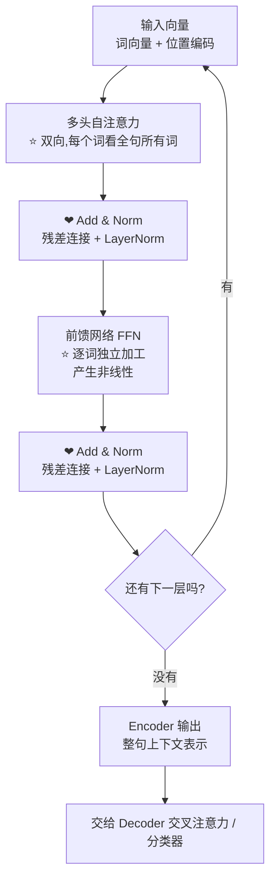

# 12-讲一下你对 Transformer 的 Encoder 模块的理解

> [!question] 面试官想考什么
> 考你能否**掰开揉碎**地讲清楚 Encoder 每一层里面是什么、顺序如何、为什么这样排。B站讲稿式答案最加分。

## 🍼 大白话：Encoder 是"阅读理解车间"

把 Encoder 想象成一个**全文阅读并划线做笔记的车间**：

- 一句话进来，车间里每个词都能**同时看到整句话所有词**（双向自注意力），互相交流，谁都别藏着。
- 交流完一轮，每个词的笔记（向量）就更新了，然后进**"深度思考区"（FFN）**做一轮独立加工。
- 一轮做完，还有"安全绳"（残差）和"质检"（LayerNorm）保驾护航，然后**再来一层**……共叠 N 层。
- 最后车间出口，吐出的是一整句的**"理解笔记"（上下文表示）**，供 Decoder 或下游任务使用。

## 📖 详细讲解

### Encoder 单层结构图



### 内部结构逐块讲

| 组件 | 白话 | 关键点 |
|---|---|---|
| **多头自注意力** | 全体词互相交流 | **双向、无掩码**，每个位置都能看到全句 |
| **残差连接** | 安全绳 | 把原始信息抄近路保留下来，防退化 |
| **LayerNorm** | 质检标准化 | 让每层数值稳定，训练更快更稳 |
| **FFN** | 逐词深度思考 | 两个全连接 + 非线性激活，每词独立 |

### Encoder 的核心特性（面试必说）

1. **双向上下文**：每个 token 都 attend **所有**位置（无掩码）——这是 Encoder 和 Decoder 最大的区别。
2. **可并行**：整句一次算完，不用像 RNN 逐词排队。
3. **无递归**：顺序信息靠位置编码补（→ [[04-Transformer的位置编码是怎样的]]）。
4. **N 层堆叠**：越深语义越抽象（原版 N=6，BERT 用 12/24 层）。

> [!tip] 关联记忆
> **BERT = 纯 Encoder 堆叠**。BERT 的定位就是"阅读理解专家"（理解任务强、不会生成）。懂了 Encoder 就懂了 BERT 的一半。

## 🎯 面试怎么答（话术模板）

```
"Encoder 是一个 N 层的堆叠结构，每层由两个子层构成：
首先是多头自注意力，它是双向的，每个 token 都能看到整个序列，
用来建模全局上下文；
然后是前馈网络，对每个位置的表示做独立的非线性变换。
每个子层后面都跟着残差连接和 LayerNorm，保证深层的稳定训练。
输入先经过词嵌入和位置编码，最终输出每个词的上下文表示，
可以用于分类等任务，或者传给 Decoder 做交叉注意力。
BERT 就是纯 Encoder 架构的典型代表。"
```

## 🔗 相关知识链接

- Encoder 和 Decoder 的区别？→ [[13-Decoder和Encoder的多头自注意力相同吗]]
- 双向自注意力内部怎么算？→ [[06-self-attention中的K和Q是用来做什么的]]
- 为什么需要残差和 LayerNorm？→ [[19-残差连接可以缓解梯度消失吗]] · [[15-为什么用LayerNorm而不是BatchNorm]]

---
> [!info] 导航
> 返回 [[Transformer 面试题]] · 上一题 [[11-多头注意力需要降维吗]] · 下一题 → [[13-Decoder和Encoder的多头自注意力相同吗]]