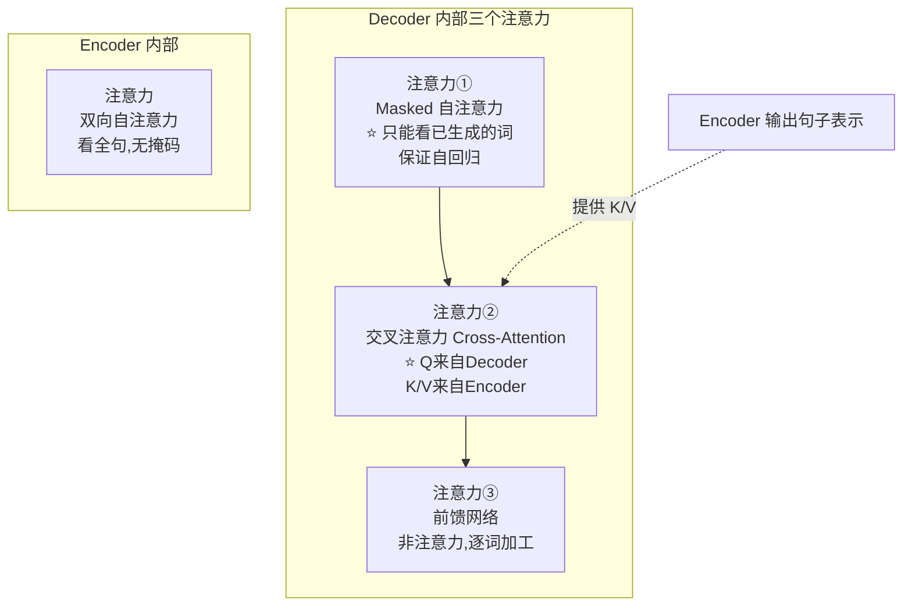

# 13-Transformer 中 Decoder 和 Encoder 的多头自注意力是相同的吗

> [!question] 面试官想考什么
> 很多人含糊地说"一样"，这题就是抓这个漏洞。答"**不完全相同**"并列出**三点区别**，就能拿满分。

## 🍼 大白话：一个是"全屋讨论"，一个是"只看前面"

- **Encoder 的自注意力**：全班同学**互相看**，谁都能看到任何人的答案（双向，无遮拦）——适合"整体理解"。
- **Decoder 的自注意力**：一个**接龙写作文**的人，写第 5 个字时只能看前 4 个字，不能回头看后面——因为后面的还没写呢！（**带掩码，只许往前看**）

而且 Decoder 还不止有"自己写作文"的注意力，它还要**回头看原文**（交叉注意力）——就像翻译时既要看自己已写的译文，也要随时回看原文。

## 📖 详细讲解

### 三个核心区别



### 逐点对比表

| 对比项 | Encoder 自注意力 | Decoder 自注意力 | 区别是? |
|---|---|---|---|
| **看谁** | 全句所有词（双向） | 只能看自己**及以前**的词 | 有/无掩码 ⭐ |
| **掩码** | ❌ 无 | ✅ **Look-ahead mask**（上三角） | Decoder 更严 |
| **有没有交叉注意力** | ❌ 没有 | ✅ 有（连向 Encoder） | Decoder 多一套 |
| **服务目的** | 理解输入内容 | 自回归地生成输出 | 用途不同 |

### 为什么 Decoder 一定要 Mask？（面试加分）

- 自回归生成的要求是：**只能根据已写内容决定下一个词**。
- 如果不加掩码，训练时 Decoder 就能"偷看未来"——但真正推理时未来根本不存在，模型就**露馅**（训练和推理不一致）。
- 所以必须用掩码把未来挡住，保证"看不到就是不存在的"。

> [!tip] 记忆清单
> 三点区别背下来：**①有掩码 ②多一个交叉注意力 ③作用对象是"已生成内容"**。

## 🎯 面试怎么答（话术模板）

```
"不完全相同，有三点区别。
第一，Decoder 的第一层自注意力是带掩码的（look-ahead mask），
每个位置只能 attend 到它自己及之前的位置，保证自回归生成时不偷看未来；
Encoder 则是双向、全可见的。
第二，Decoder 还多了一个交叉注意力子层，Q 来自 Decoder，
K 和 V 来自 Encoder 的输出，用来把编码信息带入生成过程；
Encoder 没有这个子层。
第三，两者的作用对象不同，一个针对输入序列，一个针对已生成的输出。"
```

## 🔗 相关知识链接

- 掩码是怎么实现"看不见"的？→ [[16-注意力遮蔽Attention-Masking的工作原理]]
- 什么是"自回归"？→ [[17-什么是自回归属性autoregressive-property]]
- Decoder 从 Encoder 拿信息的机制 → [[18-如何实现序列到序列的映射]]

---
> [!info] 导航
> 返回 [[Transformer 面试题]] · 上一题 [[12-对Transformer的Encoder模块的理解]] · 下一题 → [[14-了解梯度裁剪Gradient-Clipping吗]]