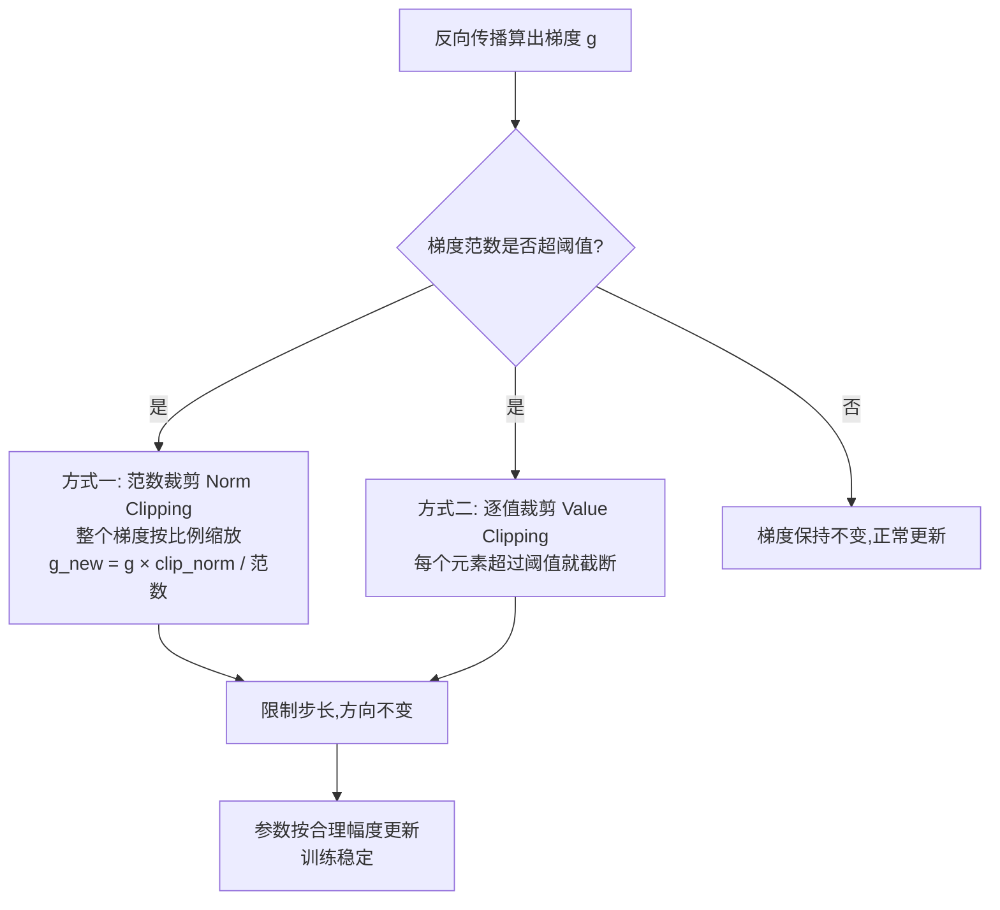

# 14-了解 Transformer 模型训练中的梯度裁剪（Gradient Clipping）吗

> [!question] 面试官想考什么
> 考察你对**训练稳定性**的理解。答清"是什么→为什么→怎么做→配合什么"四段即可。

## 🍼 大白话：练跳水时旁边站的"安全网"

想象训练模型 = 教一个人学**跳水**（往模型参数里迈步）：

- 正常情况：每迈一步的幅度（梯度）都**合理**，方向正确，越练越稳。
- 突发情况：某一脚突然**迈得特别大**（梯度爆炸），整个人直接飞出去、摔在泳池边——模型就"废"了（训练发散）。

**梯度裁剪 = 在泳池边拉一张安全网**：每当迈步（梯度）的幅度超过某个阈值，就把它**按比例压回安全范围**，方向不变、幅度受控，人才不会摔飞。

## 📖 详细讲解

### 两种裁剪方式



### 具体实现细节

| 方式 | 做法 | 特点 |
|---|---|---|
| **范数裁剪**（主流） | 若 $\|g\|_2 > clip\_norm$，则按 $\frac{clip\_norm}{\|g\|_2}$ 整体缩放 | ✅ 保留方向、只降幅度，用得最多 |
| **逐值裁剪** | 单个梯度元素超过阈值就截值 | 粗暴直接、少用 |

### 为什么 Transformer 需要它？

- 深层模型 / 长序列训练时，梯度容易**数值爆炸**（尤其配合残差网络和长链梯度）。
- 裁剪保证梯度稳定 → **防止 NaN、防止发散**、训练更稳。

> [!note] 常见的误解
> 别把梯度裁剪当成"万灵药"——它是**稳定性兜底**之一，不是保险箱。真正稳定训练还有三位搭档（见下）。

### 面试加分：和谁配合使用？

1. **Warmup + 学习率调度**：训练前期用小学习率稳步启动。
2. **LayerNorm**：让每层激活值尺度稳定。
3. **残差连接**：让梯度多一条"短路径"回流。

> [!tip] 工程常识
> 文本任务里 `clip_norm` 常取 **1.0 左右**；PyTorch 里就一行：`torch.nn.utils.clip_grad_norm_(model.parameters(), 1.0)`。

## 🎯 面试怎么答（话术模板）

```
"梯度裁剪是训练稳定性的重要手段。当梯度范数超过设定阈值时，
把它整体按比例缩回安全范围，保留方向、限制幅度，防止梯度爆炸导致训练发散。
主流做法是范数裁剪：若 ||g|| 超过 clip_norm，则乘以 clip_norm/||g|| 缩放。
它对 Transformer 这类深层模型尤其重要，常和 warmup 学习率调度、
LayerNorm、残差连接配合，共同保障深层训练的稳定。"
```

## 🔗 相关知识链接

- 梯度为什么会"爆炸/消失"？→ [[19-残差连接可以缓解梯度消失吗]]
- LayerNorm 怎么帮忙稳定？→ [[15-为什么用LayerNorm而不是BatchNorm]]
- 训练稳定性相关的评估 → [[21-如何评估Transformer的性能和效果]]

---
> [!info] 导航
> 返回 [[Transformer 面试题]] · 上一题 [[13-Decoder和Encoder的多头自注意力相同吗]] · 下一题 → [[15-为什么用LayerNorm而不是BatchNorm]]