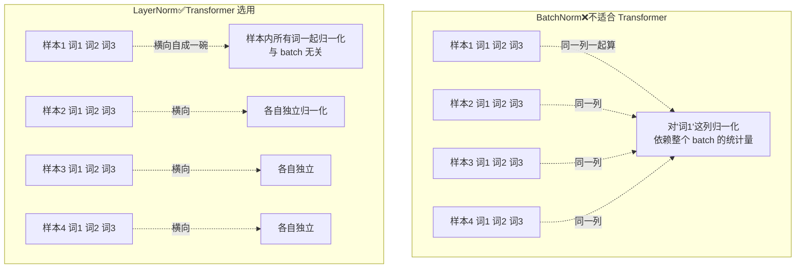

# 15-Transformer 为什么采用 Layer Normalization 而不是 Batch Normalization

> [!question] 面试官想考什么
> 归一化是稳定训练的大功臣。这题考你是否理解两种归一化的**本质差别**（沿着哪个方向归一化），以及**为什么 Transformer 的场景不适合 BN**。

## 🍼 大白话：一锅汤，两种"尝法"

想象你有 **4 碗汤**（4 个句子），每碗里有 **3 种食材**（3 个词）：

- **BatchNorm（竖着归一）**：把**每一列**——也就是**所有碗里的同一种食材**（所有句子的第 1 个词）放在一起，算平均值、调整。它依赖"这桌有多少碗汤"（batch size）。
  - 问题：如果今天只来了 1 碗汤（batch=1），这列就只有一个数据，统计量极度不准。
- **LayerNorm（横着归一）**：把**每一碗汤里的所有食材**（一个句子里所有词）一起调整。它跟"有几碗汤"没关系，来几碗都稳。

> [!tip] 记忆锚点
> - **BN 竖着归一**：对"batch 里所有样本的同一特征"归一化
> - **LN 横着归一**：对"单个样本的所有特征"归一化

## 📖 详细讲解

### 归一化方向对比图



### BN 在 Transformer 场景的三个致命问题

| 问题 | 白话 | 后果 |
|---|---|---|
| **依赖 batch size** | 统计量靠"同锅的汤" | batch 小→噪声大、不稳定 |
| **变长序列 + Padding** | 句子长短不齐，短的补空位 | 空的"词"污染统计量 |
| **训练/推理不一致** | 训练用实时统计，推理用历史平均 | 分布偏移，效果打折 |

### LN 的优势（为什么选它）

1. **逐样本归一化**：跟 batch 无关、跟序列长度无关 → 变长序列天然适配。
2. **推理友好**：推理常 batch=1（单条请求 / KV cache），LN 完全不受影响。
3. **稳定好训**：与残差连接配合，深层网络数值更稳。

> [!note] 一句话定位
> 归一化是 Transformer 深层训练的"稳压器"，选 LN 是因为它**不依赖 batch、适配变长序列、推理一致**——这三点 BN 全占反。

## 🎯 面试怎么答（话术模板）

```
"因为 LayerNorm 对每个样本的特征维度做归一化，与 batch 无关，
而 BatchNorm 依赖整个 batch 的统计量。
Transformer 用 BN 有三个问题：batch 小统计量不稳；
序列长短不齐，padding 会污染统计量；训练和推理的统计量不一致。
而 LayerNorm 逐 token、逐样本归一化，不受 batch 大小和序列长度影响，
也更适合推理时单样本、KV cache 的场景，配合残差连接能稳定深层训练。"
```

## 🔗 相关知识链接

- 归一化在层里的位置？→ [[12-对Transformer的Encoder模块的理解]]
- 残差连接怎么和它配合？→ [[19-残差连接可以缓解梯度消失吗]]
- 什么是 KV cache 推理场景？→ [[03-Transformer的哪个部分最占用显存]]

---
> [!info] 导航
> 返回 [[Transformer 面试题]] · 上一题 [[14-了解梯度裁剪Gradient-Clipping吗]] · 下一题 → [[16-注意力遮蔽Attention-Masking的工作原理]]