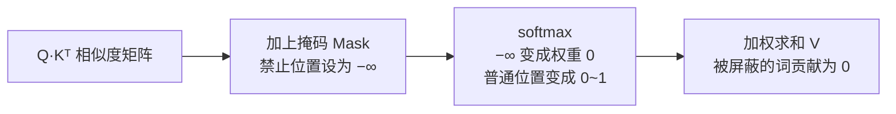
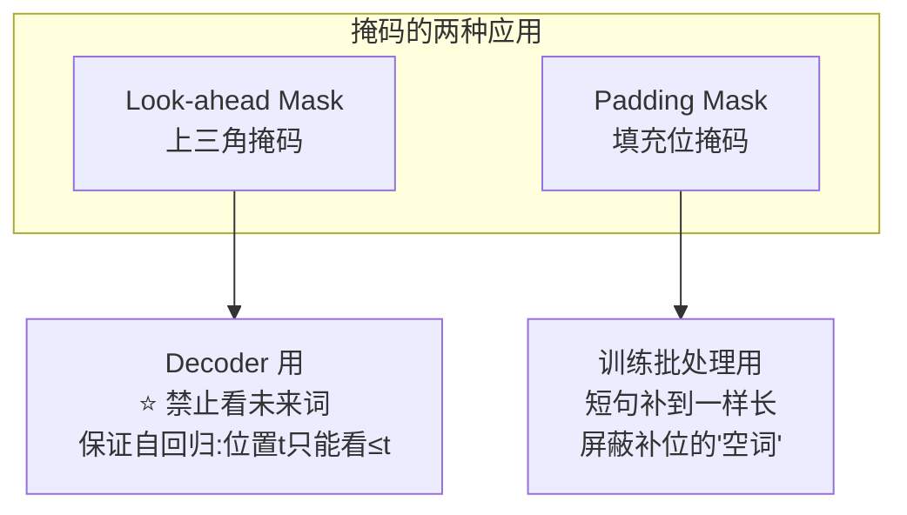

# 16-Transformer 中的注意力遮蔽（Attention Masking）的工作原理是什么

> [!question] 面试官想考什么
> 考你**掩码的实现机制**（为什么"置 −∞"就能让模型"看不见"）以及**掩码用在哪两种场景**。答对"−∞ → softmax 后权重变 0"这句就抓住了灵魂。

## 🍼 大白话：给"不该看的地方"贴上封条

注意力机制相当于每个人都在**环顾四周收集信息**。掩码就是给某些区域**贴上封条**："这里不许看"。

技术上怎么贴封条？**给那个位置的相似度分数设成负无穷大（−∞）**。

因为注意力最后一步是 softmax（把分数变成 0~1 的权重）：
- 正无穷 → 权重接近 1（被疯狂关注）
- 负无穷 → 权重接近 0（**完全被无视**）

所以把不该看的位置分数改成 −∞，softmax 之后权重 ≈ 0，相当于"压根没看到"。

## 📖 详细讲解

### 掩码的数学原理

$$Attention(Q,K,V) = softmax\left(\frac{QK^T + Mask}{\sqrt{d_k}}\right)V$$

- 正常：只算 $\frac{QK^T}{\sqrt{d_k}}$；
- 掩码：先把 mask 矩阵**加**到打分上；
- $Mask_{i,j} = -\infty$：表示禁止位置 i 去看位置 j。



### 两种典型掩码



| 掩码 | 作用位置 | 为什么需要 |
|---|---|---|
| **Look-ahead（因果掩码）** | Decoder 注意力 | 防止"偷看未来"，保证自回归（→ [[17-什么是自回归属性autoregressive-property]]） |
| **Padding 掩码** | 整句输入 | 批处理时短句补位，屏蔽无意义的空词 |

### 实现细节（工程加分）

- PyTorch 里常分成两个参数：`attn_mask`（上三角因果掩码）和 `padding_mask`（填充掩码），使用时**相加**或分别传入。
- 不要混淆两者的作用域：一个管"时间方向"，一个管"padding 方向"。

> [!tip] 快速自测
> 一个 4 个词的句子做因果掩码，位置 3 能看哪些？——只能看位置 0、1、2、3。位置 2 不能看 3。这就是"只看过去"。

## 🎯 面试怎么答（话术模板）

```
"注意力遮蔽的本质是在 softmax 之前，把被禁止位置的相似度分数置为负无穷，
这样 softmax 之后这些位置的权重趋近于 0，相当于完全屏蔽。
常见有两种：一是 Decoder 的 look-ahead mask，用上三角矩阵屏蔽未来位置，
保证自回归属性；二是 padding mask，屏蔽批处理时补位产生的空词。
实现上通常把它们加在 QKᵀ 打分矩阵上再进 softmax。"
```

## 🔗 相关知识链接

- 为什么 Decoder 必须要因果掩码？→ [[13-Decoder和Encoder的多头自注意力相同吗]]
- "只看过去"为什么是自回归？→ [[17-什么是自回归属性autoregressive-property]]
- softmax 那一步具体怎么算？→ [[05-计算attention用的是点乘还是加法]]

---
> [!info] 导航
> 返回 [[Transformer 面试题]] · 上一题 [[15-为什么用LayerNorm而不是BatchNorm]] · 下一题 → [[17-什么是自回归属性autoregressive-property]]