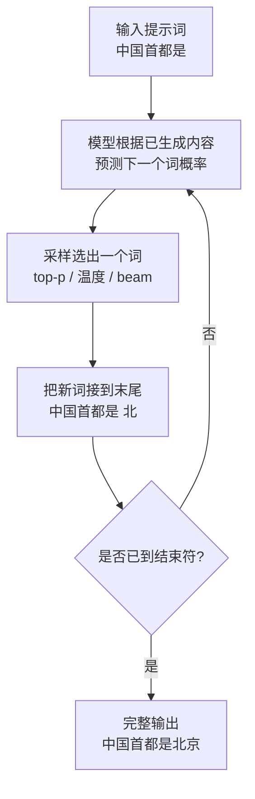

# 17-什么是自回归属性（autoregressive property）

> [!question] 面试官想考什么
> 自回归是 **GPT 等大模型的生成原理**，几乎必考。答清"定义 → 因果性 → 如何实现 → 关联技术"四层，还能连到 KV cache，就是高手答案。

## 🍼 大白话：像"接龙写作文"

自回归 = **接龙游戏**：

- 第一步：给出开头「我今天…」，模型预测下一个字是什么。
- 第二步：把刚才生成的词**接在末尾**（变成「我今天去…」），再预测下一个。
- 第三步：循环……每次都用「已经写好的全部内容」来预测「下一个词」，把新词接到后面，继续。

$$P(x_1, x_2, ..., x_T) = \prod_{t=1}^{T} P(x_t \mid x_1, ..., x_{t-1})$$

翻译成大白话：整句的概率 = 一个词一个词地"在已知前文的情况下，猜下一个词"的概率相乘。

## 📖 详细讲解

### 自回归生成循环



### 自回归的三个核心特点

| 特点 | 白话 | 说明 |
|---|---|---|
| **因果性** | 只看过去，不碰未来 | 预测第 t 个词时只用前 t-1 个 |
| **逐词串行** | 一个接一个生成 | 无法像 Encoder 那样整句并行 |
| **Next-token 训练** | 练的就是"猜下一个" | 训练损失 = 下一个词预测交叉熵 |

### Transformer 怎么实现"因果"？

- 通过 **Masked Self-Attention（因果掩码）**：位置 t 只能 attend ≤t 的位置。
- 掩码让训练和推理行为一致：训练时"看不到未来"，推理时"未来本来就不存在"。
- → 具体机制见 [[16-注意力遮蔽Attention-Masking的工作原理]]

### 哪些模型是自回归的？

- **Decoder-only 大模型**：GPT、Llama、GLM、Qwen 全部都是。
- 与之相对：BERT（双向编码）不是自回归；T5 属于编解码架构、生成部分自回归。

> [!tip] 面试加分：自回归的两大工程话题
> 1. **KV cache**：因为每个新词都要"回顾"前面所有词，缓存 K/V 避免重复计算（→ [[03-Transformer的哪个部分最占用显存]]）。
> 2. **解码策略**：top-p 采样、温度、beam search 都在"怎么选下一个词"上做文章（→ [[23-怎样缓解Transformer的性能瓶颈]]）。

## 🎯 面试怎么答（话术模板）

```
"自回归是指模型一次只生成一个 token，用已经生成的全部内容来预测下一个，
预测出的结果再接回序列尾部继续预测，循环直到结束。
它天然具备因果性，只依赖过去。Transformer 实现它靠的是 masked self-attention，
位置 t 只能 attend 到 t 及之前的位置，保证训练和推理时模型都看不到未来。
GPT、Llama 这类 decoder-only 模型都是自回归的。
它还和 KV cache、top-p 采样等工程手段紧密相关。"
```

## 🔗 相关知识链接

- 掩码怎么保证"只看过去"？→ [[16-注意力遮蔽Attention-Masking的工作原理]]
- 生成很慢？怎么加速？→ [[23-怎样缓解Transformer的性能瓶颈]]
- Decoder-only 和 Encoder 的区别 → [[24-Transformer和LLM有哪些区别]]

---
> [!info] 导航
> 返回 [[Transformer 面试题]] · 上一题 [[16-注意力遮蔽Attention-Masking的工作原理]] · 下一题 → [[18-如何实现序列到序列的映射]]