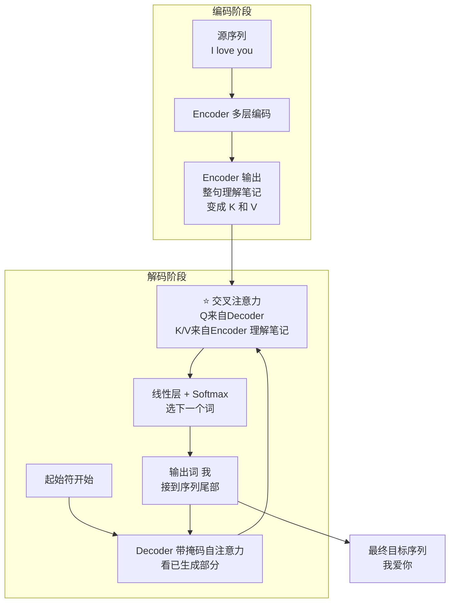

# 18-Transformer 中如何实现序列到序列的映射

> [!question] 面试官想考什么
> "序列到序列"= 输入一串，输出另一串（如翻译、摘要）。考你 **Encoder-Decoder 怎么配合**，以及**关键桥梁 Cross-Attention**。

## 🍼 大白话：同声传译怎么工作

设想一场**同声传译**：

1. **听（Encoder）**：翻译先听完整段英文，在脑子里把意思"咀嚼"成完整的理解（不只是逐词翻译）。
2. **翻译（Decoder）**：然后他开始一个词一个词地输出中文。每输出一个词，他都要做两件事：
   - **回头看自己已经说出的部分**（带掩码的自注意力，别自己打自己脸）；
   - **回头看脑中的"原意笔记"**（交叉注意力，从 Encoder 那里取信息，保证不跑题）。
3. 输出结束符（比如句号/。</s>），翻译完成。

## 📖 详细讲解

### 序列到序列全流程



### 两个关键机制

| 机制 | 白话 | 说明 |
|---|---|---|
| **Encoder 编码** | 先彻底"听懂" | 双向自注意力，产出整句上下文表示 |
| **Cross-Attention 交叉注意力** | 翻译时随时"回看原意" | **Q=Decoder，K/V=Encoder**——解码时去原文取信息 |

> [!note] 还有个现代流派：Decoder-only 也能做 seq2seq
> 不需要 Encoder！把源文本**拼进 prompt**（例如「翻译成中文：I love you」），让 Decoder 直接生成。GPT、Llama 走的就是这条"指令化条件生成"路线——本质还是条件生成 + 自回归。

### 两种路线的对比

| | 经典 Encoder-Decoder | Decoder-only 条件生成 |
|---|---|---|
| 代表模型 | 原版 Transformer、T5、BART | GPT、Llama、Qwen |
| 源文本入口 | Encoder 编码，经交叉注意力 | 直接拼进输入 prompt |
| 适用 | 需要严格对齐输入输出 | 通用对话/生成/指令任务 |
| 优点 | 对源文本建模更强 | 架构统一简单，生态成熟 |

## 🎯 面试怎么答（话术模板）

```
"序列到序列的映射通过 Encoder-Decoder 架构完成。
Encoder 读入源序列，用双向自注意力编码成上下文表示；
Decoder 则先通过带掩码的自注意力看自己已经生成的内容，
再通过交叉注意力以 Q=Decoder、K/V=Encoder 的方式从源序列取信息，
最后逐词自回归地生成目标序列。
此外现代 decoder-only 模型也能做 seq2seq，
把源文本拼进 prompt 做条件生成，例如翻译、摘要等任务。"
```

## 🔗 相关知识链接

- 交叉注意力里 Q/K/V 从哪来？→ [[13-Decoder和Encoder的多头自注意力相同吗]]
- 为什么要"逐词生成"？→ [[17-什么是自回归属性autoregressive-property]]
- Decoder-only 大模型和 Transformer 的关系 → [[24-Transformer和LLM有哪些区别]]

---
> [!info] 导航
> 返回 [[Transformer 面试题]] · 上一题 [[17-什么是自回归属性autoregressive-property]] · 下一题 → [[19-残差连接可以缓解梯度消失吗]]