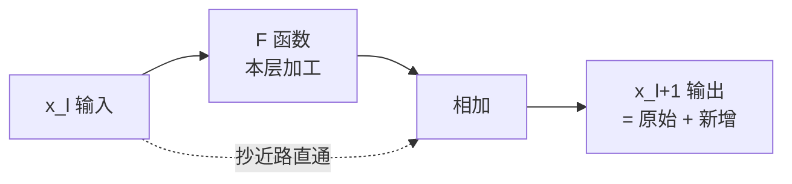

# 19-Transformer 中的残差连接可以缓解梯度消失问题吗

> [!question] 面试官想考什么
> 残差连接是深度学习"三件套"之一。考你是否真懂它的**梯度路径原理**，而不只是背"可以缓解"四个字。

## 🍼 大白话：电梯里的"紧急楼梯"

想象一栋 100 层高的大楼，你要从顶层把文件快速送到底层（梯度从深层传到浅层）：

- **没有残差连接** = 只能一层一层坐观光电梯（逐层传播），每层都要慢慢传，传到下面信号就**衰减没了**（梯度消失）。
- **有残差连接** = 每层都修了一条**直通的紧急楼梯**：`输出 = 本层加工 + 原始输入`。这样一来，文件可以直接"抄近路"往下传，不用每层都磨一遍。

所以残差连接的作用就是：**给梯度开了一条高速公路**，信号传多远都不衰减。

## 📖 详细讲解

### 残差连接长什么样

$$x_{l+1} = x_l + F(x_l)$$

- $x_l$：第 l 层的输入（原始信息）
- $F(x_l)$：第 l 层要学的东西（如注意力/FFN 的加工结果）
- 二者**相加**：输出 = 原始信息 + 新增信息



### 为什么能缓解梯度消失？（原理）

- 反向传播时，梯度沿两条路回传：一条经过 $F$，一条**直接经过恒等映射（那 1）**。
- 数学上：$\frac{\partial x_{l+1}}{\partial x_l} = 1 + \frac{\partial F}{\partial x_l}$。
- 那个 **"+1"** 保证了梯度**至少能原样传回一层**，层层如此 → 梯度不再随层数指数衰减。

### 为什么 Transformer 尤其需要？

1. Transformer 动辄**几十上百层**（GPT-4 传闻几百层），没有残差几乎无法收敛。
2. 残差还让深层网络学"**增量/靠近恒等**"而非完全重造，优化难度大降。
3. 与 LayerNorm、梯度裁剪**三件套**配合，稳定深层训练。

> [!warning] 消融实验一句话
> 把残差去掉，模型性能显著下降甚至训不动——这是残差价值最直接的证据。

### 面试快速总结

| 问题 | 答案 |
|---|---|
| 能缓解梯度消失吗？ | **能**，核心是恒等捷径让梯度直接回流 |
| 原理是什么？ | 求导里那个 "+1"，保证梯度至少原样传一层 |
| 谁配合它？ | LayerNorm（控尺度）+ 梯度裁剪（防爆炸） |

## 🎯 面试怎么答（话术模板）

```
"可以，残差连接是缓解梯度消失的关键设计。
它通过 x_{l+1} = x_l + F(x_l) 引入恒等捷径，反向传播时梯度可以
直接通过这条捷径流回浅层，求导里产生常数的 +1 项，
保证梯度不会随层数指数级衰减。
Transformer 动辄几十上百层，没有残差几乎无法收敛。
它和 LayerNorm、梯度裁剪配合，共同保障深层网络的稳定训练。"
```

## 🔗 相关知识链接

- LayerNorm 怎么配合？→ [[15-为什么用LayerNorm而不是BatchNorm]]
- 梯度爆炸了怎么办？→ [[14-了解梯度裁剪Gradient-Clipping吗]]
- 残差在层里的具体位置？→ [[12-对Transformer的Encoder模块的理解]]

---
> [!info] 导航
> 返回 [[Transformer 面试题]] · 上一题 [[18-如何实现序列到序列的映射]] · 下一题 → [[20-如何处理大型数据集]]