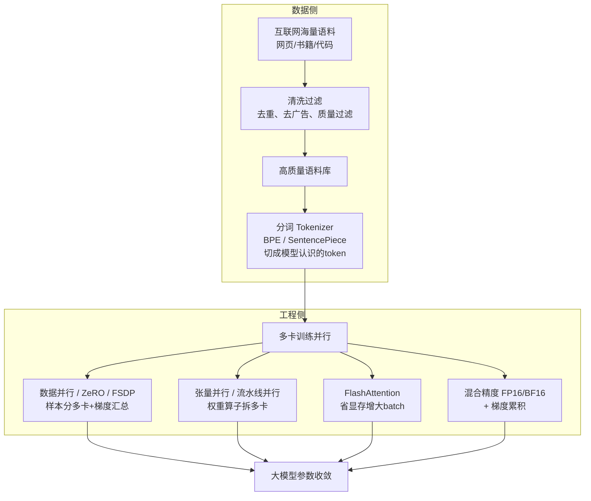

# 20-Transformer 中，如何处理大型数据集

> [!question] 面试官想考什么
> 这是"大规模训练"的入门题。考你是否了解训练一个大模型的**数据流程**和**工程配套**。回答框架：数据侧一条线 + 工程侧一条线。

## 🍼 大白话：开一家"大食堂"，先选菜再开火

要训练大模型，就像经营一家食堂：

- **第一步：选好食材（数据侧）**——从网上搜罗海量"食材"（网页、书籍、代码），但网上垃圾多：重复内容、广告、口水话都要**挑出去**，只留高质量语料。
- **第二步：提前切好（分词）**——把文本切成模型认识的"食材块"（token）。
- **第三步：开火多锅并行（工程侧）**——一道菜不够快？**多口锅同时炒**（多卡并行），每口锅分到不同的菜（数据并行），炒好的料再拼起来（梯度汇总）。

## 📖 详细讲解

### 处理大型数据集总流程



### 数据侧要点

| 步骤 | 白话 | 关键技术 |
|---|---|---|
| **清洗去重** | 扔掉垃圾内容 | 去重（MinHash）、质量过滤（PPL/规则） |
| **构建高质量语料** | 宁缺毋滥 | 文化、代码、多语言均衡配比 |
| **分词** | 切成模型认识的"单词" | BPE / SentencePiece / tokenizer |
| **shuffle** | 打乱顺序防偏科 | 多轮次随机采样 |

### 工程侧要点（训练超大规模）

| 技术 | 白话 | 解决什么问题 |
|---|---|---|
| **数据并行 / ZeRO / FSDP** | 把样本分给多卡，算完同步梯度 | 单卡放不下整个 batch |
| **张量并行 / 流水线并行** | 把一个大模型"切开"放多卡 | 单卡放不下整个模型 |
| **FlashAttention** | 注意不存整张矩阵 | 省显存→能放大 batch |
| **混合精度 FP16/BF16** | 用半精度算，省显存又快 | 加速 + 省显存 |
| **梯度累积** | 攒够梯度再更新一次 | 突破单卡 batch 上限 |

> [!tip] 面试加分：Scaling Laws（规模定律）
> 数据量和参数量不是随便配的。经验规律：**数据量 ≈ 参数量 × 20 tokens**。也就是说 70B 参数的模型，大约需要 1.4 万亿 token 的训练数据。答出来立马显专业。

## 🎯 面试怎么答（话术模板）

```
"分两条线：数据侧，先做清洗、去重、质量过滤构建高质量语料库，
再用 BPE/SentencePiece 分词器切分；工程侧，用数据并行加 ZeRO/FSDP 分配样本、
张量并行和流水线并行拆分模型、FlashAttention 降低显存以便增大 batch、
混合精度配合梯度累积加速训练。
另外可以提 Scaling Laws：数据量大约等于参数量乘以 20 tokens，
数据、参数、算力需要匹配。"
```

## 🔗 相关知识链接

- 为什么大模型要那么多数据？→ [[24-Transformer和LLM有哪些区别]]
- FlashAttention 属于哪类优化？→ [[23-怎样缓解Transformer的性能瓶颈]]
- 训完怎么评估好坏？→ [[21-如何评估Transformer的性能和效果]]

---
> [!info] 导航
> 返回 [[Transformer 面试题]] · 上一题 [[19-残差连接可以缓解梯度消失吗]] · 下一题 → [[21-如何评估Transformer的性能和效果]]