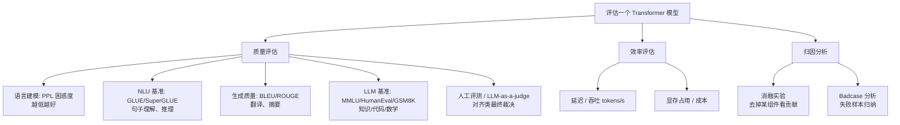

# 21-Transformer 模型训练完成后，如何评估其性能和效果

> [!question] 面试官想考什么
> 考察你是否了解**一套完整评估体系**：质量指标 + 效率指标 + 归因分析。答出层次感（"我按任务分、再按维度分"）就是好答案。

## 🍼 大白话：怎么验收一台"自动翻译机"？

买了台翻译机，你怎么验收？

1. **译得准不准**（质量指标）→ 拿标准答案对，看重合度（BLEU）；或者让真人打分。
2. **答得快不快**（效率指标）→ 测它 1 秒钟能翻译多少字、占用多少内存。
3. **为什么差**（归因分析）→ 找到"总是翻错哪些词"，再看是不是某个零件（位置编码/层数）拖后腿。

评估 Transformer 就是这三层。

## 📖 详细讲解

### 评估体系总览



### 三类指标详解

| 类别 | 具体指标 | 大白话 |
|---|---|---|
| **质量-语言建模** | Perplexity（PPL）、Loss | "猜下一个词"猜得准不准 |
| **质量-理解基准** | GLUE / SuperGLUE | 句子分类、推理能不能过标准考试 |
| **质量-生成基准** | BLEU / ROUGE / METEOR | 翻译/摘要和标准答案重合多少 |
| **质量-LLM 基准** | MMLU、HumanEval、GSM8K | 知识问答、代码、数学 |
| **质量-人工** | 人工打分 / LLM-as-a-judge | 好不好用最终人说了算 |
| **效率** | 延迟、吞吐、显存 | 快不快、省不省 |
| **归因** | 消融实验、badcase 分析 | 哪个零件贡献大、哪里总出错 |

> [!warning] 常见误区（面试加分点）
> - **PPL 低 ≠ 生成好**：PPL 是内部指标，和用户观感可能不一致。
> - **benchmark 高 ≠ 业务好用**：标准题和真实场景有 gap。
> - 所以**工程落地都要补 badcase 分析和人工/对评分评测**。

### 工程落地补充（配合 RAG 等场景）

- RAG 系统评估：**检索命中率 + 端到端准确率**分开看（→ 见学习规划中的 [[面试准备]]）。
- 消融实验：去掉位置编码 / 调 head 数 / 调层数，量化各组件贡献。

## 🎯 面试怎么答（话术模板）

```
"我会从三个层面评估。质量层面按任务分：语言建模看 PPL，
NLU 看 GLUE/SuperGLUE，生成任务看 BLEU/ROUGE，
大模型则看 MMLU、HumanEval 这类 benchmark，
另外还要有针对性的人工评测或 LLM-as-a-judge。
效率层面看推理延迟、吞吐和显存占用。
最后是归因分析，通过消融实验确认各组件贡献，配合 badcase 分析
找到失败模式，因为 PPL 低和 benchmark 高都不完全等于实际好用。"
```

## 🔗 相关知识链接

- 训练数据怎么准备？→ [[20-如何处理大型数据集]]
- 模型"好用"还看什么？→ [[22-Transformer模型的性能瓶颈在哪]]
- 大模型能力评估相关 → [[24-Transformer和LLM有哪些区别]]

---
> [!info] 导航
> 返回 [[Transformer 面试题]] · 上一题 [[20-如何处理大型数据集]] · 下一题 → [[22-Transformer模型的性能瓶颈在哪]]