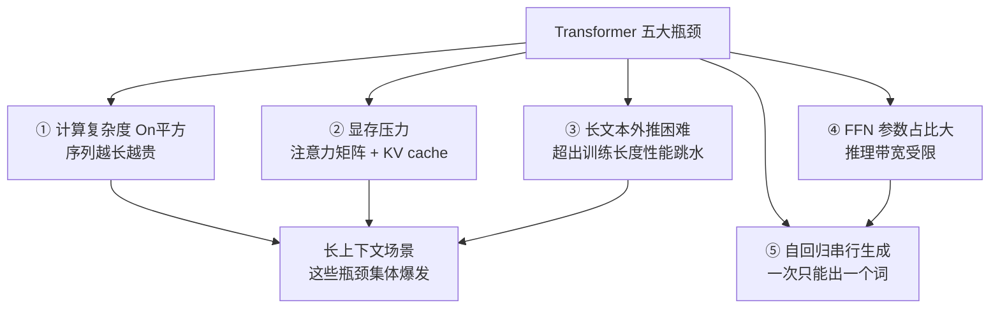

# 22-Transformer 模型的性能瓶颈在哪

> [!question] 面试官想考什么
> 考察你对 Transformer **真实运行时的短板**有没有体感。答出"计算/显存/外推/推理"四个维度，就比背书的候选人高一个档次。

## 🍼 大白话：一辆"性能不错但油耗惊人"的车

Transformer 就像一个**开着很猛但很费油的跑车**：

- 跑短途（短文本）很爽；一旦上高速（长文本），**油耗（计算量）平方级飙升**——因为每个词都要和所有词"眉来眼去"一次。
- 后备箱（显存）也不够大：训练时得先铺一张巨大的"关系网"（注意力矩阵）占地方。
- 出厂只学过硬编码到固定长度，**超长文本它没练过**，容易"翻车"。
- 而且它是**逐词生产**（自回归），不能一次性批发，天生就慢。

## 📖 详细讲解

### 五大瓶颈一览



### 逐条讲解

| # | 瓶颈 | 白话 | 关键点 |
|---|---|---|---|
| ① | **O(n²) 计算** | 每个词都要看所有词 | 注意力矩阵 n×n，翻倍序列=4倍算力 |
| ② | **显存压力** | 训练/推理都吃内存 | 训练存注意力矩阵；推理存 KV cache |
| ③ | **外推困难** | 没练过的长度不会用 | 位置编码/注意力都按训练长度内行为 |
| ④ | **FFN 大参数** | 参数集中在"思考区" | 不含 embedding 时 FFN 可占 2/3 参数 |
| ⑤ | **串行生成** | 只能逐词吐 | 自回归属性 → 延迟受内存带宽限制 |

> [!note] 一句话总结
> 长序列场景是 Transformer 的"阿克琉斯之踵"：计算平方涨、显存平方涨、外推还打折扣。

### 为什么这几个是"瓶颈"而不是小毛病？

- **O(n²)**：决定了 Transformer 在**超长上下文**场景下性价比急剧下降。
- **KV cache**：决定了多轮对话/长文档推理的成本。
- **串行生成**：决定了实时交互的延迟。
- 这三个叠加，就是为什么业界不断研究注意力变体（→ [[23-怎样缓解Transformer的性能瓶颈]]）和 SSM（Mamba 等）的原因。

## 🎯 面试怎么答（话术模板）

```
"Transformer 的主要瓶颈可以总结为四点：
第一，自注意力计算复杂度是 O(n²)，序列长度增加时计算和显存平方级上涨；
第二，显存压力，训练要存注意力矩阵，推理要维护随上下文线性增长的 KV cache；
第三，长文本外推困难，训练长度固定，超长时性能会明显下降；
第四，自回归生成是串行的，推理延迟受限于内存带宽，FFN 参数占比又大。
所以长上下文场景是 Transformer 需要重点优化的地方。"
```

## 🔗 相关知识链接

- 这些瓶颈怎么缓解？→ [[23-怎样缓解Transformer的性能瓶颈]]
- KV cache 占显存的细节 → [[03-Transformer的哪个部分最占用显存]]
- 自回归为什么串行？→ [[17-什么是自回归属性autoregressive-property]]

---
> [!info] 导航
> 返回 [[Transformer 面试题]] · 上一题 [[21-如何评估Transformer的性能和效果]] · 下一题 → [[23-怎样缓解Transformer的性能瓶颈]]