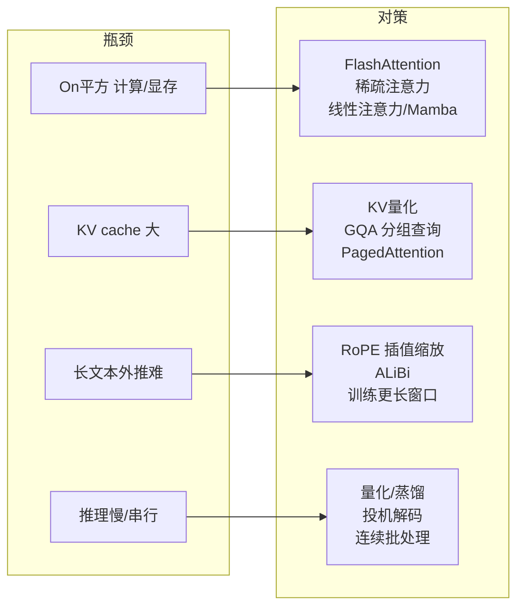

# 23-你觉得可以怎样缓解这个性能瓶颈

> [!question] 面试官想考什么
> 上一题的"解决方案"版。这题是**拉分题**——能按瓶颈逐条给方案、且区分"算法层"和"工程层"的候选人直接高分。

## 🍼 大白话：一辆费油的跑车，怎么改？

针对上题的 5 个瓶颈，改车方案如下：

- **费油（O(n²)）** → 换"省油发动机"：只让关键位置互相关联（稀疏注意力）、或者用 Flash 工艺（FlashAttention 不用囤整张账本）。
- **后备箱小（KV cache 大）** → 把每件行李**压缩**（量化）、少放几份（GQA 分组共享）、按需装卸（vLLM 分页）。
- **没练过长路（外推）** → 换个"能跑长途"的定位系统（RoPE 插值/缩放）。
- **一个字一个字吐（串行）** → 装上"批量流水线"（投机解码），一次多吐几个字。

## 📖 详细讲解

### 瓶颈 → 对策总览（核心图）



### 逐瓶颈给出对策

**① O(n²) 计算 / 显存**
- **FlashAttention**：分块计算注意力，内存 O(n²)→O(n)。
- **稀疏注意力**（Longformer / BigBird）：只让部分 token 对关联。
- **线性注意力 / SSM**（Mamba）：把复杂度压到线性，省电省显存（面试提到=加分）。

**② KV cache 太大**
- **KV Cache 量化**（INT8）：把缓存压缩。
- **GQA / MQA**（分组查询注意力）：多个 head 共享一组 KV，Llama2/3 已标配。
- **PagedAttention（vLLM）**：像操作系统分页一样管理 KV 显存，消除碎片。

**③ 长文本外推**
- **RoPE 位置插值 / NTK 缩放**：让训练过的位置编码"拉伸"覆盖更长序列。
- **ALiBi**：按距离线性惩罚，天然可外推。
- **训练更长上下文窗口**：最直接，但贵。

**④ 推理慢（串行生成）**
- **模型量化**（GPTQ / AWQ / INT4）：缩小模型、加速。
- **蒸馏 / 剪枝**：换成更小但接近的模型。
- **投机解码（Speculative Decoding）**：小模型先猜几个候选，大模型一次验证——加快生成。
- **连续批处理（continuous batching）**：动态拼请求，提高 GPU 利用率。

> [!tip] 高手框架：算法层 vs 工程层
> - **算法层**（改模型本身）：FlashAttention、稀疏/线性注意力、GQA、RoPE 插值、蒸馏。
> - **工程层**（改运行方式）：量化部署、vLLM 分页、连续批处理、模型并行。
> 答题先说"我把它分成算法和工程两层"，立刻显专业。

## 🎯 面试怎么答（话术模板）

```
"我会分算法层和工程层来答。
算法层：针对 O(n²)，可以用 FlashAttention 或稀疏注意力，
更前沿的有线性注意力和 Mamba 这类状态空间模型；
针对 KV cache，用 KV 量化或 GQA 分组查询注意力；
针对外推，用 RoPE 位置插值或 ALiBi。
工程层：推理侧做模型量化、投机解码、连续批处理，
用 vLLM 的 PagedAttention 管理 KV cache，再配合张量并行、
流水线并行和多卡部署。一般会按瓶颈组合使用。"
```

## 🔗 相关知识链接

- 瓶颈具体是哪些？→ [[22-Transformer模型的性能瓶颈在哪]]
- KV cache 为什么大？→ [[03-Transformer的哪个部分最占用显存]]
- 大模型工程部署相关 → [[20-如何处理大型数据集]] · [[24-Transformer和LLM有哪些区别]]

---
> [!info] 导航
> 返回 [[Transformer 面试题]] · 上一题 [[22-Transformer模型的性能瓶颈在哪]] · 下一题 → [[24-Transformer和LLM有哪些区别]]