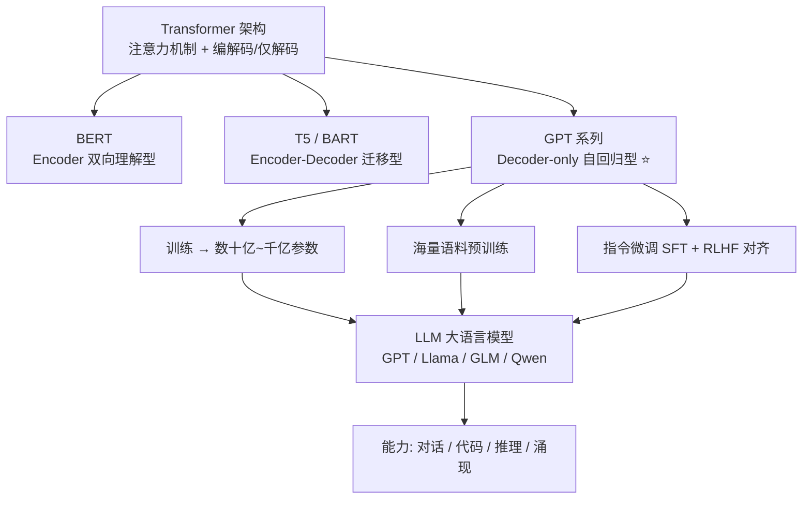

# 24-Transformer 和 LLM 有哪些区别

> [!question] 面试官想考什么
> 考察你对概念边界的**清晰度**。最容易跌的坑：把两者当同义词。记住一句话：**Transformer 是"钢筋骨架"，LLM 是用它盖出的"摩天楼"**。

## 🍼 大白话：图纸 vs 楼房

- **Transformer** = 一张**建筑图纸（架构）**。图纸本身不干任何活，谁拿它盖房子都可以，也可以盖小棚子（小模型）。
- **LLM（大语言模型）** = 用图纸盖出的**超级摩天楼（具体的模型成品）**。它包含巨量的"建材"（参数）、盖了很多层（训练数据），并且经过装修（指令微调、RLHF）后能说会道。

CPU 上一个小小的自注意力 demo 也叫 Transformer；而 "GPT-4" 是一个 LLM——它**内部**用的就是 Transformer 这个图纸。

## 📖 详细讲解

### 关系总览图



### 概念对比表

| 维度 | Transformer（架构） | LLM（大语言模型） |
|---|---|---|
| 本质 | 一种**神经网络架构** | 基于 Transformer 的**大规模训练产物** |
| 规模 | 可小可大（小到玩具） | 通常**≥数十亿参数**、海量语料 |
| 变体 | Encoder / Decoder / Enc-Dec | 主流 **Decoder-only**（GPT、Llama…） |
| 行为 | 不训练就不能用 | 预训练+对齐后有各项能力 |
| 能力界限 | 无"涌现能力"概念 | 有泛化/指令跟随/涌现能力 |

### 重点理解：LLM 从哪里来？

一个 LLM 的诞生 = **架构（Transformer）× 规模（参数）× 数据（语料）× 对齐（SFT/RLHF）**

- **架构**给底座：注意力怎么算、层怎么叠。
- **规模**给能力：参数越多，学到的模式越丰富。
- **数据**给知识：预训练语料决定"见多识广"。
- **对齐**给人设：指令微调 + RLHF 让模型"听话、不越界"。

> [!tip] 记忆锚点
> - 面试被问到直接说："**Transformer 是架构，LLM 是基于该架构的大规模预训练语言模型**"。
> - 补救一句："如果你问的是区别，那就是**图纸 vs 用图纸盖的大楼**。"

## 🎯 面试怎么答（话术模板）

```
"Transformer 是一种神经网络架构，核心是自注意力，有 Encoder、
Decoder、Encoder-Decoder 三种实现形态。
而 LLM 是建立在 Transformer 之上的大规模语言模型：通过数十亿参数、
海量语料预训练，再经过指令微调和 RLHF 对齐，获得了通用的对话、
代码、推理能力。一句话：Transformer 是架构，LLM 是基于该架构
训练出来的具体模型成品。"
```

## 🔗 相关知识链接

- LLM 绝大多数是 Decoder-only → [[17-什么是自回归属性autoregressive-property]]
- GPT 这类模型怎么训练 → [[20-如何处理大型数据集]]
- 架构里的 Encoder 是什么 → [[12-对Transformer的Encoder模块的理解]]

---
> [!info] 导航
> 返回 [[Transformer 面试题]] · 上一题 [[23-怎样缓解Transformer的性能瓶颈]] · 下一题 → [[25-了解ViT吗]]